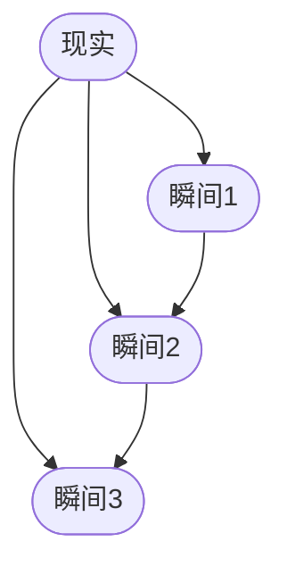
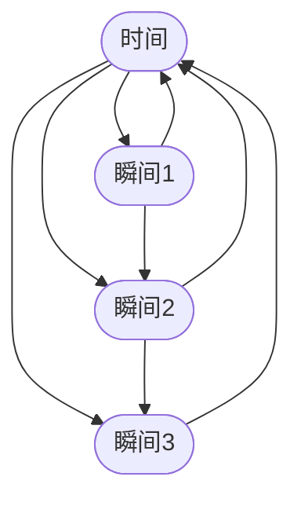
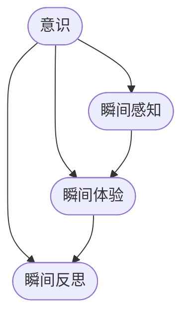
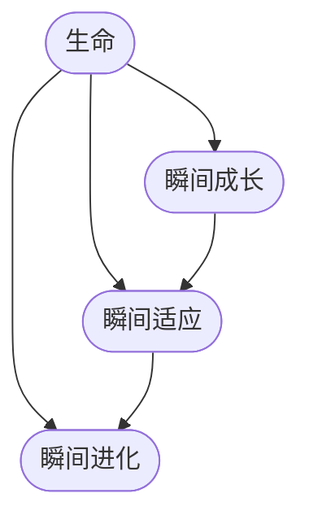

                 


### **一、引言：柏格森与现象学的背景介绍**

**柏格森（Henri Bergson）**，法国哲学家，生于1859年，卒于1941年。他被认为是20世纪最重要的哲学家之一，其哲学思想对当代哲学、心理学、文学、艺术等领域产生了深远的影响。柏格森的主要哲学思想围绕着“持续”（Duration）和“直觉”（Intuition）两个核心概念展开。

**现象学**，起源于19世纪末的德国，是一种哲学运动，致力于研究“现象”——即我们直接感知到的现实。现象学的奠基人是爱德蒙德·胡塞尔（Edmund Husserl）。现象学的目标是揭示我们感知现实的本质，强调直觉在认识中的作用，追求“纯粹意识”的体验。

**柏格森与现象学的联系**在于，他们都强调直觉和感知在认识过程中的重要性。柏格森的持续理论为现象学提供了一种新的解释框架，而现象学的方法则帮助柏格森深入探讨他的哲学观点。

柏格森的持续理论是他对时间和现实的一种独特理解。他认为，时间并不是线性的，而是一种连续的、流动的“持续”。这种持续是现实的基本特征，是我们感知和理解世界的基石。

**二、柏格森的持续理论：概念与哲学基础**

1. **持续性的概念**
   持续性（Duration）是柏格森哲学中的核心概念，指的是一种内在的时间结构，不同于我们所感知的线性时间。柏格森认为，时间并不是一个简单的、线性的序列，而是一种连续的、复杂的流动过程。这种流动过程具有其内在的结构和规律，我们称之为“持续”。

   $$\text{持续性} = \int \frac{d\text{现实}}{dt}$$

   其中，$d\text{现实}$表示现实的变化，$dt$表示时间的流逝。柏格森认为，现实的变化并不是均匀的，而是存在一种内在的节奏和韵律。

2. **持续性与现实的关系**
   柏格森认为，持续性与现实是密不可分的。现实是由无数个瞬间构成的，每个瞬间都是持续性的一个部分。这些瞬间相互作用，形成了我们所感知的现实世界。

   $$\text{现实} = \lim_{n \to \infty} \sum_{i=1}^{n} \text{瞬间}_i$$

   其中，$\text{瞬间}_i$表示第$i$个瞬间。

3. **持续性与时间的关系**
   柏格森的持续理论与传统的时间观念不同。传统观念认为时间是一种线性的、单向的流动，而柏格森则认为时间是一种循环的、反复的过程。在这个过程中，每个瞬间都重新出现，但它们的意义和作用发生了变化。

   $$\text{时间} = \text{持续性的循环}$$

   这个循环是无限的，每个瞬间都在这个循环中不断重生和消失。

**三、柏格森的持续理论对现象学的影响**

柏格森的持续理论对现象学产生了深远的影响。首先，它为现象学提供了一种新的时间观念，即时间并不是线性的，而是一种连续的、流动的“持续”。这种观念挑战了传统的现象学理论，使得现象学能够更深入地探讨时间和现实的本质。

其次，柏格森的持续理论强调了直觉在认识过程中的作用。他认为，直觉是我们感知和理解现实的关键，而现象学则强调通过直觉来揭示现实的本质。

1. **影响之一：持续性与现象学的融合**
   柏格森的持续理论为现象学提供了一种新的解释框架，使得现象学能够更深入地探讨时间和现实的本质。现象学的研究对象是“现象”，即我们直接感知到的现实。柏格森的持续理论认为，现实是由无数个瞬间构成的，每个瞬间都是持续性的一个部分。这种现象学与柏格森的持续理论相契合，使得现象学能够更准确地描述现实的本质。

2. **影响之二：直觉在认识过程中的作用**
   柏格森认为，直觉是我们感知和理解现实的关键。直觉使我们能够超越表面现象，直接感知现实的本质。现象学也强调直觉在认识过程中的作用，认为直觉是我们获取知识的基础。柏格森的持续理论为现象学提供了理论支持，使得现象学能够更深入地探讨直觉在认识过程中的作用。

3. **影响之三：现象学的方法与应用**
   柏格森的持续理论影响了现象学的方法和应用。现象学强调通过直觉来揭示现实的本质，而柏格森的持续理论提供了一种新的解释框架，使得现象学能够更深入地探讨时间和现实的本质。这种方法在当代哲学、心理学、文学、艺术等领域得到了广泛应用。

**四、维特根斯坦对柏格森持续理论的批评**

维特根斯坦（Ludwig Wittgenstein）是20世纪另一位重要的哲学家，他对柏格森的持续理论提出了批评。维特根斯坦认为，柏格森的持续理论在哲学上存在一些问题，主要包括：

1. **语言与现实的割裂**
   维特根斯坦认为，柏格森的持续理论将语言与现实割裂开来。柏格森的持续理论强调直觉在认识过程中的作用，而直觉是一种非语言的体验。这意味着，柏格森的持续理论无法通过语言来准确描述现实。

   $$\text{直觉} \neq \text{语言描述}$$

2. **认识论上的困境**
   维特根斯坦认为，柏格森的持续理论在认识论上存在困境。柏格森的持续理论认为，现实是由无数个瞬间构成的，但这些瞬间是如何被感知和认识的？维特根斯坦认为，这个问题无法得到合理的解释。

   $$\text{瞬间感知} \Rightarrow \text{认识论困境}$$

3. **本体论上的模糊**
   维特根斯坦认为，柏格森的持续理论在本体论上存在模糊。柏格森的持续理论强调现实的流动性和复杂性，但这种流动性是如何实现的？维特根斯坦认为，这个问题无法得到明确的回答。

   $$\text{持续性} \Rightarrow \text{本体论模糊}$$

**五、柏格森与维特根斯坦：对话与比较**

柏格森和维特根斯坦都是20世纪最重要的哲学家之一，他们的哲学思想在很多方面存在对比和对话。

1. **相同之处**
   首先，他们都关注认识论和本体论问题。柏格森的持续理论和维特根斯坦的语言哲学都试图揭示现实和认识的本质。

   其次，他们都强调直觉在认识过程中的作用。柏格森认为，直觉是我们感知和理解现实的关键；维特根斯坦则认为，语言是我们认识世界的基础。

2. **不同之处**
   首先，在时间观念上，柏格森认为时间是连续的、流动的“持续”，而维特根斯坦则认为时间是一种抽象的概念，与直觉和现实无关。

   其次，在认识论上，柏格森强调直觉在认识过程中的作用，而维特根斯坦则认为直觉是一种非语言的现象，无法被准确描述。

   最后，在哲学方法上，柏格森强调哲学的直觉性和创造性，而维特根斯坦则强调哲学的清晰性和严格性。

**六、柏格森持续理论与当代哲学的关联**

柏格森的持续理论在当代哲学中仍然具有重要的意义。首先，它为当代哲学提供了一种新的时间观念，挑战了传统的线性时间观念。这种观念在当代哲学中得到了广泛的应用，特别是在认识论和本体论研究中。

其次，柏格森的持续理论强调了直觉在认识过程中的作用。这种观点在当代哲学中得到了进一步的探讨，特别是在心理学和认知科学领域。

最后，柏格森的持续理论对当代艺术和文学产生了深远的影响。许多艺术家和作家都从柏格森的持续理论中汲取灵感，创作出具有独特风格的作品。

**七、结论：柏格森与维特根斯坦在现象学中的地位**

柏格森和维特根斯坦都是20世纪最重要的哲学家之一，他们在现象学领域具有重要的地位。

柏格森的持续理论为现象学提供了一种新的解释框架，挑战了传统的现象学理论。他的哲学思想在当代哲学中仍然具有重要的意义，对认识论、本体论和艺术等领域产生了深远的影响。

维特根斯坦对柏格森的持续理论提出了批评，他的语言哲学为现象学提供了一种新的视角。他的观点在当代哲学中得到了广泛的认可，对认识论和本体论研究产生了重要的影响。

总之，柏格森和维特根斯坦在现象学领域具有不可替代的地位，他们的哲学思想为当代哲学提供了丰富的资源和思考空间。

---

**作者：AI天才研究院/AI Genius Institute & 禅与计算机程序设计艺术 /Zen And The Art of Computer Programming**

### **二、柏格森的持续理论：概念与哲学基础**

**柏格森的持续理论**是他哲学体系中的核心概念，旨在揭示时间和现实之间的本质联系。柏格森认为，时间并非是一个简单的线性序列，而是一种复杂的、内在的结构，这种结构称为“持续”（Duration）。为了更深入地理解这一理论，我们需要从以下几个方面进行探讨。

**1. 持续性的概念**

柏格森的“持续性”是指时间中的每一个瞬间都具有其独特的存在方式和内在的节奏。这种时间并不是简单的数字或序列，而是一种内在的流动过程。柏格森用了一个比喻来说明这一点：时间就像一条不断流动的河流，每个瞬间都是河流中的一个水滴，虽然水滴在不断地流动和变化，但它们之间仍然保持着某种连续性。

我们可以用下面的 Mermaid 流程图来表示这种概念：

```mermaid
graph TD
    A([持续性的瞬间])
    B([瞬间1])
    C([瞬间2])
    D([瞬间3])
    A --> B
    B --> C
    C --> D
    B --> D suburbs(B,C,D)
```

在这个流程图中，A代表持续性的整体，B、C、D代表连续的瞬间。每个瞬间都在持续性的整体中发挥作用，但它们之间并不是简单的线性关系，而是存在着一种内在的、复杂的结构。

**2. 持续性与现实的关系**

柏格森认为，现实是由无数个瞬间构成的，每个瞬间都是现实的一个组成部分。这些瞬间相互作用，形成了我们所感知的现实世界。我们可以用以下的 Mermaid 流程图来表示这种关系：



在这个流程图中，A代表现实的整体，B、C、D代表不同的瞬间。这些瞬间相互作用，形成了我们所感知的现实。

**3. 持续性与时间的关系**

柏格森认为，时间并不是一个简单的线性序列，而是一种循环的、反复的过程。在这个过程中，每个瞬间都重新出现，但它们的意义和作用发生了变化。我们可以用以下的 Mermaid 流程图来表示这种关系：



在这个流程图中，A代表时间的整体，B、C、D代表不同的瞬间。这些瞬间在时间的循环中不断重生和消失，形成了柏格森所描述的“持续”。

**4. 持续性与意识的关系**

柏格森认为，持续性与我们的意识紧密相关。我们的意识能够感知到时间中的每个瞬间，并体验到这些瞬间之间的内在联系。我们可以用以下的 Mermaid 流程图来表示这种关系：



在这个流程图中，A代表意识的整体，B、C、D代表不同的感知、体验和反思过程。我们的意识通过感知、体验和反思来理解时间中的瞬间，从而形成了对现实的认知。

**5. 持续性与生命的关系**

柏格森认为，持续性与生命过程密切相关。每个生命体都在不断地经历时间的流动，体验着生命的每一个瞬间。这种持续性的体验使得生命体能够适应环境的变化，并不断发展进化。我们可以用以下的 Mermaid 流程图来表示这种关系：



在这个流程图中，A代表生命的整体，B、C、D代表不同的成长、适应和进化过程。生命体通过这些过程来体验和适应时间的流动。

**总结**

柏格森的持续理论为我们提供了一种全新的时间观念，挑战了传统的线性时间观念。通过以上的 Mermaid 流程图，我们可以更清晰地理解持续性的概念、持续性与现实的关系、持续性与时间的关系、持续性与意识的关系以及持续性与生命的关系。这一理论不仅丰富了我们的哲学视野，也为其他学科提供了新的解释框架。在接下来的章节中，我们将进一步探讨柏格森的持续理论对现象学的影响以及维特根斯坦对其的批评。|>

