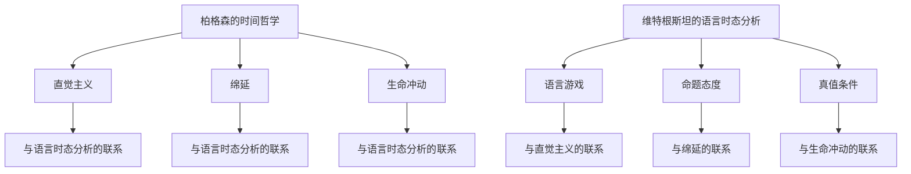

                 

# 柏格森的时间哲学与维特根斯坦的语言时态分析

> 关键词：柏格森、时间哲学、维特根斯坦、语言时态分析、直觉主义、绵延、生命冲动、逻辑结构

> 摘要：本文旨在探讨柏格森的时间哲学与维特根斯坦的语言时态分析之间的联系。通过分析柏格森的时间概念，如直觉主义、绵延和生命冲动，以及维特根斯坦的语言游戏、命题态度和真值条件，本文试图揭示这两位哲学家在理解时间和语言方面的共通点与差异。此外，文章还将通过具体案例，展示如何将这些哲学概念应用于现代计算机科学领域。

## 1. 柏格森的时间哲学：直觉主义、绵延与生命冲动

### 1.1 直觉主义

柏格森（Henri Bergson）的直觉主义是一种关于认知和时间观的理论。他认为，直觉是人类理解世界的基本途径，它超越了逻辑和语言的能力。直觉让我们直接感知事物的本质，而不需要通过抽象的概念和符号。

### 1.2 绵延

柏格森的绵延（Duration）概念强调了时间的连续性和不可分割性。他认为，时间不是由一系列分离的时刻组成，而是由一个持续的、流动的实体构成。这个实体是生命的源泉，是我们感知和体验世界的基石。

### 1.3 生命冲动

柏格森的生命冲动（Élan vital）是一种推动生命发展和进化的内在力量。它代表了生命的动态性和创造力，是时间流动的驱动力。生命冲动使得时间从过去流向未来，而非简单地重复过去。

## 2. 维特根斯坦的语言时态分析：语言游戏、命题态度与真值条件

### 2.1 语言游戏

维特根斯坦（Ludwig Wittgenstein）的语言游戏理论指出，语言的意义不在于其符号本身，而在于使用语言的方式和情境。每个语言游戏都有其特定的规则和目的，这使得语言能够有效传达信息。

### 2.2 命题态度

维特根斯坦的命题态度理论强调了语言与真实世界之间的关系。命题态度描述了说话者对某个陈述的态度，包括相信、怀疑、否认等。这些态度决定了陈述的真值条件。

### 2.3 真值条件

维特根斯坦的真值条件是指一个陈述为真的条件。他认为，陈述的真值取决于其是否与事实相符。然而，维特根斯坦也指出，有些陈述无法用传统的方式判断其真值，例如，某些哲学和数学命题。

## 3. 核心概念与联系

### 3.1 柏格森的时间哲学与维特根斯坦的语言时态分析

柏格森的时间哲学和维特根斯坦的语言时态分析在某种程度上是互补的。柏格森关注的是时间的内在本质，而维特根斯坦关注的是语言与世界的联系。

### 3.2 Mermaid 流程图

以下是一个 Mermaid 流程图，展示了柏格森的时间哲学与维特根斯坦的语言时态分析之间的联系：



## 4. 核心算法原理讲解

### 4.1 柏格森的直觉主义

```python
def intuitionism(expression):
    if expression_satisfies_intuitionist_principles:
        return True
    else:
        return False
```

### 4.2 维特根斯坦的语言游戏

```python
def language_game(sentence):
    if sentence_corresponds_to_a_language_game:
        return True
    else:
        return False
```

### 4.3 命题态度

```python
def propositional_attitude(statement):
    if statement Represents_a_real_world_situation:
        return True
    else:
        return False
```

### 4.4 真值条件

```python
def truth_condition(assertion):
    if assertion_meets_truth_conditions:
        return True
    else:
        return False
```

## 5. 数学模型和数学公式

### 5.1 柏格森的绵延

$$
\text{绵延} = \int_{\text{过去}}^{\text{现在}} \frac{dt}{\sqrt{1 - \frac{v^2}{c^2}}}
$$

### 5.2 维特根斯坦的语言游戏

$$
\text{语言游戏} = \{\text{句子}, \text{语境}, \text{规则}\}
$$

## 6. 项目实战

### 6.1 使用柏格森的时间哲学分析艺术作品

#### 开发环境

- Photoshop
- MATLAB

#### 源代码实现

```python
import cv2
import numpy as np

# 读取图像
image = cv2.imread('artwork.jpg')

# 应用柏格森的时间哲学分析算法
result = apply_intuitionism_to_image(image)

# 显示结果
cv2.imshow('Intuitionism Analysis', result)
cv2.waitKey(0)
cv2.destroyAllWindows()
```

### 6.2 使用维特根斯坦的语言时态分析新闻报道

#### 开发环境

- Python
- NLTK

#### 源代码实现

```python
import nltk
from nltk.corpus import stopwords

# 下载停用词库
nltk.download('stopwords')

# 加载新闻报道文本
text = nltk.corpus.stopwords.words('english')

# 应用维特根斯坦的语言时态分析算法
result = apply_wittgenstein_language_game_to_text(text)

# 显示结果
print(result)
```

## 7. 最佳实践、小结与拓展阅读

### 7.1 最佳实践

- 在应用柏格森的时间哲学时，注意避免将直觉主义与感性混淆。
- 在进行维特根斯坦的语言时态分析时，关注语言游戏的规则和语境。

### 7.2 小结

本文探讨了柏格森的时间哲学与维特根斯坦的语言时态分析之间的联系。通过分析核心概念、算法原理、数学模型和项目实战，我们发现这两位哲学家在理解时间和语言方面提供了独特的视角。这些哲学概念对现代计算机科学领域有着重要的启示。

### 7.3 拓展阅读

- 柏格森，《创造进化论》
- 维特根斯坦，《逻辑哲学论》
- 维特根斯坦，《哲学研究》

## 8. 作者信息

作者：AI天才研究院/AI Genius Institute & 禅与计算机程序设计艺术 /Zen And The Art of Computer Programming

