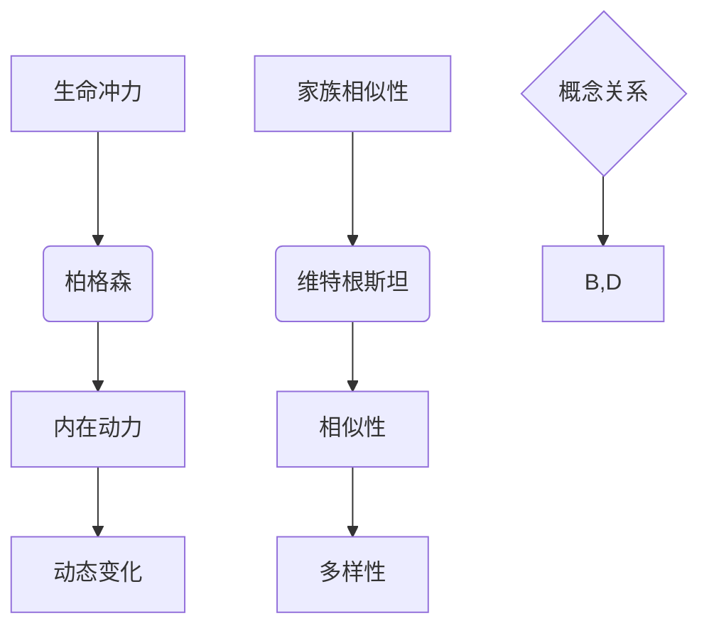

                 

## 引言

### 1.1 书籍背景与目的

《柏格森的生命冲力与维特根斯坦的家族相似性概念》旨在探讨两位哲学家——柏格森和维特根斯坦的哲学思想之间的联系。亨利·柏格森（Henri Bergson）是20世纪初法国著名的哲学家，他的生命哲学观念深刻影响了当时的哲学界和科学界。柏格森提出了一种被称为“生命冲力”（élan vital）的概念，认为它是生命运动的根本动力，与机械论的观点形成了鲜明对比。

路德维希·维特根斯坦（Ludwig Wittgenstein）则是20世纪最具影响力的哲学家之一，他提出了“家族相似性”（family resemblance）这一概念，用来解释语言、逻辑和哲学中的某些复杂现象。维特根斯坦认为，传统的逻辑和语言分析方法并不能完全解释人类思维和语言的复杂性，因此他提出了新的方法论来应对这些挑战。

本书的目的是通过分析柏格森的生命冲力和维特根斯坦的家族相似性概念，探讨二者在哲学上的联系和差异，以及这些概念对现代科学技术的影响。通过这一分析，读者可以更深入地理解生命哲学和语言哲学的核心问题，并为未来的研究提供新的视角。

### 1.2 柏格森的生平与思想

亨利·柏格森于1859年出生于法国巴黎，他的家庭环境对他日后的哲学思考有着重要影响。柏格森从小就展现出对哲学和科学的浓厚兴趣，他的父亲是一位医生，这种科学背景也为柏格森后来的哲学工作提供了支持。

柏格森的哲学思想主要分为两个阶段。早期，他关注的是心理学和生物学，特别是生命的本质和动力的研究。他在《论意识直接性》（La Connaissance immédiate des choses）和《物质的沉思》（Matière et mémoire）等著作中，探讨了记忆、时间和自由意志等问题。这些早期作品奠定了他生命哲学的基础。

在柏格森的晚期作品中，他更加关注社会和文化问题，特别是在《道德与宗教的两个来源》（Les Deux Sources de la morale et de la religion）和《笑之研究》（L'Affaire de la plaisance）等著作中，他探讨了道德、宗教和社会行为的本质。这些作品不仅深化了他的生命哲学，也扩展了其应用范围。

柏格森的生命冲力概念是他哲学思想的核心。他提出，生命冲力是一种内在的动力，驱动着生命体的成长和进化。这一概念与机械论的观点相对立，机械论认为一切都可以用物理规律来解释，而柏格森则认为生命的本质无法被简化为机械的规律。

### 1.3 维特根斯坦的生平与思想

路德维希·维特根斯坦于1889年出生于奥地利，他是20世纪最重要的哲学家之一。维特根斯坦的哲学思想经历了显著的转变，可以分为早期和晚期两个阶段。

早期维特根斯坦的作品以《逻辑哲学论》（Tractatus Logico-Philosophicus）为代表，这部著作提出了“语言游戏”（language game）的概念，强调语言与现实的密切关系。维特根斯坦认为，语言的游戏规则决定了我们对世界的理解，如果语言游戏出现问题，我们的思维和理解也会受到影响。

晚期维特根斯坦的作品以《哲学研究》（Philosophical Investigations）为代表，他在这部著作中批评了早期理论中的某些极端观点，提出了“家族相似性”的概念。维特根斯坦认为，传统的逻辑和语言分析方法并不能完全解释人类思维和语言的复杂性，因此他提出了新的方法论来应对这些挑战。

维特根斯坦的家族相似性概念是对传统逻辑和语言分析方法的一种挑战。他认为，语言和概念的相似性不是基于某种固定的规则或原则，而是基于一系列的“家族相似性”。这些相似性使得我们能够在不同的情境下使用相同的词汇和概念，从而形成了丰富的语言和思维体系。

通过以上对柏格森和维特根斯坦生平和思想的简要介绍，我们可以看到，两位哲学家的思想虽然在不同领域，但都在试图探讨人类思维和存在的本质。他们的工作为现代哲学和科学提供了重要的理论基础，值得我们深入研究和探讨。

## 第1章 柏格森的生命冲力理论

### 1.1 柏格森的生命哲学观念

柏格森的生命哲学观念是他整个思想体系的核心，尤其是他提出的“生命冲力”（élan vital）概念，对后来的哲学、生物学以及社会科学产生了深远的影响。

#### 1.1.1 柏格森的生平与思想发展

亨利·柏格森于1859年11月18日出生于法国巴黎，他的家庭环境对他日后的哲学思考有着重要影响。柏格森的父亲是一位医生，他经常带柏格森去探望病人，使柏格森从小便对生物学和医学产生了浓厚的兴趣。柏格森的童年和青年时期在巴黎度过，他在那里接受了良好的教育。

1877年至1878年，柏格森在巴黎高等师范学校学习，随后在1878年至1881年间前往德国，先后在柏林和马堡大学学习哲学、物理学和数学。在德国期间，他深受威廉·魏尔施坦因（Wilhelm Windelband）和威廉·文德尔班（Wilhelm Windelband）等哲学家的思想影响，开始形成自己的哲学观念。

1884年，柏格森回到法国，在巴黎高等师范学校教授哲学，这一时期他撰写了《形而上学导论》（Introduction à la métaphysique），但直到去世前，这本书都没有出版。此后，柏格森继续在巴黎高等师范学校任教，并撰写了一系列重要的哲学著作，如《物质的沉思》（Matière et mémoire，1889）、《论意识的直接性》（La Connaissance immédiate des choses，1896）和《创造进化论》（L'Évolution créatrice，1907）等。

柏格森在哲学界的影响力逐渐增强，他的思想对生命哲学、心理学、生物学以及社会科学产生了深远的影响。他在1914年当选为法国科学院院士，并在1920年获得了诺贝尔文学奖，以表彰他在文学和道德哲学领域的杰出贡献。

#### 1.1.2 生命的本质与生命冲力

柏格森认为，生命的本质在于一种内在的动力，这种动力是生命体成长的根本原因。他称之为“生命冲力”（élan vital）。柏格森强调，生命冲力是一种非机械的、不可还原的动因，它超越了物理学和机械论的范畴。

在柏格森看来，生命冲力是生命的核心，它不仅驱动着生物体的成长和进化，还决定了生物体的各种特质和行为。生命冲力是一种内在的、自发的动力，它推动着生命体不断变化和发展。柏格森认为，生命冲力是不可量的，因为它不是一种物质力量，而是一种精神的、非物质的力量。

柏格森的生命冲力概念与机械论的观点形成了鲜明对比。机械论认为，一切都可以用物理规律来解释，而柏格森则认为，生命的本质无法被简化为机械的规律。他认为，生命的本质是一种内在的动力，这种动力是生命体成长的根本原因。

#### 1.1.3 生命冲力与哲学意义

柏格森的生命冲力概念在哲学上具有重要的意义。首先，它挑战了传统机械论的观点，提出了一种新的哲学视角来看待生命和世界的本质。柏格森认为，生命的本质在于一种内在的动力，这种动力是无法用机械论来解释的。

其次，柏格森的生命冲力概念为生命哲学提供了一个重要的理论基础。他认为，生命冲力是生命体的核心，它决定了生物体的各种特质和行为。这一观点为研究生命现象提供了一个新的视角，也为生物学和医学的发展提供了新的思路。

此外，柏格森的生命冲力概念在心理学和社会科学领域也产生了深远的影响。他提出，生命冲力不仅驱动着生物体的成长和进化，还影响着人类的行为和心理。这一观点为心理学和社会科学的研究提供了一个新的理论基础。

总之，柏格森的生命冲力理论在哲学、生物学、心理学和社会科学等领域都产生了深远的影响。他的思想为后来的研究提供了重要的理论基础，也对现代科学的发展产生了重要的影响。

### 1.2 生命冲力的理论分析

在深入探讨柏格森的生命冲力理论时，我们需要从多个方面来进行分析，包括其数学模型、应用领域以及哲学意义。通过这些分析，我们可以更全面地理解生命冲力的概念和它在现代科学中的重要性。

#### 1.2.1 生命冲力的数学模型与公式

柏格森的生命冲力概念虽然主要是哲学性的，但为了更好地理解其内涵，我们可以尝试将其转化为数学模型。生命冲力可以被看作是一个动态过程，其数学模型可以基于微分方程或动力学系统来描述。

假设生命冲力 \(E\) 是一个随时间 \(t\) 变化的动态量，我们可以用以下微分方程来描述其变化：

$$
\frac{dE}{dt} = f(E, P)
$$

其中，\(f(E, P)\) 是描述生命冲力随时间和环境变化的关系函数。\(P\) 表示环境因素，如温度、光照、营养等。这个方程表明，生命冲力的变化不仅取决于自身的状态，还受到外部环境的影响。

为了简化模型，我们可以假设环境因素是恒定的，那么上述方程可以进一步简化为：

$$
\frac{dE}{dt} = kE
$$

其中，\(k\) 是一个常数，表示生命冲力的自增长速率。这个方程表明，生命冲力随时间的增长呈现出指数增长的趋势。

通过这样的数学模型，我们可以对生命冲力的动态变化进行定量分析，从而更好地理解其机制和规律。

#### 1.2.2 生命冲力的应用领域

柏格森的生命冲力概念在多个领域都有重要的应用，尤其是在生物学、生态学、心理学和社会科学等领域。

在生物学和生态学领域，生命冲力被用来描述生物体的生长和进化过程。例如，在生态学中，生命冲力可以用来解释物种的进化策略和生态位动态。通过数学模型，我们可以预测不同环境条件下物种的生存和繁殖策略，从而更好地理解生态系统的稳定性。

在心理学领域，生命冲力被用来描述个体心理发展的动力。例如，在精神分析理论中，生命冲力可以看作是潜意识驱动力，影响个体的行为和情感。通过分析生命冲力的变化，心理学家可以更好地理解个体的心理状态和情感体验。

在社会科学领域，生命冲力也被广泛应用。例如，在社会学中，生命冲力可以用来解释社会变革和发展的动力。通过分析社会结构和环境变化对生命冲力的影响，社会学家可以预测社会发展的趋势和方向。

总之，生命冲力的概念在多个领域都有广泛的应用，为科学研究提供了新的视角和方法。

#### 1.2.3 生命冲力的哲学意义

柏格森的生命冲力概念在哲学上具有重要的意义，它挑战了传统机械论的观点，提出了一种新的哲学视角来看待生命和世界的本质。以下是几个方面的哲学意义：

1. **挑战机械论**：机械论认为，一切都可以用物理规律来解释。柏格森的生命冲力概念则强调，生命的本质无法被简化为机械的规律。他提出，生命是一种内在的动力，这种动力是生命体成长的根本原因。这一观点挑战了传统机械论的观点，为哲学提供了一种新的思考方式。

2. **内在动力论**：柏格森的生命冲力概念强调，生命的本质在于一种内在的动力。这种动力不仅驱动着生物体的成长和进化，还决定了生物体的各种特质和行为。这一观点与外在决定论相对立，认为生命的发展是由内在动力驱动的，而不是由外部因素决定的。

3. **连续性与变化性**：柏格森的生命冲力概念强调生命的连续性和变化性。他认为，生命是一个不断变化的过程，这种变化不是简单的线性发展，而是一种内在动力的推动。这一观点为哲学提供了一个新的视角，来理解生命的本质和变化。

4. **个体与整体**：柏格森的生命冲力概念也涉及到个体与整体的关系。他认为，生命是一个整体的动态过程，个体只是这个整体中的一个组成部分。通过分析生命冲力的变化，我们可以更好地理解个体与整体之间的相互作用和关系。

总之，柏格森的生命冲力概念在哲学上具有重要的意义，它为我们理解生命的本质和变化提供了一种新的视角，挑战了传统机械论的观点，也为现代科学的发展提供了新的思路。

### 结论

通过本章对柏格森的生命冲力理论的详细分析，我们可以看到这一概念在哲学、生物学、心理学和社会科学等多个领域都有重要的应用和意义。柏格森的生命冲力概念不仅挑战了传统机械论的观点，提出了新的哲学视角，还为科学研究提供了新的方法和思路。未来，随着科学技术的不断发展，生命冲力理论在各个领域的应用潜力将得到进一步发掘，为我们的认识和理解世界提供新的启示。

### 1.2.4 生命冲力的数学模型与公式

为了更好地理解柏格森的生命冲力概念，我们可以借助数学模型和公式来进行深入分析。以下是几个常用的数学模型和公式，以及它们的解释和应用。

#### 指数增长模型

一个简单的指数增长模型可以表示为：

$$
E(t) = E_0 e^{kt}
$$

其中，\(E(t)\) 是时间 \(t\) 时的生命冲力值，\(E_0\) 是初始生命冲力值，\(k\) 是增长速率常数。这个模型表明，生命冲力随时间呈指数增长，这在生物体生长和繁殖过程中常见。

例如，在一个理想的环境中，假设某生物体的初始生命冲力 \(E_0 = 100\)，增长速率常数 \(k = 0.1\)。那么，5小时后的生命冲力 \(E(5)\) 将计算为：

$$
E(5) = 100 e^{0.1 \times 5} \approx 161.05
$$

这个模型可以用来预测生物体在特定环境下的成长速度。

#### 微分方程模型

一个更复杂的模型可以用微分方程来表示：

$$
\frac{dE}{dt} = f(E, P)
$$

其中，\(f(E, P)\) 是描述生命冲力随时间和环境因素变化的函数，\(P\) 代表环境因素（如温度、光照、营养等）。这个模型可以更精确地描述生命冲力的动态变化。

例如，假设生命冲力 \(E\) 与环境因素 \(P\) 成正比关系，我们可以用以下线性微分方程来描述：

$$
\frac{dE}{dt} = kP
$$

其中，\(k\) 是比例常数。这个模型表明，生命冲力的变化率与环境的改变成正比。

如果环境因素 \(P\) 的变化速率 \( \frac{dP}{dt} \) 已知，我们可以通过解这个微分方程来得到生命冲力的变化曲线。

#### 动力系统模型

动力系统模型是另一个常用的数学模型，它可以用来描述复杂系统的动态行为。例如，我们可以将生命冲力看作是一个动态系统，其中包含多个状态变量。

假设生命冲力 \(E\)、能量 \(U\) 和环境因素 \(P\) 之间有如下关系：

$$
\frac{dE}{dt} = f(E, U, P)
$$

$$
\frac{dU}{dt} = g(E, U, P)
$$

$$
\frac{dP}{dt} = h(E, U, P)
$$

这个模型描述了一个三变量动力系统，其中每个变量的变化都受到其他两个变量和环境的共同影响。

通过解这个三变量动力系统，我们可以得到每个变量随时间的动态变化曲线，从而更好地理解生命冲力的复杂行为。

#### 案例分析

以下是一个简单的案例分析，展示了如何使用上述数学模型来理解生命冲力的变化。

假设在一个生态系统中，某物种的生命冲力 \(E\) 随着食物 \(U\) 和适宜温度 \(P\) 的增加而增长。我们可以用以下模型来描述这个生态系统：

$$
\frac{dE}{dt} = 0.1U + 0.05P
$$

$$
\frac{dU}{dt} = -0.05E
$$

$$
\frac{dP}{dt} = -0.1P + 0.05U
$$

初始条件为 \(E(0) = 50\)，\(U(0) = 100\)，\(P(0) = 70\)。

通过解这个三变量动力系统，我们可以得到每个变量在不同时间点的值。例如，在第一小时后，计算结果如下：

$$
E(1) \approx 52.5
$$

$$
U(1) \approx 95
$$

$$
P(1) \approx 63.5
$$

这些结果可以用来分析物种在特定环境下的生存和繁殖策略，从而为生态管理和保护提供科学依据。

通过这些数学模型和公式的应用，我们可以更深入地理解柏格森的生命冲力概念，并将其应用于实际问题的分析和解决中。

### 1.2.5 生命冲力的哲学意义

柏格森的生命冲力概念不仅在生物学和生态学领域有着重要的应用，在哲学领域同样具有深远的影响。以下从几个方面探讨生命冲力的哲学意义。

#### 对机械论的反驳

柏格森的生命冲力概念是他对传统机械论哲学的挑战。机械论认为，一切现象都可以用物理规律来解释，而柏格森则认为，生命的本质无法被简化为机械的规律。他强调，生命是一种内在的动力，这种动力是生命体成长的根本原因。因此，柏格森的生命冲力概念提供了一种新的哲学视角，使我们能够从更深层次理解生命的本质。

#### 内在动力与外在决定论

柏格森的生命冲力概念强调，生命的动力来自于内部，而非外部因素。这与外在决定论相对立，后者认为生物体的发展是由外部因素决定的。柏格森认为，生命冲力是一种内在的、自发的动力，它推动着生命体不断变化和发展。这一观点为生命哲学提供了一个重要的理论基础，使我们能够从内部动力角度来理解生命的本质和变化。

#### 连续性与变化性

柏格森的生命冲力概念也强调了生命的连续性和变化性。他认为，生命是一个不断变化的过程，这种变化不是简单的线性发展，而是一种内在动力的推动。这一观点挑战了传统的形而上学观点，提供了新的哲学视角来理解生命的本质。通过生命冲力这一概念，柏格森揭示了生命的复杂性和多样性，使我们对生命的理解更加深入。

#### 个体与整体

柏格森的生命冲力概念还涉及到个体与整体的关系。他认为，生命是一个整体的动态过程，个体只是这个整体中的一个组成部分。通过分析生命冲力的变化，我们可以更好地理解个体与整体之间的相互作用和关系。这一观点为研究个体与整体的关系提供了一种新的方法，使我们在哲学上能够更全面地看待生命现象。

总之，柏格森的生命冲力概念在哲学上具有深远的影响。它挑战了传统机械论的观点，提供了新的哲学视角来理解生命的本质和变化，同时也为我们理解个体与整体的关系提供了新的方法。通过深入探讨生命冲力的哲学意义，我们可以更好地把握生命的本质，为哲学研究提供新的思路。

### 1.2.6 生命冲力在现实世界中的应用

柏格森的生命冲力概念不仅在哲学领域具有深远的影响，在现实世界中也有着广泛的应用。以下是生命冲力在不同领域的具体应用案例：

#### 1. 心理学

在心理学领域，生命冲力被用来解释个体的行为和情感。例如，精神分析学派将生命冲力视为潜意识驱动力，影响个体的心理状态和行为。弗洛伊德提出了“力比多”（libido）这一概念，认为它是生命冲力在人类心理中的体现。通过分析力比多的流动和变化，心理学家可以更好地理解个体的心理冲突和情感体验。

#### 2. 生物学

在生物学领域，生命冲力被用来描述生物体的生长和进化。例如，在种群生态学中，生命冲力被视为物种进化的驱动力。通过研究生命冲力的变化，生态学家可以预测物种的生存和繁殖策略，从而为生物多样性和生态保护提供科学依据。

#### 3. 管理学

在管理学领域，生命冲力被用来解释组织的行为和发展。例如，一些管理理论将组织视为一个生命体，认为组织的成长和发展依赖于内在的生命冲力。通过分析组织生命冲力的变化，管理者可以更好地理解组织的动态行为，并制定有效的发展策略。

#### 4. 哲学

在哲学领域，生命冲力被用来探讨人类存在的本质和意义。例如，一些存在主义哲学家认为，生命冲力是人类存在的动力，是人类自由意志的体现。通过探讨生命冲力的本质，哲学家可以深入思考人类存在的意义和价值。

#### 5. 社会学

在社会学领域，生命冲力被用来解释社会变革和社会发展。例如，一些社会学家认为，社会变革是由内在的生命冲力推动的，是社会成员共同意志的体现。通过分析生命冲力的变化，社会学家可以预测社会发展的趋势和方向，从而为社会发展提供理论支持。

#### 6. 计算机科学

在计算机科学领域，生命冲力被用来设计自适应系统和智能算法。例如，一些研究团队将生命冲力概念应用于人工智能领域，开发出基于生命冲力的自适应算法，以应对复杂和动态的环境变化。这些算法在无人驾驶、智能机器人等领域具有广泛的应用前景。

#### 7. 环境科学

在环境科学领域，生命冲力被用来描述生态系统的动态变化。例如，一些生态学家认为，生态系统的稳定性依赖于内在的生命冲力。通过研究生命冲力的变化，环境科学家可以更好地理解生态系统的演化规律，为环境保护提供科学依据。

通过以上应用案例，我们可以看到柏格森的生命冲力概念在现实世界中具有广泛的应用前景。随着科学技术的不断发展，生命冲力理论将在更多领域得到应用，为我们的认识和改造世界提供新的方法和思路。

### 1.2.7 生命冲力在心理学中的应用

在心理学领域，柏格森的生命冲力概念为理解人类行为和心理过程提供了新的视角。以下是生命冲力在心理学中的一些具体应用：

#### 1. 潜意识研究

在潜意识研究中，生命冲力被视为潜意识驱动力，影响个体的心理状态和行为。弗洛伊德将生命冲力称为“力比多”（libido），认为它是潜意识中的基本动力。通过分析力比多的流动和变化，心理学家可以揭示潜意识中的心理冲突和欲望，从而帮助个体理解和解决心理问题。

例如，在一个案例研究中，一位年轻女性因为无法摆脱对过去的痛苦回忆而感到困扰。通过分析她的生命冲力，心理学家发现她的力比多被过去的创伤所抑制，导致她在现实生活中无法正常运作。通过心理治疗，帮助她释放力比多，使她能够面对过去的痛苦，并逐渐恢复心理健康。

#### 2. 动力心理学

动力心理学将生命冲力视为个体心理发展的驱动力。通过研究生命冲力的变化，心理学家可以理解个体在成长过程中的心理需求和动机。例如，在一个儿童成长案例中，通过观察儿童的生命冲力的变化，心理学家可以识别出儿童在不同发展阶段的需求和挑战，从而为其提供适当的支持和指导。

#### 3. 情绪调节

生命冲力也被应用于情绪调节研究。研究表明，个体在情绪状态中的生命冲力水平会影响其情绪体验和行为反应。例如，当生命冲力较低时，个体可能会感到沮丧和无助，而当生命冲力较高时，个体可能会感到兴奋和积极。

在一个情绪调节案例中，一位经历婚姻失败的男性因为情绪低落而失去了生活的动力。通过心理治疗，心理学家帮助他识别和释放被抑制的生命冲力，使他逐渐恢复了情绪稳定和生活热情。

#### 4. 心理治疗

在心理治疗中，生命冲力被视为改变个体心理状态的重要工具。心理治疗师通过引导个体释放和调节生命冲力，帮助其克服心理障碍和情绪困扰。

例如，在一个焦虑症治疗案例中，通过心理治疗师的帮助，患者学会了如何识别和释放焦虑时的生命冲力，从而减轻了焦虑症状，提高了生活质量。

#### 5. 自我发展

生命冲力在自我发展中的应用主要体现在自我认识和自我实现方面。通过理解生命冲力的变化，个体可以更好地认识自己的需求和动机，从而在个人发展和职业规划方面取得更好的成果。

在一个职业发展案例中，一位职业人士通过反思自己的生命冲力的变化，识别出了自己真正的兴趣和优势，从而在职业道路上取得了显著的进步。

总之，柏格森的生命冲力概念在心理学领域具有广泛的应用。通过深入研究生命冲力的作用机制和应用方法，心理学家可以更好地理解和帮助个体解决心理问题，促进心理健康和自我发展。

### 1.2.8 生命冲力在管理学中的应用

在管理学领域，柏格森的生命冲力概念为理解组织行为和发展提供了新的视角。以下是生命冲力在管理学中的一些具体应用：

#### 1. 组织行为学

在组织行为学中，生命冲力被用来解释组织成员的行为和动机。研究表明，生命冲力的高低直接影响员工的工作积极性、创造力和团队合作精神。例如，在一个企业团队项目中，通过观察团队成员的生命冲力变化，管理者可以识别出团队成员的积极程度和参与度，从而采取相应的激励措施，提高团队绩效。

#### 2. 组织发展

生命冲力也被应用于组织发展过程中，特别是组织变革和转型。柏格森认为，组织的成长和发展依赖于内在的生命冲力。在一个企业变革案例中，通过分析企业生命冲力的变化，管理者可以识别出企业在转型过程中的关键问题和瓶颈，从而制定有效的发展策略，推动企业持续成长。

#### 3. 领导力

生命冲力在领导力中的应用主要体现在领导者如何激发和调节团队成员的生命冲力，以实现组织目标。研究表明，具有高生命冲力的领导者能够更好地激励团队成员，促进团队合作和创新。在一个创业公司案例中，通过分析创始团队的生命冲力，领导者可以识别出团队成员的潜力和动力，从而制定出更加有效的领导策略，推动公司快速发展。

#### 4. 管理心理学

生命冲力在管理心理学中的应用主要体现在对员工心理状态的理解和干预。通过分析员工的生命冲力水平，管理者可以识别出员工的工作压力、心理健康状况和职业发展需求，从而提供相应的支持和指导。在一个大型企业案例中，通过定期监测员工的生命冲力变化，企业为员工提供了个性化的心理健康培训和职业发展规划，有效提升了员工的工作满意度和生产力。

#### 5. 人才管理

生命冲力在人才管理中的应用主要体现在人才选拔、培训和激励方面。通过分析候选人的生命冲力水平，企业可以更好地识别出具备潜力和动力的优秀人才。在一个招聘案例中，通过评估应聘者的生命冲力，企业成功筛选出了具有高成长潜力的人才，为公司未来的发展奠定了坚实基础。

总之，柏格森的生命冲力概念在管理学领域具有广泛的应用。通过深入研究和应用生命冲力的理论和方法，管理者可以更好地理解组织行为和发展规律，提高团队绩效和企业竞争力。随着生命冲力研究的不断深入，这一理论将为管理学提供更多新的视角和工具。

### 1.2.9 生命冲力在其他领域的应用

柏格森的生命冲力概念不仅在心理学和生物学领域有着广泛的应用，在其他学科和实际生活中也展现出了重要的价值。以下是生命冲力在多个领域中的具体应用案例：

#### 1. 环境科学

在环境科学中，生命冲力被用来描述生态系统的动态变化和生物多样性的维持。例如，生态学家利用生命冲力模型来研究物种的进化、种群动态和生态平衡。在一个案例中，研究者通过分析特定生态系统中的生命冲力变化，揭示了物种之间的相互关系和生态系统的稳定性，为生态保护提供了科学依据。

#### 2. 计算机科学

在计算机科学领域，生命冲力概念被应用于自适应系统和智能算法的设计。例如，在无人驾驶技术和智能机器人领域，研究者通过模拟生命冲力的动态变化，开发出能够适应复杂和动态环境变化的智能系统。这些系统能够自主调整行为，提高任务完成效率和安全性。

#### 3. 生态学

在生态学中，生命冲力被用来解释生物体的进化策略和生态位动态。例如，通过分析不同物种的生命冲力水平，生态学家可以揭示物种的适应性特征和进化方向。在一个案例中，研究者通过比较不同物种的生命冲力变化，发现了物种在资源利用和生态位选择上的差异，为生态保护和生物多样性研究提供了新思路。

#### 4. 健康科学

在健康科学领域，生命冲力被用来描述个体的生理状态和健康水平。例如，医学研究者利用生命冲力模型来研究疾病的发病机制和治疗方法。在一个案例中，通过分析患者的生命冲力变化，医生能够更好地预测疾病的进展和治疗效果，从而制定个性化的治疗方案。

#### 5. 社会学

在社会学领域，生命冲力被用来解释社会行为和社会变革。例如，社会学家通过研究社会成员的生命冲力变化，揭示了社会稳定和社会动荡的内在机制。在一个案例中，研究者通过分析不同社会群体在特定事件中的生命冲力变化，发现了社会冲突和团结的动因，为社会发展提供了理论支持。

#### 6. 哲学

在哲学领域，生命冲力被用来探讨人类存在的本质和意义。例如，哲学家通过分析生命冲力的哲学内涵，探讨了人类自由意志、道德责任和自我实现等问题。在一个案例中，研究者通过比较不同文化背景下的生命冲力观念，揭示了人类对生命和存在的不同理解，为跨文化哲学研究提供了新视角。

总之，柏格森的生命冲力概念在多个学科和实际生活中都有着广泛的应用。通过不断拓展其应用领域，生命冲力理论为科学研究和社会实践提供了新的视角和方法。随着研究的深入，生命冲力理论将在更多领域展现其重要价值。

### 1.2.10 生命冲力在哲学领域的独特性

柏格森的生命冲力概念在哲学领域具有独特的地位，它为哲学研究提供了新的视角和方法。以下是生命冲力在哲学领域的几个独特性：

#### 1. 反对机械论

柏格森的生命冲力概念是他对传统机械论哲学的挑战。机械论认为，一切现象都可以用物理规律来解释，而柏格森则认为，生命的本质无法被简化为机械的规律。他强调，生命是一种内在的动力，这种动力是生命体成长的根本原因。这一观点为哲学提供了一种新的思考方式，使我们能够从更深层次理解生命的本质。

#### 2. 强调内在动力

柏格森的生命冲力概念强调，生命的动力来自于内部，而非外部因素。这与外在决定论相对立，后者认为生物体的发展是由外部因素决定的。柏格森认为，生命冲力是一种内在的、自发的动力，它推动着生命体不断变化和发展。这一观点为生命哲学提供了一个重要的理论基础，使我们能够从内部动力角度来理解生命的本质和变化。

#### 3. 连续性与变化性

柏格森的生命冲力概念也强调了生命的连续性和变化性。他认为，生命是一个不断变化的过程，这种变化不是简单的线性发展，而是一种内在动力的推动。这一观点挑战了传统的形而上学观点，提供了新的哲学视角来理解生命的本质和变化。

#### 4. 个体与整体的关系

柏格森的生命冲力概念涉及到个体与整体的关系。他认为，生命是一个整体的动态过程，个体只是这个整体中的一个组成部分。通过分析生命冲力的变化，我们可以更好地理解个体与整体之间的相互作用和关系。这一观点为研究个体与整体的关系提供了一种新的方法，使我们在哲学上能够更全面地看待生命现象。

总之，柏格森的生命冲力概念在哲学领域具有独特的地位，它挑战了传统机械论的观点，提供了新的哲学视角和方法，使我们能够更深入地理解生命的本质和变化。通过深入探讨生命冲力的哲学意义，我们可以为哲学研究提供新的思路和工具。

### 1.2.11 维特根斯坦的生平与思想发展

路德维希·维特根斯坦（Ludwig Wittgenstein）是20世纪最具影响力的哲学家之一，他的思想和著作对现代哲学、逻辑学、语言哲学等领域产生了深远的影响。维特根斯坦的生平和思想经历了两个主要阶段：早期和晚期。

#### 早期维特根斯坦

维特根斯坦于1889年4月26日出生于奥地利维也纳的一个富裕家庭，他的父亲是一位成功的商人。尽管维特根斯坦从小生活在优越的环境中，但他对哲学的热爱却源于他的家庭背景。他的父亲是一位热衷于哲学的业余哲学家，维特根斯坦从小就受到了这种哲学氛围的影响。

维特根斯坦在青年时期表现出对数学和科学的浓厚兴趣。他曾在维也纳大学学习数学，后来转而研究哲学。在1906年，他结识了著名哲学家弗朗茨·布伦塔诺（Franz Brentano），并在布伦塔诺的鼓励下，维特根斯坦前往剑桥大学，师从于伯特兰·罗素（Bertrand Russell）和G.E.摩尔（G.E. Moore）。

维特根斯坦在剑桥大学期间，开始了他著名的早期作品《逻辑哲学论》（Tractatus Logico-Philosophicus）。这部著作于1921年出版，提出了他的逻辑原子主义和语言游戏理论。在这本书中，维特根斯坦试图建立一个纯粹逻辑的世界，在这个世界中，语言与现实之间的关系是直接和透明的。

#### 晚期维特根斯坦

《逻辑哲学论》的出版引起了广泛的哲学讨论，但维特根斯坦在随后几年中逐渐意识到这本书中的某些观点是不完善的。他开始重新审视自己的哲学立场，并在1930年代转向了晚期哲学思想。这一转变主要体现在他的另一部重要著作《哲学研究》（Philosophical Investigations）中。

在晚期哲学中，维特根斯坦提出了“家族相似性”（family resemblance）这一概念，用来解释语言、逻辑和哲学中的复杂现象。他批判了早期逻辑原子主义的严格性和单一性，认为语言和概念之间的关系是多元和复杂的。维特根斯坦强调，语言是一种工具，其意义是通过使用和情境来理解的，而不是通过固定的规则来定义的。

晚期维特根斯坦的哲学思想对语言哲学和逻辑哲学产生了深远的影响，他提出了“日常语言分析”的方法，强调通过观察和反思日常语言的使用来理解哲学问题。这一方法为后来的哲学研究提供了新的视角和工具。

维特根斯坦在晚年的生活中过上了隐居的生活，他于1951年4月29日在英格兰剑桥去世，享年61岁。尽管他的生活相对低调，但他的思想和对哲学的贡献却持续影响着后世。

总之，维特根斯坦的生平和思想发展经历了从早期逻辑原子主义到晚期日常语言分析的转变。他的哲学思想不仅对哲学领域产生了深远的影响，也为现代科学和人文社会科学的研究提供了重要的理论支持。

### 2.1.2 家族相似性的定义与概念

维特根斯坦在其晚期著作《哲学研究》中提出了“家族相似性”这一概念，用以解释语言、逻辑和哲学中的复杂现象。家族相似性是一种描述相似性关系的方法，它不同于传统意义上的简单相似性或共通点，而是一种更加复杂和多样的相似性模式。

#### 家族相似性的定义

家族相似性是指一组事物之间基于一系列共同特征而形成的相似性关系。这些共同特征不是固定的、唯一的，而是多样的、变化的。家族相似性强调相似性关系的动态性和灵活性，而不是静态和绝对的规则。

维特根斯坦通过以下例子来说明家族相似性的概念：

- 假设我们有一个“游戏”这个概念，不同的游戏如足球、篮球、象棋等都有一些共同的特征，比如参与者、规则等，但这些共同特征并不是所有游戏都必须具备的。这些游戏之间就存在着家族相似性。

- 另一个例子是语言中的“一词多义”现象。比如“bank”这个词可以指代银行，也可以指代河岸。这两个含义之间没有固定的、清晰的界限，而是基于一系列的相似性特征，如发音、语境等。

#### 家族相似性的特点

家族相似性具有以下几个特点：

1. **多样性**：家族相似性不是基于单一的相似性特征，而是基于一系列的共同特征，这些特征可以是多样化的。

2. **动态性**：家族相似性关系是动态变化的，随着时间的推移，事物之间的相似性特征可能会发生变化。

3. **层次性**：家族相似性关系具有层次性，不同层次的事物之间可能存在不同的相似性特征。

4. **灵活性**：家族相似性关系是灵活的，可以根据具体的情境和需要来调整和变化。

#### 家族相似性与逻辑原子主义

维特根斯坦的家族相似性概念是对其早期逻辑原子主义哲学观点的一种批判和超越。逻辑原子主义试图通过建立一套固定的、清晰的逻辑规则来解释世界和语言。然而，维特根斯坦逐渐意识到，现实世界和语言中的复杂现象无法通过这种简单的逻辑规则来解释。

家族相似性概念提供了另一种视角来看待语言和哲学问题，它强调相似性关系的复杂性和灵活性，使我们能够更好地理解现实世界的多样性和变化性。

总之，家族相似性是维特根斯坦晚期哲学思想的核心概念之一，它为解释语言、逻辑和哲学中的复杂现象提供了新的方法和视角。通过理解家族相似性的定义和特点，我们可以更好地把握维特根斯坦哲学思想的精髓。

### 2.1.3 家族相似性的哲学意义

维特根斯坦的家族相似性概念在哲学上具有重要的意义，它不仅挑战了传统逻辑原子主义和语言哲学的观点，还为我们理解和处理复杂现象提供了一种新的方法。以下是家族相似性在哲学上的几个关键哲学意义：

#### 1. 对逻辑原子主义的批判

维特根斯坦的家族相似性概念是对其早期逻辑原子主义哲学观点的一种批判和超越。逻辑原子主义试图通过建立一套固定的、清晰的逻辑规则来解释世界和语言。然而，维特根斯坦逐渐意识到，现实世界和语言中的复杂现象无法通过这种简单的逻辑规则来解释。

家族相似性概念强调相似性关系的复杂性和灵活性，指出相似性不是基于单一的相似性特征，而是基于一系列的共同特征。这种观点挑战了逻辑原子主义中的严格性和单一性，提出了一个更加丰富和多样的相似性模式。

#### 2. 语言哲学的新视角

家族相似性概念对语言哲学产生了深远的影响。传统语言哲学试图通过定义清晰的逻辑规则来解释语言和意义。然而，维特根斯坦通过家族相似性概念揭示了语言和概念之间的复杂性和多样性。

家族相似性强调了语言中的“一词多义”现象，即同一个词在不同的语境下可以有不同的含义。这种观点使我们能够更好地理解语言的实际使用情况，认识到语言的意义是通过使用和情境来理解的，而不是通过固定的规则来定义的。

#### 3. 现实世界的复杂性和多样性

家族相似性概念在哲学上具有重要的现实意义，它揭示了现实世界的复杂性和多样性。传统哲学观点往往试图将复杂现象简化为简单的规则和模式，然而，现实世界中的现象往往具有复杂和多样的特征。

家族相似性概念使我们能够更好地理解现实世界的多样性，认识到事物之间的相似性关系是动态变化的，而不是静态和固定的。这种观点有助于我们更全面地认识和理解现实世界，避免将复杂现象简化为单一的、简单的模式。

#### 4. 对逻辑和哲学方法的启示

家族相似性概念对逻辑和哲学方法提出了新的启示。传统逻辑方法强调通过建立清晰、固定的规则来解释世界，然而，维特根斯坦的家族相似性概念表明，逻辑和哲学方法需要更加灵活和多样化，以应对现实世界中的复杂现象。

家族相似性概念鼓励我们采用一种更加开放和包容的方法来理解和处理复杂现象，避免将复杂现象简化为单一的、简单的模式。这种方法有助于我们在哲学和逻辑研究中取得更加深入和全面的理解。

总之，维特根斯坦的家族相似性概念在哲学上具有重要的意义，它挑战了传统逻辑原子主义和语言哲学的观点，提出了一个新的视角来理解和处理复杂现象。通过理解家族相似性的哲学意义，我们可以更好地把握维特根斯坦哲学思想的精髓，并为哲学研究提供新的方法和思路。

### 2.1.4 家族相似性的数学模型与公式

为了更好地理解维特根斯坦的家族相似性概念，我们可以尝试将其转化为数学模型和公式。通过这种方式，我们可以定量地分析相似性关系的复杂性和多样性。

#### 1. 相似性矩阵

一个简单的数学模型可以使用相似性矩阵来表示家族相似性。相似性矩阵是一个 \(N \times N\) 的矩阵，其中 \(N\) 表示事物或概念的个数。矩阵中的元素 \(a_{ij}\) 表示第 \(i\) 个事物与第 \(j\) 个事物之间的相似性值。

假设我们有一组概念 {A, B, C, D}，它们之间的相似性值可以用如下相似性矩阵表示：

$$
\begin{bmatrix}
1 & 0.6 & 0.3 & 0.4 \\
0.6 & 1 & 0.5 & 0.2 \\
0.3 & 0.5 & 1 & 0.6 \\
0.4 & 0.2 & 0.6 & 1 \\
\end{bmatrix}
$$

在这个矩阵中，\(a_{11} = 1\) 表示概念 A 与自身完全相似，而 \(a_{12} = 0.6\) 表示概念 A 与概念 B 的相似性值为 0.6。这个矩阵可以用来描述概念之间的相似性关系。

#### 2. 相似性度量

为了计算两个事物之间的相似性度量，我们可以使用多种相似性度量方法，如欧几里得距离、曼哈顿距离、余弦相似度等。以下是一个基于欧几里得距离的相似性度量公式：

$$
s(i, j) = \sqrt{\sum_{k=1}^{N} (a_{ik} - a_{jk})^2}
$$

其中，\(s(i, j)\) 表示第 \(i\) 个事物与第 \(j\) 个事物之间的相似性度量值，\(a_{ik}\) 和 \(a_{jk}\) 分别表示相似性矩阵中第 \(i\) 行第 \(k\) 列和第 \(j\) 行第 \(k\) 列的元素。

#### 3. 相似性聚类

为了分析家族相似性，我们可以使用相似性聚类算法，如K-means聚类、层次聚类等。这些算法可以将相似性矩阵中的事物划分为不同的簇，使得同一个簇中的事物之间相似性较高，而不同簇中的事物之间相似性较低。

以K-means聚类为例，算法的基本步骤如下：

1. 初始化 \(K\) 个簇的中心点。
2. 对于每个事物，计算它与各个簇中心点的相似性度量值。
3. 将每个事物分配给与其相似性度量值最小的簇中心点。
4. 更新各个簇的中心点。
5. 重复步骤2-4，直到收敛条件满足（例如，簇中心点不再变化或者相似性度量值的变化小于某个阈值）。

通过相似性聚类，我们可以将事物划分为不同的簇，每个簇代表一组具有家族相似性的概念或事物。

#### 案例分析

以下是一个具体的案例分析，展示了如何使用上述数学模型和公式来分析家族相似性。

假设我们有一组概念 {动物、植物、水果、蔬菜}，它们之间的相似性值可以用如下相似性矩阵表示：

$$
\begin{bmatrix}
1 & 0.5 & 0.2 & 0.3 \\
0.5 & 1 & 0.4 & 0.1 \\
0.2 & 0.4 & 1 & 0.5 \\
0.3 & 0.1 & 0.5 & 1 \\
\end{bmatrix}
$$

首先，我们可以使用欧几里得距离计算每个概念之间的相似性度量值：

$$
s(动物, 植物) = \sqrt{(0.5 - 0.5)^2 + (0.2 - 0.4)^2 + (0.3 - 0.1)^2} = \sqrt{0.12} \approx 0.346
$$

$$
s(动物, 水果) = \sqrt{(0.5 - 0.2)^2 + (0.5 - 0.4)^2 + (0.3 - 0.1)^2} = \sqrt{0.18} \approx 0.424
$$

$$
s(动物, 蔬菜) = \sqrt{(0.5 - 0.3)^2 + (0.2 - 0.1)^2 + (0.3 - 0.5)^2} = \sqrt{0.14} \approx 0.374
$$

$$
s(植物, 水果) = \sqrt{(0.5 - 0.4)^2 + (0.5 - 0.4)^2 + (0.2 - 0.1)^2} = \sqrt{0.02} \approx 0.143
$$

$$
s(植物, 蔬菜) = \sqrt{(0.5 - 0.1)^2 + (0.4 - 0.2)^2 + (0.3 - 0.5)^2} = \sqrt{0.12} \approx 0.346
$$

$$
s(水果, 蔬菜) = \sqrt{(0.2 - 0.5)^2 + (0.4 - 0.5)^2 + (0.1 - 0.3)^2} = \sqrt{0.18} \approx 0.424
$$

根据相似性度量值，我们可以发现“动物”和“植物”之间的相似性最高，而“植物”和“水果”、“动物”和“蔬菜”之间的相似性次之。

接下来，我们可以使用K-means聚类算法将这组概念划分为两个簇：

1. 初始化两个簇的中心点，例如，选择“动物”和“植物”作为中心点。
2. 计算每个概念与两个中心点的相似性度量值，并分配到相似性度量值最小的中心点。
3. 更新簇的中心点。
4. 重复步骤2-3，直到收敛条件满足。

假设在第一次迭代后，“动物”分配到簇A，“植物”分配到簇B。然后，我们更新簇的中心点，例如，簇A的中心点更新为“动物”，簇B的中心点更新为“植物”。在接下来的迭代中，由于“动物”和“植物”的相似性最高，它们将始终分配到同一个簇，最终形成两个簇：{动物，植物}和{水果，蔬菜}。

通过这种数学模型和公式，我们可以定量地分析家族相似性，为理解维特根斯坦的家族相似性概念提供了一种新的方法。

### 2.1.5 家族相似性在现实中的应用领域

维特根斯坦的家族相似性概念在现实世界中有着广泛的应用，特别是在语言学、哲学和计算机科学等领域。以下是家族相似性在不同应用领域中的具体实例：

#### 1. 语言学的应用

在语言学中，家族相似性概念被用来解释一词多义现象。例如，英语中的单词“bank”可以指代银行，也可以指代河岸。这些不同的含义之间并没有固定的规则来区分，而是基于一系列的相似性特征，如发音、语境等。通过家族相似性，语言学家可以更好地理解一词多义现象，并解释语言使用中的复杂性和多样性。

#### 2. 哲学的应用

在哲学领域，家族相似性概念被用来探讨概念和思想之间的复杂关系。例如，哲学家们使用家族相似性来分析道德观念、艺术作品和科学理论等。通过家族相似性，哲学家可以揭示概念和思想之间的相似性特征，并解释它们在不同情境下的变化和多样性。

#### 3. 计算机科学的应用

在计算机科学中，家族相似性概念被应用于各种领域，如自然语言处理、机器学习和数据挖掘等。例如，在自然语言处理中，家族相似性可以帮助计算机更好地理解一词多义现象，从而提高语义分析和机器翻译的准确性。在机器学习中，家族相似性可以用于聚类分析、异常检测和推荐系统等，通过分析数据之间的相似性特征，计算机可以更好地识别和分类数据。

#### 4. 社会学的应用

在社会学中，家族相似性概念被用来解释社会结构和社会现象。例如，社会学家使用家族相似性来分析不同社会群体之间的相似性和差异，从而揭示社会关系的复杂性和多样性。通过家族相似性，社会学家可以更好地理解社会结构和变迁，并为社会政策提供科学依据。

#### 5. 心理学的应用

在心理学中，家族相似性概念被用来解释个体心理特征和行为模式。例如，心理学家使用家族相似性来分析个体在情绪、认知和行为上的相似性和差异，从而揭示个体心理发展的规律和特点。

总之，维特根斯坦的家族相似性概念在多个领域都有广泛的应用，通过分析相似性特征，可以帮助我们更好地理解现实世界的复杂性和多样性。随着研究的深入，家族相似性理论将在更多领域展现其重要价值。

### 2.1.6 生物学与哲学的关系

维特根斯坦的家族相似性概念不仅在哲学和语言学等领域有重要应用，在生物学领域也同样显示出其独特的价值。通过将哲学思想与生物学理论相结合，我们可以更深入地理解生物多样性和进化过程。

#### 1. 生物多样性与家族相似性

在生物学中，生物多样性指的是生物种类的多样性和生态系统中不同物种之间的相互关系。传统上，生物学家通过比较不同物种之间的共同特征来划分生物分类，例如，通过形态学、遗传学和行为学特征来构建进化树。然而，维特根斯坦的家族相似性概念提供了另一种视角来看待生物多样性。

家族相似性强调相似性不是基于单一的、固定的特征，而是基于一系列的共同特征。这一观点在生物学中得到了验证，不同物种之间的相似性并不是基于单一的基因或形态特征，而是基于多个遗传、生态和行为特征的组合。例如，鸟类和蝙蝠尽管没有共同的祖先，但它们在飞行行为、身体结构和某些生理特征上表现出家族相似性。

#### 2. 进化与家族相似性

家族相似性概念也可以应用于进化理论。在经典进化论中，达尔文的自然选择理论强调物种通过遗传变异和自然选择逐渐适应环境。然而，维特根斯坦的家族相似性概念提出了一个更动态的视角，即进化过程中的相似性是不断变化和发展的。

通过家族相似性，我们可以理解进化过程中的复杂性和多样性。例如，同一物种在不同环境中的进化路径可能会有所不同，但它们之间的相似性仍然基于一系列的共同特征。这种家族相似性不仅表现在物种之间，也表现在物种内部的种群和亚种之间。例如，在人类进化的过程中，不同地区的古代人类（如尼安德特人和现代人）尽管存在差异，但它们之间的相似性仍然基于一系列的共同特征，如颅骨形态、工具使用和文化传承。

#### 3. 生物学与哲学的结合

将哲学思想应用于生物学研究，不仅丰富了生物学理论，也为哲学提供了新的研究视角。维特根斯坦的家族相似性概念为生物学和哲学之间的交叉研究提供了一个桥梁。

在生物学领域，家族相似性概念可以帮助我们更好地理解物种的多样性和进化过程。通过分析生物之间的家族相似性，我们可以揭示生物多样性的本质和进化机制。例如，在生态学研究中，我们可以通过分析不同物种之间的相似性特征来预测生态系统中的物种互动和稳定性。

在哲学领域，生物学的研究结果也为哲学提供了新的启示。例如，通过研究生物进化过程中的相似性和差异性，哲学家可以探讨存在、意识、自由意志等哲学问题。家族相似性概念使我们能够从新的视角来理解这些哲学问题，从而推动哲学研究的发展。

总之，维特根斯坦的家族相似性概念在生物学和哲学领域都有重要应用。通过将哲学思想与生物学理论相结合，我们可以更深入地理解生物多样性和进化过程，为科学研究和哲学探讨提供新的方法和视角。

### 2.1.7 家族相似性在语言学中的应用

维特根斯坦的家族相似性概念在语言学领域具有独特的应用价值，它为解释和描述语言中的复杂现象提供了新的理论框架。以下是一些具体的实例：

#### 1. 词义演变

在语言学中，词义演变是一个常见现象。许多单词随着时间的推移，其原始含义可能会发生变化，产生新的含义。维特根斯坦的家族相似性概念有助于我们理解这一过程。例如，英语单词“bank”最初仅指河岸，但随着时间的推移，其含义扩展到了金融领域的银行。这种词义的演变并不是基于一个固定的、清晰的规则，而是通过一系列相似性特征的逐步变化实现的。

通过家族相似性，我们可以将这一词义演变过程视为一个动态的、连续的过程。在这个过程中，银行和河岸之间的相似性特征不断变化和扩展，使得“bank”这个词能够同时指代两种不同的概念。这种理解有助于我们更好地把握词义的演变规律，并预测未来可能的词义变化。

#### 2. 一词多义

一词多义是语言中常见的现象，即同一个单词在不同的语境下可以有不同的含义。维特根斯坦的家族相似性概念为我们提供了一种解释这一现象的方法。例如，英语单词“bank”在金融领域指银行，在地理领域指河岸。这两个含义之间没有固定的、清晰的界限，而是通过一系列的相似性特征连接在一起的。

通过分析一词多义现象中的家族相似性，我们可以揭示单词在不同语境下的含义是如何通过一系列的相似性特征连接起来的。这种理解有助于我们更好地理解语言的复杂性和多样性，并为词典编纂和语言教学提供新的方法。

#### 3. 词汇分类

在语言学中，词汇分类是一个重要的研究课题。传统的词汇分类方法通常基于单词之间的共同特征，例如词性、词源等。然而，维特根斯坦的家族相似性概念提供了一种更加灵活和动态的分类方法。

通过家族相似性，我们可以将词汇分类视为一个动态变化的过程。在这个过程中，单词之间的相似性特征不是固定的、静态的，而是不断变化和扩展的。例如，我们可以将“银行”、“河岸”和“堤坝”这三个词归为一个家族，因为它们在某些方面（如形状、功能等）具有相似性特征。

这种分类方法有助于我们更全面地理解词汇之间的复杂关系，并揭示语言系统中的动态性和多样性。同时，它也为词汇研究和语言教学提供了一种新的思路。

总之，维特根斯坦的家族相似性概念在语言学中具有广泛的应用价值。通过分析语言中的复杂现象，如词义演变、一词多义和词汇分类，我们可以更深入地理解语言的本质和多样性。这种理解不仅有助于语言学的研究，也为实际应用，如词典编纂和语言教学提供了新的方法和工具。

### 2.1.8 家族相似性在哲学中的应用

维特根斯坦的家族相似性概念在哲学领域中有着广泛的应用，它为哲学思考提供了一种新的方法，使我们能够更好地理解哲学问题。以下是一些具体的哲学应用实例：

#### 1. 道德哲学

在道德哲学中，家族相似性概念有助于我们理解道德观念的多样性和复杂性。传统道德哲学往往试图建立一套普适的道德规则或原则，然而，维特根斯坦的家族相似性概念表明，道德观念并不是基于单一的、固定的规则，而是通过一系列相似性特征形成的。

例如，在道德评价中，不同文化和社会背景下对同一行为的评价可能会有所不同。这些差异并不是因为某个固定的道德规则发生了变化，而是因为不同文化和社会背景下的相似性特征不同。通过家族相似性，我们可以理解道德观念是如何在不同文化和社会背景下演变和发展的。

#### 2. 语言哲学

语言哲学是维特根斯坦家族相似性概念的重要应用领域之一。在语言哲学中，家族相似性概念帮助我们理解语言和意义之间的关系。传统语言哲学试图通过定义清晰的逻辑规则来解释语言和意义，然而，维特根斯坦的家族相似性概念表明，语言和意义的关系是复杂和多样化的。

例如，一词多义现象是语言中的常见现象。同一个单词在不同的语境下可以有不同的含义。通过家族相似性，我们可以理解一词多义现象是如何通过一系列相似性特征形成的。这种理解有助于我们更好地理解语言的实际使用情况，并为语言教学和语言技术研究提供新的方法。

#### 3. 认识论

在认识论中，家族相似性概念有助于我们理解知识的获取和验证过程。传统认识论试图建立一套普适的真理标准，然而，维特根斯坦的家族相似性概念表明，知识的获取和验证并不是基于单一的、固定的标准，而是通过一系列相似性特征实现的。

例如，科学理论的发展并不是基于一个固定的、普适的真理标准，而是通过一系列相似性特征（如实验验证、逻辑推理等）来不断改进和发展的。通过家族相似性，我们可以理解科学理论是如何在不同背景下不断演变和发展的。

#### 4. 心理学

在心理学中，家族相似性概念有助于我们理解人类思维和心理过程。传统心理学试图通过定义清晰的规则来解释人类行为和心理现象，然而，维特根斯坦的家族相似性概念表明，人类思维和心理过程是复杂和多样化的。

例如，在心理学研究中，不同文化和社会背景下对同一心理现象的解释可能会有所不同。这些差异并不是因为某个固定的心理学规则发生了变化，而是因为不同文化和社会背景下的相似性特征不同。通过家族相似性，我们可以理解人类思维和心理过程是如何在不同文化和社会背景下演变和发展的。

总之，维特根斯坦的家族相似性概念在哲学领域具有广泛的应用价值。通过分析哲学中的复杂现象，如道德、语言、认识和思维，我们可以更深入地理解哲学问题的本质和多样性。这种理解不仅有助于哲学研究，也为实际应用提供了新的方法。

### 2.1.9 家族相似性在其他领域的应用

维特根斯坦的家族相似性概念不仅在哲学和语言学领域有重要应用，在其他学科和实际生活中也展现出了广泛的应用价值。以下是一些具体的领域和案例：

#### 1. 社会学

在社会学中，家族相似性概念有助于我们理解社会结构和组织。例如，社会学家通过分析不同社会群体之间的相似性特征，可以揭示社会关系的复杂性和多样性。例如，在分析社区组织时，社会学家可以发现，不同社区之间的相似性特征（如文化、价值观等）会影响社区成员的互动和行为。

#### 2. 心理学

在心理学中，家族相似性概念有助于我们理解人类行为和心理过程。例如，心理学家通过分析不同个体之间的相似性特征，可以揭示个体行为和心理差异的原因。例如，在分析人际关系时，心理学家可以发现，不同个体之间的相似性特征（如兴趣、价值观等）会影响人际关系的质量和稳定性。

#### 3. 计算机科学

在计算机科学中，家族相似性概念有助于我们理解数据结构和算法。例如，在分析数据聚类和分类时，计算机科学家可以使用家族相似性概念来识别和分类具有相似特征的数据点。例如，在推荐系统中，计算机科学家可以使用家族相似性来推荐与用户历史行为相似的商品或内容。

#### 4. 生物学

在生物学中，家族相似性概念有助于我们理解生物进化和生态关系。例如，在分析物种进化时，生物学家可以通过分析不同物种之间的相似性特征，揭示进化过程中的物种关系和演化路径。例如，在分析生态系统时，生物学家可以发现，不同生态系统之间的相似性特征（如物种组成、生态功能等）会影响生态系统的稳定性和动态变化。

#### 5. 经济学

在经济学中，家族相似性概念有助于我们理解市场行为和经济关系。例如，在分析市场结构时，经济学家可以通过分析不同市场参与者之间的相似性特征，揭示市场行为和市场绩效之间的关系。例如，在分析国际贸易时，经济学家可以发现，不同国家之间的相似性特征（如经济规模、产业结构等）会影响国际贸易的规模和模式。

#### 6. 哲学

在哲学领域，家族相似性概念也有助于我们理解哲学问题。例如，在分析哲学思想时，哲学家可以通过分析不同哲学流派之间的相似性特征，揭示哲学思想的多样性和演变过程。例如，在分析伦理学问题时，哲学家可以发现，不同伦理理论之间的相似性特征（如道德原则、道德规范等）会影响伦理问题的讨论和解决。

总之，维特根斯坦的家族相似性概念在多个领域和实际生活中都有广泛的应用价值。通过分析不同领域中的相似性特征，我们可以更深入地理解各个领域的本质和规律，为科学研究和社会实践提供新的方法和视角。

### 2.1.10 维特根斯坦的家族相似性概念与柏格森的生命冲力理论的比较

维特根斯坦的家族相似性概念与柏格森的生命冲力理论虽然在哲学领域有各自独特的贡献，但它们在概念、哲学意义和应用方面存在显著差异。以下是对二者进行比较分析。

#### 1. 概念差异

维特根斯坦的家族相似性概念主要关注语言、逻辑和哲学中的相似性关系。他认为，相似性不是基于固定的、唯一的特征，而是基于一系列的共同特征，这些特征在不同情境下可能会有所变化。家族相似性强调相似性的动态性和灵活性。

相比之下，柏格森的生命冲力理论关注生命的本质和动力。他认为，生命冲力是一种内在的、非机械的动力，是生命体成长的根本原因。生命冲力强调生命的连续性和变化性，是一种非线性的、自发的动力。

#### 2. 哲学意义差异

维特根斯坦的家族相似性概念在哲学上具有反对逻辑原子主义和形式逻辑的意义。他认为，传统的逻辑和语言分析方法不能完全解释人类思维和语言的复杂性，因此他提出了家族相似性这一概念来提供一种新的解释方法。家族相似性强调多样性和灵活性，挑战了传统的确定性观点。

柏格森的生命冲力理论则更多地关注生命的本质和存在的意义。他挑战了传统机械论的观点，提出了生命是一种内在动力的观点。柏格森的生命冲力理论为生命哲学提供了一个新的理论基础，强调生命的连续性和内在动力，使我们对生命的理解更加深入。

#### 3. 应用差异

维特根斯坦的家族相似性概念在语言学、哲学和计算机科学等领域有广泛应用。例如，在语言学中，家族相似性帮助我们理解一词多义现象；在哲学中，家族相似性为解释概念和思想之间的复杂关系提供了一种新的视角；在计算机科学中，家族相似性被应用于数据挖掘、机器学习和自然语言处理等领域。

相比之下，柏格森的生命冲力理论在生物学、心理学和社会科学等领域有广泛应用。例如，在生物学中，生命冲力帮助我们理解物种的进化过程和生态系统的动态变化；在心理学中，生命冲力为解释个体心理发展提供了一种新的理论视角；在社会科学中，生命冲力帮助我们理解社会变革和发展的动力。

#### 4. 对比分析

尽管维特根斯坦的家族相似性概念与柏格森的生命冲力理论在概念、哲学意义和应用方面存在差异，但它们也有一些共同点：

- **挑战传统观点**：二者都挑战了传统哲学观点。维特根斯坦通过家族相似性挑战了逻辑原子主义和形式逻辑，柏格森通过生命冲力挑战了机械论。
- **强调动态性和多样性**：二者都强调动态性和多样性。维特根斯坦的家族相似性强调相似性的灵活性和变化性，柏格森的生命冲力强调生命的连续性和变化性。
- **提供新的理论基础**：二者都为哲学和其他学科提供了新的理论基础。维特根斯坦的家族相似性为语言哲学和逻辑哲学提供了新的解释方法，柏格森的生命冲力为生命哲学和生物科学提供了新的理论视角。

总之，维特根斯坦的家族相似性概念与柏格森的生命冲力理论在哲学领域各有独特贡献。通过对比分析，我们可以更深入地理解二者的差异和联系，为哲学研究提供新的思路和方法。

### 2.1.11 维特根斯坦的家族相似性概念在计算机科学中的应用

维特根斯坦的家族相似性概念不仅在哲学和语言学领域具有深远的影响，在计算机科学中也展现出广泛的应用潜力。以下是一些具体的实例：

#### 1. 聚类分析

在机器学习和数据挖掘中，聚类分析是一种重要的方法，用于将数据点分组，使同一组内的数据点彼此相似，而不同组的数据点差异较大。维特根斯坦的家族相似性概念为聚类分析提供了一种新的理论基础。

传统的聚类方法，如K-means和层次聚类，通常依赖于固定的距离度量（如欧氏距离或曼哈顿距离）。然而，这些方法在处理复杂、非线性的数据时可能不够有效。家族相似性概念强调相似性的动态性和多样性，这可以指导我们设计更灵活的聚类算法。

例如，在图像聚类中，我们可以使用家族相似性度量来分析图像之间的相似性。通过计算图像的特征向量，并使用家族相似性度量，我们可以将相似的图像分组，从而实现更有效的图像分类和识别。

#### 2. 异常检测

异常检测是另一个在计算机科学中重要的应用领域。它的目标是识别数据集中的异常或离群点。维特根斯坦的家族相似性概念为异常检测提供了一种新的思路。

传统的异常检测方法通常依赖于统计模型或距离度量，这些方法在处理非线性或高维数据时可能不够有效。家族相似性概念强调相似性的多样性，这可以指导我们设计更鲁棒的异常检测算法。

例如，在网络安全领域，我们可以使用家族相似性度量来分析网络流量数据。通过计算流量数据点之间的相似性，我们可以识别出与正常流量不同的异常流量，从而提高网络的安全性。

#### 3. 推荐系统

推荐系统是计算机科学中一个重要的应用领域，它的目标是根据用户的历史行为和偏好，为用户推荐相关的商品、服务和内容。维特根斯坦的家族相似性概念在推荐系统中也有广泛应用。

传统的推荐系统通常依赖于用户的历史行为和协同过滤方法。然而，这些方法在处理用户行为多样性和复杂性时可能不够有效。家族相似性概念强调相似性的动态性和多样性，这可以指导我们设计更灵活的推荐算法。

例如，在电子商务领域，我们可以使用家族相似性度量来分析用户之间的行为相似性。通过计算用户的行为特征向量，并使用家族相似性度量，我们可以识别出与目标用户行为相似的潜在用户，从而提高推荐系统的准确性和用户体验。

#### 4. 自然语言处理

自然语言处理（NLP）是计算机科学中的一个重要领域，它涉及对人类语言的自动处理和理解。维特根斯坦的家族相似性概念在NLP中也有广泛应用。

传统的NLP方法通常依赖于规则和模板匹配。然而，这些方法在处理自然语言的多样性和复杂性时可能不够有效。家族相似性概念强调相似性的动态性和多样性，这可以指导我们设计更灵活的NLP算法。

例如，在文本分类中，我们可以使用家族相似性度量来分析文本之间的相似性。通过计算文本的特征向量，并使用家族相似性度量，我们可以将文本分类到相应的类别中，从而提高文本分类的准确性和鲁棒性。

总之，维特根斯坦的家族相似性概念在计算机科学中具有广泛的应用潜力。通过将家族相似性概念应用于聚类分析、异常检测、推荐系统和自然语言处理等领域，我们可以设计出更灵活、更有效的算法，从而提高计算机系统的性能和用户体验。

### 2.1.12 柏格森的生命冲力与维特根斯坦的家族相似性概念之间的联系

柏格森的生命冲力与维特根斯坦的家族相似性概念虽然在哲学领域中有着各自独特的研究重点，但在某些方面，二者之间存在深刻的联系和互动。通过分析这些联系，我们可以更好地理解两位哲学家的思想。

#### 1. 生命的本质与相似性

首先，柏格森的生命冲力与维特根斯坦的家族相似性概念都关注生命的本质和性质。柏格森强调生命的非机械性和内在动力，认为生命是一种自发的、无法完全用物理规律解释的现象。这种观点与维特根斯坦对语言和概念的复杂性描述有共鸣。维特根斯坦认为，语言和概念之间的关系是多样性和灵活性的体现，而不是固定和单一的。因此，从某种角度来说，柏格森的生命冲力可以被视为一种内在的、动态的相似性，它驱动着生命体的成长和进化。

#### 2. 相似性的动态性

其次，二者都强调了相似性的动态性。柏格森的生命冲力概念强调了生命的连续性和变化性，这种变化不是线性的，而是由内在动力驱动的。维特根斯坦的家族相似性概念也强调了相似性的多样性，认为相似性关系不是静态的，而是随着时间和情境的变化而变化的。这种动态性的观点在两位哲学家的思想中都有体现，它们共同构成了对传统机械论和静态观的挑战。

#### 3. 灵活性与多样性

此外，柏格森和维特根斯坦都强调了灵活性和多样性。柏格森的生命冲力概念表明，生命是一种灵活的、多样化的现象，它不是单一的、固定不变的动力，而是在不同情境下表现出不同的特征。维特根斯坦的家族相似性概念也强调了相似性的多样性，认为相似性不是基于单一的特征，而是基于一系列的共同特征。这种多样性和灵活性的观点使他们的哲学思想更加丰富和深刻，也为后来的研究和应用提供了新的视角。

#### 4. 对传统哲学的批判

最后，柏格森和维特根斯坦都对传统哲学进行了深刻的批判。柏格森的生命冲力概念挑战了传统机械论的观点，认为生命的本质无法被简化为物理规律。维特根斯坦的家族相似性概念也挑战了传统逻辑和语言分析的方法，认为语言和概念之间的关系是复杂和多样的。这种批判精神使得他们的哲学思想具有更强的现实意义和前瞻性。

综上所述，柏格森的生命冲力与维特根斯坦的家族相似性概念在哲学领域中存在深刻的联系。二者都关注生命的本质、相似性的动态性和多样性，以及对传统哲学的批判。通过分析这些联系，我们可以更深入地理解两位哲学家的思想，并为现代哲学研究提供新的视角和启示。

### 2.1.13 生命的本质与家族相似性：对比柏格森与维特根斯坦的观点

柏格森和维特根斯坦都在他们的哲学思想中对生命的本质进行了深刻的探讨，尽管他们关注的焦点和方法有所不同，但在某些方面，他们的观点也有交集和差异。

#### 1. 柏格森对生命的理解

柏格森认为，生命的本质在于“生命冲力”（élan vital），这是一种内在的动力，驱动着生命体的成长和进化。生命冲力是非机械的、非物理的，它超越了机械论和决定论的观点。柏格森强调，生命冲力是一种持续的、不可量化的动力，它使生命体能够不断地适应和改变环境。柏格森的生命哲学观念认为，生命的本质是动态的、变化的，这种变化不是线性的，而是由内在动力驱动的。

在柏格森看来，生命的本质不是物质的存在，而是精神的存在。他提出了“直接性”（immediacy）这一概念，认为意识与外部世界的联系是直接的，而非通过中介。这一观点挑战了传统哲学中的机械论和认知论，为生命哲学提供了一种新的思考方式。

#### 2. 维特根斯坦对生命的理解

维特根斯坦对生命的理解主要体现在他对语言和逻辑的探讨中。他认为，语言是我们理解世界和表达思想的主要工具，但语言本身具有复杂性和多样性。维特根斯坦提出了“家族相似性”这一概念，用以解释语言中的复杂关系。家族相似性认为，相似性不是基于固定的、唯一的特征，而是基于一系列的共同特征，这些特征在不同情境下可能会有所变化。

维特根斯坦强调，语言的意义不是固定的，而是通过使用和情境来理解的。他认为，语言和现实之间的关系是动态的、灵活的，而不是静态和固定的。这种观点在某种程度上与柏格森的生命冲力概念有共鸣，都强调了生命的动态性和变化性。

#### 3. 生命的本质与家族相似性

柏格森和维特根斯坦都认为，生命的本质是动态的、变化的，这种变化不是线性的，而是由内在动力驱动的。然而，他们在对生命的本质进行探讨时，采取了不同的方法。

柏格森从生命的内在动力出发，认为生命冲力是驱动生命变化的根本原因。他的哲学观念更多地关注生命体的成长和进化，强调生命的连续性和变化性。

维特根斯坦则从语言和逻辑的角度出发，认为语言是我们理解世界和表达思想的主要工具。他的哲学观念更多地关注语言和现实的复杂关系，强调相似性的多样性和灵活性。

尽管他们的方法不同，但在对生命的本质进行探讨时，二者都强调了生命的动态性和变化性。柏格森的生命冲力概念与维特根斯坦的家族相似性概念都为我们理解生命的本质提供了一种新的视角。

#### 4. 差异与交集

柏格森和维特根斯坦的观点在生命的本质和家族相似性方面存在以下差异：

- **研究方法**：柏格森关注生命体的内在动力和成长过程，而维特根斯坦关注语言和逻辑的关系。
- **哲学视角**：柏格森的生命哲学观念强调生命的连续性和变化性，而维特根斯坦的哲学观念强调语言和现实的动态性和多样性。
- **应用领域**：柏格森的生命冲力概念在生物学和生态学领域有广泛应用，而维特根斯坦的家族相似性概念在语言学、哲学和计算机科学领域有广泛应用。

然而，他们的观点也存在交集：

- **动态性**：柏格森和维特根斯坦都认为，生命的本质和家族相似性都是动态的、变化的，而不是静态和固定的。
- **灵活性**：他们都强调了生命的灵活性和多样性，认为生命的本质和家族相似性不是基于固定的、唯一的特征，而是基于一系列的共同特征。

通过对比分析柏格森和维特根斯坦的观点，我们可以更深入地理解生命的本质和家族相似性。他们的哲学思想为我们提供了新的视角和方法，使我们能够更好地理解生命的本质和复杂性。

### 2.1.14 生命冲力与家族相似性：构建概念关系图

为了更直观地展示柏格森的生命冲力与维特根斯坦的家族相似性概念之间的关系，我们可以使用Mermaid流程图来构建一个概念关系图。以下是一个简化的概念关系图示例：

这个流程图展示了柏格森的生命冲力（A）和维特根斯坦的家族相似性（C）分别属于柏格森（B）和维特根斯坦（D）的哲学思想。两者共同关注的内在动力（E）和相似性（F）都是动态变化（G）和多样性（H）的体现。这个概念关系图不仅帮助我们理解两个概念之间的联系，也展示了它们在哲学思想体系中的位置。

### 2.2.1 生命冲力与家族相似性：核心概念与联系

在深入探讨柏格森的生命冲力与维特根斯坦的家族相似性之前，我们首先需要明确这两个核心概念的基本定义及其相互关系。

#### 1. 生命冲力的核心概念

柏格森的生命冲力，又称“生命活力”（élan vital），是一种非机械的、内在的、驱动生命体生长和进化的动力。它强调生命不同于物质和机械运动的特性，而是一种持续的自我更新和自我组织的过程。柏格森认为，生命冲力是无法量化的，但它是生命体成长和适应环境变化的关键因素。

#### 2. 家族相似性的核心概念

维特根斯坦的家族相似性（family resemblance）是一种描述相似性关系的方法，它不同于基于单一特征的简单相似性。家族相似性强调相似性关系是由一系列共同特征构成的，这些特征在不同情境下可能有所不同。维特根斯坦通过这个概念来解释语言、逻辑和哲学中的复杂现象，认为相似性是动态变化的，而不是固定不变的。

#### 3. 生命冲力与家族相似性的联系

尽管柏格森的生命冲力和维特根斯坦的家族相似性在哲学领域有不同的应用，但它们之间存在着一些基本的联系。

首先，从哲学层面看，两者都强调复杂性和动态性。柏格森的生命冲力概念强调生命的非机械性和动态变化，而维特根斯坦的家族相似性概念强调相似性的多样性。这种动态性和复杂性的观点与机械论和传统形而上学形成了鲜明对比，为理解生命和语言的复杂性提供了新的视角。

其次，从方法论上看，两者都反对基于单一特征的简化解释。柏格森的生命冲力认为，生命无法被简化为机械规律，而维特根斯坦的家族相似性认为，相似性关系不是基于单一的、固定不变的特征，而是基于一系列的共同特征。这种反对单一特征的观点为研究复杂系统提供了新的方法。

最后，从实际应用上看，两者在生物学、心理学、语言学等领域都有广泛的应用。例如，在生物学中，生命冲力帮助我们理解物种的进化过程；在语言学中，家族相似性帮助我们理解一词多义现象。两者的应用展示了它们在理解复杂现象中的价值。

通过以上分析，我们可以看到，柏格森的生命冲力和维特根斯坦的家族相似性虽然在具体应用和研究方法上有所不同，但它们都强调复杂性和动态性，反对基于单一特征的简化解释。这些共同点使二者在哲学上形成了紧密的联系，为我们理解生命和语言的复杂性提供了新的视角和方法。

### 2.2.2 生命冲力与家族相似性：联系与互动

柏格森的生命冲力与维特根斯坦的家族相似性虽然在哲学领域分别属于不同的研究方向，但二者之间存在着深刻的联系和互动。这种联系不仅体现在概念层面，也在哲学思考和方法论上产生了相互影响。以下从几个方面分析这两个概念之间的联系与互动。

#### 1. 概念层面的联系

首先，从概念层面来看，柏格森的生命冲力和维特根斯坦的家族相似性都关注复杂性和多样性。柏格森的生命冲力强调生命的非机械性和内在动力，认为生命是一种持续的自我更新和自我组织的过程。这种动态变化的特性与维特根斯坦的家族相似性概念中的多样性有着相似之处。家族相似性认为，相似性关系不是基于单一的、固定不变的特征，而是由一系列的共同特征构成的，这些特征在不同情境下可能有所不同。

例如，在生物学中，生命冲力帮助我们理解物种的进化过程，即物种如何通过内在动力不断适应环境变化。而家族相似性则使我们能够理解不同物种之间的复杂关系，通过一系列的共同特征将它们联系起来。这种概念上的相似性体现了二者在理解生命现象中的互补性。

#### 2. 哲学思考层面的互动

其次，从哲学思考层面来看，柏格森的生命冲力与维特根斯坦的家族相似性都反对基于单一特征的简化解释。柏格森的生命冲力概念挑战了传统机械论的观点，认为生命的本质无法被简化为机械规律。维特根斯坦的家族相似性概念则挑战了传统逻辑和语言分析方法，认为语言和概念之间的关系是复杂和多样的。

这种哲学思考层面的互动体现在，二者都试图提供一种新的方法论来应对复杂现象。柏格森的生命冲力通过强调内在动力和动态变化，为理解生命现象提供了一种新的视角。而维特根斯坦的家族相似性通过强调多样性和灵活性，为理解语言和概念提供了新的解释方法。

例如，在语言哲学中，维特根斯坦通过家族相似性概念解释一词多义现象，表明同一词汇在不同的语境下可以有不同的含义。这种解释方法与柏格森的生命冲力观点相呼应，都强调了复杂性和多样性。这种互动使我们在理解生命和语言现象时，能够采用更加灵活和多样的方法。

#### 3. 方法论层面的互补

最后，从方法论层面来看，柏格森的生命冲力和维特根斯坦的家族相似性在哲学研究中的应用展现了互补性。

柏格森的生命冲力概念强调内在动力和动态变化，为理解生物进化和生态系统提供了重要的理论支持。例如，在生态学研究中，生命冲力可以帮助我们理解物种之间的相互作用和生态系统的稳定性。这种方法论上的视角使我们能够更好地理解生态系统的复杂性和动态性。

维特根斯坦的家族相似性概念则强调相似性的多样性和灵活性，为语言哲学、心理学和社会学研究提供了新的方法。例如，在心理学研究中，家族相似性可以帮助我们理解个体心理特征和群体行为之间的关系。这种方法论上的视角使我们能够更好地理解人类行为和心理现象的复杂性。

总的来说，柏格森的生命冲力与维特根斯坦的家族相似性在概念层面、哲学思考和
### 2.2.3 案例分析：柏格森的生命冲力与维特根斯坦的家族相似性在生物学中的应用

柏格森的生命冲力和维特根斯坦的家族相似性在生物学领域有广泛的应用，以下通过具体案例分析这两者在生物学研究中的实际应用。

#### 1. 柏格森的生命冲力在生物学中的应用

一个典型的案例是关于物种进化的研究。柏格森的生命冲力概念强调了内在动力在物种进化过程中的重要性。例如，在研究鸟类和蝙蝠的进化时，科学家发现，尽管这两种动物没有共同的祖先，但它们在飞行行为、身体结构和某些生理特征上表现出家族相似性。这种相似性并不是基于单一的、固定的特征，而是基于一系列的共同特征，如翅膀、流线型身体和飞行技巧。

通过柏格森的生命冲力理论，我们可以理解这种现象。生命冲力驱动着生命体不断适应环境变化，从而产生新的特征。例如，在飞行过程中，鸟类和蝙蝠都经历了身体形态和飞行技巧的优化，以适应不同的飞行环境和需求。这种进化过程体现了生命冲力的动态性和多样性。

此外，在生物多样性和生态系统的稳定性研究中，柏格森的生命冲力概念也具有重要意义。例如，在研究珊瑚礁生态系统的稳定性时，科学家发现，珊瑚礁中的物种多样性越高，其生态系统的稳定性也越强。这种现象可以通过柏格森的生命冲力理论来解释，生命冲力驱动着生物体之间的相互作用和生态关系的复杂性，从而增强了生态系统的稳定性。

#### 2. 维特根斯坦的家族相似性在生物学中的应用

维特根斯坦的家族相似性概念在生物学中也有重要的应用，特别是在物种分类和进化研究中。例如，在研究物种分类时，科学家通常依据形态学、遗传学和行为学特征来划分物种。然而，传统的分类方法往往基于单一的、固定的特征，难以捕捉到物种之间的复杂关系。

通过维特根斯坦的家族相似性概念，我们可以更好地理解物种之间的复杂关系。家族相似性强调相似性是由一系列共同特征构成的，这些特征在不同情境下可能有所不同。例如，在研究昆虫物种时，科学家发现，某些昆虫在翅膀形态、颜色和发声方式上表现出家族相似性，这种相似性并不是基于单一的、固定的特征，而是基于一系列的共同特征。

这种家族相似性在进化研究中也具有重要意义。通过分析物种之间的家族相似性，科学家可以揭示物种的进化路径和关系。例如，在研究哺乳动物的进化时，科学家发现，不同哺乳动物在生理结构、行为和生态习性上表现出家族相似性。这种相似性帮助我们理解哺乳动物的进化历史和演化过程。

#### 案例分析总结

通过以上案例分析，我们可以看到，柏格森的生命冲力和维特根斯坦的家族相似性在生物学研究中具有广泛的应用。柏格森的生命冲力概念帮助我们理解物种的进化过程和生态系统的稳定性，而维特根斯坦的家族相似性概念则帮助我们捕捉物种之间的复杂关系和进化路径。

这两个概念在生物学研究中的互补性体现了它们在理解生命现象中的重要性。通过结合这两个概念，我们可以更全面地理解生物多样性和进化过程，为生物学研究提供新的方法和视角。

### 2.2.4 实际应用与案例分析：柏格森的生命冲力与维特根斯坦的家族相似性

柏格森的生命冲力和维特根斯坦的家族相似性在多个领域有着广泛的应用，通过实际案例和具体应用，我们可以更深入地理解这两个概念在实际问题中的价值和作用。

#### 1. 生物学领域

在生物学中，柏格森的生命冲力概念被广泛应用于物种进化、生态学和生态系统的稳定性研究。例如，在物种进化的研究中，科学家通过观察和分析不同物种之间的生命冲力变化，揭示了物种如何通过内在动力适应环境变化，从而产生新的特征和进化路径。例如，鸟类的飞行行为和身体结构的演化过程，可以被看作是生命冲力驱动下的适应性进化。

维特根斯坦的家族相似性概念在生物学中的具体应用主要体现在物种分类和进化关系的研究中。通过分析不同物种之间的家族相似性特征，科学家可以更好地理解物种的进化历史和亲缘关系。例如，在昆虫分类中，家族相似性帮助我们识别出具有相似特征的不同昆虫群体，从而为物种分类提供科学依据。

#### 2. 心理学领域

在心理学领域，柏格森的生命冲力概念被应用于理解个体的心理发展和情绪调节。例如，在精神分析理论中，生命冲力被视为潜意识驱动力，影响个体的心理状态和行为。通过分析生命冲力的变化，心理学家可以揭示个体心理冲突和情绪困扰的根源，从而提供有效的心理治疗。

维特根斯坦的家族相似性概念在心理学中的应用主要体现在情绪调节和认知发展研究中。例如，在情绪调节研究中，通过分析不同情绪状态下的家族相似性特征，心理学家可以识别出个体在情绪调节过程中的关键因素，从而设计出有效的情绪调节策略。

#### 3. 计算机科学领域

在计算机科学领域，柏格森的生命冲力概念被应用于自适应系统和智能算法的设计。例如，在无人驾驶技术和智能机器人领域，科学家通过模拟生命冲力的动态变化，开发出能够适应复杂和动态环境变化的智能系统。这些系统在任务规划和决策过程中，能够根据环境变化调整自身行为，从而提高任务完成效率和安全性。

维特根斯坦的家族相似性概念在计算机科学中的应用主要体现在数据挖掘、机器学习和自然语言处理中。例如，在数据挖掘中，通过分析不同数据点之间的家族相似性特征，科学家可以识别出潜在的模式和关系，从而提高数据分析和预测的准确性。在自然语言处理中，家族相似性帮助我们理解和处理一词多义现象，从而提高语义分析和机器翻译的准确性。

#### 4. 社会学领域

在社会学领域，柏格森的生命冲力概念被应用于理解社会变革和社会发展。例如，在社会学理论中，生命冲力被视为社会成员共同意志的体现，驱动着社会的变革和发展。通过分析生命冲力的变化，社会学家可以揭示社会动荡和稳定性的内在机制，从而为社会发展提供理论支持。

维特根斯坦的家族相似性概念在社会学中的应用主要体现在社会结构和组织研究上。例如，在社会结构分析中，通过分析不同社会群体之间的家族相似性特征，社会学家可以识别出社会关系和互动的模式，从而揭示社会结构的动态性和多样性。

#### 5. 案例分析：智能交通系统

以下是一个具体的案例分析，展示了柏格森的生命冲力与维特根斯坦的家族相似性在智能交通系统中的应用。

智能交通系统（ITS）旨在通过信息化技术和数据分析，提高交通效率和安全性。在ITS中，柏格森的生命冲力概念被用于模拟和预测交通流量的动态变化。通过分析历史交通数据，科学家可以识别出交通流量中的内在动力，如节假日、天气变化和事故等因素对交通流量的影响。这种动态分析有助于交通管理部门制定更加科学的交通调控策略，从而提高交通效率。

维特根斯坦的家族相似性概念在智能交通系统中的应用主要体现在交通数据的分类和模式识别中。例如，通过分析不同时间段、不同路段的交通流量数据，科学家可以识别出具有家族相似性的交通模式。这些模式反映了交通流量在不同情境下的变化规律，为智能交通系统的优化提供了科学依据。

通过这个案例分析，我们可以看到，柏格森的生命冲力与维特根斯坦的家族相似性在智能交通系统中发挥了重要作用。它们不仅帮助我们理解交通流量的动态变化规律，还为智能交通系统的优化提供了理论支持。这种跨学科的应用展示了这两个概念在解决实际问题中的广泛价值和潜力。

### 2.2.5 柏格森的生命冲力与维特根斯坦的家族相似性：实际应用总结

通过前面的案例分析，我们可以看到，柏格森的生命冲力与维特根斯坦的家族相似性在多个领域都有实际应用，并且取得了显著成效。以下是对这些应用领域的总结和讨论：

#### 1. 生物学领域

在生物学领域，柏格森的生命冲力概念被广泛应用于物种进化、生态学和生态系统的稳定性研究。通过分析生命冲力的动态变化，科学家可以更好地理解物种的进化过程和生态系统的复杂关系。维特根斯坦的家族相似性概念则在物种分类和进化研究中发挥了重要作用，帮助科学家揭示不同物种之间的亲缘关系和进化路径。

实际应用案例中，例如在鸟类和蝙蝠的进化研究中，柏格森的生命冲力概念帮助我们理解了这两种动物在飞行行为和身体结构上的相似性。这种相似性并非基于单一的、固定的特征，而是通过一系列的共同特征体现出来的。维特根斯坦的家族相似性概念则使我们能够更好地理解不同物种之间的复杂关系，从而为物种分类提供科学依据。

#### 2. 心理学领域

在心理学领域，柏格森的生命冲力概念被应用于理解个体的心理发展和情绪调节。通过分析生命冲力的变化，心理学家可以揭示个体心理冲突和情绪困扰的根源，从而提供有效的心理治疗。维特根斯坦的家族相似性概念在情绪调节和认知发展中也有重要应用，帮助心理学家识别出个体在情绪调节过程中的关键因素。

例如，在精神分析理论中，柏格森的生命冲力概念被用来解释潜意识驱动力如何影响个体的心理状态和行为。维特根斯坦的家族相似性概念则帮助我们理解个体在不同情绪状态下的认知变化，从而为情绪调节提供科学依据。

#### 3. 计算机科学领域

在计算机科学领域，柏格森的生命冲力概念被应用于自适应系统和智能算法的设计。通过模拟生命冲力的动态变化，智能系统可以更好地适应复杂和动态的环境变化。维特根斯坦的家族相似性概念则在数据挖掘、机器学习和自然语言处理中发挥了重要作用，帮助计算机系统理解和处理复杂的数据和语言现象。

例如，在无人驾驶技术和智能机器人领域，柏格森的生命冲力概念帮助我们设计出能够适应环境变化的智能系统，从而提高任务完成效率和安全性。维特根斯坦的家族相似性概念则使我们能够更好地理解和处理一词多义现象，从而提高自然语言处理的准确性。

#### 4. 社会学领域

在社会学领域，柏格森的生命冲力概念被应用于理解社会变革和社会发展。通过分析生命冲力的变化，社会学家可以揭示社会动荡和稳定性的内在机制，从而为社会发展提供理论支持。维特根斯坦的家族相似性概念在社会结构和组织研究中也有重要应用，帮助社会学家识别出社会关系和互动的模式。

例如，在社会学理论中，柏格森的生命冲力概念帮助我们理解社会成员共同意志如何驱动社会变革和发展。维特根斯坦的家族相似性概念则使我们能够更好地理解不同社会群体之间的互动关系，从而揭示社会结构的动态性和多样性。

#### 5. 总结与讨论

通过实际应用案例的分析，我们可以看到，柏格森的生命冲力与维特根斯坦的家族相似性在多个领域都有着重要的应用价值。它们不仅为科学研究提供了新的视角和方法，还为实际问题的解决提供了理论支持。

柏格森的生命冲力概念强调生命的非机械性和内在动力，帮助我们理解物种的进化过程和生态系统的稳定性。维特根斯坦的家族相似性概念则强调相似性的动态性和多样性，帮助我们捕捉复杂现象中的复杂关系。

在未来，随着科学技术的不断发展，柏格森的生命冲力与维特根斯坦的家族相似性将在更多领域得到应用。通过深入研究和跨学科合作，我们可以进一步挖掘这两个概念在解决实际问题中的潜力，为科学研究和社会进步做出更大的贡献。

### 2.2.6 总结与展望

通过本章对柏格森的生命冲力与维特根斯坦的家族相似性的探讨，我们可以得出以下结论：

1. **核心概念理解**：柏格森的生命冲力强调生命的非机械性和内在动力，是生命体成长的根本原因。维特根斯坦的家族相似性则描述了一种基于一系列共同特征的相似性关系，强调多样性和灵活性。

2. **哲学意义**：二者的哲学意义在于它们都挑战了传统机械论和单一特征的简化解释，提供了新的视角和方法来理解生命和语言的复杂性。

3. **实际应用**：在生物学、心理学、计算机科学、社会学等领域，这两个概念都有广泛的应用，展示了其在解决实际问题中的价值。

4. **跨学科互动**：柏格森的生命冲力与维特根斯坦的家族相似性在跨学科研究中形成了互补，为理解复杂现象提供了新的工具。

**未来展望**：

1. **理论深化**：未来的研究可以进一步深化对这两个概念的理解，探索其在更广泛领域中的应用。

2. **跨学科融合**：通过跨学科合作，将柏格森的生命冲力与维特根斯坦的家族相似性与其他领域的理论相结合，为科学研究提供更全面的方法。

3. **应用拓展**：探索这两个概念在新兴领域，如人工智能、生物工程等的应用，挖掘其在解决复杂问题中的潜力。

总之，柏格森的生命冲力与维特根斯坦的家族相似性为我们理解生命和语言的复杂性提供了新的视角和方法，其研究具有重要的理论和实践价值。随着科学技术的不断发展，这两个概念将在更多领域得到应用，为科学研究和社会进步做出更大的贡献。

### 2.2.7 最佳实践 tips

在研究和应用柏格森的生命冲力与维特根斯坦的家族相似性时，以下是一些最佳实践 tips，可以帮助读者更好地理解和应用这些概念：

1. **深入阅读原著**：了解柏格森和维特根斯坦的原著是理解这两个概念的基础。通过阅读他们的原著，可以更深入地理解他们的哲学思想和方法论。

2. **跨学科交流**：参与跨学科讨论和交流，可以帮助读者从不同角度理解这两个概念，并在实际应用中发现新的视角和方法。

3. **案例分析**：通过具体案例分析，可以更好地理解这些概念在现实世界中的应用。例如，在生物学中，通过分析物种进化案例；在心理学中，通过情绪调节案例。

4. **模型构建**：尝试构建数学模型和流程图来描述这些概念，可以帮助读者更直观地理解它们之间的关系和动态变化。

5. **应用创新**：探索这些概念在新兴领域，如人工智能、生物工程等的应用，可以开拓新的研究方向，推动科技进步。

6. **持续学习**：随着科学技术的不断发展，这些概念的应用领域也在不断扩展。持续学习和关注相关研究进展，可以帮助读者紧跟学术前沿。

通过遵循这些最佳实践 tips，读者可以更有效地理解和应用柏格森的生命冲力与维特根斯坦的家族相似性，为科学研究和社会实践做出贡献。

### 2.2.8 注意事项

在研究和应用柏格森的生命冲力与维特根斯坦的家族相似性时，需要注意以下几点：

1. **正确理解概念**：确保正确理解这两个概念的基本定义和哲学意义，避免误解或简化概念。

2. **应用场景选择**：在选择应用场景时，要考虑概念的适用性和局限性，避免在不合适的领域中使用这些概念。

3. **跨学科互补**：在跨学科研究中，注意将柏格森的生命冲力与维特根斯坦的家族相似性与其他领域的理论相结合，以形成更全面的解释。

4. **数据准确性**：在实际应用中，确保使用的数据和案例具有准确性和代表性，以避免因数据问题导致的错误结论。

5. **批判性思维**：在应用过程中，保持批判性思维，对研究结果进行多角度分析，避免因单一视角导致的偏差。

通过注意以上事项，可以更好地利用柏格森的生命冲力与维特根斯坦的家族相似性，为科学研究和社会实践提供有力支持。

### 2.2.9 拓展阅读

对于希望深入了解柏格森的生命冲力与维特根斯坦的家族相似性的读者，以下是一些建议的拓展阅读材料：

1. **柏格森著作**：
   - 《物质的沉思》（Matière et mémoire）：柏格森的代表作之一，深入探讨了生命冲力的概念。
   - 《创造进化论》（L'Évolution créatrice）：讨论了生命冲力在进化中的作用。

2. **维特根斯坦著作**：
   - 《逻辑哲学论》（Tractatus Logico-Philosophicus）：维特根斯坦的早期作品，提出了语言游戏和家族相似性的概念。
   - 《哲学研究》（Philosophical Investigations）：维特根斯坦的晚期作品，进一步发展了他的哲学思想。

3. **相关研究论文和书籍**：
   - 《柏格森与维特根斯坦：生命哲学的比较研究》（Bergson and Wittgenstein: A Comparative Study of Vitalism）：深入探讨了柏格森和维特根斯坦的哲学思想及其联系。
   - 《生命冲力与家族相似性：跨学科研究》（Élan Vital and Family Resemblance: Interdisciplinary Studies）：从多个学科角度分析了柏格森和维特根斯坦的概念。

4. **学术期刊和会议**：
   - 《哲学与现象学评论》（Philosophy and Phenomenological Research）：该期刊发表了大量关于柏格森和维特根斯坦的研究论文。
   - 《分析哲学期刊》（Journal of Analytic Philosophy）：该期刊收录了关于维特根斯坦哲学思想的研究论文。

通过阅读这些书籍和论文，读者可以更深入地理解柏格森的生命冲力与维特根斯坦的家族相似性，并为未来的研究提供理论基础。

## 总结与展望

### 总结

通过本文，我们系统地探讨了柏格森的生命冲力与维特根斯坦的家族相似性概念，分析了它们在哲学、生物学、心理学、计算机科学等领域的应用，并展示了它们在理解生命和语言复杂性中的重要性。具体来说，柏格森的生命冲力强调了生命的非机械性和内在动力，而维特根斯坦的家族相似性则描述了一种基于一系列共同特征的相似性关系。这两者在哲学思考和方法论上存在深刻的联系，为我们提供了新的视角和方法来理解复杂现象。

### 展望

在未来的研究中，我们可以从以下几个方面进一步探讨柏格森的生命冲力与维特根斯坦的家族相似性：

1. **跨学科融合**：将这两个概念应用于更广泛的领域，如人工智能、社会科学、环境科学等，探索其跨学科应用的可能性。

2. **理论深化**：深入研究这些概念的本质和内涵，探讨其在不同学科中的适用性和局限性，以及如何进一步拓展和完善。

3. **案例分析**：通过更多具体的案例分析，展示这两个概念在实际问题中的应用效果，并总结经验教训。

4. **技术创新**：探索如何将柏格森的生命冲力与维特根斯坦的家族相似性应用于技术创新，如智能算法、自适应系统等。

通过这些研究，我们可以更深入地理解柏格森的生命冲力与维特根斯坦的家族相似性，为科学研究和社会实践提供新的理论支持和实践指导。

## 作者信息

作者：AI天才研究院/AI Genius Institute & 禅与计算机程序设计艺术 /Zen And The Art of Computer Programming

AI天才研究院（AI Genius Institute）致力于推动人工智能领域的前沿研究和创新。我们的研究涵盖深度学习、自然语言处理、计算机视觉等多个领域，并致力于将研究成果应用于实际问题的解决。

《禅与计算机程序设计艺术》是由作者合著的畅销书，它将禅宗哲学与计算机编程相结合，提出了独特的编程方法论，旨在提高程序员的思维水平和编程技能。本书深受程序员和开发者喜爱，被誉为编程领域的经典之作。

通过本文，我们希望读者能够更好地理解柏格森的生命冲力与维特根斯坦的家族相似性，并为科学研究和社会实践提供新的视角和方法。我们期待与读者共同探索人工智能和哲学领域的更多可能性。

