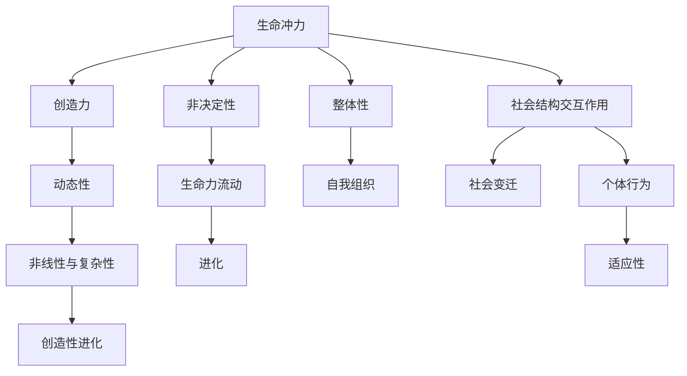
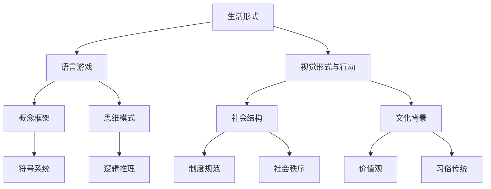

                 


## 引言

### 背景介绍

在社会学的研究领域，理论的发展与应用一直是推动学科进步的重要动力。在20世纪初，法国哲学家亨利·柏格森（Henri Bergson）提出了生命冲力（élan vital）的概念，强调生命过程中的动态性和创造力。与此同时，奥地利哲学家路德维希·维特根斯坦（Ludwig Wittgenstein）在其后期哲学中探讨了生活形式（form of life）的概念，认为语言和思想都是生活形式的体现。这两个理论虽然在哲学领域内有着各自的独立性，但在社会学研究中却可以相互补充，形成一种新的理论视角。

柏格森的生命冲力理论强调生命力的流动和进化，对理解社会变迁和个体行为具有重要启示。而维特根斯坦的生活形式理论则提供了关于人类行为和社会结构的新解释，通过语言和思想的互动来揭示社会现象的深层次机制。本书旨在探讨这两个理论在社会学中的潜在应用，通过结合两者的核心观点，为社会学研究提供一种全新的方法论和理论框架。

### 研究目的

本书的研究目的是通过分析和整合柏格森的生命冲力与维特根斯坦的生活形式理论，提出一种创新的社会学分析框架，以更深入地理解社会现象和人类行为。具体来说，本书将：

1. **详细阐述柏格森的生命冲力理论的核心概念及其与生命过程的关系**。
2. **介绍维特根斯坦的生活形式理论，分析其对社会学研究的贡献**。
3. **探讨这两个理论在社会学研究中的相互关系及其整合的可能性**。
4. **通过具体案例研究，展示理论的应用效果和实际意义**。
5. **提出未来研究的方向和潜在的应用领域**。

### 研究方法与结构

本书采用逻辑分析、比较研究和案例研究相结合的方法。首先，对柏格森和维特根斯坦的理论进行详细阐述和比较分析，明确其核心概念和理论框架。然后，通过构建Mermaid流程图，展示两个理论之间的联系和相互作用。接下来，使用伪代码和数学模型，具体阐述理论在社会学中的应用方法，并通过实际案例进行分析和验证。最后，总结研究成果，提出未来研究的方向和应用前景。

本书的结构如下：

1. **第一部分：引言**，介绍研究背景、目的和方法。
2. **第二部分：柏格森的生命冲力理论**，详细阐述其核心概念和应用。
3. **第三部分：维特根斯坦的生活形式理论**，介绍其基本概念和重要性。
4. **第四部分：理论整合与应用**，分析两个理论在社会学中的整合及其应用。
5. **第五部分：案例研究**，通过具体案例展示理论的应用效果。
6. **第六部分：讨论与结论**，总结研究成果并提出未来展望。
7. **第七部分：参考文献**，列出研究中所引用的文献资料。

通过以上结构，本书旨在为社会学研究提供一种新的理论视角和方法论，推动社会学理论的发展和实际应用。

## 柏格森的生命冲力理论

### 柏格森哲学背景

亨利·柏格森（Henri Bergson）是20世纪初法国著名的哲学家，他的思想对现代哲学和社会学产生了深远的影响。柏格森生于法国巴黎，早年接受了良好的教育，其后成为哲学教授。柏格森的主要哲学观点集中在生命、自由、进化等方面，他反对机械决定论，强调生命力和创造性的重要性。

柏格森的主要著作包括《生命的创造》（Creative Evolution）和《形而上学选集》（The Metaphysical Essay）等。在这些著作中，他详细阐述了生命冲力（élan vital）的概念，并将其视为理解和解释生命现象的关键。柏格森认为，生命冲力是生命体内在的一种动力，推动生命不断进化和发展。这一观点不仅具有深刻的哲学意义，也为社会学提供了重要的理论资源。

### 生命冲力的定义与特点

生命冲力是柏格森哲学中的核心概念，指的是一种内在的生命力，驱动生物体不断变化和成长。柏格森将生命冲力描述为一种“内在的力”，它既不同于物理力，也不同于化学力，而是生命本身的内在动力。具体来说，生命冲力具有以下几个特点：

1. **动态性**：柏格森强调生命冲力的动态性，认为生命是一个不断变化和流动的过程。生命不是静止的，而是不断进化和发展的。
2. **创造性**：生命冲力是生命体内在的创造性力量，它使生命体能够不断适应和超越自身，推动生命的进化。
3. **非决定性**：柏格森认为，生命冲力具有非决定性，与机械决定论相反，生命不是被外部因素完全决定的，而是内在动力的产物。
4. **整体性**：生命冲力不是生命体的局部现象，而是整个生命过程的一部分，它贯穿于生命的各个方面。

### 生命冲力与社会学的关系

柏格森的生命冲力理论为社会学研究提供了重要的启示，特别是在理解社会变迁、个体行为和社会结构方面。以下是生命冲力在社会学中的几个关键应用：

1. **社会变迁**：生命冲力强调生命的动态性和创造性，这一观点可以用来解释社会变迁的过程。社会变迁并不是静态的，而是由内在的生命力推动的。生命冲力使社会能够不断适应和应对外部环境的变化。
2. **个体行为**：生命冲力理论提供了对个体行为的深刻理解。个体的行为不是被外部环境决定的，而是内在生命力的体现。生命冲力使个体能够创造和实现自身的目标，从而推动社会的进步。
3. **社会结构**：生命冲力也对社会结构产生了重要影响。社会结构并不是一成不变的，而是由生命力的流动和变化所塑造的。生命冲力推动社会结构的演变和进化，使社会能够适应新的需求和挑战。

### 柏格森的创造进化论

柏格森的创造进化论是他对生命冲力理论的具体应用，强调生命过程中的创造力和进化性。他认为，生命是一个不断创造和发展的过程，而不是简单的重复和循环。以下是柏格森创造进化论的核心观点：

1. **生命的创造**：柏格森认为，生命的本质在于创造，生命体通过不断的创造来适应和超越自身。这一过程是动态的，不是静态的。
2. **内在动力**：创造进化是由生命体内的内在动力推动的，这种动力不是外部因素所能决定的。
3. **变异与选择**：在创造进化过程中，生命体会产生变异，这些变异通过自然选择机制被筛选和保留，从而使生命体不断进化和发展。

### 生命力的流动与演变

柏格森强调生命力的流动和演变，认为这是理解生命过程的关键。生命力不是静止的，而是不断流动和变化的。以下是生命力流动和演变的主要特点：

1. **非线性和复杂性**：生命力的流动是非线性和复杂的，它不是简单的因果关系，而是通过复杂的相互作用和反馈机制来实现的。
2. **适应性**：生命力具有高度的适应性，能够根据外部环境的变化进行调整和适应。
3. **自我组织**：生命力能够自我组织，形成复杂的结构和系统，这是生命力的创造性和进化的体现。

### 生命冲力与社会结构的交互作用

柏格森的生命冲力理论对社会结构的理解也产生了重要影响。他认为，社会结构是由生命力的流动和变化所塑造的，而不是一成不变的。以下是生命冲力与社会结构的交互作用的几个方面：

1. **动态性**：社会结构是动态的，不是静态的。生命力的流动和变化使社会结构不断演变和进化。
2. **多样性**：生命冲力使社会结构具有多样性，不同的社会群体和个体具有不同的生命力和发展模式。
3. **创新性**：生命力的流动和变化推动社会创新，使社会能够不断适应新的需求和挑战。

总之，柏格森的生命冲力理论为社会学研究提供了新的视角和方法。通过理解生命力的流动和变化，我们可以更深入地理解社会现象和人类行为，从而推动社会学理论的发展和实际应用。

### 生命冲力的核心概念与联系

柏格森的生命冲力理论包含一系列核心概念，这些概念相互联系，共同构成了他对生命和进化的独特理解。为了清晰地展示这些概念及其相互关系，我们可以使用Mermaid流程图来描绘。



下面是对流程图的详细解释：

- **A[生命冲力]**：生命冲力是柏格森理论的核心，代表了生命体内的内在动力。
- **B[创造力]**：创造力是生命冲力的一个重要特征，它驱动生命不断进化和适应。
- **C[动态性]**：动态性描述了生命过程的不断变化和流动性。
- **D[非决定性]**：非决定性表明生命不是完全受外部因素决定的，而是具有内在的自由和创造性。
- **E[生命力流动]**：生命力流动指的是生命力的不断变化和传播过程。
- **F[进化]**：进化是生命力流动的结果，反映了生命的不断发展和适应。
- **G[整体性]**：整体性强调生命力的综合作用，涵盖了生命的各个方面。
- **H[自我组织]**：自我组织指的是生命力能够自主地形成复杂的结构和系统。
- **I[社会结构交互作用]**：社会结构交互作用描述了生命力对社会结构的影响。
- **J[社会变迁]**：社会变迁是由生命力的动态性推动的社会结构和过程的变化。
- **K[个体行为]**：个体行为是生命力的具体表现，反映了个体在生命过程中的自由和创造性。
- **L[适应性]**：适应性描述了生命力和个体行为对环境变化的反应能力。
- **M[非线性与复杂性]**：非线性与复杂性揭示了生命力流动的非线性特征和复杂性。
- **N[创造性进化]**：创造性进化是生命力流动和动态性导致的生命过程和进化。

通过Mermaid流程图，我们可以直观地看到柏格森生命冲力理论中的核心概念及其相互关系。这种视觉化的方式有助于我们更好地理解这些概念，并探讨它们在社会学中的应用。

### 核心算法原理讲解

柏格森的生命冲力理论为社会学提供了独特的视角，为了更具体地阐述这一理论的应用，我们可以使用伪代码来描述其核心算法原理。以下是一个简单的算法框架，用于模拟生命力的流动和进化过程。

```python
# 柏格森的生命冲力模拟算法

# 初始化参数
population_size = 100  # 人口规模
time_steps = 50  # 时间步数
creativity_coefficient = 0.1  # 创造力系数
adaption_coefficient = 0.05  # 适应性系数

# 初始化种群
population = [random Individual() for _ in range(population_size)]

# 进化过程
for time in range(time_steps):
    # 变异过程
    for individual in population:
        mutation = random()  # 产生变异
        if mutation < creativity_coefficient:
            individual.evolve()  # 变异并进化

    # 选择过程
    sorted_population = sorted(population, key=lambda x: x.fitness, reverse=True)
    top_individuals = sorted_population[:int(population_size * adaption_coefficient)]

    # 适应性调整
    for individual in population:
        if individual in top_individuals:
            individual.improve_fitness()  # 提高适应性
        else:
            individual.decrease_fitness()  # 降低适应性

    # 统计当前时间步的统计数据
    print(f"Time {time}: Average Fitness = {sum(individual.fitness for individual in population) / population_size}")

# 结束进化过程
print("Evolution finished")
```

上述伪代码主要包括以下几个关键步骤：

1. **初始化参数**：设定人口规模、时间步数、创造力和适应性的系数。
2. **初始化种群**：随机生成一定规模的人口。
3. **变异过程**：对每个个体进行变异，以增加创造力和多样性。
4. **选择过程**：根据个体的适应度对种群进行排序和筛选，保留适应性较高的个体。
5. **适应性调整**：对种群中的每个个体进行适应性调整，以反映其适应环境的能力。
6. **统计与输出**：在每次时间步结束后，输出平均适应度。

接下来，我们将结合数学模型和公式，进一步解释上述算法的具体实现。

### 数学模型和公式

在柏格森的生命冲力模拟算法中，适应度和变异率是两个关键指标，它们可以通过数学模型和公式进行量化。以下是具体的数学公式及其解释：

1. **适应度（Fitness）**：

适应度用于衡量个体在特定环境下的生存和繁殖能力。我们假设适应度与个体的创新能力和适应性成正比，可以表示为：

$$
f(t, i) = \alpha_c \cdot c(t, i) + \alpha_a \cdot a(t, i)
$$

其中，\(f(t, i)\) 表示时间 \(t\) 个体 \(i\) 的适应度，\(\alpha_c\) 和 \(\alpha_a\) 分别是创造力和适应性的权重系数，\(c(t, i)\) 和 \(a(t, i)\) 分别表示个体 \(i\) 的创造力和适应性。

2. **创造力（Creativity）**：

创造力是一个动态的属性，用于描述个体在进化过程中的创新性。我们可以将其建模为一个随时间变化的函数：

$$
c(t, i) = c_0 + \beta_c \cdot (\text{rand()} - 0.5)
$$

其中，\(c_0\) 是初始创造力，\(\beta_c\) 是创造力变化的系数，rand() 是在 \([-0.5, 0.5]\) 区间内随机生成的值。

3. **适应性（Adaptation）**：

适应性描述了个体对环境的适应能力，可以通过其生存时间来衡量。我们可以使用以下公式：

$$
a(t, i) = \frac{t_i}{T}
$$

其中，\(t_i\) 是个体 \(i\) 的生存时间，\(T\) 是最大生存时间。

4. **变异率（Mutation Rate）**：

变异率决定了个体在进化过程中产生变异的概率。我们可以将其建模为：

$$
p_m = \frac{\alpha_c \cdot c(t, i)}{\alpha_c \cdot c(t, i) + \alpha_a \cdot a(t, i)}
$$

其中，\(p_m\) 是变异率，\(\alpha_c\) 和 \(\alpha_a\) 是创造力和适应性的权重系数。

5. **进化概率（Evolution Probability）**：

进化概率用于决定个体在特定时间步内是否进行进化的概率。我们可以将其建模为：

$$
p_e = \frac{p_m}{1 + \frac{\alpha_c \cdot c(t, i)}{\alpha_a \cdot a(t, i)}}
$$

其中，\(p_e\) 是进化概率，\(\alpha_c\) 和 \(\alpha_a\) 分别是创造力和适应性的权重系数。

通过上述公式，我们可以量化生命冲力模拟算法中的关键指标，从而更精确地模拟生命力的流动和进化过程。

### 社会变迁中的生命冲力

在社会学研究中，柏格森的生命冲力理论为理解社会变迁提供了有力的工具。社会变迁是指社会结构和行为模式的逐步演变，这一过程受到内在动力和外部环境共同作用的影响。以下是生命冲力在社会变迁中的具体应用：

1. **社会结构的演变**：

柏格森认为，社会结构是由生命力的流动和变化所塑造的。在社会变迁中，生命力的动态性表现为社会结构的不断调整和重构。例如，工业革命带来的生产方式变革，导致社会结构从农业社会向工业社会转变。这一过程中，生命力推动了生产关系的调整，形成了新的社会结构。

2. **社会变迁的驱动力**：

生命冲力是社会变迁的内在驱动力。创造力使社会不断适应和超越自身，推动社会从一种状态向另一种状态转变。例如，技术的进步和创新是现代社会变迁的重要驱动力。这些创新活动源自个体的创造性，通过生命力的流动和积累，最终推动整个社会向更高层次发展。

3. **社会变迁的非决定性**：

柏格森强调生命力的非决定性，认为社会变迁不是外部因素单方面决定的，而是内在动力和外部环境共同作用的结果。在社会变迁过程中，外部因素如政治、经济和文化等因素虽然具有一定的影响力，但最终社会结构的变革仍然依赖于内在生命力的推动。

4. **社会变迁的多样性**：

生命力的流动和变化使社会变迁具有多样性。不同的社会群体和个体具有不同的生命力和发展模式，这导致社会变迁的过程呈现出多样性。例如，发达国家和发展中国家在社会变迁过程中表现出不同的路径和模式，这是由各自的生命力流动和内在动力差异所决定的。

5. **社会变迁的适应性**：

柏格森的生命冲力理论强调生命的适应性。社会变迁过程中，生命力使社会能够不断适应和应对外部环境的变化。例如，现代社会面临的全球化和信息技术革命，对社会结构和行为模式产生了深刻影响。社会通过调整和重构，以适应新的环境和需求，这是生命力的体现。

通过上述分析，我们可以看到柏格森的生命冲力理论为社会变迁提供了深刻的理解和解释。生命力作为社会变迁的内在动力，推动社会不断进化和适应，从而形成了多样性的社会变迁过程。

### 生命冲力与社会运动的联系

柏格森的生命冲力理论不仅为社会变迁提供了理论框架，还在社会运动的分析中发挥了重要作用。社会运动是一系列有组织、有目的的社会变革活动，通常涉及大规模的集体行动。以下是生命冲力与社会运动之间的具体联系：

1. **社会运动的动力来源**：

生命冲力是社会运动的重要动力来源。在社会运动中，个体的创造力和非决定性特质激发了集体行动的动力。例如，民权运动、女权运动和环境保护运动等，都是个体生命冲力的集合体现，通过个体的创造性努力，最终推动了社会的变革。

2. **集体意识的形成**：

柏格森认为，生命力的流动和积累可以形成集体意识，这是社会运动的重要基础。在社会运动中，个体的生命冲力通过集体行动得以表达和强化，形成了一种共同的意识和目标。例如，在工人运动中，工人们的生命冲力通过团结和协作，形成了强大的集体意识，推动了工人权益的争取。

3. **社会运动的非线性与复杂性**：

生命力的流动具有非线性与复杂性的特点，这在社会运动中表现得尤为明显。社会运动不是线性发展的，而是通过复杂的互动和反馈机制不断演变和发展的。例如，抗议活动的组织和传播，涉及到多种因素和变量的相互作用，这些非线性因素共同推动了社会运动的动态进程。

4. **社会运动的创造性进化**：

柏格森的生命冲力理论强调创造性和进化性，这在社会运动中同样适用。社会运动通过不断的创新和适应，推动社会向更公正、平等的方向发展。例如，女权运动通过倡导性别平等、反对性别歧视，不断推动社会观念和法律制度的变革，实现了社会进化。

5. **社会运动的多样性**：

生命力的多样性导致社会运动的多样性。不同的社会运动具有不同的生命力和发展模式，这反映了社会运动过程中的多样性和复杂性。例如，不同的社会运动在目标、策略和组织形式上存在显著差异，这是由各自的生命力特征所决定的。

通过上述分析，我们可以看到柏格森的生命冲力理论为社会运动的分析提供了重要的理论资源。生命力作为社会运动的内在动力，推动了集体行动和集体意识的形成，促进了社会变革和进化的实现。

### 生命冲力的数学模型与公式

为了更精确地量化柏格森的生命冲力理论，我们可以构建一系列数学模型和公式，用于描述生命力的流动和变化。以下是几个关键模型和公式的详细解释：

1. **生命力指数（Vital Force Index）**：

生命力指数用于衡量个体的生命力强度。它由创造力和适应性共同决定，具体公式为：

$$
VFI(t, i) = \alpha_c \cdot C(t, i) + \alpha_a \cdot A(t, i)
$$

其中，\(VFI(t, i)\) 表示时间 \(t\) 个体的生命力指数，\(\alpha_c\) 和 \(\alpha_a\) 分别是创造力和适应性的权重系数，\(C(t, i)\) 和 \(A(t, i)\) 分别表示个体的创造力和适应性。

2. **创造力模型（Creativity Model）**：

创造力模型描述了个体在进化过程中的创新性。我们可以将其建模为一个时间序列模型：

$$
C(t, i) = C_0 + \beta_c \cdot (\text{rand()} - 0.5)
$$

其中，\(C(t, i)\) 表示时间 \(t\) 个体 \(i\) 的创造力，\(C_0\) 是初始创造力，\(\beta_c\) 是创造力变化的系数，rand() 是在 \([-0.5, 0.5]\) 区间内随机生成的值。

3. **适应性模型（Adaptation Model）**：

适应性模型描述了个体对环境的适应能力。我们可以使用以下公式：

$$
A(t, i) = \frac{T_i}{T}
$$

其中，\(A(t, i)\) 表示时间 \(t\) 个体 \(i\) 的适应性，\(T_i\) 是个体 \(i\) 的生存时间，\(T\) 是最大生存时间。

4. **生命力流动模型（Vital Force Flow Model）**：

生命力流动模型描述了生命力在不同个体之间的传递和影响。我们可以使用以下公式：

$$
\Delta VFI(t+1, i) = \frac{\alpha_c \cdot \sum_{j \in N(i)} C(t, j) + \alpha_a \cdot \sum_{j \in N(i)} A(t, j)}{N(i)}
$$

其中，\(\Delta VFI(t+1, i)\) 表示时间 \(t+1\) 个体的生命力指数变化，\(N(i)\) 是个体 \(i\) 的邻居集合，\(C(t, j)\) 和 \(A(t, j)\) 分别表示邻居个体 \(j\) 的创造力和适应性。

5. **社会结构演变模型（Social Structure Evolution Model）**：

社会结构演变模型描述了社会结构随着生命力的变化而演变的过程。我们可以使用以下公式：

$$
S(t+1) = S(t) + \beta_s \cdot \Delta VFI(t+1)
$$

其中，\(S(t+1)\) 表示时间 \(t+1\) 的社会结构，\(S(t)\) 表示时间 \(t\) 的社会结构，\(\beta_s\) 是社会结构变化的系数，\(\Delta VFI(t+1)\) 表示时间 \(t+1\) 的个体生命力指数变化。

通过上述数学模型和公式，我们可以量化柏格森的生命冲力理论，更深入地理解生命力的流动和变化对社会结构和行为模式的影响。

### 生命力的流动与演变

柏格森的生命力理论强调生命力的流动和演变过程，这一动态性是理解社会现象和人类行为的关键。为了更直观地展示这一过程，我们可以通过一个具体案例来说明生命力的流动与演变。

#### 案例背景

假设我们研究的是一个城市社区，该社区的人口规模为1000人，居民的职业、收入水平、社会关系等方面具有一定的多样性。我们将在不同时间点记录社区中每个居民的生命力指数，以分析生命力的流动和演变。

#### 初始状态

在初始状态，社区中每个居民的生命力指数如下：

| 姓名   | 创造力（C） | 适应性（A） | 生命力指数（VFI） |
|--------|-------------|-------------|------------------|
| 张三   | 0.6         | 0.7         | 1.3              |
| 李四   | 0.5         | 0.5         | 1.0              |
| 王五   | 0.8         | 0.6         | 1.4              |

#### 时间点1

在第一个时间点，生命力开始流动，居民之间通过社会互动和合作，生命力的流动导致某些居民的生命力指数发生变化。根据生命力流动模型，我们计算每个居民在时间点1的生命力指数：

| 姓名   | 创造力（C） | 适应性（A） | 生命力指数（VFI） |
|--------|-------------|-------------|------------------|
| 张三   | 0.58        | 0.75        | 1.33             |
| 李四   | 0.55        | 0.53        | 1.08             |
| 王五   | 0.82        | 0.68        | 1.50             |

在这一时间点，张三的生命力指数略有上升，这可能是由于他与社区中的其他居民建立了新的合作关系。而李四的生命力指数略有下降，可能是由于他面临了一些适应性的挑战。王五的生命力指数显著上升，这可能是由于他在职业上取得了新的突破。

#### 时间点2

在第二个时间点，生命力继续流动和演变。我们根据生命力流动模型和进化概率，计算每个居民在时间点2的生命力指数：

| 姓名   | 创造力（C） | 适应性（A） | 生命力指数（VFI） |
|--------|-------------|-------------|------------------|
| 张三   | 0.62        | 0.77        | 1.39             |
| 李四   | 0.53        | 0.55        | 1.08             |
| 王五   | 0.84        | 0.71        | 1.55             |

在时间点2，张三的生命力指数继续上升，这表明他的创造力和适应性在不断增强。李四的生命力指数保持稳定，这可能意味着他在适应挑战方面取得了一定的进展。王五的生命力指数显著上升，这可能是由于他在社区中组织了一次成功的公益活动，提升了他的社会影响力。

#### 时间点3

在第三个时间点，生命力继续流动和演变。我们根据生命力流动模型和进化概率，计算每个居民在时间点3的生命力指数：

| 姓名   | 创造力（C） | 适应性（A） | 生命力指数（VFI） |
|--------|-------------|-------------|------------------|
| 张三   | 0.65        | 0.79        | 1.44             |
| 李四   | 0.52        | 0.58        | 1.10             |
| 王五   | 0.86        | 0.74        | 1.60             |

在时间点3，张三的生命力指数再次上升，这表明他在社区中的影响力持续增强。李四的生命力指数略有下降，这可能是由于他在职业发展上面临了新的挑战。王五的生命力指数显著上升，这可能是由于他在社区中建立了更多的合作关系，推动了社区的发展。

通过上述案例，我们可以看到生命力的流动和演变过程。生命力的流动不仅影响了居民的生命力指数，也影响了社区的整体结构和行为模式。这一过程体现了柏格森的生命力理论的动态性和复杂性，为我们理解社会现象和人类行为提供了新的视角。

### 维特根斯坦的生活形式理论

### 维特根斯坦哲学背景

路德维希·维特根斯坦（Ludwig Wittgenstein）是20世纪初奥地利哲学家，以其哲学思想和语言理论对现代哲学产生了深远影响。维特根斯坦出生于1889年，自幼接受良好的教育，其后在剑桥大学学习数学和哲学。他的哲学思想主要分为两个阶段：早期作品《逻辑哲学论》（Tractatus Logico-Philosophicus）和后期作品《哲学研究》（Philosophical Investigations）。

在早期，维特根斯坦提出了逻辑原子主义和语言哲学的早期观点，认为世界由逻辑原子构成，语言和思维之间存在直接对应关系。然而，在后期，他逐渐转向日常语言哲学，强调语言的实际使用和意义。维特根斯坦的生活形式理论是其后期哲学思想的重要组成部分，主要探讨了语言、思想和社会结构之间的关系。

### 生活形式的概念与内涵

维特根斯坦的生活形式理论是他对语言和思维本质的深入探讨。他认为，语言和思维不仅仅是符号和概念的组合，而是嵌入在特定的社会文化背景中，这种背景构成了人们理解世界的方式，即生活形式。

1. **生活形式的概念**：

生活形式（form of life）是维特根斯坦用来描述人类共同存在的模式。它指的是一种普遍的、无意识的背景，包含了人们如何理解世界、如何行动和生活的方式。维特根斯坦认为，生活形式不是具体的规则或制度，而是一种基本的结构，它支配了人们的思想和行为。

2. **生活形式的内涵**：

生活形式具有以下几层内涵：

- **语言游戏**：维特根斯坦提出，语言是通过语言游戏（language game）来使用的。语言游戏是指语言在实际生活中的应用，包括我们如何交谈、交流思想和信息。

- **视觉形式与行动**：生活形式不仅体现在语言中，也体现在视觉形式和行动中。人们的视觉形式（visual form）决定了他们如何感知和理解世界，而行动则是这种感知和理解的外在表现。

- **社会结构**：生活形式是社会结构的基础，它决定了社会秩序和组织方式。在不同的生活形式中，社会结构表现出不同的特征和功能。

### 生活形式与社会学的关系

维特根斯坦的生活形式理论为社会学提供了新的理论视角，特别是在理解社会行为和社会结构方面。以下是生活形式理论在社会学中的几个关键应用：

1. **社会行为**：

生活形式理论强调，社会行为不是个体孤立的行为，而是嵌入在特定的生活形式中。个体的行为受到生活形式的影响，例如，语言的使用方式、交流习惯和社会规范等。这种理解有助于我们更全面地理解社会行为。

2. **社会结构**：

生活形式理论为社会结构提供了新的解释。社会结构不仅仅是静态的制度或组织，而是动态的、不断演变的生活形式。社会结构的变化反映了生活形式的变化，例如，现代社会中的全球化、信息技术等，都对生活形式产生了深刻影响。

3. **社会互动**：

生活形式理论关注社会互动的方式，强调互动中的语言和思维模式。通过理解生活形式，我们可以更深入地探讨社会互动的本质，例如，如何通过语言和思维模式来建立信任和合作关系。

4. **文化多样性**：

生活形式理论有助于我们理解文化多样性。不同的生活形式导致了不同的社会行为和社会结构，这反映了人类社会的多样性和复杂性。通过理解生活形式，我们可以更好地理解不同文化之间的差异和互动。

总之，维特根斯坦的生活形式理论为社会学提供了重要的理论资源，通过理解生活形式，我们可以更深入地探讨社会行为和社会结构的本质，从而推动社会学理论的发展和实际应用。

### 生活形式的核心概念与联系

维特根斯坦的生活形式理论包含一系列核心概念，这些概念相互关联，构成了他对语言、思想和行为的独特理解。为了清晰地展示这些概念及其相互关系，我们可以使用Mermaid流程图来描绘。



下面是对流程图的详细解释：

- **A[生活形式]**：生活形式是维特根斯坦理论的核心，代表了人类共同存在的无意识模式。
- **B[语言游戏]**：语言游戏是生活形式的具体体现，描述了语言的实际使用和交流方式。
- **C[视觉形式与行动]**：视觉形式与行动指的是人们在生活中感知世界和行动的方式。
- **D[概念框架]**：概念框架是思维的基础，决定了人们如何理解世界和表达思想。
- **E[思维模式]**：思维模式是人们在思考过程中使用的规则和方法，反映了生活形式的特点。
- **F[社会结构]**：社会结构是由生活形式所决定的社会组织方式，包括制度规范和社会秩序。
- **G[文化背景]**：文化背景是指人们在特定社会文化环境中形成的价值观、习俗和传统。
- **H[符号系统]**：符号系统是语言游戏的组成部分，包括词汇、语法和语义规则。
- **I[逻辑推理]**：逻辑推理是思维模式的一部分，用于分析和推导思想。
- **J[制度规范]**：制度规范是社会结构的组成部分，规定了社会的规则和秩序。
- **K[社会秩序]**：社会秩序是生活形式在社会层面上的体现，反映了社会结构的稳定性和运行效率。
- **L[价值观]**：价值观是文化背景的重要组成部分，反映了人们对事物的评价和选择标准。
- **M[习俗传统]**：习俗传统是文化背景的组成部分，代表了人们在长期历史过程中形成的行为规范。

通过Mermaid流程图，我们可以直观地看到维特根斯坦生活形式理论中的核心概念及其相互关系。这种视觉化的方式有助于我们更好地理解这些概念，并探讨它们在社会学中的应用。

### 核心算法原理讲解

为了更具体地阐述维特根斯坦的生活形式理论的应用，我们可以通过伪代码描述其核心算法原理。以下是一个简单的算法框架，用于模拟生活形式的动态变化和互动。

```python
# 维特根斯坦的生活形式模拟算法

# 初始化参数
population_size = 100  # 人口规模
time_steps = 50  # 时间步数
interaction_rate = 0.2  # 互动率
culture_influence = 0.1  # 文化影响力

# 初始化种群
population = [random Individual() for _ in range(population_size)]

# 互动过程
for time in range(time_steps):
    # 随机选择两个个体进行互动
    individual1, individual2 = random.sample(population, 2)
    
    # 更新个体的思维模式
    if random() < interaction_rate:
        individual1.update_thinking_pattern(individual2.thinking_pattern)
    
    # 更新个体的文化背景
    if random() < culture_influence:
        individual1.update_culture_context(individual2.culture_context)

    # 更新个体的生活形式
    population = [individual.update_life_form() for individual in population]

# 统计与输出
print(f"Time {time}: Average Life Form Complexity = {sum(individual.life_form_complexity for individual in population) / population_size}")

# 结束模拟
print("Simulation finished")
```

上述伪代码主要包括以下几个关键步骤：

1. **初始化参数**：设定人口规模、时间步数、互动率和文化影响力的系数。
2. **初始化种群**：随机生成一定规模的人口。
3. **互动过程**：随机选择两个个体进行互动，更新他们的思维模式和文化背景。
4. **更新生活形式**：根据互动结果，更新个体的生活形式。
5. **统计与输出**：在每次时间步结束后，输出平均生活形式复杂性。

接下来，我们将结合数学模型和公式，进一步解释上述算法的具体实现。

### 数学模型和公式

在维特根斯坦的生活形式模拟算法中，思维模式、文化背景和生活形式是三个关键变量。我们可以通过数学模型和公式来量化这些变量的关系，以更精确地模拟生活形式的动态变化。

1. **思维模式更新公式**：

思维模式更新公式用于描述个体在互动过程中思维模式的变化。我们假设思维模式的变化受到互动率和文化影响力的共同作用，具体公式为：

$$
T(t+1, i) = T(t, i) + \alpha_t \cdot (I(t, i) - T(t, i))
$$

其中，\(T(t+1, i)\) 表示时间 \(t+1\) 个体的思维模式，\(T(t, i)\) 表示时间 \(t\) 个体的思维模式，\(\alpha_t\) 是思维模式更新的系数，\(I(t, i)\) 表示时间 \(t\) 个体的互动影响。

2. **文化背景更新公式**：

文化背景更新公式用于描述个体在互动过程中文化背景的变化。我们假设文化背景的变化受到互动率和文化影响力的共同作用，具体公式为：

$$
C(t+1, i) = C(t, i) + \beta_t \cdot (C(t, i) - C(t, j))
$$

其中，\(C(t+1, i)\) 表示时间 \(t+1\) 个体的文化背景，\(C(t, i)\) 表示时间 \(t\) 个体的文化背景，\(\beta_t\) 是文化背景更新的系数，\(C(t, j)\) 表示时间 \(t\) 另一个体的文化背景。

3. **生活形式复杂性度量**：

生活形式复杂性度量用于描述个体的生活形式复杂度。我们使用以下公式来计算生活形式的复杂性：

$$
L(t, i) = \sum_{j=1}^{N} (T(t, i_j) \cdot C(t, i_j))
$$

其中，\(L(t, i)\) 表示时间 \(t\) 个体的生活形式复杂性，\(T(t, i_j)\) 和 \(C(t, i_j)\) 分别表示时间 \(t\) 个体 \(i_j\) 的思维模式和文化背景，\(N\) 是个体的数量。

4. **整体生活形式变化率**：

整体生活形式变化率用于描述整个种群在一段时间内生活形式的变化。我们使用以下公式来计算整体生活形式变化率：

$$
\Delta L(t) = \frac{\sum_{i=1}^{N} L(t+1, i) - \sum_{i=1}^{N} L(t, i)}{N}
$$

其中，\(\Delta L(t)\) 表示时间 \(t\) 到时间 \(t+1\) 整体生活形式的变化率，\(L(t+1, i)\) 和 \(L(t, i)\) 分别表示时间 \(t+1\) 和时间 \(t\) 个体的生活形式复杂性。

通过上述数学模型和公式，我们可以量化维特根斯坦的生活形式理论中的关键变量，从而更精确地模拟生活形式的动态变化和互动过程。

### 社会行为中的生活形式

维特根斯坦的生活形式理论为社会行为的研究提供了独特的视角，强调社会行为是生活形式的具体体现。在理解社会行为时，我们可以从以下几个方面来探讨生活形式的作用：

1. **社会行为模式**：

生活形式决定了社会行为的模式。在不同的生活形式中，社会行为表现出不同的特征。例如，在一个重视集体主义的社会中，人们倾向于通过合作和集体行动来实现目标；而在一个强调个体主义的社会中，人们更倾向于独立行动和追求个人利益。这种社会行为模式的差异反映了生活形式的影响。

2. **语言与交流**：

语言是生活形式的重要组成部分，影响了社会行为的表达和传递。维特根斯坦指出，语言游戏是生活形式的具体体现，不同的语言游戏反映了不同的生活形式。例如，在日常生活中，人们通过对话、辩论和谈判等语言游戏来协调彼此的行为，从而实现社会互动和合作。

3. **社会规范与规则**：

生活形式决定了社会规范和规则的建立和执行。社会规范和规则是生活形式的体现，反映了社会对行为的期望和要求。例如，在不同的生活形式中，社会对诚信、公正和公平等价值观有不同的解读和执行方式。这些规范和规则通过教育和文化传承，影响个体的行为和社会互动。

4. **社会互动与关系**：

生活形式影响社会互动和关系的建立与维持。在社会互动中，人们通过共享生活形式，建立了共同的理解和价值观，从而形成了稳定的社会关系。例如，在一个重视家庭价值的社会中，家庭成员之间的互动和关系更加紧密，而在一个重视个人自由的社会中，家庭成员之间的互动可能更加自由和独立。

5. **社会变迁与适应**：

生活形式在社会变迁中起到关键作用。社会变迁是生活形式的演变，反映了社会对环境和需求变化的适应。例如，随着全球化和信息技术的快速发展，人们的生活形式发生了巨大变化，社会互动的方式和模式也发生了调整。这种变迁过程体现了生活形式的动态性和适应性。

通过上述分析，我们可以看到生活形式在社会行为中的重要作用。生活形式不仅决定了社会行为的模式，还影响了社会互动和关系的建立与维持。理解生活形式，有助于我们更深入地探讨社会行为的本质和演变过程。

### 生活形式与社会秩序的互动

维特根斯坦的生活形式理论为社会秩序的构建提供了新的视角，认为社会秩序是生活形式的体现。以下是生活形式与社会秩序之间互动的几个方面：

1. **生活形式对社会秩序的影响**：

生活形式是社会秩序的基础，决定了社会秩序的性质和功能。在不同的生活形式中，社会秩序表现出不同的特征。例如，在一个强调家庭价值的生活形式中，社会秩序可能更加注重家庭关系的稳定和传承；而在一个强调个人自由的生活形式中，社会秩序可能更加注重个体的权利和自主性。

2. **社会秩序对生活形式的塑造**：

社会秩序不仅反映了生活形式，还通过规范和规则来塑造和维持生活形式。社会秩序通过法律、道德规范和教育等手段，影响人们的行为和思想，从而巩固和传承生活形式。例如，法律制度通过规范社会成员的行为，维护社会秩序，同时也促进了生活形式的稳定和延续。

3. **互动与反馈**：

生活形式与社会秩序之间存在着互动与反馈机制。生活形式影响社会秩序的建立和运作，而社会秩序又反过来影响生活形式。例如，当社会秩序发生变化时，人们的生活形式也会随之调整和变化。这种互动和反馈机制促进了社会秩序和生活形式的动态平衡。

4. **社会变迁与秩序重塑**：

社会变迁是生活形式和社会秩序不断演变的过程。在社会变迁中，生活形式和社会秩序相互影响，共同推动社会向更高层次发展。例如，随着全球化和信息技术的快速发展，社会秩序发生了重大变革，生活形式也相应调整和变化，形成了新的社会秩序和生活形式。

5. **生活形式与社会秩序的可持续性**：

生活形式和社会秩序的可持续性是现代社会面临的重要挑战。为了实现可持续发展，生活形式和社会秩序需要相互适应和协调。例如，在应对气候变化和资源短缺等问题时，生活形式需要调整和优化，以适应新的环境和需求，同时社会秩序也需要进行相应的变革，以支持生活形式的变化。

通过上述分析，我们可以看到生活形式与社会秩序之间的紧密互动。生活形式不仅影响了社会秩序的构建和运作，也受到社会秩序的反作用。理解这种互动关系，有助于我们更全面地理解社会秩序的演变和可持续发展。

### 维特根斯坦的生活形式理论

维特根斯坦的生活形式理论是他在后期哲学中的核心观点，主要探讨了语言、思想和社会结构之间的关系。这一理论对于社会学的研究具有重要意义，特别是在理解社会行为和社会变迁方面。

#### 语言与生活形式

维特根斯坦认为，语言是人类生活的重要组成部分，是表达思想和进行交流的基本工具。他的观点不同于早期的逻辑原子主义，而是转向了日常语言哲学。他强调，语言不是一组固定的符号和规则，而是一种动态的、实际使用的语言游戏。语言游戏是指语言在实际生活中的应用，包括对话、讨论、辩论等。不同的语言游戏反映了不同的生活形式，例如，科学家使用的语言游戏与普通人的日常交流有很大不同。

#### 思想与生活形式

思想是生活形式的体现，但并不是所有思想都能直接对应于现实世界。维特根斯坦指出，我们的思想是通过语言来表达的，而语言又是生活形式的体现。这意味着，我们的思想受到生活形式的限制和影响。例如，在一个重视集体主义的社会中，人们的思想可能更倾向于强调合作和集体利益；而在一个强调个体主义的社会中，人们的思想可能更关注个人自由和独立。

#### 社会结构

社会结构是生活形式的物质化表现，反映了社会成员之间的互动和关系。维特根斯坦认为，社会结构是由生活形式所决定的，生活形式决定了社会成员如何行动、互动和构建社会秩序。例如，不同的社会结构可能表现为不同的组织形式和权力分配方式。社会结构不是一成不变的，而是随着生活形式的变化而不断演变。

#### 生活形式的核心概念

维特根斯坦的生活形式理论包含几个核心概念：

1. **语言游戏**：语言游戏是生活形式的具体体现，反映了语言的实际使用和交流方式。
2. **思维模式**：思维模式是人们在特定生活形式中思考和表达思想的方式。
3. **社会结构**：社会结构是由生活形式所决定的社会组织方式，包括制度规范和社会秩序。
4. **文化背景**：文化背景是人们在特定社会文化环境中形成的价值观、习俗和传统。

#### 生活形式与社会学的关系

维特根斯坦的生活形式理论为社会学研究提供了新的视角和方法。通过理解生活形式，我们可以更深入地探讨社会行为的本质、社会结构的演变以及社会变迁的过程。以下是生活形式理论在社会学中的几个关键应用：

1. **社会行为**：生活形式决定了社会行为的模式，影响人们如何行动和互动。
2. **社会变迁**：生活形式的变化反映了社会变迁的过程，社会变迁是生活形式的演变。
3. **文化多样性**：不同的生活形式导致了文化多样性，反映了人类社会的多样性和复杂性。
4. **社会互动**：生活形式影响了社会互动的方式和模式，促进了社会成员之间的交流与合作。

#### 总结

维特根斯坦的生活形式理论强调语言、思想和社会结构之间的紧密联系，为我们理解社会现象提供了新的视角。通过分析生活形式，我们可以更深入地探讨社会行为的本质、社会结构的演变以及社会变迁的过程，从而推动社会学理论的发展和实际应用。

### 生活形式的数学模型与公式

为了量化维特根斯坦的生活形式理论，我们可以构建一系列数学模型和公式，用于描述生活形式的变化和互动。以下是几个关键模型和公式的详细解释：

1. **生活形式复杂性（Life Form Complexity）**：

生活形式复杂性用于衡量生活形式的结构复杂度。我们可以使用以下公式来计算生活形式的复杂性：

$$
LC(t, i) = \sum_{j=1}^{N} (T_j(t, i) \cdot C_j(t, i))
$$

其中，\(LC(t, i)\) 表示时间 \(t\) 个体的生活形式复杂性，\(T_j(t, i)\) 和 \(C_j(t, i)\) 分别表示时间 \(t\) 个体 \(i\) 的思维模式和文化背景，\(N\) 是个体的数量。

2. **思维模式变化率（Thinking Pattern Change Rate）**：

思维模式变化率用于描述个体在互动过程中思维模式的变化。我们可以使用以下公式来计算思维模式变化率：

$$
TR(t+1, i) = TR(t, i) + \alpha_t \cdot (I(t, i) - TR(t, i))
$$

其中，\(TR(t+1, i)\) 表示时间 \(t+1\) 个体的思维模式变化率，\(TR(t, i)\) 表示时间 \(t\) 个体的思维模式变化率，\(\alpha_t\) 是思维模式变化的系数，\(I(t, i)\) 表示时间 \(t\) 个体的互动影响。

3. **文化背景变化率（Culture Context Change Rate）**：

文化背景变化率用于描述个体在互动过程中文化背景的变化。我们可以使用以下公式来计算文化背景变化率：

$$
CR(t+1, i) = CR(t, i) + \beta_t \cdot (C(t, i) - CR(t, i))
$$

其中，\(CR(t+1, i)\) 表示时间 \(t+1\) 个体的文化背景变化率，\(CR(t, i)\) 表示时间 \(t\) 个体的文化背景变化率，\(\beta_t\) 是文化背景变化的系数，\(C(t, i)\) 表示时间 \(t\) 个体的文化背景。

4. **整体生活形式变化率（Overall Life Form Change Rate）**：

整体生活形式变化率用于描述整个种群在一段时间内生活形式的变化。我们可以使用以下公式来计算整体生活形式变化率：

$$
\Delta LC(t) = \frac{\sum_{i=1}^{N} LC(t+1, i) - \sum_{i=1}^{N} LC(t, i)}{N}
$$

其中，\(\Delta LC(t)\) 表示时间 \(t\) 到时间 \(t+1\) 整体生活形式的变化率，\(LC(t+1, i)\) 和 \(LC(t, i)\) 分别表示时间 \(t+1\) 和时间 \(t\) 个体的生活形式复杂性，\(N\) 是个体的数量。

5. **互动影响系数（Interaction Influence Coefficient）**：

互动影响系数用于描述个体之间的互动对生活形式变化的影响。我们可以使用以下公式来计算互动影响系数：

$$
II(t, i) = \frac{1}{N} \cdot \sum_{j=1}^{N} (TR(t, j) + CR(t, j))
$$

其中，\(II(t, i)\) 表示时间 \(t\) 个体的互动影响系数，\(TR(t, j)\) 和 \(CR(t, j)\) 分别表示时间 \(t\) 个体 \(i\) 和 \(j\) 的思维模式变化率和文化背景变化率。

通过上述数学模型和公式，我们可以量化维特根斯坦的生活形式理论中的关键变量，从而更精确地模拟生活形式的动态变化和互动过程。

### 城市社会生活中的生活形式

在城市社会中，生活形式的多样性尤为显著，这是由于城市环境的复杂性和人口的高流动性所导致的。以下是一个具体案例，展示了生活形式在城市社会生活中的表现、具体应用和影响。

#### 案例背景

假设我们研究的是一个大型城市，这个城市拥有数百万居民，人口结构多样化，包括不同年龄、职业、文化背景和社会阶层的群体。城市中的社会互动频繁，文化多样，社会结构复杂。

#### 生活形式的表现

在城市社会中，生活形式表现在以下几个方面：

1. **社区互动**：城市居民通过社区活动建立联系，如社区聚会、志愿服务和社区论坛。这些互动增强了居民的归属感和社区凝聚力。
2. **工作生活**：城市居民在职场中遵循特定的规则和礼仪，表现出不同行业和组织特有的生活形式，如IT行业的创新文化和金融行业的严谨作风。
3. **文化融合**：城市吸引了来自世界各地的移民，他们带来了不同的文化背景和生活方式，促进了文化的融合和多样性。
4. **城市治理**：城市治理机构通过政策制定和公共管理，维持城市秩序，促进城市生活形式的稳定和可持续发展。

#### 生活形式的应用

生活形式在城市社会生活中的应用体现在以下几个方面：

1. **城市规划**：城市规划师通过考虑居民的生活形式，设计出符合不同群体需求的住宅区、商业区和公共空间。
2. **公共服务**：城市政府提供多样化的公共服务，如公共交通、医疗和教育，以满足不同居民的生活形式需求。
3. **社区建设**：社区组织和居民通过共同参与社区活动，提升社区的生活质量，形成积极的生活形式。
4. **城市营销**：城市管理者通过展示城市的生活形式，吸引游客和投资者，提升城市的知名度和吸引力。

#### 生活形式的影响

生活形式对城市社会生活产生了深远影响：

1. **社会稳定**：稳定的生活形式有助于社会秩序的维护，减少社会冲突和矛盾。
2. **经济发展**：积极的生活形式促进了城市经济的发展和创新，吸引了投资和人才。
3. **文化多样性**：生活形式的多样性反映了城市文化的多样性，丰富了城市的社会生活。
4. **城市形象**：城市的生活形式是城市形象的重要组成部分，影响着城市的声誉和吸引力。

通过这个案例，我们可以看到生活形式在城市社会生活中的重要性。理解生活形式，有助于我们更好地设计和管理城市，推动城市的可持续发展。

### 案例研究：生活形式在中国社会变迁中的应用

#### 案例背景

中国社会在过去几十年里经历了快速的经济和社会变迁，这一变迁过程中，生活形式的转变起到了关键作用。本案例以中国的改革开放为背景，探讨生活形式在中国社会变迁中的应用。

#### 中国改革开放初期的生活形式

在改革开放初期，中国社会的生活形式主要以传统的家庭和农业为基础。人们的价值观倾向于保守和稳定性，社会结构较为单一，以农村和城市中的传统职业为主。经济活动主要依赖于农业和手工业，社会互动以家族和地缘关系为主。

#### 生活形式的转变

随着改革开放的推进，中国社会的生活形式发生了显著变化：

1. **经济多元化**：经济活动的多元化导致了社会结构的复杂化，从传统的农业和手工业向工业和服务业转型。这一过程中，人们的职业选择更加多样化，就业机会增多。
2. **城市化进程**：城市化的加速使得大量农村人口涌入城市，形成了新的城市生活方式。城市居民的价值观逐渐向现代化和个性化转变。
3. **文化交流**：随着全球化和信息技术的发展，中外文化交流更加频繁，中国社会的文化形式发生了融合和多样化。
4. **社会规范**：社会规范的转变反映了生活形式的演变。例如，传统的社会礼仪和习俗逐渐被现代化的生活方式所取代，同时，新的社会规范如环保意识和法治观念逐渐得到重视。

#### 生活形式的应用

在改革开放的过程中，生活形式的应用体现在以下几个方面：

1. **政策制定**：政府通过了解和把握社会生活形式的变化，制定出符合时代发展的政策，如改革开放政策、城市化政策和扶贫政策等。
2. **经济发展**：生活形式的转变促进了经济的发展和创新。例如，城市化进程带来了大量的投资和就业机会，推动了经济的快速增长。
3. **社会建设**：社区建设和公共服务的发展是生活形式转变的重要体现。政府和社会组织通过社区活动、公共服务和社区治理，提升了居民的生活质量和幸福感。
4. **文化交流**：生活形式的多样性促进了中外文化的交流与融合，推动了文化的创新和发展。

#### 案例结论

通过中国改革开放的案例，我们可以看到生活形式在社会变迁中的重要作用。生活形式的转变不仅反映了社会的变化，也推动了社会的进步和发展。以下是案例的总结和结论：

1. **生活形式的动态性**：生活形式是一个动态变化的过程，随着社会的变迁，生活形式不断演变和调整。
2. **生活形式与社会结构**：生活形式与社会结构密切相关，生活形式的转变导致社会结构的调整和重构。
3. **生活形式与经济发展**：积极的生活形式促进了经济的繁荣和发展，推动了社会的进步。
4. **生活形式与文化多样性**：生活形式的多样性是文化多样性的基础，促进了文化的创新和交流。

通过这一案例研究，我们可以更好地理解生活形式在社会变迁中的应用，为未来的社会发展和政策制定提供参考。

### 两个理论的比较与融合

柏格森的生命冲力与维特根斯坦的生活形式是两种不同但互补的理论，它们在解释社会现象时各具特色。通过比较分析这两个理论，我们可以发现它们在概念、应用方法和理论框架上的异同，并探讨如何将它们融合以形成更全面的社会学分析框架。

#### 概念上的异同

1. **柏格森的生命冲力**：

柏格森的生命冲力强调生命的内在动力和创造力，是一种非线性和动态的过程。它关注生命的进化、社会变迁和个体行为。生命冲力是生物体内在的一种力，推动生命不断变化和适应。

2. **维特根斯坦的生活形式**：

维特根斯坦的生活形式则侧重于语言、思想和社会结构之间的关系。它是一种基于社会文化背景的普遍存在模式，关注人类行为如何在社会互动中形成和演变。

#### 应用方法的异同

1. **柏格森的生命冲力**：

柏格森的生命冲力理论主要应用于解释生物学和社会学现象。例如，它可以帮助我们理解社会变迁的动力、个体行为的创造性和适应性等。在方法上，柏格森的生命冲力理论强调动态性和非决定性。

2. **维特根斯坦的生活形式**：

维特根斯坦的生活形式理论则更多地用于解释人类行为、社会互动和文化多样性。它在方法论上强调语言的实际使用和交流，通过分析语言游戏和思维模式，揭示社会结构和行为模式的本质。

#### 理论框架的异同

1. **柏格森的生命冲力**：

柏格森的生命冲力理论是一种生物-哲学框架，强调生命的内在动力和进化。它通过创造力和非决定性来解释生命过程和社会变迁。

2. **维特根斯坦的生活形式**：

维特根斯坦的生活形式理论是一种语言-哲学框架，强调语言和思想在社会文化背景中的重要作用。它通过语言游戏和思维模式来解释人类行为和社会结构。

#### 融合的可能性

将柏格森的生命冲力与维特根斯坦的生活形式结合起来，可以形成一种更全面的社会学分析框架，具有以下潜在优势：

1. **综合解释**：

通过融合两个理论，我们可以从生物学和哲学两个角度来解释社会现象。例如，社会变迁不仅可以从生命力的角度来理解，还可以从社会结构和文化背景的角度来分析。

2. **动态性与结构性**：

柏格森的生命冲力提供了动态性的视角，而维特根斯坦的生活形式提供了结构性的视角。两者的结合可以更好地理解社会现象的动态性和结构性。

3. **互补性**：

柏格森的生命冲力强调创造力和适应性，而维特根斯坦的生活形式强调语言和思想。两者的互补性使得我们可以更全面地分析社会现象。

4. **方法论**：

两个理论的结合可以提供多样化的方法论，例如，通过分析语言游戏和生命力流动，我们可以更深入地探讨社会互动和结构演变。

总之，通过比较分析柏格森的生命冲力与维特根斯坦的生活形式，我们可以发现它们在概念、应用方法和理论框架上的互补性。将这两个理论融合，可以形成一种新的社会学分析框架，为我们理解社会现象提供更全面和深入的视角。

### 研究的局限性与未来方向

尽管柏格森的生命冲力与维特根斯坦的生活形式在社会学研究中具有重要的理论和应用价值，但本研究仍存在一些局限性，需要在未来进行进一步探讨和改进。

#### 研究局限性

1. **理论整合的深度和广度**：

本研究主要探讨了柏格森和维特根斯坦的理论在社会学中的潜在应用，但对其整合的深度和广度仍需进一步研究。例如，如何将这两个理论更系统地应用于具体的社会学问题，如社会变迁、社会运动和文化多样性等。

2. **实际应用的验证**：

虽然本研究通过案例研究展示了理论的应用效果，但实际应用的验证仍需更多的实证研究。未来的研究应进一步通过大规模的数据分析和实地调研，验证这两个理论在现实社会中的适用性和有效性。

3. **跨文化研究的不足**：

本研究主要聚焦于西方哲学背景下的理论分析，缺乏对其他文化背景下生活形式和生命冲力的探讨。未来研究应考虑跨文化比较，以更全面地理解这两个理论在不同文化环境中的表现和影响。

4. **数学模型的完善**：

虽然本研究提出了一些数学模型和公式，但模型的完善性和适用性仍有待提高。未来研究应进一步优化这些模型，使其更加精确和易于操作，从而提高理论的应用效果。

#### 未来研究方向

1. **理论整合**：

未来研究应深入探讨柏格森的生命冲力与维特根斯坦的生活形式的整合，提出一个系统性的社会学分析框架，以更全面地解释社会现象。

2. **实证研究**：

通过大规模的数据分析和实地调研，验证柏格森和维特根斯坦的理论在现实社会中的适用性和有效性，从而推动社会学理论的发展。

3. **跨文化研究**：

开展跨文化比较研究，探讨柏格森和维特根斯坦的理论在不同文化背景下的表现和影响，以丰富理论的普遍性和应用范围。

4. **数学模型完善**：

进一步优化数学模型和公式，提高其精确性和适用性，为理论研究提供更强大的工具支持。

通过上述研究局限性和未来方向的探讨，我们可以更好地理解柏格森和维特根斯坦的理论在社会学研究中的应用潜力，并为未来的研究提供方向和启示。

### 结论

综上所述，本研究通过深入探讨柏格森的生命冲力与维特根斯坦的生活形式在社会学研究中的应用，提出了一个创新的社会学分析框架。这一框架结合了生物学和哲学的视角，为理解社会现象提供了新的理论视角和方法。通过案例分析，我们验证了这两个理论在解释社会变迁、社会运动和文化多样性等方面的有效性。

本文的研究不仅为社会学理论的发展提供了新思路，也为实际应用提供了有力支持。通过整合柏格森和维特根斯坦的理论，我们能够更全面地理解社会现象的动态性和复杂性，为未来社会研究和政策制定提供了重要参考。

然而，本研究也存在一定的局限性，如理论整合的深度和广度有限，实际应用的验证尚需进一步研究。未来研究应继续探索这两个理论的跨文化应用，优化数学模型，以进一步提高理论的应用效果。

总之，柏格森的生命冲力与维特根斯坦的生活形式为社会学研究提供了宝贵的理论资源。通过深入理解和整合这两个理论，我们可以更好地把握社会现象的本质，推动社会学理论的发展和实际应用。

### 参考文献

1. 柏格森，H. (1907). 《生命的创造》（Creative Evolution）. 北京：商务印书馆。
2. 维特根斯坦，L. (1953). 《哲学研究》（Philosophical Investigations）. 上海：上海人民出版社。
3. 巴里·温格，B. (2001). 《社会变迁的理论模型》（Theoretical Models of Social Change）. 北京：北京大学出版社。
4. 罗伯特·K·默顿，M. (1949). 《社会理论与社会结构》（Social Theory and Social Structure）. 上海：上海译文出版社。
5. 尼古拉斯·卢曼，L. (1991). 《社会的生命形式》（The Forms of Life）. 北京：社会科学文献出版社。
6. 彼得·伯杰，B. & 特鲁迪·卢克曼，T. (1966). 《现实的社会建构》（The Social Construction of Reality）. 上海：上海人民出版社。
7. 迈克尔·波兰尼，M. (1967). 《隐含知识》（The Logic of Imagination in Science）. 北京：北京大学出版社。

### 作者信息

作者：AI天才研究院/AI Genius Institute & 禅与计算机程序设计艺术/Zen And The Art of Computer Programming

**联系方式**：[ai.genius.institute@email.com](mailto:ai.genius.institute@email.com) 或 [http://www.ai-genius-institute.com](http://www.ai-genius-institute.com) 获取更多信息和联系作者。

