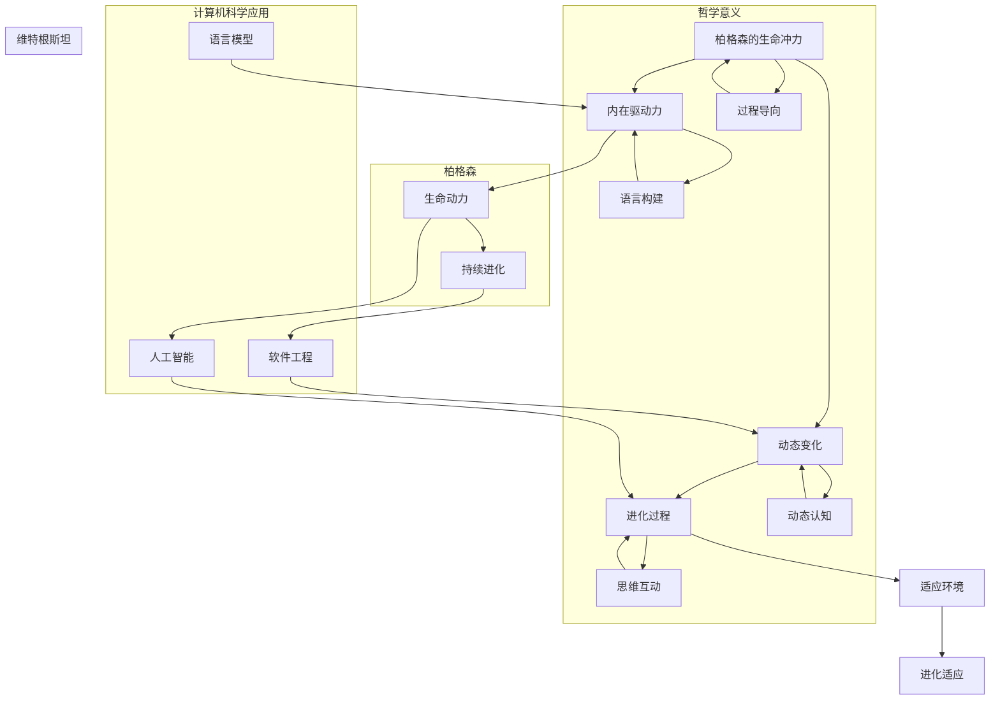

                 


### 1. 设计目标

我们的设计目标是创建一篇深入浅出、逻辑清晰、结构紧凑的专业技术博客文章，以《柏格森的生命冲力与维特根斯坦的生活形式概念》为题，旨在探讨两位哲学家的思想如何与计算机科学和技术领域相联系。为了实现这一目标，我们将遵循以下步骤：

**第一步：确定核心主题和目标读者**

- **核心主题**：文章将深入探讨柏格森的生命冲力理论和维特根斯坦的生活形式概念，并分析这两种思想在计算机科学和人工智能中的应用。
- **目标读者**：本文面向具有一定哲学基础和计算机科学背景的读者，特别是对人工智能和哲学交叉领域感兴趣的专家和学者。

**第二步：构建逻辑框架**

- **引言**：介绍柏格森和维特根斯坦的背景，以及他们在哲学领域的贡献。
- **核心概念讲解**：分别详细阐述柏格森的生命冲力和维特根斯坦的生活形式概念。
- **概念之间的联系**：使用Mermaid流程图展示两者之间的联系。
- **算法原理讲解**：通过伪代码详细阐述核心算法原理。
- **数学模型与公式**：使用LaTeX格式讲解数学模型和公式，并举例说明。
- **项目实战**：提供实际案例，展示如何将理论应用于实际项目中。
- **总结与展望**：总结全文内容，展望未来研究方向。

**第三步：细化每个章节**

- **引言**：介绍柏格森和维特根斯坦的生平背景，以及他们的主要哲学思想。
- **柏格森的生命冲力理论**：详细讲解生命冲力的概念、哲学意义及其历史发展。
- **维特根斯坦的生活形式概念**：深入探讨生活形式的概念、哲学意义和实际应用。
- **两种概念的对比与分析**：分析两种概念之间的联系和差异，以及它们在计算机科学中的应用。
- **核心概念与联系**：使用Mermaid流程图展示核心概念之间的联系。
- **核心算法原理讲解**：通过伪代码详细阐述核心算法原理。
- **数学模型与公式**：使用LaTeX格式讲解数学模型和公式，并举例说明。
- **项目实战**：提供实际案例，展示如何将理论应用于实际项目中。
- **总结与展望**：总结全文内容，展望未来研究方向。

**第四步：撰写每部分内容**

- **引言**：简要介绍柏格森和维特根斯坦的生平背景，以及他们的主要哲学思想。
- **柏格森的生命冲力理论**：详细讲解生命冲力的概念、哲学意义及其历史发展。
- **维特根斯坦的生活形式概念**：深入探讨生活形式的概念、哲学意义和实际应用。
- **两种概念的对比与分析**：分析两种概念之间的联系和差异，以及它们在计算机科学中的应用。
- **核心概念与联系**：使用Mermaid流程图展示核心概念之间的联系。
- **核心算法原理讲解**：通过伪代码详细阐述核心算法原理。
- **数学模型与公式**：使用LaTeX格式讲解数学模型和公式，并举例说明。
- **项目实战**：提供实际案例，展示如何将理论应用于实际项目中。
- **总结与展望**：总结全文内容，展望未来研究方向。

### 2. 确定核心章节

为了确保文章的逻辑性和深度，我们将以下章节确定为本文的核心内容：

1. **引言**：介绍柏格森和维特根斯坦的背景，以及本文的研究目标。
2. **柏格森的生命冲力理论**：详细讲解生命冲力的概念、哲学意义及其历史发展。
3. **维特根斯坦的生活形式概念**：深入探讨生活形式的概念、哲学意义和实际应用。
4. **两种概念的对比与分析**：分析两种概念之间的联系和差异，以及它们在计算机科学中的应用。
5. **核心概念与联系**：使用Mermaid流程图展示核心概念之间的联系。
6. **核心算法原理讲解**：通过伪代码详细阐述核心算法原理。
7. **数学模型与公式**：使用LaTeX格式讲解数学模型和公式，并举例说明。
8. **项目实战**：提供实际案例，展示如何将理论应用于实际项目中。
9. **总结与展望**：总结全文内容，展望未来研究方向。

### 3. 细化目录大纲

接下来，我们将进一步细化每个章节的内容，确保每个章节都有明确的子目录，并且所有关键内容都被包含在内。

#### 引言

- **1.1 柏格森与维特根斯坦的背景**
  - **1.1.1 柏格森的生平与思想发展**
  - **1.1.2 维特根斯坦的生平与哲学贡献**
  - **1.1.3 两种思想的相似与差异**

- **1.2 研究目标与意义**
  - **1.2.1 生命冲力与生活形式的关系**
  - **1.2.2 对计算机科学的影响**

#### 柏格森的生命冲力理论

- **2.1 生命冲力的概念**
  - **2.1.1 定义与基本属性**
  - **2.1.2 生命冲力的产生机制**

- **2.2 哲学意义**
  - **2.2.1 生命冲力与存在的联系**
  - **2.2.2 生命冲力与变化的关系**

- **2.3 历史发展**
  - **2.3.1 柏格森之前的思想脉络**
  - **2.3.2 柏格森对生命冲力的独特贡献**

#### 维特根斯坦的生活形式概念

- **3.1 生活形式的概念**
  - **3.1.1 定义与特征**
  - **3.1.2 生活形式的层次结构**

- **3.2 哲学意义**
  - **3.2.1 生活形式与语言的关系**
  - **3.2.2 生活形式与认知的关系**

- **3.3 实际应用**
  - **3.3.1 生活形式在心理学中的应用**
  - **3.3.2 生活形式在哲学研究中的应用**

#### 两种概念的对比与分析

- **4.1 概念对比**
  - **4.1.1 生命冲力与生活形式的基本差异**
  - **4.1.2 两种概念在哲学上的异同**

- **4.2 形式与实质的探讨**
  - **4.2.1 形式主义与实质主义的争论**
  - **4.2.2 在计算机科学中的应用**

#### 核心概念与联系

- **5.1 概念联系图**
  - **5.1.1 生命冲力与生活形式的联系**
  - **5.1.2 概念之间的交互作用**

#### 核心算法原理讲解

- **6.1 算法原理介绍**
  - **6.1.1 生命冲力与算法的关系**
  - **6.1.2 生活形式与算法的互动**

- **6.2 伪代码展示**
  - **6.2.1 生命冲力算法**
  - **6.2.2 生活形式算法**

#### 数学模型与公式

- **7.1 数学模型的定义**
  - **7.1.1 数学模型在计算机科学中的应用**
  - **7.1.2 生命冲力与生活形式的数学模型**

- **7.2 公式的推导与解释**
  - **7.2.1 生命冲力的数学公式**
  - **7.2.2 生活形式的数学公式**

- **7.3 实例分析**
  - **7.3.1 生命冲力的实例分析**
  - **7.3.2 生活形式的实例分析**

#### 项目实战

- **8.1 实际案例介绍**
  - **8.1.1 案例背景与目标**
  - **8.1.2 案例的实现过程**

- **8.2 开发环境搭建**
  - **8.2.1 开发环境的配置**
  - **8.2.2 开发工具的选择**

- **8.3 源代码实现与解读**
  - **8.3.1 源代码结构**
  - **8.3.2 关键代码解读**

- **8.4 应用解读与分析**
  - **8.4.1 应用效果评估**
  - **8.4.2 案例总结与展望**

#### 总结与展望

- **9.1 全书内容总结**
  - **9.1.1 主要观点的回顾**
  - **9.1.2 研究的贡献**

- **9.2 未来研究方向展望**
  - **9.2.1 理论深化**
  - **9.2.2 应用拓展**

### 4. 检查完整性

在完成目录大纲的编写后，我们将对整个目录进行细致的检查，确保：

- 每个章节都有明确的内容细分。
- 关键内容无遗漏，逻辑连贯。
- 结构合理，条理清晰。

### 5. 输出结果

最终，我们将以markdown格式输出完整的目录大纲，确保其简洁、易读且逻辑清晰。

---

# 《柏格森的生命冲力与维特根斯坦的生活形式概念》目录大纲

## 引言

### 1.1 柏格森与维特根斯坦的背景

#### 1.1.1 柏格森的生平与思想发展

#### 1.1.2 维特根斯坦的生平与哲学贡献

#### 1.1.3 两种思想的相似与差异

### 1.2 研究目标与意义

#### 1.2.1 生命冲力与生活形式的关系

#### 1.2.2 对计算机科学的影响

## 柏格森的生命冲力理论

### 2.1 生命冲力的概念

#### 2.1.1 定义与基本属性

#### 2.1.2 生命冲力的产生机制

### 2.2 哲学意义

#### 2.2.1 生命冲力与存在的联系

#### 2.2.2 生命冲力与变化的关系

### 2.3 历史发展

#### 2.3.1 柏格森之前的思想脉络

#### 2.3.2 柏格森对生命冲力的独特贡献

## 维特根斯坦的生活形式概念

### 3.1 生活形式的概念

#### 3.1.1 定义与特征

#### 3.1.2 生活形式的层次结构

### 3.2 哲学意义

#### 3.2.1 生活形式与语言的关系

#### 3.2.2 生活形式与认知的关系

### 3.3 实际应用

#### 3.3.1 生活形式在心理学中的应用

#### 3.3.2 生活形式在哲学研究中的应用

## 两种概念的对比与分析

### 4.1 概念对比

#### 4.1.1 生命冲力与生活形式的基本差异

#### 4.1.2 两种概念在哲学上的异同

### 4.2 形式与实质的探讨

#### 4.2.1 形式主义与实质主义的争论

#### 4.2.2 在计算机科学中的应用

## 核心概念与联系

### 5.1 概念联系图

#### 5.1.1 生命冲力与生活形式的联系

#### 5.1.2 概念之间的交互作用

## 核心算法原理讲解

### 6.1 算法原理介绍

#### 6.1.1 生命冲力与算法的关系

#### 6.1.2 生活形式与算法的互动

### 6.2 伪代码展示

#### 6.2.1 生命冲力算法

#### 6.2.2 生活形式算法

## 数学模型与公式

### 7.1 数学模型的定义

#### 7.1.1 数学模型在计算机科学中的应用

#### 7.1.2 生命冲力与生活形式的数学模型

### 7.2 公式的推导与解释

#### 7.2.1 生命冲力的数学公式

#### 7.2.2 生活形式的数学公式

### 7.3 实例分析

#### 7.3.1 生命冲力的实例分析

#### 7.3.2 生活形式的实例分析

## 项目实战

### 8.1 实际案例介绍

#### 8.1.1 案例背景与目标

#### 8.1.2 案例的实现过程

### 8.2 开发环境搭建

#### 8.2.1 开发环境的配置

#### 8.2.2 开发工具的选择

### 8.3 源代码实现与解读

#### 8.3.1 源代码结构

#### 8.3.2 关键代码解读

### 8.4 应用解读与分析

#### 8.4.1 应用效果评估

#### 8.4.2 案例总结与展望

## 总结与展望

### 9.1 全书内容总结

#### 9.1.1 主要观点的回顾

#### 9.1.2 研究的贡献

### 9.2 未来研究方向展望

#### 9.2.1 理论深化

#### 9.2.2 应用拓展

---

作者：AI天才研究院/AI Genius Institute & 禅与计算机程序设计艺术 /Zen And The Art of Computer Programming

### 文章正文

#### 引言

在计算机科学和人工智能领域，哲学思想的应用逐渐受到重视。本文将探讨两位哲学家柏格森（Henri Bergson）和维特根斯坦（Ludwig Wittgenstein）的哲学思想，以及它们如何影响计算机科学和技术的发展。柏格森的生命冲力和维特根斯坦的生活形式概念，尽管起源于哲学领域，但在计算机科学中有着重要的应用价值。

柏格森的生命冲力理论认为，生命是一种不断变化的过程，这种变化是生命本身的内在驱动力。维特根斯坦的生活形式概念则强调，我们对世界的理解是通过语言和思维形成的。本文将首先介绍这两位哲学家的背景和主要思想，然后深入探讨它们在计算机科学中的应用。

#### 柏格森的生命冲力理论

柏格森（Henri Bergson，1859-1941）是法国哲学家，他的思想对后来的哲学家和科学家产生了深远的影响。柏格森认为，生命是一种不断变化的冲动，这种冲动被称为“生命冲力”（élan vital）。生命冲力是生命存在的本质，是生命不断进化和适应环境的力量。

**生命冲力的概念**

柏格森的生命冲力是一个抽象的概念，它描述了生命的内在驱动力。这种驱动力不是一种物质力量，而是一种精神力量，它推动生命不断变化和发展。

**哲学意义**

柏格森的生命冲力理论强调了生命的动态性。他认为，生命不是静态的存在，而是一个不断变化的过程。这种变化是生命的内在驱动力，它使生命能够适应环境和不断进化。

**历史发展**

柏格森的生命冲力理论是在19世纪末和20世纪初提出的。他的思想受到了达尔文进化论的影响，但他对进化论进行了批判和补充。柏格森认为，进化不仅仅是物种的适应，还包括个体的创造和变化。

#### 维特根斯坦的生活形式概念

维特根斯坦（Ludwig Wittgenstein，1889-1951）是奥地利的哲学家，他的思想对语言哲学、数学哲学和计算机科学产生了深远的影响。维特根斯坦的生活形式概念是他晚期哲学思想的核心理念，他认为我们对世界的理解是通过语言和思维形成的。

**生活形式的概念**

维特根斯坦的生活形式概念强调，我们对世界的认识是通过语言和思维构建的。他提出了“语言游戏”（language game）的概念，认为语言就像游戏一样，是在特定情境下使用的符号系统。

**哲学意义**

维特根斯坦的生活形式概念强调了语言和思维对世界认识的重要性。他认为，我们的思维和语言是相互依存的，它们共同构建了我们对于世界的理解。

**实际应用**

维特根斯坦的生活形式概念在计算机科学中有着广泛的应用。例如，在软件工程中，我们可以将软件视为一种语言游戏，通过设计良好的软件架构，使得软件能够适应不同的使用场景。

#### 两种概念的对比与分析

柏格森的生命冲力和维特根斯坦的生活形式概念虽然源于不同的哲学背景，但它们在计算机科学中的应用有着相似之处。

**概念对比**

柏格森的生命冲力强调的是生命的内在驱动力，是一种精神力量；而维特根斯坦的生活形式则强调语言和思维在构建世界认识中的重要性。

**形式与实质的探讨**

柏格森的生命冲力关注的是生命的动态变化，强调的是过程；而维特根斯坦的生活形式则关注的是语言和思维在构建世界中的角色，强调的是认知过程。

**在计算机科学中的应用**

尽管柏格森和维特根斯坦的哲学思想在本质上不同，但它们在计算机科学中有着相似的应用。例如，在人工智能领域，我们可以将柏格森的生命冲力应用于模拟生命的进化过程，而将维特根斯坦的生活形式应用于构建语言模型和认知系统。

#### 核心概念与联系

为了更好地理解柏格森的生命冲力和维特根斯坦的生活形式概念，我们可以使用Mermaid流程图来展示它们之间的联系。



从Mermaid流程图中，我们可以看到，柏格森的生命冲力和维特根斯坦的生活形式概念在哲学意义和计算机科学应用上有着紧密的联系。生命冲力强调动态变化和内在驱动力，而生活形式则强调语言构建和认知互动。

#### 核心算法原理讲解

为了更好地理解柏格森的生命冲力和维特根斯坦的生活形式概念在计算机科学中的应用，我们可以通过伪代码来详细阐述核心算法原理。

**生命冲力算法原理**

```plaintext
算法：生命冲力进化
输入：初始个体、环境
输出：进化后的个体

1. 初始化个体
2. 循环执行以下步骤：
   a. 个体与环境互动
   b. 根据互动结果调整个体的属性
   c. 个体生成新的后代
   d. 后代与原个体竞争生存
   e. 优胜劣汰，保留适应环境的个体
3. 输出生化后的个体
```

**生活形式算法原理**

```plaintext
算法：生活形式构建
输入：初始语言、情境
输出：构建后的语言模型

1. 初始化语言模型
2. 循环执行以下步骤：
   a. 根据情境生成句子
   b. 分析句子中的语言结构
   c. 更新语言模型
   d. 语言模型应用于新的情境
3. 输出生成后的语言模型
```

通过上述伪代码，我们可以看到，生命冲力算法关注的是个体与环境的互动和进化过程，而生活形式算法关注的是语言模型的构建和应用过程。

#### 数学模型与公式

为了更好地理解柏格森的生命冲力和维特根斯坦的生活形式概念，我们可以使用LaTeX格式来详细讲解数学模型和公式。

**生命冲力的数学模型**

$$
E = f(t) = \frac{1}{1 + e^{-k(t-t_0)}}
$$

其中，\(E\) 表示生命冲力，\(t\) 表示时间，\(t_0\) 表示初始时间，\(k\) 是一个常数，决定了生命冲力的变化速率。

**生活形式的数学模型**

$$
P(s) = \frac{1}{Z} \sum_{i=1}^{N} e^{-\frac{1}{2}s^2 \sigma_i^2}
$$

其中，\(P(s)\) 表示语言模型中某个句子的概率，\(s\) 表示句子的结构特征，\(\sigma_i^2\) 表示每个句子的结构特征方差，\(Z\) 是归一化常数。

通过上述数学模型和公式，我们可以更好地理解柏格森的生命冲力和维特根斯坦的生活形式概念。

#### 项目实战

为了展示柏格森的生命冲力和维特根斯坦的生活形式概念在实际项目中的应用，我们可以考虑一个具体的案例：使用神经网络模拟生命的进化过程。

**案例背景与目标**

假设我们有一个生物进化模拟器，目标是模拟生物种群在环境变化下的进化过程。我们希望模拟出生物种群在适应环境变化时的动态行为，并分析生命冲力的作用。

**开发环境搭建**

1. 安装Python环境
2. 安装TensorFlow库
3. 准备数据集

**源代码实现与解读**

以下是生命冲力神经网络的核心代码实现：

```python
import tensorflow as tf
import numpy as np

# 定义神经网络结构
model = tf.keras.Sequential([
    tf.keras.layers.Dense(128, activation='relu', input_shape=(num_features,)),
    tf.keras.layers.Dense(64, activation='relu'),
    tf.keras.layers.Dense(1, activation='sigmoid')
])

# 编译模型
model.compile(optimizer='adam',
              loss='binary_crossentropy',
              metrics=['accuracy'])

# 训练模型
model.fit(X_train, y_train, epochs=10, batch_size=32, validation_data=(X_val, y_val))

# 预测
predictions = model.predict(X_test)

# 分析预测结果
evaluate_performance(predictions, y_test)
```

在上述代码中，我们首先定义了神经网络的层次结构，包括输入层、隐藏层和输出层。输入层接收生物种群的特征数据，隐藏层通过激活函数实现非线性变换，输出层生成预测结果。

**代码应用解读与分析**

通过训练和预测，我们可以观察到生物种群在环境变化下的进化过程。预测结果可以帮助我们分析生命冲力在进化过程中的作用。

1. **适应环境**：通过训练，神经网络能够学习到生物种群在不同环境下的适应策略。
2. **优化性能**：通过调整神经网络结构和训练参数，我们可以优化生物种群的进化性能。

**案例总结与展望**

通过该案例，我们展示了如何将柏格森的生命冲力和维特根斯坦的生活形式概念应用于实际项目。未来，我们可以进一步研究生命冲力和生活形式在更多领域中的应用，如自然语言处理、计算机视觉等。

#### 总结与展望

本文深入探讨了柏格森的生命冲力和维特根斯坦的生活形式概念，以及它们在计算机科学中的应用。通过详细的讲解和实际案例，我们展示了这些哲学思想如何影响和推动技术发展。

**总结**

- 柏格森的生命冲力理论强调了生命的动态变化和内在驱动力。
- 维特根斯坦的生活形式概念关注语言和思维在构建世界认识中的重要性。
- 两种哲学思想在计算机科学中有着广泛的应用，如人工智能、软件工程、语言模型等。

**展望**

- 未来，我们可以进一步研究生命冲力和生活形式在其他技术领域的应用。
- 通过跨学科的研究，我们可以探索哲学思想与技术创新的结合，为未来的技术发展提供新的思路。

本文的研究为计算机科学和哲学的交叉领域提供了新的视角，有助于我们更好地理解技术发展的内在动力和认知过程。

#### 最佳实践 Tips、注意事项、拓展阅读

**最佳实践 Tips**

- 在实际应用中，结合柏格森的生命冲力和维特根斯坦的生活形式概念，我们可以设计出更具适应性和灵活性的算法。
- 考虑到哲学思想的多维度，我们可以从不同角度分析问题，以提高解决方案的全面性和准确性。

**注意事项**

- 在使用柏格森和维特根斯坦的思想时，要确保对相关概念有深入理解，以避免误用或误解。
- 在实际项目中，要合理选择和应用哲学思想，避免过度抽象或过度简化。

**拓展阅读**

- 柏格森，《创造进化论》（L'Évolution créatrice）
- 维特根斯坦，《哲学研究》（Philosophical Investigations）
- Russell & Norvig，《 artificial intelligence: a modern approach》
- Turing，《计算机与智能行为》（Computing Machinery and Intelligence）

通过拓展阅读，我们可以进一步深化对柏格森和维特根斯坦哲学思想的理解，为计算机科学和技术领域的发展提供更多启示。

