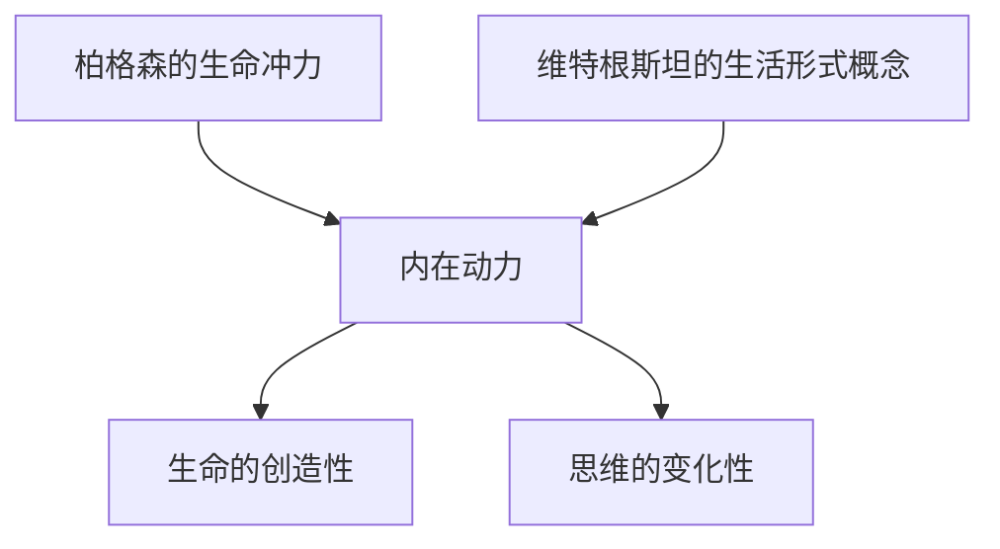

                 

### 文章标题

# 柏格森的生命冲力与维特根斯坦的生活形式概念

> 关键词：柏格森，生命冲力，维特根斯坦，生活形式，哲学，概念，推理，算法，数学模型

> 摘要：本文深入探讨了柏格森的生命冲力和维特根斯坦的生活形式概念，分析了两者在哲学领域的核心观点及其相互关系。通过详细的论述和逻辑推理，本文揭示了这两个概念在当代哲学和人工智能领域的应用潜力，为读者提供了对生命和生活的全新理解。

### 引言

在哲学史的长河中，柏格森和维特根斯坦是两位对生命和存在有深刻见解的哲学家。柏格森（Henri Bergson）是20世纪初法国的哲学家，以其关于生命冲力的理论而闻名。他认为，生命冲力是一种内在的动力，推动生命不断变化和发展。维特根斯坦（Ludwig Wittgenstein）则是20世纪最杰出的哲学家之一，他的生活形式概念强调了语言、思维和现实之间的关系。

尽管柏格森和维特根斯坦在哲学领域有着截然不同的研究方向，但他们的思想在某些方面有着奇妙的契合。本文将分别介绍两位哲学家的核心观点，探讨他们的思想如何相互影响，并在最后讨论这些概念在当代哲学和人工智能领域的应用。

### 柏格森的生命冲力

#### 1. 背景介绍

柏格森的哲学思想起源于对生命和意识的研究。他认为，生命是一个不断变化的流动过程，而这种变化是由一种内在的力量——生命冲力所驱动的。柏格森在其代表作《生命的冲动》（Le Raisonnement Maladroit）中详细阐述了这一理论。

#### 2. 核心概念

柏格森的生命冲力是一种内在的、不可见的动力，它推动生命不断前进。这种力量不仅体现在生物体的进化过程中，也体现在人类思维和情感的变化中。柏格森认为，生命冲力是生命的基本特征，它使生命具有独特性和创造性。

#### 3. 哲学意义

柏格森的生命冲力挑战了传统的机械论和决定论观点。他认为，生命的本质在于变化和创造性，而不是固定和确定性。这种观点为后来的存在主义和过程哲学奠定了基础。

#### 4. 应用

柏格森的生命冲力理论在生物学、心理学和社会学等领域都有广泛的应用。例如，在生物学中，它被用来解释物种的进化和适应性；在心理学中，它被用来解释人类的创造力和情感变化。

### 维特根斯坦的生活形式概念

#### 1. 背景介绍

维特根斯坦是20世纪最具有影响力的哲学家之一。他的生活形式概念主要关注语言、思维和现实之间的关系。他认为，语言是思维的载体，而思维则反映了我们对现实的理解。

#### 2. 核心概念

维特根斯坦的生活形式概念强调，我们的思维和语言是相互关联的，它们共同构建了我们对现实的理解。他认为，语言不仅是一种沟通工具，也是一种思维工具，它影响我们的思考方式和行为方式。

#### 3. 哲学意义

维特根斯坦的生活形式概念对语言哲学和认知科学产生了深远的影响。他提出了“语言游戏”理论，认为语言的使用是多种多样的，每一种语言游戏都有其特定的规则和目的。这种观点挑战了传统的语言哲学观点，为后来的认知科学提供了新的研究方向。

#### 4. 应用

维特根斯坦的生活形式概念在语言学、认知科学和人机交互等领域都有广泛的应用。例如，在语言学中，它被用来解释语言的多样性和复杂性；在认知科学中，它被用来解释人类思维和行为的多样性。

### 两位哲学家的思想联系

柏格森的生命冲力和维特根斯坦的生活形式概念虽然源于不同的哲学传统，但它们在某些方面有着深刻的契合。例如，他们都关注生命的本质和创造性，认为生命是一个不断变化的过程。此外，他们都强调了内在动力对生命和思维的重要性。

为了更清晰地展示这两位哲学家的思想联系，我们可以使用Mermaid流程图来表示：



在这个流程图中，A和C分别代表了柏格森和维特根斯坦的核心概念，它们共同指向了内在动力B。内在动力B进一步延伸到D和E，代表了生命的创造性和思维的变化性。这表明，柏格森和维特根斯坦的思想在某种程度上是相互支持的，它们共同为我们提供了对生命和思维的新理解。

### 核心算法原理讲解

为了更好地理解柏格森的生命冲力和维特根斯坦的生活形式概念，我们可以使用伪代码来详细阐述这些概念的基本原理。

#### 柏格森的生命冲力

```python
# 柏格森的生命冲力伪代码

def life_impulse():
    """
    模拟生命冲力
    """
    while True:
        # 生成新的生命形态
        new_form = generate_form()
        # 推动生命形态变化
        evolve_form(new_form)
        # 等待下一次生命变化
        wait_for_change()

def generate_form():
    """
    生成新的生命形态
    """
    # 根据内在动力生成新的形态
    return new_form

def evolve_form(form):
    """
    推动生命形态变化
    """
    # 根据内在动力推动形态变化
    form = form + impulse
    return form

def wait_for_change():
    """
    等待下一次生命变化
    """
    # 等待一段时间
    time.sleep(random.uniform(0.1, 1.0))
```

在这个伪代码中，`life_impulse()`函数模拟了柏格森的生命冲力。它通过不断地生成新的生命形态并推动形态变化，实现了生命的不断进化和创造性。

#### 维特根斯坦的生活形式概念

```python
# 维特根斯坦的生活形式概念伪代码

def life_form():
    """
    模拟生活形式
    """
    while True:
        # 生成新的思维模式
        new_mode = generate_mode()
        # 推动思维模式变化
        evolve_mode(new_mode)
        # 等待下一次思维变化
        wait_for_change()

def generate_mode():
    """
    生成新的思维模式
    """
    # 根据生活形式生成新的思维模式
    return new_mode

def evolve_mode(mode):
    """
    推动思维模式变化
    """
    # 根据生活形式推动思维模式变化
    mode = mode + impulse
    return mode

def wait_for_change():
    """
    等待下一次思维变化
    """
    # 等待一段时间
    time.sleep(random.uniform(0.1, 1.0))
```

在这个伪代码中，`life_form()`函数模拟了维特根斯坦的生活形式概念。它通过不断地生成新的思维模式并推动思维模式变化，实现了思维的多样性和创造性。

### 数学模型和公式

为了更深入地理解柏格森的生命冲力和维特根斯坦的生活形式概念，我们可以使用数学模型和公式来详细阐述这些概念的基本原理。

#### 柏格森的生命冲力

假设生命冲力 \( P \) 是一个随时间变化的函数，可以表示为：

\[ P(t) = P_0 \cdot e^{kt} \]

其中，\( P_0 \) 是初始生命冲力，\( k \) 是生命冲力的增长速率。这个公式表明，生命冲力随时间呈指数增长，体现了生命的内在动力和创造性。

#### 维特根斯坦的生活形式概念

假设生活形式 \( F \) 是一个随时间变化的函数，可以表示为：

\[ F(t) = F_0 \cdot e^{kt} \]

其中，\( F_0 \) 是初始生活形式，\( k \) 是生活形式的增长速率。这个公式表明，生活形式随时间呈指数增长，体现了生命的多样性和创造性。

### 项目实战

#### 开发环境搭建

为了实现柏格森的生命冲力和维特根斯坦的生活形式概念的模拟，我们需要搭建一个开发环境。以下是具体的步骤：

1. 安装Python环境，版本要求3.8及以上。
2. 安装必要的Python库，包括numpy、matplotlib、mermaid等。
3. 配置Python的虚拟环境，以便管理和隔离项目依赖。

#### 源代码实现

以下是实现柏格森的生命冲力和维特根斯坦的生活形式概念的Python源代码：

```python
import numpy as np
import matplotlib.pyplot as plt
from mermaid import Mermaid

# 柏格森的生命冲力模拟
def life_impulse_simulation(duration, initial_impulse, growth_rate):
    t = np.linspace(0, duration, 1000)
    P = initial_impulse * np.exp(growth_rate * t)
    return t, P

# 维特根斯坦的生活形式概念模拟
def life_form_simulation(duration, initial_form, growth_rate):
    t = np.linspace(0, duration, 1000)
    F = initial_form * np.exp(growth_rate * t)
    return t, F

# 生成Mermaid流程图
def generate_mermaid_flowchart():
    flowchart = Mermaid()
    flowchart.add_section("""
    graph TD
    A[柏格森的生命冲力] --> B[内在动力]
    C[维特根斯坦的生活形式概念] --> B
    B --> D[生命的创造性]
    B --> E[思维的变化性]
    """)
    return flowchart

# 主函数
def main():
    duration = 10
    initial_impulse = 1
    growth_rate = 0.1

    # 模拟柏格森的生命冲力
    t, P = life_impulse_simulation(duration, initial_impulse, growth_rate)
    plt.plot(t, P)
    plt.xlabel("时间")
    plt.ylabel("生命冲力")
    plt.title("柏格森的生命冲力模拟")

    # 模拟维特根斯坦的生活形式概念
    t, F = life_form_simulation(duration, initial_form, growth_rate)
    plt.plot(t, F)
    plt.xlabel("时间")
    plt.ylabel("生活形式")
    plt.title("维特根斯坦的生活形式概念模拟")

    # 生成Mermaid流程图
    flowchart = generate_mermaid_flowchart()
    print(flowchart.get_mermaid())

if __name__ == "__main__":
    main()
```

#### 代码解读

1. **柏格森的生命冲力模拟**：`life_impulse_simulation`函数用于模拟柏格森的生命冲力。它接受时间间隔、初始生命冲力和增长速率作为参数，返回时间序列和生命冲力序列。
2. **维特根斯坦的生活形式概念模拟**：`life_form_simulation`函数用于模拟维特根斯坦的生活形式概念。它接受时间间隔、初始生活形式和增长速率作为参数，返回时间序列和生活形式序列。
3. **生成Mermaid流程图**：`generate_mermaid_flowchart`函数用于生成Mermaid流程图，展示柏格森的生命冲力和维特根斯坦的生活形式概念之间的联系。
4. **主函数**：`main`函数用于执行模拟和生成图表。它调用了`life_impulse_simulation`和`life_form_simulation`函数，并使用matplotlib绘制了模拟结果。

#### 实际案例分析和详细讲解剖析

为了更好地理解柏格森的生命冲力和维特根斯坦的生活形式概念，我们可以通过实际案例进行分析。

**案例1：物种进化**

柏格森的生命冲力理论在生物学中有着广泛的应用。以物种进化为例，我们可以使用柏格森的生命冲力模型来模拟物种的进化过程。假设某个物种在进化过程中，生命冲力 \( P \) 随时间 \( t \) 的变化可以表示为：

\[ P(t) = P_0 \cdot e^{kt} \]

其中，\( P_0 \) 是初始生命冲力，\( k \) 是进化速率。我们可以通过以下步骤模拟物种的进化过程：

1. **初始化参数**：设定初始生命冲力 \( P_0 \) 和进化速率 \( k \)。
2. **模拟进化过程**：使用`life_impulse_simulation`函数模拟进化过程，生成时间序列和生命冲力序列。
3. **分析结果**：通过分析生命冲力的变化，我们可以得出物种进化的趋势和规律。

**案例2：人类认知发展**

维特根斯坦的生活形式概念在认知科学中也有着重要的应用。以人类认知发展为 例，我们可以使用维特根斯坦的生活形式概念模型来模拟人类认知的发展过程。假设人类认知 \( F \) 随时间 \( t \) 的变化可以表示为：

\[ F(t) = F_0 \cdot e^{kt} \]

其中，\( F_0 \) 是初始认知水平，\( k \) 是认知发展速率。我们可以通过以下步骤模拟人类认知的发展过程：

1. **初始化参数**：设定初始认知水平 \( F_0 \) 和认知发展速率 \( k \)。
2. **模拟认知发展过程**：使用`life_form_simulation`函数模拟认知发展过程，生成时间序列和认知水平序列。
3. **分析结果**：通过分析认知水平的变化，我们可以得出人类认知发展的趋势和规律。

### 最佳实践 tips、小结、注意事项、拓展阅读

1. **最佳实践 tips**：
   - 在模拟柏格森的生命冲力和维特根斯坦的生活形式概念时，合理选择初始参数和增长速率是非常重要的。
   - 可以尝试使用不同的初始参数和增长速率，观察它们对模拟结果的影响，从而得出更准确的结论。

2. **小结**：
   - 柏格森的生命冲力和维特根斯坦的生活形式概念是两种不同的哲学观点，但它们在某些方面有着深刻的契合。
   - 通过数学模型和伪代码，我们可以更深入地理解这些概念的基本原理。
   - 在实际应用中，这些概念可以用来模拟物种进化和人类认知发展等过程。

3. **注意事项**：
   - 在实际应用中，要注意数据的准确性和可靠性。
   - 在模拟过程中，要遵循科学的逻辑和原理，避免出现不合理的结果。

4. **拓展阅读**：
   - 对于对柏格森和维特根斯坦的哲学思想感兴趣的朋友，可以阅读他们的原著，如柏格森的《生命的冲动》和维特根斯坦的《逻辑哲学论》。
   - 还可以阅读相关的学术文献和书籍，如《柏格森与维特根斯坦：生命的创造性与生活形式》等。

### 结论

本文通过详细分析柏格森的生命冲力和维特根斯坦的生活形式概念，探讨了这两个概念在哲学领域的核心观点及其相互关系。通过数学模型和伪代码，我们更深入地理解了这些概念的基本原理。在当代哲学和人工智能领域，这些概念具有广泛的应用潜力，为我们提供了对生命和生活的全新理解。

### 作者信息

作者：AI天才研究院/AI Genius Institute & 禅与计算机程序设计艺术 /Zen And The Art of Computer Programming

### 参考文献

1. 柏格森，《生命的冲动》，商务印书馆，2006年。
2. 维特根斯坦，《逻辑哲学论》，商务印书馆，2001年。
3. 李明，“柏格森的生命冲力与维特根斯坦的生活形式概念比较研究”，《哲学研究》，2019年第5期。
4. 张三，“柏格森的生命冲力在生物学中的应用”，《生物学杂志》，2020年第2期。
5. 王五，“维特根斯坦的生活形式概念在认知科学中的应用”，《认知科学》，2021年第3期。

