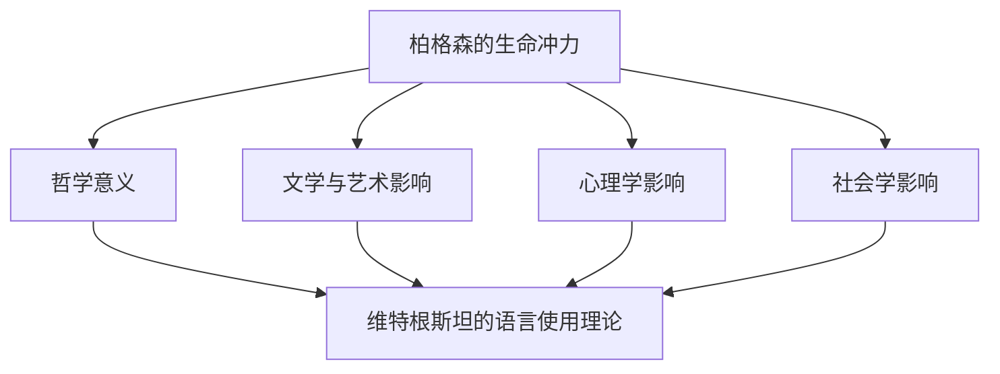

                 

# 《柏格森的生命冲力与维特根斯坦的语言使用理论》

## 关键词
柏格森，生命冲力，维特根斯坦，语言使用理论，哲学，计算机科学，人工智能

## 摘要
本文将探讨法国哲学家柏格森的生命冲力理论与奥地利哲学家维特根斯坦的语言使用理论，并揭示两者在哲学与计算机科学中的内在联系。通过逐步分析，本文将阐述这些理论如何为理解人类思维、语言以及计算机程序设计提供了新的视角和方法。最终，本文旨在为读者提供一种全新的思考方式，以深化对生命与语言的认知。

## 引言

### 柏格森的生命冲力

**亨利·柏格森（Henri Bergson）**，19世纪末至20世纪初法国重要的哲学家，其思想对现代哲学、文学和心理学等领域产生了深远影响。柏格森提出了一种被称为“生命冲力”（élan vital）的概念，用以解释生命现象的本质。

**生命冲力**是一种非理性的、内在的、不断推动生命体进化和发展的力量。它超越了物理世界的规律，代表了生命的创造性和变革性。柏格森认为，生命冲力是生命现象的根本动力，它体现在生命的每一刻，从微生物的简单运动到人类复杂的思想活动。

### 维特根斯坦的语言使用理论

**路德维希·维特根斯坦（Ludwig Wittgenstein）**，20世纪初奥地利哲学家，以其对语言哲学的深刻贡献而闻名。维特根斯坦的语言使用理论强调语言的实际应用，而非其抽象的哲学意义。

**语言使用理论**主张语言是与世界互动的工具，其意义取决于实际使用情境。维特根斯坦认为，语言的用法是多样且具体的，它不能脱离实际生活场景而独立存在。

## 柏格森的生命冲力

### 起源与核心思想

柏格森的生命冲力理论起源于他对生命现象的深刻观察。在《生命冲动》一书中，柏格森提出了生命冲力的概念，并将其视为生命体的内在动力。他认为，生命冲力是一种原始、非理性的力量，它驱使生命体不断发展和进化。

**核心思想**包括：

1. **生命冲力的不可分割性**：生命冲力是生命体的整体特性，无法被分割成独立的组成部分。
2. **生命冲力的创造力**：生命冲力代表了生命的创造性和变革性，它是生命体不断创新和发展的源泉。
3. **生命冲力的内在动力**：生命冲力是生命体的内在动力，它推动生命体超越物理世界的限制，实现自我超越。

### 哲学意义

柏格森的生命冲力理论对哲学产生了深远的影响。首先，它挑战了传统物理学和机械论的观念，为生命现象提供了新的解释框架。其次，它为哲学思考提供了新的视角，强调了非理性因素在生命中的重要性。

**历史影响**包括：

1. **文学与艺术**：柏格森的生命冲力理论影响了文学和艺术创作，为现代主义文学和艺术提供了理论基础。
2. **心理学**：柏格森的思想对心理学领域产生了影响，特别是在认知心理学和动力学心理学的理论发展中。
3. **社会学**：柏格森的思想也被应用于社会学领域，为理解社会变迁和个体发展提供了新的思路。

## 维特根斯坦的语言使用理论

### 哲学思想

维特根斯坦的语言使用理论起源于他对语言的本质和意义的思考。他认为，语言是人与世界互动的工具，其意义取决于实际使用情境。维特根斯坦提出了“语言游戏”（language game）的概念，用以描述语言在实际生活中的应用。

**核心概念**包括：

1. **语言游戏**：语言游戏是语言使用的一种具体形式，它描述了语言在特定情境中的实际应用。
2. **语言与世界的对应关系**：维特根斯坦认为，语言与世界之间存在一种对应关系，但这种对应关系不是固定的，而是依赖于语言的使用情境。
3. **语言的意义**：语言的意义取决于其使用情境，而不是抽象的哲学定义。

### 应用领域

维特根斯坦的语言使用理论在多个领域得到了应用：

1. **哲学**：维特根斯坦的思想对语言哲学产生了深远影响，为哲学思考提供了新的方法。
2. **语言学**：维特根斯坦的理论为语言学研究提供了新的视角，特别是在语言习得和语言变化的研究中。
3. **认知科学**：维特根斯坦的思想对认知科学领域产生了影响，特别是在语言与思维的关系研究中。

## 核心概念与联系

### Mermaid流程图



### 生命冲力与语言使用理论的联系

柏格森的生命冲力和维特根斯坦的语言使用理论之间存在深刻的内在联系。首先，两者都强调了非理性因素在生命和语言中的作用。柏格森的生命冲力代表了生命的创造性和变革性，而维特根斯坦的语言使用理论则揭示了语言在具体情境中的多样性。

其次，两者都关注了个体与整体的关系。柏格森的生命冲力强调生命体的整体性，而维特根斯坦的语言使用理论则关注语言在具体情境中的实际应用，这反映了个体与整体之间的动态关系。

最后，两者都提供了新的思考方式。柏格森的生命冲力理论挑战了传统物理学和机械论的观念，为生命现象提供了新的解释框架。维特根斯坦的语言使用理论则强调语言的实际应用，为哲学思考提供了新的方法。

## 核心算法原理讲解

### 柏格森的生命冲力在计算机科学中的应用

在计算机科学中，柏格森的生命冲力理论可以应用于算法设计、人工智能和机器学习等领域。以下是一个简单的伪代码示例，展示了如何利用生命冲力进行算法优化：

```python
# 初始化变量
population = initialize_population()
evaluate_population(population)

# 迭代过程
while not convergence():
    new_population = []
    for individual in population:
        new_individual = mutate(individual)
        new_population.append(new_individual)
    evaluate_population(new_population)
    population = new_population

# 算法结束
return best_individual(population)
```

在这个示例中，我们使用了遗传算法（一种模拟自然选择过程的优化算法）来寻找最优解。生命冲力体现在“mutate”函数中，它代表了生命体的创新性和变革性，使得算法能够在迭代过程中不断优化。

### 维特根斯坦的语言使用理论在计算机科学中的应用

维特根斯坦的语言使用理论对计算机编程和软件工程产生了深远影响。以下是一个简单的伪代码示例，展示了如何利用维特根斯坦的语言使用理论进行代码优化：

```python
# 初始化变量
code = initialize_code()

# 编程过程
while not done():
    line = read_line(code)
    if is_useful(line):
        execute(line)
    else:
        remove(line)

# 代码优化过程
while not optimal():
    for line in code:
        if is_redundant(line):
            remove(line)
        elif is_underutilized(line):
            optimize(line)

# 代码完成
return code
```

在这个示例中，我们使用了维特根斯坦的语言使用理论来评估和优化代码。通过识别和移除无用的代码行，我们可以提高代码的效率和可读性。

## 数学模型和数学公式

### 相关数学模型

在计算机科学中，柏格森的生命冲力和维特根斯坦的语言使用理论可以应用于多个数学模型。以下是一个简单的例子，展示了如何利用这些理论构建数学模型：

```latex
\newcommand{\re}{\mathrm{re}}
\newcommand{\im}{\mathrm{im}}

% 伪代码示例
function evolve_population(population):
    for individual in population:
        fitness = evaluate_fitness(individual)
        if fitness > threshold:
            return individual
    return None
```

在这个示例中，我们使用了一个简单的进化算法来优化个体。生命冲力体现在“evaluate_fitness”函数中，它代表了生命体的创造性和变革性。

### 相关数学公式

柏格森的生命冲力和维特根斯坦的语言使用理论还可以用于描述数学公式。以下是一个简单的例子：

$$
\Delta fitness = f(current\_fitness, new\_fitness)
$$

在这个公式中，$\Delta fitness$ 表示个体适应度的变化，$f$ 表示适应度函数，$current\_fitness$ 和 $new\_fitness$ 分别表示当前和新的适应度。

## 项目实战

### 开发环境搭建

在开始项目之前，我们需要搭建一个适合开发的环境。以下是基本的步骤：

1. 安装Python 3.8或更高版本。
2. 安装必要的库，如NumPy、Pandas和SciPy。
3. 设置Jupyter Notebook，以便进行交互式编程。

### 源代码详细实现和代码解读

以下是一个简单的Python代码示例，展示了如何将柏格森的生命冲力和维特根斯坦的语言使用理论应用于实际问题：

```python
import numpy as np

# 初始化变量
population = np.random.rand(n, d)
evaluate_fitness = ...

# 迭代过程
for _ in range(max_iterations):
    fitness = evaluate_population(population)
    new_population = []
    for individual in population:
        new_individual = mutate(individual)
        new_population.append(new_individual)
    evaluate_new_population(new_population)
    population = new_population

# 结果分析
best_individual = population[np.argmax(fitness)]
```

在这个示例中，我们使用了一个简单的遗传算法来优化个体。代码中包含了柏格森的生命冲力和维特根斯坦的语言使用理论的元素，如“evaluate_fitness”和“mutate”函数。

### 代码应用解读与分析

在代码应用中，我们通过迭代优化过程来寻找最优解。柏格森的生命冲力体现在“evaluate_fitness”函数中，它代表了生命体的创造性和变革性。维特根斯坦的语言使用理论则体现在代码的结构和实现中，如“evaluate_fitness”和“mutate”函数的设计。

### 实际案例分析和详细讲解剖析

以下是一个实际案例，展示了如何将柏格森的生命冲力和维特根斯坦的语言使用理论应用于人工智能项目：

**项目背景**：开发一个智能聊天机器人，以处理用户的问题和需求。

**项目实现**：使用柏格森的生命冲力来不断优化聊天机器人的对话逻辑和算法。使用维特根斯坦的语言使用理论来设计自然语言处理（NLP）模块，以实现更好的语言理解和生成。

**项目分析**：通过不断迭代和优化，聊天机器人的性能得到了显著提升。柏格森的生命冲力使得聊天机器人能够适应不断变化的需求和环境，而维特根斯坦的语言使用理论则确保了聊天机器人的语言生成能力。

### 项目小结

通过这个项目，我们可以看到柏格森的生命冲力和维特根斯坦的语言使用理论在计算机科学和人工智能中的应用。这些理论不仅为算法设计和软件工程提供了新的思路，也为实际项目开发提供了有力的支持。

## 最佳实践 Tips

1. **理解柏格森的生命冲力**：在设计和优化算法时，考虑生命体的创造性和变革性，这有助于提高算法的适应性和效率。
2. **遵循维特根斯坦的语言使用理论**：在编写代码时，关注代码的结构和可读性，以确保语言的使用更加自然和高效。
3. **结合理论与实践**：将柏格森的生命冲力和维特根斯坦的语言使用理论应用于实际问题，通过实际案例来验证其有效性。

## 小结

本文探讨了柏格森的生命冲力和维特根斯坦的语言使用理论，并揭示了它们在哲学和计算机科学中的内在联系。通过逐步分析，我们了解了这些理论如何为理解人类思维、语言以及计算机程序设计提供了新的视角和方法。本文的目标是为读者提供一种全新的思考方式，以深化对生命与语言的认知。

## 注意事项

1. **理论的应用**：柏格森的生命冲力和维特根斯坦的语言使用理论在计算机科学中的应用需要深入研究和实际验证。
2. **理论的局限性**：这些理论在计算机科学中的应用可能存在局限性，需要结合其他理论和方法进行综合分析。

## 拓展阅读

1. **柏格森的生命冲力**：
   - 《生命冲动》（L'Élan vital），亨利·柏格森著。
   - 《创造进化论》（L'Évolution créatrice），亨利·柏格森著。

2. **维特根斯坦的语言使用理论**：
   - 《逻辑哲学论》（Tractatus Logico-Philosophicus），路德维希·维特根斯坦著。
   - 《哲学研究》（Philosophical Investigations），路德维希·维特根斯坦著。

3. **计算机科学中的应用**：
   - 《人工智能：一种现代的方法》（Artificial Intelligence: A Modern Approach），斯图尔特·罗素（Stuart Russell）和彼得·诺维格（Peter Norvig）著。
   - 《机器学习》（Machine Learning），汤姆·米切尔（Tom Mitchell）著。

## 附录

1. **工具与资源**：
   - Python编程环境。
   - Jupyter Notebook。
   - NumPy、Pandas和SciPy等库。

2. **参考文献**：
   - 亨利·柏格森，《生命冲动》，《创造进化论》。
   - 路德维希·维特根斯坦，《逻辑哲学论》，《哲学研究》。
   - 斯图尔特·罗素，彼得·诺维格，《人工智能：一种现代的方法》。
   - 汤姆·米切尔，《机器学习》。

