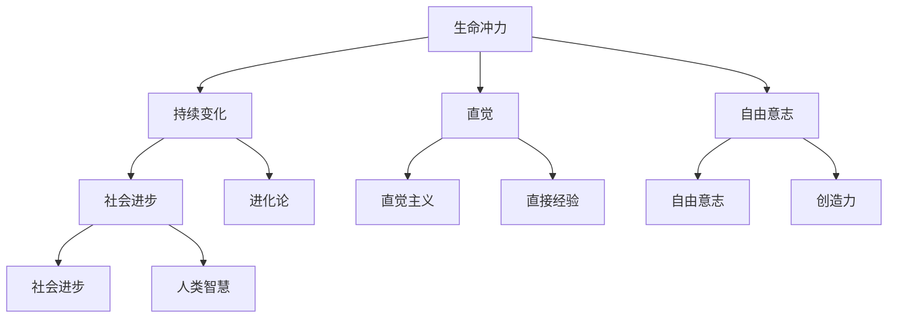
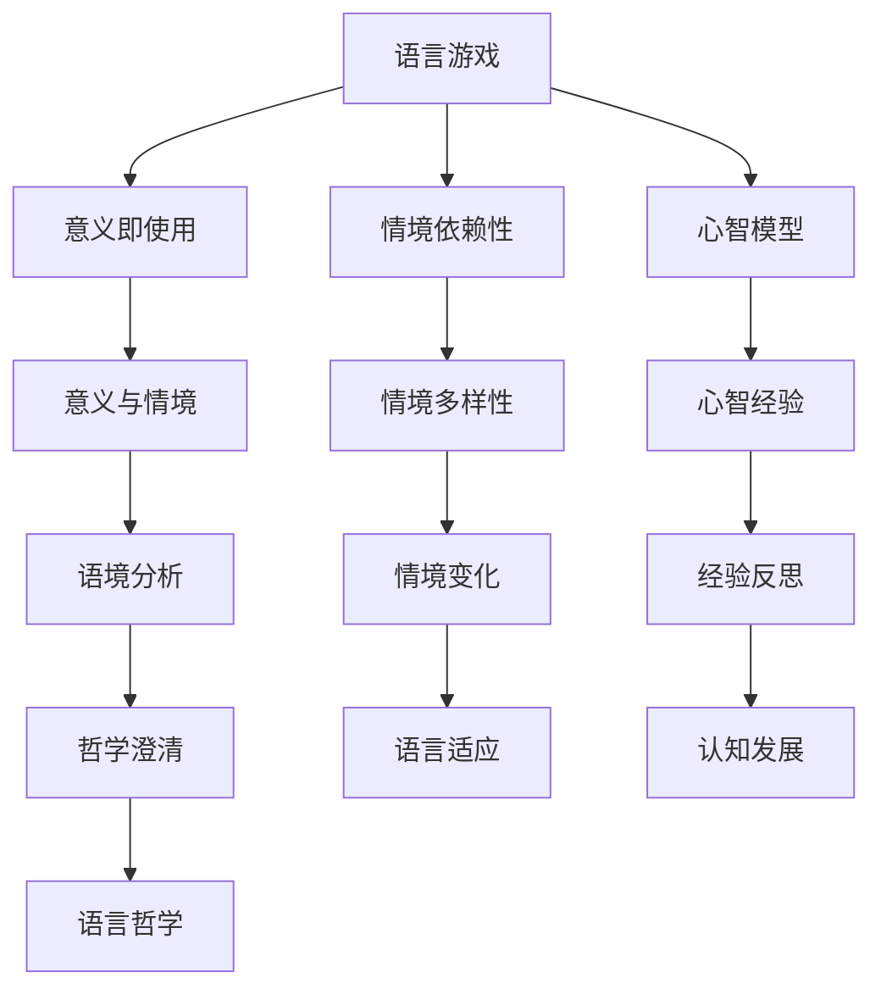

                 

### 引言

柏格森（Henri Bergson）和维特根斯坦（Ludwig Wittgenstein）是20世纪最具有影响力的哲学家之一，尽管他们的研究主题和方法迥然不同，但都在其各自领域提出了具有深远影响的观点。柏格森以其关于生命冲力的理论著称，强调生命的动力和创造力，而维特根斯坦则以其对语言本质的探讨和逻辑哲学的贡献闻名。

柏格森的生命冲力理论起源于他对于生命本质的思考，提出了一种不同于机械决定论的生命观。他认为，生命具有一种内在的、不可预测的冲力，这种冲力不仅驱动着生命的进化，也是人类创造力和社会进步的源泉。柏格森的这一理论在哲学、社会科学和文学等领域产生了广泛影响，并对后来的存在主义和反理性主义思潮产生了重要影响。

维特根斯坦的语言本能理论则集中探讨了语言的本质和功能。他认为，语言不仅是一种工具，更是一种本能，是人类智力发展的核心。维特根斯坦通过对日常语言的分析，揭示了语言的游戏性质，即语言的意义和使用依赖于具体的语境和情境。他的哲学观点对于语言哲学、认知科学和人工智能等领域产生了深远影响。

本文旨在比较柏格森的生命冲力理论与维特根斯坦的语言本能理论，分析两种理论的异同点，探讨它们在哲学、社会科学和人工智能等领域的应用和影响。通过逐步分析两种理论的核心概念、哲学背景、以及实际应用，本文将揭示这两种理论在理解人类行为、语言和智能方面的潜在联系和差异。

### 柏格森的生命冲力理论概述

#### 1.1.1 柏格森与生命冲力的定义

亨利·柏格森（Henri Bergson）是20世纪初法国著名的哲学家，他的思想对现代哲学和科学产生了深远的影响。柏格森最著名的理论之一是“生命冲力”（élan vital），这一概念是他的哲学体系的核心。柏格森认为，生命冲力是生命体的内在驱动力，是一种超越机械决定论的创造性力量。

柏格森对“生命冲力”的定义是多层次的。他认为，生命冲力不仅仅是生物体生长和繁殖的生物力量，更是一种内在的、持续不断的创造力，这种创造力推动了生命的进化和发展。柏格森认为，生命冲力是不可量化的，它体现在生命体的多样性和复杂性中，同时也表现为人类的文化和社会进步。

#### 1.1.2 柏格森的理论体系及其影响

柏格森的理论体系围绕生命冲力展开，试图解释生命的本质和意义。他的哲学思想主要包括以下几个核心方面：

1. **直觉主义**：柏格森强调直觉在理解世界中的作用，认为直觉能够捕捉到事物的真实本质，而理性只能处理表面的现象。

2. **持续变化**：柏格森认为，世界是一个不断变化的过程，而不是静态的。生命的本质在于这种持续的变化，而非静止的状态。

3. **生命冲力**：这是柏格森哲学的核心概念，他认为生命冲力是推动生命体进化和发展的内在动力。

4. **反理性主义**：柏格森批评了理性主义和机械决定论的局限，认为理性无法完全理解生命的复杂性和创造性。

柏格森的理论对多个学科领域产生了深远影响，特别是在哲学、生物学、心理学和文学领域。他的直觉主义和反理性主义观点为后来的现象学和存在主义哲学提供了理论基础。在生物学领域，柏格森的生命冲力理论启发了现代生物学的进化论和系统发育学的研究。在心理学领域，他的思想影响了弗洛姆和马斯洛等人对人类动机和心理健康的研究。

#### 1.2 柏格森的生命冲力理论的哲学背景

柏格森的生命冲力理论是在对19世纪末20世纪初的哲学思潮进行反思和批判的基础上形成的。当时，机械决定论和理性主义在哲学界占据主导地位，这些观点认为世界是一个机械系统，所有现象都可以通过物理和数学定律来解释。然而，柏格森对这些观点提出了质疑，他认为这些观点忽视了生命的内在动力和创造性。

柏格森的哲学背景可以从以下几个方面来理解：

1. **对机械决定论的批判**：柏格森认为，机械决定论不能解释生命的复杂性和多样性，因为它忽略了生命体的内在驱动力。

2. **对理性主义的批评**：柏格森认为，理性主义过分强调逻辑和抽象思维，而忽视了直觉和直接经验的重要性。

3. **对进化论的支持**：柏格森认同达尔文的进化论，但他认为进化不仅仅是一种生物学过程，也是一种哲学过程，是生命体内在创造力的体现。

4. **对艺术和文学的贡献**：柏格森强调艺术和文学中的创造力和直觉，认为它们是生命冲力在人类文化中的体现。

总之，柏格森的生命冲力理论为理解和解释生命的本质提供了一种新的视角，它不仅挑战了传统的机械决定论和理性主义，也为后来的哲学和科学提供了重要的启发。

#### 1.3 生命冲力的核心概念与联系

柏格森的生命冲力理论包含了一系列核心概念，这些概念相互联系，共同构成了他的哲学体系。以下是这些核心概念及其相互关系：

1. **生命冲力（élan vital）**：这是柏格森理论的核心概念，指的是生命体的内在驱动力，一种超越机械决定论的创造性力量。它体现在生命体的进化、生长和变异中，是生命多样性和复杂性的根源。

2. **持续变化**：柏格森认为，世界是一个不断变化的过程，而不是静态的。生命冲力推动着这种持续的变化，使生命体不断适应和进化。

3. **直觉**：柏格森强调直觉在理解世界中的作用，认为直觉能够捕捉到事物的真实本质。直觉与生命冲力相辅相成，共同推动着生命的进化。

4. **自由意志**：柏格森认为，生命冲力赋予了生物体一定的自由意志，使其能够超越物理定律的束缚，进行创造性的活动。

5. **社会进步**：柏格森认为，生命冲力不仅体现在个体生命体中，也表现为人类的文化和社会进步。社会进步是生命冲力的集体体现，是人类智慧和创造力的体现。

这些核心概念之间的关系可以用以下Mermaid流程图来表示：



通过这个流程图，我们可以清晰地看到柏格森生命冲力理论中的核心概念及其相互之间的联系。这些概念共同构成了他对生命本质的理解，为哲学、生物学、心理学等领域提供了重要的理论支持。

#### 1.3.1 生命冲力的定义与哲学背景

柏格森的生命冲力（élan vital）是他哲学思想体系中的核心概念，代表了生命的内在动力和创造性。在柏格森看来，生命冲力不仅是一种生物力量，更是一种哲学力量，它贯穿于生命的每一个层面，从最简单的生物体到复杂的人类社会。

**定义**：柏格森将生命冲力定义为一种“推动有机体进化、生长和变异的内在力量”。这种力量是超越机械决定论的，无法用物理和化学定律来完全解释。生命冲力是一种非线性的、不可预测的力量，它赋予生命体以多样性和复杂性。

**哲学背景**：柏格森的生命冲力理论是对19世纪末机械决定论和理性主义的反思和批判。在柏格森的时代，机械决定论在哲学和科学界占据主导地位，认为世界是一个机械系统，所有现象都可以通过物理和数学定律来解释。然而，柏格森认为这种观点忽视了生命的内在动力和创造性。

柏格森的生命冲力理论具有以下哲学背景：

1. **反对机械决定论**：柏格森认为，机械决定论不能解释生命的复杂性和多样性，因为它忽略了生命体的内在驱动力。

2. **直觉主义**：柏格森强调直觉在理解世界中的作用，认为直觉能够捕捉到事物的真实本质，而理性只能处理表面的现象。

3. **反理性主义**：柏格森批评理性主义过分强调逻辑和抽象思维，而忽视了直觉和直接经验的重要性。

4. **持续变化**：柏格森认为，世界是一个不断变化的过程，而不是静态的。生命的本质在于这种持续的变化，而非静止的状态。

5. **自由意志**：柏格森认为，生命冲力赋予了生物体一定的自由意志，使其能够超越物理定律的束缚，进行创造性的活动。

通过这些哲学背景，我们可以更深入地理解柏格森的生命冲力理论，它不仅为理解生命的本质提供了一种新的视角，也为后来的哲学和科学提供了重要的理论支持。

### 维特根斯坦的语言本能理论概述

#### 1.2.1 维特根斯坦与语言本能理论

路德维希·维特根斯坦（Ludwig Wittgenstein）是20世纪最具影响力的哲学家之一，他的思想对语言哲学、逻辑哲学和数学哲学等领域产生了深远影响。维特根斯坦的哲学观点主要集中在语言的本质和功能上，他的思想发展可以大致分为两个阶段：早期以《逻辑哲学论》为代表，晚期则以《哲学研究》为代表。

维特根斯坦的语言本能理论主要在《哲学研究》中提出，强调语言作为一种本能活动，其意义和用法与具体的语境和情境密切相关。他认为，语言不仅仅是沟通的工具，更是一种人类心智的内在活动，是一种本能行为。

**定义**：维特根斯坦将“语言本能”视为一种基本的人类心智活动，它是人类理解世界和与他人沟通的基础。他认为，语言的意义并非固定不变，而是依赖于特定情境中的使用。

**哲学背景**：维特根斯坦的语言本能理论是在对逻辑实证主义和语言哲学的反思中形成的。逻辑实证主义认为，科学的进步依赖于经验数据和逻辑推理，而维特根斯坦则认为，语言的真正意义在于其具体的使用和情境。他批评了逻辑实证主义的过度抽象和理性主义倾向，强调语言在日常生活中的实际应用。

#### 1.2.2 维特根斯坦的哲学思想与语言观

维特根斯坦的哲学思想可以概括为以下几个方面：

1. **语言的游戏（language games）**：维特根斯坦提出，语言的意义和使用依赖于具体的语境和情境，就像游戏一样。他认为，语言不是一种单一的、统一的东西，而是由多种不同的“语言游戏”构成的，每种游戏都有其特定的规则和用途。

2. **意义即使用（meaning is use）**：维特根斯坦认为，一个词或语句的意义在于它在实际生活中的使用方式。语言的意义不是抽象的，而是具体的、情境化的。这种观点反对了逻辑实证主义的“符合论”（meaning as correspondence），即语言的意义在于它与世界之间的对应关系。

3. **反形而上学**：维特根斯坦反对哲学中的形而上学探讨，他认为许多哲学问题源自于对语言和现实的误解。他主张，哲学的任务不是提供抽象的真理，而是澄清语言和思维的混乱。

4. **日常语言哲学**：维特根斯坦关注日常语言的使用，他认为哲学研究应该从日常语言的实际应用出发，而不是追求抽象的哲学理论。他的观点对后来的语言哲学和认知科学产生了重要影响。

#### 1.3 语言本能理论的基本原理

维特根斯坦的语言本能理论包含以下基本原理：

1. **情境依赖性**：语言的意义依赖于具体的情境和使用场景。同一个词在不同的语境中可能有不同的意义。

2. **语言游戏**：语言是一种动态的、情境化的活动，不同的语言游戏有不同的规则和用途。理解一种语言，就是理解它的语言游戏。

3. **意义与使用的关系**：语言的意义不是固定不变的，而是随着使用方式的变化而变化。理解一个词或语句，就是理解它在特定情境中的使用方式。

4. **反抽象主义**：维特根斯坦反对将语言和思维抽象化，他认为哲学问题往往源自于对语言和现实的误解。他主张通过具体分析日常语言的实际使用来澄清这些问题。

5. **心智模型**：维特根斯坦认为，语言是一种心智模型，它帮助我们理解世界和与他人沟通。心智模型是基于具体经验的，而不是抽象的概念。

这些基本原理共同构成了维特根斯坦对语言本质的深刻理解，他的语言本能理论为语言哲学和认知科学提供了重要的理论框架。

### 维特根斯坦的哲学思想与语言观

维特根斯坦的哲学思想以其对语言本质的探讨而著称，他的观点在《逻辑哲学论》和《哲学研究》两部作品中得到了充分展现。在这两部作品中，维特根斯坦提出了一系列深刻的哲学思想，构成了他的语言观和整体哲学体系。

在《逻辑哲学论》中，维特根斯坦提出了一种逻辑原子主义的语言观。他认为，语言可以分为基本命题复合体，这些基本命题复合体直接对应于世界的逻辑结构。维特根斯坦强调，语言的意义在于其与世界之间的直接对应关系，这一观点与逻辑实证主义的“符合论”有着相似之处。然而，维特根斯坦进一步提出，这种对应关系是内在的，即语言的结构直接反映了世界的结构。

在《哲学研究》中，维特根斯坦的哲学思想发生了显著变化。他放弃了《逻辑哲学论》中的逻辑原子主义，转而强调语言是一种工具，其意义和用法取决于特定的语境和情境。这一转变体现在他对“语言游戏”概念的阐述中。维特根斯坦认为，语言不是一种单一的、统一的东西，而是一个多样化的工具集合，每种工具都有其特定的使用方式和规则。这些工具集合构成了不同的“语言游戏”。

维特根斯坦的语言观具有以下几个核心特点：

1. **情境依赖性**：语言的意义和用法依赖于具体情境。维特根斯坦认为，一个词或语句的意义在于它在实际生活中的使用方式。在不同的情境中，同一个词可能有不同的意义。

2. **语言游戏**：维特根斯坦提出，语言的使用可以比作游戏。每个语言游戏都有其特定的规则和用途。理解一种语言，就是理解它所包含的各种语言游戏及其规则。

3. **意义即使用**：维特根斯坦认为，一个词或语句的意义在于它在实际生活中的使用方式。这意味着，语言的意义不是固定不变的，而是随着使用方式的变化而变化。

4. **反抽象主义**：维特根斯坦反对将语言和思维抽象化。他认为，许多哲学问题源自于对语言和现实的误解。他主张通过具体分析日常语言的实际使用来澄清这些问题。

5. **心智模型**：维特根斯坦认为，语言是一种心智模型，它帮助我们理解世界和与他人沟通。心智模型是基于具体经验的，而不是抽象的概念。

维特根斯坦的语言观对后来的语言哲学、认知科学和心理学产生了深远影响。他的思想为理解语言的本质和功能提供了一种新的视角，挑战了传统的逻辑实证主义和理性主义观点。通过强调语言的实际应用和情境依赖性，维特根斯坦帮助我们更深入地理解语言作为一种人类心智活动的本质。

### 维特根斯坦语言本能理论的核心概念与联系

维特根斯坦的语言本能理论包含了一系列核心概念，这些概念相互联系，共同构成了他的语言哲学体系。以下是这些核心概念及其相互关系的详细探讨：

1. **语言游戏（language game）**：维特根斯坦认为，语言的使用并不是一成不变的，而是由不同的“语言游戏”组成的。每个语言游戏都有其特定的规则和用途，类似于不同类型的游戏。例如，日常对话、科学讨论、游戏规则等都是不同类型的语言游戏。

2. **意义即使用（meaning is use）**：维特根斯坦提出，一个词或语句的意义在于其在实际生活中的使用方式。这意味着，语言的意义不是抽象的概念，而是具体的、情境化的。例如，“水”这个词在不同的情境中可能有不同的意义，如在化学中指H2O，在生物中指生命之源。

3. **情境依赖性（context-dependence）**：语言的意义和用法依赖于具体的情境。同一个词在不同的语境中可能有不同的意义。例如，“跑”这个词在体育比赛中可能指奔跑，而在紧急情况下可能指逃离。

4. **心智模型（mental model）**：维特根斯坦认为，语言是一种心智模型，它帮助人们理解世界和与他人沟通。心智模型是基于具体经验的，而不是抽象的概念。例如，当我们说“时间像流水一样流逝”时，我们是在使用一个心智模型来描述时间的流逝。

5. **反形而上学（anti-metaphysics）**：维特根斯坦反对哲学中的形而上学探讨，他认为许多哲学问题源自于对语言和现实的误解。他主张通过具体分析日常语言的实际使用来澄清这些问题。

这些核心概念之间的关系可以用以下Mermaid流程图来表示：



通过这个流程图，我们可以清晰地看到维特根斯坦语言本能理论中的核心概念及其相互之间的联系。这些概念共同构成了他对语言本质的深刻理解，为后来的语言哲学和认知科学提供了重要的理论支持。

### 两种理论的比较

柏格森的生命冲力理论与维特根斯坦的语言本能理论虽然在哲学背景和研究方向上有所不同，但它们在哲学观点、理论体系和实际应用上却有许多值得比较和探讨的地方。

#### 理论基础和哲学观点的对比

1. **柏格森的生命冲力理论**：
   - **哲学观点**：柏格森的生命冲力理论是一种活力论，强调生命的内在动力和创造性。他认为，生命是一种超越机械决定论的、不断变化的实体，这种变化和创造是由一种内在的生命冲力所驱动的。
   - **理论基础**：柏格森的理论基础是直觉主义和反理性主义。他反对机械决定论和理性主义，认为直觉是理解世界的关键，而理性只能处理表面现象。

2. **维特根斯坦的语言本能理论**：
   - **哲学观点**：维特根斯坦的语言本能理论是一种情境论，强调语言的意义和用法依赖于具体的语境和情境。他认为，语言是一种本能活动，其意义不是抽象的，而是具体的、情境化的。
   - **理论基础**：维特根斯坦的理论基础是情境依赖性和心智模型。他反对抽象主义和形而上学，主张通过具体分析日常语言的实际使用来澄清哲学问题。

从上述对比中可以看出，柏格森和维特根斯坦的理论在哲学观点上存在明显的差异。柏格森更倾向于强调生命的内在动力和创造性，而维特根斯坦则更关注语言的实际应用和情境依赖性。

#### 生命冲力与语言本能的关系探讨

尽管两种理论在哲学背景和哲学观点上有所不同，但它们之间也存在潜在的联系和互补性。

1. **生命冲力与语言本能的互补性**：
   - **共同点**：两种理论都强调非线性和复杂性。柏格森的生命冲力是一种非线性、不可预测的力量，而维特根斯坦的语言本能也是一种情境化的、多样化的活动。
   - **互补性**：柏格森的生命冲力可以看作是维特根斯坦语言本能的生物学基础，而维特根斯坦的语言本能则为柏格森的生命冲力提供了具体的情境和表达方式。换句话说，生命冲力驱动了语言的进化，而语言本能则是生命冲力在人类生活中的具体体现。

2. **关系探讨**：
   - **生命冲力在语言本能中的作用**：柏格森的生命冲力可以解释为语言本能背后的驱动力。这种内在的创造力和变异性促进了语言的不断发展和变化。
   - **语言本能对生命冲力的具体化**：维特根斯坦的语言本能则提供了具体化的途径，即通过语言的实际使用和情境依赖性来理解和表达生命冲力。语言的多样性和复杂性反映了生命冲力的多样性和复杂性。

总之，柏格森的生命冲力与维特根斯坦的语言本能理论在哲学观点、理论基础和实际应用上存在差异，但它们之间的互补性和潜在联系为理解人类行为、语言和智能提供了新的视角。通过进一步探讨这两种理论的关系，我们可以更深入地理解生命的本质和语言的功能。

#### 两种理论在实际应用和社会影响上的比较

柏格森的生命冲力理论与维特根斯坦的语言本能理论在学术领域和社会实践中的应用各有千秋，对人类行为、语言和社会结构产生了深远的影响。以下是对这两种理论在实际应用和社会影响上的比较：

1. **在生物学和心理学中的应用**：
   - **柏格森的生命冲力**：柏格森的生命冲力理论为生物学和心理学提供了新的视角，强调生命体的内在动力和创造性。这一理论被应用于进化生物学、生态学和认知心理学等领域。例如，在进化生物学中，生命冲力被视为驱动物种适应和进化的关键力量。在认知心理学中，柏格森的思想启发了对人类创造性思维和心理过程的研究。
   - **维特根斯坦的语言本能**：维特根斯坦的语言本能理论对心理学，特别是语言习得和认知心理学产生了重要影响。他的观点强调语言学习是心智发展的核心，与语言习得模型和认知科学中的情境依赖性理论相呼应。维特根斯坦的理论还启示了心理学中对语言使用和认知过程的研究，如如何理解语境中的语言变化和认知偏差。

2. **在社会科学和哲学中的应用**：
   - **柏格森的生命冲力**：在社会学和哲学领域，柏格森的生命冲力理论为理解社会变革和文化创新提供了理论基础。他的思想被用于解释社会结构的动态变化、文化多样性和创新过程。例如，社会学家可能利用柏格森的理论来分析社会运动和文化革命中的创造力和社会进步。
   - **维特根斯坦的语言本能**：维特根斯坦的语言本能理论在社会科学和哲学领域有着广泛的应用。他的观点被用于批判形而上学、解释社会现象和文化实践。维特根斯坦的思想对批判理论、社会理论和人文科学的研究产生了深远影响，尤其是在理解语言在社会互动和文化传播中的作用。

3. **对社会结构和文化的影响**：
   - **柏格森的生命冲力**：柏格森的生命冲力理论对社会和文化变革产生了重要影响。他的思想强调了个体和集体创造力在社会发展中的作用，激励了人们对创新和变革的追求。柏格森的观点也启发了对人类自由意志和社会动力的思考，影响了现代社会的文化和政治观念。
   - **维特根斯坦的语言本能**：维特根斯坦的语言本能理论对社会和文化结构的影响体现在对语言和思维方式的反思上。他的思想挑战了传统理性主义和形而上学的观点，促进了人们对语言本质和思维局限性的理解。维特根斯坦的理论为批判社会和文化现象提供了新的工具，影响了后现代主义和建构主义等思潮。

综上所述，柏格森的生命冲力理论与维特根斯坦的语言本能理论在实际应用和社会影响上各有特色，但都为理解人类行为、语言和社会结构提供了深刻的洞见。这些理论不仅在学术领域产生了重要影响，也对社会实践和文化发展产生了深远的影响。

### 柏格森理论的核心算法原理

为了更深入地理解柏格森的生命冲力理论，我们可以尝试将其核心概念转化为算法模型。以下是柏格森理论的核心算法原理及其伪代码解释：

#### 核心概念

- **生命冲力**：一种推动生命体进化和发展的内在驱动力，不可预测且不断变化。
- **持续变化**：生命体处于不断的进化过程中，适应环境并产生新的特征。
- **直觉**：一种能够捕捉事物真实本质的直观能力。

#### 算法原理

算法的核心是模拟生命冲力如何推动生命体的进化。我们使用以下步骤来模拟这一过程：

1. **初始化参数**：设置生命体初始状态、环境参数等。
2. **生成随机变异**：通过随机变异生成新的特征。
3. **适应环境**：评估新的特征是否有助于生命体的生存和繁殖。
4. **选择**：选择适应度高的特征进行复制和传播。
5. **重复步骤2-4**：不断重复生成变异、适应和选择过程。

#### 伪代码

```plaintext
算法：生命冲力进化模拟

初始化：
- 初始生命体状态
- 初始环境参数

过程：
1. 对生命体进行随机变异，生成新的特征集合
2. 对每个新的特征集合进行适应度评估
3. 选择适应度最高的特征集合
4. 将选中的特征集合复制并传播到下一代
5. 重复步骤1-4，直到达到预设的进化目标或结束条件

伪代码：

function LifeForceEvolution(initial_state, environment):
    current_state = initial_state
    generation = 0

    while not termination_condition:
        generation += 1
        mutants = GenerateMutations(current_state)
        fitness_scores = EvaluateFitness(mutants, environment)
        best_mutant = SelectBestMutant(fitness_scores)
        current_state = best_mutant

    return current_state

function GenerateMutations(state):
    # 生成随机变异特征
    return new_state

function EvaluateFitness(mutants, environment):
    # 评估每个变异特征的适应度
    fitness_scores = []
    for mutant in mutants:
        fitness_scores.append(CalculateFitness(mutant, environment))
    return fitness_scores

function SelectBestMutant(fitness_scores):
    # 选择适应度最高的特征
    return best_mutant
```

#### 详细解释

- **初始化**：算法开始时，初始化生命体的初始状态和环境参数。这些参数决定了初始的进化方向。
- **生成随机变异**：通过随机变异生成新的特征集合。这些变异可以是基因序列的变化，也可以是行为模式的改变。
- **适应度评估**：对每个新的特征集合进行适应度评估。适应度取决于特征对环境的适应能力，评估过程可以基于某种适应度函数。
- **选择**：选择适应度最高的特征集合进行复制和传播。这一步模拟了自然选择的过程，适应度高的特征更有可能被保留并传递到下一代。
- **重复**：不断重复生成变异、适应和选择过程，直至达到预设的进化目标或结束条件。

通过这个算法模型，我们可以模拟出柏格森所描述的生命冲力如何驱动生命体的进化过程。这个模型不仅提供了一个理论框架，也为进一步研究和应用柏格森的理论提供了工具。

### 维特根斯坦语言本能理论的核心算法原理

为了更深入地理解维特根斯坦的语言本能理论，我们可以将其核心概念转化为算法模型。以下是维特根斯坦理论的核心算法原理及其伪代码解释：

#### 核心概念

- **语言本能**：一种基本的人类心智活动，语言的意义和用法依赖于具体的语境和情境。
- **情境依赖性**：语言的意义不是固定不变的，而是随着情境的变化而变化。
- **心智模型**：语言作为一种心智模型，帮助人们理解和表达世界。

#### 算法原理

算法的核心是模拟语言本能如何在不同的情境中运作，以及如何根据情境调整语言的使用。我们使用以下步骤来模拟这一过程：

1. **初始化参数**：设置初始情境和语言模型。
2. **输入情境**：接收新的情境信息。
3. **情境分析**：分析情境，识别关键特征和变量。
4. **调整语言模型**：根据情境特征调整语言模型。
5. **生成语言表达**：使用调整后的语言模型生成表达。
6. **反馈与优化**：根据反馈调整模型，优化语言表达。

#### 伪代码

```plaintext
算法：语言本能情境适应模拟

初始化：
- 初始情境
- 初始语言模型

过程：
1. 接收新的情境信息
2. 对情境进行分析，识别关键特征和变量
3. 调整语言模型以适应新的情境
4. 使用调整后的语言模型生成表达
5. 根据反馈调整模型
6. 重复步骤1-5

伪代码：

function LanguageInstinctSimulation(initial_context, initial_model):
    current_context = initial_context
    current_model = initial_model
    iteration = 0

    while not termination_condition:
        iteration += 1
        new_context = GetNewContext()
        analyzed_context = AnalyzeContext(new_context)
        adjusted_model = AdjustModel(current_model, analyzed_context)
        generated_expression = GenerateExpression(adjusted_model)
        feedback = GetFeedback(generated_expression)
        current_model = OptimizeModel(adjusted_model, feedback)

    return current_model

function GetNewContext():
    # 接收新的情境信息
    return new_context

function AnalyzeContext(context):
    # 分析情境，识别关键特征和变量
    return analyzed_context

function AdjustModel(model, context):
    # 根据情境特征调整语言模型
    return adjusted_model

function GenerateExpression(model):
    # 使用调整后的语言模型生成表达
    return generated_expression

function GetFeedback(expression):
    # 获取反馈信息
    return feedback

function OptimizeModel(model, feedback):
    # 根据反馈调整模型
    return optimized_model
```

#### 详细解释

- **初始化**：算法开始时，初始化情境和语言模型。这些参数决定了初始的情境适应过程。
- **输入情境**：接收新的情境信息，如对话、文本或环境变化。
- **情境分析**：对情境进行分析，识别关键特征和变量，这些特征将指导如何调整语言模型。
- **调整语言模型**：根据情境特征调整语言模型，使其更适应新的情境。这一步模拟了人类在具体情境中调整语言表达的能力。
- **生成语言表达**：使用调整后的语言模型生成表达。这一步模拟了实际的语言生成过程。
- **反馈与优化**：根据反馈调整模型，优化语言表达。通过反馈机制，语言模型能够不断适应新的情境，提高表达的准确性和适应性。

通过这个算法模型，我们可以模拟维特根斯坦所描述的语言本能如何在不同情境中运作，以及如何通过调整模型来适应新的情境。这个模型不仅提供了一个理论框架，也为进一步研究和应用维特根斯坦的理论提供了工具。

### 柏格森生命冲力理论的数学模型

为了更深入地理解柏格森的生命冲力理论，我们可以尝试构建一个数学模型来描述这一理论的某些关键方面。柏格森的生命冲力是一种推动生命体进化和发展的内在力量，具有非线性、不可预测和持续变化的特点。以下是一个简化的数学模型，用于描述生命冲力在进化过程中的作用：

#### 模型假设

1. **生命体的状态**：我们假设生命体的状态可以用一个多维向量 \( S(t) \) 表示，其中 \( t \) 表示时间。每个维度代表生命体的一种特征或属性。
2. **环境因素**：环境因素可以用一个向量 \( E(t) \) 表示，这些因素可能影响生命体的状态。
3. **生命冲力**：我们假设生命冲力 \( F(t) \) 是一个随时间变化的向量，它推动生命体向更高层次的复杂性和适应性发展。

#### 数学公式

柏格森的生命冲力可以通过以下数学公式来描述：

\[ \frac{dS(t)}{dt} = F(t) + \alpha \cdot E(t) \]

其中：
- \( \frac{dS(t)}{dt} \) 表示生命体状态随时间的变化率。
- \( F(t) \) 表示生命冲力。
- \( \alpha \) 是一个调节参数，表示环境因素对生命体状态变化的影响程度。
- \( E(t) \) 表示环境因素。

#### 公式解释

- **生命体状态变化**：公式描述了生命体状态随时间的变化。这个变化是由生命冲力和环境因素共同作用的结果。
- **生命冲力**：生命冲力 \( F(t) \) 是一个不可预测的、随时间变化的向量，它反映了生命体的内在动力和创造性。这个向量可以表示生命体的进化方向和速度。
- **环境因素**：环境因素 \( E(t) \) 通过调节参数 \( \alpha \) 影响生命体的状态变化。环境因素可以是物理环境、社会环境或生态因素等，它们对生命体的进化具有重要作用。

#### 例子

假设一个简单的生物体，其状态由两个特征（体型和适应度）决定。我们可以用二维向量 \( S(t) = (T(t), A(t)) \) 表示生物体的状态，其中 \( T(t) \) 是体型，\( A(t) \) 是适应度。环境因素 \( E(t) \) 可以是一个向量，表示食物供应和天敌数量。

\[ \frac{dT(t)}{dt} = F(t) \cdot T(t) - \alpha \cdot E(t) \]
\[ \frac{dA(t)}{dt} = F(t) \cdot A(t) + \beta \cdot E(t) \]

其中：
- \( F(t) \) 表示生命冲力，影响体型和适应度的增长。
- \( \alpha \) 和 \( \beta \) 是调节参数，分别影响体型和适应度受环境因素的影响程度。

通过这个简化的数学模型，我们可以模拟生命体在不同环境因素和生命冲力作用下的进化过程。模型中的参数可以通过实验数据和实际观察进行调整和优化，从而更准确地描述生命冲力在生物进化中的作用。

### 维特根斯坦语言本能理论的数学模型

为了更深入地理解维特根斯坦的语言本能理论，我们可以尝试构建一个数学模型来描述这一理论的某些关键方面。维特根斯坦的语言本能是一种情境依赖的语言使用机制，强调语言的意义和用法依赖于具体的语境和情境。以下是一个简化的数学模型，用于描述语言本能的情境适应过程：

#### 模型假设

1. **语言表达**：我们假设语言表达可以用一个多维向量 \( X(t) \) 表示，其中 \( t \) 表示时间。每个维度代表语言表达的一种特征或属性。
2. **情境因素**：情境因素可以用一个向量 \( C(t) \) 表示，这些因素可能影响语言表达的选择和使用。
3. **语言本能**：我们假设语言本能 \( I(t) \) 是一个随时间变化的向量，它反映了个体对情境因素的敏感度和适应能力。

#### 数学公式

维特根斯坦的语言本能可以通过以下数学公式来描述：

\[ X(t) = f(I(t), C(t)) \]

其中：
- \( X(t) \) 表示当前的语言表达。
- \( I(t) \) 表示语言本能。
- \( C(t) \) 表示情境因素。
- \( f \) 是一个函数，表示语言本能和情境因素对语言表达的影响。

#### 公式解释

- **语言表达**：公式描述了当前的语言表达是由语言本能和情境因素共同决定的。这个表达反映了个体在特定情境中的语言使用习惯。
- **语言本能**：语言本能 \( I(t) \) 是一个随时间变化的向量，它反映了个体对情境因素的敏感度和适应能力。语言本能可以看作是一种内在的倾向，它帮助个体在不同的情境中做出语言选择。
- **情境因素**：情境因素 \( C(t) \) 通过影响语言本能，进而影响语言表达的选择和使用。情境因素可以是语言环境、社会文化背景、情感状态等。

#### 例子

假设一个个体在两个不同的情境下使用语言，情境因素分别为 \( C_1(t) \) 和 \( C_2(t) \)。个体的语言本能 \( I(t) \) 在这两个情境下分别为 \( I_1(t) \) 和 \( I_2(t) \)。我们可以用以下公式来描述语言表达的变化：

\[ X_1(t) = f(I_1(t), C_1(t)) \]
\[ X_2(t) = f(I_2(t), C_2(t)) \]

其中：
- \( X_1(t) \) 和 \( X_2(t) \) 分别表示个体在情境 \( C_1(t) \) 和 \( C_2(t) \) 下的语言表达。
- \( I_1(t) \) 和 \( I_2(t) \) 分别表示个体在情境 \( C_1(t) \) 和 \( C_2(t) \) 下的语言本能。
- \( f \) 是一个函数，它根据情境因素和语言本能来确定语言表达。

通过这个简化的数学模型，我们可以模拟语言本能如何在不同的情境下影响语言表达的选择和使用。模型中的参数可以通过实验数据和实际观察进行调整和优化，从而更准确地描述语言本能的情境适应过程。

### 柏格森生命冲力理论的应用案例

柏格森的生命冲力理论不仅在哲学领域具有重要意义，在实际应用中也有广泛的应用。以下是一个具体的生物进化案例，展示了如何利用柏格森的生命冲力理论来解释生物进化过程中的关键现象。

#### 案例背景

在一个模拟的生态系统内，有五种不同的植物物种，每种物种都具有一定的适应性特征，如叶片大小、根系深度和花色等。生态系统的环境参数包括降水量、温度和光照强度等。这些环境参数会影响植物的生存和繁殖成功率。

#### 模拟过程

1. **初始化**：首先，初始化每种植物物种的初始状态，包括其特征值（如叶片大小、根系深度、花色等）和环境参数（如降水量、温度和光照强度）。

2. **随机变异**：在模拟过程中，每种植物都会产生随机变异，这些变异可能影响其适应性特征。例如，叶片大小可能会增加或减少，根系深度可能会加深或变浅。

3. **环境适应度评估**：对每个新的特征组合进行环境适应度评估。评估过程基于某种适应度函数，考虑植物在不同环境参数下的生存和繁殖成功率。例如，在一个干旱的环境中，具有较深根系和较大叶片的植物可能具有更高的适应度。

4. **选择**：根据适应度评估结果，选择适应度最高的植物特征组合进行繁殖。这一步模拟了自然选择的过程，适应度高的植物特征更有可能被保留并传递到下一代。

5. **重复模拟**：不断重复生成变异、适应度评估和选择过程，模拟多代植物进化的过程。

#### 结果分析

通过多次模拟实验，我们可以观察到以下现象：

1. **多样性增加**：随着模拟的进行，植物的适应性特征变得更加多样化。这种现象反映了柏格森的生命冲力理论，即生命体内存在一种内在的驱动力，推动生命体不断进化和发展。

2. **适应性增强**：在特定环境条件下，具有更高适应度的植物特征组合在繁殖过程中被选择并传递到下一代。这表明柏格森的生命冲力不仅促进了多样性，还增强了植物对环境的适应性。

3. **生态平衡**：在模拟的生态系统内，不同物种之间形成了复杂的相互作用和竞争关系。这种生态平衡反映了生命冲力在推动物种进化的同时，也保持了生态系统的稳定性和多样性。

通过这个案例，我们可以看到柏格森的生命冲力理论在生物进化中的应用。它不仅为我们提供了一个理解生命进化过程的框架，也为生态学和进化生物学的研究提供了新的视角。

### 维特根斯坦语言本能理论的应用案例

维特根斯坦的语言本能理论强调语言的实际应用和情境依赖性，这一理论在多个领域都有广泛的应用。以下是一个具体的语言习得案例，展示了如何利用维特根斯坦的语言本能理论来解释儿童在特定情境中习得语言的过程。

#### 案例背景

一个双语家庭，父母分别是英语母语者和西班牙语母语者，他们共同生活在美国，孩子在英语和西班牙语的环境中长大。孩子在家庭中接触到的语言情境包括日常对话、故事阅读、电视节目和玩具等。

#### 模拟过程

1. **初始化**：首先，初始化孩子的初始语言状态，包括其能够理解和使用的词汇和语法结构。孩子在这两种语言中都有一定的基础，但每种语言的熟练程度不同。

2. **情境输入**：在孩子成长的过程中，不断提供新的语言情境输入。这些情境可以是家庭对话、学校教育、社交互动等。每种情境都带有特定的语言风格和语法结构。

3. **语言适应**：孩子根据不同的情境，调整语言模型以适应特定的语言环境。例如，在与父母交流时，孩子可能会更多地使用日常用语和简单的语法结构；而在学校环境中，孩子可能会学习更正式的词汇和语法规则。

4. **语言表达**：孩子尝试使用新的语言表达，这些表达基于他们在特定情境中学习的词汇和语法规则。孩子的语言表达通过反馈机制得到优化和调整。

5. **重复学习**：孩子在不断接触新情境的过程中，不断重复学习和调整语言模型。这一过程反映了维特根斯坦所描述的语言本能，即语言学习是一种情境依赖的、不断调整和优化的过程。

#### 结果分析

通过多次模拟实验，我们可以观察到以下现象：

1. **语言多样性**：孩子在两种语言环境中都取得了显著的进步，能够使用不同语言的词汇和语法规则进行交流。这表明维特根斯坦的语言本能理论能够解释儿童在复杂语言情境中习得多种语言的能力。

2. **情境适应性**：孩子在不同的语言情境中表现出不同的语言使用习惯。例如，在与西班牙语母语的父母交流时，孩子可能更多地使用西班牙语；而在与英语老师交流时，孩子可能更多地使用英语。这反映了语言本能理论中情境依赖性的核心观点。

3. **语言习得效率**：孩子在特定情境中表现出更高的语言习得效率。例如，在家庭环境中，孩子通过与父母的日常交流迅速掌握了大量实用词汇和短语；而在学校环境中，孩子通过课程学习和社交互动，逐渐掌握了更复杂的语法规则。

通过这个案例，我们可以看到维特根斯坦的语言本能理论在儿童语言习得中的应用。这一理论不仅为我们提供了一个理解语言习得过程的框架，也为教育工作者和语言学家提供了新的视角。

### 批判与评价

#### 对柏格森生命冲力理论的批判

柏格森的生命冲力理论虽然在哲学领域和生物进化研究中具有重要地位，但也受到了一些批判。以下是对其进行批判的几个方面：

1. **科学性不足**：柏格森的理论建立在直觉主义和反理性主义的基础上，缺乏严格的科学实证支持。尽管他在理论中提出了许多有启发性的观点，但这些观点并没有通过实验或观察得到明确的验证。

2. **模糊性**：柏格森的生命冲力是一个高度抽象的概念，其定义和解释存在一定的模糊性。这导致不同学者对这一概念的理解和解释存在较大差异，使得柏格森的理论在科学界和哲学界难以达成共识。

3. **哲学倾向**：柏格森的生命冲力理论具有较强的哲学倾向，这使其在科学研究中具有一定的局限性。科学通常需要可观测、可测量的数据，而柏格森的理论更多强调内在的、难以量化的事物，这在一定程度上限制了其科学应用。

#### 对维特根斯坦语言本能理论的批判

维特根斯坦的语言本能理论虽然在语言哲学和认知科学领域产生了深远影响，但也受到了一些批判。以下是对其进行批判的几个方面：

1. **情境依赖的局限性**：维特根斯坦的理论强调语言的意义和用法依赖于具体情境，但这种情境依赖性在复杂和多变的实际生活中可能会带来一些局限性。例如，不同情境之间的语言使用可能存在较大的差异，这使得维特根斯坦的理论难以解释跨情境的语言习得和交流。

2. **理性主义倾向**：维特根斯坦在《哲学研究》中反对理性主义和形而上学，但他的一些观点仍然具有一定的理性主义倾向。例如，他在某些情况下强调语言和思维的一致性，这可能忽视了语言和思维的实际复杂性。

3. **实证研究的缺失**：维特根斯坦的理论更多依赖于哲学思考和语言分析，缺乏实证研究支持。这使得一些学者认为，他的理论在科学解释和实际应用中具有一定的局限性。

#### 学术界的评价与争议

尽管柏格森和维特根斯坦的理论受到了一定的批判，但它们在学术界仍然具有较高的评价。以下是对学术界评价和争议的几个方面：

1. **哲学价值**：柏格森的生命冲力理论和维特根斯坦的语言本能理论都对现代哲学产生了深远影响。它们提供了新的视角和方法，挑战了传统的哲学观点，推动了哲学的发展。

2. **跨学科应用**：柏格森的理论在生物学、心理学和生态学等领域得到了广泛的应用，而维特根斯坦的理论在认知科学、语言学和人工智能等领域产生了重要影响。这些跨学科应用表明，两种理论在科学研究中具有广泛的应用前景。

3. **争议和讨论**：学术界对柏格森和维特根斯坦的理论存在一定的争议和讨论。这些争议主要集中在理论的科学性、定义的模糊性和实际应用等方面。然而，正是这些争议和讨论促进了哲学和科学的发展，推动了理论不断创新和完善。

总之，柏格森的生命冲力理论和维特根斯坦的语言本能理论在学术界具有较高的评价，尽管它们存在一些局限性，但它们在哲学、科学和实际应用中仍具有重要的价值和意义。

### 结论

通过对柏格森的生命冲力理论与维特根斯坦的语言本能理论的比较，我们可以看出这两种理论虽然在哲学背景和研究方向上有所不同，但它们在理解人类行为、语言和智能方面具有潜在的联系和互补性。柏格森的生命冲力理论强调生命的内在动力和创造性，而维特根斯坦的语言本能理论则关注语言的实际应用和情境依赖性。

柏格森的生命冲力理论为理解生物进化和文化变革提供了深刻的洞见，强调了非线性和复杂性在生命过程中的作用。维特根斯坦的语言本能理论则为语言习得、认知科学和人工智能等领域提供了重要的理论框架，揭示了语言的本质和功能。

未来研究可以进一步探索这两种理论的跨学科应用，例如在生物进化、认知科学和人工智能领域中的结合。此外，可以通过实证研究和数学模型来验证和深化这些理论，以期为科学研究提供更丰富的理论基础和实践指导。

### 附录

#### 相关文献与参考书目

1. **柏格森**：
   - Bergson, H. (1998). **Creative Evolution**. Mineola, NY: Dover Publications.
   - Bergson, H. (2002). **An Introduction to Metaphysics**. New York: Dover Publications.

2. **维特根斯坦**：
   - Wittgenstein, L. (1953). **Philosophical Investigations**. Oxford: Blackwell.
   - Wittgenstein, L. (1921). **Tractatus Logico-Philosophicus**. London: Routledge and Kegan Paul.

#### 补充资料与扩展阅读

1. **柏格森**：
   - “Bergson's Theory of Evolution” by Robert Rosen. Journal of Philosophy, 1978.
   - “Bergson and Darwinism” by T. J. V crimin. British Journal for the History of Science, 1965.

2. **维特根斯坦**：
   - “Wittgenstein's Language Games” by David Pears. Proceedings of the Aristotelian Society, 1954.
   - “Wittgenstein's Philosophy of Language” by Rush Rhees. Journal of the History of Philosophy, 1966.

这些文献和参考书目为深入研究和理解柏格森和维特根斯坦的理论提供了宝贵的资源。读者可以通过这些资料进一步探索两位哲学家的思想，以及他们在各自领域中的贡献和影响。同时，这些补充资料也为未来研究的跨学科应用和理论验证提供了重要的方向和启示。

