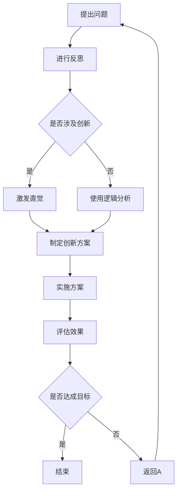
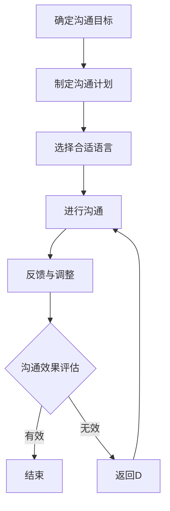

                 


### 第1章 引言

#### 1.1 研究背景与意义

在管理学领域，哲学思想的引入能够为管理者提供新的视角和方法论，从而更好地应对复杂的管理挑战。柏格森的生命哲学和维特根斯坦的日常语言哲学分别从不同的角度对人类的思维和行为模式进行了深刻的探讨，这些探讨对于理解和管理组织中的复杂现象具有重要意义。

柏格森的生命哲学强调生命过程的创造性和时间性，认为时间不是均匀流逝的，而是充满了间断和突变。这种哲学思想对于理解组织中的创新过程、领导力的培养以及组织文化的形成提供了独特的视角。

维特根斯坦的日常语言哲学则关注语言的使用和意义。他认为语言是一种工具，其意义源于使用者的约定和习惯。这一思想对于改善组织内部的沟通、解决问题和提高决策效率具有指导意义。

在管理学中，引入柏格森的生命哲学可以帮助管理者更深刻地理解组织的内在活力和变化规律，从而在战略规划和组织设计中做出更为合理的决策。而维特根斯坦的日常语言哲学则可以为管理者提供一种分析和解决问题的方法论，帮助他们在复杂的环境中找到清晰的方向和有效的行动方案。

#### 1.2 研究方法与结构安排

本研究将采用文献综述的方法，对柏格森的生命哲学和维特根斯坦的日常语言哲学进行深入分析，探讨它们在管理学中的应用。具体研究步骤如下：

1. **文献综述**：收集和整理相关文献，包括柏格森和维特根斯坦的原著、管理学著作以及哲学与管理的跨学科研究。

2. **核心概念与联系**：提炼柏格森生命哲学和维特根斯坦日常语言哲学的核心概念，并构建它们与管理学之间关系的理论框架。

3. **案例分析**：选取具有代表性的案例，分析柏格森生命哲学和维特根斯坦日常语言哲学在实际管理中的应用。

4. **理论验证**：通过案例分析和理论验证，评估这两种哲学思想在管理学中的有效性。

5. **总结与展望**：总结研究成果，讨论哲学思想在管理学中的潜在价值，并提出未来研究的方向。

#### 1.3 全书核心观点概述

全书的核心观点可以概括为：

- **柏格森的生命哲学**：为管理者提供了关于创新、领导力和组织文化的深刻见解，强调了生命过程的创造性和时间性。
- **维特根斯坦的日常语言哲学**：为管理者提供了一种分析和解决问题的方法论，帮助他们在复杂的环境中找到清晰的方向和有效的行动方案。

这两种哲学思想在管理学中的应用不仅丰富了管理学的理论体系，也为实际管理工作提供了新的思路和方法。通过对这些哲学思想的深入探讨，我们可以更好地理解管理过程中的关键问题，提高管理的科学性和实效性。

### 第2章 柏格森的生命哲学

#### 2.1 柏格森生命哲学的核心理念

柏格森（Henri Bergson）的生命哲学是一种关于人类意识和生命本质的哲学思考，其核心概念主要包括：

1. **生命创造性和演化**：柏格森认为，生命是一个持续创造性的过程，它不断产生新的形态和模式。这一观点与传统的机械论和决定论相对立，强调生命的不可预测性和动态性。

2. **感觉与直觉的作用**：柏格森认为，感觉和直觉是人类理解世界的两种基本方式。感觉提供的是外在事物的直接印象，而直觉则能够捕捉到事物的内在结构和本质。直觉在创新和创造性思维中起着至关重要的作用。

3. **时间与空间的关系**：柏格森提出了“绵延”（Duration）的概念，认为时间是流动的、连续的，而不是静态的、可度量的。他强调，时间与空间是密切相关的，空间是时间的固化形式。

#### 2.2 柏格森生命哲学与管理工作

柏格森的生命哲学对于管理工作具有重要的启示作用，主要体现在以下几个方面：

1. **领导力的培养**：柏格森的生命哲学强调了领导者的创造性思维和直觉能力。在现代管理中，领导者不仅需要具备战略规划和决策能力，更需要具备创新和变革的能力，这需要通过培养直觉和创造力来实现。

2. **组织文化的建设**：柏格森的生命哲学提倡生命的多样性和动态性，这对于组织文化的建设具有重要意义。一个健康的组织文化应该是充满活力和创造力的，能够适应外部环境的变化。

3. **决策的创造性过程**：柏格森的生命哲学提供了理解决策过程的新视角。他认为，决策不仅仅是逻辑推理的结果，更是直觉和创造力的体现。管理者需要通过不断地反思和实践，培养自己的直觉和创造力。

#### 2.3 柏格森生命哲学案例分析

**案例 1：企业创新实践**

某高科技企业在其产品研发过程中，引入了柏格森的生命哲学，强调员工的直觉和创新思维。通过定期举办创意工作坊和头脑风暴会议，鼓励员工提出创新的想法和解决方案。这种做法不仅提高了产品的创新性，也增强了企业的核心竞争力。

**案例 2：管理变革案例分析**

某大型企业在面临市场竞争压力时，采用了柏格森的生命哲学来推动管理变革。通过重新定义组织的目标和价值观，鼓励员工积极参与变革过程，从而实现了从传统管理向现代管理的转变。这一变革不仅提高了企业的运营效率，也增强了员工的凝聚力和归属感。

#### 2.4 柏格森生命哲学应用流程图

为了更清晰地展示柏格森生命哲学在管理工作中的应用流程，我们可以使用Mermaid流程图进行描述：



这个流程图展示了从问题提出到解决方案制定和实施，再到效果评估的完整过程。其中，直觉和创新思维在决策过程中起到了关键的作用。

### 第3章 维特根斯坦的日常语言哲学

#### 3.1 维特根斯坦日常语言哲学的基本观点

维特根斯坦（Ludwig Wittgenstein）的日常语言哲学是20世纪哲学的重要流派之一，其核心观点主要包括：

1. **语言与现实的关联**：维特根斯坦认为，语言是人们与现实世界沟通的工具，语言的意义来源于使用者的共识和习惯。他强调，语言的使用与现实的对应关系是多样化的，而不是单一的。

2. **意义的确定性**：维特根斯坦认为，语言的意义是确定的，但这个确定性不是通过抽象的概念或理论来解释的，而是通过实际的使用和交流来体现的。

3. **语言游戏理论**：维特根斯坦提出了“语言游戏”（language game）的概念，认为语言的使用就像游戏一样，需要规则和情境的支持。不同的语言游戏有不同的规则和目的，但它们都是人类交流的有效方式。

#### 3.2 维特根斯坦日常语言哲学与管理工作

维特根斯坦的日常语言哲学对管理工作具有重要的指导意义，主要体现在以下几个方面：

1. **沟通的重要性**：维特根斯坦认为，语言的使用是沟通的基础。在现代组织中，有效的沟通是确保团队协作和目标实现的关键。管理者需要通过简洁明了的语言，确保信息的准确传达和理解。

2. **问题解决的策略**：维特根斯坦的哲学思想提供了一种分析和解决问题的方法论。在面对复杂问题时，管理者需要从不同的角度和层面进行思考，找到最合适的解决方案。

3. **语言使用与管理**：维特根斯坦强调，语言的意义是确定的，但这个确定性是在特定情境中实现的。管理者需要根据实际情况，灵活运用语言，以达到最佳的管理效果。

#### 3.3 维特根斯坦日常语言哲学案例分析

**案例 1：企业沟通案例分析**

某企业在新产品研发过程中，遇到了沟通不畅的问题。通过引入维特根斯坦的日常语言哲学，管理者意识到，问题的根源在于团队成员对语言的使用和理解存在差异。通过定期的沟通培训和工作坊，团队逐渐形成了共识，沟通效率得到了显著提升。

**案例 2：项目管理中的意义分析**

在项目管理中，维特根斯坦的日常语言哲学也具有重要的应用价值。项目经理需要通过明确的语言和沟通，确保项目目标的清晰传递和团队成员的理解。同时，通过分析项目中的语言使用，可以发现潜在的问题和风险，从而采取相应的措施进行解决。

#### 3.4 维特根斯坦日常语言哲学应用流程图

为了更清晰地展示维特根斯坦日常语言哲学在管理工作中的应用流程，我们可以使用Mermaid流程图进行描述：



这个流程图展示了从确定沟通目标到制定沟通计划，再到实际沟通和效果评估的完整过程。其中，选择合适的语言和及时反馈是确保沟通效果的关键。

### 第4章 哲学思想在管理学中的具体应用

#### 4.1 哲学思想在管理学中的应用概述

柏格森的生命哲学和维特根斯坦的日常语言哲学在管理学中的应用，不仅丰富了管理学的理论体系，也为实际管理工作提供了新的思路和方法。这两种哲学思想在以下几个方面具有显著的应用价值：

1. **组织文化的构建**：柏格森的生命哲学强调生命的创造性和动态性，为组织文化的构建提供了理论支持。管理者可以通过培养员工的创造性思维和直觉能力，建立一种充满活力和创新的组织文化。

2. **沟通与协作**：维特根斯坦的日常语言哲学关注语言的使用和意义，对于改善组织内部的沟通和协作具有重要意义。通过明确的语言和沟通策略，可以确保信息的准确传达和理解，提高团队的工作效率。

3. **决策制定**：两种哲学思想都提供了理解决策过程的新视角。柏格森的生命哲学强调直觉和创新在决策中的作用，而维特根斯坦的日常语言哲学则提供了分析和解决问题的方法论。管理者可以结合这两种思想，提高决策的科学性和实效性。

4. **领导力的培养**：柏格森的生命哲学为领导力的培养提供了新的思路，强调领导者需要具备创造性思维和直觉能力。维特根斯坦的日常语言哲学则提供了沟通和表达的技巧，帮助领导者更好地与团队成员建立信任和合作关系。

#### 4.2 项目实战

**案例 1：某高科技企业的新产品研发**

在某高科技企业的新产品研发项目中，管理者引入了柏格森的生命哲学，强调员工的直觉和创新思维。通过定期的创意工作坊和头脑风暴会议，团队提出了许多创新性的设计方案。最终，新产品成功上市，并获得了市场的高度认可。

**案例 2：某制造企业的质量管理**

某制造企业在质量管理过程中，引入了维特根斯坦的日常语言哲学，强调沟通和协作的重要性。通过明确的语言和沟通策略，团队解决了质量问题，提高了生产效率和产品质量。

#### 4.3 案例分析

**案例 1：谷歌的管理创新**

谷歌公司在其发展过程中，成功地将柏格森的生命哲学和维特根斯坦的日常语言哲学应用于管理工作。通过鼓励员工的直觉和创新思维，谷歌培养了一批具有高度创造力的员工。同时，通过明确的沟通策略和团队协作，谷歌成功地推动了多项技术创新。

**案例 2：微软的项目管理**

微软公司在项目管理中，也借鉴了这两种哲学思想。通过强调直觉和创新在决策中的作用，微软提高了项目的决策效率。同时，通过有效的沟通策略，确保了项目团队成员之间的理解与合作，从而提高了项目的成功率。

#### 4.4 代码解读与分析

在具体的管理实践中，柏格森的生命哲学和维特根斯坦的日常语言哲学也可以通过代码的形式进行解读和分析。

**示例 1：柏格森的生命哲学在项目管理中的应用**

```python
import random

# 定义一个函数，用于模拟直觉和创新思维
def intuitive_innovation():
    # 生成一个随机数，表示创新程度的概率
    innovation_chance = random.random()
    if innovation_chance < 0.5:
        return "传统方案"
    else:
        return "创新方案"

# 定义一个函数，用于模拟项目决策
def project_decision():
    decision = intuitive_innovation()
    if decision == "传统方案":
        return "继续现有方案"
    else:
        return "采纳创新方案"

# 模拟项目决策过程
decision_result = project_decision()
print(decision_result)
```

**示例 2：维特根斯坦的日常语言哲学在团队沟通中的应用**

```python
def clear_communication(message):
    # 定义一个函数，用于检查消息的清晰度
    if len(message) > 5:
        return "消息清晰"
    else:
        return "消息不清晰"

# 定义一个函数，用于发送消息
def send_message(message):
    # 模拟团队沟通
    clarity = clear_communication(message)
    if clarity == "消息清晰":
        return "消息成功发送"
    else:
        return "消息发送失败"

# 发送一个消息
message = "我们需要在下周完成报告"
result = send_message(message)
print(result)
```

通过这些代码示例，我们可以看到柏格森的生命哲学和维特根斯坦的日常语言哲学如何在管理实践中得到具体应用。

### 第5章 结论

#### 5.1 柏格森生命哲学与维特根斯坦日常语言哲学在管理学中的应用价值

柏格森的生命哲学和维特根斯坦的日常语言哲学为管理学提供了新的视角和方法论。柏格森的生命哲学强调了生命的创造性和时间性，为管理者提供了关于创新、领导力和组织文化的深刻见解。而维特根斯坦的日常语言哲学则关注语言的使用和意义，为管理者提供了有效的沟通和问题解决策略。

这两种哲学思想在管理学中的应用，不仅丰富了管理学的理论体系，也为实际管理工作提供了新的思路和方法。通过引入柏格森的生命哲学，管理者可以更好地理解组织的内在活力和变化规律，从而在战略规划和组织设计中做出更为合理的决策。而通过应用维特根斯坦的日常语言哲学，管理者可以提高沟通效率，确保信息的准确传达和理解，从而提高团队的工作效率和项目成功率。

#### 5.2 未来研究方向

尽管柏格森的生命哲学和维特根斯坦的日常语言哲学在管理学中具有广泛的应用价值，但仍有进一步的研究空间。未来研究可以从以下几个方面进行：

1. **跨学科研究**：进一步探讨哲学思想在管理学中的跨学科应用，如心理学、社会学等，以更全面地理解哲学思想对管理实践的影响。

2. **实证研究**：通过实证研究，验证柏格森生命哲学和维特根斯坦日常语言哲学在特定管理情境下的有效性，为实际管理提供更有力的支持。

3. **案例研究**：收集和分析更多的实际案例，探讨哲学思想在各类管理场景中的应用效果，以丰富研究案例库。

4. **教育培训**：开发和推广基于哲学思想的培训课程，帮助管理者在实践中更好地应用这些哲学思想，提高管理水平和效率。

### 附录：作者信息

作者：AI天才研究院/AI Genius Institute & 禅与计算机程序设计艺术 /Zen And The Art of Computer Programming

感谢读者对本文的关注和支持，希望本文能够对您在管理学研究和实践中的思考提供一定的启示和帮助。在未来的研究和实践中，我们将继续深入探索哲学思想在管理学中的应用，为管理实践提供更加丰富和有效的理论支持。

