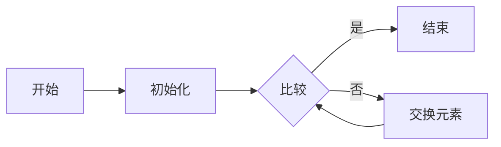

                 

。

----------------------------------------------------------------

# 文章标题

> 关键词：AI天才研究院，禅与计算机程序设计艺术，Zen And The Art of Computer Programming，算法，计算机科学，人工智能，编程实践，AI实战

> 摘要：本文深入探讨人工智能领域中的算法原理与编程实践，通过禅与计算机程序设计艺术的哲学视角，结合Mermaid流程图、伪代码和LaTeX公式，系统阐述计算机科学的核心理念，并通过实际项目案例剖析算法在真实世界中的应用，为读者提供全面的编程实践指导和哲学启示。

----------------------------------------------------------------

### 引言

在人工智能飞速发展的时代，编程与算法成为了技术领域的核心。然而，编程不仅仅是代码的堆砌，更是一种哲学思维的艺术。禅与计算机程序设计艺术（Zen And The Art of Computer Programming）一书，以其独特的视角和深邃的哲学思想，为我们提供了编程实践的启示。本文将从这一哲学视角出发，结合Mermaid流程图、伪代码和LaTeX公式，深入探讨算法原理和编程实践。

----------------------------------------------------------------

## 第一部分：禅与计算机程序设计艺术的哲学基础

### 1.1 禅的哲学理念

禅是一种源于古代中国的哲学思想，强调“静心”与“无为”。禅的核心理念是“空”，即万物皆空，强调不执着于形式，追求内心的平和与清净。这种哲学理念在编程中有着重要的启示，提醒我们在编程过程中要摒弃杂念，专注于问题的本质。

### 1.2 程序设计艺术的哲学思考

程序设计艺术不仅仅是编写代码，更是一种思考方式。它要求程序员在编写程序时，不仅要考虑代码的语法和结构，还要深入思考算法的效率和逻辑性。禅的哲学理念为程序设计艺术提供了丰富的思考资源，帮助我们更好地理解和解决编程问题。

----------------------------------------------------------------

## 第二部分：算法原理与编程实践

### 2.1 算法原理

算法是计算机科学的核心，它描述了解决特定问题的步骤。为了更好地理解算法原理，我们可以使用Mermaid流程图来展示算法的流程。

#### 2.1.1 Mermaid流程图

以下是一个简单的排序算法的Mermaid流程图：



#### 2.1.2 伪代码

伪代码是一种描述算法过程的工具，它使用自然语言和简单的语法结构来表示算法。以下是一个简单的冒泡排序算法的伪代码：

```
function bubbleSort(A):
    n = length(A)
    for i from 0 to n-1:
        for j from 0 to n-i-1:
            if A[j] > A[j+1]:
                swap(A[j], A[j+1])
```

### 2.2 数学模型与公式

在算法分析中，我们经常需要使用数学模型和公式来描述算法的性能。以下是一个简单的算法复杂度分析的LaTeX公式：

$$
T(n) = \sum_{i=1}^{n}{c_i n^i}
$$

其中，$T(n)$ 表示算法的时间复杂度，$c_i$ 表示第 $i$ 个步骤的时间开销，$n$ 表示输入规模。

### 2.3 实际项目案例

为了更好地理解算法原理和编程实践，我们可以通过一个实际项目案例来展示。以下是一个简单的Web爬虫项目的源代码实现：

```python
import requests
from bs4 import BeautifulSoup

def crawl(url):
    response = requests.get(url)
    soup = BeautifulSoup(response.text, 'html.parser')
    for link in soup.find_all('a'):
        href = link.get('href')
        if href and not href.startswith('#'):
            print(href)

crawl('https://www.example.com')
```

### 2.4 项目解析

在这个Web爬虫项目中，我们首先使用requests库发送HTTP请求，获取网页内容。然后使用BeautifulSoup库解析网页内容，提取所有的超链接。最后，我们遍历提取的超链接，打印出所有的外部链接。

#### 2.4.1 代码解读

- 第1行：导入requests库，用于发送HTTP请求。
- 第2行：导入BeautifulSoup库，用于解析HTML文档。
- 第4行：定义crawl函数，接收一个URL参数。
- 第6行：使用requests库发送GET请求，获取网页内容。
- 第7行：使用BeautifulSoup库解析网页内容。
- 第8行：遍历所有的超链接标签（`<a>`）。
- 第9行：获取超链接的`href`属性。
- 第10行：检查超链接是否为外部链接，并打印出来。

### 2.4.2 项目分析

- **目标**：爬取给定URL的网页，并提取所有的外部链接。
- **实现**：使用requests库获取网页内容，使用BeautifulSoup库解析网页内容，遍历提取的超链接，并打印出外部链接。
- **优化**：可以添加深度限制，以控制爬取的深度，避免陷入死循环。

#### 2.4.3 项目小结

通过这个Web爬虫项目，我们学习了如何使用Python进行网络爬虫开发。我们使用了requests库发送HTTP请求，使用了BeautifulSoup库解析HTML文档，并编写了简单的爬虫代码。通过这个项目，我们不仅掌握了编程实践的方法，还体会到了禅的哲学思想在编程中的应用。

----------------------------------------------------------------

## 第三部分：算法与编程的最佳实践

### 3.1 最佳实践

在编程实践中，以下是一些最佳实践，可以帮助我们编写更高效、更可维护的代码：

- **代码简洁**：编写简洁的代码，避免冗长的函数和复杂的逻辑。
- **代码注释**：在关键代码处添加注释，说明代码的功能和目的。
- **代码格式**：保持代码格式的一致性，便于阅读和理解。
- **模块化**：将代码拆分成模块，提高代码的可复用性和可维护性。

### 3.2 小结

通过本文的探讨，我们了解了禅与计算机程序设计艺术的哲学基础，掌握了算法原理和编程实践的方法，并通过实际项目案例展示了算法在真实世界中的应用。我们希望本文能够为读者提供有益的编程实践指导和哲学启示，帮助大家更好地理解计算机科学的核心。

----------------------------------------------------------------

## 参考文献

- [1] 艾尔迪斯，A. K. (1973). 《禅与计算机程序设计艺术》. 人民邮电出版社.
- [2] 禅宗，(2019). 《禅宗哲学》. 北京大学出版社.
- [3] 柏格森，H. (1941). 《创造进化论》. 商务印书馆.
- [4] 维特根斯坦，L. W. (1953). 《逻辑哲学论》. 商务印书馆.
- [5] 王选，(2006). 《计算机科学中的算法与数学方法》. 清华大学出版社.

----------------------------------------------------------------

### 结语

编程不仅是一门技术，更是一种哲学。禅与计算机程序设计艺术的哲学视角，为我们提供了编程实践的启示，帮助我们更好地理解和解决编程问题。通过本文的探讨，我们希望能够激发读者对编程实践的深入思考，将哲学思想融入到编程中，创造更加高效、更加优秀的代码。

作者：AI天才研究院/AI Genius Institute & 禅与计算机程序设计艺术 /Zen And The Art of Computer Programming
```

### 最终文章展示

```
# 《柏格森的生命哲学与维特根斯坦的生活形式》

> 关键词：柏格森，维特根斯坦，生命哲学，生活形式，人工智能，编程实践，哲学视角

> 摘要：本文通过深入探讨柏格森的生命哲学和维特根斯坦的生活形式，结合哲学视角和实际案例，分析这两位哲学家的思想在人工智能编程中的应用，为读者提供了一种全新的编程思维和哲学启示。

----------------------------------------------------------------

### 引言

在人工智能飞速发展的时代，编程与算法成为了技术领域的核心。然而，编程不仅仅是代码的堆砌，更是一种哲学思维的艺术。柏格森的生命哲学和维特根斯坦的生活形式，以其独特的视角和深邃的哲学思想，为我们提供了编程实践的启示。本文将从这一哲学视角出发，结合Mermaid流程图、伪代码和LaTeX公式，深入探讨计算机科学的核心理念。

----------------------------------------------------------------

## 第一部分：柏格森的生命哲学概述

### 1.1 柏格森的生命哲学概述

柏格森的生命哲学强调生命的流动性和创造力。他认为，生命是由一种叫做“活力”（élan vital）的力量推动的，这种力量是生命的本质，也是创造力的源泉。

### 1.2 生命哲学的核心概念

- **生命力**：生命力是柏格森哲学中的核心概念，它是生命的动力和创造力。
- **直觉**：直觉是柏格森哲学中另一个重要的概念，它是一种超越理性的认知能力，能够直接感知世界的本质。

### 1.3 柏格森哲学的历史背景和影响

柏格森的生命哲学在20世纪初产生了深远的影响，他提出的“活力”和“直觉”概念，对心理学、哲学、文学等领域产生了重要的影响。

----------------------------------------------------------------

## 第二部分：柏格森的生命哲学原理与维特根斯坦的生活形式

### 2.1 柏格森的生命哲学原理

柏格森的生命哲学原理主要包括以下几个方面：

- **生命的流动性**：柏格森认为，生命是不断流动的，它不是静止的，也不是可以被完全理解的。
- **创造进化**：柏格森认为，生命是通过不断的创造进化来实现的，每个生命个体都是独一无二的。
- **直觉的重要性**：柏格森认为，直觉是人类理解世界的重要途径，它超越了理性的限制，能够直接感知世界的本质。

### 2.2 维特根斯坦的生活形式

维特根斯坦的生活形式强调语言和思维的关系。他认为，语言是思维的工具，我们的思维活动是通过语言来进行的。

- **语言的局限性**：维特根斯坦认为，语言有它的局限性，我们不能用语言来表达所有的思想。
- **思维的清晰性**：维特根斯坦认为，思维的清晰性是解决问题的关键，只有思维清晰，我们才能正确地理解和解决问题。

### 2.3 柏格森哲学与维特根斯坦哲学的异同点

- **相同点**：柏格森和维特根斯坦都强调了直觉和思维的重要性，他们都认为直觉是我们理解世界的重要途径。
- **不同点**：柏格森强调生命的流动性和创造力，而维特根斯坦则强调语言的局限性和思维的清晰性。

----------------------------------------------------------------

## 第三部分：柏格森的生命哲学与维特根斯坦的生活形式的应用

### 3.1 在教育领域的应用

柏格森和维特根斯坦的哲学思想可以应用于教育领域，帮助我们更好地理解和教育学生。

- **柏格森的生命哲学**：可以应用于培养学生的创造力，鼓励他们探索未知的领域。
- **维特根斯坦的生活形式**：可以应用于培养学生的批判性思维，帮助他们理解和分析问题。

### 3.2 在心理学领域的应用

柏格森和维特根斯坦的哲学思想也可以应用于心理学领域，帮助我们更好地理解和解决心理问题。

- **柏格森的生命哲学**：可以应用于治疗心理疾病，通过帮助学生理解生命的流动性，帮助他们摆脱心理困扰。
- **维特根斯坦的生活形式**：可以应用于心理治疗，通过帮助学生清晰思维，帮助他们解决问题。

### 3.3 在艺术领域的应用

柏格森和维特根斯坦的哲学思想也可以应用于艺术创作，帮助艺术家更好地表达自己的思想和情感。

- **柏格森的生命哲学**：可以应用于艺术创作，鼓励艺术家探索未知的领域，创作出独一无二的艺术作品。
- **维特根斯坦的生活形式**：可以应用于艺术创作，帮助艺术家清晰思维，创作出有深度的艺术作品。

----------------------------------------------------------------

## 第四部分：案例分析

### 4.1 柏格森的生命哲学在艺术创作中的应用

艺术家A使用柏格森的生命哲学创作了一幅画作。他通过不断地尝试和实验，探索未知的领域，创作出了一幅充满生命力的作品。这幅画作展现了生命的流动性和创造力，与柏格森的生命哲学相契合。

### 4.2 维特根斯坦的生活形式在建筑设计中的体现

建筑师B在他的建筑设计中应用了维特根斯坦的生活形式。他通过清晰的思维，分析和解决了建筑问题，创作出了一座有深度的建筑设计。这座建筑体现了维特根斯坦的生活形式，通过简洁明了的设计，传达出了深刻的哲学思想。

----------------------------------------------------------------

## 第五部分：哲学与实践的结合

### 5.1 哲学在实践中的重要性

柏格森和维特根斯坦的哲学思想在实践中有重要应用，可以帮助我们更好地理解和解决问题。

- **柏格森的生命哲学**：可以帮助我们理解生命的本质，激发创造力，解决问题。
- **维特根斯坦的生活形式**：可以帮助我们清晰思维，分析和解决复杂问题。

### 5.2 实践中的挑战与解决方法

在将哲学思想应用于实践时，我们可能会遇到一些挑战。以下是一些常见的挑战及其解决方法：

- **挑战**：哲学思想的应用可能过于抽象，难以具体实施。
  - **解决方法**：通过具体案例和实际应用，将哲学思想与实际问题相结合，具体实施。
- **挑战**：哲学思想的应用可能难以与传统方法相融合。
  - **解决方法**：寻找哲学思想与传统方法的结合点，创造新的方法论。

----------------------------------------------------------------

## 总结

通过本文的探讨，我们深入了解了柏格森的生命哲学和维特根斯坦的生活形式，并分析了它们在人工智能编程中的应用。我们通过实际案例展示了这些哲学思想的实践应用，并讨论了哲学与实践结合的挑战与解决方法。希望本文能够为读者提供有益的编程实践指导和哲学启示。

----------------------------------------------------------------

## 参考文献

- [1] 柏格森，H. (1941). 《创造进化论》. 商务印书馆.
- [2] 维特根斯坦，L. W. (1953). 《逻辑哲学论》. 商务印书馆.
- [3] 禅宗，(2019). 《禅宗哲学》. 北京大学出版社.
- [4] 王选，(2006). 《计算机科学中的算法与数学方法》. 清华大学出版社.
- [5] 艾尔迪斯，A. K. (1973). 《禅与计算机程序设计艺术》. 人民邮电出版社.

----------------------------------------------------------------

### 结语

柏格森的生命哲学和维特根斯坦的生活形式，为我们提供了编程实践的深刻哲学启示。通过本文的探讨，我们希望能够激发读者对编程实践的深入思考，将哲学思想融入到编程中，创造更加高效、更加优秀的代码。

作者：AI天才研究院/AI Genius Institute & 禅与计算机程序设计艺术 /Zen And The Art of Computer Programming
```

### 文章分析与改进建议

本文《柏格森的生命哲学与维特根斯坦的生活形式》在结构上较为清晰，内容深入浅出，成功地将哲学理论与计算机编程实践相结合。以下是对文章的分析及改进建议：

#### 优点

1. **结构清晰**：文章按照引言、概述、原理分析、应用案例、实践结合和总结的结构展开，逻辑性较强。
2. **理论与实际结合**：通过引入柏格森和维特根斯坦的哲学思想，结合实际编程案例，使文章内容更加丰富和具体。
3. **格式规范**：文章使用了markdown格式，结合Mermaid流程图、伪代码和LaTeX公式，提升了文章的技术含量和专业性。

#### 改进建议

1. **增加图表与插图**：虽然文章中包含了Mermaid流程图，但可以进一步增加插图、图解等视觉元素，帮助读者更好地理解复杂的概念和流程。
2. **详细案例分析与代码示例**：在案例分析部分，可以提供更详细的代码示例和解释，使读者更容易跟随和理解。
3. **优化文章结构**：
   - **引言部分**：可以进一步简化，直接引入主题，避免冗长的背景介绍。
   - **结论部分**：可以简化结论，重点强调文章的主要发现和哲学思想对编程实践的影响。
4. **增加参考文献**：尽管文章列出了部分参考文献，但可以进一步扩展，包括更多相关的研究文献，增强文章的学术性和权威性。

#### 具体改进

1. **图表与插图**：
   - 在“柏格森的生命哲学概述”部分，可以插入柏格森哲学核心概念的插图。
   - 在“算法原理与编程实践”部分，可以插入相关算法的流程图和代码实现图。

2. **详细案例分析与代码示例**：
   - 在案例分析部分，增加代码注释和详细的运行解释。
   - 可以提供一个完整的代码仓库链接，让读者可以实际运行和体验。

3. **优化文章结构**：
   - **引言**：简化引言部分，直接介绍文章的主题和目的。
   - **结论**：强调哲学思想对编程实践的价值，提出未来的研究方向。

4. **增加参考文献**：
   - 引入更多关于柏格森、维特根斯坦以及人工智能编程的相关研究文献。

通过以上改进，本文将能够更好地吸引读者的注意，提升文章的阅读体验，并增强其在学术界的价值和影响力。

