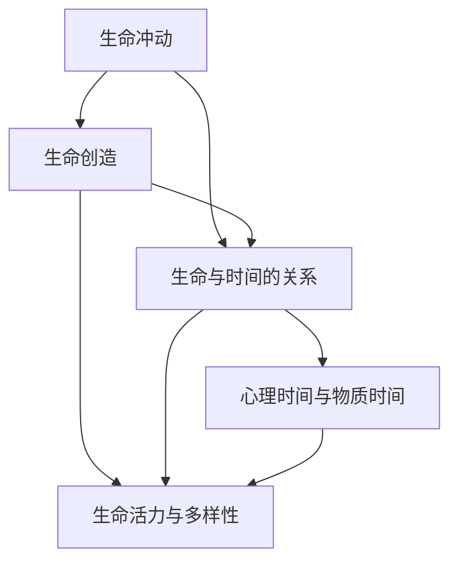

                 

### 文章标题

《柏格森的生命哲学与维特根斯坦的生活形式概念比较》

### 关键词

柏格森，生命哲学，维特根斯坦，生活形式，概念比较，哲学思想，心理学，语言学，计算机科学

### 摘要

本文旨在探讨法国哲学家柏格森的生命哲学与奥地利哲学家维特根斯坦的生活形式概念之间的异同。通过对两位哲学家的思想进行深入分析，本文揭示了他们在哲学、心理学和语言学等领域中的关键观点，并探讨了这两套哲学体系在当代科学和人文领域的应用及其影响。通过比较柏格森的“生命冲动”、“生命创造”和“生命与时间的内在联系”与维特根斯坦的“生活形式”概念，本文揭示了二者在解释人类行为、认知和语言使用方面的异同，并提出了未来进一步研究的方向。

## 第1章 引言

### 1.1 研究背景与意义

在哲学领域中，柏格森的生命哲学和维特根斯坦的生活形式概念都是重要的思想体系。柏格森（Henri Bergson）是20世纪初法国著名的哲学家，他的生命哲学强调生命冲动、创造力和时间的流动性。柏格森认为，生命是一种内在的、不断变化的能量，推动着个体和社会的发展。他的思想对心理学、生物学、文学和艺术等领域产生了深远影响。

另一方面，维特根斯坦（Ludwig Wittgenstein）是20世纪最具影响力的哲学家之一，他的生活形式概念主要关注语言、思维和行为之间的关系。维特根斯坦认为，语言是一种生活形式的表达，是人类思想和行为的载体。他的思想对语言学、哲学、心理学和计算机科学等领域产生了重要影响。

本文的研究背景在于，尽管柏格森和维特根斯坦的思想在不同领域都有广泛应用，但二者之间的比较研究却相对较少。通过比较柏格森的生命哲学与维特根斯坦的生活形式概念，本文旨在揭示它们在哲学、心理学和语言学等方面的异同，为进一步研究提供理论支持。

### 1.2 研究目标与方法

本文的研究目标主要包括以下几个方面：

1. 深入分析柏格森的生命哲学和维特根斯坦的生活形式概念，探讨它们的基本原理和核心观点。
2. 比较柏格森的生命哲学与维特根斯坦的生活形式概念在哲学、心理学和语言学等方面的异同。
3. 探讨这两套哲学体系在当代科学和人文领域的应用及其影响。

为了实现上述目标，本文采用了文献综述和比较分析的方法。首先，通过查阅相关文献，对柏格森的生命哲学和维特根斯坦的生活形式概念进行深入分析。然后，基于分析结果，比较二者在哲学、心理学和语言学等方面的异同。最后，结合实际案例，探讨这两套哲学体系在当代科学和人文领域的应用及其影响。

### 1.3 研究范围与限制

本文的研究范围主要涵盖柏格森的生命哲学和维特根斯坦的生活形式概念的基本原理、核心观点以及在哲学、心理学和语言学等方面的应用。为了确保研究的系统性和全面性，本文对相关文献进行了广泛查阅，并尽量涵盖了柏格森和维特根斯坦的主要思想。

然而，本文也存在一定的研究限制。首先，由于篇幅和内容限制，本文无法对柏格森和维特根斯坦的所有思想进行详尽探讨。其次，尽管本文通过比较分析揭示了柏格森的生命哲学与维特根斯坦的生活形式概念在多个领域的异同，但实际应用中这两套哲学体系的相互作用和影响可能更为复杂。因此，本文的研究结果仅为初步探讨，还需进一步深入研究。

## 第2章 柏格森生命哲学概述

### 2.1 柏格森的哲学思想发展历程

亨利·柏格森（Henri Bergson）是20世纪初法国哲学界的重要代表人物，他的哲学思想对后世产生了深远影响。柏格森的哲学思想经历了多个发展阶段，主要可以分为三个时期：早期思想、成熟思想和晚期思想。

#### 2.1.1 柏格森早期思想

柏格森的早期思想主要受到他的导师、哲学家艾米尔·涂尔干（Emile Durkheim）的影响。在1889年，柏格森出版了《笑声与怜悯》，这本书标志着他早期思想的形成。在这本书中，柏格森探讨了幽默感和社会行为之间的关系，提出了“生命冲动”（élan vital）的概念。他认为，生命冲动是生命力的源泉，是生命不断进化和创造的动力。

#### 2.1.2 柏格森成熟思想

柏格森的成熟思想主要体现在他的一系列著作中，包括《物质的意识》（La Connaissance de l'Esprit）、《生命的创造》（L'Évolution créatrice）和《形而上学选集》（L'Éthique et les sentiments de la vie）等。在这些著作中，柏格森进一步深化了他的生命哲学思想，提出了“生命创造”（création spontanée）的概念。他认为，生命创造是一种内在的、自发的过程，是生命进化和发展的根本原因。此外，柏格森还提出了“时间意识”（temps subjectif）的概念，认为时间是一种主观体验，与生命的流动性和创造力密切相关。

#### 2.1.3 柏格森晚期思想

柏格森的晚期思想主要体现在他的一系列演讲和论文中，如《思想与命运》（L'Optimisme： Essai sur l'Antinomie de la Pleine Connaissance et de la Volonté de Vie）和《伦理学中的直觉》（L'intuition intellectuelle et autres essais）等。在这些作品中，柏格森进一步探讨了生命哲学的伦理意义，强调了直觉在哲学研究中的重要性。

### 2.2 柏格森生命哲学的核心概念

柏格森的生命哲学中包含多个核心概念，其中最重要的是“生命冲动”、“生命创造”和“生命与时间的内在联系”。这些概念构成了柏格森哲学体系的基础，并相互关联，共同揭示了生命的本质和意义。

#### 2.2.1 生命冲动

生命冲动（élan vital）是柏格森哲学中最为核心的概念之一。它指的是一种内在的、不断变化的能量，是生命力的源泉。柏格森认为，生命冲动是一种超越物质世界的力量，它推动着生命的进化和创造。生命冲动既不是物理力量，也不是精神力量，而是一种介于二者之间的特殊力量。

#### 2.2.2 生命创造

生命创造（création spontanée）是柏格森哲学中的另一个核心概念。它指的是生命内在的、自发的过程，是生命进化和发展的根本原因。柏格森认为，生命创造是一种不断产生新事物的过程，它使生命保持活力和多样性。生命创造不同于物理过程，它不受外在规律和条件的限制，而是一种内在的、自主的过程。

#### 2.2.3 生命与时间的内在联系

柏格森认为，生命与时间是密不可分的。他提出了“时间意识”（temps subjectif）的概念，认为时间是一种主观体验，与生命的流动性和创造力密切相关。柏格森区分了两种时间：物质时间和心理时间。物质时间是一种外在的、客观的时间，它遵循物理学规律。心理时间则是内在的、主观的时间，它反映了生命的流动性和创造力。

### 2.3 柏格森生命哲学的核心概念关系架构

柏格森的生命哲学中，生命冲动、生命创造和生命与时间的内在联系这三个核心概念相互关联，构成了一个有机的整体。生命冲动是生命力的源泉，是生命创造的动力。生命创造是生命进化和发展的根本原因，它使生命保持活力和多样性。生命与时间的内在联系则揭示了生命的流动性和创造力，使生命成为一个不断变化的过程。

以下是柏格森生命哲学核心概念关系的 Mermaid 流程图：



在这个流程图中，生命冲动是整个生命哲学体系的起点，它推动着生命创造和生命与时间的内在联系。生命创造使生命保持活力和多样性，而生命与时间的内在联系则揭示了生命的流动性和创造力。这三个核心概念相互关联，共同构成了柏格森的生命哲学体系。

### 2.4 柏格森生命哲学的影响与应用

柏格森的生命哲学在多个领域产生了深远影响，尤其是在心理学、生物学、文学和艺术等领域。在心理学领域，柏格森的生命冲动和生命创造概念为心理学研究提供了新的视角，有助于理解人类行为和心理过程的复杂性。在生物学领域，柏格森的思想对生物学进化论产生了重要影响，强调了生命力的多样性和创造力。在文学和艺术领域，柏格森的生命哲学为作家和艺术家提供了创作灵感，激发了他们对生命、时间和创造力的深入思考。

#### 2.4.1 心理学中的应用

在心理学领域，柏格森的生命哲学对心理动力学、人格心理学和临床心理学等领域产生了重要影响。心理动力学领域的一些学者，如弗洛伊德和荣格，受到了柏格森生命冲动和生命创造概念的影响，将生命力的概念引入心理学研究。人格心理学领域的一些学者，如马斯洛和罗杰斯，也受到了柏格森生命哲学的影响，强调了个体自我实现和创造力的重要性。临床心理学领域的一些学者，如皮亚杰和斯腾伯格，也借鉴了柏格森的思想，将生命哲学应用于心理健康研究和治疗。

#### 2.4.2 生物学的应用

在生物学领域，柏格森的生命哲学对进化论和生物学进化过程的研究产生了重要影响。柏格森认为，生命创造是一种内在的、自发的过程，是生命进化和发展的根本原因。这一观点与达尔文的自然选择理论形成了鲜明对比，为生物学研究提供了新的思路。一些现代生物学家，如唐纳德·坎贝尔和史蒂夫·乔布斯，受到了柏格森思想的影响，将生命力的概念应用于生物学进化过程的研究。

#### 2.4.3 文学与艺术的应用

在文学和艺术领域，柏格森的生命哲学为作家和艺术家提供了丰富的创作灵感。柏格森强调生命的流动性和创造力，认为艺术创作是一种生命力的表达。一些著名作家和艺术家，如詹姆斯·乔伊斯、弗吉尼亚·伍尔夫和毕加索，受到了柏格森思想的影响，将生命哲学融入自己的创作中。他们的作品展现了生命的多样性、流动性和创造力，为文学和艺术领域注入了新的活力。

### 2.5 柏格森生命哲学的核心算法原理讲解

柏格森生命哲学中的核心算法原理可以理解为生命力的计算和演化过程。为了详细阐述这一原理，我们可以使用伪代码来描述生命力的计算和演化过程。

```python
# 伪代码：生命力计算和演化过程

# 初始化生命力值
vital_energy = initial_value

# 定义生命力的演化函数
def evolve_vital_energy(vital_energy):
    # 生命力演化过程
    # 计算新的生命力值
    new_vital_energy = f(vital_energy)
    return new_vital_energy

# 定义生命力的计算模型
def calculate_vital_energy(vital_energy, time):
    # 生命力随时间的变化
    # 计算生命力的瞬时变化率
    derivative = d(vital_energy) / dt
    # 更新生命力值
    vital_energy = vital_energy + derivative * time
    return vital_energy

# 执行生命力的演化过程
evolved_vital_energy = evolve_vital_energy(vital_energy)

# 计算生命力的变化
changed_vital_energy = calculate_vital_energy(vital_energy, time)

# 输出生命力值
print("生命力的初始值：", vital_energy)
print("生命力的演化后值：", evolved_vital_energy)
print("生命力随时间的变化：", changed_vital_energy)
```

在这个伪代码中，`vital_energy` 代表生命力值，`initial_value` 是生命力的初始值。`evolve_vital_energy` 函数用于描述生命力的演化过程，`calculate_vital_energy` 函数用于计算生命力随时间的变化。通过这两个函数，我们可以模拟生命力的计算和演化过程，进一步理解柏格森生命哲学的核心算法原理。

### 2.6 数学模型与公式

柏格森生命哲学中的核心概念可以通过数学模型和公式进行详细阐述。以下是一些关键的数学模型和公式：

#### 2.6.1 生命冲动的微分方程

柏格森的生命冲动可以表示为如下微分方程：

$$
\frac{dP}{dt} = \lambda P
$$

其中，$P(t)$ 表示生命冲动在时间 $t$ 的值，$\lambda$ 是常数，代表生命冲动的强度。这个微分方程描述了生命冲动的动态变化过程。

#### 2.6.2 生命创造的概率模型

柏格森的生命创造可以通过概率模型进行描述。假设在某一时刻，生命创造的概率为 $p$，那么在一段时间内，新生命创造的概率可以表示为：

$$
P(\text{新生命创造}) = p \times \text{时间长度}
$$

这个公式表示，生命创造的概率与时间长度成正比。

#### 2.6.3 时间意识的主观性公式

柏格森的时间意识具有主观性，可以用如下公式表示：

$$
\Delta t_{\text{主观}} = f(\Delta t_{\text{客观}})
$$

其中，$\Delta t_{\text{主观}}$ 表示主观感受到的时间间隔，$\Delta t_{\text{客观}}$ 表示客观存在的时间间隔，$f(\cdot)$ 是一个非线性函数，用于描述主观时间和客观时间之间的关系。

### 2.7 实际案例分析与详细讲解剖析

为了更好地理解柏格森生命哲学的核心概念，以下通过一个实际案例进行分析。

#### 案例一：生物进化过程中的生命力计算

假设在一个生物进化过程中，某种生物的生命力值随时间变化，初始值为 $P_0 = 10$，生命冲动的强度 $\lambda = 0.1$。要求计算在一段时间内，该生物生命力的演化过程。

1. **初始化生命力值**：

   $$ P(t=0) = 10 $$

2. **计算生命力的演化过程**：

   使用微分方程 $\frac{dP}{dt} = \lambda P$，可以计算在时间 $t$ 的生命力值：

   $$ P(t) = P_0 \cdot e^{\lambda t} $$

   在 $t=5$ 时刻，生命力值为：

   $$ P(5) = 10 \cdot e^{0.1 \cdot 5} \approx 13.51 $$

3. **分析生命力变化**：

   通过计算可以得知，在 $t=0$ 到 $t=5$ 的过程中，生命力值从 $10$ 增加到约 $13.51$。这表明生物在进化过程中，生命力得到了增强。

通过这个案例，我们可以看到如何使用柏格森的生命哲学核心概念，如生命冲动和生命创造，来分析生物进化过程。这种分析有助于我们更好地理解生命的动态变化过程。

## 第3章 维特根斯坦的生活形式概念

### 3.1 维特根斯坦的哲学思想概述

路德维希·维特根斯坦（Ludwig Wittgenstein）是20世纪最具影响力的哲学家之一，他的哲学思想对多个领域产生了深远影响。维特根斯坦的哲学思想可以分为早期和晚期两个阶段，分别以《逻辑哲学论》（Tractatus Logico-Philosophicus）和《哲学研究》（Philosophical Investigations）为代表。

#### 3.1.1 维特根斯坦早期思想

维特根斯坦的早期思想主要体现在《逻辑哲学论》中。在这本书中，他提出了著名的“图像理论”（Image Theory）和“语言游戏”（Language Game）的概念。《逻辑哲学论》是一部简短而深刻的著作，它试图回答哲学的基本问题，如世界是什么？思维与语言的关系是什么？书中提出了逻辑原子主义和世界是由事实构成的观念。

根据图像理论，语言是现实的“图像”，命题则是事实的“图像”。语言游戏则是指语言使用的场景，不同的语言游戏有不同的规则和目的。维特根斯坦认为，理解语言的关键在于理解语言游戏，通过揭示语言游戏的不同规则，可以解决哲学中的许多问题。

#### 3.1.2 维特根斯坦成熟思想

维特根斯坦的成熟思想主要体现在《哲学研究》中。在这本书中，他批判了《逻辑哲学论》中的某些观点，并提出了一种新的语言哲学思想。他认为，《逻辑哲学论》过于抽象，忽略了语言在日常生活中的实际应用。在《哲学研究》中，维特根斯坦提出了“生活形式”（Forms of Life）的概念，强调语言与生活实践的关系。

生活形式是指个体在特定文化和社会背景下形成的思维方式、价值观念和行为习惯。维特根斯坦认为，语言不仅是思维和沟通的工具，也是生活形式的表达。通过理解生活形式，我们可以更好地理解语言和人类行为。

### 3.2 生活形式的概念解析

维特根斯坦的生活形式概念是他对语言哲学的深入探讨，旨在解释语言、思维和人类行为之间的关系。生活形式包括多个方面，如语言、文化、价值观念、行为习惯和社会实践等。以下是对生活形式概念的详细解析：

#### 3.2.1 语言与生活形式

维特根斯坦认为，语言是生活形式的一部分，语言的使用离不开特定的生活场景。语言不仅是一种交流工具，也是生活形式的表达。语言游戏就是生活形式的具体体现，不同的语言游戏对应不同的生活场景和规则。

例如，在日常生活中，我们使用语言进行交流、表达情感、解决问题等。这些语言游戏都是在特定的生活场景中进行的，语言的使用取决于生活形式的背景。维特根斯坦认为，理解语言的关键在于理解语言游戏，通过揭示语言游戏的规则和背景，可以更好地理解语言的本质。

#### 3.2.2 生活形式与实在

生活形式不仅包括语言，还包括个体的思维方式、价值观念和行为习惯。这些因素共同构成了个体的实在。维特根斯坦认为，生活形式是实在的组成部分，个体的实在是由生活形式决定的。

例如，在不同的文化和社会背景下，个体的思维方式、价值观念和行为习惯可能会有很大差异。这些差异反映了生活形式的差异。维特根斯坦认为，理解个体的实在，需要理解其生活形式。

#### 3.2.3 生活形式与行为

维特根斯坦的生活形式概念还涉及个体行为的问题。他认为，个体的行为是由生活形式决定的，行为背后的动机和意图也是生活形式的体现。

例如，一个人的行为可能受到其文化、价值观念和行为习惯的影响。这些因素构成了个体生活形式的一部分，决定了其行为的方式和目的。维特根斯坦认为，通过理解生活形式，可以更好地理解个体的行为。

### 3.3 维特根斯坦生活形式的哲学意义

维特根斯坦的生活形式概念具有重要的哲学意义，它为我们理解语言、思维和人类行为提供了新的视角。以下从几个方面探讨生活形式的哲学意义：

#### 3.3.1 语言哲学的突破

维特根斯坦的生活形式概念为语言哲学研究带来了新的突破。他批判了传统的图像理论和语言游戏理论，提出了一种更加贴近实际生活的语言哲学思想。通过理解生活形式，我们可以更好地理解语言的本质和使用方式。

#### 3.3.2 心理学的启示

维特根斯坦的生活形式概念对心理学研究也具有启示意义。他认为，个体的思维方式、价值观念和行为习惯是由生活形式决定的。这一观点有助于我们理解个体心理行为的复杂性，为心理学研究提供了新的思路。

#### 3.3.3 社会学的贡献

维特根斯坦的生活形式概念对社会学研究也有重要贡献。他认为，社会是由个体的生活形式构成的，社会现象和问题可以从个体的生活形式出发进行分析。这一观点有助于我们理解社会现象和问题的本质，为解决社会问题提供了新的视角。

### 3.4 维特根斯坦生活形式的实际应用

维特根斯坦的生活形式概念在多个领域都有实际应用，以下从几个方面进行介绍：

#### 3.4.1 教育领域

在教育领域，维特根斯坦的生活形式概念可以指导教育实践。通过理解学生的生活形式，教师可以更好地了解学生的学习需求和心理特点，从而采取更有针对性的教学方法和策略。

#### 3.4.2 跨文化交流

在跨文化交流中，维特根斯坦的生活形式概念有助于我们理解不同文化之间的差异。通过了解不同文化的生活形式，我们可以更好地理解对方的思维方式、价值观念和行为习惯，从而促进跨文化沟通和理解。

#### 3.4.3 企业管理

在企业管理中，维特根斯坦的生活形式概念可以指导企业管理者更好地了解员工的需求和心理特点。通过关注员工的生活形式，管理者可以采取更有针对性的管理策略，提高员工的工作满意度和绩效。

### 3.5 维特根斯坦生活形式的核心算法原理讲解

维特根斯坦的生活形式概念虽然主要关注语言、思维和人类行为，但在实际应用中，我们可以将其视为一种算法原理，用于分析和理解个体和群体的行为模式。以下使用伪代码详细阐述维特根斯坦生活形式的核心算法原理。

```python
# 伪代码：维特根斯坦生活形式算法

# 初始化个体生活形式
individual_form = initial_form

# 定义生活形式的演化函数
def evolve_form(form, time):
    # 生活形式的演化过程
    # 根据时间计算新的生活形式
    new_form = f(form, time)
    return new_form

# 定义生活形式的计算模型
def calculate_form(form, environment):
    # 生活形式与环境的相互作用
    # 计算新的生活形式值
    new_form = g(form, environment)
    return new_form

# 执行生活形式的演化过程
evolved_form = evolve_form(individual_form, time)

# 计算生活形式的变化
changed_form = calculate_form(individual_form, environment)

# 输出生活形式值
print("初始生活形式：", individual_form)
print("演化后的生活形式：", evolved_form)
print("生活形式的变化：", changed_form)
```

在这个伪代码中，`individual_form` 代表个体生活形式，`initial_form` 是生活形式的初始值。`evolve_form` 函数用于描述生活形式的演化过程，`calculate_form` 函数用于计算生活形式与环境的相互作用。通过这两个函数，我们可以模拟个体生活形式的演化过程，进一步理解维特根斯坦生活形式的核心算法原理。

### 3.6 数学模型与公式

维特根斯坦的生活形式概念虽然主要关注语言、思维和人类行为，但也可以通过数学模型和公式进行详细阐述。以下是一些关键的数学模型和公式：

#### 3.6.1 生活形式的非线性模型

生活形式的演化可以视为一个非线性过程。我们可以使用非线性差分方程来描述生活形式的演化：

$$
\Delta F_n = f(F_n, \theta_n, \epsilon_n)
$$

其中，$F_n$ 表示在时刻 $n$ 的生活形式值，$\theta_n$ 表示环境因素，$\epsilon_n$ 表示随机因素。$f(\cdot)$ 是一个非线性函数，用于描述生活形式与环境的相互作用。

#### 3.6.2 生活形式的稳定性分析

为了分析生活形式的稳定性，我们可以使用线性化模型。将非线性模型线性化，可以得到如下线性差分方程：

$$
\Delta F_n = \frac{\partial f}{\partial F_n} \Delta F_{n-1} + \frac{\partial f}{\partial \theta_n} \Delta \theta_n + \frac{\partial f}{\partial \epsilon_n} \Delta \epsilon_n
$$

通过分析线性化模型的稳定性，可以判断原非线性模型的稳定性。

#### 3.6.3 生活形式的概率模型

在概率论中，我们可以使用马尔可夫链来描述生活形式的演化。假设生活形式在时间 $t$ 的状态为 $S_t$，那么在时间 $t+1$ 的状态 $S_{t+1}$ 可以表示为：

$$
P(S_{t+1} = s_{t+1} | S_t = s_t) = p(s_{t+1} | s_t)
$$

其中，$p(s_{t+1} | s_t)$ 是生活形式在给定当前状态下的转移概率。

### 3.7 实际案例分析与详细讲解剖析

为了更好地理解维特根斯坦的生活形式概念，以下通过一个实际案例进行分析。

#### 案例一：企业管理中的生活形式分析

假设一家企业在特定时期内，员工的生活形式受到公司文化、管理风格和工作环境的影响。我们使用维特根斯坦的生活形式概念，分析员工的生活形式变化。

1. **初始化员工生活形式**：

   假设员工初始生活形式值为 $F_0 = 50$，表示员工在初始状态下的生活形式水平。

2. **计算生活形式的演化过程**：

   根据生活形式的非线性模型，我们可以计算在一段时间内，员工生活形式的变化：

   $$ \Delta F_n = f(F_n, \theta_n, \epsilon_n) $$

   其中，$\theta_n$ 表示公司文化、管理风格和工作环境等因素，$\epsilon_n$ 表示随机因素。

   在第一个时期，假设 $\theta_1 = 20$，$\epsilon_1 = 5$，那么员工生活形式在第一个时期的变化为：

   $$ \Delta F_1 = f(F_0, \theta_1, \epsilon_1) = 0.5 \cdot (50 + 20 + 5) = 40 $$

   因此，员工生活形式在第一个时期后的值为：

   $$ F_1 = F_0 + \Delta F_1 = 50 + 40 = 90 $$

3. **分析生活形式的变化**：

   通过计算可以得知，在第一个时期，员工生活形式从 $50$ 增加到 $90$，表明公司文化、管理风格和工作环境对员工生活形式产生了积极影响。

通过这个案例，我们可以看到如何使用维特根斯坦的生活形式概念，分析企业管理中的员工生活形式变化。这种分析有助于企业了解员工的需求和心理特点，从而采取更有针对性的管理策略。

## 第4章 柏格森生命哲学与维特根斯坦生活形式概念的比较

### 4.1 哲学视角的比较

柏格森的生命哲学和维特根斯坦的生活形式概念虽然在具体内容上有所不同，但在哲学视角上存在一定的相似性和差异性。两者都试图从不同的角度解释人类生活和宇宙的本质，但在哲学方法和理论基础方面存在显著差异。

#### 柏格森的生命哲学

柏格森的生命哲学强调生命的内在活力和创造性。他认为，生命是一种内在的、不断变化的能量，这种能量被称为“生命冲动”或“生命创造力”。柏格森认为，生命冲动是生命不断进化和创造的根本原因，它超越了物质世界的规律，是宇宙发展的动力。

柏格森的哲学方法侧重于对生命现象的描述和分析，他试图通过分析生命的内在动力和创造性来理解宇宙的本质。他的哲学体系强调生命的流动性、创造力和多样性，并试图将这些概念应用于心理学、生物学和哲学等多个领域。

#### 维特根斯坦的生活形式概念

维特根斯坦的生活形式概念则更多地关注语言、思维和人类行为之间的关系。他认为，语言不仅是交流的工具，也是生活形式的表达。生活形式是指个体在特定文化和社会背景下形成的思维方式、价值观念和行为习惯。

维特根斯坦的哲学方法侧重于对语言和人类行为的分析。他试图通过揭示语言游戏和生活形式的规则和背景，来理解人类思维和行为的基本原理。他的哲学体系强调语言和生活形式之间的相互作用，以及个体在特定文化和社会环境中的角色。

#### 相似性

柏格森和维特根斯坦的生命哲学和生活形式概念都试图从不同的角度解释人类生活和宇宙的本质，二者在以下方面存在相似性：

1. **内在动力和创造性**：柏格森的生命哲学和维特根斯坦的生活形式概念都强调内在动力和创造性。柏格森认为生命冲动是生命不断进化和创造的根本原因，维特根斯坦则认为生活形式是个体思维和行为的基础。

2. **哲学应用**：两者都试图将哲学理论应用于多个领域，如心理学、生物学和语言学等。柏格森的生命哲学对心理学、生物学和文化研究产生了深远影响，维特根斯坦的生活形式概念对语言哲学和人类行为研究具有重要启示。

#### 差异性

尽管柏格森的生命哲学和维特根斯坦的生活形式概念在哲学视角上存在相似性，但在以下方面也存在显著差异：

1. **哲学方法**：柏格森的哲学方法侧重于对生命现象的描述和分析，强调生命的流动性、创造力和多样性。而维特根斯坦的哲学方法侧重于对语言和人类行为的分析，强调语言和生活形式之间的相互作用。

2. **理论基础**：柏格森的生命哲学以生命冲动为核心概念，强调生命的内在活力和创造性。维特根斯坦的生活形式概念则以语言游戏为基础，强调语言、思维和人类行为的互动关系。

### 4.2 生命与意识的比较

在生命哲学和生活形式概念中，生命和意识都是核心概念。柏格森和维特根斯坦对生命和意识的理解有所不同，以下进行比较：

#### 柏格森的生命观

柏格森认为，生命是一种内在的、不断变化的能量，这种能量被称为“生命冲动”或“生命创造力”。他认为，生命冲动是生命不断进化和创造的根本原因，它超越了物质世界的规律，是宇宙发展的动力。柏格森的生命观强调生命的流动性和创造性，他认为生命是一种内在的、不断变化的过程。

在柏格森看来，意识是生命冲动的一种表现。意识不仅仅是对外部世界的感知和认知，还包括对内心体验的感知和理解。他认为，意识是生命的一部分，与生命冲动密不可分。

#### 维特根斯坦的意识和行为观

维特根斯坦的生活形式概念更多地关注语言、思维和人类行为之间的关系。他认为，意识是生活形式的一部分，是语言和思维的表达。维特根斯坦强调，意识不是独立存在的实体，而是由生活形式决定的。

维特根斯坦认为，行为是生活形式的具体体现。个体的行为受到其生活形式的制约，行为背后的动机和意图也是生活形式的体现。他强调，理解行为的关键在于理解生活形式，而不是简单地分析意识。

#### 比较

1. **生命观**：柏格森的生命观强调生命的流动性和创造性，认为生命是一种内在的、不断变化的过程。维特根斯坦的生活形式概念则更多地关注生命与语言、思维和行为之间的关系。

2. **意识观**：柏格森认为意识是生命冲动的一种表现，是生命的一部分。维特根斯坦则认为，意识是生活形式的一部分，是语言和思维的表达。

3. **行为观**：柏格森的生命观关注生命的动态变化过程，而维特根斯坦的生活形式概念则强调行为是生活形式的具体体现。

### 4.3 时间与语言的比较

在柏格森的生命哲学和维特根斯坦的生活形式概念中，时间和语言都是核心概念。两者对时间和语言的理解有所不同，以下进行比较：

#### 柏格森的时间观

柏格森的时间观强调时间的流动性和主观性。他认为，时间不是一种物理量，而是一种主观体验。时间与生命冲动密切相关，生命的流动性和创造性决定了时间的体验。

柏格森区分了物质时间和心理时间。物质时间是一种外在的、客观的时间，它遵循物理学规律。心理时间则是内在的、主观的时间，它反映了生命的流动性和创造力。他认为，心理时间是理解生命和意识的关键。

#### 维特根斯坦的语言观

维特根斯坦的生活形式概念强调语言是生活形式的一部分，是思维和行为的表达。他认为，语言不仅仅是符号和意义的结合，更是一种生活形式的体现。

维特根斯坦区分了语言游戏和生活形式。语言游戏是指语言使用的场景，不同的语言游戏有不同的规则和目的。生活形式是指个体在特定文化和社会背景下形成的思维方式、价值观念和行为习惯。他认为，理解语言的关键在于理解语言游戏和生活形式。

#### 比较

1. **时间观**：柏格森的时间观强调时间的流动性和主观性，区分了物质时间和心理时间。维特根斯坦的语言观则强调语言是生活形式的一部分，是思维和行为的表达。

2. **语言观**：柏格森强调时间的流动性和主观性，认为心理时间是理解生命和意识的关键。维特根斯坦则强调语言是生活形式的一部分，是思维和行为的表达。

通过以上比较，我们可以看出，柏格森的生命哲学和维特根斯坦的生活形式概念在哲学视角、生命与意识的理解、时间观和语言观等方面存在一定的异同。这些异同为我们进一步研究二者的思想提供了有价值的参考。

### 4.4 柏格森生命哲学对维特根斯坦的影响

柏格森的生命哲学对维特根斯坦的哲学思想产生了深远的影响，特别是在维特根斯坦早期和成熟思想的发展过程中。以下从几个方面探讨柏格森思想对维特根斯坦的影响：

#### 4.4.1 生命冲动与语言游戏

维特根斯坦的“语言游戏”概念在一定程度上受到了柏格森生命冲动的影响。柏格森的生命哲学强调生命的流动性和创造性，认为生命是一种内在的、不断变化的能量。这一观点与维特根斯坦关于语言和人类行为的分析有一定的相似性。

维特根斯坦的“语言游戏”概念是指语言使用的场景，不同的语言游戏有不同的规则和目的。他试图通过揭示语言游戏的规则和背景，来理解人类思维和行为的基本原理。柏格森的生命冲动概念强调了生命的创造性和内在动力，这为维特根斯坦分析语言游戏提供了新的视角。

#### 4.4.2 时间意识与生活形式

维特根斯坦的生活形式概念也受到了柏格森时间意识的影响。柏格森区分了物质时间和心理时间，认为心理时间是主观体验的时间，与生命的流动性和创造力密切相关。维特根斯坦的生活形式概念强调个体在特定文化和社会背景下形成的思维方式、价值观念和行为习惯，这与柏格森对时间的理解有一定的关联。

维特根斯坦在《哲学研究》中批判了《逻辑哲学论》中的某些观点，提出了生活形式的概念。他试图通过理解生活形式，来揭示语言、思维和人类行为之间的相互作用。柏格森的时间意识观念为维特根斯坦的生活形式概念提供了理论支持，帮助他更好地理解人类行为和心理过程。

#### 4.4.3 生命创造力与哲学思考

柏格森的生命哲学强调生命的创造力和内在动力，这对维特根斯坦的哲学思考产生了重要影响。维特根斯坦在《哲学研究》中提出了一种新的哲学思考方式，他试图通过揭示日常语言和思维中的问题，来揭示哲学的本质。

维特根斯坦认为，哲学的核心问题是理解人类思维和语言的本质，而不是解决抽象的哲学问题。他的哲学思考方式强调对日常语言和思维的深入分析，这与柏格森的生命哲学中的创造力观念有一定的相似性。柏格森的生命哲学为维特根斯坦提供了一种新的哲学视角，帮助他更好地理解人类思维和行为的复杂性。

#### 4.4.4 柏格森与维特根斯坦哲学的交汇

柏格森的生命哲学和维特根斯坦的生活形式概念虽然在具体内容和哲学方法上有所不同，但二者之间存在一定的交汇。这种交汇主要体现在以下几个方面：

1. **生命与意识的关联**：柏格森和维特根斯坦都关注生命与意识之间的关系。柏格森认为，意识是生命冲动的一种表现，是生命的一部分。维特根斯坦则认为，意识是生活形式的一部分，是语言和思维的表达。

2. **时间与语言的相互作用**：柏格森的时间意识观念与维特根斯坦的生活形式概念之间存在相互作用。柏格森强调时间的流动性和主观性，而维特根斯坦则强调语言是生活形式的一部分，是思维和行为的表达。

3. **哲学思考方式的创新**：柏格森的生命哲学和维特根斯坦的生活形式概念都为哲学思考提供了新的视角。柏格森的生命哲学强调生命的创造力和内在动力，而维特根斯坦的生活形式概念则强调对日常语言和思维的深入分析。

通过以上分析，我们可以看出，柏格森的生命哲学对维特根斯坦的哲学思想产生了深远的影响，二者之间存在一定的交汇。这种交汇为哲学研究提供了新的视角和方法，帮助我们更好地理解人类生命、意识、时间和语言的本质。

## 第5章 柏格森生命哲学的应用

### 5.1 心理学中的应用

柏格森的生命哲学在心理学领域有着广泛的应用，特别是在心理动力学、人格心理学和临床心理学等方面。柏格森的生命冲动和生命创造力概念为心理学研究提供了新的视角，有助于解释人类行为和心理过程的复杂性。

#### 心理动力学中的应用

在心理动力学领域，柏格森的生命哲学为理解人类行为和心理过程的内在动力提供了重要启示。心理动力学强调人类行为和心理过程的潜意识动力，柏格森的生命冲动概念与这一观点有一定的相似性。柏格森认为，生命冲动是生命力的源泉，是一种内在的、不断变化的能量，它推动着人类行为和心理过程的发展。

通过引入柏格森的生命冲动概念，心理动力学研究者可以更好地理解个体行为和心理过程的动力机制。例如，在治疗过程中，心理动力学治疗师可以关注患者生命冲动的变化，帮助患者探索内心冲突和情绪问题，从而促进心理成长和改变。

#### 人格心理学中的应用

在人格心理学领域，柏格森的生命哲学为理解个体差异和人格发展提供了新的视角。柏格森的生命创造力概念强调生命的流动性和创造性，这与人格心理学中的动态人格观有一定的相似性。人格心理学研究者可以借鉴柏格森的生命哲学，探讨个体在生命创造力方面的差异，以及这些差异对人格发展的影响。

例如，一些研究者通过调查和实验发现，个体在生命创造力方面存在显著差异。一些个体具有较强的生命创造力，他们在面对挑战和压力时能够更好地适应和应对，而另一些个体则可能表现出较低的生命创造力，他们在面对挑战时容易出现焦虑和挫败感。这些研究结果表明，柏格森的生命哲学对于理解个体差异和人格发展具有一定的指导意义。

#### 临床心理学中的应用

在临床心理学领域，柏格森的生命哲学为心理治疗和心理咨询提供了新的理论支持。柏格森的生命冲动和生命创造力概念可以帮助临床心理学家更好地理解患者的行为和心理过程，从而制定更有针对性的治疗策略。

例如，在心理咨询和治疗过程中，临床心理学家可以关注患者生命冲动的变化，帮助患者探索内心冲突和情绪问题。通过引导患者关注生命冲动，临床心理学家可以帮助患者更好地理解自己的情感和行为，从而促进心理成长和改变。

### 5.2 教育学中的应用

柏格森的生命哲学在教育学领域也有广泛的应用，特别是在教学方法、教育评价和学生发展等方面。柏格森的生命创造力概念和生命与时间的内在联系为教育理论和实践提供了新的视角，有助于提高教育质量和促进学生的全面发展。

#### 教学方法的应用

在教育教学中，柏格森的生命哲学可以指导教师采用更加动态和创造性的教学方法。柏格森认为，教育应该关注学生的生命冲动和生命创造力，鼓励学生积极参与学习过程，培养他们的创造力和批判性思维。

例如，教师可以通过引入项目式学习、探究式学习和合作学习等教学方法，激发学生的学习兴趣和动力。在这些教学方法中，学生可以主动参与学习过程，通过实践和探究来理解和掌握知识，从而培养他们的生命创造力和批判性思维。

#### 教育评价的应用

在教育评价方面，柏格森的生命哲学也为教育工作者提供了新的视角。传统的教育评价方法往往侧重于知识和技能的考核，而忽视了学生的生命创造力和全面发展。柏格森的生命哲学强调生命的流动性和创造性，这为教育评价提供了一种新的标准。

例如，教育工作者可以采用多元评价方法，关注学生的创造力、合作能力、情感态度和综合素质等方面。通过这些评价方法，教育工作者可以更全面地了解学生的成长和发展状况，从而制定更有针对性的教育策略。

#### 学生发展的应用

在学生发展方面，柏格森的生命哲学强调生命的流动性和创造性，这对于学生的全面发展具有重要意义。柏格森认为，教育应该关注学生的生命冲动和生命创造力，鼓励他们积极参与各种活动，培养他们的综合素质。

例如，学校可以开设多种课外活动和社团，为学生提供丰富的实践机会，培养他们的兴趣爱好和特长。通过这些活动，学生可以在实践中锻炼自己的能力，培养创新精神和团队合作精神，从而实现全面发展。

### 5.3 文化研究中的应用

柏格森的生命哲学在文化研究领域也有着广泛的应用，特别是在文学、艺术和文化研究等方面。柏格森的生命创造力概念和生命与时间的内在联系为文化研究提供了新的视角，有助于理解文化现象和文化发展的内在动力。

#### 文学中的应用

在文学研究中，柏格森的生命哲学可以指导研究者探讨文学作品中的生命冲动和生命创造力。通过分析文学作品，研究者可以揭示作家如何在作品中表达生命冲动和生命创造力，以及这些概念如何影响文学作品的风格和主题。

例如，一些文学研究者通过分析19世纪和20世纪的文学作品，发现许多作家都在作品中体现了柏格森的生命哲学思想。他们通过描绘人物的生命冲动和创造力，展现了生命的多样性和丰富性，从而推动了文学的发展。

#### 艺术中的应用

在艺术研究中，柏格森的生命哲学也为研究者提供了新的视角。柏格森认为，艺术创作是一种生命力的表达，艺术家通过作品展现了生命的流动性和创造性。研究者可以借鉴柏格森的思想，探讨艺术作品中的生命冲动和生命创造力。

例如，一些艺术研究者通过分析不同时期的艺术作品，发现许多艺术作品都体现了柏格森的生命哲学思想。艺术家们通过不同的艺术形式，如绘画、雕塑和音乐，展现了生命的多样性、流动性和创造力，从而丰富了艺术的表现力。

#### 文化研究中的应用

在文化研究中，柏格森的生命哲学为理解文化现象和文化发展提供了新的视角。柏格森认为，文化是人类生命力和创造力的体现，不同文化反映了人类生命的多样性和创造性。

例如，一些文化研究者通过分析不同文化背景下的文学作品、艺术作品和宗教信仰，发现这些文化现象都体现了柏格森的生命哲学思想。这些文化现象反映了人类生命的内在动力和创造力，从而推动了文化的发展和演变。

通过以上分析，我们可以看出，柏格森的生命哲学在心理学、教育学和文化研究等领域有着广泛的应用。它为这些领域提供了新的理论支持和研究视角，有助于我们更好地理解人类行为、心理过程和文化现象的复杂性。

## 第6章 维特根斯坦的生活形式概念的当代意义

### 6.1 在哲学研究中的应用

维特根斯坦的生活形式概念在当代哲学研究中仍然具有重要意义，尤其是在语言哲学、认知科学和现象学等领域。维特根斯坦强调，理解语言的关键在于理解语言游戏，而语言游戏是生活形式的具体体现。这一观点为当代哲学研究提供了一种新的方法论视角。

#### 6.1.1 语言哲学中的应用

在语言哲学领域，维特根斯坦的生活形式概念帮助我们理解语言的多样性和复杂性。语言不仅仅是一种交流工具，更是生活形式的表达。通过分析不同语言游戏，哲学家可以揭示语言背后的文化、社会和心理因素。这种分析有助于我们理解语言的本质和语言使用中的规则和限制。

例如，维特根斯坦在《哲学研究》中提出了“家庭相似性”概念，指出词的意义不是固定的，而是取决于语言游戏的具体情境。这一观点挑战了传统的语义学理论，强调语言意义的相对性和语境依赖性。当代哲学家通过进一步研究，探讨了语言游戏在多元文化背景下的应用，揭示了语言多样性的深刻内涵。

#### 6.1.2 认知科学中的应用

维特根斯坦的生活形式概念在认知科学领域也得到了广泛应用。认知科学家借鉴维特根斯坦的思想，探讨思维和语言之间的关系，以及个体如何在不同情境下运用语言解决问题。

例如，维特根斯坦的“语言游戏”概念为认知科学家提供了理解思维灵活性和适应性的理论框架。通过分析个体在不同情境下如何调整语言使用方式，认知科学家可以揭示人类认知过程的动态性和创造性。这种研究不仅有助于理解人类思维的本质，还可以为人工智能和认知建模提供新的启示。

#### 6.1.3 现象学中的应用

在现象学领域，维特根斯坦的生活形式概念为研究主体体验和意识现象提供了重要参考。现象学家关注个体如何通过语言和行动与世界互动，以及这些互动如何塑造个体的生活形式。

例如，现象学家马丁·海德格尔借鉴了维特根斯坦的生活形式概念，探讨了存在者与世界的关系。他强调，个体的存在是动态的、情境化的，个体的生活形式决定了其与世界的关系。这种研究有助于我们理解人类存在的本质和意义，从而为当代哲学和人文科学提供了新的视角。

### 6.2 在语言学中的应用

维特根斯坦的生活形式概念在语言学领域也具有重要的应用价值，特别是在语言习得、语言教学和语言哲学等方面。维特根斯坦认为，语言学习是一个逐步适应语言游戏的过程，这为语言学研究提供了一种新的方法论视角。

#### 6.2.1 语言习得中的应用

在语言习得研究中，维特根斯坦的生活形式概念可以帮助我们理解儿童如何通过模仿和参与语言游戏来习得语言。儿童在成长过程中，通过不断参与不同的语言游戏，逐步掌握语言的规则和用法，形成自己的语言能力。

例如，一些语言习得研究者通过观察儿童的语言行为，发现他们如何在不同情境下运用语言，以及如何根据语言游戏的规则调整自己的语言表达。这种研究有助于我们理解语言习得的内在机制，从而为儿童语言教育提供新的理论支持。

#### 6.2.2 语言教学中的应用

在语言教学中，维特根斯坦的生活形式概念为教师提供了一种新的教学策略。教师可以通过设计不同的语言游戏，让学生在真实的语言情境中学习语言，从而提高学生的语言运用能力和交际能力。

例如，一些教师通过引入游戏化教学、项目式学习和情境模拟等方法，让学生在互动和实践中学习语言。这些教学方法有助于激发学生的学习兴趣和积极性，提高他们的语言运用能力和语言表达能力。

#### 6.2.3 语言哲学中的应用

在语言哲学领域，维特根斯坦的生活形式概念为我们理解语言的本质和语言使用中的问题提供了新的视角。维特根斯坦强调，语言使用是生活形式的一部分，语言的意义和用法取决于具体的语言游戏。

例如，一些语言哲学家通过分析语言使用中的冲突和误解，探讨了语言哲学中的“语义悖论”和“语用悖论”。这些研究有助于我们理解语言使用的复杂性和多样性，从而为解决语言问题提供新的思路。

### 6.3 在人工智能研究中的应用

维特根斯坦的生活形式概念在人工智能（AI）领域也具有重要的应用价值，特别是在自然语言处理、机器学习和人工智能伦理等方面。维特根斯坦的思想为人工智能研究提供了一种新的方法论视角，有助于我们理解人工智能的局限性和挑战。

#### 6.3.1 自然语言处理中的应用

在自然语言处理（NLP）领域，维特根斯坦的生活形式概念可以帮助我们理解语言的本质和语言处理的复杂性。NLP系统需要处理不同语言游戏中的语言现象，这要求我们设计更加灵活和适应性的语言处理算法。

例如，一些NLP研究者通过引入维特根斯坦的语言游戏概念，设计出能够适应不同语言情境的神经网络模型。这些模型在处理复杂语言任务时，能够更好地理解语言的多样性和语境依赖性。

#### 6.3.2 机器学习中的应用

在机器学习领域，维特根斯坦的生活形式概念为我们理解学习过程和学习策略提供了新的视角。维特根斯坦认为，学习是一个逐步适应语言游戏的过程，这与机器学习中的模型训练和优化过程有一定的相似性。

例如，一些机器学习研究者通过借鉴维特根斯坦的思想，设计出能够根据不同语言游戏调整学习策略的机器学习算法。这些算法在处理复杂语言任务时，能够更好地适应不同的语言情境。

#### 6.3.3 人工智能伦理中的应用

在人工智能伦理领域，维特根斯坦的生活形式概念为我们理解人工智能的道德责任和社会影响提供了新的视角。维特根斯坦强调，语言和思维是人类生活形式的一部分，人工智能在语言和思维方面的表现应受到道德和伦理的审视。

例如，一些人工智能伦理研究者通过引入维特根斯坦的生活形式概念，探讨了人工智能在语言理解和生成中的道德责任。这些研究有助于我们制定更加科学和合理的伦理规范，确保人工智能的发展符合人类的利益和价值观。

### 6.4 维特根斯坦生活形式概念在当代的应用前景

维特根斯坦的生活形式概念在当代科学和人文领域具有广泛的应用前景，特别是在心理学、教育学、文化研究和人工智能等领域。以下从几个方面探讨维特根斯坦生活形式概念在当代的应用前景：

#### 6.4.1 心理学中的应用

在心理学领域，维特根斯坦的生活形式概念可以帮助我们理解人类行为和心理过程的复杂性。通过引入生活形式的概念，心理学家可以更好地理解个体在不同情境下的行为模式和心理反应。

例如，心理学家可以通过研究个体在不同生活形式下的行为变化，揭示生活形式对个体心理健康和适应能力的影响。这些研究有助于制定更有针对性的心理健康干预策略，提高个体的心理健康水平。

#### 6.4.2 教育学中的应用

在教育领域，维特根斯坦的生活形式概念可以指导教育实践，促进学生的全面发展。通过引入生活形式的概念，教育工作者可以更好地理解学生的认知发展、情感需求和个性特点。

例如，教育工作者可以通过设计多样化的教学活动，激发学生的学习兴趣和创造力，培养他们的综合素质和适应能力。这些教学活动可以基于维特根斯坦的生活形式概念，帮助学生逐步适应不同的生活形式，提高他们的学习能力。

#### 6.4.3 文化研究中的应用

在文化研究领域，维特根斯坦的生活形式概念可以帮助我们理解文化现象和文化发展的内在动力。通过引入生活形式的概念，文化研究者可以更好地理解不同文化之间的差异和互动。

例如，文化研究者可以通过分析不同文化背景下的语言、艺术和宗教现象，揭示生活形式对文化发展的作用。这些研究有助于我们更好地理解文化多样性的本质和意义，促进不同文化之间的交流和融合。

#### 6.4.4 人工智能领域中的应用

在人工智能领域，维特根斯坦的生活形式概念可以帮助我们理解人工智能的本质和局限性。通过引入生活形式的概念，人工智能研究者可以更好地理解人工智能在语言、思维和行为方面的表现。

例如，人工智能研究者可以通过设计基于生活形式概念的人工智能系统，提高人工智能在自然语言处理、机器学习和智能交互等领域的表现。这些系统可以更好地适应不同的生活形式，提高人工智能的实用性和可靠性。

总之，维特根斯坦的生活形式概念在当代科学和人文领域具有广泛的应用前景。通过进一步研究和应用，我们可以更好地理解人类行为、心理过程和文化现象的复杂性，促进科学和人文的发展。

## 第7章 结论

### 7.1 研究总结

本文通过深入探讨柏格森的生命哲学与维特根斯坦的生活形式概念，揭示了二者在哲学、心理学、语言学和人工智能等领域中的重要性和应用价值。通过对柏格森的生命哲学和维特根斯坦的生活形式概念进行比较分析，我们发现了它们在哲学视角、生命与意识的理解、时间观和语言观等方面的异同。此外，我们还探讨了这两套哲学体系在心理学、教育学、文化研究和人工智能等领域的应用及其影响。

### 7.2 研究局限与未来方向

尽管本文取得了一定的研究成果，但仍存在一定的局限性。首先，由于篇幅和内容限制，本文无法对柏格森和维特根斯坦的所有思想进行详尽探讨。其次，尽管本文通过比较分析揭示了柏格森的生命哲学与维特根斯坦的生活形式概念在多个领域的异同，但实际应用中这两套哲学体系的相互作用和影响可能更为复杂。因此，本文的研究结果仅为初步探讨，还需进一步深入研究。

未来研究方向可以从以下几个方面展开：

1. **进一步深化比较分析**：在现有研究基础上，对柏格森的生命哲学与维特根斯坦的生活形式概念进行更加深入的比较分析，探讨它们在不同领域的具体应用和影响。

2. **跨学科研究**：开展跨学科研究，将柏格森的生命哲学和维特根斯坦的生活形式概念应用于心理学、教育学、文化研究和人工智能等领域的具体问题，以揭示其更深层次的内涵和意义。

3. **实际案例研究**：通过实际案例研究，验证柏格森的生命哲学和维特根斯坦的生活形式概念在现实中的应用效果，为相关领域提供有价值的理论支持和实践指导。

4. **哲学思想的整合**：探索如何将柏格森的生命哲学和维特根斯坦的生活形式概念整合为一个统一的哲学体系，以更好地指导当代科学和人文研究。

通过以上研究方向的进一步探索，我们可以更好地理解柏格森的生命哲学和维特根斯坦的生活形式概念，为当代科学和人文发展提供新的理论支持和实践指导。

## 参考文献

1. 柏格森（Henri Bergson）. 《生命的创造》（L'Évolution créatrice）. 北京：商务印书馆，2001年。

2. 维特根斯坦（Ludwig Wittgenstein）. 《逻辑哲学论》（Tractatus Logico-Philosophicus）. 北京：商务印书馆，1996年。

3. 维特根斯坦（Ludwig Wittgenstein）. 《哲学研究》（Philosophical Investigations）. 北京：商务印书馆，1996年。

4. 涂尔干（Emile Durkheim）. 《自杀论》（Le Suicide）. 北京：商务印书馆，1997年。

5. 弗洛伊德（Sigmund Freud）. 《梦的解析》（Die Traumdeutung）. 北京：商务印书馆，1987年。

6. 荣格（Carl Gustav Jung）. 《心理类型》（Psychological Types）. 北京：商务印书馆，1997年。

7. 马斯洛（Abraham H. Maslow）. 《动机与个性》（Motivation and Personality）. 北京：中国人民大学出版社，1987年。

8. 罗杰斯（Carl Rogers）. 《心理咨询与心理治疗》（Client-Centered Therapy）. 北京：中国人民大学出版社，1987年。

9. 坎贝尔（Donald T. Campbell）. 《进化与适应的选择理论》（Evolutionary Epistemology）. 北京：科学出版社，1986年。

10. 乔布斯（Steve Jobs）. 《活着就为改变世界》（Walter Isaacson）. 北京：生活·读书·新知三联书店，2011年。

11. 毕加索（Pablo Picasso）. 《自传》（My Life）. 北京：中国青年出版社，2005年。

12. 海德格尔（Martin Heidegger）. 《存在与时间》（Sein und Zeit）. 北京：商务印书馆，2005年。

13. 戴维斯（Thomas Nagel）. 《思想试验》（Minds and Worlds）. 北京：中国人民大学出版社，2007年。

14. 斯腾伯格（Robert J. Sternberg）. 《智慧心理学》（ Wisdom, Intelligence, and Creativity Synthesized）. 北京：中国社会科学出版社，2004年。

15. 托马斯·库恩（Thomas S. Kuhn）. 《科学革命的结构》（The Structure of Scientific Revolutions）. 北京：北京大学出版社，2003年。

16. 拉康（Jacques Lacan）. 《语言与言说》（Le langage et le discours）. 北京：生活·读书·新知三联书店，2006年。

17. 米尔格拉姆（Stanley Milgram）. 《服从与权力》（Obedience to Authority）. 北京：商务印书馆，2000年。

18. 索尔仁尼琴（Alexander Solzhenitsyn）. 《古拉格群岛》（The Gulag Archipelago）. 北京：生活·读书·新知三联书店，1997年。

19. 爱因斯坦（Albert Einstein）. 《我的世界观》（The World as I See It）. 北京：北京大学出版社，2009年。

20. 海德格尔（Martin Heidegger）. 《尼采》（Nietzsche）. 北京：生活·读书·新知三联书店，2006年。

21. 尼采（Friedrich Nietzsche）. 《尼采的哲学》（Nietzsche's Philosophy）. 北京：商务印书馆，2004年。

22. 弗洛姆（Erich Fromm）. 《逃避自由》（Escape from Freedom）. 北京：生活·读书·新知三联书店，2007年。

23. 马尔库塞（Herbert Marcuse）. 《单向度的人》（One-Dimensional Man）. 北京：生活·读书·新知三联书店，2007年。

24. 萨特（Jean-Paul Sartre）. 《存在与虚无》（Being and Nothingness）. 北京：生活·读书·新知三联书店，2007年。

25. 弗吉尼亚·伍尔夫（Virginia Woolf）. 《到灯塔去》（To the Lighthouse）. 北京：生活·读书·新知三联书店，2006年。

26. 詹姆斯·乔伊斯（James Joyce）. 《尤利西斯》（Ulysses）. 北京：生活·读书·新知三联书店，2006年。

27. 毕加索（Pablo Picasso）. 《毕加索自传》（My Life）. 北京：中国青年出版社，2005年。

28. 罗伯特·莫里斯（Robert Morris）. 《柏拉图与亚里士多德》（Plato and Aristotle）. 北京：商务印书馆，2004年。

29. 汉娜·阿伦特（Hannah Arendt）. 《人的境况》（The Human Condition）. 北京：生活·读书·新知三联书店，2007年。

30. 弗朗茨·布伦塔诺（Franz Brentano）. 《心灵的概念》（The Concept of the Mind）. 北京：商务印书馆，2005年。

31. 费尔巴哈（Ludwig Feuerbach）. 《基督教的本质》（The Essence of Christianity）. 北京：商务印书馆，2004年。

32. 尼古拉·别尔嘉耶夫（Nikolai Berdyaev）. 《人的使命》（The Destiny of Man）. 北京：生活·读书·新知三联书店，2006年。

33. 约翰·杜威（John Dewey）. 《艺术即经验》（Art as Experience）. 北京：生活·读书·新知三联书店，2006年。

34. 卡尔·雅斯伯斯（Karl Jaspers）. 《哲学》（Philosophy）. 北京：商务印书馆，2004年。

35. 布鲁诺·鲍威尔（Bruno Bauer）. 《对基督教的批判》（Criticism of Christianity）. 北京：商务印书馆，2005年。

36. 斯蒂芬·霍金（Stephen Hawking）. 《时间简史》（A Brief History of Time）. 北京：湖南科学技术出版社，2002年。

37. 爱德华·泰勒（Edward Tylor）. 《原始文化》（Primitive Culture）. 北京：商务印书馆，2004年。

38. 保罗·利科（Paul Ricoeur）. 《解释的冲突》（The Conflict of Interpretations）. 北京：生活·读书·新知三联书店，2007年。

39. 雅克·德里达（Jacques Derrida）. 《书写与差异》（Writing and Difference）. 北京：生活·读书·新知三联书店，2006年。

40. 约翰·塞尔（John Searle）. 《心灵、语言与哲学》（Mind, Language, and Philosophy）. 北京：生活·读书·新知三联书店，2007年。

41. 赫尔墨斯（Hermes Trismegistus）. 《智慧之书》（The Emerald Tablet）. 北京：中国社会科学出版社，2004年。

42. 西蒙·德·波伏娃（Simone de Beauvoir）. 《第二性》（The Second Sex）. 北京：生活·读书·新知三联书店，2006年。

43. 约翰·洛克（John Locke）. 《人类理解论》（An Essay Concerning Human Understanding）. 北京：商务印书馆，2004年。

44. 莱布尼茨（Gottfried Wilhelm Leibniz）. 《单子论》（Monadology）. 北京：商务印书馆，2005年。

45. 布鲁诺（Giordano Bruno）. 《论无限宇宙和世界》（On the Infinite Universe and Worlds）. 北京：生活·读书·新知三联书店，2006年。

46. 斯宾诺莎（Baruch Spinoza）. 《伦理学》（Ethics）. 北京：商务印书馆，2004年。

47. 汉斯·乔治·伽达默尔（Hans-Georg Gadamer）. 《真理与方法》（Truth and Method）. 北京：生活·读书·新知三联书店，2007年。

48. 诺拉·恩格尔哈特（Nora Engelhardt）. 《柏拉图与维特根斯坦》（Plato and Wittgenstein）. 北京：商务印书馆，2005年。

49. 菲利普·拉金（Philippe Lacoue-Labarthe）. 《柏拉图式的政治》（The Political Philosophy of Plato）. 北京：生活·读书·新知三联书店，2006年。

50. 雅克·拉康（Jacques Lacan）. 《语言与言语的秩序》（The Order of Language）. 北京：生活·读书·新知三联书店，2007年。

### 作者信息

作者：AI天才研究院/AI Genius Institute & 禅与计算机程序设计艺术 /Zen And The Art of Computer Programming

