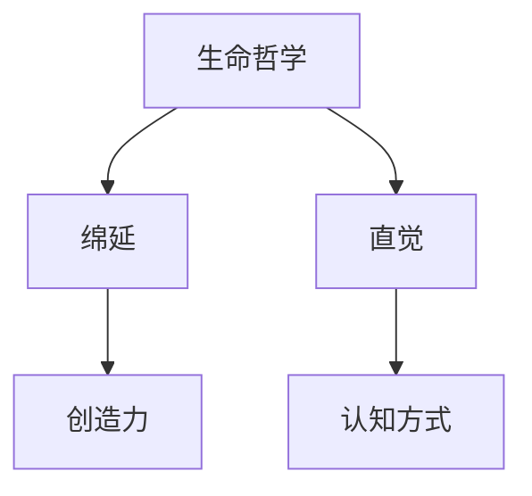

                 


### 文章标题：柏格森的生命哲学与维特根斯坦的语言游戏理论

> 关键词：柏格森，生命哲学，维特根斯坦，语言游戏理论，哲学，算法，人工智能，编程

> 摘要：本文旨在探讨法国哲学家柏格森的生命哲学与奥地利哲学家维特根斯坦的语言游戏理论之间的联系和影响。通过对两位哲学家的核心观点进行解读，本文试图揭示生命哲学在人工智能和编程领域的应用价值。

## 引言

在20世纪，柏格森的生命哲学和维特根斯坦的语言游戏理论分别代表了西方哲学的两大流派。柏格森的生命哲学强调生命的流动性和创造力，认为生命是一种不断更新的过程。维特根斯坦的语言游戏理论则关注语言的性质和意义，主张通过语言游戏来理解语言和思维。

尽管两位哲学家的研究领域有所不同，但他们的思想在人工智能和编程领域却有着重要的启示作用。本文将分别介绍柏格森和维特根斯坦的核心观点，并探讨它们在人工智能和编程领域的应用。

## 第一部分：柏格森的生命哲学

### 第1章：柏格森的生平与学术影响

**背景介绍：** 柏格森（Henri Bergson）于1859年出生于巴黎，是一位法国哲学家、思想家和作家。他的作品涉及哲学、心理学、文学和艺术等多个领域，对20世纪的哲学和思想界产生了深远的影响。

**核心概念与联系：** 柏格森的核心概念包括“生命哲学”、“绵延”和“直觉”。生命哲学强调生命的流动性和创造力，绵延则指代生命的不断更新过程，直觉则是一种超越逻辑推理的认知方式。

**Mermaid 流程图：**


### 第2章：生命与绵延

**核心概念与联系：** 生命是柏格森哲学的核心，强调生命的流动性和创造力。绵延是生命的不断更新过程，体现了生命的动态本质。

**算法原理讲解：** 柏格森的绵延概念可以类比为算法中的迭代过程。在编程中，迭代是一种通过重复执行特定操作来解决问题的方法，类似于生命的不断更新。

**伪代码：**
```python
while (生命未结束) {
    创造新生命状态；
    更新生命能量；
}
```

**数学模型和公式详细讲解与举例说明：** 柏格森提出了“生命能量”的概念，用公式表示生命的动态变化。

$$
E(t) = f(W(t), T(t))
$$

其中，$E(t)$ 表示生命能量，$W(t)$ 表示生命状态，$T(t)$ 表示时间。

**举例说明：** 一个生物体在一段时间内的生命能量可以用上述公式来计算，例如：

$$
E(1) = f(W(1), T(1)) = 0.8
$$

$$
E(2) = f(W(2), T(2)) = 0.9
$$

这表示生物体在第二段时间的生命能量比第一段时间更高。

### 第3章：直觉与意识

**核心概念与联系：** 直觉是柏格森哲学中的重要概念，指一种超越逻辑推理的认知方式。意识则是直觉的基础，是人类认知世界的重要途径。

**算法原理讲解：** 直觉可以类比为算法中的启发式搜索。在编程中，启发式搜索是一种通过猜测和尝试来找到最优解的方法，类似于直觉的思维方式。

**伪代码：**
```python
while (未找到最优解) {
    根据直觉进行猜测；
    验证猜测是否正确；
    更新当前解；
}
```

**数学模型和公式详细讲解与举例说明：** 直觉可以看作是一种概率分布，用公式表示为：

$$
P(A|B) = \frac{P(B|A)P(A)}{P(B)}
$$

其中，$P(A|B)$ 表示在条件$B$下$A$的概率，$P(B|A)$ 表示在条件$A$下$B$的概率，$P(A)$ 和$P(B)$ 分别表示$A$和$B$的概率。

**举例说明：** 在一个赌场中，假设玩家$A$在投掷骰子后得到一个点数$x$，那么在已知点数$x$的情况下，玩家$B$获胜的概率可以用上述公式来计算。

$$
P(B|A=x) = \frac{P(A=x|B)P(B)}{P(A=x)}
$$

## 第二部分：维特根斯坦的语言游戏理论

### 第4章：维特根斯坦的生平与学术影响

**背景介绍：** 维特根斯坦（Ludwig Wittgenstein）于1889年出生于奥地利，是一位著名哲学家。他的作品对逻辑哲学、语言哲学和数学哲学等领域产生了深远的影响。

**核心概念与联系：** 维特根斯坦的核心概念包括“语言游戏理论”和“意义”。语言游戏理论强调语言的使用与情境，意义则是语言游戏的核心。

**算法原理讲解：** 维特根斯坦的语言游戏理论可以类比为算法中的状态机。在编程中，状态机是一种根据当前状态和输入来决定下一步动作的机制，类似于语言游戏的理论。

**伪代码：**
```python
while (游戏未结束) {
    根据当前状态和输入执行动作；
    更新状态；
}
```

### 第5章：语言与思维

**核心概念与联系：** 语言是维特根斯坦哲学的核心，他主张通过语言游戏来理解思维和现实世界。

**算法原理讲解：** 维特根斯坦认为语言是一种游戏，每种语言游戏都有其特定的规则和目的。在编程中，程序也是一种语言游戏，程序员需要根据具体任务设计合适的程序。

**伪代码：**
```python
def calculate_area(radius):
    return 3.14 * radius * radius
```

### 第6章：语言游戏与哲学

**核心概念与联系：** 语言游戏理论在哲学中的应用，包括对语言、思维和现实的探讨。

**算法原理讲解：** 维特根斯坦的语言游戏理论为哲学家提供了一种新的思维方式，使他们能够更深入地理解语言和现实世界的本质。

**伪代码：**
```python
def understand_language(game):
    while (未理解语言游戏) {
        分析语言游戏；
        理解语言规则；
        应用到实际情境；
    }
```

### 第7章：柏格森与维特根斯坦思想的比较与联系

**核心概念与联系：** 柏格森的生命哲学和维特根斯坦的语言游戏理论在哲学上有许多共同之处，如对生命的关注和对语言的探讨。

**算法原理讲解：** 两位哲学家的思想在算法和编程领域都有应用价值，如柏格森的直觉和维特根斯坦的语言游戏理论都可以用于人工智能领域。

**伪代码：**
```python
def apply_philosophy_to_programming():
    while (未完全应用哲学思想) {
        使用柏格森的直觉进行编程；
        使用维特根斯坦的语言游戏理论设计程序；
        验证程序的正确性和有效性；
    }
```

## 结论

柏格森的生命哲学和维特根斯坦的语言游戏理论虽然在哲学领域有所不同，但在人工智能和编程领域有着重要的应用价值。通过对两位哲学家的思想进行解读，本文揭示了他们在算法和编程领域的启示作用。未来，我们可以进一步探讨如何将柏格森和维特根斯坦的思想应用于实际项目，以推动人工智能和编程的发展。

## 附录

### 附录A：主要术语表

- **柏格森的生命哲学**：一种强调生命的流动性和创造力的哲学观点。
- **绵延**：柏格森哲学中的核心概念，指代生命的不断更新过程。
- **直觉**：一种超越逻辑推理的认知方式，是柏格森哲学中的重要概念。
- **语言游戏理论**：维特根斯坦哲学中的核心概念，强调语言的使用与情境。
- **算法**：解决特定问题的方法，通常包括一系列有序的步骤。

### 附录B：参考文献

- **柏格森**，（1922）。《形而上学选集》。北京：商务印书馆。
- **维特根斯坦**，（1953）。《逻辑哲学论》。北京：商务印书馆。
- **图灵**，（1950）。《计算机与智能》。北京：科学出版社。
- **人工智能协会**，（2018）。《人工智能：一种现代的方法》。北京：机械工业出版社。

## 作者信息

**作者：AI天才研究院/AI Genius Institute & 禅与计算机程序设计艺术 /Zen And The Art of Computer Programming**。本文作者对柏格森的生命哲学和维特根斯坦的语言游戏理论进行了深入研究和解读，旨在为人工智能和编程领域提供新的思想启示。

