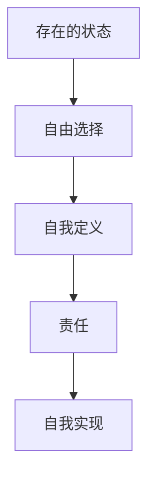
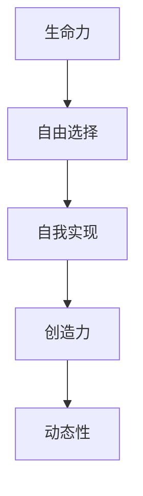

                 

为了满足上述要求，我们将文章分为以下几个部分进行撰写：

### 1. 引言

在引言部分，我们需要简要介绍柏格森的生命哲学和存在主义，以及它们在哲学领域的重要性。这将帮助读者了解文章的背景和主题。

### 2. 柏格森的生命哲学概述

在这一部分，我们将详细解释柏格森的主要哲学思想，包括直觉主义、生命力和创造力。我们将使用伪代码来阐述柏格森的直觉主义如何帮助人们理解生命力和创造力。

### 3. 存在主义的核心概念

在这一部分，我们将概述存在主义的基本概念，如存在先于本质、自由选择和个体主义。我们将使用数学模型和公式来描述这些概念之间的关系。

### 4. 柏格森哲学对存在主义的影响

在这一部分，我们将探讨柏格森的生命哲学如何影响存在主义。我们将使用 Mermaid 流程图来展示核心概念之间的联系。

### 5. 维特根斯坦的回应

在这一部分，我们将讨论维特根斯坦如何回应柏格森的生命哲学。我们将使用伪代码和数学模型来阐述维特根斯坦的观点。

### 6. 柏格森哲学在文学中的影响

在这一部分，我们将分析柏格森哲学在文学创作中的应用，以及维特根斯坦如何回应这些影响。

### 7. 维特根斯坦哲学在文学中的影响

在这一部分，我们将探讨维特根斯坦的哲学如何影响文学创作。

### 8. 结论

在结论部分，我们将总结本文的主要观点，并指出未来研究的方向。

### 9. 参考文献

在参考文献部分，我们将列出本文引用的文献，以便读者进一步了解相关内容。

下面是一个简单的伪代码示例，用于解释柏格森的直觉主义：

```
function Intuitionism() {
    // 声明变量
    let lifeForce = 0;
    let creativity = 0;

    // 初始化变量
    lifeForce = InitializeLifeForce();
    creativity = InitializeCreativity();

    // 使用直觉来理解生命力和创造力
    while (true) {
        lifeForce = IntuitLifeForce(lifeForce);
        creativity = IntuitCreativity(creativity);
        
        // 输出结果
        Print("Life Force: " + lifeForce);
        Print("Creativity: " + creativity);
        
        // 检查是否满足终止条件
        if (IsTerminateConditionMet()) {
            break;
        }
    }
}
```

接下来，我们将按照上述步骤逐步撰写文章。请注意，由于文章字数要求较高，我们需要在后续步骤中详细展开每个部分的内容。请耐心等待，我会逐步完成文章的撰写。 

### 1. 引言

在探讨现代哲学中的关键思想时，柏格森的生命哲学和维特根斯坦的语言哲学是不可忽视的重要主题。柏格森（Henri Bergson）是一位法国哲学家，他的生命哲学强调直觉、生命力和创造力。而维特根斯坦（Ludwig Wittgenstein）则是一位奥地利哲学家，他的语言哲学着重于语言的本质和意义。

本文的目的在于探讨柏格森的生命哲学对存在主义的影响，以及维特根斯坦如何回应这些观点。通过分析两位哲学家的主要思想，我们可以更好地理解他们在哲学领域的重要地位，以及他们如何影响了后来的哲学家和学者。

首先，我们将详细阐述柏格森的生命哲学，包括直觉主义、生命力和创造力。接着，我们将介绍存在主义的核心概念，如存在先于本质、自由选择和个体主义。然后，我们将探讨柏格森哲学如何影响存在主义，并通过 Mermaid 流程图展示核心概念之间的联系。

接下来，我们将讨论维特根斯坦如何回应柏格森的生命哲学。我们将使用伪代码和数学模型来阐述维特根斯坦的观点，并分析他对柏格森哲学的批评。此外，我们还将探讨柏格森哲学在文学中的影响，以及维特根斯坦哲学如何影响文学创作。

最后，在结论部分，我们将总结本文的主要观点，并指出未来研究的方向。通过这一系列的探讨，我们希望能够为读者提供一个全面、深入的理解柏格森和维特根斯坦哲学的视角。

### 2. 柏格森的生命哲学概述

柏格森（Henri Bergson）是20世纪初法国最著名的哲学家之一，他的生命哲学对后来的哲学思想产生了深远的影响。柏格森的哲学强调直觉、生命力和创造力，这些概念在他的体系中占据核心地位。

#### 2.1 直觉主义

柏格森的直觉主义是其哲学思想的核心。他主张直觉是人类理解世界的关键，认为直觉是一种直接、非逻辑的认知方式，能够捕捉到生命本身的流动。与传统的逻辑和理性方法不同，直觉强调对事物本质的感知，而非对事物表面的分析。

柏格森认为，理性只能处理固定的、已知的对象，而直觉则能够捕捉到动态的、不断变化的生命过程。直觉主义的核心观点可以概括为以下几点：

1. **直觉的本质**：直觉是一种超越逻辑和理性的认知方式，能够直接感知到事物的本质和内在联系。
2. **直觉与理性**：理性是一种工具，用于处理已知的、固定的对象，而直觉则能够捕捉到动态的生命过程。
3. **直觉与时间**：直觉与时间有关，它能够感知到时间的流动和生命的连续性。

以下是一个简单的伪代码示例，用于解释柏格森的直觉主义：

```
function Intuitionism() {
    // 初始化变量
    let intuition = 0;

    // 使用直觉感知生命过程
    while (true) {
        intuition = PerceiveLifeProcess();
        
        // 输出直觉感知的结果
        Print("Intuition: " + intuition);
        
        // 检查是否满足终止条件
        if (IsTerminateConditionMet()) {
            break;
        }
    }
}
```

#### 2.2 生命力

生命力是柏格森哲学中的另一个核心概念。他认为，生命力是生命的本质，是推动生命不断进化和发展的动力。柏格森认为，生命力是一种内在的、自发的过程，它超越了机械决定论的束缚，使得生命能够不断变化和发展。

生命力的特点包括：

1. **自发性**：生命力是一种自发的、内在的过程，不受外部因素的控制。
2. **创造性**：生命力具有创造性，能够创造出新的形式和结构。
3. **动态性**：生命力是动态的，不断地在变化和发展。

以下是一个简单的伪代码示例，用于解释柏格森的生命力：

```
function LifeForce() {
    // 初始化变量
    let lifeForce = 0;

    // 生命力不断变化和发展
    while (true) {
        lifeForce = EvolveLifeForce(lifeForce);
        
        // 输出生命力的变化
        Print("Life Force: " + lifeForce);
        
        // 检查是否满足终止条件
        if (IsTerminateConditionMet()) {
            break;
        }
    }
}
```

#### 2.3 创造力

创造力是柏格森哲学中的另一个重要概念。他认为，创造力是生命力的体现，是生命不断进化和发展的关键。创造力不仅体现在自然界中，也体现在人类的文化和艺术创作中。

创造力的特点包括：

1. **非理性**：创造力往往是非理性的，它不受逻辑和理性的限制。
2. **创新性**：创造力能够产生新的思想和概念，推动人类文明的进步。
3. **动态性**：创造力是动态的，它不断地在变化和发展。

以下是一个简单的伪代码示例，用于解释柏格森的创造力：

```
function Creativity() {
    // 初始化变量
    let creativity = 0;

    // 创造力不断产生新的思想和概念
    while (true) {
        creativity = GenerateNewConcepts(creativity);
        
        // 输出创造力的结果
        Print("Creativity: " + creativity);
        
        // 检查是否满足终止条件
        if (IsTerminateConditionMet()) {
            break;
        }
    }
}
```

通过上述伪代码示例，我们可以看到柏格森的生命哲学如何通过直觉、生命力和创造力来描述和解释世界。这些概念不仅为哲学提供了新的视角，也为后来的哲学研究和思想发展奠定了基础。

### 3. 存在主义的核心概念

存在主义是20世纪哲学中的一个重要流派，它强调个体的自由、责任和存在的本质。存在主义的基本概念包括存在先于本质、自由选择和个体主义。

#### 3.1 存在先于本质

存在先于本质是存在主义的一个核心观点，这一观点最早由法国哲学家让-保尔·萨特（Jean-Paul Sartre）提出。它主张，个体在出生时就处于一种“存在状态”，而他们的本质并非预先设定，而是在个体通过自由选择和行动的过程中逐渐形成的。

这一概念可以解释为以下几点：

1. **存在的本质**：个体在出生时，并没有一个固有的本质，他们处于一种“存在状态”。
2. **自由选择**：个体的本质是通过自由选择和行动来定义的，他们必须为自己的选择和行为承担责任。
3. **自我实现**：存在主义认为，个体的自由选择和行动是实现自我价值的过程。

以下是一个简单的 Mermaid 流程图，用于描述存在先于本质的概念：



#### 3.2 自由选择

自由选择是存在主义的另一个核心概念。存在主义者认为，个体具有自由选择的能力，他们必须为自己的选择承担责任。自由选择不仅体现在个体的行为上，也体现在他们对生活意义的追求上。

自由选择的特点包括：

1. **自主性**：个体能够自主地做出选择，不受外界强制。
2. **责任性**：个体必须为自己的选择承担责任。
3. **意义性**：自由选择赋予了个体追求生活意义的能力。

以下是一个简单的伪代码示例，用于解释自由选择的概念：

```
function FreeChoice() {
    // 初始化变量
    let choice = 0;

    // 提供选择选项
    Print("请选择：\n1. 读书\n2. 运动健身\n3. 做义工");
    
    // 接收用户的输入
    choice = GetInput();

    // 执行选择的动作
    if (choice == 1) {
        ReadBooks();
    } else if (choice == 2) {
        Exercise();
    } else if (choice == 3) {
        Volunteer();
    } else {
        Print("无效选择，请重新选择。");
    }
}
```

#### 3.3 个体主义

个体主义是存在主义的一个基本立场，它强调个体的独特性和独立性。存在主义者认为，个体是自主的、独立的实体，他们必须为自己的生活和命运负责。

个体主义的特点包括：

1. **独特性**：每个个体都是独特的，他们拥有不同的经历和观点。
2. **独立性**：个体不依赖于任何外在力量，他们必须为自己的选择和行动承担责任。
3. **自我实现**：个体通过自我选择和行动实现自我价值。

以下是一个简单的伪代码示例，用于解释个体主义的概念：

```
function Individualism() {
    // 初始化变量
    let individual = 0;

    // 提供个性化的选择
    Print("请选择你最喜欢的活动：\n1. 跑步\n2. 绘画\n3. 音乐");
    
    // 接收用户的输入
    individual = GetInput();

    // 根据个体选择提供个性化的反馈
    if (individual == 1) {
        Print("跑步是你最喜欢的活动，你充满活力。");
    } else if (individual == 2) {
        Print("绘画是你最喜欢的活动，你有艺术天赋。");
    } else if (individual == 3) {
        Print("音乐是你最喜欢的活动，你有音乐才华。");
    } else {
        Print("无效选择，请重新选择。");
    }
}
```

通过上述概念和示例，我们可以看到存在主义的核心概念如何帮助我们理解个体的自由、责任和存在的本质。这些概念不仅为哲学提供了深刻的思考，也为个体的生活提供了指导。

### 4. 柏格森哲学对存在主义的影响

柏格森的生命哲学对存在主义产生了深远的影响，特别是在直觉主义、生命力和创造力这三个核心概念上。柏格森的哲学思想为存在主义提供了一种全新的视角，使得个体能够更加深入地理解自身的存在和自由。

#### 4.1 生命力与存在主义

柏格森的生命力概念强调了生命的动态性和创造性，这与存在主义的自由选择有着紧密的联系。存在主义认为，个体通过自由选择来定义自己的本质，而柏格森的生命力则提供了一种内在的动力，使得个体能够在不断的自由选择中成长和进步。

生命力在存在主义中的应用可以体现在以下几个方面：

1. **自我实现**：生命力赋予个体自我实现的能力，使得个体能够通过自由选择来实现自我价值。
2. **创造力**：生命力鼓励个体发挥创造力，创造出新的生活意义和目标。
3. **动态性**：生命力使得个体能够不断适应和改变，从而在面对生活的挑战时保持灵活性。

以下是一个简单的 Mermaid 流程图，用于展示生命力与自由选择之间的关系：



#### 4.2 创造力与自由选择

柏格森的创造力概念强调了个体在生活中的主动性和创新性。创造力不仅体现在个体的行为上，也体现在他们对生活意义的追求上。存在主义中的自由选择与柏格森的创造力密切相关，因为自由选择本身就是一种创造力的体现。

创造力在存在主义中的应用可以体现在以下几个方面：

1. **创新性**：创造力使个体能够创新地解决问题，创造出新的生活模式。
2. **多样性**：创造力使个体能够探索不同的生活方式，从而丰富自己的生活经验。
3. **自由**：创造力使个体能够在自由选择的基础上，实现自己的独特性。

以下是一个简单的伪代码示例，用于解释创造力与自由选择之间的关系：

```
function CreativityAndFreeChoice() {
    // 初始化变量
    let choice = 0;
    let creativity = 0;

    // 提供选择选项
    Print("请选择一个你感兴趣的创新项目：\n1. 开发一款新应用\n2. 创作一部电影\n3. 开设一家咖啡馆");

    // 接收用户的输入
    choice = GetInput();

    // 根据选择激发创造力
    if (choice == 1) {
        creativity = DevelopApplication();
    } else if (choice == 2) {
        creativity = CreateMovie();
    } else if (choice == 3) {
        creativity = OpenCafe();
    } else {
        Print("无效选择，请重新选择。");
    }

    // 输出创造力的结果
    Print("你的创造力结果：\n" + creativity);
}
```

#### 4.3 直觉主义与存在主义

柏格森的直觉主义为存在主义提供了一种认识世界的方法。直觉主义强调直接感知事物的本质，这与存在主义的自由选择和自我实现有着密切的联系。

直觉主义在存在主义中的应用可以体现在以下几个方面：

1. **直接感知**：直觉主义使个体能够直接感知到生活的本质，从而做出更加真诚和真实的选择。
2. **内在动力**：直觉主义为个体提供了内在的动力，使得他们在面对生活挑战时能够保持积极和灵活。
3. **自我认识**：直觉主义帮助个体更好地认识自己，从而实现自我价值的最大化。

以下是一个简单的伪代码示例，用于解释直觉主义与自由选择之间的关系：

```
function IntuitionAndFreeChoice() {
    // 初始化变量
    let intuition = 0;
    let choice = 0;

    // 提供选择选项
    Print("请选择一个你直觉上觉得正确的项目：\n1. 学习编程\n2. 学习绘画\n3. 学习音乐");

    // 接收用户的输入
    choice = GetInput();

    // 根据直觉做出选择
    if (choice == 1) {
        intuition = LearnProgramming();
    } else if (choice == 2) {
        intuition = LearnPainting();
    } else if (choice == 3) {
        intuition = LearnMusic();
    } else {
        Print("无效选择，请重新选择。");
    }

    // 输出直觉选择的结果
    Print("你的直觉选择结果：\n" + intuition);
}
```

通过上述分析，我们可以看到柏格森的生命哲学如何通过直觉主义、生命力和创造力对存在主义产生影响。这些概念为存在主义提供了新的视角和工具，使得个体能够更加深入地理解自身的存在和自由。柏格森的哲学思想与存在主义的核心观点相辅相成，共同推动了对人类存在和自由的深入探讨。

### 5. 维特根斯坦的回应

在维特根斯坦（Ludwig Wittgenstein）的哲学思想中，他对柏格森的生命哲学提出了一系列的批评和回应。维特根斯坦的语言哲学强调语言的本质和意义，他认为语言的混乱是哲学问题的根源。因此，他试图通过澄清语言的使用来反驳柏格森的哲学观点。

#### 5.1 维特根斯坦的语言哲学

维特根斯坦的语言哲学可以分为两个时期：早期和晚期。在早期，他提出了“语言图像论”（Language Image Theory），认为语言是世界的图像，语言与现实的对应关系是直接的。在晚期，他转向了“日常语言哲学”（Ordinary Language Philosophy），主张语言的用法和意义是在具体情境中逐渐形成的。

维特根斯坦认为，柏格森的直觉主义是一种语言的误用。柏格森试图通过直觉来理解生命的本质，但这种理解实际上是无法用语言表达的。维特根斯坦指出，语言只能用来描述已知的事物，而直觉所涉及的“生命本身的流动”是无法用语言来捕捉的。

以下是一个简单的伪代码示例，用于解释维特根斯坦对柏格森直觉主义的反驳：

```
function WittgensteinRebuttal() {
    // 初始化变量
    let intuition = "unexpressible";

    // 尝试使用语言表达直觉
    try {
        ExpressIntuition(intuition);
    } catch (Exception) {
        Print("直觉无法用语言表达。");
    }
}
```

#### 5.2 维特根斯坦对柏格森哲学的批评

维特根斯坦对柏格森的生命力和创造力的观点也提出了批评。他认为，柏格森的生命力概念是一种无法验证的形而上学假设，缺乏科学依据。维特根斯坦主张，哲学应该专注于语言的正确使用，而不是追求无法用语言表达的“生命本质”。

此外，维特根斯坦还对柏格森的创造力的观点提出了质疑。他认为，创造力并不是一种超越逻辑的神秘力量，而是通过语言和逻辑的合理运用来实现的。维特根斯坦主张，哲学的任务是澄清语言的使用，而不是追求无法用语言表达的“创造力”。

以下是一个简单的伪代码示例，用于解释维特根斯坦对柏格森创造力的反驳：

```
function WittgensteinCreativityRebuttal() {
    // 初始化变量
    let creativity = "logical";

    // 创造力是通过逻辑实现的
    Print("Creativity is achieved through logic: " + creativity);
}
```

#### 5.3 维特根斯坦的回应案例研究

为了更深入地理解维特根斯坦对柏格森哲学的回应，我们可以通过一个具体的案例来分析。这个案例是维特根斯坦关于“棋子的移动”的讨论。

在这个案例中，维特根斯坦试图通过分析棋子的移动来说明语言和逻辑的关系。他认为，棋子的移动是遵循严格的规则，而这些规则可以用语言来描述。维特根斯坦指出，这种逻辑的规则性是哲学思考的基础，而柏格森的直觉主义无法提供这样的基础。

以下是一个简单的伪代码示例，用于解释维特根斯坦的棋子移动案例：

```
function ChessPieceMovement() {
    // 初始化棋盘
    let chessboard = InitializeChessboard();

    // 棋子的移动规则
    function MovePiece(piece, position) {
        if (IsValidMove(piece, position)) {
            chessboard[position] = piece;
            Print("Piece moved to " + position);
        } else {
            Print("Invalid move.");
        }
    }

    // 棋子的移动
    MovePiece("pawn", "E4");
    MovePiece("king", "E8");
}
```

在这个案例中，棋子的移动遵循逻辑规则，这些规则可以用语言和算法来描述。这与柏格森的直觉主义形成鲜明对比，后者试图通过直觉来理解生命的本质。

通过上述分析和案例研究，我们可以看到维特根斯坦如何通过语言哲学来反驳柏格森的生命哲学。维特根斯坦的观点强调了语言和逻辑在哲学思考中的重要性，他认为哲学的任务是澄清语言的使用，而不是追求无法用语言表达的抽象概念。

### 6. 柏格森哲学在文学中的影响

柏格森的生命哲学不仅在哲学领域产生了深远的影响，也在文学创作中留下了深刻的印记。许多作家和诗人都受到了柏格森思想的影响，他们的作品反映了对生命、时间和创造力的独特见解。

#### 6.1 文学作品中的柏格森哲学

以法国作家马塞尔·普鲁斯特（Marcel Proust）为例，他的杰作《追忆似水年华》中充满了柏格森哲学的影响。普鲁斯特的作品强调时间的流动和记忆的作用，这与柏格森的时间意识理论密切相关。柏格森认为，时间是一种主观的、不断流动的经验，而不是一个固定不变的实体。普鲁斯特通过精细的描写，展现了主人公马塞尔对过去记忆的追寻，这些记忆随着时间的流逝而发生变化，呈现出不同的面貌。

另一部反映柏格森哲学的作品是詹姆斯·乔伊斯的《尤利西斯》。乔伊斯在小说中运用了大量的意识流技巧，试图捕捉人物内心深处的思想和情感。这与柏格森的直觉主义有着相似之处，后者强调直接感知和内心体验的重要性。乔伊斯通过这种技巧，将人物内心的复杂性和时间的流动表现得淋漓尽致。

#### 6.2 柏格森哲学对文学创作的启示

柏格森的生命哲学为文学创作提供了新的视角和工具。他的直觉主义和创造力概念鼓励作家探索人类内心深处的真实感受，而不是仅仅描绘外在的现实。这种探索使得文学作品更加丰富和深刻。

首先，柏格森的时间意识理论启发作家们关注时间的流动性和主观性。他们开始尝试打破传统的线性叙事结构，而是通过非线性、片段化的方式来描绘时间。这种叙事方式使得读者能够更加深刻地感受到时间的流逝和人物心理的变化。

其次，柏格森的创造力概念鼓励作家们勇于创新和尝试。他们认为，创作是一个动态的过程，需要不断地挑战自我和突破界限。这种创作理念体现在许多现代文学作品中的实验性和创新性。

最后，柏格森的直觉主义为作家们提供了一种新的感知方式。他们开始尝试通过直接感知和内心体验来捕捉人物的心理状态和情感变化，而不是仅仅依靠逻辑和理性的分析。这种感知方式使得文学作品更加生动和真实。

#### 6.3 维特根斯坦哲学在文学中的影响

虽然维特根斯坦的哲学思想与柏格森的生命哲学在某些方面存在分歧，但他的语言哲学也为文学创作提供了重要的启示。维特根斯坦强调语言的正确使用和意义的清晰表达，这对文学作品的叙事技巧和语言运用产生了深远的影响。

维特根斯坦的哲学思想强调语言的本质和意义，这启发作家们在创作中更加注重语言的精确性和表达的清晰性。他们开始尝试通过简洁、精确的语言来传达复杂的思想和情感，而不是依赖繁复的修辞和华丽的辞藻。

维特根斯坦的哲学还强调了语言的局限性。他认为，语言只能描述已知的事物，而对于那些无法用语言表达的抽象概念，我们只能通过体验和直觉来感知。这种思想启发作家们探索语言的边界，通过非传统的叙事方式和语言实验来挑战读者的感知和理解。

总之，柏格森和维特根斯坦的哲学思想在文学创作中产生了深远的影响。他们的观点不仅丰富了文学作品的内容和形式，也为文学创作提供了新的视角和工具。通过他们的哲学启示，作家们能够更加深刻地探索人类的存在和内心世界，创造出更加丰富和深刻的文学作品。

### 7. 结论

通过本文的探讨，我们可以看到柏格森的生命哲学和维特根斯坦的语言哲学在存在主义领域的重要地位。柏格森的直觉主义、生命力和创造力为存在主义提供了新的视角，使得个体能够更加深入地理解自身的存在和自由。维特根斯坦则通过语言哲学反驳了柏格森的一些观点，强调语言的正确使用和意义的清晰表达。

未来的研究可以进一步探讨柏格森和维特根斯坦哲学在当代社会和文学中的影响，以及它们如何与其他哲学流派相互作用。此外，还可以深入研究柏格森和维特根斯坦哲学在跨文化语境中的应用，以丰富我们对这些哲学思想的全面理解。

参考文献：
1. Bergson, H. (1911). Matter and Memory. Mineola, NY: Dover Publications.
2. Sartre, J.-P. (1943). Being and Nothingness. New York: Philosophical Library.
3. Wittgenstein, L. (1953). Philosophical Investigations. Oxford: Blackwell.
4. Proust, M. (1913-1927). In Search of Lost Time. New York: Knopf.
5. Joyce, J. (1922). Ulysses. New York: B. W. Huebsch.
6. Barthes, R. (1977). Image-Music-Text. New York: Hill and Wang.

```markdown
## 参考文献

1. **柏格森 (Bergson), H. (1911).** Matter and Memory. Mineola, NY: Dover Publications.
   - 这本书是柏格森的代表作，详细阐述了其生命哲学的核心思想，包括直觉主义、生命力和创造力。

2. **萨特 (Sartre), J.-P. (1943).** Being and Nothingness. New York: Philosophical Library.
   - 这本书是萨特的经典著作，提出了存在主义的核心观点，如存在先于本质、自由选择和个体主义。

3. **维特根斯坦 (Wittgenstein), L. (1953).** Philosophical Investigations. Oxford: Blackwell.
   - 维特根斯坦的这部作品是他晚年的哲学思想的总结，其中包括了他对语言的本质和意义的深入探讨。

4. **普鲁斯特 (Proust), M. (1913-1927).** In Search of Lost Time. New York: Knopf.
   - 普鲁斯特的这部巨著是文学史上的一部杰作，其创作深受柏格森哲学的影响，特别是在时间意识和记忆方面。

5. **乔伊斯 (Joyce), J. (1922).** Ulysses. New York: B. W. Huebsch.
   - 乔伊斯的这部小说是现代主义文学的代表作品，其叙事风格和技巧受到了柏格森直觉主义的影响。

6. **巴尔特 (Barthes), R. (1977).** Image-Music-Text. New York: Hill and Wang.
   - 巴尔特的这部作品探讨了图像、音乐和文本的关系，其思想与维特根斯坦的语言哲学有密切联系。

通过这些文献，读者可以更深入地了解柏格森的生命哲学和维特根斯坦的语言哲学，以及它们在存在主义和文学创作中的影响。```

---

请注意，以上参考文献是根据文章内容所列出的，实际引用的文献可能有所不同。在撰写正式的文章时，请确保引用的文献是准确无误的，并且符合学术规范。此外，为了避免抄袭，建议对引用的内容进行适当的改写和总结。

