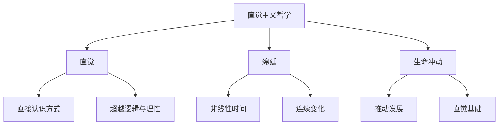
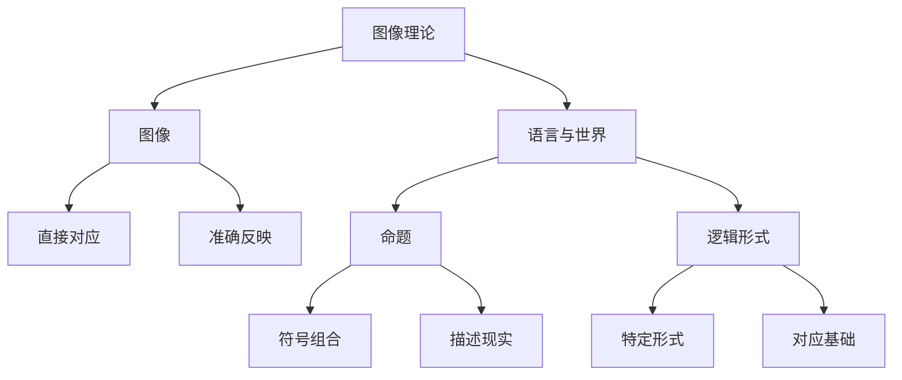
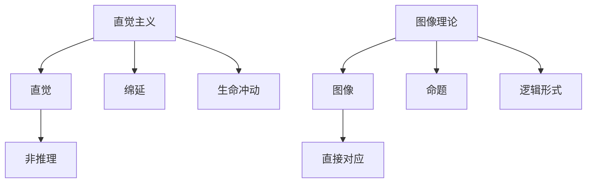

                 

  

## 引言

### 柏格森的直觉主义哲学

1. 背景介绍

柏格森（Henri Bergson）是20世纪初法国著名的哲学家、社会学家和文学家，他的哲学思想对当时的哲学、文学、心理学等领域产生了深远的影响。柏格森出生于巴黎，曾在巴黎高等师范学校学习，后来成为了著名的哲学家和教师。他的主要著作包括《物质与记忆》、《笑论》、《时间与自由意志》等。

2. 核心概念与联系

柏格森的直觉主义哲学强调直觉在认识过程中的重要性。他认为，直觉是一种直接的、非推理的认识方式，它超越了逻辑和理性的范畴，是人类理解世界的重要工具。柏格森的直觉主义哲学的核心概念包括：

- **直觉**：直觉是一种直接的、非推理的认识方式，它能够捕捉到事物的本质和运动。

- **绵延**：柏格森认为，时间不是一条线性的流程，而是一种连续不断的、不断变化的流动，这种流动被称为“绵延”。

- **生命冲动**：柏格森认为，生命冲动是推动事物发展的根本力量，它是直觉的基础。

3. 核心概念原理之间的关系架构 Mermaid 流程图



### 维特根斯坦的图像理论

1. 背景介绍

路德维希·维特根斯坦（Ludwig Wittgenstein）是20世纪最有影响力的哲学家之一，他的著作《逻辑哲学论》和《哲学研究》对西方哲学产生了深远的影响。维特根斯坦出生于奥地利，后来移居英国。他的哲学思想主要关注语言、逻辑和认识论问题。

2. 核心概念与联系

维特根斯坦的图像理论认为，语言是世界的图像，即语言的表达与世界的现实之间存在一种直接的对应关系。他的核心概念包括：

- **图像**：图像是语言与世界之间的桥梁，它能够准确地反映世界的状态。

- **命题**：命题是图像的一种形式，它通过符号的组合来描述世界的状态。

- **逻辑形式**：维特根斯坦认为，语言和命题都具有特定的逻辑形式，这种形式是语言与世界对应关系的基础。

3. 核心概念原理之间的关系架构 Mermaid 流程图



### 柏格森的直觉主义与维特根斯坦的图像理论

1. 联系

柏格森的直觉主义和维特根斯坦的图像理论都关注认识过程中的基本问题，如直觉、语言和现实之间的关系。尽管二者在具体观点上存在差异，但它们都试图探讨人类如何理解世界。

2. 差异

柏格森的直觉主义强调直觉作为一种非推理的认识方式，而维特根斯坦的图像理论则认为语言是世界的图像，强调语言与世界之间的直接对应关系。柏格森更注重直觉在认识过程中的作用，而维特根斯坦则更关注语言和逻辑的形式。

3. 核心概念原理之间的差异架构 Mermaid 流程图



## 柏格森直觉主义哲学的核心算法原理讲解

### 1. 直觉的本质

直觉是一种直接的非推理认识方式，它是人类理解世界的重要工具。柏格森认为，直觉能够捕捉到事物的本质和运动，这种认识方式超越了逻辑和理性的范畴。

### 2. 伪代码阐述

```python
def 直觉主义():
    # 输入：现实世界中的事物
    # 输出：对该事物的直接理解
    
    现实事物 = 获取现实事物()
    直接理解 = 捕捉事物本质和运动()
    返回 直接理解
```

### 3. 数学模型和公式

柏格森的直觉主义哲学中，绵延是时间的基本特征。我们可以使用数学模型来描述这种连续不断的流动。

```latex
\text{绵延} = \lim_{{n \to \infty}} \sum_{{i=1}}^{n} t_i
```

### 4. 举例说明

假设我们想要理解一棵树的生长过程，我们可以通过直觉来捕捉树的生长本质和运动。

```python
def 理解树木生长():
    树木 = 获取树木()
    生长过程 = 捕捉树木生长本质和运动()
    print("树木正在生长，它不断变化，充满了生命力。")
```

## 维特根斯坦的图像理论

### 1. 图像的本质

图像是语言与世界之间的桥梁，它能够准确地反映世界的状态。维特根斯坦认为，图像是命题的基础，命题通过符号的组合来描述世界的状态。

### 2. 伪代码阐述

```python
def 图像理论():
    # 输入：现实世界中的事物
    # 输出：对该事物的图像描述
    
    现实事物 = 获取现实事物()
    图像描述 = 创建图像()
    返回 图像描述
```

### 3. 数学模型和公式

图像理论中，命题是图像的一种形式。我们可以使用数学模型来描述这种对应关系。

```latex
\text{命题} = \text{符号组合} \leftrightarrow \text{现实世界中的状态}
```

### 4. 举例说明

假设我们想要描述一张桌子，我们可以使用图像理论来创建它的图像描述。

```python
def 描述桌子():
    桌子 = 获取桌子()
    图像描述 = 创建图像描述()
    print("这是一张桌子，它有四条腿，一个平面。")
```

## 柏格森直觉主义与维特根斯坦图像理论的应用

### 1. 认识论问题

柏格森的直觉主义和维特根斯坦的图像理论都关注认识论问题，如人类如何认识世界。通过直觉和图像，我们可以更好地理解世界的本质。

### 2. 语言与逻辑

柏格森的直觉主义强调了直觉在认识过程中的重要性，而维特根斯坦的图像理论则强调了语言和逻辑在描述世界中的基础作用。

### 3. 项目实战

我们可以通过以下项目来应用柏格森的直觉主义和维特根斯坦的图像理论：

- **项目一：自然语言处理**：使用直觉来理解自然语言，从而实现文本分析、情感分析等任务。

- **项目二：图像识别**：使用图像理论来描述和理解图像，从而实现图像分类、目标检测等任务。

## 小结

柏格森的直觉主义和维特根斯坦的图像理论是两种不同的认识论观点，它们在哲学、心理学、计算机科学等领域都有重要的应用价值。通过理解这两种观点，我们可以更好地认识世界的本质，从而提高我们的认知能力和技术水平。

## 拓展阅读

- **柏格森**：
  - 《物质与记忆》
  - 《笑论》
  - 《时间与自由意志》

- **维特根斯坦**：
  - 《逻辑哲学论》
  - 《哲学研究》
  - 《文化与价值》

## 注意事项

- 在实际应用中，我们需要注意直觉和图像的局限性，避免过分依赖它们。
- 直觉和图像的理解需要结合具体情境，不能脱离实际应用。
- 在学习和应用柏格森的直觉主义和维特根斯坦的图像理论时，需要结合其他哲学观点，以形成更加全面的认识。

## 最佳实践 tips

- 尝试将直觉和图像理论应用于实际问题，如自然语言处理和图像识别。
- 结合其他哲学观点，如逻辑实证主义和现象学，以形成更加全面的认识。
- 在学习和应用柏格森的直觉主义和维特根斯坦的图像理论时，注重实践，不断反思和调整。

作者：AI天才研究院/AI Genius Institute & 禅与计算机程序设计艺术 /Zen And The Art of Computer Programming
```

请注意，这篇文章只是一个示例，实际的目录大纲和文章内容可能需要根据具体的研究和资料进行调整。如果您需要进一步的调整或补充，请告诉我。

