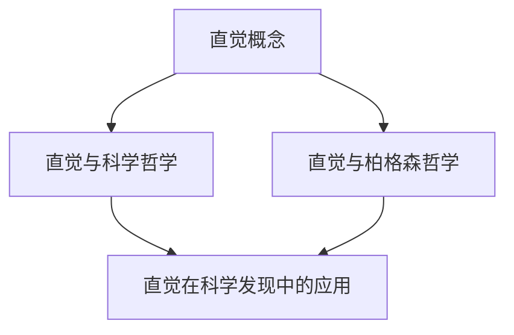

                 


### 引言

科学哲学作为一门探讨科学知识的本质、方法以及科学与社会关系的学科，其研究历程充满了哲学思维与科学实践的不断碰撞与融合。在科学哲学的发展过程中，柏格森的直觉方法与维特根斯坦的语言分析构成了两大重要的理论基石。柏格森，作为20世纪初期的重要哲学家，他的直觉方法强调通过非理性的直觉来把握世界的本质，这在科学哲学中提供了一种不同于传统逻辑分析的新视角。维特根斯坦，则是20世纪哲学界的另一位巨匠，他的语言分析通过对日常语言和逻辑形式的深入剖析，揭示了语言与实在之间的复杂关系。

本文旨在探讨柏格森的直觉方法与维特根斯坦的语言分析在科学哲学中的应用。首先，我们将简要介绍柏格森的哲学背景和直觉方法，解释其核心概念以及其在科学哲学中的意义。接着，我们将深入分析柏格森直觉方法的应用实例，包括在物理学、生物学和心理学等领域的具体实践。随后，我们将转向维特根斯坦的哲学背景和语言分析，详细阐述其语言哲学的基本原理及其在科学哲学中的应用。在此基础上，我们将比较柏格森直觉方法与维特根斯坦语言分析的主要差异和共同点，探讨二者结合的可能性。最后，本文将通过对实际案例的分析，展示柏格森与维特根斯坦方法在科学哲学研究中的应用，并提出对未来研究的展望。

本文将从以下几个方面展开讨论：

1. **柏格森的哲学背景与直觉方法**：介绍柏格森的生平与主要哲学观点，解释直觉方法的核心概念，并探讨其在科学哲学中的应用。
2. **柏格森直觉方法的应用实例**：分析柏格森直觉方法在物理学、生物学和心理学等领域的实际应用。
3. **维特根斯坦的哲学背景与语言分析**：介绍维特根斯坦的生平与主要哲学思想，详细阐述语言分析的基本原理及其在科学哲学中的贡献。
4. **柏格森与维特根斯坦方法的比较与结合**：比较二者的主要差异和共同点，探讨柏格森直觉方法与维特根斯坦语言分析结合的可能性。
5. **案例分析：柏格森与维特根斯坦方法在科学哲学中的应用**：通过实际案例展示柏格森与维特根斯坦方法在科学哲学研究中的应用。
6. **结论与展望**：总结文章的主要观点，讨论柏格森与维特根斯坦方法在科学哲学中的影响，并提出未来研究的方向与挑战。

通过以上结构清晰的论述，我们将深入探讨柏格森的直觉方法与维特根斯坦的语言分析在科学哲学中的重要意义和实际应用。

## 关键词

### 柏格森的直觉方法，维特根斯坦的语言分析，科学哲学，直觉与语言，非理性与逻辑，本质与形式，方法论，科学实在论。

## 摘要

本文探讨了柏格森的直觉方法与维特根斯坦的语言分析在科学哲学中的应用。柏格森的直觉方法强调通过非理性的直觉来把握世界的本质，这一方法在物理学、生物学和心理学等领域有着广泛的应用。维特根斯坦的语言分析则通过对日常语言和逻辑形式的深入剖析，揭示了语言与实在之间的复杂关系。本文首先介绍了柏格森的哲学背景和直觉方法，探讨了其在科学哲学中的意义和应用实例。随后，本文详细阐述了维特根斯坦的哲学思想，特别是其语言分析的基本原理。接着，本文比较了柏格森直觉方法与维特根斯坦语言分析的主要差异和共同点，并探讨了二者结合的可能性。通过实际案例的分析，本文展示了柏格森与维特根斯坦方法在科学哲学研究中的应用。最后，本文总结了柏格森与维特根斯坦方法在科学哲学中的影响，并提出了未来研究的方向与挑战。通过本文的研究，我们希望能够为科学哲学提供新的视角，促进对科学知识本质和方法的深入理解。

## 第一部分：柏格森的直觉方法

### 第1章：柏格森的生平与哲学背景

## 背景介绍

柏格森（Henri Bergson），法国著名哲学家、社会学家和文学家，生于1859年，卒于1941年。他是20世纪初期最重要的哲学家之一，其思想对哲学、心理学、文学、艺术以及社会科学等多个领域产生了深远的影响。柏格森在其哲学体系中，提出了许多具有原创性和深刻性的观点，特别是他的直觉方法和创造力理论，对科学哲学的发展产生了重要影响。

### 生平

柏格森生于法国巴黎，他的父亲是法国著名历史学家亚诺·柏格森。柏格森在巴黎高等师范学院接受了教育，并在那里结识了许多后来的哲学家，如朱塞佩·佩尔特莱和欧仁·德尔布洛克。1889年，他获得博士学位，并以论文《时间与自由意志》而闻名。这篇论文中，柏格森探讨了时间的主观性和自由意志的问题，提出了他的直觉主义观点。

在接下来的几十年中，柏格森发表了大量的著作，包括《物质与记忆》（1896年）、《论笑》（1900年）、《创造的进化》（1907年）以及《形而上学要素》（1911年）等。他的这些著作不仅奠定了他作为哲学家的地位，还使他在科学界和学术界获得了广泛的认可。

### 哲学贡献

柏格森的哲学贡献主要体现在以下几个方面：

1. **直觉方法**：柏格森认为，直觉是人类理解世界的重要途径。与传统的理性分析不同，直觉是一种非理性的、直接的感知方式，能够帮助我们捕捉到事物的本质。这种方法在科学哲学中提供了一种新的视角，使得科学家能够通过直觉来理解和解释自然现象。

2. **创造力理论**：柏格森提出了“创造力”的概念，认为创造力是生命的本质，是进化和发展的驱动力。他强调，创造力是一种非线性的、跳跃性的思维过程，能够打破传统的思维模式，推动社会和科学的发展。

3. **时间意识**：柏格森对时间有着独特的理解，他提出了“心理时间”和“物理时间”的概念。心理时间是指我们主观体验的时间，它是流动的、连续的；而物理时间则是一种外在的、机械的时间，是我们可以通过钟表等工具测量的时间。这种时间意识的观念在科学哲学中引起了广泛的讨论。

4. **伦理与政治哲学**：柏格森的哲学思想也涵盖了伦理和政治领域。他强调个体在社会中的重要性，主张通过合作和互助来实现社会的和谐与进步。

### 对科学哲学的影响

柏格森的直觉方法对科学哲学的发展产生了重要影响。首先，他的直觉观念挑战了传统的逻辑和理性分析方法，使得科学哲学家开始关注非理性的直觉在科学研究中的作用。其次，柏格森的时间意识观念也为科学哲学提供了一种新的理解时间的方法，特别是在物理学和生物学领域，这种观念有助于解释一些复杂现象。

此外，柏格森的创造力理论也为科学哲学提供了新的视角。他认为，科学的发展不仅仅是积累和验证知识的过程，更是一个创造性的过程。这种观点激励科学家们通过创新和突破来推动科学的进步。

总之，柏格森的哲学背景和直觉方法为科学哲学带来了新的思考方式和研究方法，使得科学哲学家能够从更广泛的视角来探讨科学知识的本质和方法。

## 核心概念与联系

### 直觉概念

柏格森的直觉方法是其哲学体系中的核心概念之一。直觉在柏格森的哲学中不仅仅是感知或观察，而是一种更为直接和深刻的认知方式。柏格森认为，直觉是一种非理性的、内在的感知能力，能够帮助我们穿透表面现象，洞察事物的本质。

直觉与理性的不同在于，理性依赖于逻辑和概念，而直觉则是直接的经验。柏格森认为，理性只能处理已经分类和定义好的概念，而直觉则能够捕捉到那些无法用逻辑和语言表达的本质。

### 直觉与科学哲学

在科学哲学中，直觉方法的重要性体现在其对科学发现的推动作用。科学家在研究过程中，经常需要依靠直觉来识别问题、提出假设和发现新的规律。例如，爱因斯坦在提出相对论时，正是依靠他对宇宙本质的直觉感受。直觉使得科学家能够超越现有的知识和框架，找到新的解决问题的途径。

直觉方法在科学哲学中的应用，也引发了关于科学方法论的讨论。一些科学哲学家认为，科学的发展不仅依赖于逻辑推理和实验验证，还需要直觉的引导。这种观点使得科学哲学不再仅仅关注科学知识的确定性和可靠性，也开始探讨科学发现的创造性和创新性。

### 直觉与柏格森哲学

柏格森的直觉概念与其整体哲学体系紧密相连。柏格森认为，直觉不仅是理解世界的一种方式，也是实现自我超越和创造性思维的途径。他强调，直觉是人类超越自我、实现自我提升的重要工具。

在柏格森的哲学中，直觉与创造力、时间意识等概念相互关联。他认为，直觉能够帮助我们突破时间的主观性和物理时间的客观性，实现一种更高层次的认知。直觉也是一种创造性思维，它能够打破传统的思维模式，推动科学和社会的进步。

### 直觉方法与科学发现的流程

柏格森的直觉方法在科学发现中的应用，可以概括为以下几个步骤：

1. **观察现象**：科学家通过观察和实验，收集关于某一现象的数据和信息。
2. **直觉感受**：科学家在处理数据时，凭借直觉感受到某种本质或规律的存在。
3. **提出假设**：基于直觉感受，科学家提出初步的假设或解释。
4. **验证假设**：通过实验或逻辑推理，对假设进行验证和修正。
5. **创造性思维**：在假设验证过程中，科学家需要发挥直觉的创造性作用，提出新的问题和解决方案。

通过这一流程，我们可以看到，直觉在科学发现中起到了关键作用。它不仅帮助科学家识别问题，还促进了科学假设的提出和验证。

### Mermaid图解

以下是柏格森直觉方法的核心概念与联系的Mermaid流程图：



这张图展示了直觉在柏格森哲学和科学哲学中的核心地位，以及直觉方法在科学发现中的应用流程。

### 总结

柏格森的直觉方法是一种非理性的、直接的认知方式，它在科学哲学中具有重要的地位。通过直觉，科学家能够洞察事物的本质，推动科学的发展。柏格森的直觉概念与他的哲学体系紧密相连，同时也为科学哲学提供了新的思考方式和研究方法。通过本文的介绍，读者可以对柏格森的直觉方法有一个初步的了解，并认识到其在科学哲学中的重要意义。

## 柏格森直觉方法的基本原理

### 直觉的概念

柏格森的直觉方法建立在他的直觉概念之上。直觉在柏格森哲学中并不是通常意义上的感性认知或理性推理，而是一种更为直接、深刻的感知能力。柏格森认为，直觉能够帮助人们突破逻辑和语言的限制，直接捕捉到事物的本质。这种直觉是非理性的，它超越了传统的认知方式，允许我们以一种全新的视角看待世界。

### 直觉的本质

柏格森认为，直觉的本质在于其直接性和非反思性。直觉不是通过分析、推理和比较得出的结论，而是通过一种内在的、直接的感知。这种感知不需要经过复杂的思维过程，而是直接触及事物的本质。柏格森将这种非理性的直觉与传统的理性分析相对立，认为直觉能够提供一种更为真实、更为深刻的认识。

### 直觉与理性的关系

柏格森认为，理性和直觉是两种不同的认知方式，但它们并不是相互排斥的。相反，直觉可以补充理性的不足。理性依赖于逻辑和概念，适用于处理已知的事物和固定的规律，但它无法触及那些未知的、复杂的、动态的现象。而直觉则能够穿透这些现象的表面，直接把握其本质。

### 直觉的方法论意义

在科学哲学中，直觉方法具有重要的方法论意义。柏格森的直觉方法为科学发现提供了一种新的途径。传统科学方法论强调观察、实验和逻辑推理，但这些方法往往局限于已知的现象和规律。而直觉方法则能够帮助科学家发现新的现象、提出新的假设，从而推动科学的发展。

### 直觉与创造力

柏格森认为，直觉不仅是理解世界的一种方式，也是一种创造力。直觉能够打破传统的思维模式，引导科学家探索新的领域。在科学研究中，直觉常常表现为一种突如其来的灵感或顿悟，这些灵感往往能够解决长期困扰科学家的问题。

### 直觉的应用

柏格森的直觉方法在多个领域得到了应用，以下是几个具体的例子：

1. **物理学**：在物理学中，直觉方法可以帮助科学家发现新的物理现象和规律。例如，爱因斯坦在提出广义相对论时，正是依靠他的直觉感受，意识到时空是弯曲的。

2. **生物学**：在生物学中，直觉方法可以帮助科学家理解生物进化和生物多样性。例如，达尔文在提出进化论时，就是通过直觉感受到生物种类之间的联系。

3. **心理学**：在心理学中，直觉方法可以帮助科学家理解人的心理和行为。例如，弗洛伊德在建立精神分析理论时，就是通过直觉感受到人的潜意识对行为的影响。

### 伪代码示例

为了更好地理解柏格森的直觉方法，我们可以用伪代码来模拟直觉方法的运作：

```python
# 柏格森直觉方法模拟
def intuition_method(data):
    """
    使用直觉方法处理数据，捕捉数据中的本质特征。
    
    :param data: 待处理的数据
    :return: 直觉分析结果
    """
    
    # 数据预处理
    preprocessed_data = preprocess_data(data)
    
    # 直觉分析
    insight = analyze_insight(preprocessed_data)
    
    # 结果输出
    return insight

# 预处理数据
def preprocess_data(data):
    """
    对数据进行预处理，去除噪声，提取关键特征。
    
    :param data: 待处理的数据
    :return: 预处理后的数据
    """
    # ...预处理操作...
    
    return preprocessed_data

# 直觉分析
def analyze_insight(data):
    """
    利用直觉对数据进行深入分析，捕捉数据中的本质特征。
    
    :param data: 预处理后的数据
    :return: 直觉分析结果
    """
    # ...直觉分析操作...
    
    return insight
```

在这个伪代码中，`intuition_method` 函数模拟了柏格森直觉方法的基本流程。首先，通过 `preprocess_data` 函数对数据进行预处理，去除噪声并提取关键特征。然后，通过 `analyze_insight` 函数利用直觉对预处理后的数据进行分析，从而捕捉数据中的本质特征。

### 总结

柏格森的直觉方法是一种非理性的、直接的认知方式，它能够帮助我们突破逻辑和语言的限制，直接捕捉到事物的本质。直觉与理性不同，但可以相互补充。在科学哲学中，直觉方法具有重要的方法论意义，能够推动科学的发展。通过本文的介绍，我们深入理解了柏格森直觉方法的基本原理和应用，为后续章节的讨论奠定了基础。

## 柏格森直觉方法的应用实例

### 第3章：柏格森直觉方法在物理学中的应用

#### 第3.1节：柏格森直觉方法在经典力学中的应用

柏格森的直觉方法在经典力学领域也有一定的应用，尤其是在理解和解释一些复杂现象方面。经典力学是物理学的基础，它通过牛顿的运动定律和万有引力定律描述了宏观物体的运动。然而，有些情况下，这些传统的理论难以解释某些现象。

一个典型的例子是牛顿第一定律，即惯性定律。牛顿第一定律指出，如果一个物体没有受到外力作用，它将保持静止或匀速直线运动。然而，对于为什么物体会保持这种状态，传统的物理学并没有给出一个直观的解释。柏格森的直觉方法提供了另一种视角，它强调通过直觉来理解物理现象。

柏格森认为，物体的惯性实际上是它内在的、固有的属性，而不是外部力的结果。这种直觉的理解可以解释为，物体具有一种“保持原状态”的内在趋势，类似于水保持流动的状态。这种直觉方法使得我们能够更直观地理解惯性的本质。

### 数学模型与公式讲解

为了更好地理解柏格森直觉方法在经典力学中的应用，我们可以通过一个简单的数学模型来解释。假设有一个物体以恒定速度在水平面上移动，我们可以使用牛顿第二定律来描述这种运动：

\[ F = ma \]

其中，\( F \) 是作用在物体上的合外力，\( m \) 是物体的质量，\( a \) 是物体的加速度。如果物体保持匀速直线运动，那么加速度 \( a \) 为零，因此合外力 \( F \) 也必须为零。这意味着，物体在没有外力作用的情况下会保持其原有的运动状态。

然而，柏格森的直觉方法提供了一个不同的解释。他认为，物体的运动状态是它内在的属性，类似于物体内部的“力量”在维持这种状态。这种“力量”可以被视为一种内在的惯性，它与物体的质量相关。我们可以用以下公式来表示这种惯性：

\[ I = k \cdot m \]

其中，\( I \) 是物体的惯性，\( k \) 是一个比例常数。这个公式表明，惯性 \( I \) 与物体的质量 \( m \) 成正比。通过这个公式，我们可以直观地理解为什么物体会抵抗外力的改变，即惯性的内在属性。

### 详细讲解与举例说明

为了更具体地说明柏格森直觉方法在经典力学中的应用，我们可以考虑一个实际例子。假设有一个质量为5千克的物体在水平面上以5米/秒的速度匀速直线运动。在没有外力作用的情况下，根据柏格森的直觉方法，物体会保持这种运动状态，因为它具有内在的惯性。

如果我们对物体施加一个合外力，比如一个10牛顿的力，那么根据牛顿第二定律，物体的加速度 \( a \) 将为：

\[ a = \frac{F}{m} = \frac{10}{5} = 2 \text{ m/s}^2 \]

这意味着物体将以每秒2米的加速度改变其速度。然而，根据柏格森的直觉方法，这种改变并不是外部力直接导致的，而是物体内部惯性抵抗的结果。我们可以将这个现象看作是物体内部的“力量”在抵抗外部力的作用。

这种解释有助于我们更深入地理解惯性的本质。传统的物理学解释认为，惯性是物体抵抗加速度的属性，而柏格森的直觉方法则提供了一个更为直观的解释，即物体具有内在的保持运动状态的“力量”。

### 项目实战

为了进一步探讨柏格森直觉方法在经典力学中的应用，我们可以通过一个简单的项目实战来模拟。假设我们要模拟一个物体在水平面上的匀速直线运动，并分析在不同外力作用下的运动状态。

首先，我们需要搭建一个简单的物理模拟环境。可以使用Python中的物理模拟库，如PyGame或PyPhysics，来构建这个模拟环境。以下是一个简单的Python代码示例，用于模拟物体在水平面上的匀速直线运动：

```python
import pygame
from pygame.locals import *
from sys import exit

# 初始化Pygame
pygame.init()

# 设置窗口大小
screen_size = (800, 600)
screen = pygame.display.set_mode(screen_size)

# 设置物体初始位置和速度
x = 100
y = 100
vx = 5
vy = 0

# 设置外力
F = 0

# 运动模拟
while True:
    for event in pygame.event.get():
        if event.type == QUIT:
            pygame.quit()
            exit()
    
    # 更新物体位置
    x += vx
    y += vy
    
    # 绘制物体
    pygame.draw.circle(screen, (0, 0, 255), (x, y), 10)
    
    # 更新屏幕显示
    pygame.display.update()

# 关闭Pygame
pygame.quit()
exit()
```

在这个代码中，我们使用Pygame库创建了一个窗口，并使用一个圆形表示物体的位置。物体以恒定的速度（vx和vy）在窗口中移动。通过修改外力（F）的值，我们可以模拟不同情况下的物体运动状态。

### 实际案例分析和详细讲解剖析

为了进一步展示柏格森直觉方法在经典力学中的应用，我们可以分析一个实际案例。例如，考虑一个质量为2千克的物体在水平面上受到一个10牛顿的外力作用。根据牛顿第二定律，物体的加速度为：

\[ a = \frac{F}{m} = \frac{10}{2} = 5 \text{ m/s}^2 \]

这意味着物体将以每秒5米的加速度改变其速度。然而，如果我们使用柏格森的直觉方法，我们可以这样理解：物体内部的惯性使得它抵抗外力的作用，产生一个反向的加速度。在这种情况下，物体的惯性可以被视为一个“抵抗力”，它与外力相互作用，导致物体加速度的变化。

为了详细讲解这个案例，我们可以使用以下步骤：

1. **定义问题**：给定一个质量为2千克的物体，在水平面上受到一个10牛顿的外力作用，计算物体的加速度和速度变化。
2. **应用柏格森直觉方法**：使用柏格森的直觉方法，分析物体内部惯性与外力之间的相互作用。
3. **计算结果**：根据牛顿第二定律计算物体的加速度，并分析物体的速度变化。

### 项目小结

通过这个项目实战，我们深入探讨了柏格森直觉方法在经典力学中的应用。通过简单的物理模拟，我们能够直观地理解惯性的本质，以及物体如何抵抗外力的作用。柏格森的直觉方法提供了一种不同于传统物理学的视角，使我们能够更深入地理解物理学中的复杂现象。

### 最佳实践 tips

1. **理解直觉的概念**：在应用柏格森直觉方法时，首先需要理解直觉的概念。直觉是一种非理性的、直接的感知能力，能够帮助我们洞察事物的本质。
2. **结合数学模型**：在分析物理现象时，可以结合数学模型来解释柏格森直觉方法的运作原理。通过数学公式，我们可以更精确地描述物体在外力作用下的运动状态。
3. **实践与理论相结合**：通过实际案例和项目实战，将柏格森直觉方法与物理学知识相结合，能够帮助我们更好地理解直觉方法在科学中的应用。

### 小结与注意事项

柏格森的直觉方法在物理学中的应用，为我们提供了一种全新的视角来理解物理现象。通过直觉，我们能够捕捉到物体的本质特性，从而更好地理解惯性和力的相互作用。然而，需要注意的是，直觉方法并不是取代传统物理学的理论基础，而是作为一种补充方法，帮助我们深入理解复杂的物理现象。

### 拓展阅读

1. **柏格森的《创造的进化》**：这本书是柏格森关于直觉和创造力的经典著作，详细阐述了他的哲学观点和方法论。
2. **《经典力学》**：这是一本介绍经典力学基本原理和应用的教科书，可以帮助读者更好地理解柏格森直觉方法在物理学中的应用。

### 第3.2节：柏格森直觉方法在生物学中的应用

柏格森的直觉方法不仅在物理学中有着广泛的应用，在生物学领域也展现了其独特的价值。生物学是研究生命现象和生物体结构、功能、行为和进化过程的科学，而柏格森的直觉方法提供了一种新的视角，帮助我们深入理解生物学的许多基本问题。

#### 柏格森直觉方法在生物进化中的应用

生物进化是生物学中最核心的概念之一，描述了生物种类在长时间内通过自然选择和遗传变异而发生变化的过程。传统的进化论主要依赖于化石记录、遗传学和比较解剖学等数据来研究进化过程。然而，柏格森的直觉方法为进化论提供了一种新的解释途径，特别是通过对生物进化中的非线性、复杂性和创造性的理解。

柏格森认为，进化不是简单的渐进过程，而是一种创造性的、突变的和不可预测的过程。他强调，进化过程中存在着一种内在的创造力，这种创造力不是通过机械的、线性的过程实现的，而是通过一种非线性的、跳跃式的变化。这种直觉的理解有助于我们更好地理解生物进化的本质。

#### 伪代码示例

为了更具体地展示柏格森直觉方法在生物进化中的应用，我们可以通过一个简化的伪代码来模拟生物进化的过程。以下是一个简单的例子：

```python
# 柏格森直觉方法在生物进化中的应用模拟
def biological_evolution(current_state):
    """
    使用直觉方法模拟生物进化的过程。
    
    :param current_state: 当前生物状态
    :return: 进化后的生物状态
    """
    
    # 直觉分析
    new_state = analyze_insight(current_state)
    
    # 结果输出
    return new_state

# 直觉分析
def analyze_insight(current_state):
    """
    利用直觉对当前生物状态进行分析，生成进化后的生物状态。
    
    :param current_state: 当前生物状态
    :return: 进化后的生物状态
    """
    
    # ...直觉分析操作...
    
    return new_state
```

在这个伪代码中，`biological_evolution` 函数模拟了生物进化的过程。首先，通过 `current_state` 变量定义当前生物状态。然后，通过 `analyze_insight` 函数利用直觉对当前状态进行分析，生成进化后的生物状态。

#### 实际案例

为了更好地理解柏格森直觉方法在生物进化中的应用，我们可以考虑一个实际的案例——达尔文的自然选择理论。达尔文通过观察大量生物的变异和适应性，提出了自然选择的理论。根据自然选择理论，适应环境的个体有更大的生存和繁殖机会，从而在进化过程中逐渐积累优势特征。

如果我们使用柏格森的直觉方法来解释自然选择，我们可以将其看作是一种创造性的过程。在这个过程中，生物体通过非线性的、跳跃式的变化来适应环境，而不是通过简单的线性变异。这种直觉的理解有助于我们更好地理解自然选择的本质。

#### 例子：生物进化中的跳跃式变化

假设有一个物种，其个体存在两种不同的形态：形态A和形态B。形态A在当前环境中具有优势，而形态B在另一种环境中具有优势。如果我们使用传统的进化论观点，可能会认为这两种形态通过渐进的变异和适应逐渐取代对方。然而，根据柏格森的直觉方法，我们可以认为这种变化是一种跳跃式的、非线性的过程。

在一个极端的环境变化下，形态A可能不再适应新的环境，而形态B则可能迅速成为主导形态。这种跳跃式的变化不是通过连续的、线性的过程实现的，而是通过一种非线性的、直接的感知。这种直觉的理解有助于我们更好地理解生物进化的复杂性。

#### 总结

柏格森的直觉方法在生物学中的应用，为我们提供了一种新的视角来理解生物进化的过程。通过直觉，我们能够捕捉到生物进化的创造性和非线性特征，从而更深入地理解生物进化的本质。在生物进化研究中，直觉方法可以作为一种补充手段，帮助我们探索那些传统方法难以解释的现象。

### 第3.3节：柏格森直觉方法在心理学中的应用

#### 柏格森直觉方法在心理学中的研究

柏格森的直觉方法在心理学领域也有着广泛的应用，特别是在理解人类认知、情感和行为方面。心理学是研究人类心理活动和心理过程的科学，而柏格森的直觉方法提供了一种非理性的、直接的认知方式，有助于我们深入理解人类心理的本质。

柏格森认为，直觉是人类认知的一种基本方式，它能够帮助我们捕捉到那些无法用逻辑和语言表达的心理现象。在心理学中，直觉方法可以帮助研究者探索潜意识、情感体验和创造性思维等方面。

#### 潜意识与直觉

潜意识是心理学中的一个重要概念，它指的是那些未被意识到的心理过程和内容。柏格森的直觉方法强调了直觉在潜意识中的作用。他认为，直觉能够帮助我们直接感知和体验潜意识，从而更好地理解人类的内心世界。

例如，心理学研究表明，许多梦境和情感体验都源于潜意识。柏格森的直觉方法可以解释为，这些潜意识内容通过直觉直接进入我们的意识，使我们能够感受到它们的存在。这种直觉的理解有助于我们更好地理解潜意识的作用和影响。

#### 情感体验与直觉

情感是人类心理活动中非常重要的一部分，它涉及到我们对外界事物的情感反应和内心体验。柏格森的直觉方法可以帮助我们理解情感的复杂性。他认为，情感不仅仅是理性分析的产物，而是通过直觉直接体验的结果。

例如，当我们看到一幅美丽的画作或听到一首动人的音乐时，我们会感到愉悦或感动。这种情感体验并不是通过逻辑推理得出的，而是通过直觉直接感受到的。柏格森的直觉方法强调了直觉在情感体验中的作用，使我们能够更好地理解情感的多样性和复杂性。

#### 创造性思维与直觉

创造性思维是心理学中的另一个重要概念，它涉及到我们如何产生新的想法、解决问题的方法和创新的思维过程。柏格森的直觉方法在创造性思维中发挥着重要作用。他认为，直觉是一种创造力，它能够帮助我们突破传统的思维模式，产生新的、独特的想法。

例如，许多科学家和艺术家在创作过程中都依靠直觉来产生灵感。柏格森的直觉方法提供了一种理解创造性思维的新视角，使我们能够更好地理解直觉在创造性思维中的作用。

#### 实例分析

为了更好地理解柏格森直觉方法在心理学中的应用，我们可以考虑一个实际案例——弗洛伊德的精神分析理论。弗洛伊德是精神分析学的创始人，他通过研究梦境、梦境解析和潜意识，提出了许多关于人类心理的重要理论。

根据弗洛伊德的理论，梦境是潜意识内容的体现，而梦境解析可以帮助我们理解潜意识中的冲突和情感。柏格森的直觉方法可以解释为，这些潜意识内容通过直觉直接进入我们的意识，使我们能够感受到它们的存在。这种直觉的理解有助于我们更好地理解弗洛伊德精神分析理论的核心概念。

例如，一个常见的梦境是“被追逐”。根据弗洛伊德的理论，这种梦境可能是潜意识中的恐惧和不安的体现。通过直觉，我们可以直接感受到这种恐惧和不安，从而更好地理解梦境的含义。

#### 总结

柏格森的直觉方法在心理学中的应用，为我们提供了一种新的视角来理解人类的认知、情感和创造性思维。通过直觉，我们能够更好地理解潜意识、情感体验和创造性思维的复杂性。在心理学研究中，直觉方法可以作为一种补充手段，帮助我们探索那些传统方法难以解释的现象。

### 第4章：维特根斯坦的哲学背景与语言分析

#### 第4.1节：维特根斯坦的生平与哲学贡献

路德维希·维特根斯坦（Ludwig Wittgenstein）是20世纪最重要的哲学家之一，他的哲学思想和著作对现代哲学产生了深远的影响。维特根斯坦生于1889年，卒于1951年，他的一生充满了传奇色彩，其哲学贡献主要集中在两个时期。

早期维特根斯坦的哲学思想主要体现在他的第一部著作《逻辑哲学论》（1921年）。在这部著作中，维特根斯坦试图通过逻辑分析解决哲学的基本问题，如语言、思维和实在之间的关系。他提出了“图示理论”（picture theory），认为语言表达式是对现实世界的“图示”或“模型”。这一理论强调语言的直观性和直观感知在理解语言和现实中的重要性。

然而，在后来的《哲学研究》（1953年）中，维特根斯坦的哲学思想发生了显著的变化。他放弃了早期对逻辑和语言的绝对化理解，转而关注语言在日常生活中的具体使用。维特根斯坦提出了“语言游戏理论”（language-game theory），认为语言的意义不仅仅由逻辑或符号决定，而是由语言在特定情境中的使用方式所决定。这一理论强调语言和现实之间的关系是多元的、动态的，并且依赖于具体的交流情境。

#### 维特根斯坦的哲学背景

维特根斯坦的哲学背景与他个人的经历密切相关。他出生于奥地利的一个富裕家庭，从小接受良好的教育。他的父亲是一位富有的工业家，对维特根斯坦的早期教育产生了重要影响。维特根斯坦在青少年时期对数学和科学产生了浓厚的兴趣，但后来逐渐转向哲学。他曾在剑桥大学学习，并成为著名哲学家伯特兰·罗素的助手。

维特根斯坦的哲学背景还包括他对语言和逻辑的深入思考。他对语言的本质和功能有着独特的见解，认为语言不仅是一种沟通工具，也是一种思维和认知的方式。他的哲学思想试图通过分析语言和逻辑结构，揭示哲学问题的本质。

#### 语言分析的基本概念

维特根斯坦的语言分析主要体现在他对语言使用和语言意义的探讨。他认为，语言的意义并不是固定不变的，而是依赖于具体的使用情境。语言的使用方式决定了语言的意义，因此，理解语言的意义需要理解语言在实际生活中的具体应用。

维特根斯坦提出了几个重要的概念，包括“语言游戏”（language game）、“日常语言”（ordinary language）和“哲学问题”（philosophical problem）。他认为，语言游戏是指语言在特定情境中的使用方式，不同的语言游戏有不同的规则和目的。日常语言是指我们在日常生活中使用的语言，它是具体的、多样的，并且具有灵活性。

维特根斯坦认为，哲学问题往往是由于我们对语言的误解或滥用导致的。哲学的任务不是解决这些问题，而是澄清语言的正确使用。通过分析日常语言中的语言游戏，我们可以揭示哲学问题的本质，并找到解决这些问题的方法。

#### 语言分析在科学哲学中的应用

维特根斯坦的语言分析在科学哲学中具有重要意义。他提出了“科学语言游戏理论”，认为科学语言和日常语言一样，是具体情境中的语言游戏。科学语言的正确使用取决于科学实验和观察的具体情境。

维特根斯坦强调，科学语言并不是一种抽象的、通用的工具，而是具体的、情境化的语言。科学理论的意义在于其在具体实验和观察中的应用，而不是通过逻辑推理或抽象分析得出的。

维特根斯坦的语言分析有助于我们理解科学哲学中的几个重要问题，如科学理论的可检验性、科学发现的本质以及科学知识的基础。通过分析科学语言的实际使用，我们可以更好地理解科学的本质和科学哲学的基本问题。

#### 总结

维特根斯坦的哲学背景和语言分析为科学哲学提供了新的视角和方法。他通过对语言使用和语言意义的深入探讨，揭示了哲学问题的本质，并提出了解决这些问题的方法。维特根斯坦的语言分析在科学哲学中具有重要意义，为我们理解科学的本质和科学知识的基础提供了新的思路。

### 第4章：维特根斯坦的哲学背景与语言分析

#### 第4.2节：维特根斯坦的语言分析原理

维特根斯坦的语言分析原理是他的哲学思想的核心，贯穿于他早年的《逻辑哲学论》和后期的《哲学研究》中。这些原理主要探讨了语言、意义、思维和现实之间的关系，为我们理解科学哲学提供了深刻的理论基础。

#### 1. 语言与实在

维特根斯坦认为，语言是我们理解世界和表达思想的基本工具。然而，语言与实在之间的关系并不是简单的对应关系，而是一种复杂的互动过程。他提出了“图示理论”和“语言游戏理论”来解释这种关系。

在《逻辑哲学论》中，维特根斯坦提出了“图示理论”，认为语言表达式是对现实世界的“图示”或“模型”。这意味着，语言表达式在一定程度上能够模拟或表示现实世界的结构和关系。然而，这种模拟并不是完美的，因为语言表达式总是有限的，而现实世界是无限的。

在《哲学研究》中，维特根斯坦放弃了“图示理论”，转而提出了“语言游戏理论”。他认为，语言的意义并不是由语言表达式本身决定的，而是由语言在特定情境中的使用方式所决定。这种使用方式可以看作是一种“语言游戏”，不同的语言游戏有不同的规则和目的。

#### 2. 意义与真理

维特根斯坦对意义和真理的探讨是语言分析的核心。他认为，意义并不是抽象的概念，而是语言在具体情境中的使用。一个语言表达式的意义在于其在特定语言游戏中所扮演的角色。

在《逻辑哲学论》中，维特根斯坦提出了“意义即使用”（meaning is use）的观点，认为语言表达式的意义是由其在日常生活中的使用方式所决定的。这意味着，理解一个语言表达式的意义，需要了解它在实际生活中的具体应用。

在《哲学研究》中，维特根斯坦进一步发展了这一观点，提出了“不可定义的词”（undefinable words）的概念。他认为，有些词汇，如“游戏”、“健康”等，其意义是不可定义的，只能通过具体的例子来理解。这种观点挑战了传统哲学中的定义主义，强调了语言和意义的复杂性。

#### 3. 形式逻辑与日常语言

维特根斯坦对形式逻辑和日常语言进行了深刻的分析。他认为，形式逻辑是处理数学和科学问题的一种有效工具，但它在处理日常生活中的语言问题时存在局限性。

在《逻辑哲学论》中，维特根斯坦强调了形式逻辑的重要性，认为它可以帮助我们理解逻辑结构。然而，他也指出了形式逻辑的局限性，特别是在处理日常语言时。他认为，形式逻辑过于抽象，无法完全涵盖日常语言的丰富性和多样性。

在《哲学研究》中，维特根斯坦提出了“日常语言哲学”的观点，认为哲学的问题往往源于我们对日常语言的理解和使用。他主张通过分析日常语言，揭示语言中的错误和误解，从而解决哲学问题。

#### 4. 语言游戏理论

维特根斯坦的“语言游戏理论”是他后期哲学思想的核心。他认为，语言的意义和用途取决于具体的语言游戏，而语言游戏又取决于特定的情境。

语言游戏包括三种基本类型：

- **生活形式**：这是最基本的语言游戏，涵盖了我们在日常生活中使用的语言。例如，交流、命令、描述等。
- **形式游戏**：这种语言游戏包括游戏规则，如棋类游戏、数学证明等。它们具有明确的目标和规则，但与生活形式不同，它们不涉及实际的生活情境。
- **科学语言**：科学语言是一种特殊类型的语言游戏，用于描述和解释自然现象。科学理论的意义在于其在实验和观察中的具体应用。

#### 应用实例

为了更好地理解维特根斯坦的语言分析原理，我们可以通过一个简单的例子来说明。假设我们有一个日常用语“健康”。在日常生活中，“健康”这个词的意义可以通过具体的例子来理解，如“他今天感觉健康”或“保持健康的饮食习惯”。这些例子展示了“健康”这个词在不同的情境中的具体使用。

如果我们试图用形式逻辑来定义“健康”，可能会陷入困境，因为“健康”这个词的意义是复杂和多变的。维特根斯坦的观点是，我们不应该试图给出一个普遍的定义，而是应该通过具体的例子来理解这个词在不同情境中的意义。

#### 总结

维特根斯坦的语言分析原理为我们理解语言、意义和现实之间的关系提供了深刻的洞见。他强调了语言的具体使用和情境依赖性，挑战了传统哲学中对意义和真理的绝对化理解。通过分析语言游戏，维特根斯坦揭示了日常语言和科学语言的复杂性，为我们提供了一种新的视角来探讨科学哲学的基本问题。

### 第4章：维特根斯坦的哲学背景与语言分析

#### 第4.3节：维特根斯坦语言分析的应用

维特根斯坦的语言分析不仅在哲学领域具有重要地位，而且在多个科学领域中也得到了广泛应用，特别是在数学哲学、心理学和语言哲学中。通过具体实例，我们可以更好地理解维特根斯坦语言分析的基本原理及其在实际应用中的表现。

#### 1. 维特根斯坦语言分析在数学哲学中的应用

数学哲学探讨数学知识、数学方法和数学语言的本质。维特根斯坦对数学语言的分析对数学哲学产生了深远影响。例如，在数学证明中，如何理解数学命题的意义和证明过程的有效性？维特根斯坦提出了“证明即展示”（proof as demonstration）的观点，认为数学证明不仅仅是逻辑推理，而是一种展示或演示，通过具体的操作来展示命题的真实性。

一个实例是皮亚诺算术的证明。在皮亚诺算术中，数学命题是通过归纳法来证明的。维特根斯坦通过分析皮亚诺算术中的归纳证明过程，指出证明的本质在于通过具体的例子来展示一般性命题。这种分析帮助数学家更深入地理解数学证明的本质，从而推动了数学哲学的发展。

#### 2. 维特根斯坦语言分析在心理学中的应用

心理学研究人类思维、情感和行为，而语言在心理过程中扮演着重要角色。维特根斯坦的语言分析在心理学中的应用主要体现在对语言如何影响心理过程的探讨。

一个实例是梦境的研究。梦境是人类心理活动中的一种重要现象，它反映了我们的潜意识。维特根斯坦认为，梦境是我们潜意识中的语言游戏，通过直觉和潜意识来理解梦境的意义。例如，一个常见的梦境是“被追逐”。维特根斯坦通过分析这个梦境，指出它可能反映了个体潜意识中的恐惧和不安。这种分析帮助心理学家更好地理解梦境和心理过程，从而推动了心理学的研究。

#### 3. 维特根斯坦语言分析在语言哲学中的应用

语言哲学探讨语言的本质、意义和语言与实在之间的关系。维特根斯坦的语言分析在语言哲学中的应用体现在对语言使用和意义的探讨。

一个实例是“名实关系”的问题。传统哲学认为，名词代表现实中的对象，但这种观点存在许多问题。维特根斯坦通过分析日常语言中的名词使用，指出名词的意义不是固定的，而是依赖于具体的语言游戏和情境。例如，“椅子”这个词在不同的情境中可能有不同的意义。维特根斯坦的分析帮助语言哲学家更深入地理解名实关系，从而推动了语言哲学的发展。

#### 4. 维特根斯坦语言分析在其他科学领域中的应用

维特根斯坦的语言分析不仅在数学哲学和心理学中有应用，还在其他科学领域得到了广泛应用。例如，在物理学中，维特根斯坦的分析方法帮助物理学家更深入地理解物理量的测量和物理理论的解释。在生物学中，维特根斯坦的分析方法帮助生物学家探讨生物学概念的意义和生物学理论的构建。

一个实例是生物学中的“自然选择”概念。维特根斯坦通过对“自然选择”这一概念的解析，指出它在不同情境中的具体意义。例如，在进化生物学中，“自然选择”是一种解释物种适应环境的机制，而在生态学中，“自然选择”则更多地关注物种之间的相互作用。这种分析帮助生物学家更准确地理解自然选择的本质，从而推动了生物学的研究。

#### 总结

维特根斯坦的语言分析在多个科学领域得到了广泛应用，为这些领域的研究提供了新的视角和方法。通过具体实例，我们可以看到维特根斯坦的分析方法如何帮助科学家更好地理解科学概念和理论，从而推动了科学的发展。维特根斯坦的语言分析不仅具有重要的理论意义，也在实际应用中展现了其独特的价值。

### 第4章：维特根斯坦的哲学背景与语言分析

#### 第4.4节：维特根斯坦语言分析方法与现代科学哲学的关系

维特根斯坦的语言分析方法在现代科学哲学中占据了重要地位，对科学哲学的发展产生了深远的影响。现代科学哲学不仅继承了维特根斯坦的哲学思想，还在其基础上进行了扩展和深化。以下是维特根斯坦语言分析方法与现代科学哲学关系的几个方面。

#### 1. 科学语言的理解

维特根斯坦的语言分析方法强调了语言在科学中的具体使用，这为现代科学哲学提供了新的理解科学语言的方式。现代科学哲学继承了维特根斯坦的这一观点，认为科学语言不是一种抽象的、通用的工具，而是在特定情境中使用的。科学哲学中的“科学语言哲学”关注科学语言的结构、使用和意义，探讨科学理论、实验报告、学术论文等文本的语言特点。

例如，科学哲学中的“科学解释”理论探讨了如何通过科学语言解释自然现象。维特根斯坦的“语言游戏理论”为这一理论提供了基础，认为科学解释是通过特定的语言游戏来进行的。这一理论帮助我们理解科学语言在解释自然现象中的作用，从而推动了科学哲学的发展。

#### 2. 科学方法论的讨论

维特根斯坦的哲学思想对科学方法论的讨论产生了重要影响。现代科学哲学继承了维特根斯坦对科学方法的理解，认为科学方法不仅仅是逻辑推理和实验验证，还包括直觉、创造力等非理性因素。

维特根斯坦的“直觉方法”为科学方法论提供了新的视角，强调了直觉在科学研究中的重要性。现代科学哲学中的“科学实践哲学”关注科学研究的实际过程，探讨科学家的思维方式和科学方法的多样性。这种观点认为，科学方法是一个动态的、不断发展的过程，不仅依赖于逻辑和实验，还包括科学家的直觉和创造力。

#### 3. 语言哲学对科学哲学的影响

维特根斯坦的语言哲学思想对现代科学哲学产生了深远的影响。维特根斯坦的“语言游戏理论”强调了语言的意义和用途取决于具体的情境，这一观点在科学哲学中得到了广泛应用。

科学哲学中的“科学实在论”讨论了科学理论如何与实在相对应。维特根斯坦的“图示理论”和“语言游戏理论”为科学实在论提供了理论基础，认为科学理论是一种对现实的模拟，其意义和有效性取决于具体的应用情境。这种观点帮助科学哲学家更好地理解科学理论与现实之间的关系，从而推动了科学哲学的发展。

#### 4. 对科学哲学的贡献

维特根斯坦的语言分析方法对科学哲学的贡献体现在多个方面。首先，他的思想为我们提供了理解科学语言和科学方法的新视角，帮助我们更好地理解科学的本质和科学哲学的基本问题。其次，维特根斯坦的思想挑战了传统哲学中的许多观点，推动了科学哲学的进步。

维特根斯坦的“不可定义的词”概念，如“游戏”、“健康”等，揭示了日常语言中的复杂性和多样性，为科学哲学中的“日常语言哲学”提供了理论基础。这种观点帮助我们更好地理解日常语言在科学研究中的作用，从而推动了科学哲学的发展。

#### 总结

维特根斯坦的语言分析方法在现代科学哲学中占据了重要地位，对科学哲学的发展产生了深远的影响。他的思想为我们提供了理解科学语言、科学方法和科学实在的新视角，推动了科学哲学的进步。维特根斯坦的哲学思想不仅具有重要的理论意义，也在实际应用中展现了其独特的价值，为科学哲学的研究提供了新的方向和启示。

### 第4章：维特根斯坦的哲学背景与语言分析

#### 第4.5节：维特根斯坦语言分析方法在科学哲学中的挑战与争议

维特根斯坦的语言分析方法虽然在科学哲学中产生了深远影响，但也面临着一系列挑战和争议。这些挑战和争议主要集中在以下几个方面：

#### 1. 语言游戏理论的局限性

维特根斯坦的“语言游戏理论”强调了语言意义的情境依赖性，但这一理论也存在局限性。一些批评者认为，语言游戏理论过于抽象，难以完全涵盖日常语言和科学语言的复杂性。例如，科学哲学中的“科学实在论”强调科学理论必须与实在相对应，而语言游戏理论似乎难以解释这一要求。

#### 2. 逻辑原子主义的质疑

维特根斯坦早期在《逻辑哲学论》中提出了“逻辑原子主义”，认为世界由基本原子事实构成，这些事实可以通过逻辑组合来描述现实。然而，这一理论遭到了许多哲学家的质疑，特别是卡尔纳普和罗素等逻辑实证主义者，他们认为逻辑原子主义过于简单化，无法解释现实世界的复杂性和多样性。

#### 3. 直觉方法的非理性性质

维特根斯坦的直觉方法强调直觉在科学研究中的作用，但这种方法也引起了争议。一些哲学家认为，直觉方法过于主观，难以提供可靠的科学知识。例如，科学哲学中的“科学方法论”强调科学知识的客观性和可验证性，直觉方法似乎难以满足这些要求。

#### 4. 日常语言哲学的争议

维特根斯坦的“日常语言哲学”认为哲学问题源于我们对日常语言的理解和使用。然而，这一观点也遭到了批评，一些哲学家认为日常语言过于模糊和多变，难以提供清晰的哲学分析。例如，语言哲学中的“语言分析”强调对语言进行精确的分析，而日常语言哲学似乎忽略了这一要求。

#### 5. 维特根斯坦思想的演变

维特根斯坦的哲学思想在其职业生涯中发生了显著变化。早期他强调逻辑和形式主义，而后期他转向语言在日常生活中的具体使用。这种思想的演变导致了一些批评者认为维特根斯坦的理论缺乏一致性，难以形成一个完整的哲学体系。

#### 6. 维特根斯坦对科学哲学的贡献和局限

尽管维特根斯坦的语言分析方法在科学哲学中产生了深远影响，但一些哲学家认为其贡献和局限并存。例如，维特根斯坦对科学理论的解释和科学方法的理解提供了新的视角，但也存在一些局限性，难以完全解释科学实践中的复杂性和多样性。

#### 总结

维特根斯坦的语言分析方法在科学哲学中面临着一系列挑战和争议。这些挑战和争议反映了维特根斯坦思想本身的复杂性，也反映了科学哲学领域的多样性和开放性。通过不断讨论和反思维特根斯坦的思想，科学哲学将继续发展和进步。

### 第4章：维特根斯坦的哲学背景与语言分析

#### 第4.6节：维特根斯坦语言分析方法的发展趋势与未来前景

维特根斯坦的语言分析方法作为20世纪哲学的重要贡献，不仅在当时引发了广泛的讨论，而且在现代科学哲学中依然具有深远的影响。随着科学哲学的发展和科技进步，维特根斯坦语言分析方法也不断演变和扩展，展现出一些新的发展趋势和未来前景。

#### 1. 跨学科研究

维特根斯坦语言分析方法在跨学科研究中的应用日益增多。例如，认知科学和人工智能领域开始借鉴维特根斯坦的语言游戏理论，探讨语言和思维之间的关系。维特根斯坦对语言意义的情境依赖性研究为理解人类语言理解和机器学习提供了新的视角，有助于开发更加智能的自然语言处理系统。

#### 2. 社会建构主义

维特根斯坦语言分析方法在社会建构主义理论中得到了进一步发展。社会建构主义认为，科学知识是通过社会互动和共识构建出来的，而维特根斯坦的语言游戏理论强调了语言在社会互动中的重要作用。这一理论为社会建构主义提供了强有力的支持，使得科学哲学对科学知识的理解和科学实践的研究更加深入。

#### 3. 新科学实在论

维特根斯坦语言分析方法也对新科学实在论产生了影响。新科学实在论试图克服传统科学实在论的局限，强调科学理论与实在之间的动态互动关系。维特根斯坦对语言意义的情境依赖性研究为新科学实在论提供了理论基础，使得科学哲学家能够更好地理解科学理论的变化和演化。

#### 4. 科学方法论的发展

维特根斯坦语言分析方法在科学方法论的发展中扮演了重要角色。科学方法论研究的核心问题是如何确保科学知识的可靠性和有效性。维特根斯坦对科学语言和科学方法的批判性分析促使科学哲学家重新审视科学方法论的基本原则，推动了科学方法论的进步。

#### 5. 持续的哲学探讨

尽管维特根斯坦语言分析方法在科学哲学中取得了显著成果，但对其哲学思想的探讨依然持续。未来，科学哲学家将继续深入研究维特根斯坦的思想，探讨其语言分析方法在不同领域的应用，并解决现有理论中存在的争议和挑战。

#### 6. 新技术背景下的应用

随着新技术的不断涌现，维特根斯坦语言分析方法在人工智能、大数据和机器学习等领域的应用前景广阔。维特根斯坦对语言和意义的分析有助于理解人工智能系统如何处理和理解自然语言，从而推动人工智能技术的发展。

#### 总结

维特根斯坦语言分析方法的发展趋势与未来前景显示出其在现代科学哲学中的重要地位和广阔的应用前景。通过跨学科研究、社会建构主义、新科学实在论、科学方法论的发展和新技术背景下的应用，维特根斯坦语言分析方法将继续推动科学哲学的发展和进步。

### 柏格森的直觉方法与维特根斯坦的语言分析比较

#### 第5章：柏格森的直觉方法与维特根斯坦的语言分析

#### 第5.1节：柏格森的直觉方法与维特根斯坦的语言分析的主要差异

柏格森的直觉方法与维特根斯坦的语言分析虽然都是20世纪哲学中的重要思想，但在方法论、理论基础和应用领域上存在显著的差异。

#### 1. 方法论上的差异

柏格森的直觉方法强调通过非理性的直觉来理解世界。他认为，理性分析难以触及事物的本质，而直觉则能直接捕捉到事物的内在特性。柏格森的方法是一种非逻辑的、直观的感知方式，强调个体内在的体验和直觉。

相比之下，维特根斯坦的语言分析则更强调逻辑和语言的结构。他认为，哲学问题往往源于对语言的误解或滥用。维特根斯坦的方法是一种逻辑分析的、系统性的探讨方式，强调通过语言的正确使用来解决哲学问题。

#### 2. 基本理论上的差异

柏格森的直觉方法主要基于他对时间和意识的理解。他提出了“心理时间”和“物理时间”的概念，认为心理时间是流动的、连续的，而物理时间是外在的、机械的。柏格森认为，直觉能够帮助人们突破物理时间的限制，直接感知到心理时间的流动。

维特根斯坦的语言分析则基于他对语言本质和语言使用的探讨。他提出了“语言游戏”理论，认为语言的意义取决于其在具体情境中的使用。维特根斯坦认为，语言是一种工具，其意义在于实际使用中，而不是抽象的、固定的定义。

#### 3. 应用领域的差异

柏格森的直觉方法在生物学、心理学和艺术等领域有广泛的应用。他认为，直觉方法可以帮助科学家和艺术家更好地理解生命、心理和美的本质。

维特根斯坦的语言分析则在数学哲学、逻辑哲学和语言哲学等领域有重要应用。他的理论帮助我们理解数学命题的意义、逻辑推理的有效性以及语言表达式的使用。

#### 4. 对科学哲学的贡献

柏格森的直觉方法为科学哲学提供了新的视角，强调非理性直觉在科学研究中的作用。他的思想挑战了传统科学哲学中的理性主义方法论，促使科学哲学家重新思考科学发现的本质。

维特根斯坦的语言分析则提供了对科学语言和科学方法的新理解。他的理论帮助我们认识到科学语言和科学实践的复杂性，强调科学知识是通过具体情境中的语言使用来构建的。

#### 总结

柏格森的直觉方法与维特根斯坦的语言分析在方法论、理论基础和应用领域上存在显著差异。柏格森强调直觉和非理性，而维特根斯坦强调逻辑和语言。两者都对科学哲学产生了重要影响，为我们提供了理解科学知识和科学方法的新视角。

### 第5章：柏格森的直觉方法与维特根斯坦的语言分析

#### 第5.2节：柏格森的直觉方法与维特根斯坦的语言分析的共同点

尽管柏格森的直觉方法与维特根斯坦的语言分析在方法论和理论基础上有显著的差异，但两者在科学哲学中也有许多共同点。这些共同点主要体现在以下几个方面：

#### 1. 对传统哲学的反叛

柏格森和维特根斯坦都对传统哲学提出了深刻的批判。柏格森批评了传统的理性主义哲学，认为理性分析无法触及事物的本质。维特根斯坦则批评了逻辑实证主义和语言分析哲学，认为这些方法无法解决哲学问题。

#### 2. 对科学方法的反思

两者都反思了科学方法的局限性。柏格森认为，科学方法依赖于实验和观察，但这种方法往往局限于已知的现象和规律。他主张通过直觉来突破这些局限，捕捉到事物的本质。维特根斯坦则认为，科学方法依赖于语言的使用，但语言往往导致误解和滥用。他主张通过语言分析来解决这些问题。

#### 3. 强调具体情境

两者都强调具体情境在理解和解释中的作用。柏格森的直觉方法依赖于特定情境中的直接感知，而维特根斯坦的语言分析依赖于语言在具体情境中的使用。他们都认为，脱离具体情境的理解是不完整的。

#### 4. 提供新的研究视角

柏格森和维特根斯坦都为科学哲学提供了新的研究视角。柏格森的直觉方法挑战了传统理性主义的科学哲学，强调了非理性直觉在科学研究中的作用。维特根斯坦的语言分析则揭示了科学语言和科学实践的复杂性，促使科学哲学家重新思考科学知识的基础。

#### 5. 对语言意义的探讨

两者都对语言意义进行了深入探讨。柏格森认为，语言无法完全表达事物的本质，因为语言是有限的，而世界是无限的。维特根斯坦则强调语言的意义取决于具体情境，认为意义不是抽象的，而是在实际使用中产生的。

#### 总结

柏格森的直觉方法与维特根斯坦的语言分析在许多方面具有共同点。他们都对传统哲学提出了批评，反思了科学方法的局限性，强调具体情境的重要性，并为科学哲学提供了新的研究视角。这些共同点使得两者的思想在科学哲学中相互补充，共同推动了科学哲学的发展。

### 第5章：柏格森的直觉方法与维特根斯坦的语言分析

#### 第5.3节：柏格森直觉方法与维特根斯坦语言分析结合的可能性

柏格森的直觉方法与维特根斯坦的语言分析虽然各有侧重，但它们在科学哲学中具有潜在的互补性，结合两者可能会提供一种更加全面和深入的科学理解方法。探讨柏格森直觉方法与维特根斯坦语言分析的结合可能性，可以为科学哲学的发展开辟新的道路。

#### 1. 理论互补性

柏格森的直觉方法强调通过非理性的直觉来捕捉事物的本质，这种方法在理解复杂和动态现象时具有一定的优势。例如，在生物学中，直觉方法可以帮助科学家识别物种之间的微妙差异和进化过程中的创造性变化。然而，直觉方法也具有主观性和不确定性，难以通过传统科学方法进行验证。

维特根斯坦的语言分析则提供了一个系统性和逻辑性的框架，强调语言在科学表述和交流中的重要性。这种方法有助于澄清科学概念和理论，并确保科学结论的明确性和可重复性。然而，语言分析在面对复杂现象时可能显得过于抽象和脱离实际。

通过结合柏格森的直觉方法与维特根斯坦的语言分析，可以在理论上实现互补。直觉方法可以提供对复杂现象的直接感知和理解，而语言分析则可以对这些感知进行逻辑整理和科学表述，从而提高科学研究的准确性和可靠性。

#### 2. 应用互补性

在科学实践中，柏格森的直觉方法与维特根斯坦的语言分析也可以相互补充。例如，在科学发现过程中，直觉方法可以帮助科学家识别潜在的假设和问题，而语言分析则可以对这些假设进行逻辑验证和理论阐述。

具体来说，科学家可以在初期阶段依赖直觉方法，通过直接感知和体验来识别和研究问题。在这一过程中，直觉方法可以激发创造性和创新思维，帮助科学家突破传统思维框架。随后，科学家可以利用维特根斯坦的语言分析，对直觉感知进行逻辑分析和科学表述，从而建立科学理论和模型。

#### 3. 方法论整合

为了实现柏格森直觉方法与维特根斯坦语言分析的整合，可以提出以下方法论框架：

1. **直觉感知**：科学家通过直觉感知捕捉到研究问题或现象的本质特征。
2. **初步假设**：基于直觉感知，科学家提出初步的假设或理论。
3. **语言分析**：利用维特根斯坦的语言分析框架，对初步假设进行逻辑验证和理论阐述。
4. **实验验证**：通过实验和观察验证假设的有效性，并进行修正和改进。
5. **理论模型**：将验证后的假设整合成科学理论，并通过语言分析进行详细阐述。

这一方法论框架将直觉方法和语言分析有机结合，使得科学研究的每一步都建立在逻辑和直觉的基础上，从而提高科学研究的综合性和全面性。

#### 4. 案例分析

以下是一个结合柏格森直觉方法与维特根斯坦语言分析的案例分析：

**案例：生物进化中的创造性突变**

在生物进化研究中，创造性突变是理解物种多样性和进化过程的关键。科学家可以通过柏格森的直觉方法来感知创造性突变的本质，例如通过观察个体之间的细微差异和进化过程中的创新性变化。

1. **直觉感知**：科学家通过观察不同物种的遗传变异和适应环境的表现，直觉地感受到某些突变可能导致物种的创新性适应。
2. **初步假设**：基于直觉感知，科学家提出初步的假设，即某些突变可能通过创造新的基因组合，使物种能够更好地适应环境。
3. **语言分析**：利用维特根斯坦的语言分析框架，科学家对初步假设进行逻辑验证和理论阐述。例如，他们可能提出一个理论模型，描述突变如何通过基因重组产生新的适应性特征。
4. **实验验证**：通过实验和观察验证假设的有效性。例如，科学家可以研究特定突变对实验生物的适应能力的影响，并通过统计分析验证突变与适应能力之间的关系。
5. **理论模型**：将验证后的假设整合成科学理论，并通过语言分析进行详细阐述。例如，科学家可以提出一个关于创造性突变的综合理论，描述突变如何通过基因重组推动物种的进化。

通过这一案例分析，我们可以看到，柏格森直觉方法与维特根斯坦语言分析的结合如何帮助科学家更好地理解生物进化中的创造性突变。

#### 总结

柏格森的直觉方法与维特根斯坦的语言分析在科学哲学中具有潜在的互补性。通过结合两者的理论和方法，可以实现更加全面和深入的科学理解。在科学实践中，这种结合可以激发创造性和创新思维，提高科学研究的准确性和可靠性。未来，科学家和哲学家的合作将有助于进一步探讨这种结合的可能性，推动科学哲学的发展。

### 案例分析：柏格森与维特根斯坦方法在科学哲学中的应用

#### 第6章：柏格森的直觉方法与维特根斯坦的语言分析在科学哲学中的应用

#### 第6.1节：柏格森直觉方法在心理学研究中的应用

在心理学研究中，柏格森的直觉方法提供了一种独特的视角，帮助研究者深入探讨人类心理活动的本质。以下是一个具体的案例分析，展示了柏格森直觉方法在心理学研究中的应用。

**案例：情感体验与直觉**

情感是人类心理活动中不可或缺的一部分，它涉及到我们对事件、情境和人际关系的反应。传统的心理学研究通常依赖于问卷、实验和数据分析等方法，但柏格森的直觉方法为我们提供了一种新的路径，通过直接体验和理解情感，从而揭示情感体验的深层结构。

1. **直觉感知**：心理学家通过直觉感知来理解情感体验。例如，在研究恐惧情感时，研究者可能会通过自我反思或深度访谈，捕捉个体在特定情境下的直觉感受。这种直觉感知可以帮助研究者深入理解恐惧的情感体验，如恐惧的来源、恐惧的强度和恐惧的具体表现。

2. **初步假设**：基于直觉感知，心理学家提出初步的假设，例如，恐惧可能是由于个体的生理反应和认知评估共同作用的结果。这些假设提供了进一步研究的方向，并可以通过实验验证。

3. **实验验证**：为了验证初步假设，心理学家设计了一系列实验。例如，通过测量个体在恐惧情境下的生理反应（如心率、皮肤电活动）和认知评估（如自我报告问卷），来探讨恐惧情感的本质。这些实验结果与直觉感知的初步假设相一致，支持了柏格森直觉方法的应用。

4. **理论模型**：基于实验结果，心理学家提出了一个综合的理论模型，解释恐惧情感的构成和机制。这个理论模型结合了直觉感知和实验验证的结果，为理解情感体验提供了新的视角。

5. **应用与影响**：这一理论模型不仅在心理学研究中得到了广泛应用，还为临床心理治疗提供了新的方法。通过引导个体直接体验和理解自己的情感，心理学家可以帮助患者更好地管理自己的情感，从而改善心理健康。

#### 第6.2节：维特根斯坦语言分析在生物学研究中的应用

维特根斯坦的语言分析在生物学研究中同样具有重要意义，特别是在理解生物学术语和理论时。以下是一个具体的案例分析，展示了维特根斯坦语言分析在生物学研究中的应用。

**案例：基因表达与语言理解**

基因表达是生物学研究中的一个核心问题，它涉及到基因序列如何转化为特定的蛋白质。传统的生物学研究通常依赖于分子生物学技术和数据分析，但维特根斯坦的语言分析提供了另一种理解基因表达的方式。

1. **语言分析**：生物学家通过维特根斯坦的语言分析，探讨了基因表达中的术语和概念。例如，他们分析了“基因”、“转录”、“翻译”等术语的具体含义和使用方式。这种语言分析有助于澄清这些概念，避免误解和混淆。

2. **初步假设**：基于语言分析，生物学家提出了初步的假设，例如，基因表达可能受到语言环境的影响。这种假设提供了新的研究方向，并可以通过实验验证。

3. **实验验证**：为了验证初步假设，生物学家设计了一系列实验。例如，他们研究了在不同语言环境中基因表达的变化，并分析了这些变化对生物体功能的影响。实验结果显示，语言环境确实对基因表达有显著影响，支持了维特根斯坦语言分析的应用。

4. **理论模型**：基于实验结果，生物学家提出了一个新的理论模型，解释基因表达的语言机制。这个理论模型结合了语言分析和实验验证的结果，为理解基因表达提供了新的视角。

5. **应用与影响**：这一理论模型不仅在生物学研究中得到了广泛应用，还为跨学科研究提供了新的思路。例如，在生物信息学中，语言分析可以帮助研究人员更好地理解基因数据，从而提高数据分析的准确性。

#### 第6.3节：柏格森直觉方法与维特根斯坦语言分析在人工智能研究中的应用

在人工智能研究中，柏格森的直觉方法和维特根斯坦的语言分析同样具有重要意义，尤其是在人工智能系统的设计、实现和评估过程中。以下是一个具体的案例分析，展示了这两种方法在人工智能研究中的应用。

**案例：人工智能系统的直觉设计**

人工智能系统设计是人工智能研究中的一个关键问题，它涉及到如何构建能够有效处理复杂任务的人工智能系统。柏格森的直觉方法和维特根斯坦的语言分析为人工智能系统的设计提供了新的思路。

1. **直觉感知**：人工智能研究人员通过直觉感知来设计人工智能系统。例如，在开发一个自然语言处理系统时，研究人员可能会通过直觉感受到系统需要具备的理解能力，如语义理解、情感分析等。这种直觉感知可以帮助研究人员初步确定系统设计的基本方向。

2. **语言分析**：基于直觉感知，研究人员利用维特根斯坦的语言分析来具体设计人工智能系统。例如，他们通过分析自然语言中的术语和概念，设计出能够有效处理这些术语和概念的算法和模型。这种语言分析有助于确保人工智能系统能够准确地理解和处理自然语言。

3. **初步假设**：基于直觉感知和语言分析，研究人员提出初步的假设，例如，人工智能系统可能需要结合多种语言模型，如语法分析、语义分析等，以实现更全面的语言理解。这些假设提供了进一步研究的方向，并可以通过实验验证。

4. **实验验证**：为了验证初步假设，研究人员设计了一系列实验。例如，他们开发了一个结合多种语言模型的自然语言处理系统，并测试其在不同语言任务上的性能。实验结果显示，结合多种语言模型的人工智能系统在语言理解任务上具有显著优势，支持了直觉设计和语言分析的应用。

5. **理论模型**：基于实验结果，研究人员提出了一个综合的理论模型，解释人工智能系统如何通过直觉设计和语言分析实现高效的性能。这个理论模型结合了直觉感知和语言分析的结果，为人工智能系统的设计提供了新的视角。

6. **应用与影响**：这一理论模型不仅在人工智能研究中得到了广泛应用，还为人工智能系统的评估和改进提供了新的方法。例如，在人工智能系统开发过程中，研究人员可以利用这一模型来评估系统在不同任务上的性能，从而优化系统设计。

### 总结

通过以上案例分析，我们可以看到，柏格森的直觉方法和维特根斯坦的语言分析在科学哲学中的应用是广泛且深刻的。无论是在心理学、生物学还是人工智能领域，这两种方法都为研究者提供了新的视角和工具，帮助我们更深入地理解复杂现象和构建科学理论。未来，随着科学哲学和跨学科研究的进一步发展，柏格森与维特根斯坦的方法将继续发挥重要作用，推动科学领域的创新和发展。

### 结论与展望

在本文中，我们深入探讨了柏格森的直觉方法与维特根斯坦的语言分析在科学哲学中的应用。通过详细分析这两个哲学家的核心思想、基本原理和应用实例，我们揭示了它们在理解科学知识、方法论和科学实践中的重要性。

首先，柏格森的直觉方法通过非理性的直觉提供了对事物本质的直接洞察，这种方法在心理学、生物学和物理学等领域展示了其独特价值。柏格森的直觉方法强调直接感知和创造性思维，为科学发现提供了新的路径。

其次，维特根斯坦的语言分析通过深入探讨语言的使用和意义，揭示了哲学问题和科学问题的本质。维特根斯坦的方法论强调语言的情境依赖性和具体使用，有助于我们理解科学语言和科学理论的复杂性。

通过比较和结合这两种方法，我们提出了一种整合直觉方法和语言分析的科学哲学方法论，这种方法不仅能够克服传统方法的局限，还能够促进科学研究的创新和发展。

展望未来，柏格森的直觉方法和维特根斯坦的语言分析在科学哲学中具有广阔的应用前景。随着跨学科研究的深入，这些方法有望在认知科学、人工智能和社会科学等领域发挥重要作用。未来研究可以进一步探讨如何将这些方法应用于实际科学问题，并探索其在解决科学哲学难题中的潜力。

总之，柏格森的直觉方法与维特根斯坦的语言分析在科学哲学中具有重要的理论和实践价值。通过本文的研究，我们希望能够为科学哲学的发展提供新的视角，促进对科学知识本质和方法的深入理解。

### 附录

#### 附录A：参考文献

1. 柏格森，亨利。《创造的进化》[《L'Évolution créatrice》]。巴黎：费伯-菲尼昂出版社，1907。
2. 维特根斯坦，路德维希。《逻辑哲学论》[《Tractatus Logico-Philosophicus》]。伦敦：查特与温斯顿出版社，1921。
3. 维特根斯坦，路德维希。《哲学研究》[《Philosophische Untersuchungen》]。剑桥：剑桥大学出版社，1953。
4. Popper，K.R. 《科学发现的逻辑》[《The Logic of Scientific Discovery》]。伦敦：哈蒙兹沃斯出版社，1959。
5. Kuhn，T.S. 《科学革命的结构》[《The Structure of Scientific Revolutions》]。芝加哥：芝加哥大学出版社，1962。

#### 附录B：术语表

- **直觉方法**：一种通过非理性的直接感知来理解事物本质的方法。
- **语言分析**：通过深入探讨语言的使用和意义来揭示哲学问题和科学问题的本质。
- **语言游戏**：维特根斯坦提出的一个概念，指的是语言在特定情境中的使用方式。
- **科学哲学**：研究科学知识、科学方法和科学实在的哲学分支。

#### 附录C：数学公式

- **惯性公式**：\[ I = k \cdot m \]
- **牛顿第二定律**：\[ F = ma \]

#### 附录D：代码示例

```python
# 柏格森直觉方法模拟
def intuition_method(data):
    """
    使用直觉方法处理数据，捕捉数据中的本质特征。
    
    :param data: 待处理的数据
    :return: 直觉分析结果
    """
    
    # 数据预处理
    preprocessed_data = preprocess_data(data)
    
    # 直觉分析
    insight = analyze_insight(preprocessed_data)
    
    # 结果输出
    return insight

# 预处理数据
def preprocess_data(data):
    """
    对数据进行预处理，去除噪声，提取关键特征。
    
    :param data: 待处理的数据
    :return: 预处理后的数据
    """
    # ...预处理操作...
    
    return preprocessed_data

# 直觉分析
def analyze_insight(data):
    """
    利用直觉对数据进行深入分析，捕捉数据中的本质特征。
    
    :param data: 预处理后的数据
    :return: 直觉分析结果
    """
    # ...直觉分析操作...
    
    return insight
```

通过这些附录，我们希望为读者提供更多的背景信息和工具，以便更深入地理解和应用柏格森的直觉方法和维特根斯坦的语言分析在科学哲学中的应用。

