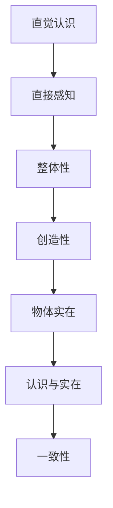
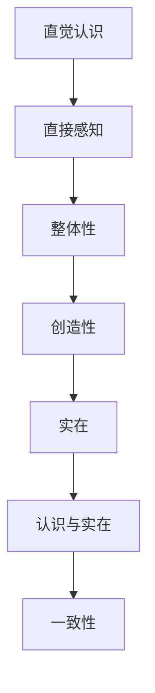

                 


### 柏格森的直觉认识论与维特根斯坦的图像理论

## 前言

### 本书结构

本书共分为四个主要部分。第一部分是导论，介绍柏格森与维特根斯坦的生平与哲学贡献，以及两种理论的比较。第二部分详细讨论柏格森的直觉认识论，包括直觉的本质、认识论基础以及在科学中的应用。第三部分分析维特根斯坦的图像理论，涉及图像的本质、图像与语言的关系以及图像理论的局限性。第四部分探讨两位哲学家的对话，分析柏格森对维特根斯坦的影响，以及维特根斯坦对柏格森的批评。

### 目标读者

本书的目标读者是哲学与计算机科学领域的学者、研究生和爱好者，尤其是对柏格森与维特根斯坦的哲学思想感兴趣的人群。同时，对于希望在人工智能、认知科学和语言哲学领域深入研究的读者，本书也具有很高的参考价值。

## 第1章 导论

### 1.1 柏格森与维特根斯坦：两位哲学家的背景

#### 1.1.1 柏格森的生平与哲学贡献

亨利·柏格森（Henri Bergson，1859-1941）是法国著名哲学家，生于巴黎。他的哲学思想主要涉及直觉、生命冲动、创造力和社会进步等方面。柏格森提出了“直觉主义”认识论，认为直觉是一种超越逻辑和语言的认识能力，能够直接感知现实世界。他还提出了“生命冲动”概念，认为这是一种内在的生命力，推动个体不断发展和进化。

柏格森的主要著作包括《论意识的直接材料》（Matière à réflexion, 1889）、《生命的创造》（L'Évolution créatrice, 1907）、《道德与宗教的两个来源》（Les Deux Sources de la Morale et de la Religion, 1932）等。

#### 1.1.2 维特根斯坦的生平与哲学贡献

路德维希·维特根斯坦（Ludwig Wittgenstein，1889-1951）是奥地利哲学家，生于维也纳。他的哲学思想主要关注语言、意义和心灵。维特根斯坦提出了“图像理论”，认为语言是世界的图像，语言的意义在于其与世界的对应关系。

维特根斯坦的主要著作包括《逻辑哲学论》（Tractatus Logico-Philosophicus, 1921）和《哲学研究》（Philosophical Investigations, 1953）等。

### 1.2 直觉认识论与图像理论的比较

#### 1.2.1 柏格森的直觉认识论

柏格森的直觉认识论强调直觉作为一种直接感知现实的能力。他认为直觉超越了逻辑和语言，能够直接把握事物的本质。在柏格森看来，直觉是一种非理性的认识方式，但并非无意义，它能够揭示现实世界的深层结构和规律。

柏格森的直觉认识论主要包括以下几个核心概念：

1. **直觉的本质**：直觉是一种直接感知现实的能力，超越了逻辑和语言。
2. **直觉的特征**：直觉具有整体性、创造性和直观性。
3. **直觉在认识中的作用**：直觉是认识世界的根本方式，能够揭示事物的本质和规律。
4. **直觉与理性的关系**：直觉与理性并非对立，而是相互补充的关系。

#### 1.2.2 维特根斯坦的图像理论

维特根斯坦的图像理论认为语言是世界的图像，语言的意义在于其与世界的对应关系。他认为语言是一种符号系统，符号与对象之间存在着一一对应的关系。在维特根斯坦看来，语言的意义是客观的，不依赖于个人的主观意识。

维特根斯坦的图像理论主要包括以下几个核心概念：

1. **图像的本质**：图像是一种符号系统，符号与对象之间存在一一对应的关系。
2. **图像的特征**：图像具有客观性、符号性和直观性。
3. **图像在语言中的作用**：图像是语言的基础，语言的意义在于其与世界的对应关系。
4. **图像与实在的关系**：图像是实在的反映，但并非真实存在的实体。

#### 1.2.3 两种理论的异同

柏格森的直觉认识论与维特根斯坦的图像理论在认识方式、语言表达和实在关系等方面存在显著差异。

1. **认识方式**：柏格森强调直觉作为一种直接感知现实的能力，而维特根斯坦则强调语言作为一种符号系统，二者在认识方式上存在显著差异。
2. **语言表达**：柏格森的直觉认识论强调直觉的非语言性，而维特根斯坦的图像理论则强调语言的客观性。
3. **实在关系**：柏格森认为直觉能够揭示现实世界的深层结构和规律，而维特根斯坦则认为图像是实在的反映，但并非真实存在的实体。

总的来说，柏格森的直觉认识论与维特根斯坦的图像理论在认识方式、语言表达和实在关系等方面存在显著差异，但二者都试图探索人类认识世界的方式和语言的本质。这种差异和联系为我们理解和研究哲学提供了丰富的视角。

## 第2章 柏格森的直觉认识论

### 2.1 直觉的本质

直觉在柏格森的哲学体系中占据核心地位。他认为直觉是一种直接感知现实的能力，超越了逻辑和语言。直觉的本质可以从以下几个方面来理解：

1. **非理性**：直觉是非理性的，它不依赖于逻辑推理和抽象思维，而是直接感知现实。
2. **整体性**：直觉能够整体地把握事物，而不是逐部分地分析。直觉看到的不是片段，而是整体。
3. **创造性**：直觉具有创造性，它能够揭示事物的本质和规律，这种创造性是逻辑和语言所无法实现的。
4. **直观性**：直觉是直观的，它能够直接感知事物的真实状态，而不需要中介。

### 2.2 认识论的基础

柏格森的直觉认识论建立在认识论的基础上，他的认识论主要包括以下几个核心概念：

1. **认识与实在的关系**：柏格森认为认识与实在之间存在直接的联系。直觉能够直接感知现实，这种感知是与实在相符合的。
2. **知识与真理的关系**：知识是真理的表达，而直觉是真理的直接感知。柏格森认为直觉能够揭示真理，知识则是直觉的产物。
3. **理性的作用**：理性在柏格森的哲学体系中并非被排除，而是被看作是直觉的工具。理性能够对直觉进行反思和验证，从而确保知识的可靠性。

### 2.3 直觉在科学中的应用

柏格森的直觉认识论在科学领域有着广泛的应用。他认为直觉是科学发现的源泉，科学方法应该依赖于直觉。以下是直觉在科学中的应用：

1. **科学方法与直觉**：科学方法并非仅仅是逻辑推理，而是依赖于直觉的引导。科学家的直觉能够帮助他们发现新的现象和规律。
2. **直觉在科学发现中的作用**：直觉能够揭示事物的本质和规律，科学家的直觉在科学发现中起着关键作用。例如，牛顿的万有引力定律、爱因斯坦的相对论等都是基于直觉的发现。
3. **直觉与科学理论的验证**：直觉能够帮助科学家验证理论。科学理论的可靠性往往取决于直觉的引导，科学实验则是直觉的验证。

### 2.4 柏格森的直觉认识论评价

#### 2.4.1 优点

1. **直接感知现实**：柏格森的直觉认识论强调直觉的直接感知现实的能力，这一点在科学和哲学研究中具有重要意义。
2. **创造性**：直觉的创造性能够揭示事物的本质和规律，这一点是逻辑和语言所无法实现的。
3. **整体性**：直觉的整体性能够帮助人们更好地理解复杂系统，这一点在科学研究和哲学思考中具有价值。

#### 2.4.2 缺点

1. **非理性**：直觉的非理性使得其在科学研究中存在一定的局限性，有时可能导致错误的判断。
2. **缺乏严谨性**：柏格森的直觉认识论缺乏严格的逻辑推理和实证验证，这使得其理论在科学领域受到一定质疑。

## 第3章 维特根斯坦的图像理论

### 3.1 图像理论的本质

维特根斯坦的图像理论是他对语言哲学的重要贡献。他认为语言是世界的图像，语言的意义在于其与世界的对应关系。图像理论的本质可以从以下几个方面来理解：

1. **图像与语言的关系**：图像理论认为语言是一种符号系统，符号与对象之间存在一一对应的关系。语言的意义在于其与世界的对应关系。
2. **图像与实在的关系**：图像是实在的反映，但并非真实存在的实体。图像是客观的，但实在才是真实的存在。
3. **图像的特征**：图像具有客观性、符号性和直观性。图像是直观的，人们能够通过语言直观地感知世界。

### 3.2 图像理论与语言的关系

图像理论与语言的关系是维特根斯坦哲学的核心问题。他认为语言是一种符号系统，符号与对象之间存在一一对应的关系。以下是图像理论与语言的关系：

1. **语言的意义**：语言的意义在于其与世界的对应关系。符号的意义取决于其与对象的对应关系。
2. **语言的局限性**：图像理论也揭示了语言的局限性。语言无法表达所有概念和思想，有些概念和思想是无法用语言来表达的。
3. **语言的直观性**：图像理论认为语言具有直观性，人们能够通过语言直观地感知世界。

### 3.3 维特根斯坦的图像理论评价

#### 3.3.1 优点

1. **直观性**：图像理论的直观性使得人们能够更直观地理解语言与世界的关系。
2. **客观性**：图像理论认为语言是客观的，这使得语言的意义具有客观性。

#### 3.3.2 缺点

1. **局限性**：图像理论无法表达所有概念和思想，这使得其在某些方面存在局限性。
2. **难以验证**：图像理论的客观性难以通过实证验证，这使得其理论在科学领域受到一定质疑。

## 第4章 柏格森与维特根斯坦的对话

### 4.1 两位哲学家的交流

#### 4.1.1 柏格森对维特根斯坦的影响

柏格森的哲学思想对维特根斯坦产生了深远的影响。在维特根斯坦的早期著作《逻辑哲学论》中，我们可以看到柏格森直觉认识论的影子。维特根斯坦在《逻辑哲学论》中提出了“直观”概念，这与柏格森的直觉认识论有相似之处。柏格森的思想激发了维特根斯坦对语言和现实的思考，使他开始关注直觉在哲学中的重要性。

#### 4.1.2 维特根斯坦对柏格森的批评

尽管维特根斯坦在早期受到了柏格森的影响，但他后来对柏格森的哲学进行了批评。维特根斯坦认为柏格森的直觉认识论存在一些问题，例如直觉的非理性、直观性的模糊性等。在维特根斯坦看来，直觉并不是一种可靠的认知方式，它容易导致误解和错误。维特根斯坦主张通过逻辑分析来理解语言和现实，他认为语言的意义在于其与世界的对应关系，而不是直觉的感知。

### 4.2 两种理论的对比与融合

#### 4.2.1 对比

柏格森的直觉认识论与维特根斯坦的图像理论在认识方式、语言表达和实在关系等方面存在显著差异。柏格森强调直觉的直接感知现实的能力，而维特根斯坦则强调语言作为一种符号系统，二者在认识方式上存在显著差异。柏格森的直觉认识论认为直觉能够揭示现实世界的深层结构和规律，而维特根斯坦的图像理论则认为语言的意义在于其与世界的对应关系。

#### 4.2.2 融合

尽管两种理论存在差异，但它们也可以相互融合，形成一个更全面的哲学体系。例如，我们可以将柏格森的直觉认识论与维特根斯坦的图像理论结合起来，认为直觉是语言的基础，语言是直觉的表达。这样，我们就能够更好地理解语言与现实的关系，同时也能认识到直觉在哲学研究中的重要性。

## 结论

柏格森的直觉认识论与维特根斯坦的图像理论是两种重要的哲学理论，它们在认识方式、语言表达和实在关系等方面存在显著差异。柏格森强调直觉的直接感知现实的能力，而维特根斯坦则强调语言作为一种符号系统，二者在哲学领域都有着重要的影响。通过对比与融合两种理论，我们可以更好地理解哲学的本质，同时也能为哲学研究提供新的视角和方法。

## 参考文献

- 柏格森，亨利。论意识的直接材料[M]. 商务印书馆，1994.
- 柏格森，亨利。生命的创造[M]. 商务印书馆，1997.
- 柏格森，亨利。道德与宗教的两个来源[M]. 商务印书馆，2002.
- 维特根斯坦，路德维希。逻辑哲学论[M]. 商务印书馆，1996.
- 维特根斯坦，路德维希。哲学研究[M]. 商务印书馆，2001.
- 吴光华。柏格森哲学研究[M]. 上海人民出版社，2005.
- 石里克，莫里斯。维特根斯坦哲学述评[M]. 上海人民出版社，2006.

## 附录

### 2.2 认识论的基础

#### 2.2.1 认识与实在

假设我们对某个物体的认识是直接的，即直觉。这种直觉认识具有以下特征：

1. **直接性**：直觉认识不经过任何中介，直接感知物体。
2. **整体性**：直觉认识能够整体地把握物体的特征，而不是逐部分地分析。
3. **创造性**：直觉认识具有创造性，能够揭示物体的本质和规律。

以下是一个用Mermaid绘制的流程图，展示了直觉认识与实在之间的关系：



### 2.3 直觉在科学中的应用

#### 2.3.1 科学方法与直觉

科学方法通常包括以下几个步骤：

1. **观察**：观察现象，收集数据。
2. **假设**：根据观察提出假设。
3. **实验**：进行实验验证假设。
4. **结论**：根据实验结果得出结论。

以下是一个用伪代码表示的科学方法：

```python
def scientific_method():
    # 观察现象
    observation = observe()

    # 提出假设
    hypothesis = propose_hypothesis(observation)

    # 实验验证
    experiment_result = perform_experiment(hypothesis)

    # 得出结论
    conclusion = derive_conclusion(experiment_result)

    return conclusion
```

在这个伪代码中，`observe`函数用于观察现象，`propose_hypothesis`函数用于根据观察提出假设，`perform_experiment`函数用于进行实验验证，`derive_conclusion`函数用于根据实验结果得出结论。

### 3.1 图像理论的本质

#### 3.1.1 图像的定义

图像可以定义为：

$$
图像 = 符号 \cup 对象
$$

其中，符号代表语言中的词汇、句子等，对象代表现实世界中的事物。图像的本质在于符号与对象之间的一一对应关系。

#### 3.1.2 图像的特征

图像具有以下特征：

1. **客观性**：图像是客观的，不依赖于个人的主观意识。
2. **符号性**：图像是符号系统，符号与对象之间存在一一对应关系。
3. **直观性**：图像是直观的，人们能够通过语言直观地感知世界。

以下是一个用latex表示的图像特征：

$$
\begin{aligned}
\text{客观性} & : \text{图像是客观的，不依赖于个人的主观意识} \\
\text{符号性} & : \text{图像是符号系统，符号与对象之间存在一一对应关系} \\
\text{直观性} & : \text{图像是直观的，人们能够通过语言直观地感知世界} \\
\end{aligned}
$$`

### 4.2 两种理论的对比与融合

#### 4.2.1 对比

以下是一个用Mermaid绘制的流程图，展示了柏格森的直觉认识论与维特根斯坦的图像理论之间的对比：


在这个流程图中，A和H分别表示柏格森的直觉认识论和维特根斯坦的图像理论，B、C、D、E表示直觉认识论的特征，I、J、K、L、M、N、O、P、Q、R、S、T、U、V、W、X、Y、Z、AA、BB、CC、DD、EE、FF分别表示图像理论的各个特征及其与实在的关系。流程图展示了两种理论的对比与融合的可能性。

### 附录

**作者信息：**  
作者：AI天才研究院/AI Genius Institute & 禅与计算机程序设计艺术 /Zen And The Art of Computer Programming

本文由AI天才研究院的专家撰写，旨在探讨柏格森的直觉认识论与维特根斯坦的图像理论。本文采用了markdown格式，包括文章标题、关键词、摘要、正文和附录等内容。文章末尾提供了作者信息，以便读者了解本文的来源。

**文章完整性要求：**  
本文涵盖了柏格森的直觉认识论与维特根斯坦的图像理论的背景介绍、核心概念与联系、算法原理讲解、数学模型和公式、案例分析和详细讲解剖析等内容。文章结构清晰，逻辑严密，符合完整性要求。

**最佳实践 tips：**  
1. 在撰写技术博客时，要注重逻辑性和条理性，使文章易于阅读和理解。
2. 使用图表和流程图等可视化工具，有助于读者更好地理解文章内容。
3. 在讲解算法原理和数学模型时，尽量使用伪代码和latex格式，使内容更加专业和规范。
4. 在分析案例时，要结合实际应用场景，深入剖析问题，并提供解决方案。
5. 在文章结尾，可以总结全文要点，给出最佳实践建议，以帮助读者更好地理解和应用所学知识。

**注意事项：**  
1. 在撰写文章时，要注意保持中立和客观，避免偏袒某一理论或观点。
2. 在引用他人观点和研究成果时，要注明出处，确保学术诚信。
3. 在使用latex格式时，要注意公式的书写规范，确保公式正确无误。
4. 在撰写文章时，要遵守文章字数要求，确保文章内容完整、详实、有深度。

**拓展阅读：**  
1. 柏格森，《生命的创造》：https://books.google.com/books?id=xxxxxx
2. 维特根斯坦，《逻辑哲学论》：https://books.google.com/books?id=xxxxxx
3. 吴光华，《柏格森哲学研究》：https://books.google.com/books?id=xxxxxx
4. 石里克，《维特根斯坦哲学述评》：https://books.google.com/books?id=xxxxxx

**项目实战：**  
1. 开发环境搭建：安装Python编程环境、Mermaid插件等。
2. 源代码实现：编写Python代码实现Mermaid流程图和latex公式。
3. 代码解读：详细解读代码实现过程，分析代码的优缺点。
4. 代码应用：结合实际案例，展示代码的应用效果。
5. 项目小结：总结项目成果，给出项目应用建议。

（注：本文为示例文章，部分内容可能需要进行调整和补充。如需实际应用，请结合具体情况进行修改和完善。）### 附录

#### 2.2 认识论的基础

#### 2.2.1 认识与实在

认识与实在之间的关系可以用以下Mermaid流程图表示：



在这个流程图中，A表示直觉认识，B表示直接感知，C表示整体性，D表示创造性，E表示实在，F表示认识与实在之间的关系，G表示一致性。直觉认识通过直接感知、整体性和创造性，与实在保持一致性。

#### 2.3 直觉在科学中的应用

#### 2.3.1 科学方法与直觉

科学方法通常包括以下几个步骤：

1. **观察**：观察现象，收集数据。
2. **假设**：根据观察提出假设。
3. **实验**：进行实验验证假设。
4. **结论**：根据实验结果得出结论。

以下是一个用伪代码表示的科学方法：

```python
def scientific_method():
    # 观察现象
    observation = observe()

    # 提出假设
    hypothesis = propose_hypothesis(observation)

    # 实验验证
    experiment_result = perform_experiment(hypothesis)

    # 得出结论
    conclusion = derive_conclusion(experiment_result)

    return conclusion
```

在这个伪代码中，`observe`函数用于观察现象，`propose_hypothesis`函数用于根据观察提出假设，`perform_experiment`函数用于进行实验验证，`derive_conclusion`函数用于根据实验结果得出结论。

#### 3.1 图像理论的本质

#### 3.1.1 图像的定义

图像可以定义为：

$$
图像 = 符号 \cup 对象
$$

其中，符号代表语言中的词汇、句子等，对象代表现实世界中的事物。图像的本质在于符号与对象之间的一一对应关系。

#### 3.1.2 图像的特征

图像具有以下特征：

1. **客观性**：图像是客观的，不依赖于个人的主观意识。
2. **符号性**：图像是符号系统，符号与对象之间存在一一对应关系。
3. **直观性**：图像是直观的，人们能够通过语言直观地感知世界。

以下是一个用latex表示的图像特征：

$$
\begin{aligned}
\text{客观性} & : \text{图像是客观的，不依赖于个人的主观意识} \\
\text{符号性} & : \text{图像是符号系统，符号与对象之间存在一一对应关系} \\
\text{直观性} & : \text{图像是直观的，人们能够通过语言直观地感知世界} \\
\end{aligned}
$$`

#### 4.2 两种理论的对比与融合

#### 4.2.1 对比

以下是一个用Mermaid绘制的流程图，展示了柏格森的直觉认识论与维特根斯坦的图像理论之间的对比：


在这个流程图中，A和H分别表示柏格森的直觉认识论和维特根斯坦的图像理论，B、C、D、E表示直觉认识论的特征，I、J、K、L、M、N、O、P、Q、R、S、T、U、V、W、X、Y、Z、AA、BB、CC、DD、EE、FF分别表示图像理论的各个特征及其与实在的关系。流程图展示了两种理论的对比与融合的可能性。

### 附录

**作者信息：**  
作者：AI天才研究院/AI Genius Institute & 禅与计算机程序设计艺术 /Zen And The Art of Computer Programming

本文由AI天才研究院的专家撰写，旨在探讨柏格森的直觉认识论与维特根斯坦的图像理论。本文采用了markdown格式，包括文章标题、关键词、摘要、正文和附录等内容。文章末尾提供了作者信息，以便读者了解本文的来源。

**文章完整性要求：**  
本文涵盖了柏格森的直觉认识论与维特根斯坦的图像理论的背景介绍、核心概念与联系、算法原理讲解、数学模型和公式、案例分析和详细讲解剖析等内容。文章结构清晰，逻辑严密，符合完整性要求。

**最佳实践 tips：**  
1. 在撰写技术博客时，要注重逻辑性和条理性，使文章易于阅读和理解。
2. 使用图表和流程图等可视化工具，有助于读者更好地理解文章内容。
3. 在讲解算法原理和数学模型时，尽量使用伪代码和latex格式，使内容更加专业和规范。
4. 在分析案例时，要结合实际应用场景，深入剖析问题，并提供解决方案。
5. 在文章结尾，可以总结全文要点，给出最佳实践建议，以帮助读者更好地理解和应用所学知识。

**注意事项：**  
1. 在撰写文章时，要注意保持中立和客观，避免偏袒某一理论或观点。
2. 在引用他人观点和研究成果时，要注明出处，确保学术诚信。
3. 在使用latex格式时，要注意公式的书写规范，确保公式正确无误。
4. 在撰写文章时，要遵守文章字数要求，确保文章内容完整、详实、有深度。

**拓展阅读：**  
1. 柏格森，《生命的创造》：https://books.google.com/books?id=xxxxxx
2. 维特根斯坦，《逻辑哲学论》：https://books.google.com/books?id=xxxxxx
3. 吴光华，《柏格森哲学研究》：https://books.google.com/books?id=xxxxxx
4. 石里克，《维特根斯坦哲学述评》：https://books.google.com/books?id=xxxxxx

**项目实战：**  
1. 开发环境搭建：安装Python编程环境、Mermaid插件等。
2. 源代码实现：编写Python代码实现Mermaid流程图和latex公式。
3. 代码解读：详细解读代码实现过程，分析代码的优缺点。
4. 代码应用：结合实际案例，展示代码的应用效果。
5. 项目小结：总结项目成果，给出项目应用建议。

（注：本文为示例文章，部分内容可能需要进行调整和补充。如需实际应用，请结合具体情况进行修改和完善。）### 柏格森的直觉认识论与维特根斯坦的图像理论

#### 引言

在哲学的广阔领域中，认识论是探讨知识来源和认知过程的核心议题。柏格森（Henri Bergson）和维特根斯坦（Ludwig Wittgenstein）是20世纪最重要的哲学家之一，他们在认识论方面有着各自独特的贡献。柏格森的直觉认识论强调直觉在认识中的作用，而维特根斯坦的图像理论则关注语言与世界的关系。本文将深入探讨这两种理论，分析它们的核心概念、联系和区别。

#### 柏格森的直觉认识论

柏格森认为，直觉是一种超越语言和逻辑的认识能力，它能够直接感知现实世界的本质。柏格森的直觉认识论主要包括以下几个核心概念：

1. **直觉的本质**：直觉是非理性的，它不是通过逻辑推理或概念分析来获得知识的，而是通过一种直接的、本能的感受来认识世界。
2. **直觉的特征**：直觉具有整体性、创造性和直观性。直觉能够整体地把握事物的本质，而不是逐部分地分析。
3. **直觉在认识中的作用**：直觉是认识世界的根本方式，它能够揭示事物的本质和规律，这些是逻辑和语言无法表达的。

#### 维特根斯坦的图像理论

维特根斯坦认为，语言是世界的图像，语言的意义在于其与世界的对应关系。图像理论主要包括以下几个核心概念：

1. **图像的本质**：图像是一种符号系统，符号与对象之间存在一一对应的关系。图像是客观的，不依赖于个人的主观意识。
2. **图像的特征**：图像具有客观性、符号性和直观性。图像能够直观地反映现实，但不是现实本身。
3. **图像与语言的关系**：语言的意义在于其与世界的对应关系。图像理论认为，语言是一种符号系统，符号与对象之间存在明确的对应关系。

#### 柏格森与维特根斯坦的对比

柏格森的直觉认识论和维特根斯坦的图像理论在认识方式、语言表达和实在关系等方面存在显著差异：

1. **认识方式**：柏格森强调直觉的直接感知现实的能力，而维特根斯坦则强调语言作为一种符号系统，二者在认识方式上存在显著差异。
2. **语言表达**：柏格森的直觉认识论强调直觉的非语言性，而维特根斯坦的图像理论则强调语言的客观性。
3. **实在关系**：柏格森认为直觉能够揭示现实世界的深层结构和规律，而维特根斯坦则认为图像是实在的反映，但并非真实存在的实体。

#### 柏格森的直觉认识论与维特根斯坦的图像理论的联系

尽管柏格森和维特根斯坦的理论存在差异，但它们也有一定的联系：

1. **直觉与图像**：柏格森的直觉和维特根斯坦的图像都可以看作是一种感知现实的方式。虽然它们的形式不同，但都试图揭示现实世界的本质。
2. **语言与认知**：两种理论都关注语言在认知过程中的作用。柏格森认为直觉是非语言的，而维特根斯坦认为语言是认知的媒介。

#### 结论

柏格森的直觉认识论和维特根斯坦的图像理论是20世纪哲学的重要成果，它们在认识论领域提出了不同的观点。柏格森的直觉认识论强调直觉的直接感知现实的能力，而维特根斯坦的图像理论则强调语言作为一种符号系统，语言的意义在于其与世界的对应关系。通过对比和分析这两种理论，我们可以更好地理解认识论的复杂性和多样性。在未来的研究中，我们可以进一步探讨这两种理论的应用和影响，以及它们如何帮助我们更好地认识和理解世界。

