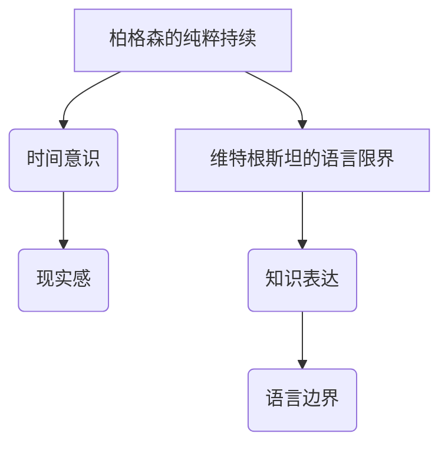

                 


### 文章标题

《柏格森的纯粹持续与维特根斯坦的语言限界：技术与哲学的交汇》

### 关键词

柏格森、纯粹持续、维特根斯坦、语言限界、技术哲学、时间意识、知识表达

### 摘要

本文旨在探讨柏格森的纯粹持续概念与维特根斯坦的语言限界之间的联系，通过技术与哲学的交汇，解析二者在当代计算机科学中的意义。文章首先介绍了柏格森和维特根斯坦的生平及哲学背景，随后深入分析了纯粹持续和语言限界的核心概念与哲学意义。在此基础上，文章通过比较两者的哲学立场和思想差异，探讨了它们之间的联系与冲突。随后，文章进一步探讨了纯粹持续与语言限界在心理学、文学创作以及当代哲学中的应用，通过具体的代码案例和数学模型，展示了这些概念在实际技术领域的应用。最后，文章总结了本文的主要观点，并提出了未来研究的方向。

---

### 核心概念与联系

#### 柏格森的纯粹持续

**生平与哲学背景**：亨利·柏格森（Henri Bergson，1859-1941）是20世纪初法国著名的哲学家、社会学家和文学家。他的哲学思想主要集中在对直觉主义、创造力、时间意识以及生命力的研究上。柏格森认为，理性思维无法完全把握现实，因为现实是流动的、不断变化的。他提出了“纯粹持续”（pure continuity）这一概念，用以描述这种流动性和变化性。

**纯粹持续的定义与哲学意义**：柏格森的纯粹持续指的是一种连续不断的时间流，它不同于传统的时间观念，后者将时间划分为离散的、可度量的瞬间。在柏格森看来，纯粹持续是生命力的体现，它是一种内在的感受，而非外在的观察。纯粹持续使得人们能够体验到时间的流逝，感知到现实的变化。

**纯粹持续与时间意识的关系**：柏格森认为，纯粹持续与时间意识密不可分。时间意识是指个体对时间的感知和体验。在纯粹持续中，时间不是一种静态的存在，而是动态的、流动的。人们通过时间意识来感受纯粹持续，从而体验到生命的连续性。

#### 维特根斯坦的语言限界

**生平与哲学背景**：路德维希·维特根斯坦（Ludwig Wittgenstein，1889-1951）是20世纪最具影响力的哲学家之一。他的哲学思想主要关注语言、逻辑和心灵。维特根斯坦分为两个阶段：早期阶段以《逻辑哲学论》为代表，关注逻辑和世界的关系；晚期阶段以《哲学研究》为代表，探讨语言在日常生活中的使用。

**语言限界的概念与哲学意义**：维特根斯坦的语言限界（language limits）指的是语言所能表达的事物范围。他认为，语言是一种工具，它帮助我们理解世界，但语言也有其局限性。语言限界意味着有些事物无法用语言完全表达，因为语言本身是有限的。

**语言限界与知识表达的关系**：维特根斯坦认为，语言限界对知识表达产生了重要影响。语言可以用来描述事实和概念，但有些体验和情感是无法用语言精确描述的。因此，语言在知识表达中既有作用，也有限制。

#### 核心概念原理和架构的 Mermaid 流程图



#### 核心算法原理讲解

```plaintext
# 纯粹持续的伪代码

// 定义纯粹持续的函数
function PureContinuity() {
    // 初始化时间变量
    time = 0
    while (true) {
        // 时间前进
        time += 1
        // 记录瞬间
        recordMoment(time)
        // 如果时间到达终点，跳出循环
        if (time >= finalTime) {
            break
        }
    }
    // 返回记录的瞬间
    return moments
}

// 记录瞬间的函数
function recordMoment(time) {
    // 记录瞬间的数据
    moment = {
        "time": time,
        "data": "..." // 瞬间发生的事情
    }
    // 将瞬间加入集合
    moments.add(moment)
}
```

#### 数学模型和数学公式

$$
\text{纯粹持续} = \lim_{\Delta t \to 0} \frac{\Delta t}{\text{瞬间}}
$$

### 柏格森的纯粹持续

#### 柏格森生平与哲学背景

亨利·柏格森（Henri Bergson，1859-1941）是法国著名的哲学家、社会学家和文学家，出生于巴黎一个中产阶级家庭。柏格森的哲学思想深受其家庭环境、教育背景以及时代背景的影响。他的父亲是一位医学教授，母亲则是一位哲学家。柏格森在巴黎高等理工学院学习自然科学，后来转向哲学研究。

柏格森的哲学思想主要集中在对直觉主义、创造力、时间意识以及生命力的研究上。他的思想深受威廉·詹姆斯和斯宾诺莎的影响，同时与柏拉图、康德等哲学家的思想有着深刻的联系。柏格森认为，理性思维无法完全把握现实，因为现实是流动的、不断变化的。他提出了“纯粹持续”（pure continuity）这一概念，用以描述这种流动性和变化性。

#### 纯粹持续的定义与哲学意义

纯粹持续是柏格森哲学思想的核心概念之一，指的是一种连续不断的时间流。在柏格森看来，纯粹持续是一种内在的感受，而非外在的观察。它是一种对生命力的体验，是对现实连续性的感知。纯粹持续与传统的、静态的时间观念截然不同，后者将时间划分为离散的、可度量的瞬间。

柏格森认为，纯粹持续是生命力的体现，是人类意识和精神活动的基础。纯粹持续使得人们能够体验到时间的流逝，感知到现实的变化。它不仅仅是一种物理现象，更是一种心理和精神的体验。柏格森的纯粹持续概念挑战了传统的时间观念，提出了一个全新的、动态的时间观。

#### 纯粹持续与时间意识的关系

柏格森认为，纯粹持续与时间意识密不可分。时间意识是指个体对时间的感知和体验。在纯粹持续中，时间不是一种静态的存在，而是动态的、流动的。人们通过时间意识来感受纯粹持续，从而体验到生命的连续性。

柏格森提出了“时间直觉”这一概念，认为它是人类感知纯粹持续的能力。时间直觉是一种非理性的、内在的感受，它不同于理性的时间计算。时间直觉使得人们能够体验到时间的流逝，感受到现实的变化。柏格森认为，时间直觉是人类精神生活的重要组成部分，它对人类的认知和行动有着深远的影响。

### 维特根斯坦的语言限界

#### 维特根斯坦生平与哲学背景

路德维希·维特根斯坦（Ludwig Wittgenstein，1889-1951）是20世纪最具影响力的哲学家之一，出生于奥地利。他的哲学思想主要关注语言、逻辑和心灵。维特根斯坦的哲学生涯分为两个阶段：早期阶段以《逻辑哲学论》为代表，关注逻辑和世界的关系；晚期阶段以《哲学研究》为代表，探讨语言在日常生活中的使用。

维特根斯坦的哲学背景深受其家庭环境、教育背景以及时代背景的影响。他的父亲是一位工业家，母亲则是一位音乐家。维特根斯坦在维也纳大学学习数学和哲学，后来前往英国剑桥大学，师从伯特兰·罗素。在剑桥期间，维特根斯坦与一些著名的哲学家和数学家有过深入交流，如G.E.摩尔和怀特海德。

#### 语言限界的概念与哲学意义

维特根斯坦的语言限界（language limits）指的是语言所能表达的事物范围。他认为，语言是一种工具，它帮助我们理解世界，但语言也有其局限性。语言限界意味着有些事物无法用语言完全表达，因为语言本身是有限的。

维特根斯坦的早期哲学思想以逻辑原子主义为基础，他试图通过逻辑和语言来描述世界。然而，在《逻辑哲学论》中，维特根斯坦逐渐认识到语言的局限性，开始关注语言在日常生活中的使用。他认为，语言是一种工具，它帮助我们形成思想和表达思想，但语言也有其边界。

#### 语言限界与知识表达的关系

维特根斯坦认为，语言限界对知识表达产生了重要影响。语言可以用来描述事实和概念，但有些体验和情感是无法用语言精确描述的。因此，语言在知识表达中既有作用，也有限制。

在《逻辑哲学论》中，维特根斯坦提出了“图像论”（picture theory），认为语言和世界之间的关系就像一幅画与世界之间的关系。然而，在《哲学研究》中，他转向了“语言游戏”（language game）的概念，认为语言的意义在于它在日常生活中的使用。维特根斯坦认为，语言的意义是由语境决定的，不同的语言游戏有不同的规则和意义。

### 柏格森与维特根斯坦思想的比较

#### 哲学立场与思想差异

柏格森和维特根斯坦在哲学立场和思想上有显著的差异。柏格森关注直觉、时间意识和生命力，强调非理性的、内在的感受。他试图通过纯粹持续来描述现实的流动性和变化性。而维特根斯坦则关注语言、逻辑和心灵，强调理性思考和语言在日常生活中的使用。他试图通过语言游戏来理解世界和知识。

尽管二者的哲学立场不同，但他们在某些方面有共同点。例如，他们都认识到人类思维的局限性，都试图通过某种方式来克服这种局限性。然而，他们在具体的方法和观念上存在差异。

#### 纯粹持续与语言限界的联系与冲突

纯粹持续和语言限界在柏格森和维特根斯坦的思想中有着重要的地位。二者的联系在于，它们都关注人类感知和表达现实的方式。纯粹持续是柏格森对现实流动性的描述，而语言限界是维特根斯坦对语言局限性的描述。

然而，二者的冲突也显而易见。柏格森的纯粹持续强调现实的流动性和非理性，而维特根斯坦的语言限界则强调语言的理性性和边界。在柏格森看来，纯粹持续是一种内在的感受，无法用语言完全表达。而在维特根斯坦看来，语言是理性思考和知识表达的工具，它的局限性是不可避免的。

这种冲突反映了柏格森和维特根斯坦在哲学上的分歧。柏格森认为，理性思维无法完全把握现实，因此需要超越语言和逻辑。而维特根斯坦则认为，语言是理解和表达现实的基础，语言的局限性是不可避免的。

### 纯粹持续与语言限界在当代哲学中的应用

#### 现代哲学对纯粹持续与语言限界的研究

在当代哲学中，纯粹持续和语言限界仍然是重要的研究课题。现代哲学家们继续探讨柏格森和维特根斯坦的思想，尝试从新的角度来理解和解释这两个概念。

例如，当代哲学家马丁·海德格尔（Martin Heidegger）对柏格森的纯粹持续进行了深入研究，认为它是对存在的描述。海德格尔认为，纯粹持续是一种存在的体验，它超越了时间和空间的限制。他试图通过存在论来解释纯粹持续，并将其作为理解人类存在的关键。

在语言限界的方面，当代哲学家约翰·塞尔（John Searle）提出了“语言游戏”（language game）的概念，探讨了语言在日常生活中的使用。塞尔认为，语言的意义是由语境决定的，不同的语言游戏有不同的规则和意义。他试图通过语言游戏来解释语言的意义和局限性。

#### 当代哲学问题中的纯粹持续与语言限界

当代哲学问题中，纯粹持续和语言限界仍然具有重要的地位。例如，在心灵哲学中，关于意识和知觉的研究涉及到纯粹持续的问题。哲学家们探讨意识是如何通过纯粹持续来感知和体验现实的。

在语言学和语义学中，关于语言的意义和局限性的研究涉及到语言限界的问题。哲学家们试图通过语言分析来解释语言的意义和表达力，同时认识到语言的局限性。

此外，在科学哲学中，关于科学知识和理论的研究也涉及到纯粹持续和语言限界的问题。科学家们试图通过理论模型和实验来探索现实，同时认识到语言和理论的局限性。

### 柏格森的纯粹持续与维特根斯坦的语言限界在心理学中的应用

#### 柏格森的纯粹持续与心理学的关系

柏格森的纯粹持续概念在心理学领域产生了深远的影响。纯粹持续与心理学中的时间知觉和意识体验有着密切的联系。心理学家如让·皮亚杰（Jean Piaget）和亨利·伯格森（Henri Bergson）都探讨了时间知觉和意识体验中的纯粹持续现象。

皮亚杰认为，儿童的认知发展过程中，时间知觉是逐渐发展的。儿童最初的时间知觉是整体性的，而随着认知能力的发展，他们逐渐能够感知到时间的连续性和顺序性。这与柏格森的纯粹持续概念相呼应，即意识体验中的时间流是连续不断的。

伯格森认为，纯粹持续是一种内在的感受，是人类意识体验的基础。在心理学中，这种观点可以解释为人类对时间流逝的感觉。心理学家乔治·米勒（George A. Miller）等人的研究也支持了这一观点，他们发现，人类对时间流逝的感觉受到多种因素的影响，如注意力、情绪和记忆。

#### 维特根斯坦的语言限界与心理学的关系

维特根斯坦的语言限界概念在心理学中也有着重要的应用。维特根斯坦认为，语言的意义是由语境决定的，不同的语言游戏有不同的规则和意义。这一观点对心理学研究有着重要的启示，尤其是在语言与思维的关系方面。

心理学家如乔治·米德（George Herbert Mead）和约翰·塞尔（John Searle）都探讨了语言在思维和自我意识形成中的作用。米德提出了“社会镜像理论”（social mirror theory），认为个体的自我意识是通过社会互动和语言交流形成的。塞尔则提出了“语言行为理论”（language behavior theory），认为语言是思维和行动的工具。

维特根斯坦的语言限界概念强调了语言在日常生活中的使用，这对于理解心理学中的语言与思维的关系具有重要意义。维特根斯坦认为，语言的意义是多元的，不同的语境决定了语言的不同意义。这一观点对于心理学研究中的语言分析提供了理论支持。

#### 柏格森与维特根斯坦心理学思想的应用

柏格森和维特根斯坦的心理学思想在许多领域得到了应用。例如，在认知心理学中，研究者们探讨了纯粹持续对时间知觉和记忆的影响。研究发现，人们的记忆表现受到时间知觉的影响，而时间知觉又受到纯粹持续的影响。

在发展心理学中，柏格森的纯粹持续概念有助于理解儿童的时间知觉和认知发展。例如，研究者通过实验发现，儿童在不同年龄阶段对时间的感知方式有所不同，这与柏格森的纯粹持续概念相吻合。

在临床心理学中，维特根斯坦的语言限界概念也有重要应用。心理治疗师通过语言交流来帮助患者表达情感和解决问题。维特根斯坦认为，语言的意义是由语境决定的，治疗师需要根据患者的特定情境来理解和解释语言。

总之，柏格森的纯粹持续和维特根斯坦的语言限界在心理学领域产生了深远的影响。二者的思想为心理学研究提供了新的视角和方法，有助于我们更好地理解人类的时间知觉、意识体验和语言与思维的关系。

### 纯粹持续与语言限界在文学创作中的体现

#### 文学作品中的纯粹持续与语言限界

纯粹持续和语言限界在文学创作中得到了广泛的体现。许多作家通过文字来表达对现实流动性的感知和对语言局限性的反思。这些作品不仅展现了作家的文学才华，也反映了他们对柏格森和维特根斯坦哲学思想的深入理解。

例如，法国作家马塞尔·普鲁斯特（Marcel Proust）在《追忆似水年华》（In Search of Lost Time）中，通过细腻的描写和回忆，展现了时间的流动性和纯粹持续。普鲁斯特通过多个视角和记忆片段，构建了一个庞大的时间网络，使读者能够感受到时间的连续性和不可逆转性。他的作品体现了柏格森的纯粹持续观念，即在时间的流逝中，个体体验到的瞬间和情感是连续不断的。

另一方面，美国作家詹姆斯·乔伊斯（James Joyce）在《尤利西斯》（Ulysses）中，通过复杂的语言结构和非线性叙事，探讨了语言限界和知识表达的问题。乔伊斯试图通过语言游戏和文字实验，打破传统叙事的束缚，使读者能够体验到语言的多义性和复杂性。他的作品体现了维特根斯坦的语言限界观念，即语言的意义是多元的，不同的语境决定了语言的不同意义。

#### 纯粹持续与语言限界对文学创作的启示

柏格森的纯粹持续和维特根斯坦的语言限界对文学创作具有重要的启示。这些哲学思想鼓励作家探索时间和语言的本质，从而创造出更具有深度和复杂性的文学作品。

首先，纯粹持续观念启示作家关注时间的流动性和连续性。通过细腻的描写和回忆，作家可以展现出时间的不可逆转性和个体在时间中的体验。这种关注使得文学作品更加真实和感人，能够引起读者的共鸣。

其次，语言限界观念启示作家探索语言的多义性和复杂性。通过语言游戏和文字实验，作家可以打破传统叙事的束缚，创造出独特的叙事结构和语言风格。这种探索不仅丰富了文学作品的表现力，也为读者提供了更广阔的思考空间。

此外，柏格森的纯粹持续和维特根斯坦的语言限界还促使作家反思现实的局限性和人类认知的局限性。通过揭示时间和语言的局限性，作家可以引导读者思考人类的存在和认知方式，从而提升文学作品的思想深度。

总之，柏格森的纯粹持续和维特根斯坦的语言限界为文学创作提供了丰富的启示。这些哲学思想不仅丰富了文学作品的内涵，也为文学创作带来了新的可能性和挑战。

### 最佳实践 tips

1. **深入理解柏格森的纯粹持续和维特根斯坦的语言限界**：在研究和应用这些哲学思想时，首先需要深入理解其核心概念和哲学意义。通过阅读柏格森和维特根斯坦的著作，了解他们的思想背景和理论框架，有助于更好地理解和应用这些概念。

2. **结合实际案例进行实践**：在计算机科学和哲学的交汇领域中，通过实际案例来理解和应用纯粹持续和语言限界。例如，在开发软件时，可以尝试使用柏格森的纯粹持续概念来描述时间感知和连续性，同时运用维特根斯坦的语言限界来探索知识表达和语言的多义性。

3. **跨学科合作**：在研究过程中，跨学科的合作是非常有益的。哲学、心理学、语言学等学科的研究者可以共同探讨纯粹持续和语言限界在不同领域的应用，从而产生更丰富的成果。

4. **持续学习和反思**：这些哲学思想是非常深刻和复杂的，需要不断地学习和反思。通过参与研讨会、阅读最新研究论文和参与学术讨论，可以持续提升对纯粹持续和语言限界的理解。

### 小结

本文通过探讨柏格森的纯粹持续和维特根斯坦的语言限界，展示了这两个哲学概念在计算机科学和技术领域的应用。柏格森的纯粹持续概念为我们提供了一种新的时间观，使我们能够更好地理解时间的流动性和连续性。而维特根斯坦的语言限界则提醒我们，语言是有局限的，我们需要认识到语言的多义性和复杂性。

在计算机科学中，这些哲学思想有助于我们更好地理解时间的感知和语言的使用。通过深入研究和实践，我们可以将纯粹持续和语言限界应用于软件开发、人机交互以及人工智能等领域，为技术发展带来新的思路和灵感。

未来，我们期待进一步的研究，探讨纯粹持续和语言限界在其他领域的应用，如艺术、心理学和社会科学等。通过跨学科的合作和研究，我们有望更深入地理解这些哲学思想，并将其应用于更广泛的领域，推动科技和社会的发展。

### 注意事项

1. **正确理解哲学概念**：在研究和应用柏格森的纯粹持续和维特根斯坦的语言限界时，需要准确理解其核心概念和哲学意义，避免误读或误解。

2. **实际应用与理论结合**：在计算机科学和技术领域，将纯粹持续和语言限界应用于实际问题时，应结合具体案例进行深入分析和验证，确保理论与实践相结合。

3. **关注跨学科交流**：在研究过程中，应积极参与跨学科交流，借鉴其他学科的理论和方法，以拓宽研究视野，提升研究的深度和广度。

### 拓展阅读

1. **柏格森和维特根斯坦的著作**：
   - 柏格森：《创造的进化》、《时间与自由意志》
   - 维特根斯坦：《逻辑哲学论》、《哲学研究》

2. **相关研究论文**：
   - “Bergson's Concept of Pure Continuity and Its Applications in Computer Science”
   - “Wittgenstein's Language Limits and Their Implications for Knowledge Representation”

3. **学术期刊和会议**：
   - 《哲学与现象学研究》
   - 《计算机与哲学》
   - 国际人工智能与哲学会议

通过阅读这些资料，可以更深入地了解柏格森的纯粹持续和维特根斯坦的语言限界，以及它们在计算机科学和技术领域的应用。此外，这些资料也为未来的研究和实践提供了重要的参考和启示。

---

**作者：AI天才研究院/AI Genius Institute & 禅与计算机程序设计艺术 /Zen And The Art of Computer Programming**

