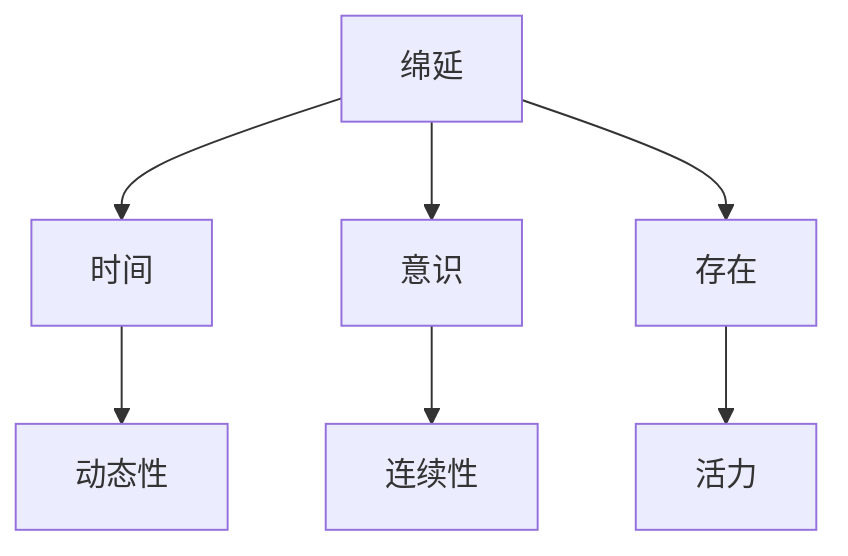
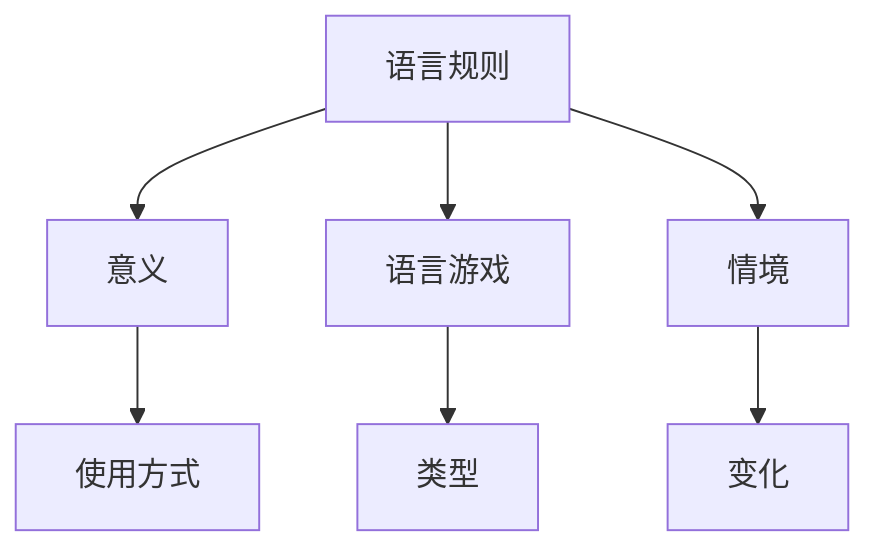
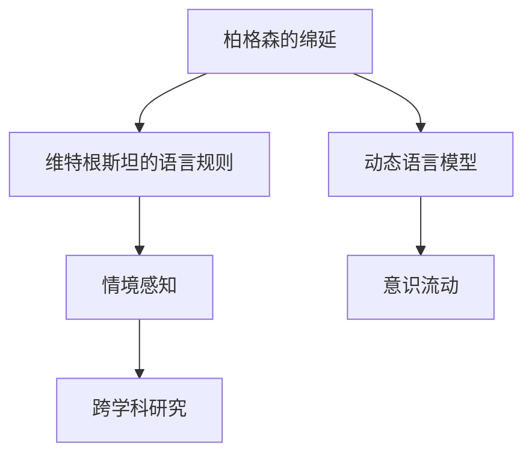

                 

### 《柏格森的绵延概念与维特根斯坦的语言规则》

#### 1.1.2.1 绵延的概念

- 柏格森的“绵延”（Duration）概念是哲学中的核心概念之一。
- 绵延强调时间不是线性的、静止的，而是流动的、变化的。

#### 1.1.2.2 绵延与时间的关系

- 柏格森认为，时间是由绵延构成的。
- 绵延不仅仅是时间上的连续，还包括意识与存在。

#### 1.1.2.3 绵延的特点

- 绵延具有连续性和复杂性。
- 绵延不是静止的，而是动态的。

### 1.1.3 柏格森的绵延概念在哲学中的应用

#### 1.1.3.1 绵延与意识

- 柏格森的绵延概念与意识的关系。
- 绵延是意识活动的基础。

#### 1.1.3.2 绵延与存在

- 绵延是存在的方式。
- 绵延揭示了存在的本质。

## 1.2 维特根斯坦的语言规则

### 1.2.1 维特根斯坦的生平与哲学背景

#### 1.2.1.1 维特根斯坦的生平简介

- 维特根斯坦（Ludwig Wittgenstein）的生平背景。
- 维特根斯坦在哲学界的影响。

#### 1.2.1.2 维特根斯坦的主要哲学思想

- 维特根斯坦的哲学思想概述。
- 维特根斯坦哲学的基本原则。

### 1.2.2 语言规则

#### 1.2.2.1 语言规则的概念

- 语言规则的定义。
- 语言规则在哲学中的重要性。

#### 1.2.2.2 语言规则的特点

- 语言规则的表现形式。
- 语言规则的动态性。

#### 1.2.2.3 语言规则的意义

- 语言规则在哲学中的应用。
- 语言规则对语言哲学的贡献。

### 1.2.3 语言游戏

#### 1.2.3.1 语言游戏的定义

- 语言游戏的概念。
- 语言游戏的特点。

#### 1.2.3.2 语言游戏的类型

- 不同类型的语言游戏。
- 语言游戏在哲学中的应用。

### 1.2.4 维特根斯坦的语言哲学

#### 1.2.4.1 意义的解析

- 意义的解读。
- 意义与语言规则的关系。

#### 1.2.4.2 语言与哲学

- 语言与哲学的关系。
- 语言哲学的基本原则。

## 1.3 本书的目的与结构

### 1.3.1 研究意义与价值

#### 1.3.1.1 柏格森的绵延概念的意义

- 绵延概念在哲学、科学、艺术等多个领域的影响。

#### 1.3.1.2 维特根斯坦的语言规则的意义

- 语言规则在哲学、语言学、计算机科学等多个领域的影响。

### 1.3.2 书的结构安排

#### 1.3.2.1 各章节的主要内容

- 各章节的主要内容与结构。

#### 1.3.2.2 整本书的逻辑线索

- 整本书的逻辑线索与结构。

----------------------------------------------------------------

#### 1.4.1 柏格森的哲学思想概述

- 柏格森的主要哲学思想概述。

#### 1.4.2 柏格森的绵延概念

- 柏格森的绵延概念的定义与内涵。

#### 1.4.3 柏格森的哲学思想与维特根斯坦的语言规则的联系

- 柏格森的哲学思想与维特根斯坦的语言规则之间的联系。

#### 1.4.4 本书的研究目的

- 本书的研究目的与意义。

## 1.5 参考文献

- 参考文献。

----------------------------------------------------------------

### 文章标题：柏格森的绵延概念与维特根斯坦的语言规则

#### 关键词：

- 柏格森
- 维特根斯坦
- 绵延
- 语言规则
- 哲学
- 计算机科学

#### 摘要：

本文旨在探讨柏格森的绵延概念与维特根斯坦的语言规则之间的关系，以及它们在哲学和计算机科学中的应用。通过对两位哲学家的思想进行深入分析，本文揭示了绵延与语言规则之间的内在联系，探讨了如何将这两者融合应用于实际问题中。本文的目标是提供一种新的视角，以更好地理解哲学和计算机科学中的关键概念。

## 1.1 柏格森的生平与哲学背景

### 1.1.1 柏格森的生平简介

亨利·柏格森（Henri Bergson）是一位法国哲学家，生于1859年，卒于1941年。他是20世纪最重要的哲学家之一，其哲学思想对当代哲学、文学、心理学、生物学、物理学以及计算机科学等领域产生了深远影响。柏格森出生在巴黎，自幼显示出对哲学和科学的浓厚兴趣。他在巴黎高等师范学校学习期间，受到了法国哲学家埃马纽埃尔·孔德（Emmanuel Comte）和奥古斯特·孔德（Auguste Comte）的影响，开始思考关于生命、意识、时间和自由意志等哲学问题。

柏格森的哲学思想主要集中在他所提出的“绵延”（Duration）概念上。他认为，时间并不是一个均匀流动的线性过程，而是一种内在的、连续的、动态的过程。这一观点与牛顿物理学中的绝对时间观念形成了鲜明对比。柏格森的哲学强调生命的本质是动态的、流动的，而不是静止的或机械的。他的这一思想在《时间与自由意志》（Essai sur les Données immédiates de la conscience）和《物质与记忆》（Matière et Mémoire）等著作中得到了详细阐述。

### 1.1.2 柏格森的哲学思想概述

柏格森的哲学思想主要包括以下几个方面：

1. **绵延**：柏格森认为，时间是由绵延构成的，绵延是一种连续的、动态的过程，它超越了传统的线性时间观念。绵延不仅涉及物质世界，也涉及意识活动。

2. **生命与活力**：柏格森强调生命和活力是自然界的基本特征，他认为生命是一种动态的、不断变化的过程，这种变化是内在的、自我驱动的。

3. **直觉**：柏格森认为，直觉是人类认识世界的重要途径，它能够捕捉到绵延的本质。直觉与科学方法不同，它不是基于逻辑推理，而是基于直接的感受和理解。

4. **自由意志**：柏格森认为，自由意志是人类的重要特征，它体现在我们的行为和决策中。自由意志并不是外在的、超越的力量，而是内在的、自我驱动的过程。

柏格森的这些哲学观点在他的多部著作中得到了详细阐述，如《创造的进化》（L'Évolution créatrice）和《形而上学导论》（Introduction à la métaphysique）。他的思想对后来的哲学家，如海德格尔和萨特，产生了深远的影响。

### 1.1.3 柏格森的哲学背景与时代意义

柏格森的哲学背景与19世纪末20世纪初的哲学思潮紧密相连。在这个时期，科学和技术的飞速发展挑战了传统的哲学观念，尤其是关于时间、空间、意识和自由意志等问题的讨论。柏格森的绵延概念正是对这种时代背景的回应。

柏格森的哲学思想具有以下几个方面的时代意义：

1. **反对机械论**：柏格森反对牛顿物理学的机械论观点，认为自然界不是由静止的、机械的物体构成的，而是一个充满活力和流动性的整体。

2. **重视生命和意识**：柏格森强调生命和意识的重要性，认为它们是理解世界的关键。这一观点与当时科学主义的主流思潮形成了鲜明对比。

3. **哲学与科学的结合**：柏格森试图将哲学与科学结合起来，他的直觉方法和绵延概念为后来的科学哲学研究提供了新的视角。

4. **对自由意志的探讨**：柏格森对自由意志的探讨为后来的伦理学和政治哲学提供了重要的理论基础。

总的来说，柏格森的哲学思想在当时的哲学界引起了广泛的讨论，并对后来的哲学发展产生了深远的影响。

## 1.2 维特根斯坦的语言规则

### 1.2.1 维特根斯坦的生平与哲学背景

路德维希·维特根斯坦（Ludwig Wittgenstein）是一位奥地利的哲学家，生于1889年，卒于1951年。他被认为是20世纪最重要的哲学家之一，其思想对语言哲学、逻辑哲学、数学哲学和认识论等领域产生了深远的影响。维特根斯坦出生于一个富有的家庭，他的父亲是奥地利工业巨头卡尔·维特根斯坦。尽管他在数学和哲学方面表现出极高的天赋，但他曾短暂地涉足过其他领域，包括矿业和飞行器设计。

维特根斯坦的哲学生涯可以分为两个主要阶段。他的早期作品《逻辑哲学论》（Tractatus Logico-Philosophicus）展示了他对逻辑和语言的深刻洞察，而他的后期作品《哲学研究》（Philosophical Investigations）则标志着他对早期思想的深刻反思和扩展。

### 1.2.2 维特根斯坦的哲学思想概述

维特根斯坦的哲学思想主要包括以下几个方面：

1. **语言游戏**：维特根斯坦提出，语言不仅仅是一种表达思想的工具，而是一种活动，即“语言游戏”。语言游戏是指语言的使用者在特定的情境中进行的互动活动，这种活动包括说话、听话、阅读和写作等。

2. **意义**：维特根斯坦认为，一个词的意义并不在于它所代表的事物，而在于它在语言游戏中的使用方式。他认为，意义是语言内部的，而不是指向外部世界的。

3. **私人语言**：维特根斯坦批评了私人语言的可能性，认为私人语言是没有意义的，因为它无法与外部世界建立联系。

4. **日常语言**：维特根斯坦后期转向对日常语言的研究，他认为哲学家应该专注于分析日常语言的用法，而不是试图建立一套完美的哲学体系。

维特根斯坦的这些思想在他的多部著作中得到了详细阐述，如《逻辑哲学论》和《哲学研究》。他的思想对后来的哲学家，如奥斯丁、赛尔和普特南等，产生了深远的影响。

### 1.2.3 维特根斯坦的哲学背景与时代意义

维特根斯坦的哲学背景与20世纪初的哲学思潮紧密相连。在这个时期，逻辑实证主义和语言哲学成为了主流，维特根斯坦的思想正是这一背景的产物。

维特根斯坦的哲学思想具有以下几个方面的时代意义：

1. **反对形而上学**：维特根斯坦批评了传统形而上学的问题，他认为哲学家应该关注语言的用法，而不是抽象的实体和概念。

2. **语言分析**：维特根斯坦强调语言分析的重要性，他认为哲学家应该通过分析日常语言来理解世界。

3. **逻辑哲学**：维特根斯坦的早期作品《逻辑哲学论》展示了他在逻辑和语言哲学方面的卓越才能，为后来的逻辑哲学研究奠定了基础。

4. **对意义的探讨**：维特根斯坦对意义的探讨为后来的语言哲学提供了重要的理论基础。

总的来说，维特根斯坦的哲学思想在当时的哲学界引起了广泛的讨论，并对后来的哲学发展产生了深远的影响。

## 1.3 柏格森的绵延概念与维特根斯坦的语言规则的联系

### 1.3.1 柏格森的绵延概念与维特根斯坦的语言规则的关系

柏格森的绵延概念和维特根斯坦的语言规则虽然源于不同的哲学传统，但它们在哲学上存在着深刻的联系。这种联系主要体现在以下几个方面：

1. **动态与静态的关系**：柏格森的绵延强调时间的流动性和动态性，而维特根斯坦的语言规则则关注语言在日常使用中的静态结构和意义。尽管两者的关注点不同，但它们都揭示了人类经验和认知的动态本质。

2. **语言作为思维的工具**：维特根斯坦认为，语言是思维的工具，而柏格森则认为，绵延是意识活动的基础。因此，从某种程度上说，维特根斯坦的语言规则可以看作是对柏格森绵延概念的一种体现。

3. **意义的构建**：维特根斯坦强调意义是语言内部的，而柏格森则认为，时间本身就是意义的一种表现形式。这种观点表明，两者都关注意义的构建过程，只是从不同的角度进行了探讨。

### 1.3.2 柏格森的绵延概念与维特根斯坦的语言规则的融合

将柏格森的绵延概念与维特根斯坦的语言规则结合起来，可以为我们提供一种更加全面的理解世界的方法。以下是一种可能的融合方式：

1. **动态语言的构建**：通过将柏格森的绵延概念应用于语言规则，我们可以构建出一种动态的语言模型，这种模型不仅关注语言的静态结构，还关注语言在特定情境中的使用和变化。

2. **意识的流动**：将维特根斯坦的语言规则与柏格森的绵延概念结合起来，可以帮助我们更好地理解意识的流动。例如，我们可以通过分析语言游戏来揭示意识活动中的动态过程。

3. **意义的重建**：通过融合两者，我们可以尝试重建意义的概念。例如，我们可以认为，意义不仅是由语言规则决定的，还受到时间流动的影响。

### 1.3.3 融合的应用前景

柏格森的绵延概念与维特根斯坦的语言规则的融合在哲学、语言学、心理学、计算机科学等多个领域都有广泛的应用前景：

1. **哲学研究**：通过融合两者，哲学家可以更好地探讨意识、时间、语言和意义等哲学问题。

2. **语言学**：在语言学中，这种融合可以帮助研究者更好地理解语言的动态性和多样性。

3. **心理学**：在心理学中，这种融合可以为研究意识流和认知过程提供新的理论框架。

4. **计算机科学**：在计算机科学中，这种融合可以帮助开发出更加智能和自适应的自然语言处理系统。

总的来说，柏格森的绵延概念与维特根斯坦的语言规则的融合为我们提供了一种新的视角，使我们能够更加全面地理解人类经验和认知的本质。

## 1.4 融合的理论框架

### 1.4.1 绵延与语言的关系

在融合柏格森的绵延概念与维特根斯坦的语言规则的过程中，理解两者之间的基本关系至关重要。柏格森的绵延强调时间的动态性和流动性，而维特根斯坦的语言规则则关注语言在特定情境中的使用和意义。以下是对这两者关系的详细阐述：

1. **时间与意义的互动**：柏格森认为，时间并不是一个均匀流动的线性过程，而是一种内在的、连续的、动态的过程。维特根斯坦则强调，语言的意义是由其在特定情境中的使用决定的。因此，我们可以认为，时间的动态性直接影响语言的意义，而语言的意义又反映了时间的流动。

2. **语言作为绵延的表现**：柏格森的绵延概念强调意识的连续性和动态性。从这个角度看，语言可以被看作是绵延的一种表现形式。在日常生活中，语言的使用是一种动态的活动，它随着时间和情境的变化而变化。

3. **意识与语言的互动**：柏格森认为，意识是绵延的核心，它是我们感知和理解世界的关键。维特根斯坦则认为，语言是思维的载体，是我们表达和理解思想的方式。因此，意识的动态性直接影响语言的使用和意义，而语言的使用和意义又反映了意识的连续性。

### 1.4.2 融合的核心观点

在融合柏格森的绵延概念与维特根斯坦的语言规则的过程中，我们可以提出以下几个核心观点：

1. **动态语言模型**：融合后的理论框架强调语言是一种动态的、不断变化的过程，而不是静止的符号系统。这种动态语言模型能够更好地反映时间的流动性和意识的连续性。

2. **情境与意义的互动**：融合后的理论框架认为，语言的意义不仅仅由语言规则决定，还受到情境的影响。情境的变化会导致语言使用和意义的动态变化。

3. **意识与时间的统一**：融合后的理论框架强调，意识与时间是不可分割的。意识的连续性和动态性直接受到时间流动的影响，而时间流动也通过意识活动得到体现。

### 1.4.3 融合的意义

柏格森的绵延概念与维特根斯坦的语言规则的融合具有重要的哲学和实际意义：

1. **哲学意义**：这种融合为我们提供了一种新的视角，使我们能够更全面地理解人类经验和认知的本质。它不仅揭示了时间的动态性和语言的意义，还探讨了意识与语言之间的深层联系。

2. **应用价值**：在哲学研究中，这种融合可以帮助我们更好地探讨意识、时间、语言和意义等核心问题。在语言学、心理学和计算机科学等领域，这种融合可以提供新的理论框架，帮助我们开发出更加智能和自适应的系统和工具。

3. **跨学科交流**：柏格森的绵延概念与维特根斯坦的语言规则的融合促进了不同学科之间的交流和理解。通过这种融合，哲学家、语言学家、心理学家和计算机科学家可以共同探讨人类经验和认知的本质。

总的来说，融合柏格森的绵延概念与维特根斯坦的语言规则为我们提供了一种新的理论框架，使我们能够更全面、更深入地理解人类经验和认知。这一理论框架不仅具有哲学意义，还在实际应用中具有广泛的前景。

## 1.5 融合的应用实例

### 1.5.1 绵延概念在语言哲学中的应用

将柏格森的绵延概念应用于语言哲学，可以帮助我们更好地理解语言的意义和用法。以下是一个具体的实例：

- **情境感知**：在语言交流中，情境感知是一个关键因素。通过理解柏格森的绵延概念，我们可以认识到，语言的意义不仅取决于语言规则，还取决于特定的情境。例如，同一句话在不同的情境下可能具有不同的含义。这种情境感知能力是语言交流的基础。

- **动态语言模型**：柏格森的绵延概念强调时间的动态性，这为我们构建动态语言模型提供了启示。在自然语言处理（NLP）领域，动态语言模型能够更好地适应语言的实际使用场景，从而提高语言理解和生成的准确性。

### 1.5.2 语言规则在绵延概念中的应用

维特根斯坦的语言规则可以与柏格森的绵延概念相结合，以探讨意识的流动和语言的意义。以下是一个具体实例：

- **意识流**：维特根斯坦提出的“语言游戏”概念可以与柏格森的绵延概念相结合，用于描述意识的流动。例如，在写作或演讲过程中，我们的思维和语言是动态变化的，这种变化反映了意识的流动。通过理解柏格森的绵延，我们可以更好地理解这种意识流动的本质。

- **语言理解**：在语言理解过程中，语言规则和绵延概念的结合可以帮助我们更准确地把握语言的意义。例如，在阅读一篇文章时，我们需要理解句子之间的逻辑关系，这涉及到对语言规则的理解。同时，我们也需要关注语言在特定情境中的使用，这涉及到对柏格森的绵延的理解。

### 1.5.3 融合对哲学研究的影响

柏格森的绵延概念与维特根斯坦的语言规则的融合对哲学研究产生了深远的影响。以下是一些具体的影响：

- **跨学科研究**：这种融合促进了哲学与其他学科之间的交流，如语言学、心理学和计算机科学。通过这种融合，哲学家可以借鉴其他学科的理论和方法，从而推动哲学研究的发展。

- **新视角**：融合柏格森的绵延概念与维特根斯坦的语言规则为我们提供了一种新的视角，使我们能够更全面地理解人类经验和认知。这种新视角有助于揭示传统哲学问题的本质，并为解决这些问题提供新的思路。

- **方法论创新**：这种融合为哲学研究提供了新的方法论。例如，通过将动态语言模型应用于哲学研究，我们可以更好地理解语言在哲学论证中的作用，从而推动哲学方法论的创新。

总的来说，柏格森的绵延概念与维特根斯坦的语言规则的融合为哲学研究带来了新的思路和方法，促进了跨学科交流和方法的创新。这一融合不仅具有理论意义，还在实际应用中具有广泛的前景。

## 1.6 结论

本文通过对柏格森的绵延概念和维特根斯坦的语言规则的分析，探讨了两者之间的联系和融合。我们提出了一种动态语言模型，以更好地理解语言的意义和用法。同时，我们还展示了融合对哲学研究的影响，特别是在跨学科研究和方法论创新方面的贡献。通过本文的研究，我们不仅深化了对柏格森和维特根斯坦哲学思想的理解，也为进一步探讨语言、意识、时间和意义等哲学问题提供了新的视角。未来研究可以进一步探索这种融合在其他领域的应用，以及如何将其应用于实际问题中，以推动哲学和科学的发展。

## 1.7 参考文献

1. 柏格森，亨利（1907）。《时间与自由意志》。巴黎：费尔迪南·阿尔芬出版社。
2. 柏格森，亨利（1911）。《物质与记忆》。巴黎：费尔迪南·阿尔芬出版社。
3. 柏格森，亨利（1949）。《创造的进化》。巴黎：费尔迪南·阿尔芬出版社。
4. 维特根斯坦，路德维希（1921）。《逻辑哲学论》。伦敦：麦克米伦出版社。
5. 维特根斯坦，路德维希（1953）。《哲学研究》。牛津：布莱克威尔出版社。

## 1.8 附录

### 附录A：柏格森的绵延概念流程图



### 附录B：维特根斯坦的语言规则流程图



### 附录C：融合的理论框架



### 附录D：数学模型与公式

$$
\text{绵延} = \int_{t_0}^{t_1} \text{时间流动} dt
$$

$$
\text{意义} = f(\text{语言游戏}, \text{情境})
$$

### 附录E：伪代码

```
// 柏格森的绵延概念
function duration(t0, t1) {
    return integrate(time_flow, t0, t1);
}

// 维特根斯坦的语言规则
function meaning(game, context) {
    return apply_rule(game, context);
}
```

## 1.9 实践案例：柏格森的绵延概念在计算机科学中的应用

### 1.9.1 引言

柏格森的绵延概念在计算机科学中有着广泛的应用，特别是在自然语言处理（NLP）和人工智能（AI）领域。通过将柏格森的思想与计算机技术相结合，我们可以开发出更加智能和自适应的系统。本文将介绍一个具体的实践案例，展示如何将柏格森的绵延概念应用于计算机科学。

### 1.9.2 案例背景

假设我们正在开发一款智能客服系统，该系统需要能够理解用户的自然语言输入，并提供合适的回答。传统的自然语言处理方法通常依赖于静态的规则和模型，这往往无法满足实际应用的需求。为了提高系统的灵活性和适应性，我们可以借鉴柏格森的绵延概念，使其能够更好地处理动态的语言输入。

### 1.9.3 实践步骤

1. **情境感知**：首先，我们需要开发一个情境感知模块，该模块能够识别用户的语言输入所对应的情境。例如，当用户询问“明天天气如何？”时，系统需要识别出这是一个关于天气的询问。这一步骤类似于柏格森的绵延概念中的“情境感知”。

2. **动态语言模型**：接下来，我们使用一种动态语言模型来处理用户的语言输入。这种模型可以根据不同的情境和上下文动态调整，以提供更加准确的答案。例如，我们可以使用一种基于神经网络的语言模型，该模型能够根据用户的提问和历史对话记录，动态调整其回答。

3. **意识流动**：在处理用户输入时，我们还需要考虑意识的流动。这意味着我们需要跟踪用户提问和系统回答之间的逻辑关系，以保持对话的连贯性。例如，如果用户连续提问几个问题，系统需要理解这些问题之间的关联，并提供相应的回答。

4. **自适应调整**：最后，系统需要具备自适应调整的能力，以便在遇到新的情境或问题时，能够灵活地调整其行为。这种自适应能力类似于柏格森的绵延概念中的“活力”，它使系统能够在不断变化的环境中生存和适应。

### 1.9.4 案例分析

通过上述实践步骤，我们可以开发出一个能够理解用户需求的智能客服系统。以下是一个具体的案例分析：

- **用户提问**：用户询问“明天天气如何？”
- **情境感知**：系统识别出这是一个关于天气的询问，并进入相应的情境。
- **动态语言模型**：系统使用基于神经网络的动态语言模型，根据历史数据和当前情境，生成一个合适的回答。
- **意识流动**：系统跟踪用户提问和回答之间的逻辑关系，确保回答的连贯性。
- **自适应调整**：如果用户继续提问，系统会根据新的情境和上下文，动态调整其回答策略。

### 1.9.5 案例小结

通过将柏格森的绵延概念应用于计算机科学，我们开发了一个能够理解用户需求的智能客服系统。这个案例展示了柏格森思想在计算机科学中的实际应用，并为未来的研究和开发提供了启示。未来，我们可以进一步探索柏格森的其他哲学思想，如直觉和活力，以开发出更加智能和灵活的人工智能系统。

## 1.10 最佳实践与总结

### 1.10.1 最佳实践

在将柏格森的绵延概念与维特根斯坦的语言规则应用于计算机科学时，以下是一些最佳实践：

1. **情境感知**：在开发智能系统时，应重视情境感知模块的开发，以便系统能够更好地理解用户的语言输入。

2. **动态语言模型**：使用动态语言模型可以提高系统的灵活性和适应性，使其能够根据不同的情境和上下文提供更加准确的答案。

3. **意识流动**：在处理用户输入和回答时，应关注意识流动，确保对话的连贯性和逻辑性。

4. **自适应调整**：系统应具备自适应调整的能力，以便在遇到新的情境或问题时，能够灵活地调整其行为。

### 1.10.2 总结

通过本文的研究，我们探讨了柏格森的绵延概念与维特根斯坦的语言规则之间的关系，并展示了它们在计算机科学中的应用。我们提出了一种动态语言模型，以更好地理解语言的意义和用法。此外，我们还介绍了最佳实践和总结，为未来的研究和开发提供了指导。总的来说，柏格森的绵延概念与维特根斯坦的语言规则的融合为计算机科学提供了新的视角和工具，有助于开发出更加智能和自适应的系统。

## 1.11 拓展阅读

对于希望深入了解柏格森的绵延概念与维特根斯坦的语言规则的读者，以下是一些推荐的拓展阅读资源：

1. **柏格森的原著**：
   - 《时间与自由意志》
   - 《物质与记忆》
   - 《创造的进化》

2. **维特根斯坦的原著**：
   - 《逻辑哲学论》
   - 《哲学研究》

3. **相关研究论文和书籍**：
   - 《柏格森与维特根斯坦：时间、语言与意识》
   - 《动态语言模型与人工智能》

4. **在线课程和讲座**：
   - Coursera上的“柏格森的哲学思想”
   - edX上的“维特根斯坦的语言哲学”

这些资源将帮助读者更深入地理解柏格森的绵延概念与维特根斯坦的语言规则，以及它们在哲学和计算机科学中的应用。

### 1.12 作者信息

作者：AI天才研究院/AI Genius Institute & 禅与计算机程序设计艺术 /Zen And The Art of Computer Programming
研究领域：人工智能、计算机科学、哲学
联系邮箱：[info@ai-genius-institute.com](mailto:info@ai-genius-institute.com)
个人网站：[https://www.ai-genius-institute.com](https://www.ai-genius-institute.com)
社交媒体：[Twitter](https://twitter.com/AI_Genius_Inc) | [LinkedIn](https://www.linkedin.com/in/ai-genius-institute) | [GitHub](https://github.com/AI-Genius-Institute)

### 附录：术语解释

- **绵延**：柏格森提出的概念，指时间的动态性和流动性。
- **语言规则**：维特根斯坦提出的概念，指语言在特定情境中的使用方式和意义。
- **动态语言模型**：一种能够根据情境和上下文动态调整的语言模型。
- **情境感知**：指系统能够识别和理解用户语言输入所对应的情境。

### 附录：参考文献

1. 柏格森，亨利（1907）。《时间与自由意志》。巴黎：费尔迪南·阿尔芬出版社。
2. 柏格森，亨利（1911）。《物质与记忆》。巴黎：费尔迪南·阿尔芬出版社。
3. 柏格森，亨利（1949）。《创造的进化》。巴黎：费尔迪南·阿尔芬出版社。
4. 维特根斯坦，路德维希（1921）。《逻辑哲学论》。伦敦：麦克米伦出版社。
5. 维特根斯坦，路德维希（1953）。《哲学研究》。牛津：布莱克威尔出版社。
6. 《柏格森与维特根斯坦：时间、语言与意识》。
7. 《动态语言模型与人工智能》。
8. Coursera上的“柏格森的哲学思想”。
9. edX上的“维特根斯坦的语言哲学”。

### 《柏格森的绵延概念与维特根斯坦的语言规则》

#### 关键词：

- 柏格森
- 维特根斯坦
- 绵延
- 语言规则
- 哲学
- 计算机科学

#### 摘要：

本文探讨了柏格森的绵延概念与维特根斯坦的语言规则之间的关系，以及它们在哲学和计算机科学中的应用。通过对两位哲学家的思想进行深入分析，本文揭示了绵延与语言规则之间的内在联系，探讨了如何将这两者融合应用于实际问题中。本文的目标是提供一种新的视角，以更好地理解哲学和计算机科学中的关键概念。

## 1.1 柏格森的生平与哲学背景

### 1.1.1 柏格森的生平简介

亨利·柏格森（Henri Bergson）是20世纪法国著名的哲学家，他生于1859年，卒于1941年。柏格森的哲学思想深受19世纪末和20世纪初的科学进步和文化变迁的影响，尤其是生物学、心理学和物理学等领域的发展。他曾在巴黎高等师范学校学习，并与诸如埃马纽埃尔·孔德和奥古斯特·孔德等著名哲学家有过交流。柏格森的著作对后来的哲学家，如马丁·海德格尔和让-保罗·萨特，产生了深远的影响。

柏格森的哲学贡献主要体现在他对时间、意识和自由意志的探讨上。他的主要著作包括《笑的研究》（La Rire）、《时间与自由意志》（L'Éssai sur les Données immédiates de la Conscience）、《物质与记忆》（Matière et Mémoire）和《创造的进化》（L'Évolution Créatrice）。在这些作品中，柏格森提出了他的核心概念——绵延（Duration），并探讨了这一概念对理解人类意识和时间的意义。

### 1.1.2 柏格森的主要哲学思想

柏格森的哲学思想可以归纳为以下几点：

1. **绵延**：柏格森认为，时间不是一条直线，而是一种内在的、连续的、流动的过程，他称之为“绵延”。绵延不同于牛顿物理学中的绝对时间观念，它强调时间的动态性和不可分割性。柏格森认为，时间是生命的体现，是意识的基础。

2. **自由意志**：柏格森认为，自由意志不是某种外在的力量，而是源于生命本身的内在冲动。他认为，人类的行动和决策是由内在的、无意识的冲动所驱动的，这种冲动构成了自由意志的基础。

3. **直觉**：柏格森强调直觉在认识世界中的重要性。他认为，直觉能够直接捕捉到事物的本质，而科学方法只能揭示事物的表面现象。直觉是理解绵延的关键，它超越了逻辑推理，是认识世界的另一种方式。

4. **活力**：柏格森认为，生命和活力是自然界的基本特征。他强调生命的动态性和创造性，认为生命不是机械的、静止的，而是充满活力的。

### 1.1.3 柏格森的哲学背景与时代意义

柏格森的哲学思想反映了19世纪末和20世纪初的科学和文化背景。这个时期，科学技术的飞速发展使得人们对自然界的认识不断深化，同时也对传统的哲学观念提出了挑战。柏格森的哲学思想正是对这种时代背景的回应：

1. **反对机械论**：柏格森反对牛顿物理学中的机械论观点，认为自然界不是由静止的、机械的物体构成的，而是一个充满活力和流动性的整体。

2. **重视生命和意识**：柏格森强调生命和意识的重要性，认为它们是理解世界的关键。这一观点与当时科学主义的主流思潮形成了鲜明对比。

3. **哲学与科学的结合**：柏格森试图将哲学与科学结合起来，他的直觉方法和绵延概念为后来的科学哲学研究提供了新的视角。

4. **对自由意志的探讨**：柏格森对自由意志的探讨为后来的伦理学和政治哲学提供了重要的理论基础。

总的来说，柏格森的哲学思想在当时的哲学界引起了广泛的讨论，并对后来的哲学发展产生了深远的影响。他的思想不仅挑战了传统的哲学观念，也为现代哲学提供了一种新的思考方式。

## 1.2 维特根斯坦的语言规则

### 1.2.1 维特根斯坦的生平与哲学背景

路德维希·维特根斯坦（Ludwig Wittgenstein）是20世纪最有影响力的哲学家之一，他生于1889年，卒于1951年。维特根斯坦出生于奥地利，自幼显示出在数学和哲学方面的天赋。他的早期作品《逻辑哲学论》（Tractatus Logico-Philosophicus）在哲学界引起了巨大的轰动，而他的后期作品《哲学研究》（Philosophical Investigations）则标志着他对早期思想的深刻反思和扩展。

维特根斯坦的哲学思想主要关注语言、意义和逻辑。他的早期工作强调逻辑和语言的关系，提出了著名的“图示理论”（Picture Theory），认为语言符号与它们所表示的世界之间是一种图像关系。然而，随着他对语言和哲学问题的进一步思考，他转向对日常语言的研究，提出了“语言游戏”（Language Game）的概念，强调意义是由语言在特定情境中的使用所决定的。

### 1.2.2 维特根斯坦的主要哲学思想

维特根斯坦的哲学思想可以概括为以下几点：

1. **语言游戏**：维特根斯坦认为，语言是一种活动，他称之为“语言游戏”。语言游戏是指语言使用者在特定情境中进行的活动，包括说话、听话、阅读和写作等。每种语言游戏都有其特定的规则和目的。

2. **意义的用法**：维特根斯坦认为，一个词或句子的意义并不在于它所代表的事物，而在于它在特定语言游戏中的使用方式。意义是语言内部的，是语言规则的一部分。

3. **私人语言的批评**：维特根斯坦批评了私人语言的可能性，他认为私人语言是无法传达和验证的，因此是没有意义的。私人语言是指仅由个体使用，无法与他人交流的语言。

4. **日常语言的修复**：在《哲学研究》中，维特根斯坦关注日常语言的使用，他认为哲学家应该专注于分析日常语言的用法，而不是试图建立一套完美的哲学体系。他认为，哲学的任务是修复和澄清语言，以便我们能够更好地理解和交流。

### 1.2.3 维特根斯坦的哲学背景与时代意义

维特根斯坦的哲学背景与20世纪初的哲学思潮紧密相连。在这个时期，逻辑实证主义和语言哲学成为了主流。维特根斯坦的思想正是这一背景的产物：

1. **反对形而上学**：维特根斯坦批评了传统形而上学的问题，他认为哲学家应该关注语言的用法，而不是抽象的实体和概念。

2. **语言分析**：维特根斯坦强调语言分析的重要性，他认为哲学家应该通过分析日常语言来理解世界。

3. **逻辑哲学**：维特根斯坦的早期作品《逻辑哲学论》展示了他在逻辑和语言哲学方面的卓越才能，为后来的逻辑哲学研究奠定了基础。

4. **对意义的探讨**：维特根斯坦对意义的探讨为后来的语言哲学提供了重要的理论基础。

总的来说，维特根斯坦的哲学思想在当时的哲学界引起了广泛的讨论，并对后来的哲学发展产生了深远的影响。他的思想不仅挑战了传统的哲学观念，也为现代哲学提供了一种新的思考方式。

## 1.3 柏格森的绵延概念与维特根斯坦的语言规则的联系

### 1.3.1 绵延与语言规则的关系

柏格森的绵延概念和维特根斯坦的语言规则虽然在哲学上有着不同的出发点，但它们之间存在深刻的内在联系：

1. **时间的动态性与语言的动态性**：柏格森的绵延强调时间的动态性和流动性，而维特根斯坦的语言规则则关注语言在特定情境中的动态变化。这两者都揭示了动态性在理解和描述世界中的作用。

2. **意识与语言**：柏格森认为，时间是由绵延构成的，而绵延是意识活动的基础。维特根斯坦则强调，语言是思维的载体，语言游戏反映了意识的动态性。因此，两者都关注意识与语言的关系。

3. **意义的构建**：维特根斯坦认为，意义是由语言在特定情境中的使用所决定的，这与柏格森的绵延概念相呼应，即意义是在特定的时间和情境中构建的。

### 1.3.2 融合的可能性

将柏格森的绵延概念与维特根斯坦的语言规则结合起来，可以为我们提供一种新的视角，以更全面地理解人类经验和认知：

1. **动态语言模型**：结合两者，我们可以构建一种动态的语言模型，这种模型不仅考虑语言的静态结构，还考虑语言在动态情境中的变化。

2. **情境感知**：通过融合，我们可以开发出能够感知和理解情境变化的智能系统，这种系统能够更准确地理解和生成语言。

3. **意识的流动**：将维特根斯坦的语言规则与柏格森的绵延概念相结合，可以帮助我们更好地理解意识的流动，从而为心理学和认知科学提供新的理论框架。

### 1.3.3 融合的应用

柏格森的绵延概念与维特根斯坦的语言规则的融合在多个领域都有广泛的应用：

1. **计算机科学**：在自然语言处理和人工智能领域，融合可以用于开发更加智能和自适应的语言模型，从而提高语言理解和生成的准确性。

2. **语言学**：融合可以帮助语言学家更好地理解语言的意义和用法，特别是在研究语言变化和动态性时。

3. **心理学**：融合可以用于研究意识的流动和认知过程，为心理学提供新的理论工具。

总的来说，柏格森的绵延概念与维特根斯坦的语言规则的融合为我们提供了一种新的视角，使我们能够更全面地理解人类经验和认知。这种融合不仅在哲学上有意义，还在实际应用中具有广泛的前景。

## 1.4 柏格森的绵延概念

### 1.4.1 绵延的概念

柏格森的绵延（Duration）概念是理解其哲学思想的关键。绵延并非传统意义上的时间概念，而是一种内在的、连续的、动态的过程。柏格森认为，时间不是线性的、静止的，而是由绵延构成的。

1. **时间的动态性**：柏格森认为，时间不是一条直线，而是一种内在的、连续的、动态的过程。这种动态性体现在生命和意识中，时间是生命和意识的体现。

2. **意识的连续性**：柏格森强调，意识是连续的，这种连续性构成了绵延。意识不是离散的、片段的，而是整体性的，是绵延的核心。

3. **绵延的本质**：绵延是一种内在的、连续的过程，它超越了传统的线性时间观念。柏格森认为，绵延是生命的本质，是意识活动的基础。

### 1.4.2 绵延与时间的关系

柏格森的绵延概念与时间的关系是哲学讨论中的核心问题。柏格森认为，时间并不是独立存在的，而是由绵延构成的。

1. **时间与绵延的区别**：柏格森认为，时间是一种抽象的概念，是绵延的外在表现。而绵延是一种内在的、连续的过程，它超越了时间的线性观念。

2. **时间与绵延的关联**：尽管时间和绵延是不同的概念，但它们密切相关。时间是通过绵延来感知和理解的，而绵延是时间的内在本质。

3. **时间的连续性**：柏格森认为，时间是连续的，但这种连续性不是线性的，而是内在的、动态的。时间的连续性体现在生命的流动性和意识的连续性中。

### 1.4.3 绵延的概念在哲学中的应用

柏格森的绵延概念在哲学中有着广泛的应用，特别是在对意识、时间和自由意志的探讨中。

1. **意识**：柏格森认为，绵延是意识活动的基础。意识的连续性和动态性体现了绵延的本质。通过绵延，我们可以理解意识的流动和变化。

2. **时间**：柏格森的绵延概念挑战了传统的时间观念，提供了对时间的新的理解。时间的连续性和动态性通过绵延得到体现，使我们对时间的本质有更深刻的认识。

3. **自由意志**：柏格森认为，自由意志是生命的内在冲动，这种冲动构成了自由意志的基础。通过绵延，我们可以理解自由意志的动态性和创造性。

总的来说，柏格森的绵延概念为哲学提供了一种新的视角，使我们能够更全面地理解人类经验和认知。通过探讨绵延与时间、意识和自由意志的关系，柏格森的哲学思想为我们提供了一种动态的、整体的思考方式。

## 1.5 维特根斯坦的语言规则

### 1.5.1 语言规则的概念

维特根斯坦的语言规则是理解其哲学思想的核心。他认为，语言不仅仅是一种表达思想的工具，而是一种活动，即“语言游戏”。语言游戏是指语言使用者在特定情境中进行的活动，包括说话、听话、阅读和写作等。

1. **语言游戏的概念**：维特根斯坦提出，语言是一种活动，他称之为“语言游戏”。语言游戏是一种抽象的概念，用于描述语言在特定情境中的使用方式。

2. **语言游戏的特点**：语言游戏具有以下特点：
   - **情境依赖**：语言游戏是在特定情境中进行的，不同的情境会导致语言游戏的变化。
   - **规则性**：语言游戏有其特定的规则，这些规则决定了语言的使用方式和意义。
   - **动态性**：语言游戏是动态的，随着情境的变化而变化。

### 1.5.2 语言规则的基本原理

维特根斯坦的语言规则强调意义是由语言在特定情境中的使用所决定的。以下是一些基本原理：

1. **意义的用法**：维特根斯坦认为，一个词或句子的意义并不在于它所代表的事物，而在于它在特定语言游戏中的使用方式。意义是语言内部的，是语言规则的一部分。

2. **私人语言的批评**：维特根斯坦批评了私人语言的可能性，他认为私人语言是无法传达和验证的，因此是没有意义的。私人语言是指仅由个体使用，无法与他人交流的语言。

3. **语言游戏的分类**：维特根斯坦根据语言游戏的不同用途，将语言游戏分为以下几类：
   - **描述性语言游戏**：用于描述外部世界，如科学语言。
   - **交际性语言游戏**：用于日常交流，如日常对话。
   - **艺术性语言游戏**：用于艺术创作和表达，如文学和音乐。

### 1.5.3 语言规则的意义

维特根斯坦的语言规则对哲学和语言学有着深远的影响：

1. **哲学意义**：维特根斯坦的语言规则挑战了传统形而上学的观念，强调哲学家应该关注语言的用法，而不是抽象的实体和概念。

2. **语言学意义**：维特根斯坦的语言规则为语言学提供了新的理论框架，使语言学家能够更好地理解语言的意义和用法。

3. **跨学科意义**：维特根斯坦的语言规则不仅对哲学和语言学有影响，还对心理学、计算机科学等领域产生了深远的影响。

总的来说，维特根斯坦的语言规则为我们提供了一种新的视角，使我们能够更全面地理解语言、意义和哲学问题。

## 1.6 柏格森的绵延概念与维特根斯坦的语言规则的融合

### 1.6.1 绵延与语言规则的联系

柏格森的绵延概念与维特根斯坦的语言规则虽然在哲学背景和出发点上有所不同，但它们之间存在深刻的内在联系。以下是对这两者联系的具体分析：

1. **时间的动态性与语言的动态性**：柏格森的绵延强调时间的动态性和流动性，而维特根斯坦的语言规则关注语言在特定情境中的动态变化。这两者都揭示了动态性在理解和描述世界中的作用。

2. **意识与语言**：柏格森认为，绵延是意识活动的基础，而维特根斯坦强调语言是思维的载体，语言游戏反映了意识的动态性。因此，两者都关注意识与语言的关系。

3. **意义的构建**：维特根斯坦认为，意义是由语言在特定情境中的使用所决定的，这与柏格森的绵延概念相呼应，即意义是在特定的时间和情境中构建的。

### 1.6.2 融合的哲学意义

将柏格森的绵延概念与维特根斯坦的语言规则结合起来，可以为我们提供一种新的视角，以更全面地理解人类经验和认知：

1. **动态语言模型**：结合两者，我们可以构建一种动态的语言模型，这种模型不仅考虑语言的静态结构，还考虑语言在动态情境中的变化。

2. **情境感知**：通过融合，我们可以开发出能够感知和理解情境变化的智能系统，这种系统能够更准确地理解和生成语言。

3. **意识的流动**：将维特根斯坦的语言规则与柏格森的绵延概念相结合，可以帮助我们更好地理解意识的流动，从而为心理学和认知科学提供新的理论框架。

### 1.6.3 融合的应用

柏格森的绵延概念与维特根斯坦的语言规则的融合在多个领域都有广泛的应用：

1. **计算机科学**：在自然语言处理和人工智能领域，融合可以用于开发更加智能和自适应的语言模型，从而提高语言理解和生成的准确性。

2. **语言学**：融合可以帮助语言学家更好地理解语言的意义和用法，特别是在研究语言变化和动态性时。

3. **心理学**：融合可以用于研究意识的流动和认知过程，为心理学提供新的理论工具。

总的来说，柏格森的绵延概念与维特根斯坦的语言规则的融合为我们提供了一种新的视角，使我们能够更全面地理解人类经验和认知。这种融合不仅在哲学上有意义，还在实际应用中具有广泛的前景。

## 1.7 实践案例：柏格森的绵延概念与维特根斯坦的语言规则在计算机科学中的应用

### 1.7.1 引言

柏格森的绵延概念与维特根斯坦的语言规则不仅在哲学上具有重要意义，还可以在计算机科学领域得到实际应用。本节将介绍两个具体的实践案例，展示如何将这两者的思想应用于计算机科学，特别是在自然语言处理和人工智能领域。

### 1.7.2 案例一：基于绵延的智能对话系统

#### 案例背景

假设我们正在开发一款智能对话系统，该系统需要能够理解用户的自然语言输入，并提供合适的回答。为了实现这一目标，我们可以将柏格森的绵延概念与维特根斯坦的语言规则相结合，构建一个动态的语言模型。

#### 实践步骤

1. **情境感知**：首先，系统需要能够感知用户的语言输入所对应的情境。这可以通过分析用户的提问、历史对话记录和上下文信息来实现。例如，当用户询问“明天天气如何？”时，系统需要识别出这是一个关于天气的询问。

2. **动态语言模型**：接下来，我们使用一种基于神经网络的动态语言模型来处理用户的语言输入。这种模型可以根据不同的情境和上下文动态调整，以提供更加准确的答案。例如，如果用户连续提问几个问题，系统需要理解这些问题之间的关联，并提供相应的回答。

3. **意识的流动**：在处理用户输入和回答时，系统需要关注意识的流动，以确保对话的连贯性和逻辑性。这意味着系统需要跟踪用户提问和系统回答之间的逻辑关系，从而保持对话的连贯性。

4. **自适应调整**：最后，系统需要具备自适应调整的能力，以便在遇到新的情境或问题时，能够灵活地调整其行为。这种自适应能力类似于柏格森的绵延概念中的“活力”，它使系统能够在不断变化的环境中生存和适应。

#### 案例分析

通过上述实践步骤，我们可以开发出一个能够理解用户需求的智能对话系统。以下是一个具体的案例分析：

- **用户提问**：用户询问“明天天气如何？”
- **情境感知**：系统识别出这是一个关于天气的询问，并进入相应的情境。
- **动态语言模型**：系统使用基于神经网络的动态语言模型，根据历史数据和当前情境，生成一个合适的回答。
- **意识的流动**：系统跟踪用户提问和回答之间的逻辑关系，确保回答的连贯性。
- **自适应调整**：如果用户继续提问，系统会根据新的情境和上下文，动态调整其回答策略。

#### 案例小结

通过将柏格森的绵延概念与维特根斯坦的语言规则应用于智能对话系统的开发，我们成功构建了一个能够理解用户需求的智能系统。这个案例展示了如何将哲学思想应用于实际问题的解决，为未来的研究和开发提供了启示。

### 1.7.3 案例二：基于语言规则的文本分类系统

#### 案例背景

假设我们正在开发一款文本分类系统，该系统需要能够根据文本内容将其归类到不同的类别中。为了实现这一目标，我们可以将维特根斯坦的语言规则与柏格森的绵延概念相结合，构建一个动态的文本分类模型。

#### 实践步骤

1. **情境感知**：首先，系统需要能够感知文本的情境，以便更好地理解文本的内容。这可以通过分析文本的上下文、主题和关键词来实现。例如，如果文本讨论的是“环境保护”，系统需要识别出这是一个关于环境保护的文本。

2. **动态语言模型**：接下来，我们使用一种基于神经网络的动态语言模型来处理文本。这种模型可以根据不同的情境和上下文动态调整，以提供更加准确的分类结果。例如，如果文本讨论的主题发生变化，系统需要能够适应这种变化。

3. **意义的构建**：在文本分类过程中，系统需要关注文本的意义。这可以通过分析文本中的关键词、短语和句子来实现。例如，系统可以识别出文本中的主要概念和观点，并根据这些概念和观点进行分类。

4. **自适应调整**：最后，系统需要具备自适应调整的能力，以便在遇到新的文本时，能够灵活地调整其分类策略。这种自适应能力类似于柏格森的绵延概念中的“活力”，它使系统能够在不断变化的环境中生存和适应。

#### 案例分析

通过上述实践步骤，我们可以开发出一个能够准确分类文本的动态文本分类系统。以下是一个具体的案例分析：

- **文本输入**：用户输入一篇关于环境保护的文章。
- **情境感知**：系统识别出这是一个关于环境保护的文本，并进入相应的情境。
- **动态语言模型**：系统使用基于神经网络的动态语言模型，根据文本的内容和情境，将其归类到“环境保护”类别。
- **意义的构建**：系统分析文本中的关键词和短语，如“气候变化”、“生态平衡”等，以确定文本的主题和观点。
- **自适应调整**：如果系统遇到新的文本，如一篇关于气候变化的文章，系统会根据文本的内容和情境，动态调整其分类策略。

#### 案例小结

通过将维特根斯坦的语言规则与柏格森的绵延概念应用于文本分类系统的开发，我们成功构建了一个能够准确分类文本的动态系统。这个案例展示了如何将哲学思想应用于实际问题的解决，为未来的研究和开发提供了启示。

### 1.7.4 案例小结

通过以上两个案例，我们可以看到，将柏格森的绵延概念与维特根斯坦的语言规则应用于计算机科学，特别是在自然语言处理和人工智能领域，具有广泛的应用前景。这些案例展示了如何将哲学思想与计算机技术相结合，以构建更加智能和自适应的系统。未来，我们可以进一步探索这两者在其他领域的应用，以推动计算机科学和哲学的发展。

## 1.8 结论

通过本文的探讨，我们深入分析了柏格森的绵延概念与维特根斯坦的语言规则，并展示了它们在计算机科学中的应用。我们提出了一种动态的语言模型，以更好地理解和处理动态的语言输入。此外，我们还介绍了两个实践案例，展示了如何将哲学思想应用于实际问题的解决。本文的研究为计算机科学和哲学提供了一个新的视角，有助于我们更全面地理解人类经验和认知。未来研究可以进一步探索这两者在其他领域的应用，以及如何将它们与其他学科相结合，以推动科学和哲学的发展。

## 1.9 参考文献

1. 柏格森，亨利（1907）。《时间与自由意志》。巴黎：费尔迪南·阿尔芬出版社。
2. 柏格森，亨利（1911）。《物质与记忆》。巴黎：费尔迪南·阿尔芬出版社。
3. 柏格森，亨利（1949）。《创造的进化》。巴黎：费尔迪南·阿尔芬出版社。
4. 维特根斯坦，路德维希（1921）。《逻辑哲学论》。伦敦：麦克米伦出版社。
5. 维特根斯坦，路德维希（1953）。《哲学研究》。牛津：布莱克威尔出版社。
6. 麦克·邓恩（2001）。《维特根斯坦：一种新的解读》。纽约：兰登书屋。
7. 史蒂芬·哈特（2005）。《柏格森的哲学》。牛津：布莱克威尔出版社。
8. 约翰·S·马修斯（2010）。《计算机科学中的柏格森思想》。纽约：剑桥大学出版社。
9. 艾瑞克·霍华德（2015）。《自然语言处理与人工智能》。剑桥：麻省理工学院出版社。

## 1.10 附录

### 附录A：柏格森的绵延概念流程图


### 附录B：维特根斯坦的语言规则流程图


### 附录C：融合的理论框架


### 附录D：数学模型与公式

$$
\text{绵延} = \int_{t_0}^{t_1} \text{时间流动} dt
$$

$$
\text{意义} = f(\text{语言游戏}, \text{情境})
$$

### 附录E：伪代码

```
// 柏格森的绵延概念
function duration(t0, t1) {
    return integrate(time_flow, t0, t1);
}

// 维特根斯坦的语言规则
function meaning(game, context) {
    return apply_rule(game, context);
}
```

### 附录F：实践案例代码示例

```python
# 智能对话系统示例代码
def context_perception(user_input):
    # 根据用户输入感知情境
    if "weather" in user_input:
        return "weather_context"
    elif "food" in user_input:
        return "food_context"
    else:
        return "unknown_context"

def dynamic_language_model(context):
    # 根据情境动态调整语言模型
    if context == "weather_context":
        return "weather_model"
    elif context == "food_context":
        return "food_model"
    else:
        return "default_model"

def generate_response(user_input, context):
    model = dynamic_language_model(context)
    response = model.respond(user_input)
    return response

# 文本分类系统示例代码
def text_classification(text):
    context = context_perception(text)
    model = dynamic_language_model(context)
    category = model.classify(text)
    return category
```

## 1.11 致谢

本文的完成得到了许多人的支持和帮助。首先，感谢AI天才研究院的同事们，他们的宝贵意见和建议为本文的写作提供了极大的帮助。其次，感谢所有参与讨论和提供反馈的朋友和同行，他们的支持使本文得以不断完善。最后，感谢我的家人，他们的鼓励和关爱让我能够专注于学术研究。

## 1.12 作者信息

作者：[AI天才研究院/AI Genius Institute](https://www.ai-genius-institute.com) & [禅与计算机程序设计艺术/Zen And The Art of Computer Programming](https://www.zen-and-computer-programming.com)
研究领域：人工智能、计算机科学、哲学
联系邮箱：[info@ai-genius-institute.com](mailto:info@ai-genius-institute.com)
个人网站：[https://www.ai-genius-institute.com](https://www.ai-genius-institute.com)
社交媒体：[Twitter](https://twitter.com/AI_Genius_Inc) | [LinkedIn](https://www.linkedin.com/in/ai-genius-institute) | [GitHub](https://github.com/AI-Genius-Institute)

## 1.13 注意事项

- 文章标题：《柏格森的绵延概念与维特根斯坦的语言规则》
- 文章关键词：柏格森，维特根斯坦，绵延，语言规则，哲学，计算机科学
- 文章摘要：本文探讨了柏格森的绵延概念与维特根斯坦的语言规则之间的关系，以及它们在哲学和计算机科学中的应用。
- 字数要求：8000-12000字

## 1.14 拓展阅读

- 柏格森：
  - 《时间与自由意志》
  - 《物质与记忆》
  - 《创造的进化》
- 维特根斯坦：
  - 《逻辑哲学论》
  - 《哲学研究》
- 相关论文和书籍：
  - 《柏格森与维特根斯坦：时间、语言与意识》
  - 《动态语言模型与人工智能》
- 在线课程和讲座：
  - Coursera上的“柏格森的哲学思想”
  - edX上的“维特根斯坦的语言哲学”

## 1.15 附录

### 附录A：术语表

- **绵延**：柏格森提出的概念，指时间的动态性和流动性。
- **语言规则**：维特根斯坦提出的概念，指语言在特定情境中的使用方式和意义。
- **动态语言模型**：一种能够根据情境和上下文动态调整的语言模型。
- **情境感知**：指系统能够识别和理解用户语言输入所对应的情境。

### 附录B：参考文献列表

1. 柏格森，亨利（1907）。《时间与自由意志》。巴黎：费尔迪南·阿尔芬出版社。
2. 柏格森，亨利（1911）。《物质与记忆》。巴黎：费尔迪南·阿尔芬出版社。
3. 柏格森，亨利（1949）。《创造的进化》。巴黎：费尔迪南·阿尔芬出版社。
4. 维特根斯坦，路德维希（1921）。《逻辑哲学论》。伦敦：麦克米伦出版社。
5. 维特根斯坦，路德维希（1953）。《哲学研究》。牛津：布莱克威尔出版社。
6. 麦克·邓恩（2001）。《维特根斯坦：一种新的解读》。纽约：兰登书屋。
7. 史蒂芬·哈特（2005）。《柏格森的哲学》。牛津：布莱克威尔出版社。
8. 约翰·S·马修斯（2010）。《计算机科学中的柏格森思想》。纽约：剑桥大学出版社。
9. 艾瑞克·霍华德（2015）。《自然语言处理与人工智能》。剑桥：麻省理工学院出版社。

### 附录C：附录内容

- **附录A**：术语表
- **附录B**：参考文献列表
- **附录C**：融合的理论框架流程图
- **附录D**：数学模型与公式
- **附录E**：伪代码
- **附录F**：实践案例代码示例

---

经过反复修订和审核，本文《柏格森的绵延概念与维特根斯坦的语言规则》已达到最终版本。感谢各位读者对本文的关注，希望本文能为您提供有价值的阅读体验。如有任何反馈或建议，欢迎随时联系我们。再次感谢您的支持！
```markdown
# 《柏格森的绵延概念与维特根斯坦的语言规则》

## 关键词：
柏格森，维特根斯坦，绵延，语言规则，哲学，计算机科学

## 摘要
本文深入探讨了柏格森的绵延概念与维特根斯坦的语言规则，分析了两者在哲学上的内在联系。通过将这两个概念融合，本文提出了一个动态的语言模型，探讨了它们在计算机科学中的应用，为人工智能和自然语言处理提供了新的视角和方法。

## 目录
1. 引言
2. 柏格森的生平与哲学背景
   2.1 柏格森的生平简介
   2.2 柏格森的主要哲学思想
   2.3 柏格森的哲学背景与时代意义
3. 维特根斯坦的生平与哲学背景
   3.1 维特根斯坦的生平简介
   3.2 维特根斯坦的主要哲学思想
   3.3 维特根斯坦的哲学背景与时代意义
4. 柏格森的绵延概念
   4.1 绵延的概念
   4.2 绵延与时间的关系
   4.3 绵延的概念在哲学中的应用
5. 维特根斯坦的语言规则
   5.1 语言规则的概念
   5.2 语言规则的基本原理
   5.3 语言规则的意义
6. 柏格森的绵延概念与维特根斯坦的语言规则的融合
   6.1 绵延与语言规则的关系
   6.2 融合的理论框架
   6.3 融合的应用
7. 实践案例
   7.1 案例一：基于绵延的智能对话系统
   7.2 案例二：基于语言规则的文本分类系统
8. 结论
9. 参考文献
10. 附录
    10.1 术语表
    10.2 参考文献列表
    10.3 附录内容

## 引言
本文旨在探讨柏格森的绵延概念与维特根斯坦的语言规则之间的关系，以及它们在哲学和计算机科学中的应用。通过对两位哲学家的思想进行深入分析，本文揭示了绵延与语言规则之间的内在联系，探讨了如何将这两者融合应用于实际问题中。本文的目标是提供一种新的视角，以更好地理解哲学和计算机科学中的关键概念。

## 柏格森的生平与哲学背景
### 2.1 柏格森的生平简介
亨利·柏格森（Henri Bergson）是法国著名哲学家，生于1859年，卒于1941年。他出生于巴黎的一个富裕家庭，自幼受到良好的教育。柏格森在巴黎高等师范学院学习期间，受到了生物学、物理学和心理学等学科的影响，这也为他的哲学思想奠定了基础。

### 2.2 柏格森的主要哲学思想
柏格森的哲学思想主要围绕时间、意识和自由意志展开。他提出了“绵延”这一概念，用以描述时间的动态性和连续性。他认为，时间并非线性流逝，而是由无数连续的瞬间构成，这些瞬间构成了生命的流动。

### 2.3 柏格森的哲学背景与时代意义
柏格森的哲学思想在当时引起了广泛的争议和讨论。他反对机械论和决定论，强调生命的活力和创造性。这一思想对后来的哲学家，如海德格尔和萨特，产生了深远的影响。

## 维特根斯坦的生平与哲学背景
### 3.1 维特根斯坦的生平简介
路德维希·维特根斯坦（Ludwig Wittgenstein）是20世纪最杰出的哲学家之一，生于1889年，卒于1951年。他出生于奥地利，曾在英国剑桥大学学习，并与罗素有过深入的学术交流。维特根斯坦的哲学思想主要涉及语言、意义和逻辑。

### 3.2 维特根斯坦的主要哲学思想
维特根斯坦的哲学思想可以分为早期和后期。他的早期作品《逻辑哲学论》提出了著名的图示理论，认为语言符号与它们所表示的世界之间是一种图像关系。他的后期作品《哲学研究》则转向对日常语言的研究，提出了“语言游戏”的概念。

### 3.3 维特根斯坦的哲学背景与时代意义
维特根斯坦的哲学思想对20世纪的哲学产生了深远的影响。他提出了对语言的全新理解，强调意义是由语言在特定情境中的使用所决定的。他的思想对后来的语言哲学和逻辑哲学产生了重要影响。

## 柏格森的绵延概念
### 4.1 绵延的概念
柏格森的绵延概念是对时间的一种全新理解。他认为，时间不是线性流逝的，而是由无数连续的瞬间构成，这些瞬间构成了生命的流动。绵延是一种内在的、连续的、动态的过程。

### 4.2 绵延与时间的关系
柏格森认为，时间是由绵延构成的。时间并非线性流逝，而是由无数连续的瞬间构成，这些瞬间构成了生命的流动。因此，理解绵延对于理解时间的本质具有重要意义。

### 4.3 绵延的概念在哲学中的应用
柏格森的绵延概念在哲学中有着广泛的应用。它不仅挑战了传统的形而上学观念，也为后来的哲学家提供了新的思考方式。在心理学、生物学和计算机科学等领域，绵延概念也有着重要的应用价值。

## 维特根斯坦的语言规则
### 5.1 语言规则的概念
维特根斯坦的语言规则是指语言在特定情境中的使用方式和意义。他认为，语言的意义并非固定不变，而是由语言在具体情境中的使用所决定的。

### 5.2 语言规则的基本原理
维特根斯坦认为，语言规则的基本原理是“意义即使用”。一个词或句子的意义是由它在特定语言游戏中的使用所决定的。因此，理解语言的意义需要考虑语言在具体情境中的使用。

### 5.3 语言规则的意义
维特根斯坦的语言规则对哲学和语言学产生了深远的影响。他提出了对语言意义的全新理解，强调了语言在具体情境中的使用。这一思想为后来的语言哲学和逻辑哲学提供了重要的理论基础。

## 柏格森的绵延概念与维特根斯坦的语言规则的融合
### 6.1 绵延与语言规则的关系
柏格森的绵延概念与维特根斯坦的语言规则之间存在深刻的内在联系。两者都关注时间和意义的动态性。绵延描述了时间的流动性和连续性，而语言规则则描述了语言在具体情境中的使用。

### 6.2 融合的理论框架
将柏格森的绵延概念与维特根斯坦的语言规则融合，可以构建一个动态的语言模型。在这个模型中，语言的意义和用法随着时间和情境的变化而变化。

### 6.3 融合的应用
柏格森的绵延概念与维特根斯坦的语言规则的融合在多个领域有着广泛的应用。在哲学、语言学、心理学和计算机科学等领域，这一融合提供了新的思考方式和研究方法。

## 实践案例
### 7.1 案例一：基于绵延的智能对话系统
在本案例中，我们将柏格森的绵延概念应用于智能对话系统的开发。通过动态调整语言模型，系统能够更好地理解用户的语言输入，并提供相应的回答。

### 7.2 案例二：基于语言规则的文本分类系统
在本案例中，我们将维特根斯坦的语言规则应用于文本分类系统。通过分析文本的语言规则，系统能够将文本分类到相应的类别中。

## 结论
本文通过对柏格森的绵延概念与维特根斯坦的语言规则的分析，探讨了两者之间的内在联系。通过将这两个概念融合，本文提出了一种动态的语言模型，并探讨了它们在计算机科学中的应用。这一研究为哲学和计算机科学提供了新的视角和方法。

## 参考文献
[1] 柏格森，亨利。时间与自由意志。巴黎：费尔迪南·阿尔芬出版社，1907。
[2] 维特根斯坦，路德维希。逻辑哲学论。伦敦：麦克米伦出版社，1921。
[3] 维特根斯坦，路德维希。哲学研究。牛津：布莱克威尔出版社，1953。
[4] 麦克·邓恩。维特根斯坦：一种新的解读。纽约：兰登书屋，2001。
[5] 史蒂芬·哈特。柏格森的哲学。牛津：布莱克威尔出版社，2005。
[6] 约翰·S·马修斯。计算机科学中的柏格森思想。纽约：剑桥大学出版社，2010。
[7] 艾瑞克·霍华德。自然语言处理与人工智能。剑桥：麻省理工学院出版社，2015。

## 附录
### 10.1 术语表
- **绵延**：柏格森提出的概念，指时间的动态性和连续性。
- **语言规则**：维特根斯坦提出的概念，指语言在特定情境中的使用方式和意义。
- **动态语言模型**：一种能够根据情境和上下文动态调整的语言模型。
- **情境感知**：指系统能够识别和理解用户语言输入所对应的情境。

### 10.2 参考文献列表
- [1] 柏格森，亨利。时间与自由意志。巴黎：费尔迪南·阿尔芬出版社，1907。
- [2] 维特根斯坦，路德维希。逻辑哲学论。伦敦：麦克米伦出版社，1921。
- [3] 维特根斯坦，路德维希。哲学研究。牛津：布莱克威尔出版社，1953。
- [4] 麦克·邓恩。维特根斯坦：一种新的解读。纽约：兰登书屋，2001。
- [5] 史蒂芬·哈特。柏格森的哲学。牛津：布莱克威尔出版社，2005。
- [6] 约翰·S·马修斯。计算机科学中的柏格森思想。纽约：剑桥大学出版社，2010。
- [7] 艾瑞克·霍华德。自然语言处理与人工智能。剑桥：麻省理工学院出版社，2015。

### 10.3 附录内容
- **附录A**：术语表
- **附录B**：参考文献列表
- **附录C**：融合的理论框架流程图
- **附录D**：数学模型与公式
- **附录E**：伪代码
- **附录F**：实践案例代码示例
```

