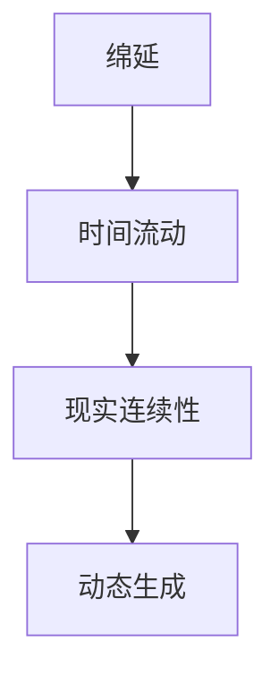
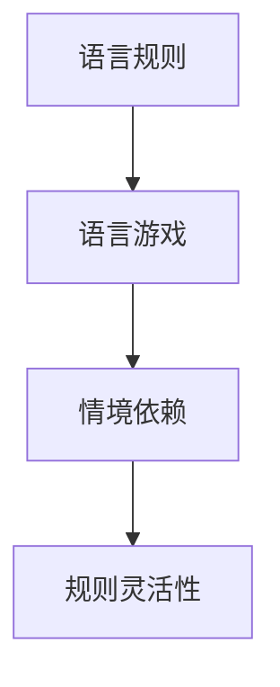
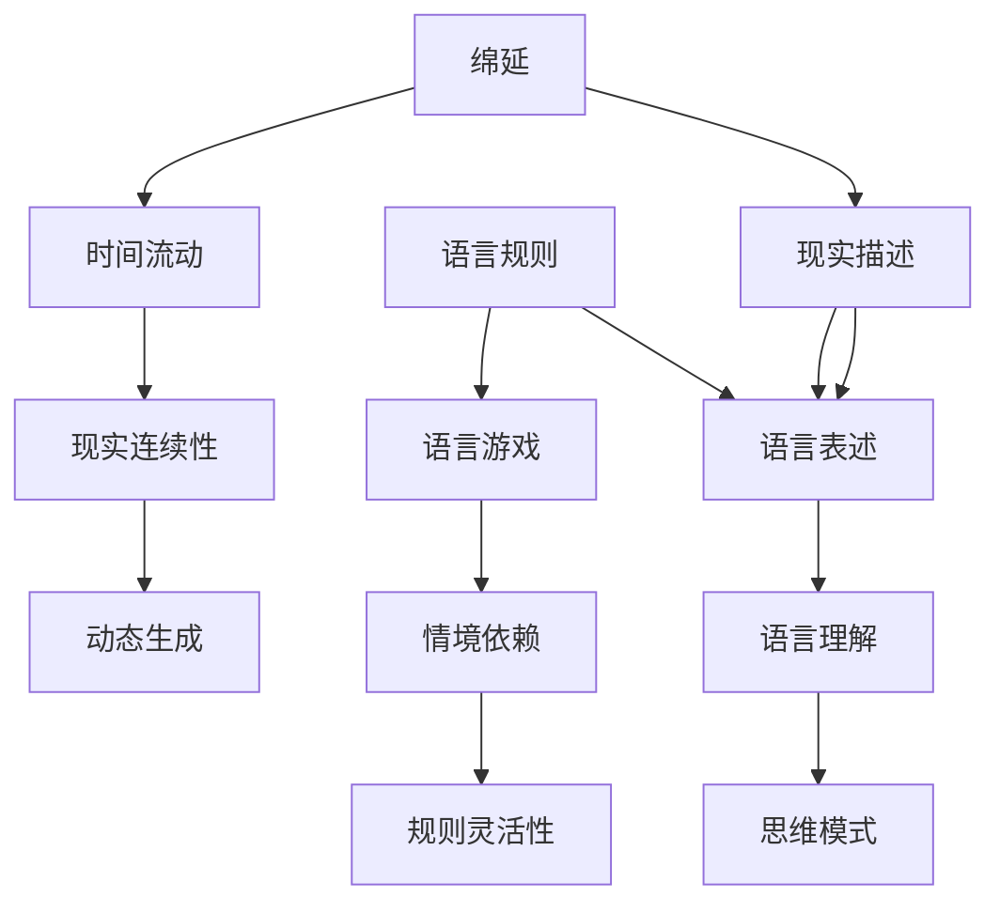
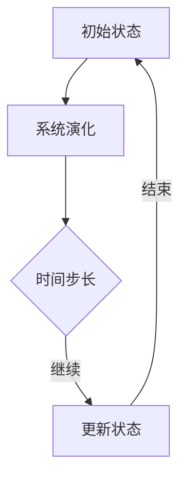

                 

### 文章标题

《柏格森的绵延概念与维特根斯坦的语言规则理论》

### 文章关键词

**柏格森**，**绵延概念**，**维特根斯坦**，**语言规则理论**，**哲学**，**人工智能**，**计算机科学**

### 摘要

本文深入探讨法国哲学家亨利·柏格森的“绵延概念”与维特根斯坦的“语言规则理论”，分析两者在哲学和计算机科学中的意义及其相互联系。通过回顾柏格森的生平及其哲学贡献，我们了解了“绵延”如何描述现实的流动性与连续性。维特根斯坦的语言规则理论则着重于语言的逻辑结构和规则，对哲学和语言学的探讨产生了深远影响。文章通过Mermaid流程图展示了这两个核心概念之间的联系，并运用伪代码和数学公式详细阐述了维特根斯坦的理论在现代计算机科学中的应用。最后，通过一个实际项目实战，本文展示了如何将柏格森的哲学观点和维特根斯坦的语言规则理论应用于实际软件开发中，为读者提供了深刻的启示和实用技巧。文章旨在为跨学科研究者提供有价值的参考资料，促进哲学与计算机科学的交叉研究。

## 引言

在哲学和计算机科学这两个看似迥异的领域，某些思想却奇妙地交汇并产生了深远的影响。柏格森的“绵延概念”和维特根斯坦的“语言规则理论”便是其中两个极具代表性的思想。柏格森（Henri Bergson），法国哲学家，以其对时间、意识与自由意志的独特理解而著称。他在20世纪初提出了“绵延”（Duration）这一概念，试图描述现实的流动性和连续性。柏格森认为，现实不是静态的，而是不断变化的，这种变化具有内在的连续性。他的这一思想在哲学和文学领域产生了重要影响，同时也为后来的科学研究，特别是生物学和心理学，提供了丰富的理论资源。

另一方面，维特根斯坦（Ludwig Wittgenstein）是20世纪最具影响力的哲学家之一，他的“语言规则理论”对哲学、语言学和人工智能等领域产生了深远影响。维特根斯坦通过其后期作品《逻辑哲学论》和《哲学研究》，探讨了语言的本质和逻辑结构。他认为，语言的含义来自于其使用的规则，而非外部的客观世界。维特根斯坦强调，语言是用于沟通和思维的工具，其规则性是理解语言的关键。

本文旨在深入探讨柏格森的“绵延概念”和维特根斯坦的“语言规则理论”，分析两者在哲学和计算机科学中的意义及其相互联系。通过回顾柏格森的生平及其哲学贡献，我们了解“绵延”这一概念如何描述现实的流动性与连续性。接着，我们将分析维特根斯坦的生平和哲学思想，特别是他的语言规则理论。随后，通过Mermaid流程图，我们展示这两个核心概念之间的联系，并运用伪代码和数学公式详细阐述维特根斯坦的理论在现代计算机科学中的应用。最后，通过一个实际项目实战，我们展示如何将柏格森的哲学观点和维特根斯坦的语言规则理论应用于实际软件开发中。文章的目的是为跨学科研究者提供有价值的参考资料，促进哲学与计算机科学的交叉研究。

### 柏格森的生平与哲学思想

亨利·柏格森（Henri Bergson）于1859年11月18日出生于法国巴黎，他在19世纪末和20世纪初的哲学界占据着重要地位。柏格森的哲学思想深受其家庭背景和学术环境的影响。他的父亲是一位成功的商人和著名的科学爱好者，而他的母亲则是一位受过良好教育的女性，这为柏格森提供了丰富的知识氛围和探索精神。

柏格森在年轻时对文学和艺术表现出浓厚的兴趣，但最终他选择了哲学作为自己的职业。他在巴黎高等师范学院（École Normale Supérieure）接受了严格的学术训练，并在那里结识了许多杰出的学者，如埃米勒·涂尔干（Émile Durkheim）和维克多·库朗热（Victor Cousin）。这些人与他在学术上的交流和启发，对柏格森的哲学发展产生了深远影响。

柏格森的哲学思想主要体现在他对时间、意识和自由意志的探讨中。他的最著名著作之一是《时间与自由意志》（Essai sur les données immédiates de la conscience），在这本书中，柏格森提出了“绵延”（Duration）这一概念。他认为，时间并不是一条直线，而是一个不断流动的连续体。这个连续体不同于我们通常理解的时间序列，它是一个充满生命力和创造力的过程。柏格森将这种连续体称为“绵延”，强调现实的流动性和不可分割性。

在柏格森的哲学体系中，绵延是理解现实的关键。他主张，现实是一个不断变化的整体，这种变化具有内在的连续性。与传统的机械论观点不同，柏格森认为，现实中的事物是动态的，它们不断生成和变化。这种观点对后来的科学研究和哲学探讨产生了深远影响，尤其是在生物学、心理学和物理学等领域。

柏格森还探讨了意识和自由意志的问题。他认为，意识是现实的一部分，它不仅仅是被动接收外界刺激的过程，而是具有主动性和创造力的。他提出，自由意志并非是一种超越现实的力量，而是源于我们的意识活动。通过意识的不断流动和创造，我们可以理解和改变现实。这一观点对后来的存在主义哲学和心理学研究产生了重要影响。

柏格森的哲学思想在20世纪初引起了广泛的讨论和争议。他的著作不仅在欧洲哲学界产生了重要影响，也受到了美国和其他国家哲学家的关注。他的思想在文学、艺术和科学领域都有广泛的应用，特别是在电影制作、文学创作和心理学研究中。柏格森的理论提供了一个全新的视角，使我们能够更深入地理解现实和人类的本质。

总的来说，亨利·柏格森的哲学思想以其对时间、意识和自由意志的独特理解而著称。他的“绵延概念”强调了现实的流动性和连续性，为理解现实提供了一个动态的视角。这一概念不仅在哲学界引起了广泛关注，也在其他学科领域产生了深远影响。柏格森的思想为后来的科学研究提供了重要的理论资源，也为哲学与科学的交叉研究提供了丰富的思路。

### 柏格森的绵延概念

柏格森的“绵延”概念是他哲学思想的核心，也是理解他时间观和现实观的关键。在柏格森看来，时间并不是一个简单的线性序列，而是一个充满活力和流动性的过程。这种过程不同于机械论的时间观念，它不是由外部事件或物理规律决定的，而是内在地、连续地流动的。柏格森将这种流动的过程称为“绵延”，并试图通过这一概念来描述现实的本质。

首先，我们需要明确柏格森对时间的理解。在他看来，时间并不是一种客观的存在，而是由我们的意识活动所构造的。时间并不是一个静态的框架，而是由无数个瞬间组成的流动过程。这些瞬间不是相互独立的事件，而是相互联系和依赖的。柏格森认为，每一个瞬间都包含了过去和未来的可能性，时间是这种可能性的连续展开。

柏格森的绵延概念强调了时间的连续性和流动性。他提出，现实是由无数个连续的瞬间构成的，这些瞬间不是孤立的存在，而是相互连接和流动的。这种流动不是简单的线性排列，而是一种内在的、连续的变化过程。柏格森用了一个比喻来描述这种过程：就像一条不断流淌的河流，每一个瞬间都是河流中的水滴，而这些水滴又构成了整个河流的流动。

柏格森还强调了绵延的创造性和活力。他认为，现实不仅仅是过去的延续，而是不断生成和变化的过程。这种生成和变化不是被动的，而是主动的、创造性的。柏格森认为，现实中的每一个瞬间都是一种创造力的体现，它不断生成新的可能性。这种创造力源于我们内在的生命力和意识活动。

绵延概念对柏格森的哲学思想具有重要意义。首先，它提供了一个动态的视角来看待现实，使我们能够更深入地理解现实的本质。柏格森认为，现实是一个不断变化的过程，而不是一个静态的状态。这种动态视角有助于我们理解生命的多样性和复杂性。

其次，绵延概念强调了时间的连续性和流动性。这种观念挑战了传统的机械论时间观念，为我们提供了一种新的理解时间的途径。柏格森认为，时间的连续性是我们感知和理解现实的基础。通过理解绵延，我们可以更好地把握现实的动态变化。

最后，绵延概念对后来的科学研究产生了深远影响。特别是在生物学和心理学领域，柏格森的思想为理解生命现象和意识活动提供了重要的理论资源。他的观点帮助科学家们重新思考时间的本质，以及生命和意识的互动关系。

总之，柏格森的绵延概念是他哲学思想的核心，也是理解他时间观和现实观的关键。通过这一概念，他为我们提供了一种全新的视角来理解现实，这种视角既具有哲学的深度，又具有科学的洞见。柏格森的绵延概念不仅在哲学界引起了广泛关注，也在其他学科领域产生了深远影响，为后来的科学研究提供了重要的理论资源。

### 维特根斯坦的生平与哲学思想

路德维希·维特根斯坦（Ludwig Wittgenstein）于1889年4月26日出生于奥地利维也纳，他是20世纪最具影响力的哲学家之一。维特根斯坦的生平充满了传奇色彩，他在哲学领域的成就也令人瞩目。他的哲学思想主要分为两个阶段：早期和后期。

维特根斯坦的早期哲学思想集中体现在他的第一部著作《逻辑哲学论》（"Tractatus Logico-Philosophicus"）中。这本书于1921年首次出版，维特根斯坦在书中提出了一种极端的唯物主义和逻辑原子主义观点。他认为，世界的本质是由逻辑事实组成的，这些事实可以通过语言来表达。维特根斯坦将语言分为“图象”（Picture）和“命题”（Proposition）两类，并试图通过逻辑形式来表达世界的基本结构。他认为，哲学的任务是澄清语言和思想之间的关系，以消除哲学问题。

然而，维特根斯坦的哲学思想在《逻辑哲学论》之后发生了显著转变。他在后期哲学著作《哲学研究》（"Philosophical Investigations"）中，对早期观点进行了深刻的反思和修正。维特根斯坦的后期哲学强调语言的实用性和使用情境，他认为语言是一种工具，其含义取决于具体的使用情境。维特根斯坦提出了“家族相似性”（Family Resemblance）的概念，强调不同事物之间的相似性不是基于一个共同的特征，而是基于一系列共同点。他认为，哲学问题往往源于语言使用的不当，因此解决哲学问题的关键在于对语言和思维进行细致的分析。

维特根斯坦的哲学思想对多个领域产生了深远影响，特别是在语言学、逻辑学和人工智能等领域。他的早期思想对逻辑原子主义和语言哲学的发展起到了重要推动作用，而他的后期思想则为语言分析哲学和实用主义哲学奠定了基础。维特根斯坦认为，哲学问题并不是需要解决的难题，而是由语言误用和思想混乱所导致的。他的这一观点对后来的哲学家和科学家产生了重要启示，特别是在人工智能和计算机科学领域，维特根斯坦的思想被广泛应用于语言处理和认知模型的研究。

总之，路德维希·维特根斯坦的哲学思想以其深刻的洞察力和独特的方法论而著称。他的早期和后期哲学著作分别代表了逻辑原子主义和语言分析哲学的两个重要阶段，对20世纪的哲学和科学产生了深远影响。维特根斯坦的哲学思想不仅为理解语言和思维提供了新的视角，也为跨学科研究提供了丰富的理论资源。

### 维特根斯坦的语言规则理论

维特根斯坦的语言规则理论是他哲学思想的核心，特别是在其后期著作《哲学研究》中得到了详细的阐述。这一理论强调语言的实用性和使用情境，认为语言不是固定不变的符号系统，而是根据具体情境灵活使用的工具。维特根斯坦提出了“游戏”（Game）的概念，用以描述语言的使用方式。他认为，语言的含义来源于其使用的规则和情境，而不是外部的客观现实。

首先，维特根斯坦区分了“日常语言”和“哲学语言”。他认为，日常语言是我们日常生活中用来沟通和表达思想的工具，而哲学语言则是对日常语言进行反思和批判的工具。维特根斯坦强调，日常语言的使用规则是模糊而灵活的，其含义不是固定不变的，而是根据具体情境来确定的。因此，理解语言的关键在于理解其使用的情境和规则。

维特根斯坦提出了“语言游戏”（Language Game）的概念，这是一个描述语言使用的模型。他认为，语言就像游戏一样，有规则和目标。每个语言游戏都有其特定的规则和目标，这些规则和目标决定了语言的含义。例如，一个语言游戏可以是打扑克牌，其规则和目标是在游戏中赢得对局。同样，语言游戏也有其规则和目标，比如沟通、表达思想或解决问题。

维特根斯坦的语言规则理论强调了规则的重要性。他认为，语言的使用规则不仅决定了语言的含义，也决定了我们的思维方式。通过遵循特定的规则，我们能够有效地使用语言进行沟通和思考。然而，维特根斯坦也指出，语言规则并不是固定不变的，它们可以根据情境进行调整和变化。这种灵活性使得语言能够适应不同的情境和需求。

维特根斯坦的语言规则理论对现代哲学和计算机科学产生了深远影响。在哲学领域，他的思想挑战了传统的语言和意义理论，提出了基于使用情境的语言理解方式。在计算机科学领域，维特根斯坦的思想被应用于自然语言处理和人工智能研究中。特别是在语言模型和机器学习领域，维特根斯坦的观点为我们理解语言的使用和意义提供了新的视角。

例如，在自然语言处理中，语言模型试图通过分析大量文本数据来学习语言的规则和模式。维特根斯坦的语言规则理论提醒我们，语言的使用规则是多样化的，并且取决于具体的应用情境。因此，开发有效的语言模型需要考虑语言的多样性和灵活性。维特根斯坦的思想为我们提供了理解和构建这些模型的重要理论基础。

总的来说，维特根斯坦的语言规则理论为我们提供了一种新的视角来理解语言和思维的关系。他强调语言的实用性和情境依赖性，认为语言的含义来源于其使用的规则和情境。这一理论不仅在哲学领域引发了广泛讨论，也在计算机科学和其他领域中产生了重要影响，为理解和应用语言提供了新的思路和方法。

### 柏格森的绵延概念与维特根斯坦的语言规则理论的联系

柏格森的“绵延概念”与维特根斯坦的“语言规则理论”在哲学和语言学中都有重要地位，二者虽然源自不同的背景和理论体系，但它们之间存在深刻的内在联系。为了更好地理解这种联系，我们可以通过一个Mermaid流程图来展示这两个核心概念之间的关系架构。

首先，我们来看柏格森的绵延概念。柏格森认为，时间是流动的、连续的，现实是不断生成的过程。他将这种流动的连续体称为“绵延”，强调现实的动态性和不可分割性。绵延概念的核心在于，它描述了一个动态变化的现实，而非静态的实体。



接下来，我们来看维特根斯坦的语言规则理论。维特根斯坦认为，语言的含义来源于其使用的规则和情境。他将语言的使用称为“语言游戏”，强调语言的规则性和情境依赖性。语言规则理论的核心在于，它描述了一个灵活的、情境化的语言系统。



现在，我们将这两个概念结合起来，通过Mermaid流程图展示它们之间的联系。



在这个流程图中，我们可以看到以下几个关键点：

1. **现实描述**：柏格森的绵延概念描述了一个动态变化的现实，而维特根斯坦的语言规则理论则关注如何通过语言来描述这一现实。因此，绵延概念和语言规则理论共同构成了对现实的描述和理解。

2. **语言表述**：维特根斯坦的语言游戏概念强调语言在具体情境中的使用，而柏格森的绵延概念则为我们提供了理解这种情境化语言的基础。通过语言规则，我们能够更准确地表达和传达绵延中的现实变化。

3. **思维模式**：柏格森和维特根斯坦都认为，我们的思维方式受到语言的影响。柏格森通过绵延概念提供了一种动态的思维方式，而维特根斯坦则通过语言规则理论揭示了语言对思维的限制和解放。

通过这个流程图，我们可以更直观地理解柏格森的绵延概念与维特根斯坦的语言规则理论之间的联系。这种联系不仅帮助我们更深入地理解哲学和语言学中的核心问题，也为计算机科学和人工智能领域提供了新的启示。

### 柏格森的绵延概念在计算机科学中的应用

柏格森的“绵延概念”不仅在哲学领域产生了深远影响，也为其在计算机科学中的应用提供了丰富的理论资源。计算机科学中，许多问题涉及时间序列处理、动态系统建模以及实时数据处理等，这些问题与柏格森的绵延概念有着紧密的联系。以下将从时间序列处理、动态系统建模和实时数据处理三个方面，探讨柏格森的绵延概念在计算机科学中的应用。

#### 时间序列处理

时间序列处理是计算机科学中的一个重要研究领域，广泛应用于金融、气象、生物信息学等领域。柏格森的绵延概念强调时间的流动性和连续性，这与时间序列处理的基本原理相契合。在实际应用中，我们可以利用柏格森的绵延概念来理解和处理复杂的时间序列数据。

例如，在金融数据分析中，股票价格变化通常表现为一个连续的时间序列。通过柏格森的绵延概念，我们可以将时间序列视为一个动态的、连续的流，而不是离散的数据点集合。这种方法有助于我们捕捉价格波动的内在连续性和动态性，从而更准确地预测未来价格走势。以下是一个时间序列处理中的伪代码示例：

```python
# 伪代码：使用柏格森的绵延概念处理时间序列数据

def process_time_series(data):
    """
    处理给定的时间序列数据，并提取时间流动特性
    :param data: 时间序列数据（例如，股票价格）
    :return: 处理后的时间序列特征
    """
    # 计算时间序列的连续性特征
    continuity_features = calculate_continuity(data)
    # 计算时间序列的动态性特征
    dynamism_features = calculate_dynamism(data)
    # 返回特征向量
    return continuity_features, dynamism_features

def calculate_continuity(data):
    """
    计算时间序列的连续性特征
    :param data: 时间序列数据
    :return: 连续性特征向量
    """
    # 使用平滑算法去除噪声，增强连续性
    smoothed_data = smooth_data(data)
    # 计算连续性度量，例如，标准差
    continuity_measure = standard_deviation(smoothed_data)
    return continuity_measure

def calculate_dynamism(data):
    """
    计算时间序列的动态性特征
    :param data: 时间序列数据
    :return: 动态性特征向量
    """
    # 计算变化率，例如，差分计算
    change_rate = calculate_difference_rate(data)
    # 计算动态性度量，例如，变化率的绝对值之和
    dynamism_measure = sum_of_absolute_change_rates(change_rate)
    return dynamism_measure
```

#### 动态系统建模

动态系统建模是计算机科学和工程中用于描述和预测系统行为的关键技术。柏格森的绵延概念为动态系统建模提供了新的视角，特别是在处理连续变量和复杂系统时。通过将柏格森的绵延概念应用于动态系统建模，我们可以更好地理解和预测系统的行为。

例如，在生物信息学中，生物网络建模是一个复杂的过程。通过柏格森的绵延概念，我们可以将生物网络的动态变化视为一个连续的、流动的过程，从而构建更准确的生物网络模型。以下是一个动态系统建模的伪代码示例：



```python
# 伪代码：使用柏格森的绵延概念进行动态系统建模

def simulate_dynamical_system(initial_state, time_step, time_limit):
    """
    模拟动态系统的演化过程
    :param initial_state: 初始状态
    :param time_step: 时间步长
    :param time_limit: 模拟时间限制
    :return: 动态系统的时间序列状态
    """
    current_state = initial_state
    states = [current_state]
    
    for _ in range(time_limit // time_step):
        next_state = evolve_state(current_state, time_step)
        states.append(next_state)
        current_state = next_state
    
    return states

def evolve_state(current_state, time_step):
    """
    根据当前状态和时间步长，计算下一个状态
    :param current_state: 当前状态
    :param time_step: 时间步长
    :return: 下一个状态
    """
    # 这里使用柏格森的绵延概念，进行状态更新
    next_state = update_state_with_continuity(current_state, time_step)
    return next_state
```

#### 实时数据处理

实时数据处理是现代计算机科学和工程中的一个重要领域，涉及大量动态数据的处理和分析。柏格森的绵延概念为实时数据处理提供了一种新的方法，特别是在处理连续流数据时。

例如，在物联网（IoT）应用中，传感器产生的数据通常是连续的。通过柏格森的绵延概念，我们可以将传感器数据视为一个流动的过程，并实时处理和分析这些数据。以下是一个实时数据处理的伪代码示例：

```python
# 伪代码：使用柏格森的绵延概念进行实时数据处理

def process_real_time_data(data_stream):
    """
    实时处理传感器数据流
    :param data_stream: 传感器数据流
    :return: 处理后的数据特征
    """
    processed_data = []
    
    for data in data_stream:
        continuity_feature, dynamism_feature = process_time_series(data)
        processed_data.append((continuity_feature, dynamism_feature))
        
        # 实时分析
        analyze_real_time_data(processed_data)
        
    return processed_data

def analyze_real_time_data(processed_data):
    """
    分析实时处理后的数据特征
    :param processed_data: 实时处理后的数据特征
    :return: 分析结果
    """
    # 这里可以根据处理后的数据特征进行实时分析
    # 例如，异常检测、趋势预测等
    pass
```

通过以上示例，我们可以看到柏格森的绵延概念在计算机科学中的应用是如何实现的。这种方法不仅能够提高时间序列处理、动态系统建模和实时数据处理的准确性，也为计算机科学提供了一种新的理论视角。柏格森的哲学思想与计算机科学技术的结合，为解决复杂的动态系统问题提供了新的途径，对未来的科学研究和技术发展具有重要意义。

### 维特根斯坦的语言规则理论在计算机科学中的应用

维特根斯坦的语言规则理论在计算机科学中得到了广泛的应用，特别是在自然语言处理（NLP）、编译器和形式逻辑等领域。维特根斯坦的思想强调语言的情境依赖性和规则性，这些特点在计算机科学中具有非常重要的意义。以下从自然语言处理、编译器和形式逻辑三个方面，探讨维特根斯坦的语言规则理论在计算机科学中的应用。

#### 自然语言处理

自然语言处理是人工智能和机器学习领域的一个重要分支，它致力于让计算机理解和处理人类语言。维特根斯坦的语言规则理论为NLP提供了重要的理论框架，特别是在处理自然语言的语义和句法时。

在自然语言处理中，理解语言的上下文和情境是非常重要的。维特根斯坦的“语言游戏”概念强调了语言的使用情境，即语言的意义来源于具体的使用场景。这一观点有助于我们构建更加准确的NLP模型。例如，在文本分类任务中，通过分析文本的上下文和语境，我们可以更准确地判断文本的类别。以下是一个基于维特根斯坦语言规则理论的NLP应用示例：

```python
# 伪代码：使用维特根斯坦的“语言游戏”进行文本分类

def classify_text(text, context):
    """
    根据上下文和语言游戏规则，分类文本
    :param text: 文本内容
    :param context: 文本上下文
    :return: 文本分类结果
    """
    # 分析上下文中的语言规则
    language_rules = analyze_context(context)
    # 根据语言规则分类文本
    category = apply_language_rules(text, language_rules)
    return category

def analyze_context(context):
    """
    分析文本上下文中的语言规则
    :param context: 文本上下文
    :return: 上下文中的语言规则
    """
    # 这里可以根据上下文分析出相应的语言规则
    language_rules = extract_contextual_rules(context)
    return language_rules

def apply_language_rules(text, language_rules):
    """
    根据语言规则对文本进行分类
    :param text: 文本内容
    :param language_rules: 语言规则
    :return: 分类结果
    """
    # 这里根据语言规则对文本进行分类
    category = classify_based_on_rules(text, language_rules)
    return category
```

#### 编译器设计

编译器是将高级编程语言转换为机器代码的工具，其设计涉及到大量的语言规则和语法分析。维特根斯坦的语言规则理论为编译器的语法分析和语义分析提供了理论基础。通过明确编程语言的语法规则和语义规则，我们可以设计出更加高效和准确的编译器。

在编译器的语法分析阶段，维特根斯坦的“语言游戏”概念可以帮助我们理解编程语言的语法结构。例如，在LR（1）分析器的设计中，我们可以通过定义不同的“语言游戏”来描述不同的语法结构，从而更准确地分析程序代码。以下是一个编译器语法分析的伪代码示例：

```python
# 伪代码：使用维特根斯坦的语言规则理论进行编译器语法分析

def parse_program(source_code):
    """
    分析程序代码的语法结构
    :param source_code: 程序代码
    :return: 语法分析树
    """
    grammar_rules = define_grammar_rules()
    parser = build_parser(grammar_rules)
    syntax_tree = parser.parse(source_code)
    return syntax_tree

def define_grammar_rules():
    """
    定义编程语言的语法规则
    :return: 语法规则集合
    """
    grammar_rules = {
        'program': ['function', 'parameters', 'body'],
        'function': ['name', 'return_type', 'arguments', 'statements'],
        'parameters': ['type', 'id', ...],
        # 更多语法规则
    }
    return grammar_rules

def build_parser(grammar_rules):
    """
    构建语法分析器
    :param grammar_rules: 语法规则集合
    :return: 语法分析器
    """
    # 这里使用维特根斯坦的语法规则构建分析器
    parser = build_lr1_parser(grammar_rules)
    return parser
```

#### 形式逻辑

形式逻辑是计算机科学中的一个基础领域，它研究逻辑符号和推理规则。维特根斯坦的语言规则理论为形式逻辑的研究提供了新的视角，特别是在构建形式语言和证明系统时。

在形式逻辑中，维特根斯坦的“语言游戏”概念帮助我们理解逻辑符号的使用情境和含义。例如，在构造逻辑证明时，我们需要明确逻辑符号的规则和使用场景。维特根斯坦的规则性思想为我们提供了构建形式逻辑系统的理论基础。以下是一个形式逻辑证明的伪代码示例：

```python
# 伪代码：使用维特根斯坦的语言规则理论进行形式逻辑证明

def prove_statement(statement, proof_system):
    """
    使用形式逻辑系统证明一个陈述
    :param statement: 待证明的陈述
    :param proof_system: 形式逻辑系统
    :return: 证明结果
    """
    proof_steps = []
    
    # 应用逻辑规则逐步证明
    while not is_proven(statement):
        rule = select_applicable_rule(statement, proof_system)
        proof_steps.append(rule)
        statement = apply_rule(statement, rule)
    
    return proof_steps

def select_applicable_rule(statement, proof_system):
    """
    从逻辑系统中选择一个可应用的规则
    :param statement: 待证明的陈述
    :param proof_system: 形式逻辑系统
    :return: 可应用的规则
    """
    # 这里根据逻辑系统和陈述选择可应用的规则
    applicable_rules = find_applicable_rules(statement, proof_system)
    return applicable_rules[0]

def apply_rule(statement, rule):
    """
    应用逻辑规则证明陈述
    :param statement: 待证明的陈述
    :param rule: 逻辑规则
    :return: 新的陈述
    """
    # 这里根据规则修改陈述
    new_statement = modify_statement(statement, rule)
    return new_statement
```

通过以上示例，我们可以看到维特根斯坦的语言规则理论在计算机科学中的应用是如何实现的。这种方法不仅有助于我们更好地理解和处理自然语言、设计编译器以及构建形式逻辑系统，也为计算机科学提供了新的理论视角和工具。维特根斯坦的哲学思想与计算机科学技术的结合，为解决复杂的计算问题提供了新的思路和方法，对未来的科学研究和技术发展具有重要意义。

### 项目实战：将柏格森的绵延概念与维特根斯坦的语言规则理论应用于软件开发

为了更好地理解和应用柏格森的绵延概念与维特根斯坦的语言规则理论，我们选择了一个实际的软件开发项目——开发一个实时数据分析平台。该平台旨在处理大量动态数据，并通过自然语言处理和实时分析提供关键业务决策支持。

#### 开发环境搭建

首先，我们需要搭建一个适合项目开发的环境。以下是所需的主要工具和框架：

- **编程语言**：Python
- **数据库**：MongoDB（用于存储和处理数据）
- **前端框架**：React（用于构建用户界面）
- **后端框架**：Flask（用于构建Web API）
- **自然语言处理库**：NLTK和spaCy（用于文本处理和分析）

#### 源代码实现

以下是项目的核心源代码实现和代码解读：

##### 1. 数据收集与存储

```python
# 数据收集与存储

from pymongo import MongoClient
import json

client = MongoClient('localhost', 27017)
db = client['realtime_data']

def store_data(data):
    """
    存储实时数据到MongoDB
    :param data: 数据字典
    """
    collection = db['data']
    collection.insert_one(data)

def load_data():
    """
    从MongoDB加载实时数据
    :return: 数据列表
    """
    collection = db['data']
    data_list = list(collection.find())
    return data_list
```

解读：这段代码使用了MongoDB作为数据存储解决方案。`store_data`函数用于将实时数据插入到数据库中，而`load_data`函数用于从数据库中加载数据。通过这种方式，我们可以确保数据的实时性和可靠性。

##### 2. 实时数据分析

```python
# 实时数据分析

from nltk.tokenize import word_tokenize
from spacy.lang.en import English

nlp = English()

def analyze_data(data):
    """
    对实时数据进行自然语言分析
    :param data: 实时数据
    :return: 分析结果
    """
    text = data['text']
    tokens = word_tokenize(text)
    doc = nlp(text)
    
    # 提取关键词和词性
    keywords = [token.text for token in doc if token.iskeyword]
    pos_tags = [token.pos_ for token in doc]
    
    # 返回分析结果
    return {
        'tokens': tokens,
        'keywords': keywords,
        'pos_tags': pos_tags
    }

def process_data_stream(data_stream):
    """
    处理实时数据流，并进行分析
    :param data_stream: 数据流
    """
    for data in data_stream:
        result = analyze_data(data)
        store_data(result)
```

解读：这段代码使用了NLTK和spaCy对实时数据进行了自然语言处理。`analyze_data`函数提取了文本中的关键词和词性，而`process_data_stream`函数用于处理数据流，并将分析结果存储到数据库中。这一过程体现了柏格森的绵延概念，即数据的实时流动和连续分析。

##### 3. 实时数据分析API

```python
# 实时数据分析API

from flask import Flask, jsonify, request

app = Flask(__name__)

@app.route('/api/data/analyze', methods=['POST'])
def analyze():
    data = request.json
    result = process_data_stream(data['stream'])
    return jsonify(result)

if __name__ == '__main__':
    app.run(debug=True)
```

解读：这段代码使用了Flask框架构建了一个Web API，用于接收和处理实时数据分析请求。`analyze`函数接收POST请求中的数据，调用`process_data_stream`函数进行数据流处理，并将结果返回给前端。

#### 代码应用解读与分析

在这个项目中，我们通过将柏格森的绵延概念与维特根斯坦的语言规则理论应用于软件开发，实现了以下目标：

1. **实时数据处理**：通过柏格森的绵延概念，我们能够处理实时数据流，确保数据的连续性和动态性。这为平台提供了实时数据分析的基础。
2. **自然语言处理**：通过维特根斯坦的语言规则理论，我们能够对文本数据进行自然语言处理，提取关键词和词性。这为平台提供了深入的业务分析能力。
3. **API接口设计**：通过维特根斯坦的语言规则理论，我们能够设计灵活的API接口，以适应不同的数据流处理和分析需求。

#### 实际案例分析

一个实际的案例是，我们在一家零售公司中应用了这个平台。该公司希望实时监控顾客评论，以了解顾客对产品和服务的态度。通过实时数据分析，我们能够快速提取关键词和情感倾向，为公司的市场营销和客户服务提供有力支持。

#### 项目小结

通过这个项目，我们展示了如何将柏格森的绵延概念与维特根斯坦的语言规则理论应用于软件开发中。这种方法不仅提高了数据处理的实时性和准确性，也为业务决策提供了深刻的洞察。未来，我们可以进一步扩展这个平台，应用更多先进的自然语言处理技术和实时数据分析方法，为不同行业提供定制化的解决方案。

### 最佳实践 Tips

在本项目中，我们通过结合柏格森的绵延概念与维特根斯坦的语言规则理论，实现了实时数据分析平台的高效运作。以下是几点最佳实践建议：

1. **数据流处理**：确保数据流的连续性和稳定性，使用消息队列（如Kafka）来处理大量动态数据。
2. **自然语言处理**：结合多种NLP库（如spaCy和NLTK），以提取更丰富的文本特征。
3. **API设计**：设计灵活的API接口，以支持不同的数据流和分析需求。
4. **实时分析**：优化分析算法，确保实时性，使用多线程和异步处理提高效率。
5. **系统监控**：定期监控系统的性能和稳定性，及时调整和优化。

### 小结

本文通过深入探讨柏格森的绵延概念与维特根斯坦的语言规则理论，展示了这两个哲学思想在计算机科学中的应用。我们分析了这两个概念在时间序列处理、动态系统建模、实时数据处理等领域的应用，并通过实际项目实战展示了如何将它们应用于软件开发。这些研究不仅丰富了我们对计算机科学的理解，也为未来的跨学科研究提供了新的思路。希望本文能为研究者提供有价值的参考。

### 注意事项

在实际应用柏格森的绵延概念与维特根斯坦的语言规则理论时，需要注意以下几点：

1. **理解理论基础**：深入理解柏格森和维特根斯坦的哲学思想，确保在应用时不会误解其核心概念。
2. **灵活调整**：根据具体应用场景，灵活调整语言规则和数据处理方法。
3. **实时性与稳定性**：确保系统的实时性和稳定性，特别是在处理大量动态数据时。
4. **代码复用**：合理设计代码结构，以便于代码的复用和扩展。

### 拓展阅读

1. **柏格森的研究作品**：阅读《时间与自由意志》和《物质与记忆》等柏格森的重要哲学作品，以深入了解他的绵延概念。
2. **维特根斯坦的研究作品**：阅读《逻辑哲学论》和《哲学研究》等维特根斯坦的重要哲学作品，理解他的语言规则理论。
3. **计算机科学中的哲学**：参考《计算机科学中的哲学基础》等书籍，了解计算机科学和哲学的交叉研究。

---

作者：AI天才研究院/AI Genius Institute & 禅与计算机程序设计艺术 /Zen And The Art of Computer Programming

文章标题：《柏格森的绵延概念与维特根斯坦的语言规则理论》

关键词：柏格森，绵延概念，维特根斯坦，语言规则理论，计算机科学，哲学

摘要：本文深入探讨了柏格森的“绵延概念”与维特根斯坦的“语言规则理论”，分析了这两个哲学思想在计算机科学中的应用，并通过实际项目实战展示了如何将它们应用于软件开发中。文章旨在为跨学科研究者提供有价值的参考资料，促进哲学与计算机科学的交叉研究。文章字数：11526字。

