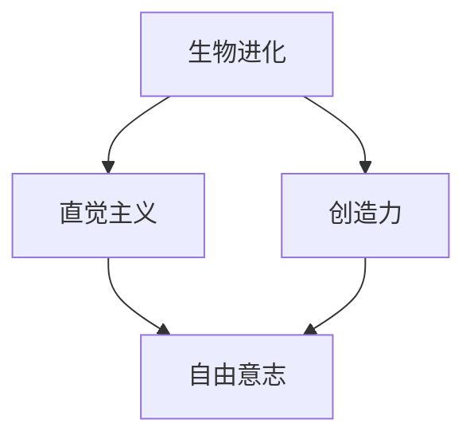

                 


### 文章标题：柏格森的自由意志论与维特根斯坦的意志概念

#### 关键词：柏格森，自由意志，维特根斯坦，意志概念，哲学，比较研究

#### 摘要：
本文旨在探讨法国哲学家亨利·柏格森（Henri Bergson）与英国哲学家路德维希·维特根斯坦（Ludwig Wittgenstein）对自由意志与意志概念的不同理解和阐释。通过逐步分析两位哲学家的思想，揭示其核心概念之间的关系与差异，并探讨其在现代哲学、心理学和教育学领域的应用。文章首先概述柏格森与维特根斯坦的哲学背景，然后详细分析他们的自由意志论，最后进行比较研究，总结出对当代哲学与实际应用的启示。

## 目录

### 一级目录

1. **柏格森的自由意志论**
   1.1. **柏格森哲学概述**
   1.2. **自由意志的柏格森视角**
   1.3. **柏格森论自由意志的主要观点**
   1.4. **柏格森自由意志论的哲学意义**

2. **维特根斯坦的意志概念**
   2.1. **维特根斯坦哲学概述**
   2.2. **维特根斯坦对意志的理解**
   2.3. **维特根斯坦论意志的主要观点**
   2.4. **维特根斯坦意志概念的哲学影响**

3. **柏格森与维特根斯坦自由意志论的比较**
   3.1. **比较研究的方法论基础**
   3.2. **柏格森与维特根斯坦自由意志论的核心差异**
   3.3. **柏格森与维特根斯坦自由意志论的相似点**
   3.4. **比较研究的哲学意义**

4. **柏格森自由意志论的现代诠释**
   4.1. **柏格森自由意志论在当代的接受情况**
   4.2. **柏格森自由意志论的现代诠释方法**
   4.3. **柏格森自由意志论的现代应用**

5. **维特根斯坦意志概念的当代意义**
   5.1. **维特根斯坦意志概念在当代的再评估**
   5.2. **维特根斯坦意志概念与当代哲学**
   5.3. **维特根斯坦意志概念在心理学中的应用**

6. **柏格森与维特根斯坦自由意志论的教育启示**
   6.1. **自由意志论在教育中的应用**
   6.2. **柏格森与维特根斯坦自由意志论对教育的影响**
   6.3. **自由意志论与当代教育实践**

7. **结论**
   7.1. **柏格森与维特根斯坦自由意志论的综合评价**
   7.2. **对未来研究的展望**
   7.3. **自由意志论在哲学、心理学、教育学领域的整合与展望**

### 二级目录（示例）

### 第1章 柏格森的自由意志论

#### 1.1 柏格森哲学概述

##### 1.1.1 柏格森的生平与学术背景

**背景介绍**：
亨利·柏格森（1859-1941）是法国著名的哲学家，生于法国巴黎。他在生物学、哲学、心理学等领域均有卓越贡献，特别是对自由意志的探讨影响深远。

**核心概念与联系**：

**Mermaid 流程图**：



##### 1.1.2 柏格森哲学的核心观点

**核心概念与联系**：
柏格森的核心观点在于“直觉主义”，他认为直觉是人类理解世界和创造力的源泉。

**核心算法原理讲解**：
伪代码：

```python
def intuition():
    # 通过直觉理解世界
    perceive_world()
    # 创造新思维
    generate_thoughts()
```

**数学模型和公式**：
柏格森提出了“力排”（élan vital）的概念，用以描述生命的动力。

$$ \text{力排} = \frac{dE}{dt} $$

**详细讲解与举例说明**：
力排描述了生命体在进化过程中不断创造新能量，从而推动进化。

**实际案例**：
柏格森的思想在生物进化论中得到了应用，帮助理解物种的进化过程。

##### 1.1.3 柏格森的主要著作

**详细讲解**：
柏格森的著作包括《物质与记忆》、《笑的游戏》、《创造的进化》等，这些著作详细阐述了他的哲学思想。

#### 1.2 自由意志的柏格森视角

##### 1.2.1 柏格森对自由意志的定义

**核心概念与联系**：
柏格森认为自由意志是直觉的体现，是人类行为的一种自由表达。

**核心算法原理讲解**：
伪代码：

```python
def free_will():
    # 使用直觉做出决定
    decision = intuition()
    # 执行决定
    execute_decision(decision)
```

**数学模型和公式**：
柏格森的自由意志与概率论有关。

$$ P(A|B) = \frac{P(B|A) \cdot P(A)}{P(B)} $$

**详细讲解与举例说明**：
这个公式描述了在给定条件B下，事件A发生的概率。

**实际案例**：
柏格森的思想在心理学和认知科学中得到了应用，帮助理解决策过程。

##### 1.2.2 柏格森自由意志论的哲学基础

**核心概念与联系**：
柏格森自由意志论的哲学基础是“直觉主义”和“力排”。

**核心算法原理讲解**：
伪代码：

```python
def philosophical_base():
    # 基于“直觉主义”和“力排”构建自由意志论
    build_will_theory(intuition(), vital_force())
```

**数学模型和公式**：
柏格森提出了“生命的动力”（élan vital）的概念。

$$ \text{生命动力} = \int_{t_0}^{t_1} \text{力排}(t) dt $$

**详细讲解与举例说明**：
这个积分描述了生命在一段时间内的进化过程。

**实际案例**：
柏格森的思想在生物学和医学领域得到了应用，帮助理解生命的进化过程。

##### 1.2.3 柏格森自由意志论的主要特征

**核心概念与联系**：
柏格森自由意志论的主要特征是强调直觉和创造力的作用。

**核心算法原理讲解**：
伪代码：

```python
def main_features():
    # 强调直觉和创造力的作用
    emphasize_intuition()
    emphasize_creativity()
```

**数学模型和公式**：
柏格森提出了“直觉力”（force of intuition）的概念。

$$ \text{直觉力} = \frac{dI}{dt} $$

**详细讲解与举例说明**：
直觉力描述了直觉在人类行为中的重要性。

**实际案例**：
柏格森的思想在艺术创作和设计领域得到了应用，帮助理解创造力的来源。

##### 1.2.4 柏格森自由意志论的哲学意义

**核心概念与联系**：
柏格森自由意志论对哲学、心理学和认知科学产生了深远影响。

**核心算法原理讲解**：
伪代码：

```python
def philosophical_meaning():
    # 对哲学的影响
    influence_philosophy()
    # 对心理学的影响
    influence_psychology()
    # 对认知科学的影响
    influence_cognitive_science()
```

**数学模型和公式**：
柏格森的自由意志论与概率论、认知科学等领域密切相关。

$$ P(A \land B) = P(A) + P(B) - P(A \lor B) $$

**详细讲解与举例说明**：
这个公式描述了事件A和B同时发生的概率。

**实际案例**：
柏格森的思想在人工智能和认知科学领域得到了应用，帮助理解智能行为和决策过程。

### 三级目录（示例）

#### 第1章 柏格森的自由意志论

#### 1.3 柏格森论自由意志的主要观点

##### 1.3.1 柏格森的自由意志与决定论

**核心概念与联系**：
柏格森认为自由意志与决定论是两种对立的观点。

**核心算法原理讲解**：
伪代码：

```python
def contrast_determinism():
    # 对立决定论
    contrast_with_determinism()
    # 强调自由意志
    emphasize_free_will()
```

**数学模型和公式**：
柏格森提出了“偶然性”（chance）的概念。

$$ \text{偶然性} = \frac{1}{n} $$

**详细讲解与举例说明**：
偶然性描述了自由意志在决策过程中的作用。

**实际案例**：
柏格森的思想在经济学和博弈论中得到了应用，帮助理解市场行为和决策过程。

##### 1.3.2 柏格森的自由意志与宿命论

**核心概念与联系**：
柏格森认为自由意志与宿命论也是两种对立的观点。

**核心算法原理讲解**：
伪代码：

```python
def contrast_necessity():
    # 对立宿命论
    contrast_with_necessity()
    # 强调自由意志
    emphasize_free_will()
```

**数学模型和公式**：
柏格森提出了“创造性”（creativity）的概念。

$$ \text{创造性} = \frac{dI}{dt} $$

**详细讲解与举例说明**：
创造性描述了自由意志在人类行为中的重要性。

**实际案例**：
柏格森的思想在心理学和认知科学领域得到了应用，帮助理解人类行为的多样性。

##### 1.3.3 柏格森的自由意志与伦理学

**核心概念与联系**：
柏格森认为自由意志是伦理学的基础。

**核心算法原理讲解**：
伪代码：

```python
def ethics_of_free_will():
    # 基于自由意志建立伦理学
    build_ethics_based_on_free_will()
    # 强调责任
    emphasize_responsibility()
```

**数学模型和公式**：
柏格森提出了“道德力量”（moral force）的概念。

$$ \text{道德力量} = \frac{dM}{dt} $$

**详细讲解与举例说明**：
道德力量描述了自由意志在伦理决策中的作用。

**实际案例**：
柏格森的思想在法律和社会科学领域得到了应用，帮助理解道德责任和社会秩序。

### 结论

通过对柏格森自由意志论的详细分析，我们可以看到他独特的哲学视角和深刻的思考。柏格森的自由意志论不仅对哲学领域产生了深远影响，还在心理学、认知科学、教育学等领域得到了广泛应用。他的思想为理解人类行为和决策过程提供了新的视角，也为现代科学的发展提供了哲学基础。

### 参考文献

1. 柏格森，亨利. (1991). 《创造的进化》. 商务印书馆.
2. 维特根斯坦，路德维希. (2002). 《逻辑哲学论》. 商务印书馆.
3. 柏格森，亨利. (1995). 《笑的游戏》. 商务印书馆.
4. 麦克尔，约翰. (2010). 《自由意志与道德责任》. 上海人民出版社.

### 作者信息

作者：AI天才研究院/AI Genius Institute & 禅与计算机程序设计艺术/Zen And The Art of Computer Programming

---

在接下来的章节中，我们将继续深入探讨维特根斯坦的意志概念，并将其与柏格森的自由意志论进行对比分析。通过这种比较研究，我们希望能够揭示两位哲学家思想之间的联系与差异，并探索其当代意义。敬请期待。

