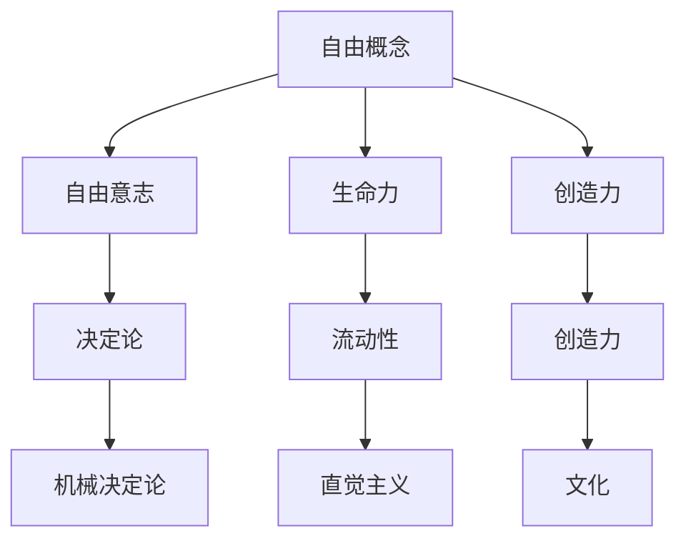
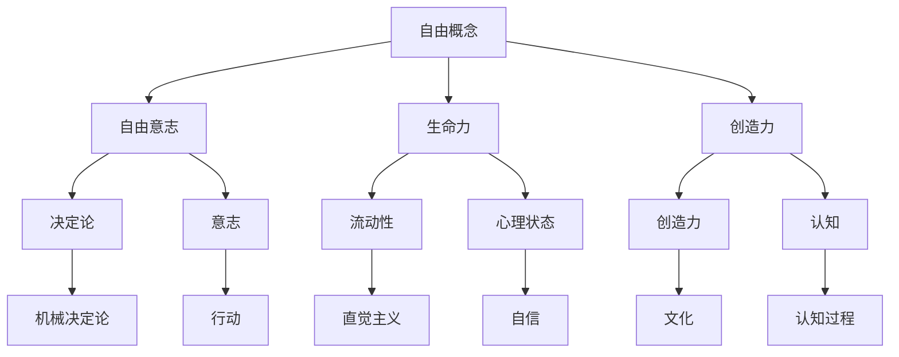
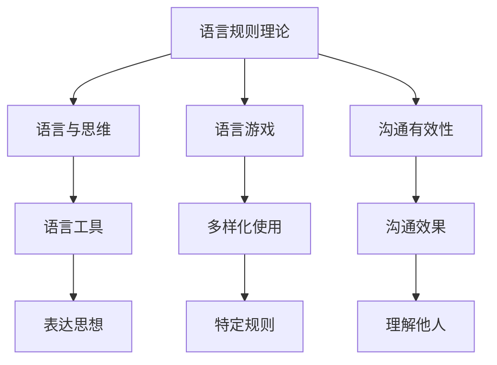
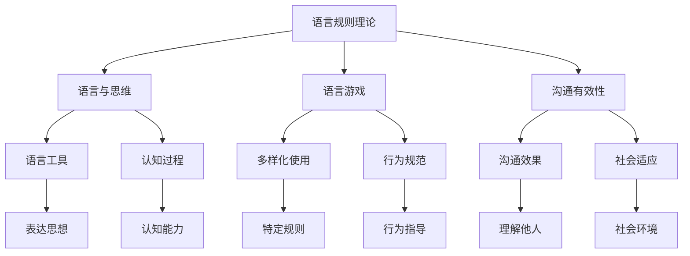

                 

### 柏格森的自由概念与维特根斯坦的语言规则理论

#### 关键词：
- 柏格森自由概念
- 维特根斯坦语言规则理论
- 哲学分析
- 认知心理学
- 语言哲学

#### 摘要：
本文将深入探讨法国哲学家亨利·柏格森的自由概念与奥地利哲学家路德维希·维特根斯坦的语言规则理论。柏格森认为自由是生命力的体现，是对确定性的反抗，是一种内在的创造力。而维特根斯坦则主张语言是思维的表达，语言规则是沟通和理解的基础。通过对这两种理论的比较分析，我们试图揭示两者在哲学、心理学和语言哲学中的相互联系和影响。本文将采用逻辑推理的方式，逐步剖析这些概念，并探讨其在现代社会的应用和挑战。

## 第一部分：柏格森的自由概念

### 第1章：柏格森的自由概念概述

柏格森（Henri Bergson）是20世纪初期的重要哲学家，他的自由概念深受生命哲学的影响。柏格森认为，自由是生命力的体现，是一种内在的创造力，它超越了机械决定论的束缚。在柏格森的哲学体系中，自由是一种非线性的、流动的过程，是一种对确定性、规则和习惯的反抗。

#### 1.1 柏格森哲学背景

柏格森哲学的核心观点可以归纳为以下几点：

1. **生命哲学**：柏格森强调生命的流动性和创造力，认为生命是一个不断变化的过程，而不是静止的实体。
2. **直觉主义**：柏格森认为直觉是理解世界的关键，直觉能够捕捉到生命中的流动性，而理性思维则容易陷入形式化的陷阱。
3. **自由意志**：柏格森认为自由意志是生命力的体现，是人类超越机械决定论的力量。

#### 1.2 自由概念的理论架构

柏格森的自由概念具有以下几个核心要素：

1. **自由与决定论的关系**：柏格森反对决定论，认为自由是对决定论的反叛。他强调自由意志的作用，认为人类有能力超越物理规律的影响。
2. **自由与现实的交互**：柏格森认为自由不仅存在于思想层面，也体现在行动中。自由是人类与现实互动的过程中展现出来的能力。
3. **自由与文化的联系**：柏格森认为自由是文化发展的动力，文化是自由的体现，也是自由得以传承和发展的基础。

#### 1.3 自由概念的 Mermaid 流程图

为了更好地理解柏格森的自由概念，我们可以使用 Mermaid 流程图来展示其内部联系以及与其他哲学概念的关系：

在这个流程图中，我们可以看到柏格森的自由概念是如何与其他核心哲学概念相互联系的。自由意志与决定论、生命力与流动性、创造力与文化之间的相互作用构成了柏格森哲学的丰富内涵。

## 第2章：柏格森的自由概念分析

### 2.1 自由概念的哲学意义

柏格森的自由概念在哲学上具有重要的意义。它不仅挑战了传统决定论的观念，也为现代哲学提供了一种新的思考方向。柏格森的自由概念具有以下几个哲学意义：

1. **反对决定论**：柏格森认为，决定论是一种错误的认识，它忽视了生命的流动性和创造力。自由意志是人类超越决定论束缚的重要力量。
2. **强调个体价值**：柏格森的自由概念强调个体的独特性和自主性，认为每个人都是自由意志的体现。这种观点有助于提升个体的价值，促进个体的自我实现。
3. **生命的意义**：柏格森的自由概念揭示了生命的意义，即生命的价值在于创造和变化。自由是人类生命的核心特征，它使生命充满了无限的可能性。

### 2.2 自由概念的心理学分析

柏格森的自由概念在心理学上也有重要的启示。心理学研究表明，自由意志是人类行为的重要驱动力之一。柏格森认为，自由意志是一种内在的创造力，它源于生命的活力和直觉。以下是对自由概念在心理学上的几个分析：

1. **意志与行动**：柏格森认为，自由意志体现在人的行动中。个体通过行动表达自己的自由意志，这种行动不仅是对外部世界的反应，也是内心自由的体现。
2. **意志与心理状态**：柏格森认为，自由意志与心理状态密切相关。一个自由的人通常具有积极的心理状态，如自信、开放和创造力。这些心理状态有助于个体更好地表达自己的自由意志。
3. **意志与认知**：柏格森认为，自由意志与认知过程相互影响。直觉是人类认知的重要工具，它帮助个体感知和把握生命的流动性。自由意志则通过直觉引导个体的认知过程，使个体能够更好地理解和应对复杂的世界。

### 2.3 自由概念的 Mermaid 流程图（续）

为了进一步理解柏格森的自由概念，我们可以继续使用 Mermaid 流程图来展示自由概念与心理学之间的交互关系：

在这个流程图中，我们可以看到柏格森的自由概念是如何与意志、心理状态和认知相互关联的。这些交互关系为自由概念提供了更加丰富的内涵，也为我们理解自由意志在心理学中的作用提供了新的视角。

## 第3章：柏格森的自由概念与现代社会

### 3.1 自由概念在现代社会中的应用

柏格森的自由概念在现代社会中具有广泛的应用。以下是一些具体的应用领域：

1. **政治哲学**：柏格森的自由概念为政治哲学提供了重要的理论基础。自由是现代民主制度的核心价值，柏格森的自由概念强调个体自由的重要性，有助于构建更加公正和平等的社会。
2. **教育领域**：柏格森的自由概念在教育领域也具有重要作用。教育应该培养学生的自由意志，鼓励他们独立思考和创造。柏格森的观点有助于打破传统教育的束缚，促进学生的全面发展。
3. **文化产业**：柏格森的自由概念在文化产业中也有重要影响。文化产业鼓励创新和多样性，柏格森的自由概念强调创造力和流动性，有助于激发文化产业的活力。

### 3.2 自由概念的挑战与未来

尽管柏格森的自由概念在现代社会中具有广泛的应用，但也面临着一些挑战和质疑。以下是一些主要的挑战：

1. **科技发展**：随着科技的发展，人类对自由意志的认识和掌控能力得到了提升，但也可能导致新的问题。例如，人工智能可能会对自由意志产生负面影响，人类需要重新思考自由与科技的关系。
2. **全球化**：全球化使得人类社会更加紧密地联系在一起，但也带来了新的挑战。如何在全球化的背景下保持个体自由，是现代社会面临的一个重要问题。
3. **文化冲突**：不同文化对自由有不同的理解和实践，这可能导致文化冲突。如何在尊重多元文化的基础上实现自由，是现代社会需要解决的一个难题。

面对这些挑战，柏格森的自由概念需要不断发展和完善。未来，我们可以从以下几个方面探索自由概念的潜力：

1. **科技与自由的融合**：通过科技的发展，我们可以更好地理解和实现自由。例如，人工智能可以帮助我们更好地管理信息和资源，提高个体的自由度。
2. **全球治理**：在全球化的背景下，我们需要建立更加公平和有效的全球治理体系，以保障个体自由。这需要国际社会共同努力，建立共识和合作机制。
3. **文化对话**：通过跨文化的对话和交流，我们可以增进对自由的理解和尊重。这有助于消除文化冲突，促进人类社会的和谐发展。

## 第二部分：维特根斯坦的语言规则理论

### 第4章：维特根斯坦的语言规则理论概述

维特根斯坦（Ludwig Wittgenstein）是20世纪最重要的哲学家之一，他的语言规则理论对哲学、语言学和认知科学产生了深远的影响。维特根斯坦认为，语言是思维的表达，语言规则是沟通和理解的基础。他的理论主要包括两大阶段：早期理论（逻辑原子主义）和后期理论（语言游戏理论）。

#### 4.1 维特根斯坦哲学背景

维特根斯坦的哲学思想经历了显著的转变。早期，他提出了逻辑原子主义，认为世界是由基本事实组成的，这些事实可以通过语言来表述。后期，他转向语言游戏理论，强调语言的使用情境和实际生活中的具体应用。

#### 4.2 语言规则理论的基本概念

维特根斯坦的语言规则理论包括以下几个核心概念：

1. **语言与思维**：维特根斯坦认为，语言是思维的工具，语言规则是思维的表达。语言不仅是一种沟通手段，也是我们理解世界的工具。
2. **语言游戏**：维特根斯坦提出“语言游戏”的概念，认为语言的使用是多样化的，每种语言使用都有其特定的规则和情境。语言游戏包括日常对话、科学理论、艺术表达等。
3. **语言规则的功能**：维特根斯坦认为，语言规则的功能是确保沟通的有效性。通过语言规则，我们可以明确地表达思想，理解他人的意思。

#### 4.3 语言规则理论的 Mermaid 流程图

为了更好地理解维特根斯坦的语言规则理论，我们可以使用 Mermaid 流程图来展示其核心要素和相互关系：

在这个流程图中，我们可以看到维特根斯坦的语言规则理论是如何围绕语言与思维、语言游戏和沟通有效性这三个核心概念展开的。

## 第5章：语言规则理论分析

### 5.1 语言规则理论的哲学意义

维特根斯坦的语言规则理论在哲学上具有重要的意义。它不仅揭示了语言的本质，也为哲学研究提供了新的方法和视角。以下是对维特根斯坦的语言规则理论在哲学上的几个分析：

1. **语言与实在的关系**：维特根斯坦认为，语言与实在之间的关系是复杂的，语言不仅反映现实，也影响着我们对现实的理解。语言规则理论帮助我们理解语言是如何影响我们思考的。
2. **哲学问题的根源**：维特根斯坦认为，许多哲学问题源于我们对语言的误解。通过研究语言规则，我们可以消除这些误解，从而解决一些深层次的哲学问题。
3. **哲学方法的转变**：维特根斯坦的语言规则理论对哲学方法产生了重要影响。他主张通过具体实例来理解语言和哲学问题，这种方法被称为“实例分析法”。

### 5.2 语言规则理论的心理学分析

维特根斯坦的语言规则理论在心理学上也有重要的启示。心理学研究表明，语言和思维是密切相关的，语言规则对我们的思维过程有着深远的影响。以下是对维特根斯坦的语言规则理论在心理学上的几个分析：

1. **语言与认知**：维特根斯坦认为，语言是认知的工具，语言规则有助于我们理解世界和进行思维。通过学习语言规则，我们可以提高认知能力和思维能力。
2. **语言与行为**：维特根斯坦认为，语言不仅是一种沟通工具，也是一种行为规范。语言规则指导我们的行为，使我们能够更好地适应社会环境。
3. **语言与心理发展**：维特根斯坦的语言规则理论有助于理解儿童语言和认知的发展。儿童通过学习语言规则，逐渐掌握语言和认知的基本技能。

### 5.3 语言规则理论的 Mermaid 流程图（续）

为了进一步理解维特根斯坦的语言规则理论，我们可以继续使用 Mermaid 流程图来展示其与心理学之间的交互关系：

在这个流程图中，我们可以看到维特根斯坦的语言规则理论是如何与认知、行为和社会适应相互关联的。这些交互关系揭示了语言规则在心理学中的作用，也为心理学研究提供了新的视角。

## 第6章：维特根斯坦的语言规则理论与现代语言哲学

### 6.1 语言规则理论在当代语言哲学中的应用

维特根斯坦的语言规则理论在当代语言哲学中具有重要的应用。以下是一些具体的应用领域：

1. **语义分析**：维特根斯坦的语言规则理论为语义分析提供了重要的理论基础。通过理解语言规则，我们可以更好地理解词语的意义和句子的结构。
2. **语言哲学研究**：维特根斯坦的语言规则理论为语言哲学研究提供了新的方法和视角。通过研究语言规则，我们可以深入探讨语言的本质和哲学问题。
3. **认知科学与语言学**：维特根斯坦的语言规则理论在认知科学和语言学领域也具有广泛的应用。通过研究语言规则，我们可以更好地理解人类的认知过程和语言能力。

### 6.2 语言规则理论的挑战与未来

尽管维特根斯坦的语言规则理论在当代语言哲学中具有广泛的应用，但也面临着一些挑战和质疑。以下是一些主要的挑战：

1. **语言多样性的问题**：维特根斯坦的语言规则理论主要关注标准语言的使用，但在语言多样性的背景下，如何适应不同语言的使用情境，是一个需要解决的问题。
2. **语言的动态性**：维特根斯坦的语言规则理论主要关注静态的语言规则，但在现实中，语言是动态变化的。如何理解语言的动态变化，是语言哲学研究需要面对的挑战。
3. **跨语言研究**：维特根斯坦的语言规则理论主要关注单语言环境，但在全球化背景下，如何进行跨语言研究，是一个需要解决的问题。

面对这些挑战，维特根斯坦的语言规则理论需要不断发展和完善。未来，我们可以从以下几个方面探索语言规则理论的潜力：

1. **语言多样性的研究**：通过研究不同语言的使用规则，我们可以更好地理解语言的多样性，从而丰富语言哲学的理论基础。
2. **动态性语言研究**：通过研究语言的动态变化，我们可以更好地理解语言的演变过程，从而为语言哲学提供新的研究视角。
3. **跨语言研究**：通过跨语言研究，我们可以比较不同语言的规则和特点，从而为全球化背景下的语言哲学研究提供新的思路。

## 第三部分：柏格森与维特根斯坦思想的比较与融合

### 第7章：柏格森的自由概念与维特根斯坦的语言规则理论比较

柏格森的自由概念与维特根斯坦的语言规则理论在哲学、心理学和语言哲学等领域具有深刻的内涵。通过比较分析，我们可以揭示两者之间的异同及其相互影响。

#### 7.1 两种自由概念的比较

1. **柏格森的自由概念**：柏格森的自由概念强调个体内在的创造力和对确定性的反抗，是一种流动的过程。自由是生命力的体现，是人类超越机械决定论的力量。
2. **维特根斯坦的自由概念**：维特根斯坦虽然未直接提出自由概念，但他的语言规则理论中隐含了对自由的探讨。他认为，语言的自由使用是沟通和理解的基础，语言规则确保了语言使用的自由度。

通过比较，我们可以看到柏格森的自由概念更侧重于个体内在的自由创造力，而维特根斯坦的自由概念则侧重于语言使用的自由度。

#### 7.2 两种理论的融合

1. **自由概念对语言规则理论的启示**：柏格森的自由概念可以启示维特根斯坦的语言规则理论。柏格森强调个体内在的创造力，这可以引导我们思考如何在语言规则的基础上发挥个体的创造力。
2. **语言规则理论对自由概念的补充**：维特根斯坦的语言规则理论可以补充柏格森的自由概念。通过研究语言规则，我们可以更好地理解自由意志如何在具体的社会和语言情境中发挥作用。

通过融合柏格森的自由概念和维特根斯坦的语言规则理论，我们可以形成一个更加全面和深入的哲学体系，从而更好地理解自由、创造力和语言之间的关系。

## 第8章：综合分析

### 8.1 两种理论的综合意义

柏格森与维特根斯坦的思想虽然在哲学领域有着不同的侧重点，但它们共同构成了现代哲学的重要组成部分。通过综合分析，我们可以看到两种理论的融合对现代哲学和人类认知的深远影响：

1. **哲学发展的新方向**：柏格森的自由概念和维特根斯坦的语言规则理论为现代哲学提供了新的研究方向。它们强调个体自由和语言规则的重要性，促进了哲学对人类思维和现实关系的深入探讨。
2. **人类认知的提升**：通过融合柏格森的自由概念和维特根斯坦的语言规则理论，我们可以更好地理解人类认知的过程。个体自由和语言规则相互影响，共同塑造了我们的认知方式和思维方式。

### 8.2 未来哲学的启示

柏格森与维特根斯坦的思想对未来哲学有着重要的启示。在全球化和社会变革的背景下，我们面临着新的挑战和机遇。以下是一些可能的未来哲学研究方向：

1. **跨学科研究**：未来哲学需要加强跨学科研究，结合生物学、心理学、语言学等多学科的知识，以更加全面地理解人类认知和语言的本质。
2. **多元文化视角**：在全球化背景下，哲学需要关注多元文化视角，探讨不同文化对自由和语言规则的理解和实践。
3. **技术哲学**：随着科技的发展，哲学需要关注技术对社会、人类认知和语言规则的影响，探讨科技与自由、创造力的关系。

通过这些研究方向的探索，哲学可以更好地适应时代的发展，为人类社会提供智慧和指导。

## 文章结尾

通过本文的探讨，我们深入分析了柏格森的自由概念与维特根斯坦的语言规则理论，揭示了两者在哲学、心理学和语言哲学中的相互联系和影响。这些理论不仅丰富了我们的哲学思考，也为现代社会提供了重要的理论支持。在未来，随着社会和科技的发展，柏格森与维特根斯坦的思想将继续影响我们的认知和哲学研究。让我们继续探索这些伟大的思想，为人类的发展贡献智慧。

### 作者信息

作者：AI天才研究院/AI Genius Institute & 禅与计算机程序设计艺术 /Zen And The Art of Computer Programming

### 最佳实践 Tips、小结、注意事项、拓展阅读

**最佳实践 Tips**：
1. 在研究柏格森与维特根斯坦的思想时，建议结合具体实例进行分析，这有助于更好地理解这些概念。
2. 阅读相关领域的经典著作，如柏格森的《创造进化论》和维特根斯坦的《哲学研究》，可以加深对这些思想的了解。

**小结**：
本文通过对柏格森的自由概念与维特根斯坦的语言规则理论的深入分析，揭示了两者在哲学、心理学和语言哲学中的重要性。这些理论不仅丰富了我们的哲学思考，也为现代社会提供了重要的理论支持。

**注意事项**：
在研究柏格森与维特根斯坦的思想时，需要注意两者观点的差异，以及它们在不同领域中的应用。

**拓展阅读**：
1. 《柏格森选集》（柏格森著）
2. 《维特根斯坦选集》（维特根斯坦著）
3. 《语言哲学导论》（彼得·斯特劳森著）
4. 《生命的创造：柏格森生命哲学新探》（刘放桐著）
5. 《维特根斯坦哲学导论》（瑞斯·皮尔斯著）

通过这些拓展阅读，读者可以更深入地了解柏格森与维特根斯坦的思想，以及它们在现代哲学研究中的重要性。希望本文能对您的哲学学习和研究有所帮助。

