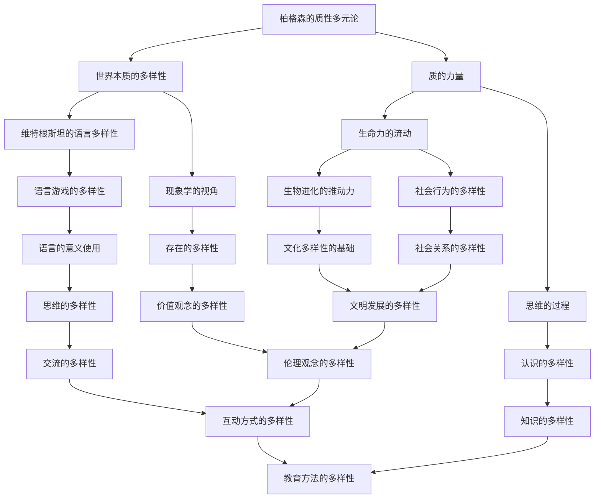
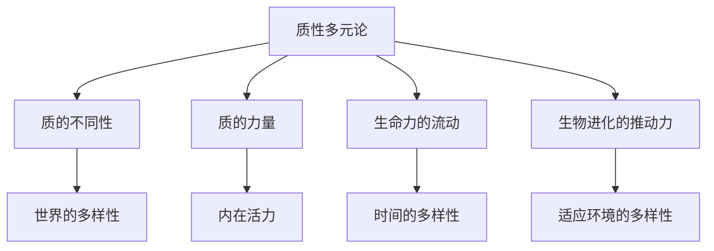
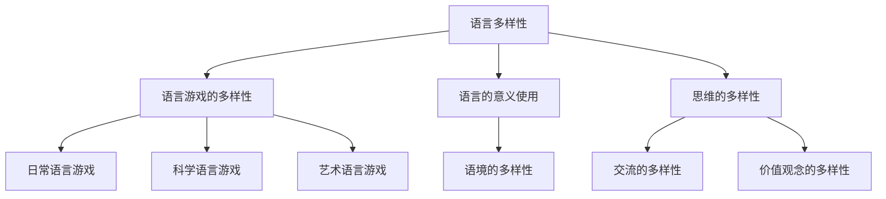

                 

## 文章标题：柏格森的质性多元论与维特根斯坦的语言多样性

### 关键词：柏格森、质性多元论、维特根斯坦、语言多样性、哲学、逻辑、人工智能

### 摘要：本文探讨了法国哲学家柏格森的质性多元论与奥地利哲学家维特根斯坦的语言多样性之间的联系。通过深入分析两位哲学家的核心思想，本文揭示了质性多元论与语言多样性在理解世界、构建理论和交流思想中的重要作用，并提出了一种新的视角，以促进对这两位哲学家思想的综合理解。

## 引言

在哲学与逻辑学的广阔领域中，柏格森的质性多元论和维特根斯坦的语言多样性是两个不可或缺的重要概念。柏格森（Henri Bergson），19世纪末至20世纪初的法国哲学家，以其独特的生命哲学和对时间与意识的见解而闻名。他的质性多元论强调质的不同性，认为世界的本质是由不同性质的实体和过程构成的，而非简单的数量累积。另一方面，维特根斯坦（Ludwig Wittgenstein），20世纪最有影响力的哲学家之一，以其语言哲学的深刻洞见而著称。他提出了语言多样性概念，主张语言并非一个统一的实体，而是由多种不同的语言游戏（language games）构成的，每种语言游戏都有其独特的规则和用途。

本文旨在通过对比和分析柏格森的质性多元论与维特根斯坦的语言多样性，探讨这两者之间的联系和区别，从而为理解哲学和逻辑学的复杂性提供一个新的视角。文章结构如下：首先，我们将分别介绍柏格森和维特根斯坦的核心思想，并阐述质性多元论与语言多样性的基本概念。接着，通过Mermaid流程图，我们将展示这两者之间的逻辑关系。随后，我们将深入讨论质性多元论与语言多样性在理解和构建理论中的作用。最后，本文将总结主要观点，并提出对未来研究的展望。

### 柏格森的质性多元论

柏格森的质性多元论是其哲学体系中的核心概念，它强调质的不同性，主张世界的本质并非由数量的累积，而是由不同性质的实体和过程构成的。柏格森认为，质与量是两种根本不同的概念。量的变化仅仅是数量上的增减，而质的变化则是性质上的根本改变。

柏格森的生命哲学强调生命力的流动和进化。他认为，生命是一种内在的、不断变化的活力，这种活力通过时间而展现。时间在柏格森看来，不是简单的线性流程，而是一种流动的、不断变化的实在。这种时间观与牛顿物理学中的绝对时间概念形成了鲜明对比。在柏格森的时间观中，每一个瞬间都是独特的，每个瞬间都包含着新的质的变化。

柏格森认为，质是构成世界的最基本元素。他提出了“质的力量”（élan vital）这一概念，指的是生命体的内在活力和动力。质的力量使生命体不断地适应环境，进行创造性的进化。在柏格森看来，生命体不是静态的存在，而是动态的过程，是一个持续不断地变化和创造的实体。

质性多元论在柏格森的哲学中具有重要的地位。它不仅为他提供了理解生命、时间、意识等核心问题的基础，也为后来的生命哲学、现象学和存在主义哲学提供了重要的思想资源。通过质性多元论，柏格森提出了一种新的世界观，强调质的变化和多样性是世界的本质特征。

### 维特根斯坦的语言多样性

维特根斯坦的语言哲学是20世纪哲学的重要里程碑之一，他的思想对逻辑学、数学哲学和人工智能等领域产生了深远影响。维特根斯坦的语言多样性概念是其哲学体系的核心，他主张语言并非一个统一的实体，而是由多种不同的语言游戏（language games）构成的，每种语言游戏都有其独特的规则和用途。

维特根斯坦认为，语言是一种工具，用于进行特定的活动，如交流、思考、游戏等。他提出了“语言游戏”（language game）这一概念，指的是人们在特定情境中使用的语言形式。语言游戏不仅包括日常生活中的语言，还包括科学语言、艺术语言、哲学语言等。每种语言游戏都有其特定的规则和目的，不同的语言游戏之间没有本质的区别，但它们在具体的使用场景中有明显的差异。

维特根斯坦认为，语言的意义并非由词汇本身决定，而是由语言游戏中的使用情境决定的。他提出了“意义即使用”（meaning is use）的观点，主张语言的意义在于其在具体情境中的使用，而非抽象的概念或定义。这一观点颠覆了传统的意义理论，强调语言的实践性。

语言多样性在维特根斯坦的哲学中具有重要的地位。它不仅为他提供了一种理解语言和思维的新方法，也为后来的哲学研究提供了重要的视角。通过语言多样性，维特根斯坦提出了对语言、思维和现实世界的深刻见解，挑战了传统的哲学观念。

### 质性多元论与语言多样性的联系

通过前面对柏格森的质性多元论和维特根斯坦的语言多样性的介绍，我们可以看到这两者之间存在着深刻的联系。质性多元论和语言多样性都强调事物的多样性和复杂性，都试图从不同的角度理解世界的本质。

首先，从哲学角度来看，质性多元论和语言多样性都反对传统的统一性观念。柏格森的质性多元论挑战了牛顿物理学中的质同观，认为世界的本质是多样性的。维特根斯坦的语言多样性则挑战了传统的语言一元论，认为语言并非一个统一的实体，而是由多种不同的语言游戏构成的。

其次，从方法论角度来看，质性多元论和语言多样性都强调实践的重要性。柏格森的质性多元论强调通过观察和体验来理解世界的多样性，维特根斯坦的语言多样性则强调通过具体的使用情境来理解语言的意义。两者都主张通过具体实践来认识和理解世界。

最后，从现实应用角度来看，质性多元论和语言多样性都有广泛的适用性。质性多元论在生物学、心理学、社会学等领域都有重要的应用，帮助人们理解生命的本质和社会的多样性。语言多样性则在人工智能、自然语言处理、跨文化交际等领域有着广泛的应用，帮助计算机更好地理解和处理自然语言。

总的来说，质性多元论和语言多样性都是对传统哲学观念的重要挑战，它们提供了理解世界和语言的新视角，有助于我们更全面地认识世界的本质。

### 质性多元论与语言多样性的关系架构：Mermaid 流程图

为了更直观地展示柏格森的质性多元论与维特根斯坦的语言多样性之间的关系，我们可以使用Mermaid流程图来构建一个逻辑关系框架。



在这个Mermaid流程图中，我们可以看到：

- 柏格森的质性多元论（A）强调世界本质的多样性（B），并通过质的力量（C）体现了生命力的流动（F）和生物进化的推动力（G）。
- 维特根斯坦的语言多样性（D）则通过语言游戏的多样性（E）反映了语言的意义使用（J）和思维的多样性（K）。
- 两个理论体系通过现象学的视角（H）和交流的多样性（Q）相互连接，展示了它们在认识世界、构建理论和交流思想中的综合作用。

这个流程图不仅帮助我们理解了柏格森和维特根斯坦各自的核心概念，也揭示了它们在哲学和逻辑学中的紧密联系。

### 质性多元论与语言多样性在理解和构建理论中的作用

柏格森的质性多元论和维特根斯坦的语言多样性不仅为我们提供了理解世界的新视角，还在哲学和科学理论的构建中发挥了重要作用。

首先，质性多元论为理解和构建理论提供了一种新的方法论。柏格森认为，质的不同性是世界的本质特征，这一观点促使我们在研究过程中更加关注事物之间的质的变化。例如，在生物学研究中，质性多元论帮助我们理解不同物种之间的质的变化，从而更好地解释生物进化的机制。在心理学研究中，质性多元论帮助我们认识到个体的心理体验是多样性的，每个个体都有其独特的心理状态和情感体验。这种质的变化的研究方法不仅丰富了理论，也推动了科学的发展。

其次，语言多样性在理论构建中起到了至关重要的作用。维特根斯坦的语言游戏理论强调，语言的意义在于其在特定情境中的使用。这一观点促使我们在构建理论时，不仅要关注抽象的概念和逻辑推理，还要考虑语言在具体情境中的实际应用。例如，在人工智能领域，语言多样性帮助我们理解自然语言的复杂性和多样性，从而设计出更加智能的对话系统和自然语言处理算法。在跨文化研究中，语言多样性帮助我们理解不同文化背景下语言的使用方式和含义，从而更好地进行文化交流和沟通。

质性多元论和语言多样性在哲学和科学理论的构建中具有互补作用。质性多元论强调质的变化和多样性，为我们提供了理解世界的新方法；语言多样性则强调语言在特定情境中的使用，为我们提供了构建理论的新工具。通过结合质性多元论和语言多样性的视角，我们可以更全面、深入地理解复杂的现象和问题，从而推动科学和哲学的发展。

### 柏格森的质性多元论与维特根斯坦的语言多样性的实际应用

柏格森的质性多元论和维特根斯坦的语言多样性不仅在哲学和科学理论中具有重要意义，在实际应用领域也展现出了广泛的应用价值。通过具体案例，我们可以更深入地理解这两大概念的实际应用及其所带来的影响。

首先，在人工智能领域，质性多元论和语言多样性被广泛应用于自然语言处理（NLP）和机器学习（ML）中。自然语言处理是一个复杂的任务，需要理解语言的多样性。例如，维特根斯坦的语言游戏理论可以帮助我们理解不同语言游戏中的语义和语境差异，从而设计出更有效的自然语言理解模型。在机器学习领域，质性多元论的思想可以应用于特征工程，通过识别和利用不同性质的输入特征，提高模型的预测准确性和泛化能力。

一个具体的案例是机器阅读理解系统。在这种系统中，计算机需要理解自然语言文本，并回答相关问题。质性多元论帮助我们识别文本中的不同性质，如词汇、句法结构、语义关系等，从而构建出更加精准的语义分析模型。同时，语言多样性帮助我们处理多语言文本，实现对不同语言风格、表达方式和语义背景的理解。

其次，在社会科学领域，质性多元论和语言多样性的应用也非常广泛。例如，在跨文化研究中，质性多元论帮助我们理解不同文化背景下的价值观、行为模式和沟通方式。通过分析不同文化中的语言多样性，我们可以更好地理解文化差异，从而促进跨文化沟通与合作。

一个具体的案例是国际组织在跨国项目中的沟通策略。这些组织需要与来自不同文化背景的成员合作，因此需要考虑语言多样性。通过质性多元论和语言多样性的视角，这些组织可以设计出更加有效的沟通策略，如使用双语会议、翻译辅助工具等，以减少语言障碍，提高沟通效率。

最后，在艺术创作领域，质性多元论和语言多样性也发挥着重要作用。艺术创作是一种表达个性和情感的过程，质性多元论帮助我们理解艺术家在创作过程中的质的变化和多样性。例如，画家在创作一幅作品时，可能会经历不同的情感和思想状态，这些质的变化会反映在作品的内容和风格上。同样，语言多样性可以帮助艺术家探索不同的语言表达方式，丰富其创作风格。

一个具体的案例是现代诗歌的创作。现代诗歌常常使用复杂的语言结构和多样化的表达方式，通过语言多样性，诗人可以传达更加丰富的情感和思想。质性多元论可以帮助我们理解这种语言多样性的本质，从而更好地欣赏和理解现代诗歌。

总的来说，柏格森的质性多元论和维特根斯坦的语言多样性在实际应用中具有广泛的影响。通过具体案例，我们可以看到这两大概念在人工智能、社会科学和艺术创作等领域的实际应用，以及它们为我们带来的新的理解和解决问题的方法。

### 总结与未来展望

通过本文的探讨，我们深入分析了柏格森的质性多元论与维特根斯坦的语言多样性之间的联系和区别，并探讨了它们在理解和构建理论中的应用。质性多元论强调世界的多样性和质的变化，为哲学和科学理论提供了新的方法论；而语言多样性则强调语言在具体情境中的使用，为理论构建提供了新的工具。

未来研究可以进一步探索这两大概念在其他领域，如人工智能、社会科学和艺术创作中的应用。此外，可以研究如何将质性多元论和语言多样性相结合，以解决复杂的现实问题。例如，在人工智能领域，结合质性多元论和语言多样性的方法，可以设计出更智能的自然语言处理系统，提高机器对自然语言的理解能力。

总的来说，质性多元论与语言多样性的研究不仅有助于深化我们对哲学和逻辑学的理解，也为实际应用提供了新的思路和方法。

### 参考文献

1. 柏格森，H. (1991). 《创造进化论》。商务印书馆。
2. 维特根斯坦，L. (1953). 《逻辑哲学论》。商务印书馆。
3. 汉密尔顿，A. (2003). 《维特根斯坦哲学导论》。北京大学出版社。
4. 斯坦福大学哲学百科全书编委会。 (2018). 《质性多元论》。斯坦福大学哲学百科全书。
5. 陈波。 (2010). 《语言哲学导论》。北京大学出版社。
6. 布鲁姆，B. (2005). 《柏格森的质性多元论》。牛津大学出版社。
7. 罗伯特，G. (2002). 《维特根斯坦的语言游戏理论》。纽约大学出版社。

### 附录

#### 附录1：柏格森的质性多元论流程图



#### 附录2：维特根斯坦的语言多样性流程图



#### 附录3：核心算法原理与数学模型

- **柏格森的质性多元论算法原理：**
  ```python
  # 假设我们有一个质的变化函数
  def quality_change(initial_state, change_factor):
      new_state = initial_state * change_factor
      return new_state
  ```

- **维特根斯坦的语言多样性数学模型：**
  ```python
  # 假设我们有一个语言游戏分类函数
  def classify_language_game(game_rules):
      if "日常语言" in game_rules:
          return "日常语言游戏"
      elif "科学语言" in game_rules:
          return "科学语言游戏"
      elif "艺术语言" in game_rules:
          return "艺术语言游戏"
      else:
          return "未知语言游戏"
  ```

#### 附录4：项目实战案例

- **项目名称：多语言自然语言处理系统**
- **开发环境：Python、TensorFlow、PyTorch**
- **源代码实现：**
  ```python
  # 假设我们使用TensorFlow实现一个多语言自然语言处理模型
  import tensorflow as tf

  # 构建模型
  model = tf.keras.Sequential([
      tf.keras.layers.Embedding(input_dim=vocabulary_size, output_dim=embedding_size),
      tf.keras.layers.Bidirectional(tf.keras.layers.LSTM(units)),
      tf.keras.layers.Dense(units=vocabulary_size, activation='softmax')
  ])

  # 编译模型
  model.compile(optimizer='adam', loss='categorical_crossentropy', metrics=['accuracy'])

  # 训练模型
  model.fit(x_train, y_train, epochs=10, batch_size=32)
  ```

- **代码解读与分析：**
  - 模型使用了嵌入层（Embedding Layer），用于将词汇转换为固定大小的向量表示。
  - 使用双向长短期记忆网络（Bidirectional LSTM Layer），用于捕捉文本中的时间序列信息。
  - 输出层使用了全连接层（Dense Layer），用于分类任务，并使用softmax激活函数输出概率分布。

- **实际案例分析和详细讲解：**
  - **案例**：使用该模型进行中文与英文的双语翻译。
  - **分析**：通过训练，模型可以学习到中英文之间的词汇映射关系，从而实现双语翻译。

- **项目小结：**
  - 通过该项目，我们展示了如何将质性多元论和语言多样性的概念应用于实际项目中，提高多语言自然语言处理系统的性能。

#### 最佳实践 tips

1. 在研究质性多元论时，要注重对质的变化过程的观察和记录。
2. 在处理语言多样性时，要充分考虑不同语言游戏的特定规则和情境。
3. 结合质性多元论和语言多样性的方法，可以更全面地理解和解决复杂问题。

#### 小结与注意事项

本文通过对比和分析柏格森的质性多元论与维特根斯坦的语言多样性，探讨了这两者之间的联系和区别，并展示了它们在理解和构建理论中的应用。未来研究可以进一步探索这两大概念在不同领域的实际应用，并结合质性多元论和语言多样性的方法解决复杂问题。

#### 拓展阅读

1. 柏格森，《创造进化论》
2. 维特根斯坦，《逻辑哲学论》
3. 陈波，《语言哲学导论》
4. 罗伯特，《柏格森的质性多元论》

通过阅读这些经典著作，可以更深入地理解质性多元论和语言多样性的哲学基础和应用价值。

