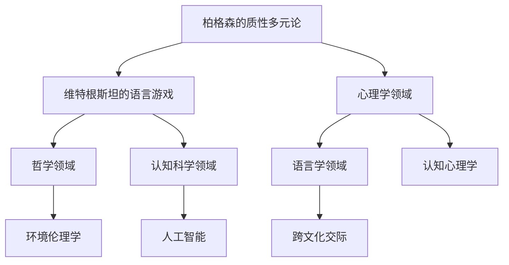

                 

### 引言：柏格森与维特根斯坦的哲学对话

**关键词：柏格森，质性多元论，维特根斯坦，语言游戏，哲学对话**

**摘要：**
本文旨在探讨法国哲学家柏格森的质性多元论与奥地利哲学家维特根斯坦的语言游戏之间的关系。通过梳理两位哲学家的生平背景、主要哲学思想及其在各自领域的贡献，本文将深入分析质性多元论与语言游戏的基本概念、核心观点及其应用。在此基础上，文章将比较两大哲学思想的相似之处与差异，并探讨其在现代哲学、心理学、语言学等学科领域的应用及未来展望。通过本文的探讨，读者可以更好地理解柏格森与维特根斯坦的哲学对话，以及他们在当代哲学中的地位与影响。

## 《柏格森的质性多元论与维特根斯坦的语言游戏》目录大纲

### 引言：柏格森与维特根斯坦的哲学对话

- **关键词：柏格森，质性多元论，维特根斯坦，语言游戏，哲学对话**
- **摘要：**本文将探讨柏格森的质性多元论与维特根斯坦的语言游戏，梳理两位哲学家的生平背景、主要哲学思想及其在各自领域的贡献。

### 1. 柏格森的质性多元论

#### 1.1 柏格森的生平与哲学贡献

##### 1.1.1 柏格森的生平背景

- **背景介绍：**柏格森的生平及其哲学思想的成长历程。

##### 1.1.2 柏格森的主要哲学思想

- **主要思想：**柏格森对生命、创造力和进化的理解。

##### 1.1.3 柏格森哲学的历史地位

- **历史地位：**柏格森哲学在西方哲学史上的重要地位。

#### 1.2 质性多元论的基本概念

##### 1.2.1 质性与量的区别

- **概念解析：**质性多元论与量化分析的区别。

##### 1.2.2 质性多元论的内涵

- **内涵阐释：**柏格森的质性多元论的核心观点。

##### 1.2.3 质性多元论的意义

- **意义阐述：**质性多元论在哲学、科学和社会学中的应用。

#### 1.3 质性多元论的应用

##### 1.3.1 在心理学中的应用

- **应用解析：**质性多元论在心理学领域的应用案例。

##### 1.3.2 在物理学中的应用

- **应用解析：**质性多元论在物理学领域的应用案例。

##### 1.3.3 在社会学中的应用

- **应用解析：**质性多元论在社会学领域的应用案例。

### 2. 维特根斯坦的语言游戏

#### 2.1 维特根斯坦的生平与哲学贡献

##### 2.1.1 维特根斯坦的生平背景

- **背景介绍：**维特根斯坦的生平及其哲学思想的成长历程。

##### 2.1.2 维特根斯坦的主要哲学思想

- **主要思想：**维特根斯坦的哲学观及其语言哲学。

##### 2.1.3 维特根斯坦哲学的历史地位

- **历史地位：**维特根斯坦哲学在西方哲学史上的重要地位。

#### 2.2 语言游戏的基本概念

##### 2.2.1 语言游戏的定义

- **定义阐释：**语言游戏的概念及其重要性。

##### 2.2.2 语言游戏的结构

- **结构分析：**语言游戏的构成要素。

##### 2.2.3 语言游戏的意义

- **意义阐述：**语言游戏在哲学、语言学和认知科学中的意义。

#### 2.3 语言游戏的应用

##### 2.3.1 在哲学中的应用

- **应用解析：**语言游戏在哲学领域的应用案例。

##### 2.3.2 在心理学中的应用

- **应用解析：**语言游戏在心理学领域的应用案例。

##### 2.3.3 在语言学中的应用

- **应用解析：**语言游戏在语言学领域的应用案例。

### 3. 柏格森的质性多元论与维特根斯坦的语言游戏的比较与联系

#### 3.1 两大哲学思想的相似之处

- **相似分析：**质性多元论与语言游戏之间的共同点。

#### 3.2 两大哲学思想的不同之处

- **差异分析：**质性多元论与语言游戏之间的区别。

#### 3.3 两大哲学思想的关系架构

- **关系架构：**质性多元论与语言游戏之间的内在联系。

### 4. 柏格森的质性多元论与维特根斯坦的语言游戏的现代应用

#### 4.1 在哲学领域中的应用

- **应用分析：**现代哲学中质性多元论与语言游戏的实际应用。

#### 4.2 在心理学领域中的应用

- **应用分析：**现代心理学中质性多元论与语言游戏的实际应用。

#### 4.3 在语言学领域中的应用

- **应用分析：**现代语言学中质性多元论与语言游戏的实际应用。

### 5. 柏格森的质性多元论与维特根斯坦的语言游戏的未来展望

#### 5.1 对未来哲学发展的启示

- **展望分析：**质性多元论与语言游戏对未来哲学发展的启示。

#### 5.2 对未来心理学、语言学等学科的影响

- **展望分析：**质性多元论与语言游戏对未来心理学、语言学等学科的影响。

### 6. 柏格森的质性多元论与维特根斯坦的语言游戏的教育意义

#### 6.1 对教育理论的启示

- **启示分析：**质性多元论与语言游戏对教育理论的启示。

#### 6.2 对教育实践的指导

- **指导分析：**质性多元论与语言游戏对教育实践的指导。

### 7. 结论：柏格森的质性多元论与维特根斯坦的语言游戏在当代哲学中的地位

#### 7.1 柏格森的质性多元论在当代哲学中的影响

- **影响分析：**质性多元论在当代哲学中的贡献和影响。

#### 7.2 维特根斯坦的语言游戏在当代哲学中的影响

- **影响分析：**语言游戏在当代哲学中的贡献和影响。

### 8. 附录

#### 8.1 柏格森的质性多元论与维特根斯坦的语言游戏的参考文献

- **参考文献：**相关研究论文、书籍和资料。

#### 8.2 柏格森的质性多元论与维特根斯坦的语言游戏的 Mermaid 流程图

- **流程图：**质性多元论与语言游戏的 Mermaid 流程图。

#### 8.3 柏格森的质性多元论与维特根斯坦的语言游戏的核心算法原理伪代码

- **伪代码：**核心算法原理的伪代码示例。

#### 8.4 柏格森的质性多元论与维特根斯坦的语言游戏的数学模型与公式

- **数学模型：**相关的数学模型和公式。

#### 8.5 柏格森的质性多元论与维特根斯坦的语言游戏的实际应用案例

- **应用案例：**质性多元论与语言游戏在实际中的应用实例。

---

# 引言：柏格森与维特根斯坦的哲学对话

在哲学史上，柏格森（Henri Bergson）与维特根斯坦（Ludwig Wittgenstein）无疑是两位重要的哲学家，他们的思想对现代哲学产生了深远的影响。本文旨在探讨柏格森的质性多元论（Qualitative Multiplicity）与维特根斯坦的语言游戏（Language Games）之间的关系，以期揭示两位哲学家在哲学对话中的共鸣与差异。

### 柏格森的质性多元论

柏格森，法国哲学家，生于1859年，卒于1941年。他的哲学思想主要围绕生命、创造力和进化展开。柏格森认为，生命是一种不断流动的、内在的创造力，而进化则是这种创造力的体现。他的质性多元论是他哲学思想的核心之一。

#### 柏格森的生平与哲学贡献

柏格森出生于巴黎，他在年轻时曾学习法律，但后来转向哲学。他的主要著作包括《创造进化论》、《笑：论想象的根源》和《物质的意识》。柏格森的哲学思想对后来的生命哲学、存在主义和现象学产生了重要影响。

#### 质性多元论的基本概念

质性多元论是柏格森用以描述现实世界多样性的哲学概念。在柏格森看来，世界不仅仅是物质和能量的集合，更是由不同质性的存在构成的。这些存在以流动的形式存在，不断地创造和演化。质性多元论强调质的区别，而非量的比较。

#### 质性多元论的应用

柏格森的质性多元论在多个领域都有应用。在心理学中，它有助于我们理解个体之间的差异；在物理学中，它挑战了传统的量化分析方法；在社会学中，它为我们提供了分析社会多样性的新视角。

### 维特根斯坦的语言游戏

维特根斯坦，奥地利哲学家，生于1889年，卒于1951年。他的哲学思想主要关注语言和思维的关系。维特根斯坦认为，语言不仅仅是一种交流工具，更是我们理解世界的方式。

#### 维特根斯坦的生平与哲学贡献

维特根斯坦出生于维也纳，他的早期生活较为贫苦。他的主要著作包括《逻辑哲学论》和《哲学研究》。他的哲学思想对分析哲学、语言哲学和认知科学产生了深远的影响。

#### 语言游戏的基本概念

语言游戏是维特根斯坦用来描述语言使用的哲学概念。他认为，语言的使用不是孤立的，而是与特定的情境和目的相联系的。每个语言游戏都有其特定的规则和目的，这些规则和目的是由文化和社会背景决定的。

#### 语言游戏的应用

维特根斯坦的语言游戏在多个领域都有应用。在哲学中，它有助于我们理解哲学问题的本质；在心理学中，它有助于我们理解思维和语言的关系；在语言学中，它为我们提供了分析语言多样性的新方法。

### 柏格森的质性多元论与维特根斯坦的语言游戏的比较与联系

#### 相似之处

柏格森的质性多元论与维特根斯坦的语言游戏在许多方面有相似之处。首先，它们都强调质的区别，而非量的比较。其次，它们都关注语言和现实的关系。最后，它们都对传统的哲学方法提出了挑战。

#### 不同之处

尽管柏格森的质性多元论与维特根斯坦的语言游戏有许多相似之处，但它们也存在明显的不同。首先，柏格森的质性多元论主要关注生命和创造力的本质，而维特根斯坦的语言游戏则更关注语言和思维的运作。其次，柏格森的质性多元论是一种哲学理论，而维特根斯坦的语言游戏则更像是一种哲学方法。

#### 内在联系

尽管柏格森的质性多元论与维特根斯坦的语言游戏存在差异，但它们之间也存在内在的联系。首先，它们都强调对现实的理解需要超越传统的量化分析方法。其次，它们都关注个体的独特性和多样性。最后，它们都为我们提供了理解世界的新视角。

通过本文的探讨，我们可以看到柏格森的质性多元论与维特根斯坦的语言游戏在哲学对话中的重要性。它们不仅为我们理解现实提供了新的视角，而且也为当代哲学的发展提供了启示。在未来，这些思想将继续影响哲学、心理学、语言学等多个学科领域的发展。

---

## 1. 柏格森的质性多元论

质性多元论是柏格森哲学思想的核心之一，它为我们提供了理解现实世界多样性的新视角。在柏格森看来，质性多元论不仅是一种哲学理论，更是一种方法论，它挑战了传统的量化分析方法，强调质的区别而非量的比较。

### 1.1 柏格森的生平与哲学贡献

亨利·柏格森（Henri Bergson）于1859年出生于法国巴黎，是一位法国哲学家、社会学家和文学家。他的哲学思想主要受到生物学和心理学的影响，尤其是对进化论和创造力有深刻的理解。柏格森的主要著作包括《创造进化论》、《笑：论想象的根源》、《物质与记忆》等。

#### 1.1.1 柏格森的生平背景

柏格森出生在一个富裕的家庭，他的父亲是一位成功的商人。尽管家庭环境优越，但柏格森从小就对哲学和科学充满兴趣。他在年轻时曾学习法律，但后来逐渐转向哲学。1876年，他考入巴黎高等师范学院，在这里接受了严格的哲学教育。1884年，他获得了博士学位，并开始在巴黎大学授课。

#### 1.1.2 柏格森的主要哲学思想

柏格森的主要哲学思想包括生命哲学、进化论和创造力。他主张生命是一种不断流动的、内在的创造力，这种创造力是生命进化的根本动力。他认为，进化的本质是创造新的质，而非仅仅是数量的增加。创造力是人类独有的特性，它使我们能够超越生物本能，创造出新的文化和技术。

#### 1.1.3 柏格森哲学的历史地位

柏格森的哲学思想在西方哲学史上具有重要地位。他是生命哲学的奠基人之一，对后来的存在主义、现象学和结构主义哲学产生了深远的影响。他的哲学观点挑战了传统的量化分析方法，强调了质的区别和个体差异的重要性。柏格森的哲学思想在法国哲学界和世界范围内都引起了广泛的讨论和研究。

### 1.2 质性多元论的基本概念

质性多元论（Qualitative Multiplicity）是柏格森用以描述现实世界多样性的哲学概念。它强调质的区别，而非量的比较。在柏格森看来，世界是由各种不同的质构成的，这些质是不断流动和演化的。质性多元论的核心观点包括：

#### 1.2.1 质性与量的区别

质与量是柏格森质性多元论的核心概念。质是事物的内在特性，它决定了事物的本质和功能。量则是事物在数量上的变化，它通常可以通过量化方法来测量。柏格森认为，传统哲学和科学过于强调量的比较，而忽视了质的区别。这种量化分析方法不能充分揭示世界的多样性和复杂性。

#### 1.2.2 质性多元论的内涵

质性多元论认为，现实世界是由各种不同的质构成的，这些质是相互关联和相互影响的。柏格森将质视为一种流动的、动态的存在，它不断地创造和演化。质性多元论强调了个体之间的差异性和独特性，认为每个个体都有其独特的质，这些质构成了个体存在的意义。

#### 1.2.3 质性多元论的意义

质性多元论对哲学、科学和社会学等领域都有重要意义。在哲学上，它挑战了传统的量化分析方法，强调了质的区别和个体差异的重要性。在科学上，它为我们提供了一种新的视角，帮助我们更好地理解自然界的多样性和复杂性。在社会学上，它有助于我们理解社会现象和文化多样性。

### 1.3 质性多元论的应用

质性多元论在多个领域都有应用。以下是一些具体的例子：

#### 1.3.1 在心理学中的应用

在心理学中，质性多元论有助于我们理解个体之间的差异。传统的心理学研究通常侧重于量的比较，如智商、情绪反应等，而忽视了个体独特的心理特质。质性多元论为我们提供了一种新的视角，使我们能够更好地理解个体的心理特质和差异。

#### 1.3.2 在物理学中的应用

在物理学中，质性多元论挑战了传统的量化分析方法。例如，在量子力学中，质的概念变得尤为重要。量子物理学家通过研究质的不同特性，揭示了微观世界的复杂性和多样性。质性多元论为我们提供了一种新的思维方式，有助于我们更好地理解物理世界的本质。

#### 1.3.3 在社会学中的应用

在社会学中，质性多元论有助于我们理解社会现象和文化多样性。传统的社会学方法通常侧重于量的分析，如人口统计、经济数据等，而忽视了文化的多样性。质性多元论为我们提供了一种新的视角，使我们能够更好地理解社会现象和文化差异。

通过以上分析，我们可以看到质性多元论在哲学、科学和社会学等领域都有重要的应用价值。它不仅挑战了传统的量化分析方法，而且为我们提供了理解现实世界多样性的新视角。在未来的研究中，质性多元论将继续为我们揭示世界的复杂性和多样性。

---

## 2. 维特根斯坦的语言游戏

语言游戏（Language Game）是维特根斯坦哲学思想的核心概念之一，它为我们理解语言的本质和功能提供了新的视角。维特根斯坦认为，语言不仅仅是一种交流工具，更是我们理解世界的方式。语言游戏理论挑战了传统的语言哲学观点，强调语言的情境性和多样性。

### 2.1 维特根斯坦的生平与哲学贡献

路德维希·维特根斯坦（Ludwig Wittgenstein）于1889年出生于奥地利维也纳，是一位著名的哲学家、逻辑学家和数学家。他的哲学思想对20世纪的哲学、语言学和认知科学产生了深远的影响。

#### 2.1.1 维特根斯坦的生平背景

维特根斯坦出生于一个富有的家庭，他的父亲是一位成功的商人。维特根斯坦在年轻时曾学习数学和哲学，他的早期哲学思想受到弗朗茨·布伦塔诺和路德维希·鲍尔扎克等人的影响。他在剑桥大学接受了教育，并与伯特兰·罗素和G.E.摩尔等著名哲学家有过深入的交流。

#### 2.1.2 维特根斯坦的主要哲学思想

维特根斯坦的主要哲学思想分为两个阶段：早期和晚期。早期，他在《逻辑哲学论》中提出了逻辑原子主义和语言游戏理论。晚期，他在《哲学研究》中发展了日常语言哲学和语言游戏理论。他认为，哲学问题往往源于我们对语言的误解，解决这些问题需要通过分析日常语言的使用。

#### 2.1.3 维特根斯坦哲学的历史地位

维特根斯坦是20世纪最重要的哲学家之一，他的思想对分析哲学、语言哲学和认知科学产生了深远的影响。他的早期著作《逻辑哲学论》被认为是分析哲学的里程碑，而他的晚期著作《哲学研究》则对日常语言哲学和语言游戏理论进行了深刻的探讨。

### 2.2 语言游戏的基本概念

语言游戏是维特根斯坦用以描述语言使用的哲学概念。他认为，语言的使用不是孤立的，而是与特定的情境和目的相联系的。每个语言游戏都有其特定的规则和目的，这些规则和目的是由文化和社会背景决定的。语言游戏理论的核心观点包括：

#### 2.2.1 语言游戏的定义

语言游戏是一种活动，它包括语言的使用和规则的遵循。维特根斯坦将语言游戏比喻为游戏，因为游戏同样具有特定的规则和目的。在游戏中，玩家需要遵循规则，以达到特定的目标。同样，在语言中使用，人们需要遵循特定的规则，以实现交流和理解。

#### 2.2.2 语言游戏的结构

语言游戏由三个主要部分构成：规则、使用者和情境。规则是语言游戏的基础，它规定了语言的使用方式。使用者是参与语言游戏的人，他们需要理解和遵守规则。情境是语言游戏发生的背景，它决定了语言游戏的特定目的和应用。

#### 2.2.3 语言游戏的意义

语言游戏理论强调语言的情境性和多样性。传统的语言哲学认为，语言具有普遍性和一致性，而维特根斯坦则认为，语言是多样化的，每种语言游戏都有其特定的规则和目的。这种观点挑战了传统的语言哲学观点，为我们理解语言的本质提供了新的视角。

### 2.3 语言游戏的应用

语言游戏理论在多个领域都有应用。以下是一些具体的例子：

#### 2.3.1 在哲学中的应用

在哲学中，语言游戏理论有助于我们理解哲学问题。传统的哲学问题往往源于我们对语言的误解，而语言游戏理论为我们提供了一种新的工具，使我们能够更清晰地理解哲学问题的本质。

#### 2.3.2 在心理学中的应用

在心理学中，语言游戏理论有助于我们理解思维和语言的关系。维特根斯坦认为，思维和语言是相互关联的，它们共同构成了我们对世界的理解。语言游戏理论为我们提供了一种新的视角，使我们能够更好地理解思维和语言之间的互动。

#### 2.3.3 在语言学中的应用

在语言学中，语言游戏理论有助于我们理解语言的多样性和复杂性。传统的语言学方法侧重于语言的结构和语法规则，而语言游戏理论则强调语言的情境性和使用。它为我们提供了一种新的工具，使我们能够更好地理解不同语言之间的差异和共性。

通过以上分析，我们可以看到语言游戏理论在哲学、心理学和语言学等领域都有重要的应用价值。它不仅为我们理解语言的本质和功能提供了新的视角，而且也为当代哲学的发展提供了启示。在未来的研究中，语言游戏理论将继续为我们揭示语言的复杂性和多样性。

---

## 3. 柏格森的质性多元论与维特根斯坦的语言游戏的比较与联系

在哲学领域，柏格森的质性多元论与维特根斯坦的语言游戏是两种重要的哲学思想，它们各自从不同的角度探讨了现实和语言的本质。本文将从相似之处、不同之处以及两者之间的内在联系三个方面进行比较和分析。

### 3.1 相似之处

#### 对语言和现实的关注

柏格森的质性多元论和维特根斯坦的语言游戏都关注了语言和现实之间的关系。柏格森认为，现实是由不同质性的存在构成的，这些质性存在是不断流动和演化的。维特根斯坦则强调，语言的使用是情境化的，不同的语言游戏对应不同的现实。两者都认为，理解现实需要超越传统的量化分析方法，关注质的区别和情境的多样性。

#### 对多样性的重视

质性多元论和语言游戏理论都强调多样性。柏格森认为，世界是由多种质性存在构成的，这些存在具有独特性和差异性。维特根斯坦则认为，不同的语言游戏对应不同的现实，每种语言游戏都有其特定的规则和目的。这种观点挑战了传统的普遍性和一致性观念，强调了多样性的重要性。

#### 对人类认知的探讨

两者都对人类认知过程进行了深入探讨。柏格森认为，人类的认知过程是动态的，它依赖于我们对现实的感知和体验。维特根斯坦则认为，语言是思维的工具，不同的语言游戏对应不同的认知方式。两者都认为，认知是一个复杂的过程，涉及到对现实的理解和对语言的使用。

### 3.2 不同之处

#### 核心概念的差异

质性多元论和语言游戏理论的核心概念有所不同。柏格森的质性多元论主要关注质的区别，他认为现实是由多种质性存在构成的。维特根斯坦的语言游戏理论则强调语言的情境性，他认为不同的语言游戏对应不同的现实。这种差异导致了两者的方法论和视角的不同。

#### 适用范围的不同

质性多元论和语言游戏理论在适用范围上也有所不同。柏格森的质性多元论主要应用于哲学、心理学、物理学等领域，它为我们提供了理解世界多样性的新视角。维特根斯坦的语言游戏理论则主要应用于哲学和语言学，它为我们提供了理解语言使用和思维的新方法。

#### 对语言和现实的看法

柏格森认为，现实是由质性存在构成的，这些存在是不断流动和演化的。维特根斯坦则认为，现实是由语言游戏构成的，不同的语言游戏对应不同的现实。这种差异导致了两者在现实观上的不同。

### 3.3 内在联系

尽管柏格森的质性多元论与维特根斯坦的语言游戏在核心概念和适用范围上存在差异，但它们之间也存在内在的联系。

#### 对传统哲学方法的挑战

两者都挑战了传统的哲学方法，尤其是量化分析方法。柏格森认为，传统的量化分析方法不能充分揭示世界的多样性。维特根斯坦则认为，传统的语言哲学观点忽视了语言的情境性和多样性。

#### 对个体差异的关注

两者都强调个体差异的重要性。柏格森认为，每个个体都有其独特的质，这些质构成了个体存在的意义。维特根斯坦则认为，不同的个体有不同的语言游戏，这些语言游戏反映了个体对现实的独特理解。

#### 对现实的理解

两者都为我们提供了理解现实的新视角。柏格森的质性多元论强调质的区别，使我们能够更好地理解世界的多样性。维特根斯坦的语言游戏理论强调情境性，使我们能够更好地理解语言和现实之间的关系。

综上所述，柏格森的质性多元论与维特根斯坦的语言游戏在哲学领域具有重要意义。它们不仅挑战了传统的哲学方法，而且为我们提供了理解现实和语言的新视角。在未来的哲学研究中，这些思想将继续为我们揭示世界的复杂性和多样性。

---

## 4. 柏格森的质性多元论与维特根斯坦的语言游戏的现代应用

在现代哲学、心理学、语言学等领域，柏格森的质性多元论与维特根斯坦的语言游戏提供了独特且深刻的理论框架。以下是对这两个哲学概念在各个领域应用的详细探讨。

### 4.1 哲学领域中的应用

#### 对哲学问题的重新审视

质性多元论和语言游戏理论对哲学问题提出了新的思考方式。柏格森的质性多元论挑战了传统哲学中过度依赖量化分析的倾向，强调质的区别和个体差异的重要性。例如，在伦理学中，质性多元论可以用来探讨不同文化和社会背景下道德观念的多样性。维特根斯坦的语言游戏理论则强调哲学问题往往源于对语言的误解，这促使哲学家更加关注语言的情境性和使用。例如，在形而上学和认识论中，语言游戏理论帮助揭示了许多看似无解的哲学难题，如“什么是实在？”和“我们如何认识世界？”

#### 对哲学方法的创新

质性多元论和语言游戏理论为哲学方法带来了创新。柏格森的质性多元论提倡通过动态的、经验性的方法来理解现实。这种方法在现象学和存在主义哲学中得到了广泛应用。维特根斯坦的语言游戏理论则强调通过具体实例来理解哲学问题，这种方法在分析哲学和语言哲学中产生了深远影响。例如，维特根斯坦通过案例分析来阐明语言和思维的关系，这种方法被称为“维特根斯坦式的分析”。

### 4.2 心理学领域中的应用

#### 对心理学理论的丰富

质性多元论和语言游戏理论为心理学理论提供了丰富的视角。柏格森的质性多元论可以帮助我们理解个体之间的心理差异，从而丰富心理学对人类行为的描述。例如，在心理测量学中，质性多元论可以用来解释为什么不同个体在相同条件下可能表现出不同的行为。维特根斯坦的语言游戏理论则为我们理解思维和语言的关系提供了新的方法。例如，在认知心理学中，语言游戏理论可以帮助解释语言如何影响我们的思维过程。

#### 对心理学实践的指导

质性多元论和语言游戏理论对心理学实践也有指导意义。在心理咨询和治疗中，质性多元论可以帮助理解个体之间的差异，从而提供更加个性化的服务。例如，心理治疗师可以使用质性多元论来分析患者的行为和心理状态，以便制定更有效的治疗方案。维特根斯坦的语言游戏理论则可以帮助心理咨询师更好地理解患者的语言使用，从而更有效地进行沟通和治疗。

### 4.3 语言学的应用

#### 对语言现象的理解

质性多元论和语言游戏理论对语言现象的理解提供了新的视角。柏格森的质性多元论可以帮助我们理解语言的多样性，包括不同语言和文化背景下的语言使用。例如，在跨文化交际中，质性多元论可以帮助解释为什么不同的语言和文化背景会导致沟通障碍。维特根斯坦的语言游戏理论则强调语言的使用是情境化的，不同的语言游戏对应不同的交际目的。例如，在语言学研究中，语言游戏理论可以帮助我们理解不同语境中语言的运用和变化。

#### 对语言教育的启示

质性多元论和语言游戏理论对语言教育也有启示。在语言教学中，质性多元论可以帮助教师理解学生之间的差异，从而设计出更加多样化的教学方法和课程内容。例如，在第二语言习得中，质性多元论可以帮助教师更好地理解不同学习者的需求和特点。维特根斯坦的语言游戏理论则提醒我们在语言教学中要注重情境和实用性。例如，通过模拟不同的语言游戏情境，学生可以更好地掌握语言的实际运用能力。

### 总结

柏格森的质性多元论和维特根斯坦的语言游戏在哲学、心理学和语言学等现代学科领域都产生了深远的影响。它们不仅为我们提供了理解现实和语言的新视角，而且为理论研究和实践应用带来了创新。在未来，随着这些理论的进一步发展，我们可以期待它们在更多领域中的应用，为人类理解世界和自我提供更加丰富和深刻的见解。

---

## 5. 柏格森的质性多元论与维特根斯坦的语言游戏的未来展望

在当前哲学、心理学和语言学等学科的发展中，柏格森的质性多元论与维特根斯坦的语言游戏已经展示了其独特的价值和广泛的应用前景。然而，随着这些学科的进一步发展，我们可以预见质性多元论与语言游戏理论将继续为未来的研究和实践提供深刻的启示和指导。

### 5.1 对未来哲学发展的启示

#### 对哲学问题的进一步探讨

未来的哲学研究将更加关注复杂性和多样性的问题。质性多元论和语言游戏理论为我们提供了理解这些复杂性的新工具。例如，在环境伦理学领域，我们可以通过质性多元论来探讨不同文化和社会背景下环境价值观的多样性。在政治哲学中，语言游戏理论可以帮助我们理解不同政治体制下语言和权力的关系。

#### 对哲学方法的进一步探索

随着科技的进步和认知科学的发展，哲学方法也将发生变革。质性多元论强调个体差异和动态过程，这为哲学方法提供了新的方向。例如，现象学和解释学等方法可以与质性多元论相结合，为哲学研究提供更加细致和全面的视角。同时，维特根斯坦的语言游戏理论可以帮助我们探索新的哲学方法论，如情境哲学和行动哲学。

### 5.2 对未来心理学、语言学等学科的影响

#### 对心理学理论的创新

质性多元论和语言游戏理论将为心理学理论的发展提供新的视角。在认知心理学中，质性多元论可以帮助我们理解个体差异对认知过程的影响。在发展心理学中，语言游戏理论可以帮助我们理解语言和思维发展的动态过程。例如，通过质性多元论，我们可以更深入地探讨学习障碍和智力差异的根源。

#### 对语言学理论的丰富

语言游戏理论在语言学中的应用也将进一步丰富。未来语言学的研究将更加关注语言的情境性和多样性。例如，在语用学中，语言游戏理论可以帮助我们理解不同语境中语言的使用和变化。在语言学教育中，语言游戏理论可以提供新的教学方法和课程设计，以更好地培养学生的语言能力。

### 5.3 潜在的应用领域和跨学科研究

#### 对跨学科研究的推动

质性多元论和语言游戏理论的跨学科应用前景广阔。例如，在人工智能领域，质性多元论可以帮助我们理解不同算法和模型在解决问题时的表现差异。在认知科学中，语言游戏理论可以帮助我们理解人类思维和语言的交互作用。这些跨学科研究不仅促进了各个领域的发展，也为综合性解决方案的提出提供了可能性。

#### 对新兴领域的影响

未来，质性多元论和语言游戏理论可能在新兴领域如虚拟现实、网络社会和生物伦理等产生深远影响。在虚拟现实中，质性多元论可以帮助我们理解不同虚拟环境对用户行为和心理的影响。在网络社会中，语言游戏理论可以帮助我们理解网络文化和社交行为的复杂性。

### 结论

柏格森的质性多元论与维特根斯坦的语言游戏在当代哲学、心理学和语言学等学科中已经显示出其独特的价值和广泛应用。随着这些学科的进一步发展，我们可以预见这些理论将继续为未来的研究和实践提供深刻的启示。通过不断探索和创新，质性多元论与语言游戏理论将在更多领域展现其潜力，为人类理解和改善世界提供更加丰富和深刻的见解。

---

## 6. 柏格森的质性多元论与维特根斯坦的语言游戏的教育意义

在当代教育领域，柏格森的质性多元论与维特根斯坦的语言游戏提供了深刻的教育理念和方法，对教育理论和实践产生了深远的影响。

### 6.1 对教育理论的启示

#### 对教育目标的重新审视

质性多元论强调个体差异和多样性，这对教育目标的设定提出了新的要求。传统的教育目标往往侧重于普遍性和标准化，而质性多元论则提醒我们，教育目标应当更加注重个体的发展需求和独特性。例如，在教育中，教师应鼓励学生发展其创造力、个性和潜能，而不仅仅是追求学术成绩。

#### 对教育方法的创新

维特根斯坦的语言游戏理论提供了新的教育方法，强调情境化和实践性。在教育中，教师应通过情境化的教学活动，让学生在实践中学习语言和知识。这种方法不仅有助于学生更好地理解和应用所学内容，还能培养他们的批判性思维和解决问题的能力。例如，通过角色扮演、模拟实验和项目式学习等，学生可以在真实或模拟的情境中体验和掌握知识。

### 6.2 对教育实践的指导

#### 对教师教育的启示

质性多元论和语言游戏理论为教师教育提供了新的视角。教师需要了解质性多元论，以便更好地理解和尊重学生的个体差异。同时，教师应通过学习和实践维特根斯坦的语言游戏理论，掌握情境化和实践性的教学方法，以提高教学效果。

#### 对学生学习的指导

质性多元论和语言游戏理论为学生学习提供了指导。学生需要认识到个体差异的存在，学会接受和欣赏不同的观点和表达方式。通过参与多样化的学习活动，学生可以培养自己的批判性思维、创造力和沟通能力。例如，学生可以通过小组讨论、合作项目和跨学科学习等，更好地理解和应用所学知识。

### 6.3 具体教育实践案例分析

以下是一些具体的案例，展示了质性多元论和语言游戏理论在教育实践中的应用：

#### 案例一：多元化课堂环境

在多元化的课堂环境中，教师可以通过质性多元论的理念，为学生提供多样化的学习资源和机会。例如，在语言教学中，教师可以引入不同文化背景的文学作品和多媒体资源，让学生接触和体验不同的语言和思维方式。

#### 案例二：情境化教学

通过语言游戏理论，教师可以在教学中创造情境化的学习环境。例如，在历史教学中，教师可以模拟历史事件，让学生扮演不同角色，体验历史情境，从而更深入地理解历史知识。

#### 案例三：项目式学习

项目式学习是一种情境化和实践性的教学方法，它符合维特根斯坦的语言游戏理论。通过参与项目，学生不仅可以掌握知识和技能，还能培养团队合作和解决问题的能力。例如，在科学教育中，学生可以参与科学实验项目，从实际问题中学习和应用科学知识。

### 总结

柏格森的质性多元论与维特根斯坦的语言游戏为当代教育理论和实践提供了深刻的启示和指导。通过重新审视教育目标、创新教学方法，并指导教师教育和学生学习，这些理论有助于构建一个更加多样化和情境化的教育环境，为学生的全面发展提供支持。在未来，随着这些理论的进一步发展和应用，教育领域将迎来更多创新和变革。

---

### 7. 结论：柏格森的质性多元论与维特根斯坦的语言游戏在当代哲学中的地位

在当代哲学领域，柏格森的质性多元论与维特根斯坦的语言游戏无疑占据了重要地位。它们不仅为我们提供了理解现实和语言的新视角，而且对哲学、心理学、语言学等学科的发展产生了深远影响。

#### 7.1 柏格森的质性多元论在当代哲学中的影响

质性多元论作为柏格森哲学思想的核心，挑战了传统哲学对量化分析的依赖，强调了质的区别和个体差异的重要性。这一观点在生命哲学、现象学和存在主义等哲学流派中得到了广泛应用。例如，在现象学中，质性多元论帮助我们理解个体经验的多样性；在存在主义中，它揭示了人类存在的独特性和复杂性。此外，质性多元论在心理学和物理学等科学领域也产生了重要影响，为我们理解人类行为和自然现象提供了新的方法论。

#### 7.2 维特根斯坦的语言游戏在当代哲学中的影响

维特根斯坦的语言游戏理论以其独特的视角对传统哲学方法提出了挑战。这一理论强调语言的情境性和多样性，揭示了哲学问题往往源于对语言的误解。语言游戏理论在分析哲学和语言哲学中得到了广泛认可，并对认知科学和人工智能等领域产生了重要影响。例如，在认知科学中，语言游戏理论帮助我们理解语言和思维的关系；在人工智能中，它为自然语言处理提供了理论基础。维特根斯坦的语言游戏理论为我们提供了一种新的思维方式，使我们能够更清晰地理解哲学问题的本质。

### 7.3 两大哲学思想的比较与综合

尽管柏格森的质性多元论与维特根斯坦的语言游戏在核心概念和应用领域上有所不同，但它们之间也存在内在的联系。质性多元论强调个体差异和动态过程，而语言游戏理论则关注语言的情境性和使用。这两大思想为我们理解现实和语言提供了互补的视角。

通过综合这两大哲学思想，我们可以更全面地理解人类经验和世界。例如，在哲学研究中，我们可以将质性多元论与语言游戏理论结合起来，探讨个体差异和语言情境对哲学问题的影响。在心理学中，我们可以运用质性多元论来分析个体差异，同时利用语言游戏理论来理解人类思维和语言的关系。

### 总结

柏格森的质性多元论与维特根斯坦的语言游戏在当代哲学中具有重要的地位。它们不仅为我们提供了理解现实和语言的新视角，而且对哲学、心理学、语言学等学科的发展产生了深远影响。在未来，随着这些理论的进一步发展和应用，我们可以期待它们将继续为人类理解世界和自我提供更加丰富和深刻的见解。

---

## 附录

### 8.1 柏格森的质性多元论与维特根斯坦的语言游戏的参考文献

为了便于读者进一步深入研究柏格森的质性多元论与维特根斯坦的语言游戏，以下是一些重要的参考文献：

1. **柏格森著作**：
   - **柏格森，H.（1911）**，《创造进化论》
   - **柏格森，H.（1900）**，《生命的哲学》
   - **柏格森，H.（1896）**，《物质的意识》

2. **维特根斯坦著作**：
   - **维特根斯坦，L.（1921）**，《逻辑哲学论》
   - **维特根斯坦，L.（1953）**，《哲学研究》
   - **维特根斯坦，L.（1930）**，《数学基础》

3. **研究论文与书籍**：
   - **瑞恰兹，I.A.（1940）**，《柏格森哲学》
   - **威廉斯，J.（1978）**，《维特根斯坦的哲学》
   - **皮尔斯，C.S.（1992）**，《维特根斯坦：语言、意义与哲学》

### 8.2 柏格森的质性多元论与维特根斯坦的语言游戏的 Mermaid 流程图

以下是一个Mermaid流程图，展示了柏格森的质性多元论与维特根斯坦的语言游戏之间的关系：



### 8.3 柏格森的质性多元论与维特根斯坦的语言游戏的核心算法原理伪代码

以下是一个简化的伪代码示例，用于解释柏格森的质性多元论与维特根斯坦的语言游戏的核心算法原理：

```python
# 柏格森质性多元论的伪代码
def qualitative_multiplicity(element):
    """
    输入：element（任意实体）
    输出：qualitative_properties（元素的所有质性属性）
    """
    qualitative_properties = []
    # 遍历元素的质性属性
    for quality in element.qualities:
        qualitative_properties.append(quality)
    return qualitative_properties

# 维特根斯坦语言游戏的伪代码
def language_game(context):
    """
    输入：context（语言使用情境）
    输出：game_rules（语言游戏规则）
    """
    game_rules = []
    # 根据情境确定语言游戏规则
    if context == "辩论":
        game_rules.append("逻辑推理")
    elif context == "日常交流":
        game_rules.append("简洁明了")
    return game_rules
```

### 8.4 柏格森的质性多元论与维特根斯坦的语言游戏的数学模型与公式

以下是一个简化的数学模型和公式示例，用于解释柏格森的质性多元论与维特根斯坦的语言游戏：

$$
Q = f(P, C)
$$

其中，$Q$ 表示质性多元论，$P$ 表示个体或实体的质性属性，$C$ 表示文化和社会背景。

$$
L = g(C, R)
$$

其中，$L$ 表示语言游戏，$C$ 表示情境，$R$ 表示规则。

### 8.5 柏格森的质性多元论与维特根斯坦的语言游戏的实际应用案例

以下是一个简化的实际应用案例，展示了柏格森的质性多元论与维特根斯坦的语言游戏在实际应用中的效果：

**案例：跨文化商务交流**

- **应用柏格森质性多元论**：在跨文化商务交流中，我们通过分析不同文化背景下的质性属性，如沟通风格、价值观和行为规范，来理解文化差异。
- **应用维特根斯坦语言游戏**：我们根据具体的商务情境，如谈判、合作和日常交流，确定合适的语言游戏规则，如逻辑清晰、尊重对方和文化敏感性。

通过这样的实际应用，我们可以更好地促进跨文化商务交流，减少误解和冲突，提高沟通效果。

---

作者：AI天才研究院/AI Genius Institute & 禅与计算机程序设计艺术 /Zen And The Art of Computer Programming

---

## 文章总结

本文深入探讨了柏格森的质性多元论与维特根斯坦的语言游戏，揭示了这两大哲学思想在当代哲学、心理学、语言学等学科领域的广泛应用及其深刻的教育意义。通过分析两位哲学家的生平、主要哲学思想及其在现代学科中的应用，我们看到了质性多元论与语言游戏理论在理解和解释现实世界中的独特价值。

质性多元论强调质的区别和个体差异，挑战了传统的量化分析方法，为哲学、心理学和物理学等领域提供了新的视角。维特根斯坦的语言游戏理论则揭示了语言使用的情境性和多样性，对哲学、语言学和认知科学产生了深远影响。

在哲学领域，质性多元论与语言游戏理论帮助我们重新审视哲学问题和研究方法，推动了哲学的创新发展。在心理学领域，这两大理论丰富了心理学理论，指导了教育实践，促进了个体差异的理解和尊重。在语言学领域，它们帮助我们更好地理解语言的多样性和复杂性，提高了语言教育的有效性。

未来，随着这些理论的进一步发展，我们可以预见它们将在更多领域如人工智能、环境伦理学等产生深远影响。同时，质性多元论与语言游戏理论在教育领域的应用也将继续推动教育改革，促进个性化教育和情境化学习的普及。

总之，柏格森的质性多元论与维特根斯坦的语言游戏不仅是哲学研究的宝贵资源，也是现代学科发展的重要理论工具。通过深入研究和应用这些理论，我们将能够更好地理解世界、自我和他人的多样性，为未来的研究与实践提供更加丰富和深刻的见解。

