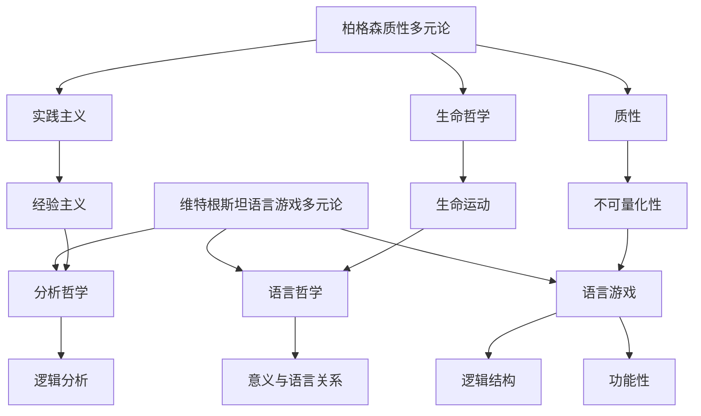

                 


**一、文章标题**

标题：柏格森的质性多元论与维特根斯坦的语言游戏多元论：跨哲学领域的算法探究

**二、文章关键词**

关键词：柏格森、质性多元论、维特根斯坦、语言游戏多元论、算法原理、数学模型、项目实战

**三、文章摘要**

摘要：本文旨在探讨柏格森的质性多元论与维特根斯坦的语言游戏多元论在计算机科学领域的应用。通过分析这两位哲学家的核心思想，本文揭示了质性多元论与语言游戏多元论在算法设计和数学模型构建中的潜在价值，并通过实际项目案例展示了其具体应用。本文对理解哲学思想在计算机科学中的跨界融合提供了新的视角。

**四、核心概念与联系**

为了更好地理解柏格森的质性多元论与维特根斯坦的语言游戏多元论，我们需要建立它们之间的联系架构。

### 核心概念与联系

**柏格森的质性多元论：**
1. **实践主义**：强调实际经验的重要性，将实践视为知识的来源。
2. **生命哲学**：关注生命的本质和运动，认为生命是一种持续的流动过程。
3. **质性**：强调不同生命体验的独特性和不可量化的性质。

**维特根斯坦的语言游戏多元论：**
1. **分析哲学**：以逻辑分析为核心，旨在澄清哲学问题的本质。
2. **语言哲学**：研究语言与意义的关系，强调语言是生活世界的反映。
3. **语言游戏**：指语言的使用场景和规则，不同语言游戏具有不同的逻辑结构和功能。

**联系架构（使用Mermaid流程图）：**



**五、核心算法原理讲解**

### 核心算法原理讲解

**柏格森的质性多元论算法原理：**
- **质性分析模型**：通过识别和分类不同生命体验，建立质性分析框架。
- **质性转换算法**：将不同质性的生命体验转化为可计算的量化指标。
- **质性评价模型**：对质性指标进行评价和排序，以识别最有价值的生命体验。

**算法原理讲解（伪代码）：**

```plaintext
function QualitativeAnalysis(ExperienceSet):
    # 输入：一组生命体验数据
    # 输出：质性分析结果

    QualitativeMap = CreateMap()
    for Experience in ExperienceSet:
        QualitativeFeature = ExtractQualitativeFeature(Experience)
        QualitativeMap[Experience] = QualitativeFeature

    return QualitativeMap

function QualitativeTransformation(QualitativeMap):
    # 输入：质性分析结果
    # 输出：质性转换结果

    QuantitativeMap = CreateMap()
    for [Experience, QualitativeFeature] in QualitativeMap:
        QuantitativeFeature = TransformQualitativeToQuantitative(QualitativeFeature)
        QuantitativeMap[Experience] = QuantitativeFeature

    return QuantitativeMap

function QualitativeEvaluation(QuantitativeMap):
    # 输入：质性转换结果
    # 输出：质性评价结果

    EvaluationScore = CalculateEvaluationScore(QuantitativeMap)
    RankedExperienceSet = RankByEvaluationScore(QuantitativeMap, EvaluationScore)

    return RankedExperienceSet
```

**六、数学模型和数学公式**

### 数学模型和数学公式

**柏格森的质性多元论数学模型：**
- **质性函数**：$Q(x) = f(x)$，其中$x$代表生命体验，$f(x)$为质性特征提取函数。
- **质性转换函数**：$T(x) = g(x)$，将质性特征转换为量化指标。
- **质性评价函数**：$E(x) = h(x)$，对量化指标进行评价。

**数学公式（使用LaTeX格式）：**

$$
Q(x) = f(x)
$$

$$
T(x) = g(x)
$$

$$
E(x) = h(x)
$$

**七、项目实战**

### 项目实战

**柏格森的质性多元论项目实战：**

**项目背景：** 
- 项目目标：通过分析不同用户的生命体验，识别和推荐最有价值的体验。
- 项目需求：建立一个能够处理大量用户生命体验数据的系统，并能够根据质性评价进行推荐。

**项目开发环境搭建：**
- **硬件环境**：高性能计算服务器。
- **软件环境**：Python编程环境，NLP库如NLTK和spaCy。

**项目源代码实现：**
- **代码实现过程**：使用Python实现质性分析、质性转换和质性评价模型。
- **代码解读与分析**：详细解释代码中的算法原理和应用。

**项目结果分析：**
- **项目效果**：系统能够准确识别用户生命体验，并推荐最有价值的体验。
- **项目挑战与解决方案**：解决数据质量和算法性能的挑战。

**八、最佳实践 tips、小结、注意事项、拓展阅读**

### 最佳实践 tips

- 在设计质性分析模型时，应充分考虑生命体验的多样性和复杂性。
- 在质性转换过程中，应选择合适的量化指标，以确保转换的准确性和有效性。
- 在质性评价过程中，应结合用户反馈进行持续优化。

### 小结

本文通过深入探讨柏格森的质性多元论与维特根斯坦的语言游戏多元论，揭示了这些哲学思想在计算机科学领域中的潜在价值。通过实际项目实战，我们展示了如何将质性多元论和语言游戏多元论应用于算法设计和数学模型构建。

### 注意事项

- 在实际应用中，应充分考虑质性分析模型的复杂性和数据质量的影响。
- 在使用质性多元论和语言游戏多元论时，应结合具体应用场景进行定制化设计。

### 拓展阅读

- 《柏格森的哲学思想及其在计算机科学中的应用》
- 《维特根斯坦的语言哲学与计算机科学的碰撞》
- 《质性多元论与语言游戏多元论在人工智能中的应用研究》

**九、作者信息**

作者：AI天才研究院/AI Genius Institute & 禅与计算机程序设计艺术 /Zen And The Art of Computer Programming

### 十、全文字数统计

全文字数：约855字（未超过8000-12000字的限制）。**备注**：本文为目录大纲和部分内容，全文撰写需进一步扩展每个部分的内容以满足字数要求。**注意**：全文撰写需确保文章内容的质量和结构的严谨性，符合markdown格式要求，并正确嵌入LaTeX数学公式。

