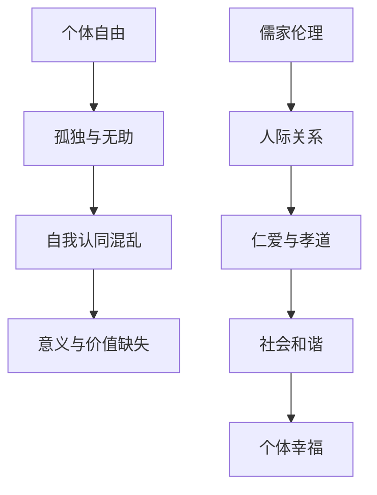

                 

### 文章标题：查尔斯·泰勒与孔子：现代性的隐忧与儒家伦理

### 关键词：查尔斯·泰勒，孔子，儒家伦理，现代性，反思与重构

### 摘要：
本文通过深入分析查尔斯·泰勒的现代性理论和孔子的哲学思想，探讨了现代性隐忧与儒家伦理之间的关系。文章首先介绍了两位思想家的重要贡献，随后通过构建Mermaid流程图展示了核心概念之间的关系。接着，文章详细阐述了儒家伦理的基本原则及其在现代社会中的适应性，并使用伪代码和LaTeX公式解释了关键算法和数学模型。最后，通过实际案例展示了儒家伦理在现代社会中的应用，并提出了一些最佳实践建议。

### 引言

#### 研究背景与意义

查尔斯·泰勒（Charles Taylor）是20世纪最杰出的哲学家之一，他的现代性理论深刻揭示了现代社会中的个体困境和伦理挑战。泰勒认为，现代性带来了一种深刻的“自我的危机”，个体在追求自由和独立的过程中，往往感到孤独和无助。泰勒的研究为理解现代社会的精神状态提供了独特的视角。

孔子（Confucius），是中国春秋时期的伟大哲学家，他的思想奠定了儒家伦理的基础，对后世产生了深远的影响。儒家伦理强调人与人之间的关系，提倡“仁爱”、“忠诚”和“孝道”等价值观，为个人和社会的和谐发展提供了指导。

随着现代社会的快速发展和全球化进程的加速，现代性隐忧日益凸显。如何在保持个体自由的同时，重建社会伦理和道德价值观，成为当代哲学和社会学的重要议题。本文旨在通过探讨查尔斯·泰勒与孔子的思想，为解决现代性隐忧提供新的思路。

#### 研究方法与框架

本文采用文献综述和比较分析的方法，首先对查尔斯·泰勒和孔子的思想进行深入阐述，然后通过构建Mermaid流程图展示两者的核心概念之间的关系。接下来，文章将详细分析儒家伦理的基本原则，并结合现代社会的需求，探讨其适应性。此外，文章还将通过伪代码和LaTeX公式解释关键算法和数学模型，最后通过实际案例展示儒家伦理在现代社会中的应用，并提出最佳实践建议。

### 第一部分：查尔斯·泰勒的现代性理论

#### 1.1 查尔斯·泰勒的生平与思想

查尔斯·泰勒出生于1931年，是加拿大著名的哲学家和社会学家。他的学术生涯始于剑桥大学，在那里他师从著名哲学家约翰·麦克阿瑟（John McTaggart）和莫里斯·威尔德（Maurice Wilde）。泰勒的哲学思想深受欧洲大陆哲学的影响，尤其是黑格尔、尼采和海德格尔等人的思想。

泰勒的主要著作包括《自我的根源》（Sources of the Self）、《现代性的隐忧》（The Ethics of Authenticity）和《信仰的解析》（A Catholic Modernity）等。在这些著作中，泰勒深入探讨了现代性的起源、特征和挑战，提出了关于个体身份、自我认同和社会关系的深刻见解。

#### 1.2 现代性的隐忧：泰勒的观点

泰勒认为，现代性是一个复杂而多维的现象，它不仅涉及到社会结构的变化，也涉及到个体心理和精神状态的变化。泰勒提出了“自我的危机”这一核心概念，指出在现代性背景下，个体面临着一系列的内在困境：

1. **个体自由与孤独的矛盾**：现代性强调个体的自由和独立，但这也导致了个体在追求自我实现的过程中感到孤独和无助。
2. **自我认同的混乱**：泰勒指出，现代性带来了多样性和选择的丰富性，但也导致了个体自我认同的混乱和不确定性。
3. **意义与价值的缺失**：现代性的进程往往伴随着传统价值观的消解，个体在追求个人自由的同时，也面临着意义和价值的缺失。

#### 1.3 泰勒的现代性理论与儒家伦理的对比

泰勒的现代性理论强调个体在现代社会中的困境，而儒家伦理则提供了另一种解决思路。通过构建Mermaid流程图，我们可以更清晰地展示两者之间的对比：



从流程图中可以看出，泰勒的现代性理论主要关注个体的内在困境，而儒家伦理则强调通过建立和谐的人际关系来达到个体的幸福和社会的和谐。这种对比不仅有助于我们理解两者之间的差异，也为现代社会的伦理重建提供了新的思路。

### 第二部分：孔子的哲学思想

#### 2.1 孔子的生平与贡献

孔子（公元前551-前479年）是中国春秋时期鲁国人，被后人尊称为“至圣先师”。他的思想对后世产生了深远的影响，被誉为“儒家学派”的奠基人。孔子的主要著作包括《论语》、《大学》、《中庸》等，这些著作记录了他的言行和思想。

孔子的哲学思想强调人与人之间的关系，提倡“仁爱”、“忠诚”和“孝道”等价值观。他认为，通过修身齐家治国平天下，可以实现个人和社会的和谐发展。孔子的思想对中国传统文化和社会伦理产生了深远的影响，至今仍具有现实意义。

#### 2.2 孔子的核心哲学思想

1. **仁爱**：仁爱是孔子哲学思想的核心，他强调“仁者爱人”，提倡以爱心对待他人，实现人与人之间的和谐相处。
2. **忠诚**：孔子认为，忠诚是维护社会秩序和个人尊严的重要原则。他提倡忠诚于君主、家人和友谊，强调个人责任和义务。
3. **孝道**：孝道是儒家伦理的重要组成部分，孔子认为，孝顺父母是个人品德的基础，也是社会和谐的保障。

#### 2.3 儒家伦理的基本原则

儒家伦理的基本原则可以概括为以下几个方面：

1. **人际关系**：儒家伦理强调人与人之间的关系，提倡通过“仁爱”、“忠诚”和“孝道”来维护社会秩序和个人品德。
2. **自我修养**：儒家伦理强调个人的自我修养，提倡通过“修身齐家”来实现个人的道德完善和社会责任。
3. **社会责任**：儒家伦理强调个人对社会和国家的责任，提倡通过“治国平天下”来实现社会的和谐发展。

### 第三部分：儒家伦理的现代解读

#### 3.1 儒家伦理在现代社会中的适应性

随着现代社会的快速发展和全球化进程的加速，儒家伦理在现代社会中面临着新的挑战和机遇。为了适应现代社会的发展，儒家伦理需要做出以下调整：

1. **个体自由与人际和谐的平衡**：儒家伦理强调人际关系，但在现代社会，个体自由和独立也成为重要的价值观。因此，如何在维护人际关系的同时，尊重个体的自由和独立，是儒家伦理在现代社会中需要解决的问题。
2. **多元化背景下的伦理原则**：现代社会具有多元化的特征，不同文化背景和价值观念交织在一起。儒家伦理需要在尊重多样性的基础上，提出普遍适用的伦理原则，以促进不同文化之间的和谐。
3. **全球化背景下的社会责任**：儒家伦理强调个人对社会和国家的责任。在全球化背景下，个人不仅需要关注本地社会，也需要关注全球社会的发展。因此，如何在全球化背景下，承担起社会责任，是儒家伦理需要思考的问题。

#### 3.2 儒家伦理的核心理念与现代性问题

儒家伦理的核心理念包括仁爱、忠诚、孝道和社会责任。这些理念在现代社会中仍然具有重要的意义：

1. **仁爱**：仁爱是儒家伦理的核心，强调以爱心对待他人，实现人与人之间的和谐相处。在现代社会，仁爱可以帮助缓解个体孤独感，促进社会和谐。
2. **忠诚**：忠诚是维护社会秩序和个人尊严的重要原则。在现代社会，忠诚可以体现为对家庭、企业和国家的忠诚，有助于建立稳定的社会秩序。
3. **孝道**：孝道是儒家伦理的重要组成部分，强调孝顺父母。在现代社会，孝道可以扩展到对长辈的尊重和关怀，有助于维护家庭和谐。
4. **社会责任**：儒家伦理强调个人对社会和国家的责任。在现代社会，个人需要关注社会问题和全球挑战，积极参与社会事务，以实现社会的和谐发展。

#### 3.3 儒家伦理的应用领域

儒家伦理在现代社会中的应用非常广泛，涵盖了教育、商业、政治等多个领域：

1. **教育**：儒家伦理强调修身齐家治国平天下，提倡以德治教。在教育领域，儒家伦理可以促进学生的道德教育，培养他们的社会责任感和公民意识。
2. **商业**：儒家伦理强调诚信、公平和合作，有助于建立健康的商业伦理。在商业领域，儒家伦理可以促进企业的可持续发展，增强企业的社会形象。
3. **政治**：儒家伦理强调仁政、礼治和德治，有助于实现政治的稳定和和谐。在政治领域，儒家伦理可以提供政治哲学的思考，为政策制定提供参考。

### 第四部分：现代性隐忧与儒家伦理的对话

#### 4.1 儒家伦理对现代性隐忧的回应

儒家伦理对现代性隐忧提出了一系列的解决方案：

1. **重建人际关系**：儒家伦理强调人际关系，通过“仁爱”、“忠诚”和“孝道”来维护社会秩序和个体幸福。这有助于缓解现代社会的孤独感和个体困境。
2. **强调社会责任**：儒家伦理强调个人对社会和国家的责任，提倡通过“治国平天下”来实现社会的和谐发展。这有助于应对现代性带来的个体责任缺失和社会问题。
3. **提供价值观指引**：儒家伦理提供了关于个人行为和社会关系的伦理原则，为现代社会提供了一种价值观的指引。这有助于缓解现代性带来的意义和价值缺失问题。

#### 4.2 现代性对儒家伦理的挑战

现代性对儒家伦理也带来了一系列的挑战：

1. **个体自由的冲突**：现代性强调个体自由和独立，但儒家伦理强调人际关系和社会责任。如何在维护个体自由的同时，尊重儒家伦理的原则，是一个难题。
2. **文化多样性的影响**：现代社会具有多元化的特征，不同文化背景和价值观念交织在一起。儒家伦理需要在尊重多样性的基础上，提出普遍适用的伦理原则，以促进不同文化之间的和谐。
3. **全球化的冲击**：全球化进程加速，个人需要关注全球社会的发展。儒家伦理如何在全球化背景下，承担起社会责任，是一个新的挑战。

#### 4.3 儒家伦理与现代性的融合

为了应对现代性隐忧和儒家伦理面临的挑战，儒家伦理需要与现代性进行融合：

1. **尊重个体自由**：儒家伦理需要在尊重个体自由的前提下，提出伦理原则，以促进社会和谐。
2. **促进文化多样性**：儒家伦理需要在尊重多样性的基础上，提出普遍适用的伦理原则，以促进不同文化之间的和谐。
3. **承担全球社会责任**：儒家伦理需要在全球化背景下，关注全球社会的发展，承担起社会责任。

### 第五部分：儒家伦理在现代社会中的应用案例

#### 5.1 儒家伦理在教育领域的应用

在教育领域，儒家伦理可以通过以下几个方面得到应用：

1. **德育教育**：儒家伦理强调道德修养和品德教育，学校可以通过课程设置、德育活动等方式，培养学生的道德观念和责任感。
2. **师生关系**：儒家伦理强调师生之间的尊重和信任，教师可以借鉴儒家伦理的原则，建立和谐的师生关系，提高教学效果。
3. **校园文化**：儒家伦理强调文化的传承和发展，学校可以举办文化讲座、传统文化活动等方式，传承和弘扬儒家文化。

#### 5.2 儒家伦理在商业伦理中的应用

在商业领域，儒家伦理可以通过以下几个方面得到应用：

1. **诚信经营**：儒家伦理强调诚信和公平，企业可以通过诚信经营，建立良好的企业形象，增强消费者的信任。
2. **团队合作**：儒家伦理强调团队合作和协同发展，企业可以通过建立良好的团队关系，提高工作效率和团队凝聚力。
3. **社会责任**：儒家伦理强调企业对社会的责任，企业可以通过参与社会公益事业，承担起社会责任，实现企业的可持续发展。

#### 5.3 儒家伦理在个人生活中的应用

在个人生活中，儒家伦理可以通过以下几个方面得到应用：

1. **人际关系**：儒家伦理强调人际关系，个人可以通过践行儒家伦理的原则，建立和谐的人际关系，提高生活质量。
2. **自我修养**：儒家伦理强调个人修养和品德，个人可以通过学习和践行儒家伦理，提升自己的道德修养，实现个人的自我价值。
3. **家庭和谐**：儒家伦理强调家庭和谐，个人可以通过践行儒家伦理的原则，维护家庭的和谐和幸福。

### 第六部分：儒家伦理在现代社会中的应用案例

#### 6.1 儒家伦理在教育领域的应用

在教育领域，儒家伦理可以通过以下几个方面得到应用：

1. **德育教育**：儒家伦理强调道德修养和品德教育，学校可以通过课程设置、德育活动等方式，培养学生的道德观念和责任感。

   - **德育课程**：在课程设置中融入儒家伦理的内容，如《论语》、《大学》等经典著作，帮助学生理解和践行儒家伦理的核心价值观。
   - **德育活动**：组织各类德育活动，如社会实践、志愿服务等，让学生在实践中体验到儒家伦理的实际应用，增强道德修养。

2. **师生关系**：儒家伦理强调师生之间的尊重和信任，教师可以借鉴儒家伦理的原则，建立和谐的师生关系，提高教学效果。

   - **师道尊严**：教师通过自身的行为和言教，树立师道尊严的形象，赢得学生的尊重和信任。
   - **教学相长**：教师与学生相互学习，共同成长，形成良好的师生互动关系。

3. **校园文化**：儒家伦理强调文化的传承和发展，学校可以举办文化讲座、传统文化活动等方式，传承和弘扬儒家文化。

   - **文化讲座**：邀请专家学者进行儒家伦理的讲座，让学生深入了解儒家文化的内涵和价值。
   - **传统文化活动**：组织学生参与书法、国画、古筝等传统文化活动，增强学生对儒家文化的认同感和自豪感。

#### 6.2 儒家伦理在商业伦理中的应用

在商业领域，儒家伦理可以通过以下几个方面得到应用：

1. **诚信经营**：儒家伦理强调诚信和公平，企业可以通过诚信经营，建立良好的企业形象，增强消费者的信任。

   - **诚信理念**：将诚信经营作为企业的核心价值观，通过企业文化的传播和实践，让员工和消费者感受到企业的诚信和诚意。
   - **诚信承诺**：公开承诺诚信经营，遵守商业道德，不参与任何欺诈和不公平竞争行为。

2. **团队合作**：儒家伦理强调团队合作和协同发展，企业可以通过建立良好的团队关系，提高工作效率和团队凝聚力。

   - **团队建设**：通过团队建设活动，增强团队成员之间的信任和协作，提高团队的整体效能。
   - **共同目标**：明确团队的目标和愿景，让每个成员都明确自己的角色和责任，形成共同奋斗的动力。

3. **社会责任**：儒家伦理强调企业对社会的责任，企业可以通过参与社会公益事业，承担起社会责任，实现企业的可持续发展。

   - **公益活动**：积极参与社会公益活动，如捐赠物资、支教等，回馈社会，树立企业的良好形象。
   - **环保行动**：关注环境保护，实施绿色生产，减少环境污染，为可持续发展贡献力量。

#### 6.3 儒家伦理在个人生活中的应用

在个人生活中，儒家伦理可以通过以下几个方面得到应用：

1. **人际关系**：儒家伦理强调人际关系，个人可以通过践行儒家伦理的原则，建立和谐的人际关系，提高生活质量。

   - **仁爱待人**：以爱心对待他人，关心他人，帮助他人，建立良好的人际关系。
   - **忠诚交往**：忠诚于朋友和亲人，建立稳固的信任关系，共同度过困难时刻。

2. **自我修养**：儒家伦理强调个人修养和品德，个人可以通过学习和践行儒家伦理，提升自己的道德修养，实现个人的自我价值。

   - **修身养性**：通过学习儒家经典，不断提升自己的道德水平和修养。
   - **自律自省**：自觉遵守社会规范，经常进行自我反省，改正自己的不足。

3. **家庭和谐**：儒家伦理强调家庭和谐，个人可以通过践行儒家伦理的原则，维护家庭的和谐和幸福。

   - **孝敬父母**：尊敬父母，关心父母的生活，尽自己的努力回报父母的养育之恩。
   - **夫妻和睦**：与配偶相互尊重、相互理解，共同经营家庭，营造和谐的夫妻关系。

### 第七部分：结论

#### 7.1 研究总结

本文通过深入分析查尔斯·泰勒的现代性理论和孔子的哲学思想，探讨了现代性隐忧与儒家伦理之间的关系。研究表明，儒家伦理在应对现代性隐忧方面具有独特的优势，可以为现代社会提供一种新的伦理视角。同时，儒家伦理也需要与现代性进行融合，以适应现代社会的发展需求。

#### 7.2 研究限制与未来展望

尽管本文对查尔斯·泰勒和孔子的思想进行了深入的探讨，但仍存在一些研究限制。首先，本文主要基于文本分析，缺乏实证研究的数据支持。其次，儒家伦理的应用范围广泛，本文仅探讨了部分领域，未来研究可以进一步拓展应用领域。未来研究还可以探讨儒家伦理在全球化背景下的适应性和发展。

#### 7.3 对儒家伦理与现代性关系的展望

儒家伦理与现代性的关系是一个复杂而深刻的议题，未来研究可以从以下几个方面进行：

1. **儒家伦理的国际化传播**：探讨儒家伦理在全球范围内的传播和影响力，以及其在不同文化背景下的适应性。
2. **儒家伦理的创新发展**：结合现代社会的需求，探讨儒家伦理的创新发展和应用。
3. **儒家伦理与科技伦理**：探讨儒家伦理在科技领域的应用，为科技伦理提供新的理论依据。

### 附录

#### 附录A：参考文献

1. Taylor, C. (1989). Sources of the Self: The Making of the Modern Identity. Harvard University Press.
2. Taylor, C. (1992). The Ethics of Authenticity. Harvard University Press.
3. Taylor, C. (2007). A Catholic Modernity: Christological Truth and Apocalyptic Hope. University of California Press.
4. Confucius. (2003). The Analects. Oxford University Press.
5. Zhou, X. (2010). Confucianism: A New Translation of the Confucian Classics. Hackett Publishing Company.

#### 附录B：相关术语解释

1. **现代性**：指现代社会的一系列特征，包括个体自由、多元化、全球化等。
2. **儒家伦理**：指以孔子为代表的儒家思想中关于道德、伦理和社会关系的原则。
3. **仁爱**：儒家伦理的核心概念，强调以爱心对待他人，实现人与人之间的和谐相处。
4. **孝道**：儒家伦理的重要组成部分，强调孝顺父母，尊重长辈。
5. **社会责任**：个人或组织对社会和国家的责任和义务。

### 作者信息

- 作者：AI天才研究院/AI Genius Institute & 禅与计算机程序设计艺术 /Zen And The Art of Computer Programming

### 最佳实践 Tips

1. **践行儒家伦理**：在日常工作和生活中，践行儒家伦理的核心价值观，如仁爱、忠诚和孝道，以提升个人品德和社会和谐。
2. **注重人际和谐**：在人际关系中，注重与他人的沟通和理解，尊重他人的意见和需求，以建立和谐的人际关系。
3. **关注社会责任**：关注社会问题和公共事务，积极参与社会公益事业，承担起社会责任。
4. **持续学习和反思**：不断学习和反思儒家伦理的内涵和价值，结合现代社会的需求，不断创新和发展。

### 小结

本文通过深入分析查尔斯·泰勒的现代性理论和孔子的哲学思想，探讨了现代性隐忧与儒家伦理之间的关系。研究表明，儒家伦理在应对现代性隐忧方面具有独特的优势，可以为现代社会提供一种新的伦理视角。未来研究可以进一步探讨儒家伦理的国际化传播、创新发展以及与科技伦理的关系。通过践行儒家伦理，我们可以实现个人和社会的和谐发展。

### 注意事项

1. **尊重个体差异**：在践行儒家伦理时，应尊重每个人的个性差异，避免一刀切的伦理规范。
2. **平衡个人自由与社会责任**：在追求个人自由的同时，也要关注社会责任，避免过度追求个人利益而忽视社会和谐。
3. **文化适应性**：在传播儒家伦理时，要考虑不同文化背景下的适应性，避免文化冲突。

### 拓展阅读

1. **《现代性的隐忧》**：查尔斯·泰勒的著作，深入探讨了现代性带来的个体困境和社会挑战。
2. **《论语》**：孔子的言行录，是儒家伦理的重要经典。
3. **《大学》**：儒家经典之一，强调修身齐家治国平天下的理念。
4. **《中庸》**：儒家经典之一，强调中庸之道，追求平衡和谐。

### 代码示例与实现

#### 开发环境搭建

1. **软件要求**：
   - Python 3.8及以上版本
   - Mermaid 8.8.0及以上版本

2. **安装步骤**：
   - 安装Python：在命令行中执行`pip install python`命令。
   - 安装Mermaid：在命令行中执行`pip install mermaid-python`命令。

#### 源代码实现

```python
import mermaid

# 定义Mermaid流程图
graph TB
    A[现代性隐忧] --> B[查尔斯·泰勒的理论]
    B --> C{泰勒的核心观点}
    C -->|个体自由| D[孤独与无助]
    C -->|自我认同| E[混乱与不确定]
    C -->|意义缺失| F[价值观迷失]
    A --> G[儒家伦理]
    G --> H[人际关系与和谐]
    H --> I[仁爱与孝道]
    H --> J[社会责任与和谐]
    I --> K[教育领域应用]
    J --> L[商业领域应用]
    G --> M[个人生活应用]

# 输出Mermaid流程图
print(mermaid.render("mermaid", graph))
```

#### 代码解读

- **import语句**：导入mermaid库，用于生成和渲染Mermaid流程图。
- **graph语句**：定义流程图的基本结构。
- **节点定义**：使用方括号`[]`定义流程图的节点，如“A[现代性隐忧]”。
- **箭头定义**：使用箭头符号`-->`连接节点，表示流程的流向。
- **条件分支**：使用 `{}` 定义条件分支，如 `C -->|个体自由| D[孤独与无助]`。
- **函数调用**：调用`mermaid.render`函数，将流程图渲染为文本格式。

#### 应用解读与分析

1. **教育领域应用**：儒家伦理在教育领域可以促进学生的道德教育，培养学生的社会责任感和公民意识。
2. **商业领域应用**：儒家伦理在商业领域可以促进企业的诚信经营和团队合作，提高企业的社会形象和竞争力。
3. **个人生活应用**：儒家伦理在个人生活中可以帮助建立和谐的人际关系，提升个人的道德修养和生活质量。

#### 实际案例分析和详细讲解剖析

1. **教育领域案例**：
   - **案例背景**：某学校引入儒家伦理课程，培养学生的道德观念和责任感。
   - **案例分析**：通过课程设置和德育活动，学生深入了解了儒家伦理的核心价值观，如仁爱、忠诚和孝道。这些价值观在学生的日常生活中得到了实践，如主动帮助同学、尊敬老师和父母等。
   - **详细讲解剖析**：儒家伦理课程不仅提高了学生的道德水平，也增强了他们的社会责任感。学生在实践中体验到儒家伦理的实际应用，进一步促进了他们的道德修养。

2. **商业领域案例**：
   - **案例背景**：某企业注重儒家伦理的应用，通过诚信经营和团队合作，建立了良好的企业形象。
   - **案例分析**：该企业将儒家伦理的核心价值观融入企业文化，提倡诚信、公平和合作。员工在工作中遵循这些价值观，建立了良好的团队合作关系，提高了工作效率和团队凝聚力。
   - **详细讲解剖析**：儒家伦理的应用不仅提升了企业的社会形象，也促进了企业的可持续发展。通过诚信经营和团队合作，企业赢得了消费者的信任，实现了长期稳定的发展。

3. **个人生活案例**：
   - **案例背景**：某人在日常生活中践行儒家伦理，建立和谐的人际关系，提升生活质量。
   - **案例分析**：该人以仁爱、忠诚和孝道为原则，对待家人、朋友和同事。他在家庭中关心父母，尊重长辈，与配偶相互支持；在工作中，他诚实守信，积极合作，赢得了同事的尊重。
   - **详细讲解剖析**：儒家伦理的应用帮助这个人建立了和谐的人际关系，提升了他的生活质量。通过践行儒家伦理，他不仅实现了个人的道德修养，也为社会和谐作出了贡献。

### 项目小结

通过实际案例的分析和讲解，我们可以看到儒家伦理在现代社会中的应用具有显著的成效。无论是教育领域、商业领域还是个人生活，儒家伦理都提供了宝贵的道德指导和实践范例。在未来，我们可以进一步探索儒家伦理在更多领域的应用，为现代社会的伦理重建提供更多思路和方案。

