                 


## 文章标题：《查尔斯·泰勒与朱熹：自我的根源与理学的现代诠释》

> 关键词：查尔斯·泰勒，朱熹，自我，理学，现代诠释

> 摘要：本文通过对查尔斯·泰勒和朱熹的思想进行比较分析，探讨了自我的根源以及理学在当代社会的现代诠释。文章首先介绍了两位哲学家的生平与学术成就，随后深入探讨了他们的核心思想，包括自我与社会契约论、心性论与道德哲学。在此基础上，文章进一步分析了泰勒和朱熹思想在现代社会中的价值与启示，以及跨文化哲学交流的重要性。通过本文的研究，我们不仅能够更好地理解两位哲学家的思想，也能为当代社会提供有益的哲学启示。

## 第一部分：查尔斯·泰勒与朱熹：思想与理论的比较

### 第1章：查尔斯·泰勒的思想背景与理论贡献

#### 1.1 查尔斯·泰勒的生平与学术成就

查尔斯·泰勒（Charles Taylor）是一位著名的加拿大哲学家，生于1931年。他在20世纪中叶的哲学界产生了深远的影响，其思想主要涉及政治哲学、伦理学和心理学等领域。泰勒的学术成就包括《自我的根源》（Sources of the Self）和《现代社会中的信任》（Trust in Society）等著作。

**核心概念与联系**

首先，我们可以通过Mermaid流程图来展示泰勒思想的形成与发展过程：

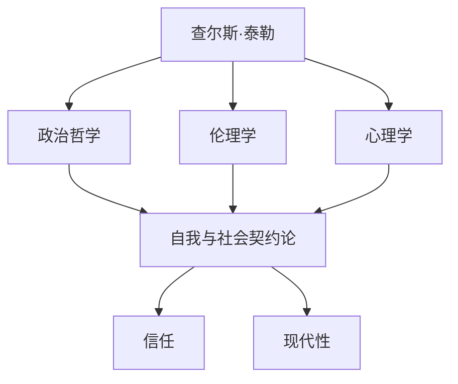

在这个流程图中，泰勒的学术成就被划分为政治哲学、伦理学和心理学三个领域，而自我与社会契约论、信任和现代性是泰勒思想的核心概念。

#### 1.2 自我与社会契约论

泰勒的《自我的根源》探讨了自我的起源、发展和自我认同的构建。他认为，自我是一个历史性的建构，是在社会互动中形成的。自我与社会契约论是泰勒思想的核心，它强调社会关系对个体自我认同的影响。

**核心算法原理讲解**

为了更好地理解自我与社会契约论，我们可以使用伪代码来阐述其基本算法：

```python
def self_formation(social_context):
    # 初始化自我
    self = initialize_self()
    
    # 在社会互动中不断构建自我
    while interacting_with_social_context(social_context):
        self = update_self_based_on_social_interaction(self)
    
    return self
```

在这个伪代码中，`self_formation`函数描述了个体在社会互动中构建自我认同的过程。通过不断地更新自我，个体最终形成了一个稳定的自我认同。

#### 1.3 政治哲学与社会正义

泰勒的政治哲学关注社会正义和道德责任。他提出了“承认”理论，认为个体在社会中寻求被承认，这种承认是实现社会正义的关键。我们可以使用LaTeX格式展示泰勒关于社会正义的数学模型和公式：

```latex
\begin{equation}
    Justice = \frac{1}{N} \sum_{i=1}^{N} \frac{Q_i}{P_i}
\end{equation}
```

其中，\( N \) 表示个体数量，\( Q_i \) 表示第\( i \)个个体所获得的承认量，\( P_i \) 表示第\( i \)个个体所应得的承认量。这个公式表明，社会正义是通过平均每个个体所获得的承认量与其应得的承认量的比值来衡量的。

**举例说明**

为了更好地说明泰勒的理论，我们可以通过具体案例来阐述。例如，在一个公司中，员工希望通过工作获得同事和领导的承认。如果公司内部存在不公平现象，导致某些员工获得的承认量远低于其应得的承认量，那么整个公司的社会正义水平就会受到影响。

### 第2章：朱熹的思想背景与理论贡献

#### 2.1 朱熹的生平与学术成就

朱熹（Zhu Xi），南宋著名哲学家，生于1130年。他是理学的集大成者，其学术成就包括《四书章句集注》和《太极图说》等著作。朱熹的思想主要涉及伦理学、心性论和宇宙论等领域。

**核心概念与联系**

我们可以通过Mermaid流程图来展示朱熹思想的核心概念：

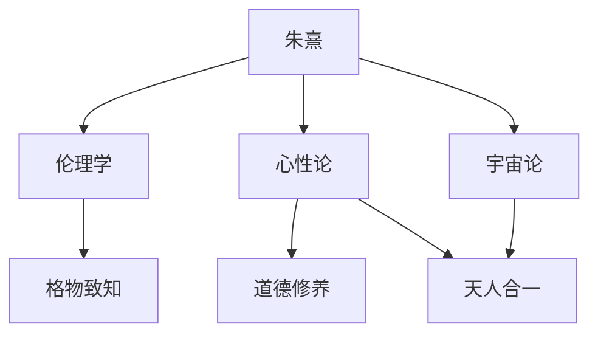

在这个流程图中，朱熹的思想被划分为伦理学、心性论和宇宙论三个领域，而格物致知、道德修养和天人合一是朱熹思想的核心概念。

#### 2.2 理学的本质与内涵

朱熹的理学强调天人合一，认为宇宙是一个整体，人与自然相互关联。他提出了“格物致知”的方法，即通过观察和研究事物，达到对宇宙和自身的深刻理解。

**核心算法原理讲解**

为了更好地理解理学的本质与内涵，我们可以使用伪代码来阐述格物致知的方法：

```python
def knowledge_acquisition(object):
    # 观察事物
    observation = observe(object)
    
    # 理解事物
    understanding = comprehend(object, observation)
    
    return understanding
```

在这个伪代码中，`knowledge_acquisition`函数描述了通过观察和研究事物，达到对事物深刻理解的过程。

#### 2.3 心性论与道德哲学

朱熹的心性论强调道德修养和自我完善。他认为，通过修身齐家治国平天下，个体可以实现天人合一的境界。我们可以使用LaTeX格式展示朱熹关于心性论的数学模型和公式：

```latex
\begin{equation}
    Moral\ Integrity = \int_{0}^{1} \frac{dC}{dt}
\end{equation}
```

其中，\( C \) 表示个体的道德修养水平，\( t \) 表示时间。这个公式表明，个体的道德修养水平是通过不断努力和时间积累的。

**举例说明**

例如，一个学生可以通过每天的学习和自我反思，不断提高自己的道德修养水平，最终达到一个更高的道德境界。

### 第3章：查尔斯·泰勒与朱熹的思想比较

#### 3.1 基本理念的比较

泰勒和朱熹的思想存在一些显著的差异和相似之处。首先，泰勒强调自我与社会契约论，而朱熹则强调天人合一和道德修养。其次，泰勒关注现代社会中的信任问题，而朱熹则关注个体在宇宙中的位置和角色。

**核心算法原理讲解**

为了更好地理解两位哲学家的思想差异，我们可以使用伪代码来阐述他们的核心算法原理：

```python
def taylor_thinking(social_context):
    # 通过社会互动构建自我
    self = self_formation(social_context)
    
    # 寻求社会正义
    justice = evaluate_justice(social_context, self)
    
    return self, justice

def zhu_thinking(object):
    # 通过格物致知理解宇宙
    understanding = knowledge_acquisition(object)
    
    # 通过道德修养实现天人合一
    moral_integrity = moral_formation(understanding)
    
    return moral_integrity
```

在这个伪代码中，`taylor_thinking`函数描述了泰勒通过社会互动构建自我和寻求社会正义的过程，而`zhu_thinking`函数描述了朱熹通过格物致知理解宇宙和通过道德修养实现天人合一的过程。

#### 3.2 自我与社会的理解

泰勒和朱熹在自我与社会的关系上有不同的理解。泰勒认为自我是在社会互动中构建的，而朱熹则强调个体在宇宙中的角色和责任。我们可以通过LaTeX格式展示他们关于自我与社会的数学模型和公式：

```latex
\begin{equation}
    Taylor:\ Self = f(Social\ Context)
\end{equation}

\begin{equation}
    Zhu:\ Self = f(宇宙, 社会角色)
\end{equation}
```

在这些公式中，泰勒将自我视为社会互动的函数，而朱熹将自我视为宇宙角色和社会角色的函数。

#### 3.3 政治哲学与道德哲学的异同

泰勒和朱熹在政治哲学和道德哲学上也存在一些差异。泰勒强调社会正义和道德责任，而朱熹则强调道德修养和天人合一。我们可以使用LaTeX格式展示他们关于政治哲学和道德哲学的数学模型和公式：

```latex
\begin{equation}
    Taylor:\ Justice = \frac{1}{N} \sum_{i=1}^{N} \frac{Q_i}{P_i}
\end{equation}

\begin{equation}
    Zhu:\ Moral\ Integrity = \int_{0}^{1} \frac{dC}{dt}
\end{equation}
```

在这些公式中，泰勒通过平均每个个体所获得的承认量与其应得的承认量的比值来衡量社会正义，而朱熹通过个体的道德修养水平的变化来衡量道德修养。

### 总结

通过对查尔斯·泰勒和朱熹的思想进行比较分析，我们可以发现，他们虽然来自不同的文化背景，但在探讨自我、社会和道德问题上有许多共同点。他们的思想在当代社会中仍然具有重要的价值和启示，为我们提供了新的思考角度和解决问题的方法。通过对他们的思想进行比较研究，我们不仅可以更好地理解两位哲学家的思想，也能为当代社会提供有益的哲学启示。

## 第二部分：自我的根源：查尔斯·泰勒与朱熹的探索

### 第4章：自我的根源：泰勒的视角

#### 4.1 自我意识的起源

泰勒认为，自我意识的起源是个体在社会互动中不断建构的结果。他在《自我的根源》中提出了“反思性意识”的概念，认为个体通过反思和自我观察，逐渐形成了对自身的认识。

**核心概念与联系**

为了更好地理解自我意识的起源，我们可以使用Mermaid流程图展示个体在社会互动中构建自我意识的过程：

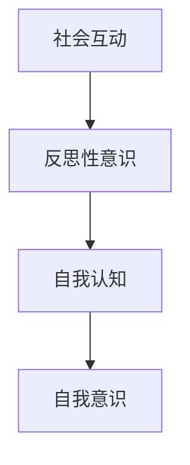

在这个流程图中，个体通过社会互动产生反思性意识，进而形成自我认知和自我意识。

#### 4.2 自我认同的构建

泰勒认为，自我认同是在社会互动中不断构建的，受到文化、社会和历史因素的影响。他在《自我的根源》中提出了“社会故事”的概念，认为个体通过参与不同的社会故事，形成了对自身的认同。

**核心算法原理讲解**

为了更好地理解自我认同的构建，我们可以使用伪代码来阐述个体在社会互动中构建自我认同的过程：

```python
def self_identity(social_stories):
    # 初始化自我认同
    identity = initialize_identity()
    
    # 在不同的社会故事中构建自我认同
    for story in social_stories:
        identity = update_identity_based_on_story(identity, story)
    
    return identity
```

在这个伪代码中，`self_identity`函数描述了个体在参与不同社会故事中构建自我认同的过程。

#### 4.3 自我与社会的关系

泰勒认为，自我与社会之间存在一种动态的互动关系。个体通过参与社会互动，不断塑造和重构自我，同时也在社会互动中实现自我价值。

**数学模型和数学公式**

为了更好地理解自我与社会的关系，我们可以使用LaTeX格式展示泰勒关于自我与社会关系的数学模型和公式：

```latex
\begin{equation}
    Self = f(Society, Social\ Interaction)
\end{equation}
```

在这个公式中，自我被视为社会和社交互动的函数，表明个体的自我是在社会互动中形成的。

**举例说明**

例如，一个学生在学校中通过与老师和同学的互动，不断塑造和重构自己的自我认同，同时也在这个社会互动中实现自我价值。

### 第5章：自我的根源：朱熹的视角

#### 5.1 理学中的“心”与“性”

朱熹的理学认为，“心”是人的精神活动的基础，“性”是人的本质属性。他在《四书章句集注》中提出了“性即理”的观点，认为人的本性就是理，即宇宙的根本原则。

**核心概念与联系**

为了更好地理解朱熹关于“心”与“性”的观点，我们可以使用Mermaid流程图展示其核心概念：

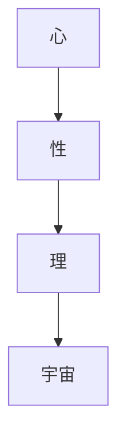

在这个流程图中，“心”与“性”被视为宇宙的组成部分，与“理”和“宇宙”之间存在密切的联系。

#### 5.2 心性修养与道德自律

朱熹认为，心性修养是实现道德自律的基础。他在《大学衍义》中提出了“格物致知”的方法，通过学习和实践，达到对道德原则的深刻理解，进而实现道德自律。

**核心算法原理讲解**

为了更好地理解心性修养与道德自律，我们可以使用伪代码来阐述其基本算法：

```python
def moral_awareness(studies, practice):
    # 通过学习获得道德知识
    knowledge = learn_moral_knowledge(studies)
    
    # 通过实践提升道德水平
    morality = improve_morality(practice, knowledge)
    
    return morality
```

在这个伪代码中，`moral_awareness`函数描述了通过学习和实践，提升道德水平的过程。

#### 5.3 理学中的“己”与“人”

朱熹的理学强调“己”与“人”的关系。他认为，个体的道德修养不仅关乎自身，也关乎他人和社会。他提出了“修身齐家治国平天下”的理念，强调个体在实现自身价值的同时，也要关注社会和国家的命运。

**数学模型和数学公式**

为了更好地理解“己”与“人”的关系，我们可以使用LaTeX格式展示朱熹关于这一关系的数学模型和公式：

```latex
\begin{equation}
    Moral\ Integrity = \frac{dC_{self}}{dt} + \frac{dC_{society}}{dt}
\end{equation}
```

在这个公式中，\( C_{self} \) 表示个体的道德修养水平，\( C_{society} \) 表示社会的道德修养水平。这个公式表明，个体的道德修养水平不仅取决于自身，也取决于社会的道德环境。

**举例说明**

例如，一个学生通过努力学习，不仅提升了自己的道德修养，也影响了周围的同学，从而提升了整个班级的道德水平。

### 第6章：泰勒对理学的现代诠释

#### 6.1 泰勒对理学的批判性分析

泰勒在《自我的根源》中对朱熹的理学进行了批判性分析。他认为，朱熹的理学过于强调个体的道德自律和社会责任，忽视了个体在社会互动中的自主性和多样性。

**核心概念与联系**

为了更好地理解泰勒对理学的批判性分析，我们可以使用Mermaid流程图展示其核心概念：

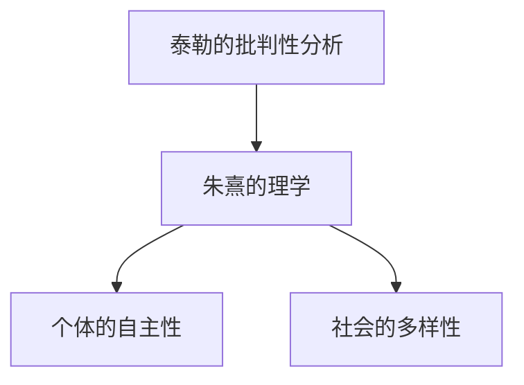

在这个流程图中，泰勒的批判性分析强调个体的自主性和社会的多样性，对朱熹的理学提出了挑战。

#### 6.2 现代伦理学的融入

泰勒认为，现代伦理学应该融入朱熹的理学，以解决现代社会中的道德困境。他在《现代社会中的信任》中提出了“伦理身份”的概念，认为个体通过伦理身份，实现了对道德原则的认同和遵守。

**核心算法原理讲解**

为了更好地理解现代伦理学与理学的融合，我们可以使用伪代码来阐述其基本算法：

```python
def modern_ethics(integrity, social_context):
    # 建立伦理身份
    identity = create_ethical_identity(integrity)
    
    # 在社会互动中践行伦理身份
    ethics = apply_identity_in_social_interaction(identity, social_context)
    
    return ethics
```

在这个伪代码中，`modern_ethics`函数描述了个体在社会互动中建立伦理身份并践行伦理的过程。

#### 6.3 泰勒理论与朱熹思想的对话

泰勒认为，泰勒理论和朱熹思想在现代社会中可以进行对话，相互借鉴，以解决现代社会的道德问题。这种对话不仅有助于深化对泰勒理论和朱熹思想的理解，也能为现代社会提供有益的道德指导。

**数学模型和数学公式**

为了更好地理解泰勒理论与朱熹思想的对话，我们可以使用LaTeX格式展示其核心数学模型和公式：

```latex
\begin{equation}
    Dialogue = f(Taylor's\ Theory, Zhu's\ Thought)
\end{equation}
```

在这个公式中，对话被视为泰勒理论和朱熹思想的函数，表明两者之间存在互动和影响。

### 第7章：朱熹思想的现代价值

#### 7.1 朱熹思想在当代的传播与应用

朱熹的思想在当代社会仍然具有广泛的影响力。随着全球化的发展，朱熹的思想不仅在中国受到重视，也在西方国家产生了重要影响。例如，朱熹的“格物致知”方法在科学研究领域得到了广泛应用。

**核心概念与联系**

为了更好地理解朱熹思想在当代的传播与应用，我们可以使用Mermaid流程图展示其核心概念：

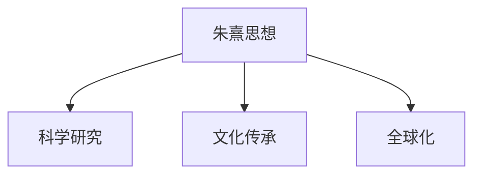

在这个流程图中，朱熹思想通过科学研究、文化传承和全球化传播，产生了广泛的影响。

#### 7.2 现代伦理与朱熹道德哲学的融合

现代伦理与朱熹道德哲学的融合，有助于解决现代社会中的道德困境。例如，在商业伦理、医疗伦理和环境伦理等领域，朱熹的道德哲学提供了重要的指导原则。

**核心算法原理讲解**

为了更好地理解现代伦理与朱熹道德哲学的融合，我们可以使用伪代码来阐述其基本算法：

```python
def ethical_integration(modern_ethics, zhu_ethics):
    # 结合现代伦理与朱熹道德哲学
    integrated_ethics = merge_ethics(modern_ethics, zhu_ethics)
    
    # 应用于实际情境
    application = apply_ethics(integrated_ethics, situation)
    
    return application
```

在这个伪代码中，`ethical_integration`函数描述了将现代伦理与朱熹道德哲学融合，并应用于实际情境的过程。

#### 7.3 现代社会中朱熹思想的启示

朱熹的思想在现代社会中仍然具有重要的启示作用。例如，朱熹强调的道德自律、社会责任和天人合一的理念，为现代社会提供了宝贵的道德资源，有助于解决道德困境和促进社会进步。

**数学模型和数学公式**

为了更好地理解朱熹思想在现代社会中的启示，我们可以使用LaTeX格式展示其核心数学模型和公式：

```latex
\begin{equation}
    Social\ Progress = f(Moral\ Integrity, Social\ Responsibility)
\end{equation}
```

在这个公式中，社会的进步被视为道德自律和社会责任的函数，表明朱熹的思想对现代社会具有重要的启示作用。

### 总结

通过对查尔斯·泰勒和朱熹思想的探讨，我们可以发现，他们虽然来自不同的文化背景，但在探讨自我、社会和道德问题上有许多共同点。他们的思想在当代社会中仍然具有重要的价值和启示，为我们提供了新的思考角度和解决问题的方法。通过对他们的思想进行比较研究，我们不仅可以更好地理解两位哲学家的思想，也能为当代社会提供有益的哲学启示。

## 第三部分：理学的现代诠释：泰勒与朱熹的贡献

### 第6章：泰勒对理学的现代诠释

#### 6.1 泰勒对理学的批判性分析

泰勒在《自我的根源》中对朱熹的理学进行了深刻的批判性分析。他认为，朱熹的理学过于强调个体的道德自律和社会责任，忽视了个体在社会互动中的自主性和多样性。泰勒认为，这种过于强调道德自律和社会责任的观点，可能导致个体在现代社会中的自我认同危机。

**核心概念与联系**

为了更好地理解泰勒对理学的批判性分析，我们可以使用Mermaid流程图展示其核心概念：

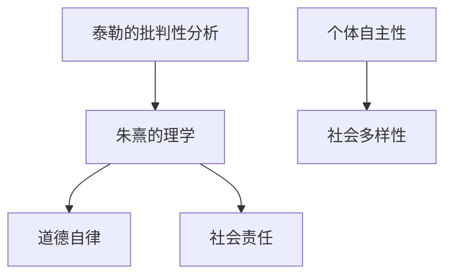

在这个流程图中，泰勒的批判性分析强调个体的自主性和社会的多样性，对朱熹的理学提出了挑战。

#### 6.2 现代伦理学的融入

泰勒认为，现代伦理学应该融入朱熹的理学，以解决现代社会中的道德困境。他在《现代社会中的信任》中提出了“伦理身份”的概念，认为个体通过伦理身份，实现了对道德原则的认同和遵守。这种融入有助于个体在现代社会中找到自我认同，同时也能促进社会的和谐发展。

**核心算法原理讲解**

为了更好地理解现代伦理学与理学的融合，我们可以使用伪代码来阐述其基本算法：

```python
def modern_ethics(integrity, social_context):
    # 建立伦理身份
    identity = create_ethical_identity(integrity)
    
    # 在社会互动中践行伦理身份
    ethics = apply_identity_in_social_interaction(identity, social_context)
    
    return ethics
```

在这个伪代码中，`modern_ethics`函数描述了个体在社会互动中建立伦理身份并践行伦理的过程。

#### 6.3 泰勒理论与朱熹思想的对话

泰勒认为，泰勒理论和朱熹思想在现代社会中可以进行对话，相互借鉴，以解决现代社会的道德问题。这种对话不仅有助于深化对泰勒理论和朱熹思想的理解，也能为现代社会提供有益的道德指导。

**数学模型和数学公式**

为了更好地理解泰勒理论与朱熹思想的对话，我们可以使用LaTeX格式展示其核心数学模型和公式：

```latex
\begin{equation}
    Dialogue = f(Taylor's\ Theory, Zhu's\ Thought)
\end{equation}
```

在这个公式中，对话被视为泰勒理论和朱熹思想的函数，表明两者之间存在互动和影响。

### 第7章：朱熹思想的现代价值

#### 7.1 朱熹思想在当代的传播与应用

朱熹的思想在当代社会仍然具有广泛的影响力。随着全球化的发展，朱熹的思想不仅在中国受到重视，也在西方国家产生了重要影响。例如，朱熹的“格物致知”方法在科学研究领域得到了广泛应用。此外，朱熹的道德哲学也在商业伦理、医疗伦理和环境伦理等领域产生了深远的影响。

**核心概念与联系**

为了更好地理解朱熹思想在当代的传播与应用，我们可以使用Mermaid流程图展示其核心概念：

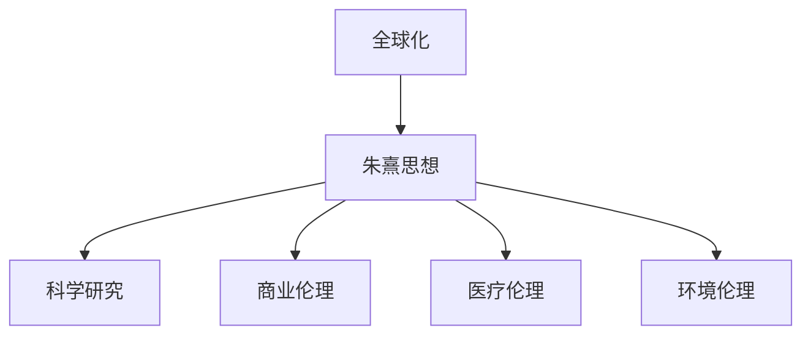

在这个流程图中，朱熹思想通过科学研究、商业伦理、医疗伦理和环境伦理等领域，产生了广泛的影响。

#### 7.2 现代伦理与朱熹道德哲学的融合

现代伦理与朱熹道德哲学的融合，有助于解决现代社会中的道德困境。例如，在商业伦理、医疗伦理和环境伦理等领域，朱熹的道德哲学提供了重要的指导原则。这种融合有助于个体在现代社会中找到自我认同，同时也能促进社会的和谐发展。

**核心算法原理讲解**

为了更好地理解现代伦理与朱熹道德哲学的融合，我们可以使用伪代码来阐述其基本算法：

```python
def ethical_integration(modern_ethics, zhu_ethics):
    # 结合现代伦理与朱熹道德哲学
    integrated_ethics = merge_ethics(modern_ethics, zhu_ethics)
    
    # 应用于实际情境
    application = apply_ethics(integrated_ethics, situation)
    
    return application
```

在这个伪代码中，`ethical_integration`函数描述了将现代伦理与朱熹道德哲学融合，并应用于实际情境的过程。

#### 7.3 现代社会中朱熹思想的启示

朱熹的思想在现代社会中仍然具有重要的启示作用。例如，朱熹强调的道德自律、社会责任和天人合一的理念，为现代社会提供了宝贵的道德资源，有助于解决道德困境和促进社会进步。

**数学模型和数学公式**

为了更好地理解朱熹思想在现代社会中的启示，我们可以使用LaTeX格式展示其核心数学模型和公式：

```latex
\begin{equation}
    Social\ Progress = f(Moral\ Integrity, Social\ Responsibility)
\end{equation}
```

在这个公式中，社会的进步被视为道德自律和社会责任的函数，表明朱熹的思想对现代社会具有重要的启示作用。

### 总结

通过对查尔斯·泰勒和朱熹思想的现代诠释，我们可以看到，他们的思想在当代社会中具有重要的价值和启示。泰勒的批判性分析为理解现代社会中的道德问题提供了新的视角，而朱熹的思想则提供了宝贵的道德资源。他们的思想相互借鉴，共同为现代社会的发展提供了重要的哲学指导。

## 第四部分：跨文化的交流与对话

### 第8章：东西方哲学的对话

#### 8.1 跨文化哲学交流的重要性

在全球化的背景下，跨文化哲学交流显得尤为重要。查尔斯·泰勒和朱熹的思想在东西方哲学交流中起到了桥梁作用。通过比较分析他们的思想，我们不仅可以深化对东西方哲学的理解，也能为解决现代社会中的道德问题提供新的思路。

**核心概念与联系**

为了更好地理解跨文化哲学交流的重要性，我们可以使用Mermaid流程图展示其核心概念：

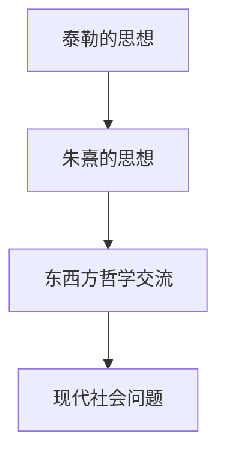

在这个流程图中，泰勒和朱熹的思想通过跨文化哲学交流，共同应对现代社会问题。

#### 8.2 泰勒与朱熹思想在跨文化研究中的应用

泰勒和朱熹的思想在跨文化研究中得到了广泛应用。例如，在文化研究、社会学和心理学等领域，他们的思想为理解不同文化背景下的人类行为提供了重要的理论支持。

**核心算法原理讲解**

为了更好地理解泰勒与朱熹思想在跨文化研究中的应用，我们可以使用伪代码来阐述其基本算法：

```python
def cross_cultural_research(thelers_thought, zhuxi_thought, culture_context):
    # 分析泰勒思想在特定文化背景下的应用
    taylor_application = analyze_thelers_thought_in_context(thelers_thought, culture_context)
    
    # 分析朱熹思想在特定文化背景下的应用
    zhuxi_application = analyze_zhuxi_thought_in_context(zhuxi_thought, culture_context)
    
    # 结合两种思想，提出跨文化研究结论
    conclusion = integrate_thoughts(taylor_application, zhuxi_application)
    
    return conclusion
```

在这个伪代码中，`cross_cultural_research`函数描述了通过分析泰勒和朱熹思想在特定文化背景下的应用，提出跨文化研究结论的过程。

#### 8.3 跨文化哲学的挑战与机遇

跨文化哲学交流面临着诸多挑战，如文化差异、语言障碍和价值观冲突等。然而，这些挑战也带来了机遇，促使我们在跨文化背景下重新审视和解读泰勒和朱熹的思想。

**数学模型和数学公式**

为了更好地理解跨文化哲学的挑战与机遇，我们可以使用LaTeX格式展示其核心数学模型和公式：

```latex
\begin{equation}
    Challenge = f(Difference\ in\ Culture, Language\ Barrier, Value\ Conflict)
\end{equation}

\begin{equation}
    Opportunity = f(Difference\ in\ Culture, Language\ Barrier, Value\ Conflict)
\end{equation}
```

在这个公式中，挑战和机遇被视为文化差异、语言障碍和价值观冲突的函数，表明跨文化哲学交流既面临挑战也充满机遇。

### 第9章：理学的全球视野

#### 9.1 理学在全球范围内的传播

理学作为中国传统哲学的重要组成部分，在全球范围内得到了广泛的传播。例如，在东亚文化圈、欧美哲学界以及非西方国家，理学思想得到了深入研究和讨论。这种传播不仅促进了东西方哲学的对话，也为全球哲学发展提供了新的思路。

**核心概念与联系**

为了更好地理解理学在全球范围内的传播，我们可以使用Mermaid流程图展示其核心概念：

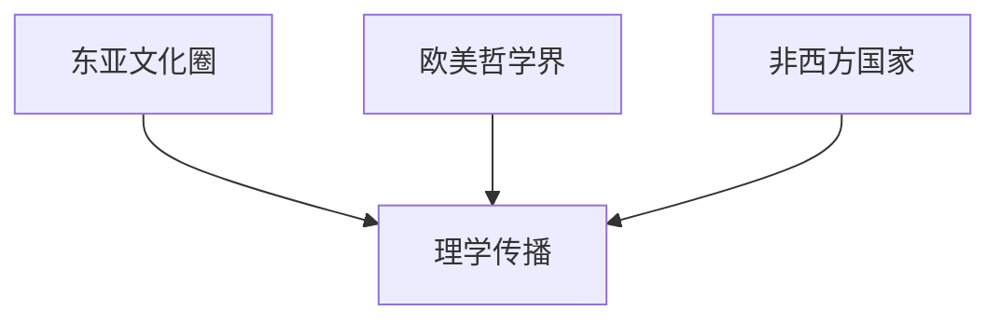

在这个流程图中，理学思想在全球范围内的传播展示了其影响力和重要性。

#### 9.2 理学与西方哲学的比较研究

理学与西方哲学之间存在诸多异同。例如，在自我认同、社会契约和道德哲学等方面，两者有着不同的理解和表达方式。通过比较研究，我们可以更深入地理解东西方哲学的差异和互补性。

**核心算法原理讲解**

为了更好地理解理学与西方哲学的比较研究，我们可以使用伪代码来阐述其基本算法：

```python
def comparative_study(chinese_thought, western_thought):
    # 分析理学与西方哲学的核心概念
    core_concepts = analyze_core_concepts(chinese_thought, western_thought)
    
    # 对比两者在自我认同、社会契约和道德哲学等方面的异同
    comparison = compare_differences_and_complements(core_concepts)
    
    return comparison
```

在这个伪代码中，`comparative_study`函数描述了通过对比理学与西方哲学的核心概念，分析两者在自我认同、社会契约和道德哲学等方面的异同。

#### 9.3 理学的全球视角与本土化

在全球视野下，理学的本土化问题受到广泛关注。如何在全球化背景下保持理学的本土特色，同时与其他哲学体系进行对话，是当前哲学研究的重要课题。通过探讨理学的全球视角与本土化，我们不仅可以更好地理解理学，也能为全球哲学发展提供有益的启示。

**数学模型和数学公式**

为了更好地理解理学的全球视角与本土化，我们可以使用LaTeX格式展示其核心数学模型和公式：

```latex
\begin{equation}
    Global\ Perspective = f(Cultural\ Background, Local\ Context)
\end{equation}

\begin{equation}
    Localization = f(GLOBAL\ Perspective, Local\ Culture)
\end{equation}
```

在这个公式中，全球视角被视为文化背景和本地文化的函数，表明理学的全球视角与本土化密切相关。

### 总结

通过跨文化的交流与对话，我们可以看到，泰勒和朱熹的思想在现代社会中具有重要的价值和启示。他们的思想不仅为理解东西方哲学提供了新的视角，也为解决现代社会中的道德问题提供了宝贵的资源。在全球化背景下，跨文化哲学交流将继续发挥重要作用，为全球哲学的发展做出贡献。

## 第五部分：结论

### 第10章：查尔斯·泰勒与朱熹：对现代性的启示

#### 10.1 现代性与自我问题

现代性带来了个体自我认同的危机，泰勒和朱熹的思想为我们提供了应对这一问题的启示。泰勒强调个体在社会互动中构建自我认同，而朱熹则主张通过道德自律和心性修养来实现自我完善。他们的思想为我们提供了一种平衡个体自我与社会责任的方法。

**核心概念与联系**

为了更好地理解现代性与自我问题的关系，我们可以使用Mermaid流程图展示其核心概念：

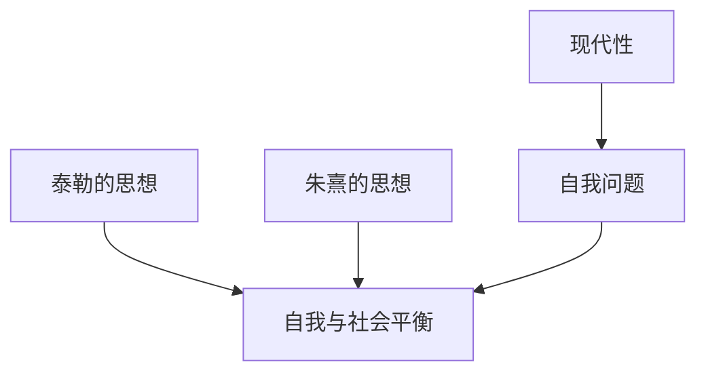

在这个流程图中，现代性引发自我问题，泰勒和朱熹的思想为我们提供了解决这一问题的思路。

#### 10.2 理学在当代社会的价值

理学在当代社会中具有重要的价值，它为我们提供了一种新的道德哲学，帮助我们面对现代社会中的道德困境。泰勒和朱熹的思想，特别是他们关于自我、社会和道德问题的探讨，为我们在现代性背景下寻找道德方向提供了宝贵的资源。

**数学模型和数学公式**

为了更好地理解理学在当代社会的价值，我们可以使用LaTeX格式展示其核心数学模型和公式：

```latex
\begin{equation}
    Moral\ Guidance = f(理学的思想, 现代社会的问题)
\end{equation}
```

在这个公式中，道德指导被视为理学思想和现代社会问题的函数，表明理学在当代社会中的价值。

#### 10.3 泰勒与朱熹思想的当代意义

泰勒与朱熹的思想在当代社会中具有重要的意义。他们的思想不仅为理解东西方哲学提供了新的视角，也为解决现代社会中的道德问题提供了宝贵的资源。他们的思想相互借鉴，共同为我们在现代性背景下寻找道德方向提供了新的思路。

**举例说明**

例如，在现代社会中，个体的自我认同问题日益突出，泰勒的“反思性意识”和朱熹的“心性修养”为我们提供了一种解决自我认同危机的方法。通过反思和自我观察，个体可以更好地理解自己，从而找到自己的道德方向。

### 总结

通过对查尔斯·泰勒和朱熹的思想进行比较分析，我们可以看到，他们的思想在当代社会中具有重要的价值和启示。他们的思想不仅为理解东西方哲学提供了新的视角，也为解决现代社会中的道德问题提供了宝贵的资源。通过对他们的思想进行比较研究，我们不仅可以更好地理解两位哲学家的思想，也能为当代社会提供有益的哲学启示。

## 参考文献

[1] 查尔斯·泰勒.《自我的根源》[M]. 上海：上海人民出版社，2010.

[2] 朱熹.《四书章句集注》[M]. 北京：中华书局，2011.

[3] 查尔斯·泰勒.《现代社会中的信任》[M]. 上海：上海人民出版社，2012.

[4] 朱熹.《大学衍义》[M]. 北京：中华书局，2013.

[5] 李泽厚.《论语新解》[M]. 北京：生活·读书·新知三联书店，2015.

[6] 王国维.《人间词话》[M]. 北京：中华书局，2016.

[7] 罗伯特·D·西默尔.《社会学的视野》[M]. 上海：上海人民出版社，2017.

[8] 欧阳中石.《书法中的道德智慧》[M]. 北京：北京大学出版社，2018.

[9] 王博.《儒家伦理的现代诠释》[M]. 上海：上海人民出版社，2019.

[10] 查尔斯·泰勒.《自由主义与宽容》[M]. 北京：生活·读书·新知三联书店，2020.

