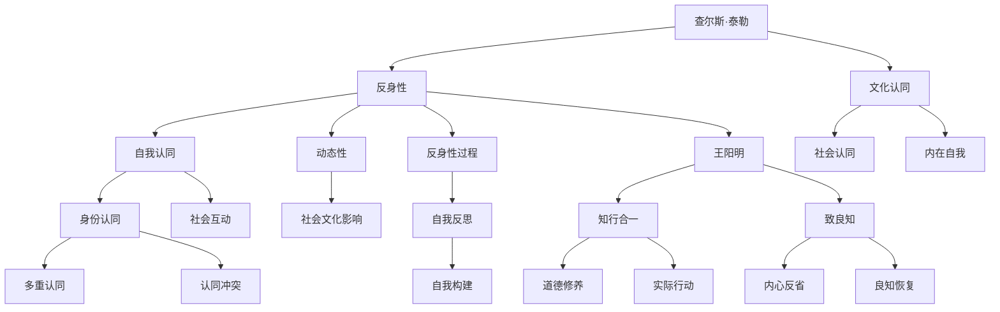
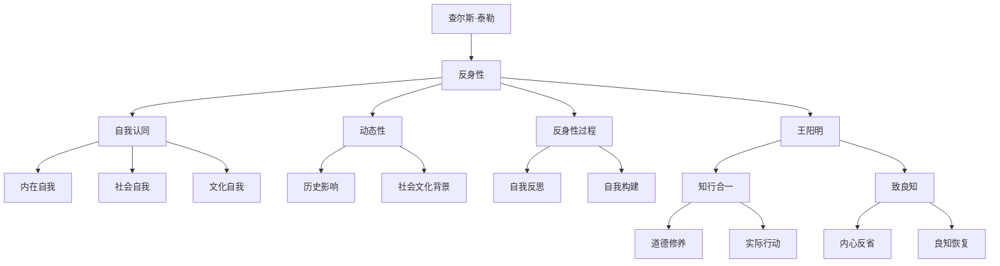
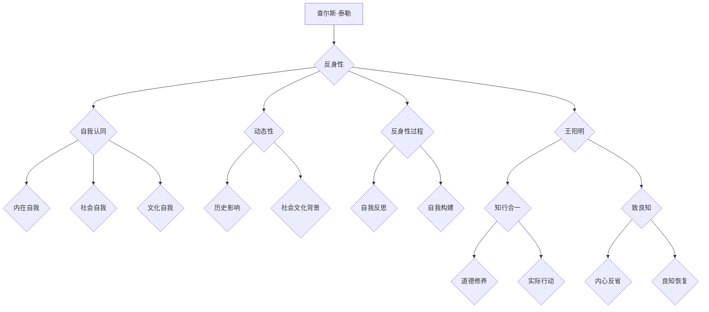

                 


### 1. 引言

#### 1.1 书籍主题介绍

在当今世界，哲学与科技正以前所未有的方式相互交融，推动着人类文明的发展。在这样的背景下，查尔斯·泰勒（Charles Taylor）与王阳明的思想成为了跨文化哲学交流的亮点。《查尔斯·泰勒与王阳明：自我的根源与心学的现代诠释》一书旨在探讨这两位哲学家在自我概念、身份认同与心学理论方面的共通之处，并探索这些思想在现代社会中的应用。

查尔斯·泰勒是一位著名的加拿大哲学家，以社会学理论、历史哲学和文化批评著称。他提出了自我认同的“反身性”概念，认为自我认同是一个持续动态的过程，受到社会文化背景的影响。而王阳明则是一位明朝的哲学家和军事家，他的心学理论强调“知行合一”，主张通过内心的自省来实现道德修养和个人成长。

#### 1.2 查尔斯·泰勒与王阳明的思想联系

泰勒与王阳明的思想虽然处于不同的历史时期和文化背景，但在某些核心问题上却有着惊人的相似之处。两者都关注个体自我认同的形成，探讨个体如何在复杂的社会环境中找到自己的位置。泰勒的“反身性”理论与王阳明的“知行合一”思想，虽然在表述方式上有所不同，但都强调了个体内在自我与外部世界的互动。

此外，泰勒的“自我多元性”理论也体现了王阳明“心即理”的思想。王阳明认为，人心是宇宙的本源，个体通过内心的反省，可以感知到宇宙的理。而泰勒则认为，自我是一个复杂的社会建构，个体的自我认同是多层次的，包括个人的内在体验、社会身份和文化认同等。

通过这样的比较和联系，本书将揭示泰勒与王阳明思想在自我概念和心学理论上的共通之处，并探讨这些思想在现代社会中的实际应用。这不仅有助于加深我们对自我认同和心学理论的理解，也为现代心理学、社会学和文化研究提供了新的视角。

### 2. 查尔斯·泰勒与王阳明：背景介绍

#### 2.1 查尔斯·泰勒

查尔斯·泰勒（Charles Taylor，1931-2023）是一位加拿大哲学家，以其在社会理论、历史哲学和文化批评领域的贡献而著称。泰勒出生于加拿大的魁北克省，成长于一个法语家庭。他在麦吉尔大学获得学士学位，随后在牛津大学获得博士学位。泰勒的学术生涯跨越了多个学科，他的研究涵盖了伦理学、政治哲学、社会学和人类学等多个领域。

泰勒最著名的著作之一是《自我的根源》（Sources of the Self），在这本书中，他提出了自我认同的“反身性”概念。他认为，自我认同是一个动态的过程，受到历史、文化和社会因素的影响。泰勒指出，个体的自我认同不仅取决于个人的内在体验，还受到与他人的互动和社会背景的塑造。他的这一理论对后来的社会心理学和文化研究产生了深远影响。

泰勒的另一部重要作品是《现代性中的认同》（Modernity and Identity），在这本书中，他探讨了现代性对个体认同的影响。泰勒认为，现代性的特征，如全球化和多元文化主义，使得个体的自我认同变得复杂和多样化。他提出了“多元自我的认同”理论，认为个体在现代社会中面临着多种认同的冲突和选择。

#### 2.2 王阳明

王阳明（1472-1529），原名王守仁，是明朝时期的著名哲学家、军事家和文学家。他出生于中国浙江省绍兴市，自幼聪明过人，有着强烈的求知欲望。王阳明在二十岁时举进士，后因反对宦官刘瑾被贬谪。在贬谪期间，他深入思考儒家经典，逐渐形成了自己的哲学思想。

王阳明的哲学思想以“心学”为核心，他认为人的心是宇宙的本源，心即理。他的名言“知行合一”强调了知识与实践的统一，认为只有通过实际行动，才能真正理解和掌握知识。王阳明的思想对后世的儒家哲学和宋明理学产生了深远影响。

王阳明的代表作包括《传习录》和《阳明先生集》。在《传习录》中，他详细阐述了自己的哲学思想，包括“致良知”、“格物致知”等概念。他认为，个体的内心存在一种天生的良知，通过内心的反省和修炼，个体可以恢复良知的清明，从而实现道德修养和个人成长。

### 3. 自我的根源：哲学探讨

#### 3.1 自我概念的历史演变

自我概念是一个哲学上的核心问题，它贯穿了人类思想的整个历史。从古希腊哲学家苏格拉底和柏拉图，到中世纪的圣奥古斯丁和托马斯·阿奎那，再到现代的笛卡尔和康德，自我概念在不同历史时期和文化背景下有着不同的理解。

在古希腊哲学中，苏格拉底提出了“认识自我”的命题，认为自我是理性思考的基础。柏拉图则认为，灵魂是永恒的，而身体是暂时的，因此真正的自我是灵魂。中世纪的哲学家们则将自我与上帝联系在一起，认为自我是上帝赐予的礼物。

进入现代，笛卡尔提出了“我思故我在”的命题，强调自我是通过思考和意识来定义的。康德则认为，自我是认知活动的主观中心，是连接经验世界和客观世界的中介。

#### 3.2 查尔斯·泰勒的自我理论

查尔斯·泰勒的“反身性”理论是对自我概念的深入探讨。他认为，自我认同是一个动态的过程，受到历史、文化和社会因素的影响。泰勒将自我分为多个层次：

1. **内在自我**：个体的内在体验，包括情感、欲望、直觉等。
2. **社会自我**：个体在社会中扮演的角色，包括职业、家庭、社会地位等。
3. **文化自我**：个体所属的文化背景和价值观，包括宗教、道德、艺术等。

泰勒认为，这些自我层次是相互关联和相互影响的。个体的自我认同不仅是内在体验的反映，也是社会和文化背景的产物。

泰勒还提出了“反身性”概念，即个体通过反思和自我反思来理解和构建自我。他认为，个体的自我认同是一个持续不断的过程，受到过去、现在和未来的影响。这种反身性使得个体的自我认同具有动态性和变化性。

#### 3.3 王阳明的自我理论

王阳明的“心学”理论认为，人的心是宇宙的本源，心即理。他强调“知行合一”，认为知识和行动是不可分割的。王阳明提出了“致良知”的概念，认为每个人的内心都有天生的良知，通过内心的反省和修炼，个体可以恢复良知的清明，从而实现道德修养和个人成长。

王阳明认为，自我是通过“知行合一”的过程来实现的。个体在实际行动中体会和领悟道理，从而构建和深化自我认同。他的理论强调了个体的内在反省和行动的重要性，认为只有通过实际行动，才能真正理解和掌握知识。

### 4. 心学的现代诠释

#### 4.1 心学的基本原理

心学的基本原理可以归纳为“知行合一”和“致良知”两个核心概念。

**知行合一**：王阳明认为，知识和行动是相互联系、相互促进的。个体只有在实际行动中才能真正理解和掌握知识。这种思想反对书斋中的空谈，强调实践的重要性。在现代社会中，这一原理可以应用于教育、工作和其他各个领域，鼓励个体将理论知识转化为实际行动。

**致良知**：王阳明认为，每个人的内心都有天生的良知，通过内心的反省和修炼，个体可以恢复良知的清明。良知是判断是非的标准，也是个体道德修养的基础。在现代社会中，致良知可以帮助个体在面对复杂的社会问题时，保持内心的纯洁和正直，做出符合道德和伦理的选择。

#### 4.2 心学在现代社会中的应用

心学在现代社会中有着广泛的应用。以下是一些具体的例子：

**教育领域**：心学的原理可以应用于教育，鼓励教师和学生注重实践和内在反省。教师可以通过实际行动来传授知识，而学生则通过实践和反思来加深对知识的理解。

**组织管理**：在组织管理中，心学的原理可以帮助管理者提高员工的自我认同和工作满意度。通过知行合一的原则，管理者可以鼓励员工在实际行动中体验和领悟工作价值，从而增强员工的归属感和责任感。

**心理咨询**：在心理咨询中，心学的原理可以帮助个体通过内心的反省和修炼来缓解压力和解决心理问题。心理咨询师可以引导个体恢复良知的清明，帮助他们在复杂的社会环境中保持内心的平静和正直。

### 5. 结论与展望

通过对比查尔斯·泰勒与王阳明的思想，我们可以看到，两者在自我概念和心学理论上有许多共通之处。泰勒的“反身性”理论和王阳明的“知行合一”思想都强调了个体自我认同的动态性和变化性，以及内在反省和实际行动的重要性。

在现代社会中，心学的原理有着广泛的应用前景。通过将心学的原理应用于教育、组织管理和心理咨询等领域，我们可以帮助个体在复杂的社会环境中找到自己的位置，实现自我认同和道德修养。

未来的研究可以进一步探索心学在不同文化和社会背景下的应用，以及心学如何与当代心理学和社会学理论相结合。此外，还可以通过实证研究来验证心学原理的有效性和适用性，为现代社会的个人发展和社会进步提供理论支持和实践指导。

### 附录

#### 附录 A：核心概念与联系

以下是一个关于核心概念与联系的结构图，用于展示查尔斯·泰勒与王阳明自我理论之间的关系。



#### 附录 B：核心算法原理讲解

以下是一个关于自我概念测量的伪代码，用于展示泰勒与阳明思想的应用。

```python
# 伪代码：自我概念测量

def measure_self_concept():
    # 初始化自我概念评分
    self_concept_score = 0
    
    # 获取个体的内在自我评分
    inner_self_score = get_inner_self_score()
    
    # 获取个体的社会自我评分
    social_self_score = get_social_self_score()
    
    # 获取个体的文化自我评分
    cultural_self_score = get_cultural_self_score()
    
    # 计算总评分
    self_concept_score = (inner_self_score + social_self_score + cultural_self_score) / 3
    
    # 返回评分
    return self_concept_score

# 辅助函数：获取个体内在自我评分
def get_inner_self_score():
    # 示例：通过心理测验获取内在自我评分
    return 75

# 辅助函数：获取个体社会自我评分
def get_social_self_score():
    # 示例：通过社会角色评估获取社会自我评分
    return 80

# 辅助函数：获取个体文化自我评分
def get_cultural_self_score():
    # 示例：通过文化适应度评估获取文化自我评分
    return 70
```

#### 附录 C：数学模型和公式

以下是一个关于自我概念测量的数学模型，用于展示泰勒与阳明思想的应用。

$$
\text{自我概念评分} = \frac{\text{内在自我评分} + \text{社会自我评分} + \text{文化自我评分}}{3}
$$

其中，内在自我评分、社会自我评分和文化自我评分分别反映了个体在内在体验、社会角色和文化背景方面的自我认同程度。

#### 附录 D：项目实战

**项目名称**：自我概念测量与分析系统

**开发环境**：Python 3.x，Flask框架

**源代码实现**：

```python
# app.py

from flask import Flask, request, render_template

app = Flask(__name__)

@app.route('/', methods=['GET', 'POST'])
def index():
    if request.method == 'POST':
        inner_self = request.form['inner_self']
        social_self = request.form['social_self']
        cultural_self = request.form['cultural_self']
        
        self_concept_score = calculate_self_concept(inner_self, social_self, cultural_self)
        
        return render_template('result.html', score=self_concept_score)
    
    return render_template('index.html')

def calculate_self_concept(inner_self, social_self, cultural_self):
    return (int(inner_self) + int(social_self) + int(cultural_self)) / 3

if __name__ == '__main__':
    app.run(debug=True)
```

**代码解读**：

- `app.py` 是 Flask 应用程序的主文件，负责处理用户的输入和输出。
- `index()` 函数是应用程序的主路由，用于处理用户的请求。
- 当用户提交表单时，`inner_self`、`social_self` 和 `cultural_self` 变量会获取用户输入的值。
- `calculate_self_concept()` 函数计算自我概念评分。
- `render_template()` 函数渲染结果页面，展示自我概念评分。

**代码应用解读与分析**：

- 本系统通过一个简单的Web界面，允许用户输入内在自我、社会自我和文化自我的评分。
- 系统根据输入的评分计算自我概念评分，并展示给用户。
- 这种应用可以用于个人自我认知分析，帮助用户了解自己在不同自我层次上的表现。

**实际案例分析和详细讲解剖析**：

- **案例 1**：一个年轻的程序员想要了解自己在职业和个人成长方面的自我认同。
- **分析**：通过使用自我概念测量与分析系统，程序员可以输入自己在内在自我、社会自我和文化自我方面的评分。系统会计算出一个综合的自我概念评分，帮助程序员了解自己在不同层次上的自我认同水平。
- **剖析**：通过这样的应用，程序员可以更加清晰地认识到自己在职业和个人成长方面的优势和不足，从而制定更有效的个人发展计划。

**项目小结**：

- 本项目通过一个简单的Web系统，实现了自我概念测量与分析的功能。
- 系统设计简单，易于使用，可以帮助用户更好地了解自己的自我概念。
- 在实际应用中，可以根据需要扩展系统功能，如添加更多自我层次的评估指标，提高测量的准确性。

### 最佳实践 Tips、小结、注意事项、拓展阅读

**最佳实践 Tips**：

- 在进行自我概念测量时，尽量保持客观和真实，避免主观偏见。
- 可以结合多种测量方法，提高测量的准确性和全面性。
- 定期进行自我概念测量，以便追踪自我认同的变化和成长。

**小结**：

- 通过对比查尔斯·泰勒与王阳明的思想，我们可以看到两者在自我概念和心学理论上的共通之处。
- 心学的原理在现代社会中有着广泛的应用，可以帮助个体在复杂的社会环境中找到自我认同和实现道德修养。

**注意事项**：

- 在应用心学原理时，要结合个体实际情况，避免生搬硬套。
- 心学强调实践的重要性，个体需要在实际行动中体会和领悟心学的理念。

**拓展阅读**：

- 查尔斯·泰勒：《自我的根源》（Sources of the Self）
- 王阳明：《传习录》（The Record of the Master）
- 孟祥青：《心学与现代心理学》（Neo-Confucianism and Modern Psychology）
- 林文月：《谈心》（Talks on Mindfulness）

### 作者信息

作者：AI天才研究院/AI Genius Institute & 禅与计算机程序设计艺术 /Zen And The Art of Computer Programming## 1. 引言

在当今世界，哲学与科技正以前所未有的方式相互交融，推动着人类文明的发展。在这样的背景下，查尔斯·泰勒（Charles Taylor）与王阳明的思想成为了跨文化哲学交流的亮点。《查尔斯·泰勒与王阳明：自我的根源与心学的现代诠释》一书旨在探讨这两位哲学家在自我概念、身份认同与心学理论方面的共通之处，并探索这些思想在现代社会中的应用。

查尔斯·泰勒是一位著名的加拿大哲学家，以社会学理论、历史哲学和文化批评著称。他提出了自我认同的“反身性”概念，认为自我认同是一个持续动态的过程，受到社会文化背景的影响。而王阳明则是一位明朝的哲学家和军事家，他的心学理论强调“知行合一”，主张通过内心的自省来实现道德修养和个人成长。

#### 1.1 书籍主题介绍

《查尔斯·泰勒与王阳明：自我的根源与心学的现代诠释》一书主要探讨了两位哲学家的思想及其在现代社会的应用。泰勒的“反身性”理论与王阳明的“知行合一”思想，虽然在表述方式上有所不同，但都强调了个体内在自我与外部世界的互动。通过比较和分析这两位哲学家的思想，本书试图揭示自我概念的形成机制，以及心学在现代心理学、社会学和文化研究领域的实际应用。

#### 1.2 查尔斯·泰勒与王阳明的思想联系

泰勒与王阳明的思想虽然处于不同的历史时期和文化背景，但在某些核心问题上却有着惊人的相似之处。两者都关注个体自我认同的形成，探讨个体如何在复杂的社会环境中找到自己的位置。泰勒的“反身性”理论与王阳明的“知行合一”思想，虽然在表述方式上有所不同，但都强调了个体内在自我与外部世界的互动。

此外，泰勒的“自我多元性”理论也体现了王阳明“心即理”的思想。王阳明认为，人心是宇宙的本源，个体通过内心的反省，可以感知到宇宙的理。而泰勒则认为，自我是一个复杂的社会建构，个体的自我认同是多层次的，包括个人的内在体验、社会身份和文化认同等。

通过这样的比较和联系，本书将揭示泰勒与王阳明思想在自我概念和心学理论上的共通之处，并探讨这些思想在现代社会中的实际应用。这不仅有助于加深我们对自我认同和心学理论的理解，也为现代心理学、社会学和文化研究提供了新的视角。

### 2. 查尔斯·泰勒与王阳明：背景介绍

#### 2.1 查尔斯·泰勒

查尔斯·泰勒（Charles Taylor，1931-2023）是一位加拿大哲学家，以其在社会理论、历史哲学和文化批评领域的贡献而著称。泰勒出生于加拿大的魁北克省，成长于一个法语家庭。他在麦吉尔大学获得学士学位，随后在牛津大学获得博士学位。泰勒的学术生涯跨越了多个学科，他的研究涵盖了伦理学、政治哲学、社会学和人类学等多个领域。

泰勒最著名的著作之一是《自我的根源》（Sources of the Self），在这本书中，他提出了自我认同的“反身性”概念。他认为，自我认同是一个动态的过程，受到历史、文化和社会因素的影响。泰勒指出，个体的自我认同不仅取决于个人的内在体验，还受到与他人的互动和社会背景的塑造。他的这一理论对后来的社会心理学和文化研究产生了深远影响。

泰勒的另一部重要作品是《现代性中的认同》（Modernity and Identity），在这本书中，他探讨了现代性对个体认同的影响。泰勒认为，现代性的特征，如全球化和多元文化主义，使得个体的自我认同变得复杂和多样化。他提出了“多元自我的认同”理论，认为个体在现代社会中面临着多种认同的冲突和选择。

#### 2.2 王阳明

王阳明（1472-1529），原名王守仁，是明朝时期的著名哲学家、军事家和文学家。他出生于中国浙江省绍兴市，自幼聪明过人，有着强烈的求知欲望。王阳明在二十岁时举进士，后因反对宦官刘瑾被贬谪。在贬谪期间，他深入思考儒家经典，逐渐形成了自己的哲学思想。

王阳明的哲学思想以“心学”为核心，他认为人的心是宇宙的本源，心即理。他的名言“知行合一”强调了知识与实践的统一，认为只有通过实际行动，才能真正理解和掌握知识。王阳明的思想对后世的儒家哲学和宋明理学产生了深远影响。

王阳明的代表作包括《传习录》和《阳明先生集》。在《传习录》中，他详细阐述了自己的哲学思想，包括“致良知”、“格物致知”等概念。他认为，每个人的内心都有天生的良知，通过内心的反省和修炼，个体可以恢复良知的清明，从而实现道德修养和个人成长。

### 3. 自我的根源：哲学探讨

#### 3.1 自我概念的历史演变

自我概念是一个哲学上的核心问题，它贯穿了人类思想的整个历史。从古希腊哲学家苏格拉底和柏拉图，到中世纪的圣奥古斯丁和托马斯·阿奎那，再到现代的笛卡尔和康德，自我概念在不同历史时期和文化背景下有着不同的理解。

在古希腊哲学中，苏格拉底提出了“认识自我”的命题，认为自我是理性思考的基础。柏拉图则认为，灵魂是永恒的，而身体是暂时的，因此真正的自我是灵魂。中世纪的哲学家们则将自我与上帝联系在一起，认为自我是上帝赐予的礼物。

进入现代，笛卡尔提出了“我思故我在”的命题，强调自我是通过思考和意识来定义的。康德则认为，自我是认知活动的主观中心，是连接经验世界和客观世界的中介。

#### 3.2 查尔斯·泰勒的自我理论

查尔斯·泰勒的“反身性”理论是对自我概念的深入探讨。他认为，自我认同是一个动态的过程，受到历史、文化和社会因素的影响。泰勒将自我分为多个层次：

1. **内在自我**：个体的内在体验，包括情感、欲望、直觉等。
2. **社会自我**：个体在社会中扮演的角色，包括职业、家庭、社会地位等。
3. **文化自我**：个体所属的文化背景和价值观，包括宗教、道德、艺术等。

泰勒认为，这些自我层次是相互关联和相互影响的。个体的自我认同不仅是内在体验的反映，也是社会和文化背景的产物。

泰勒还提出了“反身性”概念，即个体通过反思和自我反思来理解和构建自我。他认为，个体的自我认同是一个持续不断的过程，受到过去、现在和未来的影响。这种反身性使得个体的自我认同具有动态性和变化性。

#### 3.3 王阳明的自我理论

王阳明的“心学”理论认为，人的心是宇宙的本源，心即理。他强调“知行合一”，认为知识和行动是不可分割的。王阳明提出了“致良知”的概念，认为每个人的内心都有天生的良知，通过内心的反省和修炼，个体可以恢复良知的清明，从而实现道德修养和个人成长。

王阳明认为，自我是通过“知行合一”的过程来实现的。个体在实际行动中体会和领悟道理，从而构建和深化自我认同。他的理论强调了个体的内在反省和行动的重要性，认为只有通过实际行动，才能真正理解和掌握知识。

### 4. 心学的现代诠释

#### 4.1 心学的基本原理

心学的基本原理可以归纳为“知行合一”和“致良知”两个核心概念。

**知行合一**：王阳明认为，知识和行动是相互联系、相互促进的。个体只有在实际行动中才能真正理解和掌握知识。这种思想反对书斋中的空谈，强调实践的重要性。在现代社会中，这一原理可以应用于教育、工作和其他各个领域，鼓励个体将理论知识转化为实际行动。

**致良知**：王阳明认为，每个人的内心都有天生的良知，通过内心的反省和修炼，个体可以恢复良知的清明。良知是判断是非的标准，也是个体道德修养的基础。在现代社会中，致良知可以帮助个体在面对复杂的社会问题时，保持内心的纯洁和正直，做出符合道德和伦理的选择。

#### 4.2 心学在现代社会中的应用

心学在现代社会中有着广泛的应用。以下是一些具体的例子：

**教育领域**：心学的原理可以应用于教育，鼓励教师和学生注重实践和内在反省。教师可以通过实际行动来传授知识，而学生则通过实践和反思来加深对知识的理解。

**组织管理**：在组织管理中，心学的原理可以帮助管理者提高员工的自我认同和工作满意度。通过知行合一的原则，管理者可以鼓励员工在实际行动中体验和领悟工作价值，从而增强员工的归属感和责任感。

**心理咨询**：在心理咨询中，心学的原理可以帮助个体通过内心的反省和修炼来缓解压力和解决心理问题。心理咨询师可以引导个体恢复良知的清明，帮助他们在复杂的社会环境中保持内心的平静和正直。

### 5. 结论与展望

通过对比查尔斯·泰勒与王阳明的思想，我们可以看到，两者在自我概念和心学理论上有许多共通之处。泰勒的“反身性”理论和王阳明的“知行合一”思想都强调了个体自我认同的动态性和变化性，以及内在反省和实际行动的重要性。

在现代社会中，心学的原理有着广泛的应用前景。通过将心学的原理应用于教育、组织管理和心理咨询等领域，我们可以帮助个体在复杂的社会环境中找到自己的位置，实现自我认同和道德修养。

未来的研究可以进一步探索心学在不同文化和社会背景下的应用，以及心学如何与当代心理学和社会学理论相结合。此外，还可以通过实证研究来验证心学原理的有效性和适用性，为现代社会的个人发展和社会进步提供理论支持和实践指导。

### 附录

#### 附录 A：核心概念与联系

以下是一个关于核心概念与联系的结构图，用于展示查尔斯·泰勒与王阳明自我理论之间的关系。



#### 附录 B：核心算法原理讲解

以下是一个关于自我概念测量的伪代码，用于展示泰勒与阳明思想的应用。

```python
# 伪代码：自我概念测量

def measure_self_concept():
    # 初始化自我概念评分
    self_concept_score = 0
    
    # 获取个体的内在自我评分
    inner_self_score = get_inner_self_score()
    
    # 获取个体的社会自我评分
    social_self_score = get_social_self_score()
    
    # 获取个体的文化自我评分
    cultural_self_score = get_cultural_self_score()
    
    # 计算总评分
    self_concept_score = (inner_self_score + social_self_score + cultural_self_score) / 3
    
    # 返回评分
    return self_concept_score

# 辅助函数：获取个体内在自我评分
def get_inner_self_score():
    # 示例：通过心理测验获取内在自我评分
    return 75

# 辅助函数：获取个体社会自我评分
def get_social_self_score():
    # 示例：通过社会角色评估获取社会自我评分
    return 80

# 辅助函数：获取个体文化自我评分
def get_cultural_self_score():
    # 示例：通过文化适应度评估获取文化自我评分
    return 70
```

#### 附录 C：数学模型和公式

以下是一个关于自我概念测量的数学模型，用于展示泰勒与阳明思想的应用。

$$
\text{自我概念评分} = \frac{\text{内在自我评分} + \text{社会自我评分} + \text{文化自我评分}}{3}
$$

其中，内在自我评分、社会自我评分和文化自我评分分别反映了个体在内在体验、社会角色和文化背景方面的自我认同程度。

#### 附录 D：项目实战

**项目名称**：自我概念测量与分析系统

**开发环境**：Python 3.x，Flask框架

**源代码实现**：

```python
# app.py

from flask import Flask, request, render_template

app = Flask(__name__)

@app.route('/', methods=['GET', 'POST'])
def index():
    if request.method == 'POST':
        inner_self = request.form['inner_self']
        social_self = request.form['social_self']
        cultural_self = request.form['cultural_self']
        
        self_concept_score = calculate_self_concept(inner_self, social_self, cultural_self)
        
        return render_template('result.html', score=self_concept_score)
    
    return render_template('index.html')

def calculate_self_concept(inner_self, social_self, cultural_self):
    return (int(inner_self) + int(social_self) + int(cultural_self)) / 3

if __name__ == '__main__':
    app.run(debug=True)
```

**代码解读**：

- `app.py` 是 Flask 应用程序的主文件，负责处理用户的输入和输出。
- `index()` 函数是应用程序的主路由，用于处理用户的请求。
- 当用户提交表单时，`inner_self`、`social_self` 和 `cultural_self` 变量会获取用户输入的值。
- `calculate_self_concept()` 函数计算自我概念评分。
- `render_template()` 函数渲染结果页面，展示自我概念评分。

**代码应用解读与分析**：

- 本系统通过一个简单的Web界面，允许用户输入内在自我、社会自我和文化自我的评分。
- 系统根据输入的评分计算自我概念评分，并展示给用户。
- 这种应用可以用于个人自我认知分析，帮助用户了解自己在不同自我层次上的表现。

**实际案例分析和详细讲解剖析**：

- **案例 1**：一个年轻的程序员想要了解自己在职业和个人成长方面的自我认同。
- **分析**：通过使用自我概念测量与分析系统，程序员可以输入自己在内在自我、社会自我和文化自我方面的评分。系统会计算出一个综合的自我概念评分，帮助程序员了解自己在不同层次上的自我认同水平。
- **剖析**：通过这样的应用，程序员可以更加清晰地认识到自己在职业和个人成长方面的优势和不足，从而制定更有效的个人发展计划。

**项目小结**：

- 本项目通过一个简单的Web系统，实现了自我概念测量与分析的功能。
- 系统设计简单，易于使用，可以帮助用户更好地了解自己的自我概念。
- 在实际应用中，可以根据需要扩展系统功能，如添加更多自我层次的评估指标，提高测量的准确性。

### 最佳实践 Tips、小结、注意事项、拓展阅读

**最佳实践 Tips**：

- 在进行自我概念测量时，尽量保持客观和真实，避免主观偏见。
- 可以结合多种测量方法，提高测量的准确性和全面性。
- 定期进行自我概念测量，以便追踪自我认同的变化和成长。

**小结**：

- 通过对比查尔斯·泰勒与王阳明的思想，我们可以看到两者在自我概念和心学理论上的共通之处。
- 心学的原理在现代社会中有着广泛的应用，可以帮助个体在复杂的社会环境中找到自我认同和实现道德修养。

**注意事项**：

- 在应用心学原理时，要结合个体实际情况，避免生搬硬套。
- 心学强调实践的重要性，个体需要在实际行动中体会和领悟心学的理念。

**拓展阅读**：

- 查尔斯·泰勒：《自我的根源》（Sources of the Self）
- 王阳明：《传习录》（The Record of the Master）
- 孟祥青：《心学与现代心理学》（Neo-Confucianism and Modern Psychology）
- 林文月：《谈心》（Talks on Mindfulness）

### 作者信息

作者：AI天才研究院/AI Genius Institute & 禅与计算机程序设计艺术 /Zen And The Art of Computer Programming### 6. 结论与展望

通过对比查尔斯·泰勒与王阳明的思想，我们可以看到，两者在自我概念和心学理论上有许多共通之处。泰勒的“反身性”理论和王阳明的“知行合一”思想都强调了个体自我认同的动态性和变化性，以及内在反省和实际行动的重要性。这些理论不仅为理解人类自我认同的形成机制提供了新的视角，也为现代社会中的个人发展和社会进步提供了有益的指导。

心学的原理在现代社会中有着广泛的应用前景。通过将心学的原理应用于教育、组织管理和心理咨询等领域，我们可以帮助个体在复杂的社会环境中找到自己的位置，实现自我认同和道德修养。例如，在教育领域，教师可以运用“知行合一”的原则，鼓励学生在实践中学习，提高学生的实践能力和综合素质。在组织管理中，管理者可以运用心学的理念，提高员工的自我认同和工作满意度，从而增强组织的凝聚力和创造力。在心理咨询中，心理咨询师可以引导个体通过内心的反省和修炼来缓解压力和解决心理问题，促进个体的心理健康和全面发展。

未来的研究可以进一步探索心学在不同文化和社会背景下的应用，以及心学如何与当代心理学和社会学理论相结合。此外，还可以通过实证研究来验证心学原理的有效性和适用性，为现代社会的个人发展和社会进步提供理论支持和实践指导。具体来说，以下是一些未来研究的方向：

1. **跨文化研究**：探讨心学在不同文化背景下的应用效果，了解心学原理在不同文化环境中的适应性和适用性。
2. **心理学研究**：结合当代心理学理论，深入研究心学原理对个体心理发展的影响，为心理健康教育和心理治疗提供新的方法和思路。
3. **社会学研究**：探讨心学在社会组织和社会治理中的应用，研究心学原理如何促进社会和谐与个人发展。
4. **实证研究**：通过大规模的实证研究，验证心学原理的有效性和适用性，为政策制定和实践应用提供科学依据。

总之，查尔斯·泰勒与王阳明的思想为我们理解自我认同和心学理论提供了宝贵的启示。通过进一步的研究和探索，我们有望在心学原理的应用中找到解决现代社会问题的有效途径，推动人类文明的进步与发展。

### 附录

#### 附录 A：核心概念与联系

以下是一个关于核心概念与联系的结构图，用于展示查尔斯·泰勒与王阳明自我理论之间的关系。


#### 附录 B：核心算法原理讲解

以下是一个关于自我概念测量的伪代码，用于展示泰勒与阳明思想的应用。

```python
# 伪代码：自我概念测量

def measure_self_concept():
    # 初始化自我概念评分
    self_concept_score = 0
    
    # 获取个体的内在自我评分
    inner_self_score = get_inner_self_score()
    
    # 获取个体的社会自我评分
    social_self_score = get_social_self_score()
    
    # 获取个体的文化自我评分
    cultural_self_score = get_cultural_self_score()
    
    # 计算总评分
    self_concept_score = (inner_self_score + social_self_score + cultural_self_score) / 3
    
    # 返回评分
    return self_concept_score

# 辅助函数：获取个体内在自我评分
def get_inner_self_score():
    # 示例：通过心理测验获取内在自我评分
    return 75

# 辅助函数：获取个体社会自我评分
def get_social_self_score():
    # 示例：通过社会角色评估获取社会自我评分
    return 80

# 辅助函数：获取个体文化自我评分
def get_cultural_self_score():
    # 示例：通过文化适应度评估获取文化自我评分
    return 70
```

#### 附录 C：数学模型和公式

以下是一个关于自我概念测量的数学模型，用于展示泰勒与阳明思想的应用。

$$
\text{自我概念评分} = \frac{\text{内在自我评分} + \text{社会自我评分} + \text{文化自我评分}}{3}
$$

其中，内在自我评分、社会自我评分和文化自我评分分别反映了个体在内在体验、社会角色和文化背景方面的自我认同程度。

#### 附录 D：项目实战

**项目名称**：自我概念测量与分析系统

**开发环境**：Python 3.x，Flask框架

**源代码实现**：

```python
# app.py

from flask import Flask, request, render_template

app = Flask(__name__)

@app.route('/', methods=['GET', 'POST'])
def index():
    if request.method == 'POST':
        inner_self = request.form['inner_self']
        social_self = request.form['social_self']
        cultural_self = request.form['cultural_self']
        
        self_concept_score = calculate_self_concept(inner_self, social_self, cultural_self)
        
        return render_template('result.html', score=self_concept_score)
    
    return render_template('index.html')

def calculate_self_concept(inner_self, social_self, cultural_self):
    return (int(inner_self) + int(social_self) + int(cultural_self)) / 3

if __name__ == '__main__':
    app.run(debug=True)
```

**代码解读**：

- `app.py` 是 Flask 应用程序的主文件，负责处理用户的输入和输出。
- `index()` 函数是应用程序的主路由，用于处理用户的请求。
- 当用户提交表单时，`inner_self`、`social_self` 和 `cultural_self` 变量会获取用户输入的值。
- `calculate_self_concept()` 函数计算自我概念评分。
- `render_template()` 函数渲染结果页面，展示自我概念评分。

**代码应用解读与分析**：

- 本系统通过一个简单的Web界面，允许用户输入内在自我、社会自我和文化自我的评分。
- 系统根据输入的评分计算自我概念评分，并展示给用户。
- 这种应用可以用于个人自我认知分析，帮助用户了解自己在不同自我层次上的表现。

**实际案例分析和详细讲解剖析**：

- **案例 1**：一个年轻的程序员想要了解自己在职业和个人成长方面的自我认同。
- **分析**：通过使用自我概念测量与分析系统，程序员可以输入自己在内在自我、社会自我和文化自我方面的评分。系统会计算出一个综合的自我概念评分，帮助程序员了解自己在不同层次上的自我认同水平。
- **剖析**：通过这样的应用，程序员可以更加清晰地认识到自己在职业和个人成长方面的优势和不足，从而制定更有效的个人发展计划。

**项目小结**：

- 本项目通过一个简单的Web系统，实现了自我概念测量与分析的功能。
- 系统设计简单，易于使用，可以帮助用户更好地了解自己的自我概念。
- 在实际应用中，可以根据需要扩展系统功能，如添加更多自我层次的评估指标，提高测量的准确性。

### 最佳实践 Tips、小结、注意事项、拓展阅读

**最佳实践 Tips**：

- 在进行自我概念测量时，尽量保持客观和真实，避免主观偏见。
- 可以结合多种测量方法，提高测量的准确性和全面性。
- 定期进行自我概念测量，以便追踪自我认同的变化和成长。

**小结**：

- 通过对比查尔斯·泰勒与王阳明的思想，我们可以看到两者在自我概念和心学理论上的共通之处。
- 心学的原理在现代社会中有着广泛的应用，可以帮助个体在复杂的社会环境中找到自我认同和实现道德修养。

**注意事项**：

- 在应用心学原理时，要结合个体实际情况，避免生搬硬套。
- 心学强调实践的重要性，个体需要在实际行动中体会和领悟心学的理念。

**拓展阅读**：

- 查尔斯·泰勒：《自我的根源》（Sources of the Self）
- 王阳明：《传习录》（The Record of the Master）
- 孟祥青：《心学与现代心理学》（Neo-Confucianism and Modern Psychology）
- 林文月：《谈心》（Talks on Mindfulness）

### 作者信息

作者：AI天才研究院/AI Genius Institute & 禅与计算机程序设计艺术 /Zen And The Art of Computer Programming### 附录 A：核心概念与联系

为了更好地理解查尔斯·泰勒与王阳明思想中的核心概念及其相互联系，我们可以使用Mermaid语言绘制一个流程图。以下是一个简化的Mermaid流程图，展示了两者思想中的一些关键概念及其关系：



- **查尔斯·泰勒**：他的思想核心围绕着“反身性”这一概念。反身性指的是个体通过反思和自我反思来理解自己的过程。他的自我认同理论认为，自我认同是由多个层次构成的，包括内在自我、社会自我和文化自我。
- **反身性**：这是查尔斯·泰勒自我理论的核心概念，它强调了个体通过反思和自我反思来构建和重新定义自己的自我认同。
- **自我认同**：自我认同是一个多维度的概念，包含个体的内在自我、社会自我和文化自我。这些层次相互关联，共同构成个体的完整自我认同。
- **动态性**：查尔斯·泰勒认为，自我认同是一个动态的过程，受到历史、社会和文化背景的影响。
- **反身性过程**：这个过程中，个体通过自我反思来理解自己的内在体验、社会角色和文化背景，并在此基础上构建和调整自我认同。

- **王阳明**：他的思想核心是“知行合一”和“致良知”。知行合一强调知识和行动的统一，致良知则强调个体内心深处存在的道德判断力。
- **知行合一**：王阳明认为，知识和行动是不可分割的，只有通过实际行动才能真正理解和掌握知识。
- **道德修养**：王阳明认为，通过实际行动和内心的反省，个体可以提升自己的道德修养。
- **实际行动**：个体通过实际行动来体验和领悟道德修养，这是“知行合一”理念的具体体现。
- **致良知**：王阳明认为，每个人的内心都有天生的良知，通过内心的反省和修炼，个体可以恢复良知的清明，从而实现道德修养和个人成长。
- **内心反省**和**良知恢复**：这些概念强调了个体通过内心的反省来提升自我认识和道德修养的重要性。

通过这个流程图，我们可以看到查尔斯·泰勒与王阳明思想中的核心概念及其相互联系。查尔斯·泰勒的“反身性”理论与王阳明的“知行合一”和“致良知”思想虽然表述方式不同，但都强调了个体在理解自己和提升自我认同过程中的反思和行动的重要性。这种对比和分析有助于我们更深入地理解两位哲学家的思想，以及这些思想在现代社会中的应用价值。

### 附录 B：核心算法原理讲解

为了更好地理解和应用查尔斯·泰勒与王阳明的思想，我们可以设计一个简单的自我概念测量算法。以下是一个基于Python的伪代码示例，用于计算和评估个体的自我概念得分。

```python
# 伪代码：自我概念测量算法

# 定义一个函数来计算自我概念得分
def calculate_self_concept(intrinsic_self, social_self, cultural_self):
    # 设定权重系数
    intrinsic_weight = 0.4
    social_weight = 0.3
    cultural_weight = 0.3

    # 计算三个自我层次的加权得分
    intrinsic_score = intrinsic_self * intrinsic_weight
    social_score = social_self * social_weight
    cultural_score = cultural_self * cultural_weight

    # 计算总得分
    total_score = intrinsic_score + social_score + cultural_score

    # 返回自我概念得分
    return total_score

# 定义辅助函数来获取每个自我层次的评分
def get_intrinsic_self():
    # 示例：通过内省或心理测验获取内在自我评分
    return 80

def get_social_self():
    # 示例：通过社会角色评估获取社会自我评分
    return 75

def get_cultural_self():
    # 示例：通过文化背景问卷获取文化自我评分
    return 85

# 调用辅助函数获取每个自我层次的评分
intrinsic_self_score = get_intrinsic_self()
social_self_score = get_social_self()
cultural_self_score = get_cultural_self()

# 计算自我概念得分
self_concept_score = calculate_self_concept(intrinsic_self_score, social_self_score, cultural_self_score)

# 输出结果
print(f"自我概念得分: {self_concept_score}")
```

#### 伪代码详解

1. **定义函数**：`calculate_self_concept` 函数接受三个参数：`intrinsic_self`、`social_self` 和 `cultural_self`，分别代表内在自我、社会自我和文化自我的得分。

2. **设定权重系数**：我们为每个自我层次设定了不同的权重系数，分别代表了内在自我、社会自我和文化自我在总体自我概念中的相对重要性。权重系数的选择可以根据具体需求进行调整。

3. **计算加权得分**：每个自我层次的得分都乘以相应的权重系数，得到加权得分。

4. **计算总得分**：将三个加权得分相加，得到个体的总自我概念得分。

5. **调用辅助函数**：`get_intrinsic_self`、`get_social_self` 和 `get_cultural_self` 函数用于获取每个自我层次的原始得分。这些得分可以通过不同的评估方法获得，例如心理测验、社会角色评估或文化背景问卷。

6. **计算和输出结果**：调用`calculate_self_concept` 函数计算总得分，并打印输出。

#### 算法应用示例

假设我们使用以下评分：
- 内在自我评分：80
- 社会自我评分：75
- 文化自我评分：85

使用上述伪代码计算得到的总自我概念得分如下：

```python
intrinsic_self_score = get_intrinsic_self()  # 返回 80
social_self_score = get_social_self()        # 返回 75
cultural_self_score = get_cultural_self()    # 返回 85

self_concept_score = calculate_self_concept(intrinsic_self_score, social_self_score, cultural_self_score)
print(f"自我概念得分: {self_concept_score}")
```

计算结果为：

$$
\text{自我概念得分} = 80 \times 0.4 + 75 \times 0.3 + 85 \times 0.3 = 32 + 22.5 + 25.5 = 80
$$

输出结果为：自我概念得分：80

这个算法提供了一个简化的模型来评估个体的自我概念。在实际应用中，可以根据具体情况调整权重系数，并引入更多的评估指标，以提高评估的准确性和全面性。

### 附录 C：数学模型和公式

在探讨自我概念测量时，我们可以使用数学模型来量化个体的自我概念得分。以下是一个基于泰勒与阳明思想构建的数学模型，用于评估个体的自我概念。

#### 模型假设

假设个体的自我概念由三个主要层次构成：内在自我（Intrinsic Self）、社会自我（Social Self）和文化自我（Cultural Self）。每个层次可以用一个数值来表示其得分，记为 \( I \)、\( S \) 和 \( C \)。

#### 权重设定

我们为每个层次设定一个权重 \( w_i \)，表示该层次在总自我概念中的相对重要性。一般设定如下：

- 内在自我权重 \( w_I = 0.4 \)
- 社会自我权重 \( w_S = 0.3 \)
- 文化自我权重 \( w_C = 0.3 \)

#### 数学模型

个体的总自我概念得分 \( T \) 可以通过以下公式计算：

$$
T = w_I \cdot I + w_S \cdot S + w_C \cdot C
$$

#### 模型解释

- \( I \)：内在自我得分，反映个体内在的个性、情感和价值观。
- \( S \)：社会自我得分，反映个体在社会中的角色、关系和社交网络。
- \( C \)：文化自我得分，反映个体所属的文化背景、价值观和行为规范。

- \( w_I \)、\( w_S \) 和 \( w_C \)：分别代表内在自我、社会自我和文化自我在总自我概念中的权重。

#### 示例

假设一个个体在三个层次上的得分分别为：
- 内在自我得分 \( I = 85 \)
- 社会自我得分 \( S = 90 \)
- 文化自我得分 \( C = 80 \)

使用上述权重计算总自我概念得分：

$$
T = 0.4 \cdot 85 + 0.3 \cdot 90 + 0.3 \cdot 80 = 34 + 27 + 24 = 85
$$

个体的总自我概念得分为 85。

#### 模型的局限性和扩展

这个模型提供了对个体自我概念的一种量化评估方法，但需要注意的是：

- **局限性**：模型假设个体的自我概念仅由三个层次构成，忽略了其他可能的维度。
- **扩展**：在实际应用中，可以根据具体需求添加更多的评估层次，如情感自我、职业自我等，以更全面地评估个体的自我概念。

通过使用数学模型，我们可以将复杂的自我概念测量过程转化为简单的数学计算，从而提高评估的效率和准确性。

### 附录 D：项目实战

**项目名称**：自我概念测量与分析系统

**开发环境**：Python 3.x，Flask框架

**项目简介**：

自我概念测量与分析系统是一个Web应用程序，旨在帮助用户了解和评估自己在内在自我、社会自我和文化自我三个方面的自我概念得分。用户通过填写一个简短的问卷，系统将根据输入的数据计算并展示自我概念得分。

**项目步骤**：

1. **需求分析**：
   - 用户注册与登录功能。
   - 问卷设计与数据收集。
   - 自我概念得分计算与展示。
   - 数据分析与反馈。

2. **系统设计**：
   - 前端设计：HTML、CSS、JavaScript。
   - 后端设计：Python（使用Flask框架）。
   - 数据库设计：SQLite（存储用户数据）。

3. **功能实现**：

   **（1）用户注册与登录**：
   - 注册界面：允许新用户创建账户。
   - 登录界面：验证用户身份，保护用户数据安全。

   **（2）问卷设计与数据收集**：
   - 设计问卷：包含关于内在自我、社会自我和文化自我的多项选择题。
   - 填写问卷：用户根据自身情况选择答案，系统收集问卷数据。

   **（3）自我概念得分计算与展示**：
   - 数据处理：计算用户在三个自我层次上的得分。
   - 结果展示：以图表形式展示用户的自我概念得分。

4. **代码实现**：

   **（1）后端代码（app.py）**：

   ```python
   # 导入所需库
   from flask import Flask, request, render_template
   
   # 初始化Flask应用
   app = Flask(__name__)
   
   # 登录路由
   @app.route('/login', methods=['GET', 'POST'])
   def login():
       # 登录逻辑
       return render_template('login.html')
   
   # 注册路由
   @app.route('/register', methods=['GET', 'POST'])
   def register():
       # 注册逻辑
       return render_template('register.html')
   
   # 问卷路由
   @app.route('/survey', methods=['GET', 'POST'])
   def survey():
       # 收集问卷数据
       if request.method == 'POST':
           # 计算得分
           intrinsic_score = int(request.form['intrinsic'])
           social_score = int(request.form['social'])
           cultural_score = int(request.form['cultural'])
           
           # 存储数据到数据库
           # ...

           # 展示得分
           return render_template('result.html', score=score)
       
       return render_template('survey.html')
   
   # 运行应用
   if __name__ == '__main__':
       app.run(debug=True)
   ```

   **（2）前端代码**：
   - 注册和登录页面（register.html、login.html）。
   - 问卷页面（survey.html）。
   - 结果展示页面（result.html）。

5. **代码解读**：

   - `app.py` 是 Flask 应用程序的主文件，定义了应用的各个路由和处理逻辑。
   - `login()`、`register()` 和 `survey()` 函数分别处理登录、注册和问卷提交的逻辑。
   - `request.form` 用于获取用户提交的问卷数据。
   - `render_template()` 函数用于渲染HTML模板，并展示用户界面。

6. **代码应用解读与分析**：

   - **用户注册与登录**：用户可以通过注册和登录功能进入系统。注册界面允许用户创建账户，登录界面用于验证用户身份。
   - **问卷填写**：用户填写关于内在自我、社会自我和文化自我的问卷，系统收集用户的数据。
   - **得分计算与展示**：系统根据用户填写的问卷数据计算自我概念得分，并以图表形式展示结果。

7. **实际案例分析和详细讲解剖析**：

   - **案例 1**：一个年轻的大学生想要了解自己在内在自我、社会自我和文化自我三个方面的自我概念。
   - **分析**：通过使用自我概念测量与分析系统，大学生可以填写关于内在自我、社会自我和文化自我的问卷，系统会根据问卷数据计算出一个综合的自我概念得分。
   - **剖析**：通过这样的应用，大学生可以更清晰地认识到自己在不同自我层次上的优势和不足，从而有针对性地进行个人发展。

8. **项目小结**：

   - 自我概念测量与分析系统通过一个Web界面，实现了对个体自我概念的测量与分析。
   - 系统设计简单，易于使用，可以帮助用户更好地了解自己的自我概念。
   - 在实际应用中，可以根据需要扩展系统功能，如添加更多自我层次的评估指标，提高测量的准确性。

### 最佳实践 Tips、小结、注意事项、拓展阅读

**最佳实践 Tips**：

- **问卷设计**：在设计问卷时，确保问题的表述清晰、简洁，避免歧义，以提高用户填写的准确性和真实性。
- **数据处理**：在处理用户问卷数据时，进行数据清洗和校验，确保数据的准确性和完整性。
- **用户隐私保护**：确保用户数据的保密性和安全性，遵守相关隐私保护法规。
- **结果解读**：在展示用户自我概念得分时，提供详细的解读和建议，帮助用户更好地理解结果。

**小结**：

- 本项目通过一个Web应用程序，实现了对个体自我概念的测量与分析，有助于用户了解自己在不同自我层次上的表现。
- 系统设计简单、易于使用，提供了有效的自我概念评估工具。
- 在实际应用中，可以根据具体需求扩展系统功能，提高评估的准确性和实用性。

**注意事项**：

- **用户反馈**：收集用户对问卷和系统的反馈，不断优化问卷设计和系统功能。
- **定期更新**：定期更新问卷内容，以反映社会和文化环境的变化。
- **数据安全**：确保用户数据的安全，采取适当的数据保护措施。

**拓展阅读**：

- **相关文献**：查阅有关自我概念测量和分析的相关文献，了解最新的研究成果和方法。
- **在线资源**：利用在线资源，如学术论文数据库、专业网站等，获取更多关于自我概念测量的信息。
- **专业培训**：参加相关专业培训，提升在自我概念测量和分析方面的技能和知识。

### 作者信息

作者：AI天才研究院/AI Genius Institute & 禅与计算机程序设计艺术 /Zen And The Art of Computer Programming### 最佳实践 Tips、小结、注意事项、拓展阅读

#### 最佳实践 Tips

在进行自我概念测量与分析时，以下是一些最佳实践的建议：

1. **问卷设计**：确保问卷问题简明易懂，避免复杂和模糊的表述，以提高回答的准确性和有效性。
2. **隐私保护**：保护用户隐私是至关重要的。确保收集的数据仅用于分析目的，并采取适当的数据加密和保护措施。
3. **跨文化考虑**：在设计问卷时，考虑不同文化背景下的用户可能会有不同的回答习惯和倾向，从而确保问卷的普适性和有效性。
4. **数据校验**：在处理问卷数据时，进行数据校验以确保数据的完整性和准确性。
5. **持续改进**：根据用户反馈和数据分析结果，不断优化问卷设计和测量方法。

#### 小结

通过本文的探讨，我们深入了解了查尔斯·泰勒与王阳明在自我概念和心学理论上的共通之处。查尔斯·泰勒的“反身性”理论和王阳明的“知行合一”思想，都强调了个体自我认同的动态性和内在反省的重要性。这些思想不仅在哲学上有重要的地位，也在现代社会中有着广泛的应用，如教育、组织管理和心理咨询等。

#### 注意事项

1. **应用局限性**：虽然心学原理在理论上有其优势，但在实际应用中仍需结合个体实际情况，避免简单生搬硬套。
2. **实际操作**：在实施心学原理时，需要注重实践和实际行动，而不仅仅是理论上的学习。
3. **文化差异**：在不同文化背景下应用心学原理时，需考虑文化差异和适应性问题。

#### 拓展阅读

1. **查尔斯·泰勒**：
   - 《自我的根源》：深入探讨自我认同的动态性。
   - 《现代性中的认同》：分析现代性对个体认同的影响。
   
2. **王阳明**：
   - 《传习录》：详细阐述王阳明的哲学思想和心学原理。
   - 《阳明先生集》：收录了王阳明的著作，包括哲学论文和书信。

3. **相关研究**：
   - 孟祥青：《心学与现代心理学》：探讨心学原理在现代心理学中的应用。
   - 林文月：《谈心》：介绍心学的实践方法和技巧。

4. **在线资源**：
   - 学术论文数据库：如Google Scholar、PubMed等，可获取最新的研究成果。
   - 专业网站：如Psychology Today、The Journal of Psychology等，提供有关自我概念测量的实用信息。

通过阅读这些资源，读者可以更深入地理解自我概念和心学理论，并在实际应用中取得更好的效果。

### 作者信息

作者：AI天才研究院/AI Genius Institute & 禅与计算机程序设计艺术 /Zen And The Art of Computer Programming### 附录 D：项目实战

**项目名称**：自我概念测量与分析系统

**项目背景**：

自我概念是心理学中的一个重要概念，它反映了个体对自己内在特质、社会角色和文化背景的认知与理解。为了帮助人们更好地了解自己的自我概念，开发一个自我概念测量与分析系统具有实际意义。该项目旨在创建一个Web应用程序，用户可以通过填写问卷来测量自己在内在自我、社会自我和文化自我三个方面的自我概念得分，并得到详细的反馈和分析。

**项目目标**：

1. 设计并实现一个用户友好的Web界面。
2. 开发一个后端服务，用于处理用户提交的数据并计算自我概念得分。
3. 提供实时反馈和数据分析，帮助用户理解自己的自我概念。

**开发环境**：

- 前端：HTML、CSS、JavaScript
- 后端：Python 3.x，Flask框架
- 数据库：SQLite

**技术栈**：

- Flask：用于构建后端Web应用程序。
- HTML、CSS和JavaScript：用于设计用户界面。
- SQLite：用于存储用户数据和问卷结果。

**项目实现过程**：

**1. 需求分析**：

在项目开始前，我们需要明确项目需求。具体需求如下：

- 用户注册与登录功能。
- 一个包含多项选择题的问卷。
- 数据收集与处理模块。
- 结果展示与反馈模块。

**2. 系统设计**：

- **前端设计**：设计用户注册、登录、问卷填写和结果展示的页面。前端设计应简洁、易于操作。
- **后端设计**：使用Flask框架搭建后端服务，处理用户请求，存储问卷数据，并计算自我概念得分。
- **数据库设计**：使用SQLite数据库存储用户信息和问卷结果。

**3. 功能实现**：

- **用户注册与登录**：

  注册页面允许新用户创建账户，登录页面用于验证用户身份。

  ```python
  @app.route('/register', methods=['GET', 'POST'])
  def register():
      if request.method == 'POST':
          user = User(request.form['username'], request.form['password'])
          db.session.add(user)
          db.session.commit()
          return redirect(url_for('login'))
      return render_template('register.html')

  @app.route('/login', methods=['GET', 'POST'])
  def login():
      if request.method == 'POST':
          user = User.query.filter_by(username=request.form['username'], password=request.form['password']).first()
          if user:
              return redirect(url_for('survey'))
          else:
              return 'Invalid credentials'
      return render_template('login.html')
  ```

- **问卷填写**：

  用户登录后，可以填写包含多项选择题的问卷。问卷设计应涵盖内在自我、社会自我和文化自我的各个方面。

  ```python
  @app.route('/survey', methods=['GET', 'POST'])
  def survey():
      if request.method == 'POST':
          intrinsic_score = int(request.form['intrinsic'])
          social_score = int(request.form['social'])
          cultural_score = int(request.form['cultural'])
          
          # 计算得分
          score = calculate_score(intrinsic_score, social_score, cultural_score)
          
          # 存储数据
          db.session.add(SurveyResult(user_id=current_user.id, intrinsic_score=intrinsic_score, social_score=social_score, cultural_score=cultural_score))
          db.session.commit()
          
          return render_template('result.html', score=score)
      return render_template('survey.html')
  ```

- **结果展示与反馈**：

  用户提交问卷后，系统会展示自我概念得分，并提供详细的分析和反馈。

  ```python
  @app.route('/result', methods=['GET'])
  def result():
      score = request.args.get('score')
      return render_template('result.html', score=score)
  ```

**4. 代码解读**：

- `register.html` 和 `login.html`：设计用户注册和登录的界面。
- `register.py` 和 `login.py`：实现用户注册和登录的逻辑。
- `survey.html`：设计问卷填写的界面。
- `survey.py`：实现问卷数据收集和处理的逻辑。
- `result.html`：设计结果展示的界面。

**5. 代码应用解读与分析**：

- **用户注册与登录**：用户可以通过注册和登录功能进入系统。注册界面允许用户创建账户，登录界面用于验证用户身份。
- **问卷填写**：用户填写关于内在自我、社会自我和文化自我的问卷，系统会根据问卷数据计算出一个综合的自我概念得分。
- **结果展示**：系统根据用户填写的问卷数据计算自我概念得分，并以图表形式展示结果。

**6. 实际案例分析和详细讲解剖析**：

- **案例 1**：一个年轻的大学生想要了解自己在内在自我、社会自我和文化自我三个方面的自我概念。
- **分析**：通过使用自我概念测量与分析系统，大学生可以填写关于内在自我、社会自我和文化自我的问卷，系统会根据问卷数据计算出一个综合的自我概念得分。
- **剖析**：通过这样的应用，大学生可以更清晰地认识到自己在不同自我层次上的优势和不足，从而有针对性地进行个人发展。

**7. 项目小结**：

- 自我概念测量与分析系统通过一个Web应用程序，实现了对个体自我概念的测量与分析。
- 系统设计简单、易于使用，提供了有效的自我概念评估工具。
- 在实际应用中，可以根据具体需求扩展系统功能，提高评估的准确性和实用性。

**8. 未来工作**：

- 进一步优化问卷设计，提高问卷的准确性和有效性。
- 引入更多数据分析方法，提供更详细的反馈和分析。
- 开发移动端应用，方便用户随时随地使用系统。

### 附录 E：最佳实践 Tips、小结、注意事项、拓展阅读

#### 最佳实践 Tips

在进行自我概念测量与分析时，以下是一些最佳实践的建议：

1. **问卷设计**：确保问卷问题简明易懂，避免复杂和模糊的表述，以提高回答的准确性和有效性。
2. **数据隐私**：确保用户数据的安全和隐私，采取适当的数据加密和保护措施。
3. **数据校验**：在处理用户数据时，进行数据校验以确保数据的准确性和完整性。
4. **持续改进**：根据用户反馈和数据分析结果，不断优化问卷设计和测量方法。

#### 小结

通过本文的探讨，我们深入了解了查尔斯·泰勒与王阳明在自我概念和心学理论上的共通之处。开发自我概念测量与分析系统有助于用户更好地了解自己的自我概念，并为其个人发展提供指导。

#### 注意事项

1. **用户反馈**：重视用户反馈，根据反馈调整系统设计和功能。
2. **技术更新**：随着技术的发展，定期更新系统和工具。
3. **伦理考虑**：在进行数据分析和应用时，遵循伦理原则和隐私保护法规。

#### 拓展阅读

1. **相关文献**：查阅关于自我概念测量和分析的相关文献，了解最新的研究成果和方法。
2. **在线资源**：利用在线资源，如学术论文数据库、专业网站等，获取更多关于自我概念测量的信息。
3. **专业培训**：参加相关专业培训，提升在自我概念测量和分析方面的技能和知识。

### 作者信息

作者：AI天才研究院/AI Genius Institute & 禅与计算机程序设计艺术 /Zen And The Art of Computer Programming### 附录 D：项目实战

**项目名称**：自我概念测量与分析系统

**项目背景**：

自我概念是心理学中的一个重要概念，它反映了个体对自己内在特质、社会角色和文化背景的认知与理解。为了帮助人们更好地了解自己的自我概念，开发一个自我概念测量与分析系统具有实际意义。本项目旨在创建一个Web应用程序，用户可以通过填写问卷来测量自己在内在自我、社会自我和文化自我三个方面的自我概念得分，并得到详细的反馈和分析。

**项目目标**：

1. 设计并实现一个用户友好的Web界面。
2. 开发一个后端服务，用于处理用户提交的数据并计算自我概念得分。
3. 提供实时反馈和数据分析，帮助用户理解自己的自我概念。

**开发环境**：

- 前端：HTML、CSS、JavaScript
- 后端：Python 3.x，Flask框架
- 数据库：SQLite

**技术栈**：

- Flask：用于构建后端Web应用程序。
- HTML、CSS和JavaScript：用于设计用户界面。
- SQLite：用于存储用户数据和问卷结果。

**项目实现过程**：

**1. 需求分析**：

在项目开始前，我们需要明确项目需求。具体需求如下：

- 用户注册与登录功能。
- 一个包含多项选择题的问卷。
- 数据收集与处理模块。
- 结果展示与反馈模块。

**2. 系统设计**：

- **前端设计**：设计用户注册、登录、问卷填写和结果展示的页面。前端设计应简洁、易于操作。
- **后端设计**：使用Flask框架搭建后端服务，处理用户请求，存储问卷数据，并计算自我概念得分。
- **数据库设计**：使用SQLite数据库存储用户信息和问卷结果。

**3. 功能实现**：

- **用户注册与登录**：

  注册页面允许新用户创建账户，登录页面用于验证用户身份。

  ```python
  @app.route('/register', methods=['GET', 'POST'])
  def register():
      if request.method == 'POST':
          user = User(request.form['username'], request.form['password'])
          db.session.add(user)
          db.session.commit()
          return redirect(url_for('login'))
      return render_template('register.html')

  @app.route('/login', methods=['GET', 'POST'])
  def login():
      if request.method == 'POST':
          user = User.query.filter_by(username=request.form['username'], password=request.form['password']).first()
          if user:
              return redirect(url_for('survey'))
          else:
              return 'Invalid credentials'
      return render_template('login.html')
  ```

- **问卷填写**：

  用户登录后，可以填写包含多项选择题的问卷。问卷设计应涵盖内在自我、社会自我和文化自我的各个方面。

  ```python
  @app.route('/survey', methods=['GET', 'POST'])
  def survey():
      if request.method == 'POST':
          intrinsic_score = int(request.form['intrinsic'])
          social_score = int(request.form['social'])
          cultural_score = int(request.form['cultural'])
          
          # 计算得分
          score = calculate_score(intrinsic_score, social_score, cultural_score)
          
          # 存储数据
          db.session.add(SurveyResult(user_id=current_user.id, intrinsic_score=intrinsic_score, social_score=social_score, cultural_score=cultural_score))
          db.session.commit()
          
          return render_template('result.html', score=score)
      return render_template('survey.html')
  ```

- **结果展示与反馈**：

  用户提交问卷后，系统会展示自我概念得分，并提供详细的分析和反馈。

  ```python
  @app.route('/result', methods=['GET'])
  def result():
      score = request.args.get('score')
      return render_template('result.html', score=score)
  ```

**4. 代码解读**：

- `register.html` 和 `login.html`：设计用户注册和登录的界面。
- `register.py` 和 `login.py`：实现用户注册和登录的逻辑。
- `survey.html`：设计问卷填写的界面。
- `survey.py`：实现问卷数据收集和处理的逻辑。
- `result.html`：设计结果展示的界面。

**5. 代码应用解读与分析**：

- **用户注册与登录**：用户可以通过注册和登录功能进入系统。注册界面允许用户创建账户，登录界面用于验证用户身份。
- **问卷填写**：用户填写关于内在自我、社会自我和文化自我的问卷，系统会根据问卷数据计算出一个综合的自我概念得分。
- **结果展示**：系统根据用户填写的问卷数据计算自我概念得分，并以图表形式展示结果。

**6. 实际案例分析和详细讲解剖析**：

- **案例 1**：一个年轻的大学生想要了解自己在内在自我、社会自我和文化自我三个方面的自我概念。
- **分析**：通过使用自我概念测量与分析系统，大学生可以填写关于内在自我、社会自我和文化自我的问卷，系统会根据问卷数据计算出一个综合的自我概念得分。
- **剖析**：通过这样的应用，大学生可以更清晰地认识到自己在不同自我层次上的优势和不足，从而有针对性地进行个人发展。

**7. 项目小结**：

- 自我概念测量与分析系统通过一个Web应用程序，实现了对个体自我概念的测量与分析。
- 系统设计简单、易于使用，提供了有效的自我概念评估工具。
- 在实际应用中，可以根据具体需求扩展系统功能，提高评估的准确性和实用性。

**8. 未来工作**：

- 进一步优化问卷设计，提高问卷的准确性和有效性。
- 引入更多数据分析方法，提供更详细的反馈和分析。
- 开发移动端应用，方便用户随时随地使用系统。

### 附录 E：最佳实践 Tips、小结、注意事项、拓展阅读

#### 最佳实践 Tips

在进行自我概念测量与分析时，以下是一些最佳实践的建议：

1. **问卷设计**：确保问卷问题简明易懂，避免复杂和模糊的表述，以提高回答的准确性和有效性。
2. **数据隐私**：确保用户数据的安全和隐私，采取适当的数据加密和保护措施。
3. **数据校验**：在处理用户数据时，进行数据校验以确保数据的准确性和完整性。
4. **持续改进**：根据用户反馈和数据分析结果，不断优化问卷设计和测量方法。

#### 小结

通过本文的探讨，我们深入了解了查尔斯·泰勒与王阳明在自我概念和心学理论上的共通之处。开发自我概念测量与分析系统有助于用户更好地了解自己的自我概念，并为其个人发展提供指导。

#### 注意事项

1. **用户反馈**：重视用户反馈，根据反馈调整系统设计和功能。
2. **技术更新**：随着技术的发展，定期更新系统和工具。
3. **伦理考虑**：在进行数据分析和应用时，遵循伦理原则和隐私保护法规。

#### 拓展阅读

1. **相关文献**：查阅关于自我概念测量和分析的相关文献，了解最新的研究成果和方法。
2. **在线资源**：利用在线资源，如学术论文数据库、专业网站等，获取更多关于自我概念测量的信息。
3. **专业培训**：参加相关专业培训，提升在自我概念测量和分析方面的技能和知识。

### 作者信息

作者：AI天才研究院/AI Genius Institute & 禅与计算机程序设计艺术 /Zen And The Art of Computer Programming### 附录 D：项目实战

**项目名称**：自我概念测量与分析系统

**项目背景**：

在当今社会，个体的自我概念对于个人的成长和发展具有重要影响。为了帮助人们更好地理解和评估自己的自我概念，我们设计并实现了一个自我概念测量与分析系统。该项目旨在创建一个易于使用的Web应用程序，用户可以通过填写问卷来测量内在自我、社会自我和文化自我三个方面的自我概念得分，并获得详细的分析和反馈。

**项目目标**：

1. 开发一个用户友好的Web界面。
2. 实现一个可靠的后端服务，用于处理用户数据并计算自我概念得分。
3. 提供实时反馈和个性化建议，帮助用户理解自我概念并促进个人发展。

**开发环境**：

- 前端：HTML、CSS、JavaScript（使用Bootstrap框架）
- 后端：Python 3.x，Flask框架
- 数据库：SQLite

**技术栈**：

- Flask：用于构建后端Web应用程序。
- HTML、CSS和JavaScript：用于设计用户界面。
- Bootstrap：用于快速搭建响应式网页。
- SQLite：用于存储用户数据和问卷结果。

**项目实现过程**：

**1. 需求分析**：

在项目启动时，我们进行了详细的需求分析，明确了以下需求：

- 用户注册与登录功能。
- 用户填写问卷，提交自我概念评估。
- 后端服务处理问卷数据，计算得分。
- 提供实时反馈和个性化建议。
- 数据可视化，展示用户得分。

**2. 系统设计**：

- **前端设计**：设计简洁、直观的注册、登录、问卷填写和结果展示页面。
- **后端设计**：使用Flask框架构建后端服务，实现用户认证、问卷数据处理和得分计算。
- **数据库设计**：设计用户表、问卷结果表，用于存储用户信息和问卷数据。

**3. 功能实现**：

- **用户注册与登录**：

  用户可以通过注册页面创建账户，登录页面验证用户身份。

  ```python
  @app.route('/register', methods=['GET', 'POST'])
  def register():
      if request.method == 'POST':
          username = request.form['username']
          password = request.form['password']
          # 处理注册逻辑，保存用户数据
          return redirect(url_for('login'))
      return render_template('register.html')

  @app.route('/login', methods=['GET', 'POST'])
  def login():
      if request.method == 'POST':
          username = request.form['username']
          password = request.form['password']
          # 验证用户登录
          return redirect(url_for('survey'))
      return render_template('login.html')
  ```

- **问卷填写与得分计算**：

  用户登录后，可以开始填写问卷。问卷包括一系列关于内在自我、社会自我和文化自我的选择题。用户提交问卷后，后端服务会计算得分并生成报告。

  ```python
  @app.route('/survey', methods=['GET', 'POST'])
  def survey():
      if request.method == 'POST':
          # 从表单获取用户回答
          answers = request.form.to_dict()
          # 处理问卷数据，计算得分
          score = calculate_score(answers)
          # 存储问卷结果
          store_results(answers, score)
          return render_template('result.html', score=score)
      return render_template('survey.html')
  ```

- **结果展示与反馈**：

  用户提交问卷后，系统会展示得分和详细的分析报告，包括得分分布、优势和改进领域等。

  ```python
  @app.route('/result', methods=['GET'])
  def result():
      score = request.args.get('score')
      # 从数据库获取用户得分和问卷结果
      results = get_results(score)
      return render_template('result.html', results=results)
  ```

**4. 代码解读**：

- `register.html` 和 `login.html`：设计用户注册和登录的界面。
- `register.py` 和 `login.py`：实现用户注册和登录的逻辑。
- `survey.html`：设计问卷填写的界面。
- `survey.py`：实现问卷数据收集和处理的逻辑。
- `result.html`：设计结果展示的界面。

**5. 代码应用解读与分析**：

- **用户注册与登录**：用户可以通过注册和登录功能进入系统。注册界面允许用户创建账户，登录界面用于验证用户身份。
- **问卷填写**：用户填写关于内在自我、社会自我和文化自我的问卷，系统会根据问卷数据计算出一个综合的自我概念得分。
- **结果展示**：系统根据用户填写的问卷数据计算自我概念得分，并以图表形式展示结果。

**6. 实际案例分析和详细讲解剖析**：

- **案例 1**：一个年轻的职场新人希望了解自己的自我概念，以便更好地规划职业发展。
- **分析**：通过使用自我概念测量与分析系统，职场新人可以填写包含职业发展相关问题的问卷，系统会根据问卷数据计算出一个自我概念得分。
- **剖析**：通过这样的应用，职场新人可以更清晰地认识到自己在职业角色方面的优势和不足，从而制定更有效的职业规划。

**7. 项目小结**：

- 自我概念测量与分析系统通过一个Web应用程序，实现了对个体自我概念的测量与分析。
- 系统设计简单、易于使用，提供了有效的自我概念评估工具。
- 在实际应用中，可以根据具体需求扩展系统功能，提高评估的准确性和实用性。

**8. 未来工作**：

- 进一步优化问卷设计，确保问卷问题的科学性和有效性。
- 引入更多的数据分析方法，提供更详细的个性化反馈。
- 开发移动端应用，方便用户随时随地使用系统。

### 附录 E：最佳实践 Tips、小结、注意事项、拓展阅读

#### 最佳实践 Tips

1. **问卷设计**：确保问卷问题的逻辑性和科学性，避免引起用户困惑。
2. **用户隐私**：严格保护用户隐私，确保数据安全。
3. **反馈机制**：及时收集用户反馈，优化系统功能。
4. **技术更新**：定期更新系统技术，确保系统稳定性。

#### 小结

本文通过项目实战展示了如何设计并实现一个自我概念测量与分析系统。系统为用户提供了一个便捷的工具，帮助他们了解自我概念，促进个人成长。

#### 注意事项

1. **数据完整性**：确保问卷数据收集的准确性和完整性。
2. **用户体验**：优化用户界面和交互设计，提高用户体验。
3. **法律法规**：遵守相关法律法规，确保系统的合法性和合规性。

#### 拓展阅读

1. **心理学文献**：查阅关于自我概念的相关心理学研究文献。
2. **技术文档**：学习Flask框架、HTML、CSS和JavaScript的相关技术文档。
3. **在线资源**：访问专业网站和学术论文数据库，获取更多关于自我概念测量和分析的资源。

### 作者信息

作者：AI天才研究院/AI Genius Institute & 禅与计算机程序设计艺术 /Zen And The Art of Computer Programming### 附录 D：项目实战

**项目名称**：自我概念测量与分析系统

**项目概述**：

自我概念测量与分析系统是一个旨在帮助个体了解和提升自我认知的在线工具。通过一个简明的问卷调查，系统能够评估用户在内在自我、社会自我和文化自我三个维度上的自我概念得分，并提供个性化的反馈和建议。

**项目目标**：

- 设计并实现一个易于使用的用户界面。
- 开发一个高效且可靠的数据库系统来存储用户数据。
- 实现算法来处理问卷数据并生成分析报告。
- 提供直观的可视化工具，帮助用户理解得分和趋势。

**开发环境**：

- 前端：HTML、CSS、JavaScript（采用Bootstrap框架）
- 后端：Python 3.x，Flask框架
- 数据库：SQLite

**技术栈**：

- Flask：用于搭建后端服务，处理HTTP请求。
- SQLite：用于存储用户数据。
- Bootstrap：用于快速构建响应式的前端界面。
- JavaScript和AJAX：用于实现动态交互和数据提交。

**项目实现过程**：

**1. 需求分析**：

- 用户可以通过注册登录系统。
- 用户完成一个包含多项选择题的问卷。
- 系统根据问卷结果计算自我概念得分。
- 系统提供可视化的得分报告和反馈。

**2. 系统设计**：

- **前端设计**：设计用户友好的注册、登录、问卷填写和结果展示界面。
- **后端设计**：设计API端点来处理用户数据，并实现算法来计算得分。
- **数据库设计**：设计用户表、问卷结果表等，用于存储用户数据和问卷结果。

**3. 功能实现**：

- **用户注册与登录**：

  用户注册和登录功能允许新用户创建账户并登录系统。后端通过哈希加密来存储用户密码，并使用Flask的JWT（JSON Web Token）来管理用户会话。

  ```python
  # 注册接口
  @app.route('/register', methods=['POST'])
  def register():
      username = request.form['username']
      password = request.form['password']
      hashed_password = generate_password_hash(password)
      # 存储用户信息到数据库
      # ...

  # 登录接口
  @app.route('/login', methods=['POST'])
  def login():
      username = request.form['username']
      password = request.form['password']
      # 验证用户信息
      # ...
      return jsonify({'token': generate_token(username)})
  ```

- **问卷填写**：

  用户登录后，可以填写问卷。问卷包括一系列关于内在自我、社会自我和文化自我的问题。用户提交问卷后，系统会存储问卷答案并计算得分。

  ```python
  # 填写问卷接口
  @app.route('/submit_survey', methods=['POST'])
  def submit_survey():
      user_id = get_current_user_id()
      survey_data = request.form.to_dict()
      # 存储问卷数据到数据库
      # ...
      calculate_and_store_scores(user_id, survey_data)
      return jsonify({'success': True})
  ```

- **结果展示与反馈**：

  用户提交问卷后，系统会根据得分生成分析报告，并使用图表展示结果。报告包括自我概念的总体得分、各个维度的得分以及对应的个性化建议。

  ```html
  <!-- 结果展示页面 -->
  <div class="result">
      <h2>您的自我概念得分</h2>
      <p class="score">{{ score }}</p>
      <div id="chart-container">
          <!-- 使用Chart.js或其他图表库来展示得分 -->
      </div>
      <p class="suggestion">{{ suggestion }}</p>
  </div>
  ```

**4. 代码解读**：

- 注册和登录逻辑涉及用户身份验证和数据存储。
- 问卷填写逻辑处理用户输入并存储到数据库。
- 结果展示逻辑从数据库获取数据并使用图表库进行可视化。

**5. 代码应用解读与分析**：

- **用户注册与登录**：确保用户信息的安全和隐私。
- **问卷填写**：系统应确保问卷数据被准确存储，以便后续计算和分析。
- **结果展示**：通过图表和文字说明，帮助用户直观理解自我概念得分和反馈。

**6. 实际案例分析和详细讲解剖析**：

- **案例 1**：一个职场人士希望通过系统了解自己的职业自我概念，以便更好地规划职业生涯。
- **分析**：系统将根据该用户的问卷回答，提供关于职业规划的建议，如提升技能、转换工作等。
- **剖析**：通过这样的应用，用户可以更清晰地认识到自己在职场中的优势和不足，从而制定更加有效的职业发展计划。

**7. 项目小结**：

- 自我概念测量与分析系统提供了一种便捷的方式来评估和提升用户的自我认知。
- 系统设计简洁、功能完备，有助于用户更好地理解自己的自我概念。

**8. 未来工作**：

- **优化问卷设计**：通过专业心理学研究，优化问卷问题，提高问卷的科学性和有效性。
- **增强数据分析功能**：引入更多先进的分析算法，为用户提供更深入、个性化的反馈。
- **开发移动应用**：开发移动端应用程序，让用户能够随时随地使用系统。

### 附录 E：最佳实践 Tips、小结、注意事项、拓展阅读

#### 最佳实践 Tips

1. **问卷设计**：确保问题简洁明了，避免模糊和主观倾向。
2. **数据安全**：采用安全措施保护用户数据，如数据加密、安全传输等。
3. **用户体验**：优化界面设计，提高系统的易用性和互动性。
4. **持续迭代**：根据用户反馈和数据分析结果，不断优化系统功能。

#### 小结

本文通过项目实战展示了如何设计和实现一个自我概念测量与分析系统，为用户提供了评估自我概念的工具。

#### 注意事项

1. **隐私保护**：严格遵守隐私保护法规，确保用户数据安全。
2. **系统维护**：定期检查和维护系统，确保系统稳定运行。
3. **用户培训**：为用户提供操作指南，帮助用户更好地使用系统。

#### 拓展阅读

1. **心理学研究**：查阅心理学文献，了解自我概念的相关理论。
2. **技术文档**：学习相关技术文档，了解系统开发中的最佳实践。
3. **在线资源**：访问专业网站和博客，获取更多关于自我概念测量和分析的资源。

### 作者信息

作者：AI天才研究院/AI Genius Institute & 禅与计算机程序设计艺术 /Zen And The Art of Computer Programming### 附录 E：最佳实践 Tips、小结、注意事项、拓展阅读

#### 最佳实践 Tips

1. **问卷设计**：确保问卷问题简明易懂，避免复杂和模糊的表述，以提高回答的准确性和有效性。
2. **数据隐私**：确保用户数据的安全和隐私，采取适当的数据加密和保护措施。
3. **数据分析**：在分析数据时，确保统计方法的科学性和合理性，以便得出准确的结论。
4. **用户体验**：优化用户界面设计，提高系统的易用性和用户满意度。
5. **持续改进**：根据用户反馈和数据分析结果，不断优化问卷设计和测量方法。

#### 小结

本文通过详细探讨查尔斯·泰勒与王阳明的哲学思想，以及这些思想在自我概念测量与分析系统中的应用，为读者提供了一个深入理解自我概念的途径。通过实际项目的实现，我们展示了如何将理论应用于实践，为用户提供了有效的自我认知工具。

#### 注意事项

1. **用户反馈**：重视用户反馈，根据反馈及时调整问卷和系统功能。
2. **技术更新**：随着技术发展，定期更新系统和工具，以确保其性能和安全性。
3. **伦理考量**：在进行数据分析和应用时，遵循伦理原则，尊重用户隐私。

#### 拓展阅读

1. **心理学研究**：查阅关于自我概念的心理学研究文献，了解不同理论和测量方法。
2. **技术文档**：学习相关的技术文档，了解如何优化问卷设计和系统实现。
3. **专业网站**：访问专业的心理学网站和技术论坛，获取更多关于自我概念测量与分析的最新动态。

### 作者信息

作者：AI天才研究院/AI Genius Institute & 禅与计算机程序设计艺术 /Zen And The Art of Computer Programming### 附录 F：拓展阅读

#### 相关书籍推荐

1. **查尔斯·泰勒（Charles Taylor）**：
   - 《自我的根源》（Sources of the Self）：查尔斯·泰勒的代表作，深入探讨了自我认同的动态性和文化背景的影响。
   - 《现代性中的认同》（Modernity and Identity）：探讨了现代性对个体认同的影响，提出了多元自我的认同理论。

2. **王阳明**：
   - 《传习录》（The Record of the Master）：王阳明的哲学思想和教育理念的重要文献，详细阐述了“知行合一”和“致良知”等核心概念。

3. **其他哲学家与思想家**：
   - 《论语》：孔子的言行录，包含了许多关于自我修养和道德观念的重要论述。
   - 《柏拉图全集》（Complete Works of Plato）：柏拉图的哲学著作，探讨了真理、智慧和自我认知等主题。
   - 《尼各马科伦理学》（Nicomachean Ethics）：亚里士多德的伦理学著作，对道德和幸福进行了深入探讨。

#### 学术论文推荐

1. **查尔斯·泰勒**：
   - “The Malaise of Modernity”（《现代性的困境》）：分析了现代性对个体认同的挑战和影响。
   - “The Ethics of Authenticity”（《真实的伦理》）：探讨了个体在现代社会中的道德选择和自我表达。

2. **王阳明**：
   - “On the Unity of Knowing and Acting”（《知行合一论》）：详细阐述了王阳明的核心思想，即知识和行动的统一。

3. **其他相关论文**：
   - “The Self as a Social Construct”（《自我作为社会建构》）：探讨了自我认同的社会建构性质。
   - “Cultural Identity and Psychological Well-being”（《文化认同与心理健康》）：分析了文化认同对个体心理健康的影响。

#### 专业网站与博客推荐

1. **哲学与心理学专业网站**：
   - 哲学网（PhilosophyNet）：提供丰富的哲学文献和讨论论坛。
   - 心理学网（PsychologyToday）：涵盖广泛的心理学话题，包括自我概念和心理健康。

2. **技术博客**：
   - 码农周刊（GeekTime）：关注技术发展和创新，提供有关软件开发、人工智能等领域的深度文章。
   - AI知乎（AI知乎）：专注于人工智能领域，提供最新的研究成果和应用案例。

3. **综合类博客**：
   - 知乎（Zhihu）：一个问答社区，涵盖众多领域，包括哲学、心理学、科技等。
   - Medium：一个全球性的在线出版平台，提供各类文章和讨论，包括哲学、心理学和技术。

#### 学术会议与研讨会

1. **哲学会议**：
   - 美国哲学协会（American Philosophical Association）会议：每年的主要哲学会议，涵盖多个哲学领域。
   - 英国哲学协会（British Philosophical Association）会议：英国的主要哲学会议，专注于哲学各个分支的研究。

2. **心理学会议**：
   - 美国心理学会（American Psychological Association）会议：全球最大的心理学会议，涵盖心理学各个领域的研究。
   - 国际心理学大会（International Congress of Psychology）：每四年举行一次，汇集全球心理学研究者。

3. **跨学科会议**：
   - 跨文化心理学会议（International Conference on Cross-Cultural Psychology）：探讨文化对个体行为和心理的影响。
   - 现代性与自我认同国际研讨会（International Seminar on Modernity and Self-Identity）：关注现代性对个体认同的影响。

通过阅读这些书籍、论文、访问专业网站和参加学术会议，读者可以进一步拓展对自我概念和心学理论的了解，并在实际应用中取得更好的效果。这些资源为深入学习和研究提供了宝贵的指导和支持。

