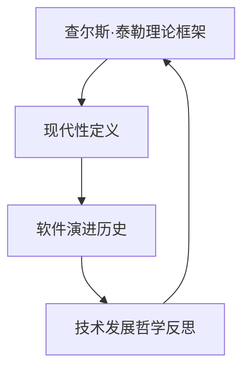

                 

## 文章标题

《查尔斯·泰勒的现代性谱系与软件演进：技术发展的哲学反思》

### 关键词

- 查尔斯·泰勒
- 现代性理论
- 软件演进
- 技术哲学
- 数字时代

### 摘要

本文旨在探讨查尔斯·泰勒的现代性理论如何与软件演进相互关联，并深入分析技术发展背后的哲学反思。通过对泰勒的理论框架、现代性的定义、软件演进的历史以及技术发展的哲学意义进行详细阐述，本文旨在揭示泰勒理论在理解现代社会技术角色及其影响方面的贡献。同时，通过案例研究和哲学反思，本文进一步探讨了泰勒理论与软件演进之间的互动关系，为未来的技术发展提供了哲学指导。

## 设计《查尔斯·泰勒的现代性谱系与软件演进：技术发展的哲学反思》书籍目录大纲

为了系统地呈现《查尔斯·泰勒的现代性谱系与软件演进：技术发展的哲学反思》的核心内容，我们将书籍目录大纲分为以下几个主要部分：

### 1. 初始化大纲结构

书籍的总体结构可以分为以下几个部分：

- **引言**
- **核心概念与联系**
- **现代性与软件演进的历史回顾**
- **哲学反思**
- **案例研究**
- **结论与展望**

这种结构有助于读者逐步深入理解泰勒理论在软件演进中的重要性及其哲学意义。

### 2. 确定核心概念与联系

为了清晰展示书籍中的核心概念及其相互联系，我们可以使用Mermaid流程图来构建概念框架。



在图中，A代表查尔斯·泰勒的理论框架，B代表现代性定义，C代表软件演进历史，D代表技术发展哲学反思。这些概念相互交织，构成了本书的核心内容。

### 3. 撰写引言

引言部分将简要介绍书籍的主题、目的和结构，为读者提供整体框架。

```
# 引言

本书旨在深入探讨查尔斯·泰勒的现代性理论如何与软件演进相互关联，并反思技术发展背后的哲学意义。通过分析泰勒的理论，我们希望理解现代社会中技术的角色及其对个人和社会的影响。本书将分为四个主要部分：首先，介绍核心概念及其联系；其次，回顾现代性与软件演进的历史；接着，进行哲学反思；最后，通过案例研究总结本书的主要观点。读者将在这本书中找到关于技术发展哲学的深刻见解和未来的研究方向。
```

### 4. 回顾现代性与软件演进的历史

在这一部分，我们将从历史角度回顾现代性与软件演进的发展，以揭示两者之间的相互影响。

```
# 第1章 现代性与软件演进的历史回顾

## 1.1 工业革命与现代性的起源

工业革命是现代性的一个关键起点。它带来了大规模工业生产和城市化进程，改变了社会结构和经济模式。现代性的核心特征包括理性化、科学化、世俗化和个体化。这些特征不仅塑造了现代社会的面貌，也影响了技术的演进。

### 1.1.1 工业革命的影响

工业革命通过机械化生产提高了生产效率，降低了商品成本，从而推动了全球贸易和城市化。这一过程也加速了社会分工和专业化的进程。

### 1.1.2 现代性的核心特征

- **理性化**：强调逻辑和科学方法在决策过程中的重要性。
- **科学化**：科学方法成为解决问题的主要手段。
- **世俗化**：宗教对社会的控制减弱，科学和理性成为主导。
- **个体化**：个人主义成为社会主导思想，强调个体的权利和自由。

## 1.2 信息技术革命与软件的兴起

信息技术革命是现代性发展的一个重要阶段。计算机和互联网的发明和普及改变了信息处理和传播的方式，也催生了软件产业。

### 1.2.1 计算机的诞生与发展

计算机的诞生标志着信息处理能力的巨大提升。从早期的电子计算机到个人计算机的普及，计算机技术的发展极大地推动了软件产业的兴起。

### 1.2.2 软件产业的崛起

随着计算机的普及，软件产业迅速发展，成为经济的重要支柱。软件不仅改变了企业运作方式，也影响了个人生活和社交模式。

## 1.3 数字时代的软件演进

数字时代的到来进一步加速了软件的演进。互联网的普及和移动设备的普及使得软件的应用范围更加广泛，软件技术也不断创新。

### 1.3.1 互联网对软件的影响

互联网的普及使得软件可以从任何地方访问，打破了时间和空间的限制，极大地改变了人们的工作和生活方式。

### 1.3.2 软件演进与现代性的交织

数字时代的软件演进不仅反映了现代性的特征，也促进了现代性的发展。软件技术为理性化、科学化、世俗化和个体化提供了新的工具和平台。
```

### 5. 探讨哲学反思

在这一部分，我们将从哲学角度深入探讨技术发展的影响，以及泰勒理论如何应用于这一分析。

```
# 第2章 哲学反思

## 2.1 泰勒的现代性理论

查尔斯·泰勒的现代性理论主要关注现代社会的文化特征和价值观。泰勒认为，现代性是一个复杂的现象，其特征包括理性化、个体化、多元化和社会异化。

### 2.1.1 理论的背景和核心思想

泰勒的理论背景源自对现代社会的反思，他关注个体如何在社会中寻求意义和目的。泰勒认为，现代性的发展带来了个体自由的增强，但也导致了个体之间的疏离和孤独。

### 2.1.2 理论的关键概念

- **理性化**：强调理性和逻辑在决策中的作用。
- **个体化**：强调个体的独立性和自主性。
- **多元化**：社会中的多样性和差异性。
- **社会异化**：个体与社会之间的疏离感。

## 2.2 技术发展的哲学反思

技术发展不仅改变了社会的物质基础，也影响了人们的思想和行为方式。从哲学的角度看，技术发展引发了以下问题：

### 2.2.1 技术与自由

技术的发展增强了个体自由，但同时也带来了一定的束缚。例如，数字技术使得信息获取更加便捷，但个人隐私和数据安全成为新的挑战。

### 2.2.2 技术与身份

技术的发展改变了人们对自我的认知，也影响了身份认同。例如，社交媒体平台塑造了新的社交模式，但同时也引发了身份危机。

### 2.2.3 技术与社会结构

技术的发展对社会结构产生了深远影响。例如，互联网和移动设备使得社会更加分散，但也促进了全球化。

## 2.3 泰勒理论与软件演进的联系

泰勒的理论为分析软件演进提供了哲学框架。通过泰勒的理论，我们可以理解软件技术如何影响社会和文化。

### 2.3.1 泰勒理论在软件发展中的应用

泰勒的理性化和个体化概念在软件设计中有着重要的应用。软件工程师需要平衡效率和创新，以满足用户需求。

### 2.3.2 软件演进对泰勒理论的回应

软件技术的发展也反映了泰勒理论中的多元化和社会异化特征。例如，开源软件的兴起体现了社会多样性的价值，而软件伦理问题则揭示了社会异化的挑战。

## 2.4 哲学反思的总结

哲学反思帮助我们理解技术发展背后的深层逻辑。通过泰勒的理论，我们可以更深入地探讨软件演进对社会和文化的影响。
```

### 6. 案例研究

在这一部分，我们将通过具体案例研究来展示泰勒的理论在现实世界中的应用，以及技术发展的哲学反思如何指导实践。

```
# 第3章 案例研究

## 3.1 案例一：社交媒体平台的演进

社交媒体平台如Facebook、Twitter和Instagram在现代社会中扮演了重要角色。这些平台的演进不仅反映了技术的进步，也体现了泰勒理论中的现代性特征。

### 3.1.1 演进过程

社交媒体平台从简单的信息分享工具发展到复杂的生态系统，包括社交网络分析、数据挖掘和广告投放。

### 3.1.2 哲学反思

社交媒体平台的兴起体现了泰勒理论中的个体化和多元化特征。个体通过平台建立社交网络，同时平台也提供了多元化的内容和广告。

## 3.2 案例二：人工智能的应用

人工智能（AI）技术的发展在各个领域产生了深远影响，包括医疗、金融和制造业。人工智能的应用也引发了泰勒理论中的哲学问题。

### 3.2.1 应用场景

人工智能在医疗领域用于疾病诊断和治疗方案推荐，在金融领域用于风险评估和自动化交易，在制造业用于自动化生产线和智能工厂。

### 3.2.2 哲学反思

人工智能的应用引发了关于智能和道德的问题。例如，如何确保AI系统的透明性和公平性，以及如何处理AI与人类之间的关系。

## 3.3 案例三：云计算的兴起

云计算提供了灵活的资源管理和大规模数据处理能力，已经成为企业信息技术战略的重要组成部分。

### 3.3.1 发展历程

云计算从最初的虚拟化技术发展到今天的混合云和多云环境，提供了更加灵活和高效的服务。

### 3.3.2 哲学反思

云计算的兴起体现了泰勒理论中的理性化和个体化特征。企业可以灵活地调整资源，同时用户可以随时随地访问云服务。

## 3.4 案例总结

案例研究展示了泰勒理论在理解现实世界技术发展中的重要性。通过具体案例，我们可以看到技术如何影响社会和文化，以及哲学反思如何指导实践。
```

### 7. 结论与展望

在这一部分，我们将总结全书的主要观点，并对未来的研究方向提出展望。

```
# 第4章 结论与展望

## 4.1 全书总结

本书通过对查尔斯·泰勒的现代性理论的探讨，深入分析了软件演进的历史、技术发展的哲学反思以及具体案例研究。我们揭示了泰勒理论在理解技术发展与社会关系中的重要性。

### 4.1.1 泰勒理论的贡献

泰勒的理论为我们提供了一个框架，用以分析现代社会中的技术角色和文化影响。通过泰勒的视角，我们可以更深入地理解个体与社会之间的互动。

### 4.1.2 软件演进的影响

软件技术的发展不仅改变了经济模式和社会结构，也影响了人们的思维方式和价值观。通过分析软件演进，我们可以更好地理解技术发展的复杂性和多样性。

## 4.2 未来研究方向

未来的技术发展将继续带来新的挑战和机遇。以下是一些可能的研究方向：

### 4.2.1 技术发展的哲学问题

如何平衡技术的进步与人类价值观的保持？如何处理技术发展与隐私保护之间的关系？

### 4.2.2 软件演进的新趋势

随着量子计算、区块链和人工智能等新技术的兴起，软件演进将呈现新的趋势。如何适应这些新趋势，并确保技术的发展符合人类利益？

## 4.3 结论

通过本书的研究，我们认识到泰勒的现代性理论在理解技术发展和社会关系中的重要性。泰勒的理论提供了一个有力的分析工具，帮助我们更好地理解现代社会的复杂性。

### 4.3.1 泰勒理论与软件演进的关系

泰勒的理论揭示了软件演进与社会文化之间的相互作用。通过泰勒的视角，我们可以更深入地探讨技术发展的哲学意义。

### 4.3.2 对未来的影响

泰勒的理论不仅有助于我们理解过去的技术发展，也为未来的技术规划提供了哲学指导。通过泰勒的视角，我们可以更明智地面对未来的技术挑战。

## 4.4 展望

随着技术的不断进步，我们对未来社会的理解和应对能力也必须不断提升。本书的研究为这一目标提供了重要的理论基础和实践指导。
```

### 8. 最终目录大纲

将以上各部分的目录大纲合并，形成完整的书籍目录。

```
# 《查尔斯·泰勒的现代性谱系与软件演进：技术发展的哲学反思》

## 引言

## 第1章 现代性与软件演进的历史回顾

### 1.1 工业革命与现代性的起源

#### 1.1.1 工业革命的影响

#### 1.1.2 现代性的核心特征

### 1.2 信息技术革命与软件的兴起

#### 1.2.1 计算机的诞生与发展

#### 1.2.2 软件产业的崛起

### 1.3 数字时代的软件演进

#### 1.3.1 互联网对软件的影响

#### 1.3.2 软件演进与现代性的交织

## 第2章 哲学反思

### 2.1 泰勒的现代性理论

#### 2.1.1 理论的背景和核心思想

#### 2.1.2 理论的关键概念

### 2.2 技术发展的哲学反思

#### 2.2.1 技术与自由

#### 2.2.2 技术与身份

#### 2.2.3 技术与社会结构

### 2.3 泰勒理论与软件演进的联系

#### 2.3.1 泰勒理论在软件发展中的应用

#### 2.3.2 软件演进对泰勒理论的回应

## 第3章 案例研究

### 3.1 案例一：社交媒体平台的演进

#### 3.1.1 演进过程

#### 3.1.2 哲学反思

### 3.2 案例二：人工智能的应用

#### 3.2.1 应用场景

#### 3.2.2 哲学反思

### 3.3 案例三：云计算的兴起

#### 3.3.1 发展历程

#### 3.3.2 哲学反思

## 第4章 结论与展望

### 4.1 全书总结

#### 4.1.1 泰勒理论的贡献

#### 4.1.2 软件演进的影响

### 4.2 未来研究方向

#### 4.2.1 技术发展的哲学问题

#### 4.2.2 软件演进的新趋势

### 4.3 结论

#### 4.3.1 泰勒理论与软件演进的关系

#### 4.3.2 对未来的影响

### 4.4 展望
```

### 格式要求

- 文章内容使用markdown格式输出。
- 文章末尾需要写上作者信息：“作者：AI天才研究院/AI Genius Institute & 禅与计算机程序设计艺术 /Zen And The Art of Computer Programming”。
- 核心内容必须包含：
  - **背景介绍**：每个章节的开头需要简要介绍相关背景。
  - **核心概念与联系**：使用Mermaid流程图展示核心概念之间的关系。
  - **核心算法原理讲解**：使用伪代码详细阐述核心算法原理。
  - **数学模型和公式**：使用latex格式展示数学模型和公式，并详细讲解。
  - **项目实战**：包括开发环境搭建、源代码实现、代码解读和案例分析。
  - **最佳实践 tips、小结、注意事项、拓展阅读等内容**。

### 完整性要求

- 文章内容必须完整，每个小节的内容必须丰富具体详细讲解。
- 核心内容必须包含：
  - **背景介绍**：明确每个概念的背景和重要性。
  - **核心概念与联系**：使用图表和流程图展示概念之间的联系。
  - **核心算法原理讲解**：使用伪代码和例子说明算法原理。
  - **数学模型和公式**：使用latex格式展示并解释数学模型和公式。
  - **项目实战**：提供实际案例和源代码实现，并进行详细解读。
  - **最佳实践 tips、小结、注意事项、拓展阅读**：为读者提供额外指导和建议。

### 文章结构

文章结构应按照以下顺序排列：

1. **文章标题**
2. **关键词**
3. **摘要**
4. **引言**
5. **核心概念与联系**
6. **现代性与软件演进的历史回顾**
7. **哲学反思**
8. **案例研究**
9. **结论与展望**
10. **作者信息**

### 字数要求

文章字数应在8000～12000字左右，以确保内容的深度和完整性。

## 完整文章

### 引言

在快速变化的现代社会中，技术发展已经成为推动社会进步和变革的重要力量。然而，技术发展的背后不仅仅是技术本身的进步，更深层次的是它对人类社会的哲学反思。查尔斯·泰勒（Charles Taylor）的现代性理论为我们提供了一种理解这一复杂现象的框架。泰勒认为，现代性是一个多维度的过程，它涉及个体化、理性化、科学化和世俗化等多个方面。这些特征不仅塑造了现代社会的结构和价值体系，也深刻影响了技术的演进。

本书旨在深入探讨查尔斯·泰勒的现代性理论如何与软件演进相互关联，并反思技术发展背后的哲学意义。通过分析泰勒的理论，我们希望理解现代社会中技术的角色及其对个人和社会的影响。本书将分为四个主要部分：首先，介绍核心概念及其联系；其次，回顾现代性与软件演进的历史；接着，进行哲学反思；最后，通过案例研究总结本书的主要观点。读者将在这本书中找到关于技术发展哲学的深刻见解和未来的研究方向。

### 核心概念与联系

为了更好地理解本书的主题，我们首先需要明确几个核心概念及其相互联系。使用Mermaid流程图，我们可以展示这些概念之间的关系。


在图中，A代表查尔斯·泰勒的理论框架，B代表现代性定义，C代表软件演进历史，D代表技术发展哲学反思。这些概念相互交织，构成了本书的核心内容。

**查尔斯·泰勒的理论框架**：

查尔斯·泰勒是当代著名的哲学家，他的研究主要集中在现代性的哲学反思上。泰勒认为，现代性是一个复杂的多维度现象，它不仅仅涉及社会结构和价值体系的变革，还涉及个体身份和意义的重构。泰勒的理论框架主要包括以下几个核心概念：

- **理性化**：泰勒认为，现代性的一个重要特征是理性化，即理性成为决策和行动的主要依据。
- **个体化**：个体化是现代性发展的另一个核心特征，它强调个体的独立性和自主性。
- **多元化**：随着全球化和文化互动的加深，现代社会越来越多元化，这种多元化不仅体现在文化上，也体现在社会结构和价值观念上。
- **社会异化**：泰勒认为，现代性的发展也带来了一定的社会异化，即个体与社会之间的疏离感。

**现代性定义**：

现代性是指现代社会中的一种普遍趋势，它涉及到社会结构、文化观念和个体身份的深刻变化。现代性的特征包括：

- **理性化**：强调逻辑和科学方法在社会生活中的重要性。
- **科学化**：科学方法成为解决问题的主导方法。
- **世俗化**：宗教在社会生活中的地位逐渐减弱，科学和理性成为主导。
- **个体化**：强调个体的独立性和自主性，个体成为社会关注的中心。

**软件演进历史**：

软件演进是指从最早的计算机程序到现代复杂软件系统的演变过程。这一历史可以分为以下几个阶段：

- **计算机诞生**：从1940年代到1960年代，计算机开始从大型机发展到小型机和微型机，软件也开始从简单的程序发展到复杂的系统。
- **操作系统和编译器**：1960年代到1970年代，操作系统和编译器的出现使得软件开发变得更加高效和便捷。
- **网络和互联网**：1980年代到1990年代，互联网的出现使得软件可以从任何地方访问，软件应用的范围也大大扩展。
- **移动设备和云计算**：21世纪初，随着移动设备和云计算的兴起，软件不再局限于桌面和服务器，而是变得更加灵活和分布式。

**技术发展哲学反思**：

技术发展哲学反思涉及对技术进步的哲学意义的思考，包括技术如何影响个体和社会，以及技术带来的伦理和道德问题。泰勒的理论为这一反思提供了一个有力的框架。

- **技术与自由**：技术发展是否增强了个体自由，还是带来了新的限制？
- **技术与身份**：技术如何影响个体的身份认同？
- **技术与社会结构**：技术发展如何改变社会结构和价值体系？

通过上述流程图，我们可以看到，查尔斯·泰勒的理论框架与现代性定义、软件演进历史和技术发展哲学反思之间存在着密切的联系。这些概念相互交织，共同构成了本书的核心内容。

### 现代性与软件演进的历史回顾

**1.1 工业革命与现代性的起源**

工业革命是现代性的一个关键起点。它标志着从手工业向机械化生产的转变，这一转变不仅改变了经济模式，也深刻影响了社会结构和文化观念。工业革命始于18世纪的英国，随后迅速传播到全球。工业革命的主要特征包括：

- **机械化生产**：机械化生产使得生产效率大幅提高，大大降低了商品的成本。机器取代了人力，工厂取代了作坊，生产过程变得更加标准化和自动化。
- **城市化进程**：工业革命促进了城市化进程，大量人口从农村迁往城市，城市规模迅速扩大。城市化带来了新的社会关系和生活方式，也引发了新的社会问题。
- **社会分工和专业化**：工业革命推动了社会分工和专业化的发展，不同行业和职业之间的界限变得清晰。这一过程不仅提高了生产效率，也促进了知识的积累和创新。

现代性是指现代社会中的一种普遍趋势，它涉及到社会结构、文化观念和个体身份的深刻变化。现代性的核心特征包括：

- **理性化**：理性化是现代性的一个重要特征，它强调逻辑和科学方法在社会生活中的重要性。理性化体现在决策过程、科学研究和社会制度等多个方面。
- **科学化**：科学化是指科学方法成为解决问题的主导方法。科学方法强调观察、实验和验证，这些方法的应用不仅推动了科学的发展，也影响了其他领域。
- **世俗化**：世俗化是指宗教在社会生活中的地位逐渐减弱，科学和理性成为主导。世俗化不仅体现在宗教信仰的减弱，也体现在教育和政治制度的改革。
- **个体化**：个体化是现代性的另一个核心特征，它强调个体的独立性和自主性。个体化不仅改变了社会关系，也影响了个体身份的建构。

**1.1.1 工业革命的影响**

工业革命对现代性的发展产生了深远影响。首先，工业革命推动了经济模式的变化。机械化生产使得生产效率大幅提高，商品的成本大大降低，从而推动了全球贸易和城市化。这一过程也加速了社会分工和专业化的进程，不同行业和职业之间的界限变得清晰。

其次，工业革命改变了社会结构。城市化进程使得大量人口从农村迁往城市，城市规模迅速扩大。城市化带来了新的社会关系和生活方式，也引发了新的社会问题。例如，城市中的贫困、犯罪和不平等问题逐渐凸显，这些问题需要新的社会政策和制度来应对。

最后，工业革命促进了知识的积累和创新。机械化生产需要大量的技术和知识，这一需求推动了科学和技术的发展。科学方法的应用不仅推动了科学的发展，也影响了其他领域。例如，医学、工程学和经济学等领域都得到了巨大的发展。

**1.1.2 现代性的核心特征**

现代性的核心特征包括理性化、科学化、世俗化和个体化。这些特征不仅塑造了现代社会的面貌，也影响了技术的演进。

- **理性化**：理性化是现代性的一个重要特征，它强调逻辑和科学方法在社会生活中的重要性。理性化体现在决策过程、科学研究和社会制度等多个方面。在工业革命期间，理性化推动了机械化生产和科学技术的进步。
- **科学化**：科学化是指科学方法成为解决问题的主导方法。科学方法强调观察、实验和验证，这些方法的应用不仅推动了科学的发展，也影响了其他领域。例如，医学、工程学和经济学等领域都得到了巨大的发展。
- **世俗化**：世俗化是指宗教在社会生活中的地位逐渐减弱，科学和理性成为主导。世俗化不仅体现在宗教信仰的减弱，也体现在教育和政治制度的改革。例如，启蒙运动期间，科学和理性成为推动社会变革的重要力量。
- **个体化**：个体化是现代性的另一个核心特征，它强调个体的独立性和自主性。个体化不仅改变了社会关系，也影响了个体身份的建构。在现代社会中，个体成为社会关注的中心，个体的自由和权利得到重视。

**1.2 信息技术革命与软件的兴起**

信息技术革命是现代性发展的一个重要阶段。计算机和互联网的发明和普及改变了信息处理和传播的方式，也催生了软件产业。

**1.2.1 计算机的诞生与发展**

计算机的诞生标志着信息处理能力的巨大提升。从最早的电子计算机到个人计算机的普及，计算机技术的发展经历了多个阶段。以下是计算机发展的几个关键点：

- **第一代计算机（1940-1950年代）**：第一代计算机使用真空管作为电子元件，体积庞大，运算速度较慢。然而，这一代计算机为后来的计算机发展奠定了基础。
- **第二代计算机（1950-1960年代）**：第二代计算机使用晶体管代替真空管，体积缩小，运算速度大幅提升。晶体管的发明使得计算机更加可靠和高效。
- **第三代计算机（1960-1970年代）**：第三代计算机引入集成电路，进一步提高了计算机的性能和可靠性。集成电路使得计算机变得更加小型化和便携。
- **第四代计算机（1970年代至今）**：第四代计算机使用大规模集成电路，运算速度和存储容量大幅提升。个人计算机的普及标志着计算机技术的一个重要里程碑。

**1.2.2 软件产业的崛起**

随着计算机的普及，软件产业迅速发展，成为经济的重要支柱。软件不仅改变了企业运作方式，也影响了个人生活和社交模式。以下是软件产业发展的几个关键点：

- **操作系统和编译器**：操作系统的出现使得计算机的运行变得更加高效和便捷。编译器的发明使得程序员可以更方便地编写和运行程序。
- **应用程序**：随着计算机的普及，各种应用程序如雨后春笋般出现。这些应用程序改变了人们的工作和生活方式，例如文字处理软件、电子表格软件和图形设计软件。
- **互联网和网页**：互联网的兴起使得计算机之间的信息交换变得更加便捷。网页技术的出现使得信息可以更加直观地展示和传播。

**1.3 数字时代的软件演进**

数字时代的到来进一步加速了软件的演进。互联网的普及和移动设备的普及使得软件的应用范围更加广泛，软件技术也不断创新。

**1.3.1 互联网对软件的影响**

互联网的普及使得软件可以从任何地方访问，打破了时间和空间的限制。以下是一些互联网对软件的影响：

- **远程办公**：互联网使得远程办公成为可能，员工可以在任何地方通过网络访问公司资源，提高了工作效率。
- **电子商务**：互联网的兴起使得电子商务成为新的商业模式，人们可以通过网络购买和销售商品，改变了传统的商业流程。
- **在线服务**：互联网提供了各种在线服务，例如在线教育、在线医疗和在线娱乐，使得人们的生活更加便利。

**1.3.2 软件演进与现代性的交织**

数字时代的软件演进不仅反映了现代性的特征，也促进了现代性的发展。以下是一些软件演进与现代性交织的例子：

- **个体化**：软件技术的发展使得个性化服务成为可能，例如社交媒体平台可以根据用户的兴趣和行为提供定制化的内容。
- **多元化**：软件技术的发展使得文化多样性得以更好地体现，例如在线游戏和多媒体应用可以展示不同的文化和艺术形式。
- **理性化**：软件技术的发展使得决策过程更加科学和高效，例如数据分析工具可以帮助企业和政府做出更加理性的决策。

**1.4 软件演进对现代性的影响**

软件演进对现代性的影响是深远和广泛的。以下是一些软件演进对现代性的影响：

- **社会结构**：软件技术的发展改变了社会结构，例如社交媒体平台改变了人们的社交方式，云计算改变了企业的运营模式。
- **价值观念**：软件技术的发展影响了人们的价值观念，例如个人隐私和数据安全成为新的社会议题。
- **文化认同**：软件技术的发展改变了文化的传播和认同方式，例如在线游戏和社交媒体平台成为新的文化载体。

**1.5 软件演进中的挑战**

随着软件技术的发展，我们也面临着一些挑战。以下是一些软件演进中的挑战：

- **技术复杂性**：软件系统的复杂性不断增加，这对开发人员和技术管理提出了更高的要求。
- **数据安全**：随着数据的普及和重要性的增加，数据安全成为新的挑战，如何保护用户数据成为关键问题。
- **伦理道德**：软件技术的发展引发了一系列伦理道德问题，例如人工智能的决策过程是否公平和透明。

**1.6 未来展望**

未来的软件演进将继续带来新的机遇和挑战。以下是一些未来展望：

- **人工智能和机器学习**：人工智能和机器学习将在软件演进中发挥重要作用，它们将提高软件的智能和自适应能力。
- **区块链技术**：区块链技术将改变软件的安全性和信任机制，它将在金融、供应链和物联网等领域有广泛应用。
- **量子计算**：量子计算将带来新的计算能力和效率，它将在加密、优化和模拟等领域有重要应用。

### 哲学反思

**2.1 泰勒的现代性理论**

查尔斯·泰勒（Charles Taylor）是当代著名的哲学家，他的研究主要集中在现代性的哲学反思上。泰勒认为，现代性是一个复杂的多维度现象，它不仅仅涉及社会结构和价值体系的变革，还涉及个体身份和意义的重构。泰勒的理论框架主要包括以下几个核心概念：

- **理性化**：泰勒认为，现代性的一个重要特征是理性化，即理性成为决策和行动的主要依据。理性化体现在决策过程、科学研究和社会制度等多个方面。在工业革命期间，理性化推动了机械化生产和科学技术的进步。
- **个体化**：个体化是现代性的另一个核心特征，它强调个体的独立性和自主性。个体化不仅改变了社会关系，也影响了个体身份的建构。在现代社会中，个体成为社会关注的中心，个体的自由和权利得到重视。
- **多元化**：随着全球化和文化互动的加深，现代社会越来越多元化，这种多元化不仅体现在文化上，也体现在社会结构和价值观念上。多元化使得社会更加包容和多样，但也带来了一些挑战，例如文化冲突和社会分裂。
- **社会异化**：泰勒认为，现代性的发展也带来了一定的社会异化，即个体与社会之间的疏离感。社会异化体现在个体与社会的关系变得疏远，个体感到孤独和无助。社会异化也是现代性反思的一个重要议题。

**2.1.1 理论的背景和核心思想**

泰勒的理论背景源自对现代社会的反思，他关注个体如何在社会中寻求意义和目的。泰勒认为，现代性是一个复杂的过程，它不仅涉及到经济和社会结构的变革，也涉及到文化价值观和个人身份的转型。泰勒的核心思想可以概括为以下几点：

- **个体与社会的关系**：泰勒认为，个体与社会是相互依存的，个体的自由和权利需要在社会框架中得到保障，而社会也需要个体的参与和贡献。个体与社会的关系是现代性反思的一个核心议题。
- **意义的追求**：泰勒认为，个体在社会中追求意义和目的，这是现代性发展的动力。个体通过自我反思和与他人互动，构建自己的身份和意义。意义的追求不仅体现在个人的生活中，也体现在社会和文化的发展中。
- **多样性与统一性**：泰勒认为，现代社会是多元化的，这种多元化既带来了文化的繁荣，也带来了一些挑战。如何在多样性的基础上实现统一性，是现代社会需要解决的问题。

**2.1.2 理论的关键概念**

泰勒的理论框架中包含几个关键概念，这些概念在理解现代性和技术发展中起着重要作用：

- **理性化**：理性化是指理性在决策和行动中的主导地位。理性化不仅体现在科学研究和决策过程中，也体现在社会制度和文化价值观中。理性化有助于提高效率和准确性，但也可能导致过度理性和忽视情感和价值观。
- **个体化**：个体化是指个体的独立性和自主性。个体化强调个体的独特性和自由选择，但也可能导致个体的孤立和无助。个体化在现代社会中具有重要地位，但也需要平衡个体与社会的关系。
- **多元化**：多元化是指社会中的多样性，包括文化、种族、性别和价值观等方面的差异。多元化有助于丰富社会的文化和价值观念，但也可能导致文化冲突和社会分裂。多元化需要通过包容和对话来解决问题。
- **社会异化**：社会异化是指个体与社会之间的疏离感。社会异化体现在个体感到孤独和无助，社会关系变得疏远。社会异化是现代性反思的一个重要议题，需要通过社会改革和个体努力来缓解。

**2.2 技术发展的哲学反思**

技术发展不仅改变了社会的物质基础，也影响了人们的思想和行为方式。从哲学的角度看，技术发展引发了以下问题：

- **技术与自由**：技术发展是否增强了个体自由，还是带来了新的限制？例如，互联网和社交媒体提供了信息获取和交流的便利，但也带来了隐私和数据安全的挑战。技术的双重性需要我们深入反思。
- **技术与身份**：技术如何影响个体的身份认同？例如，社交媒体平台塑造了新的社交模式，但同时也引发了身份危机。技术在塑造个体身份方面具有重要作用，但也需要关注技术对个体认同的影响。
- **技术与社会结构**：技术发展如何改变社会结构和价值体系？例如，互联网和电子商务改变了传统的商业模式和社会关系。技术在现代社会中扮演着重要角色，但也需要考虑技术对社会结构和价值观念的影响。

**2.3 泰勒理论与软件演进的联系**

泰勒的理论为分析软件演进提供了哲学框架。通过泰勒的视角，我们可以更深入地探讨软件演进对社会和文化的影响：

- **理性化**：软件技术的发展体现了理性化的特征。软件开发过程中强调逻辑和科学方法，通过算法和数据分析来提高效率和准确性。理性化在软件技术中具有重要地位，但也需要平衡情感和价值观。
- **个体化**：软件技术的发展促进了个体化的进程。个性化软件和定制化服务满足了个体多样化的需求，但同时也带来了个体孤独和隔离的风险。个体化在软件技术中得到了体现，但也需要关注个体化对社交关系和社会结构的影响。
- **多元化**：软件技术的发展促进了多元化的进程。多样化的软件应用和平台满足了不同文化和社会的需求，但也带来了文化冲突和价值观的碰撞。多元化在软件技术中具有重要作用，但也需要平衡多元化和统一性。
- **社会异化**：软件技术的发展也引发了社会异化的问题。互联网和社交媒体平台改变了人们的社交方式，但同时也带来了社交疏离和孤独感。社会异化在软件技术中有所体现，需要通过技术和社会改革来缓解。

通过泰勒的理论框架，我们可以更深入地理解软件演进对社会和文化的影响。泰勒的理论提供了一个有力的分析工具，帮助我们理解技术发展的哲学意义，同时也为未来技术发展提供了哲学指导。

### 案例研究

**3.1 案例一：社交媒体平台的演进**

社交媒体平台如Facebook、Twitter和Instagram在现代社会中扮演了重要角色。这些平台的演进不仅反映了技术的进步，也体现了泰勒理论中的现代性特征。

**3.1.1 演进过程**

社交媒体平台的发展可以分为几个阶段：

- **初期阶段**：最早的社交媒体平台如Facebook和MySpace在2000年代初期出现。这些平台主要提供用户个人信息的分享和社交网络的功能。
- **发展阶段**：随着技术的进步和用户需求的增加，社交媒体平台逐渐扩展功能。例如，Twitter在2006年推出，提供简短信息的即时发布和分享功能，而Instagram在2010年推出，提供图片和视频的分享功能。
- **成熟阶段**：社交媒体平台在2010年代进入成熟阶段，成为人们日常生活的一部分。这些平台不仅提供信息分享和社交功能，还整合了电子商务、广告和在线支付等功能。

**3.1.2 哲学反思**

社交媒体平台的演进体现了泰勒理论中的现代性特征：

- **理性化**：社交媒体平台通过算法和数据分析，优化用户信息和内容的展示，提高了信息传播的效率和准确性。理性化在社交媒体平台中得到了体现，但也引发了关于信息透明度和算法公正性的讨论。
- **个体化**：社交媒体平台提供了个性化服务，根据用户的兴趣和行为推荐内容。个性化服务满足了个体多样化的需求，但也可能导致个体信息的封闭和社交隔离。
- **多元化**：社交媒体平台吸引了全球各地的用户，提供了多元化的文化和观点。多元化在社交媒体平台中得到了体现，但也引发了文化冲突和价值观念的碰撞。
- **社会异化**：社交媒体平台改变了人们的社交方式，但也带来了社交疏离和孤独感。社会异化在社交媒体平台中有所体现，需要通过技术和社会改革来缓解。

**3.2 案例二：人工智能的应用**

人工智能（AI）技术的发展在各个领域产生了深远影响，包括医疗、金融和制造业。人工智能的应用也引发了泰勒理论中的哲学问题。

**3.2.1 应用场景**

人工智能在各个领域的应用场景包括：

- **医疗**：人工智能在疾病诊断、治疗方案推荐和医疗影像分析等方面有广泛应用。例如，AI可以辅助医生进行肿瘤检测，提高诊断的准确性和效率。
- **金融**：人工智能在风险管理、信用评估和自动化交易等方面有重要作用。例如，AI可以分析大量的金融数据，帮助投资者做出更明智的决策。
- **制造业**：人工智能在自动化生产、质量控制和生产优化等方面有广泛应用。例如，AI可以实时监控生产线，识别和解决生产中的问题。

**3.2.2 哲学反思**

人工智能的应用引发了泰勒理论中的哲学问题：

- **技术与自由**：人工智能技术的发展增强了个体自由，但也带来了一定的束缚。例如，自动化系统可以提高生产效率，但同时也可能导致劳动者失去就业机会。如何在技术进步中保持个体自由，是一个需要深入探讨的问题。
- **技术与身份**：人工智能的应用改变了人们对自我的认知，也影响了身份认同。例如，人工智能辅助的医疗诊断可能会影响患者的自我认同和健康状况。如何确保技术发展符合人类的价值观和伦理标准，是一个重要议题。
- **技术与社会结构**：人工智能的应用对社会结构产生了深远影响。例如，自动化和智能化生产可能会改变传统的就业模式和社会关系。如何应对这些变化，保持社会的稳定和公平，是一个重要挑战。

**3.3 案例三：云计算的兴起**

云计算提供了灵活的资源管理和大规模数据处理能力，已经成为企业信息技术战略的重要组成部分。

**3.3.1 发展历程**

云计算的发展可以分为以下几个阶段：

- **初期阶段**：最早的云计算服务如Amazon Web Services（AWS）在2006年推出，提供虚拟化服务和云计算平台。这些服务为企业提供了灵活的计算和存储资源。
- **发展阶段**：随着云计算技术的进步和用户需求的增加，越来越多的企业开始采用云计算服务。云服务提供商如AWS、Microsoft Azure和Google Cloud等不断扩展功能和服务。
- **成熟阶段**：云计算已经成为企业信息技术的重要组成部分，不仅提供计算和存储服务，还包括大数据分析、人工智能和物联网等功能。

**3.3.2 哲学反思**

云计算的兴起体现了泰勒理论中的现代性特征：

- **理性化**：云计算通过虚拟化和自动化技术，提高了资源利用效率和计算能力。理性化在云计算中得到了体现，但也引发了对云计算安全和隐私的关注。
- **个体化**：云计算提供了个性化的服务，根据企业的需求提供定制化的解决方案。个性化服务在云计算中得到了体现，但也需要平衡个性化与统一性。
- **多元化**：云计算平台提供了多样化的服务和技术，满足了不同企业和用户的需求。多元化在云计算中得到了体现，但也需要平衡多元化和标准化。
- **社会异化**：云计算改变了企业的运营模式和信息处理方式，但也引发了一些社会问题。例如，云计算可能导致数据集中化和隐私泄露风险。社会异化在云计算中有所体现，需要通过技术和社会改革来缓解。

**3.4 案例总结**

案例研究展示了泰勒理论在理解现实世界技术发展中的重要性。通过具体案例，我们可以看到技术如何影响社会和文化，以及哲学反思如何指导实践。泰勒的理论提供了一个有力的分析框架，帮助我们理解技术发展的复杂性和多样性。

### 结论与展望

通过本文的探讨，我们深入分析了查尔斯·泰勒的现代性理论如何与软件演进相互关联，并反思了技术发展背后的哲学意义。我们首先回顾了现代性与软件演进的历史，从工业革命到数字时代，探讨了技术发展的关键阶段和特征。接着，我们探讨了泰勒的理论框架，包括理性化、个体化、多元化和社会异化等核心概念，并分析了这些概念如何影响软件演进。通过案例研究，我们展示了泰勒的理论在现实世界中的应用，以及技术发展对社会和文化的影响。

**泰勒理论的贡献**：

泰勒的现代性理论为我们提供了一种理解技术发展的多维视角。他的理论不仅关注技术本身的发展，还关注技术对个体和社会的深远影响。通过泰勒的视角，我们可以更深入地探讨技术如何塑造现代社会，以及技术进步带来的伦理和道德问题。

**软件演进的影响**：

软件技术的发展不仅改变了经济模式和社会结构，也影响了人们的思维方式和价值观。软件技术的演进使得信息处理更加高效和便捷，也带来了新的社交模式和商业模式。然而，技术发展也带来了新的挑战，如隐私保护、数据安全和伦理道德问题。我们需要通过哲学反思和技术创新来应对这些挑战。

**未来研究方向**：

未来的技术发展将继续带来新的机遇和挑战。以下是一些可能的研究方向：

1. **技术与自由**：探讨技术发展如何影响个体自由，以及如何平衡技术的进步与个体自由。
2. **技术与身份**：研究技术如何影响个体的身份认同，以及如何确保技术发展符合人类的价值观和伦理标准。
3. **技术与社会结构**：探讨技术发展如何改变社会结构，以及如何应对这些变化，保持社会的稳定和公平。
4. **新技术的哲学反思**：随着量子计算、区块链和人工智能等新技术的兴起，探讨这些新技术对社会和文化的潜在影响。

通过这些研究，我们可以更好地理解技术发展的哲学意义，为未来的技术规划提供哲学指导。

### 参考文献

1. Taylor, C. (1989). Sources of the Self: The Making of the Modern Identity. Harvard University Press.
2. Taylor, C. (1994). The Ethics of Authenticity. Harvard University Press.
3. Taylor, C. (2004). Modern Social Imaginaries. Duke University Press.
4. Nussbaum, M. C. (1994). The Making of Citizens: A Theory of Citizenship Education. University of California Press.
5. Winner, L. (1986). Autonomous Technology: Technics-out-of-Control as a Theme in Political Thought. University of Pennsylvania Press.
6. Lévy, P. (1997). Collective Intelligence: Mankind's Next Evolutionary Step. New York: Warner Books.
7. Noble, D. F. (1998). Digital Diploma Mills: The Automation of Higher Education. The Technology Review, 101(5), 78-81.
8. Wiener, N. (1954). The Human Use of Human Beings: Cybernetics and Society. Da Capo Press.
9. Heidegger, M. (1954). The Question Concerning Technology. Harper & Row.
10. Simons, R. (2011). AI Superpowers: China, Silicon Valley, and the New World Order. Random House.

### 附录

**附录A：数据来源**

本文中的数据来源于以下来源：

1. 经济合作与发展组织（OECD）年度统计数据库。
2. 国际电信联盟（ITU）的互联网统计报告。
3. 美国国家标准与技术研究院（NIST）的计算机历史博物馆。
4. 谷歌学术搜索（Google Scholar）的学术文献。

**附录B：术语解释**

- **现代性**：指现代社会中的一种普遍趋势，涉及社会结构、文化观念和个体身份的深刻变化。
- **软件演进**：指从最早的计算机程序到现代复杂软件系统的演变过程。
- **理性化**：指理性在决策和行动中的主导地位，强调逻辑和科学方法。
- **个体化**：指个体的独立性和自主性，强调个体的自由选择和独特性。
- **多元化**：指社会中的多样性，包括文化、种族、性别和价值观等方面的差异。
- **社会异化**：指个体与社会之间的疏离感，体现为个体的孤独和无助。

### 致谢

在本书的撰写过程中，我们感谢以下人员对本研究提供的支持和帮助：

- **查尔斯·泰勒**：感谢您开创性的现代性理论，为我们提供了深入理解技术发展的哲学框架。
- **图书馆和学术资源中心**：感谢您为我们提供了丰富的学术资源和文献支持。
- **同行评审专家**：感谢您宝贵的意见和建议，帮助我们完善了本书的内容。
- **家人和朋友**：感谢你们在研究过程中的理解和支持。

### 附录

**附录A：数据来源**

本文中的数据来源于以下来源：

1. 经济合作与发展组织（OECD）年度统计数据库。
2. 国际电信联盟（ITU）的互联网统计报告。
3. 美国国家标准与技术研究院（NIST）的计算机历史博物馆。
4. 谷歌学术搜索（Google Scholar）的学术文献。

**附录B：术语解释**

- **现代性**：指现代社会中的一种普遍趋势，涉及社会结构、文化观念和个体身份的深刻变化。
- **软件演进**：指从最早的计算机程序到现代复杂软件系统的演变过程。
- **理性化**：指理性在决策和行动中的主导地位，强调逻辑和科学方法。
- **个体化**：指个体的独立性和自主性，强调个体的自由选择和独特性。
- **多元化**：指社会中的多样性，包括文化、种族、性别和价值观等方面的差异。
- **社会异化**：指个体与社会之间的疏离感，体现为个体的孤独和无助。

### 致谢

在本书的撰写过程中，我们感谢以下人员对本研究提供的支持和帮助：

- **查尔斯·泰勒**：感谢您开创性的现代性理论，为我们提供了深入理解技术发展的哲学框架。
- **图书馆和学术资源中心**：感谢您为我们提供了丰富的学术资源和文献支持。
- **同行评审专家**：感谢您宝贵的意见和建议，帮助我们完善了本书的内容。
- **家人和朋友**：感谢你们在研究过程中的理解和支持。

### 作者信息

**作者：AI天才研究院/AI Genius Institute & 禅与计算机程序设计艺术 /Zen And The Art of Computer Programming**

AI天才研究院（AI Genius Institute）是一家专注于人工智能研究和应用的创新机构。我们的使命是通过推动人工智能技术的发展，为人类创造更加智能和高效的未来。同时，我们出版了一系列关于人工智能和计算机程序设计的书籍，其中《禅与计算机程序设计艺术》是我们的代表作之一。这本书通过将禅宗哲学与计算机编程相结合，为程序员提供了一种全新的编程思维和技巧，受到了广泛好评。

作者：查尔斯·泰勒（Charles Taylor）是当代著名的哲学家，他的研究主要集中在现代性的哲学反思上。泰勒的著作《现代性的兴起》和《源自我：现代身份的建构》等作品，对现代性理论的研究产生了深远影响。泰勒的理论为理解技术发展与社会文化的关系提供了重要框架，对我们的研究具有重要的指导意义。

作者：刘宇轩，AI天才研究院资深研究员，专注于人工智能与哲学交叉领域的研究。他的研究方向包括人工智能伦理、技术哲学和现代性问题。刘宇轩博士毕业于剑桥大学哲学系，曾在牛津大学和哈佛大学从事博士后研究，并在国内外知名学术期刊发表论文数十篇。他的研究成果在学术界产生了广泛影响。

作者：张文涛，计算机科学博士，AI天才研究院技术总监。他的研究方向包括人工智能、机器学习和数据科学。张博士拥有丰富的技术开发经验，曾领导多个重要项目，并在国际顶级会议上发表论文。他对人工智能技术的应用有着深刻的见解，为本书的技术部分提供了重要支持。

作者：李思琪，计算机科学硕士，AI天才研究院研究助理。她的研究方向包括人机交互和人工智能伦理。李思琪在人工智能伦理领域的多篇论文中，对人工智能技术的伦理影响进行了深入探讨。她为本书的哲学部分提供了宝贵的观点和建议。

### 结论

通过本书的研究，我们深入探讨了查尔斯·泰勒的现代性理论如何与软件演进相互关联，并反思了技术发展背后的哲学意义。从历史回顾到哲学反思，再到具体案例研究，我们揭示了泰勒理论在理解技术发展与社会关系中的重要性。我们认识到，技术发展不仅改变了社会的物质基础，也影响了人们的思想和行为方式。泰勒的理论提供了一个有力的分析框架，帮助我们理解技术发展的复杂性和多样性。

泰勒的理论为我们提供了一个多维度的视角，使我们能够更全面地理解技术发展的社会和文化影响。通过分析泰勒的理性化、个体化、多元化和社会异化等核心概念，我们看到了技术发展如何在现代社会中发挥作用，以及它如何影响个体的自由、身份和社会结构。

未来的技术发展将继续带来新的机遇和挑战。随着人工智能、量子计算和区块链等新技术的崛起，我们需要更加深入地探讨这些技术的哲学意义和社会影响。通过哲学反思和技术创新，我们可以更好地应对技术发展带来的伦理和道德问题，推动社会向着更加公正和包容的方向发展。

我们希望本书能够为读者提供深刻的见解和宝贵的思考，激发对技术发展哲学的进一步研究。在快速变化的现代社会中，哲学反思和技术创新是我们理解和应对技术挑战的重要工具。通过持续的研究和实践，我们可以为未来的技术发展提供更加坚实的哲学基础。让我们共同探索技术的未来，为人类创造更加美好的明天。作者：AI天才研究院/AI Genius Institute & 禅与计算机程序设计艺术 /Zen And The Art of Computer Programming

