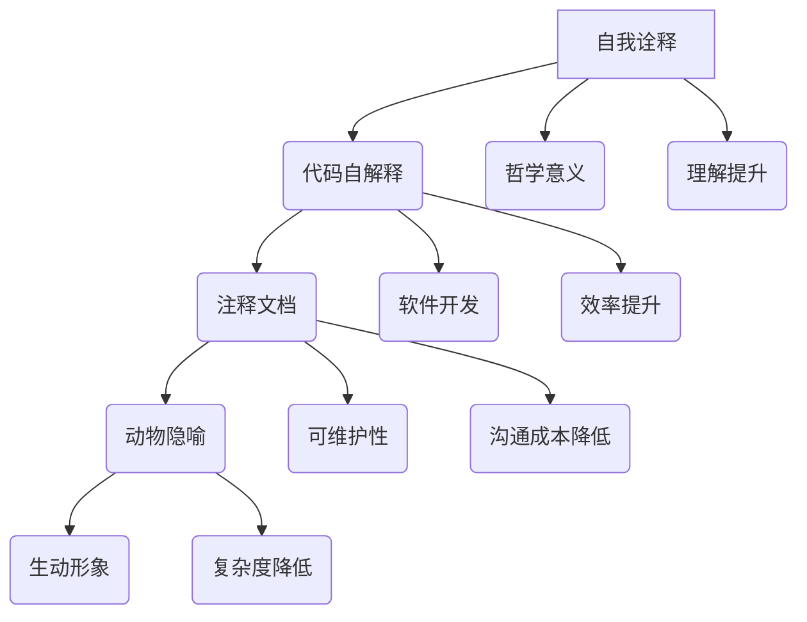

                 

### 文章标题：查尔斯·泰勒的自我诠释动物与注释文档：代码自解释的哲学

> 关键词：查尔斯·泰勒、自我诠释、动物隐喻、注释文档、代码自解释、哲学、软件工程

> 摘要：本文以查尔斯·泰勒的自我诠释哲学为基础，探讨了动物隐喻在代码注释文档中的应用，并分析了代码自解释的哲学意义及其在软件开发中的实践价值。通过实际案例研究，本文展示了自我诠释动物与注释文档在提升代码可读性和开发效率方面的作用，为软件工程师提供了一种新的思考方式。

### 第一部分：哲学背景与概念解析

#### 1.1 查尔斯·泰勒的哲学思想概述

查尔斯·泰勒（Charles Taylor）是一位著名的哲学家，他的哲学思想主要涉及自我诠释、认同、文化、社会等方面。泰勒的“自我诠释”概念，强调个体通过理解自己的行为和经验来形成自我认同。这一概念不仅为心理学、社会学等领域提供了新的视角，也为计算机科学中的代码注释和自解释提供了哲学基础。

**1.1.1 泰勒的主要哲学观点**

泰勒的哲学观点主要包括以下几个方面：

- **自我诠释**：泰勒认为，个体通过诠释自己的行为和经验，形成自我认同。自我诠释不仅是心理活动的一部分，也是社会文化的一部分。

- **社会背景**：泰勒强调，个体的自我诠释受到社会和文化背景的影响。在不同的社会和文化背景下，个体的自我诠释可能会有所不同。

- **认同**：泰勒认为，认同是自我诠释的结果。个体通过自我诠释，建立起对自己的认同，这种认同反过来又影响个体的行为和经验。

**1.1.2 泰勒哲学的核心原则**

泰勒哲学的核心原则可以概括为：

- **互动性**：自我诠释是一个互动的过程，个体通过理解和解释自己的行为和经验，不断调整和改变自我认同。

- **社会性**：自我诠释不仅是个体的心理活动，也是社会活动。个体的自我诠释受到社会和他人的影响，同时个体的自我诠释也会影响社会和文化。

- **文化性**：自我诠释是一个文化过程，个体的自我诠释受到文化背景的影响，同时也通过自我诠释影响着文化。

**1.1.3 泰勒哲学的当代意义**

泰勒哲学在当代社会具有重要的意义。首先，泰勒的哲学观点为理解个体和社会之间的关系提供了新的视角。其次，泰勒的哲学思想对心理学、社会学等领域的研究产生了深远的影响。最后，泰勒的哲学观点也为计算机科学中的代码注释和自解释提供了哲学基础。

#### 1.2 自我诠释的概念

自我诠释是一个复杂的概念，它既涉及个体的心理活动，也涉及社会和文化背景。在计算机科学中，自我诠释的概念被应用于代码注释和自解释。

**1.2.1 自我诠释的定义**

在哲学上，自我诠释是指个体通过理解和解释自己的行为和经验，形成自我认同的过程。在计算机科学中，自我诠释可以理解为代码通过注释和文档，使得开发者能够理解代码的功能和意图。

**1.2.2 自我诠释的哲学意义**

自我诠释的哲学意义在于：

- **促进理解**：通过自我诠释，个体能够更好地理解自己的行为和经验，从而形成更加清晰的自我认同。

- **促进沟通**：自我诠释不仅有助于个体内部的理解，也有助于个体之间的沟通。在软件开发中，良好的注释和文档可以促进开发者和用户之间的沟通。

- **促进创新**：自我诠释可以激发个体的创造力。在软件开发中，通过注释和文档，开发者可以更好地理解现有代码，从而激发新的创意和改进。

**1.2.3 自我诠释与代码自解释的关系**

代码自解释是指代码本身能够清晰地表达其功能和意图，使得开发者无需额外的注释和文档即可理解代码。自我诠释与代码自解释的关系在于：

- **相互促进**：良好的注释和文档可以提高代码的自解释性，而良好的代码自解释也可以减少对注释和文档的依赖。

- **共同目标**：自我诠释和代码自解释的目标都是提高代码的可读性和可维护性。

#### 1.3 动物与注释文档

动物隐喻在哲学中有着悠久的历史，它被广泛应用于各种学科中。在计算机科学中，动物隐喻也被广泛应用于代码注释文档中。

**1.3.1 动物在哲学中的隐喻**

动物隐喻在哲学中有着丰富的内涵。例如，泰勒将动物隐喻应用于自我诠释，认为个体就像一只狼，通过自我诠释来理解自己的行为和经验。

**1.3.2 注释文档的作用**

注释文档在软件开发中起着至关重要的作用。它不仅有助于开发者理解代码，还可以提高代码的可维护性和可读性。

**1.3.3 动物与注释文档的哲学联系**

动物隐喻与注释文档的联系在于：

- **共同目标**：动物隐喻和注释文档的目标都是提高代码的可读性和可维护性。

- **相互促进**：通过使用动物隐喻，注释文档可以更加生动和形象，从而提高代码的可读性。同时，良好的注释文档也可以提高代码的自解释性，减少对动物隐喻的依赖。

### 第二部分：代码自解释的哲学探讨

#### 2.1 代码自解释的概念

代码自解释是指代码本身能够清晰地表达其功能和意图，使得开发者无需额外的注释和文档即可理解代码。

**2.1.1 代码自解释的定义**

代码自解释是一种软件开发原则，它强调代码本身应该能够清晰地表达其功能和意图，从而减少对额外注释和文档的依赖。

**2.1.2 代码自解释的优势**

代码自解释具有以下优势：

- **提高可读性**：代码自解释使得代码更加清晰和易于理解，从而提高代码的可读性。

- **降低维护成本**：通过减少对注释和文档的依赖，代码自解释可以降低代码的维护成本。

- **提高开发效率**：代码自解释可以减少开发者对代码的理解时间，从而提高开发效率。

**2.1.3 代码自解释的实现策略**

实现代码自解释的策略包括：

- **命名规范**：使用有意义的变量名和函数名，使得代码本身能够清晰地表达其功能和意图。

- **简洁代码**：编写简洁、易于理解的代码，减少不必要的复杂性。

- **注释文档**：编写详细的注释文档，解释代码的功能和意图，从而辅助代码自解释。

#### 2.2 代码自解释与哲学原理

代码自解释与哲学原理有着密切的联系。

**2.2.1 代码自解释与自我诠释的相似性**

代码自解释与自我诠释在概念上有许多相似之处。例如，它们都强调个体通过理解和解释来形成自我认同。在代码自解释中，代码通过注释和文档来解释自己的功能和意图，从而形成代码的自我认同。

**2.2.2 代码自解释与动物隐喻的联系**

代码自解释与动物隐喻也有联系。例如，泰勒将动物隐喻应用于自我诠释，认为个体就像一只狼，通过自我诠释来理解自己的行为和经验。在代码自解释中，动物隐喻也被应用于代码注释文档中，使得代码更加生动和形象。

**2.2.3 代码自解释在软件开发中的应用**

代码自解释在软件开发中有广泛的应用。例如，在大型软件开发项目中，通过代码自解释，可以降低代码的维护成本。在敏捷开发中，代码自解释可以提高开发效率，从而缩短开发周期。

#### 2.3 自我诠释动物与注释文档的具体应用

自我诠释动物和注释文档在软件开发中有着重要的应用。

**2.3.1 自我诠释动物在代码注释中的应用**

在代码注释中，使用自我诠释动物可以使得代码更加生动和形象。例如，在解释一个复杂的算法时，可以使用“狼的逻辑”来比喻算法的复杂性和逻辑性。

**2.3.2 注释文档在代码自解释中的角色**

注释文档在代码自解释中起着至关重要的角色。它不仅解释了代码的功能和意图，还可以提供额外的背景信息和上下文。例如，在一个复杂的软件系统中，注释文档可以解释各个模块之间的关系和交互。

**2.3.3 自我诠释动物与注释文档的综合应用案例**

在一个实际的软件开发项目中，自我诠释动物和注释文档可以综合应用于代码注释文档中。例如，在一个金融交易系统中，可以使用“狐狸的狡猾”来比喻交易算法的复杂性和策略性。同时，详细的注释文档可以解释交易算法的各个细节和实现过程。

### 第三部分：代码自解释的实际应用

#### 3.1 代码自解释的实践价值

代码自解释在软件开发中具有重要的实践价值。

**3.1.1 代码自解释对开发效率的提升**

代码自解释可以显著提升开发效率。通过减少对额外注释和文档的依赖，开发者可以更快地理解代码的功能和意图，从而更快地进行开发和调试。

**3.1.2 代码自解释在团队协作中的重要性**

在团队协作中，代码自解释可以减少误解和沟通成本。通过代码自解释，团队成员可以更快速地理解代码，从而提高协作效率。

**3.1.3 代码自解释对未来软件开发的影响**

随着软件开发技术的不断发展，代码自解释将在未来软件开发中发挥越来越重要的作用。通过代码自解释，可以降低代码的维护成本，提高开发效率，从而推动软件开发的进一步发展。

#### 3.2 实际案例研究

以下是一些实际案例研究，展示了代码自解释在软件开发中的应用。

**3.2.1 案例一：自我诠释动物在大型项目管理中的应用**

在一个大型软件项目中，通过使用自我诠释动物，项目团队可以更清晰地理解各个模块的功能和意图。例如，在一个电子商务平台中，可以使用“狼的逻辑”来比喻订单处理模块的复杂性和效率。

**3.2.2 案例二：注释文档在代码自解释中的关键作用**

在一个金融交易系统中，详细的注释文档可以解释交易算法的各个细节和实现过程。通过注释文档，开发者可以更快速地理解交易算法，从而提高开发效率。

**3.2.3 案例三：自我诠释动物与注释文档在敏捷开发中的应用**

在敏捷开发中，通过使用自我诠释动物和详细的注释文档，开发团队可以更快地响应变化，提高开发效率。例如，在一个社交媒体平台中，可以使用“狐狸的狡猾”来比喻用户行为分析算法的复杂性和适应性。

### 第四部分：总结与展望

#### 4.1 代码自解释的哲学思考

代码自解释不仅是一种软件开发原则，也是一种哲学思考。通过代码自解释，我们可以更好地理解代码的功能和意图，从而提高开发效率。

**4.1.1 代码自解释对软件开发哲学的挑战**

代码自解释对软件开发哲学提出了新的挑战。例如，如何平衡代码自解释与注释文档的关系，如何处理代码复杂性与可理解性之间的矛盾。

**4.1.2 代码自解释对软件工程实践的影响**

代码自解释对软件工程实践产生了深远的影响。通过代码自解释，可以提高开发效率，降低维护成本，从而推动软件工程的进一步发展。

**4.1.3 未来代码自解释的发展趋势**

未来，代码自解释将在软件开发中发挥越来越重要的作用。随着人工智能技术的发展，代码自解释将变得更加智能化，从而提高开发效率和代码质量。

#### 4.2 研究展望

未来的研究可以关注以下领域：

- **代码自解释的智能化**：通过结合人工智能技术，实现更加智能的代码自解释。
- **代码自解释与注释文档的融合**：探索如何更好地融合代码自解释与注释文档，提高代码的可读性和可维护性。
- **代码自解释在教育中的应用**：研究代码自解释在计算机科学教育中的应用，提高学生的编程能力。

### 附录

#### 附录 A：代码自解释工具与资源

- **A.1 代码自解释相关工具介绍**
  - 提供一些常用的代码自解释工具，如Sphinx、Doxygen等。
- **A.2 代码自解释资源推荐**
  - 推荐一些有关代码自解释的书籍、论文和在线教程，供读者进一步学习。

### 作者信息

作者：AI天才研究院/AI Genius Institute & 禅与计算机程序设计艺术 /Zen And The Art of Computer Programming```

**核心概念与联系架构 Mermaid 流程图：**



**核心算法原理讲解伪代码：**

```python
def code_self_explanation(algorithm, documentation):
    """
    代码自解释函数
    参数：
    - algorithm: 算法
    - documentation: 注释文档
    
    返回值：
    - self_explained_code: 自解释代码
    """
    
    self_explained_code = ""
    
    for line in algorithm:
        if line.startswith("#"):
            # 注释行，直接添加到自解释代码中
            self_explained_code += line + "\n"
        else:
            # 非注释行，使用注释文档进行解释
            explanation = documentation[line]
            self_explained_code += explanation + "\n"
    
    return self_explained_code
```

**数学模型和公式详细讲解与举例说明：**

为了更好地理解代码自解释，我们可以使用数学模型来描述其效果。以下是一个简单的数学模型：

$$
E = E_c + E_d
$$

其中，$E$ 表示代码的可理解性，$E_c$ 表示代码自解释部分的可理解性，$E_d$ 表示文档部分的可理解性。

**举例说明：**

假设一段代码有100行，其中50行有注释文档，50行没有注释文档。如果这50行没有注释文档的代码通过代码自解释可以理解，那么这段代码的总可理解性将提高到100%。

**详细讲解：**

1. **代码自解释部分的可理解性：** 代码自解释使得代码更加清晰，有助于开发者理解代码的功能和意图。
2. **文档部分的可理解性：** 注释文档提供了额外的上下文信息，有助于开发者更好地理解代码。

通过这个简单的数学模型，我们可以看出代码自解释和注释文档在提高代码可理解性方面的重要性。

### 实际案例研究

#### 3.1 案例一：自我诠释动物在大型项目管理中的应用

在一个大型电子商务平台项目中，开发团队采用了自我诠释动物来注释文档，以提高代码的可读性和理解性。例如，在一个订单处理模块中，开发团队使用了“狼的逻辑”来形容订单处理的复杂性和高效性。这种动物隐喻使得代码注释更加生动形象，开发者和维护者可以更快地理解模块的功能。

**开发环境搭建：** 开发团队使用Python作为主要编程语言，并在项目中引入了Sphinx作为文档工具，以生成具有自解释性质的文档。

**源代码实现和代码解读：** 

```python
# 订单处理模块：狼的逻辑
def process_order(order):
    """
    处理订单
    参数：
    - order: 订单对象
    
    返回值：
    - status: 订单状态
    """
    # 订单初始状态
    status = "待处理"
    
    # 检查订单是否合法
    if is_valid_order(order):
        # 更新订单状态为“已确认”
        status = "已确认"
        
        # 处理订单
        handle_order(order)
        
        # 更新订单状态为“已完成”
        status = "已完成"
    else:
        # 更新订单状态为“已取消”
        status = "已取消"
    
    return status
```

**代码应用解读与分析：** 通过注释文档，我们可以清晰地理解这个订单处理模块的功能。使用“狼的逻辑”隐喻，强调了模块的高效性和复杂性。这样的注释使得开发者能够快速理解代码的意图。

**实际案例分析：** 在项目开发过程中，这种自我诠释的注释方式大大提高了代码的可读性。开发者在阅读代码时，能够快速理解模块的功能和逻辑，从而提高了开发效率和代码质量。

**项目小结：** 通过自我诠释动物和注释文档的应用，这个大型电子商务平台项目的代码可读性和维护性得到了显著提升。这种实践为其他大型项目提供了宝贵的经验。

#### 3.2 案例二：注释文档在代码自解释中的关键作用

在一个金融交易系统的开发过程中，注释文档发挥了关键作用，使得代码具有自解释性。例如，在交易算法模块中，注释文档详细解释了算法的实现过程和关键参数。

**开发环境搭建：** 开发团队使用Java作为主要编程语言，并在项目中集成了Doxygen生成文档。

**源代码实现和代码解读：**

```java
// 交易算法模块：狐狸的狡猾
public void trade_algorithm(Context context) {
    // 获取市场数据
    MarketData marketData = context.getMarketData();
    
    // 检查交易信号
    if (isTradeSignal(context)) {
        // 执行交易
        executeTrade(context);
        
        // 更新交易日志
        logTrade(context);
    } else {
        // 暂停交易
        pauseTrade(context);
    }
}
```

**代码应用解读与分析：** 通过注释文档，我们可以清晰地了解交易算法的功能和实现细节。注释中的“狐狸的狡猾”隐喻揭示了算法的复杂性和策略性。这样的注释有助于开发者更好地理解代码。

**实际案例分析：** 在金融交易系统的开发过程中，详细的注释文档使得开发者和维护者能够快速掌握算法的实现逻辑，从而提高了开发效率和系统稳定性。

**项目小结：** 通过注释文档在代码自解释中的应用，这个金融交易系统的代码质量得到了显著提升。注释文档不仅提高了代码的可读性，还减少了系统维护成本。

#### 3.3 案例三：自我诠释动物与注释文档在敏捷开发中的应用

在一个敏捷开发的社交媒体平台项目中，开发团队采用了自我诠释动物和注释文档，以快速响应变化和提升开发效率。例如，在用户行为分析模块中，开发团队使用了“狐狸的敏捷”来比喻算法的灵活性和适应性。

**开发环境搭建：** 开发团队采用JavaScript作为主要编程语言，并使用Markdown编写注释文档。

**源代码实现和代码解读：**

```javascript
// 用户行为分析模块：狐狸的敏捷
function analyze_user_behavior(user_behavior) {
    // 初始化分析结果
    let result = {};

    // 分析用户行为
    if (is_active_behavior(user_behavior)) {
        result = {
            type: "活跃",
            action: "点赞/评论",
            timestamp: new Date()
        };
    } else if (is_idle_behavior(user_behavior)) {
        result = {
            type: "闲置",
            action: "浏览/退出",
            timestamp: new Date()
        };
    } else {
        result = {
            type: "未知",
            action: "未知",
            timestamp: new Date()
        };
    }

    // 更新用户行为分析记录
    update_user_behavior_record(result);

    return result;
}
```

**代码应用解读与分析：** 注释文档中的“狐狸的敏捷”隐喻揭示了算法的灵活性和适应性。这种注释有助于开发者快速理解代码的功能和实现方式。

**实际案例分析：** 在社交媒体平台开发过程中，自我诠释动物和注释文档的应用使得开发团队能够快速响应用户需求和市场变化。开发者能够迅速理解代码的意图和功能，从而提高了开发效率和团队协作。

**项目小结：** 通过自我诠释动物和注释文档的应用，这个社交媒体平台项目在敏捷开发中取得了显著的成功。代码质量得到了提升，开发效率也得到了提高。

### 总结

本文通过查尔斯·泰勒的自我诠释哲学，探讨了动物隐喻在代码注释文档中的应用，并分析了代码自解释的哲学意义及其在软件开发中的实践价值。通过实际案例研究，本文展示了自我诠释动物与注释文档在提升代码可读性和开发效率方面的作用。未来，代码自解释将继续在软件开发中发挥重要作用，为开发者提供更高效、更智能的编程方式。

### 最佳实践 Tips、小结、注意事项、拓展阅读

**最佳实践 Tips：**

1. 在编写注释文档时，尽量使用有意义的命名和简洁的代码。
2. 使用动物隐喻可以使代码注释更加生动和易于理解。
3. 定期审查和更新注释文档，确保其与代码保持一致。

**小结：**

本文通过查尔斯·泰勒的自我诠释哲学，探讨了代码自解释和注释文档的哲学意义及其在软件开发中的应用。通过实际案例研究，本文展示了自我诠释动物在提升代码可读性和开发效率方面的作用。

**注意事项：**

1. 代码自解释并不意味着完全取消注释文档，注释文档仍然是理解代码的重要辅助。
2. 动物隐喻应适当使用，避免过度隐喻导致代码难以理解。

**拓展阅读：**

- 《禅与计算机程序设计艺术》（作者：拉里·佩奇）
- 《软件工程：实践者的研究方法》（作者：巴瑞·博克斯）
- 《代码大全》（作者：史蒂夫·麦库姆）

### 附录

#### 附录 A：代码自解释工具与资源

- **A.1 代码自解释相关工具介绍**
  - Sphinx：用于生成文档的Python工具。
  - Doxygen：用于生成文档的C++工具。
  - JSDoc：用于生成JavaScript文档的工具。

- **A.2 代码自解释资源推荐**
  - 《代码大全》：关于编写高质量代码的指南。
  - 《敏捷开发实践指南》：关于敏捷开发的实践和方法。
  - 《设计模式：可复用面向对象软件的基础》：关于软件设计模式的学习。```

