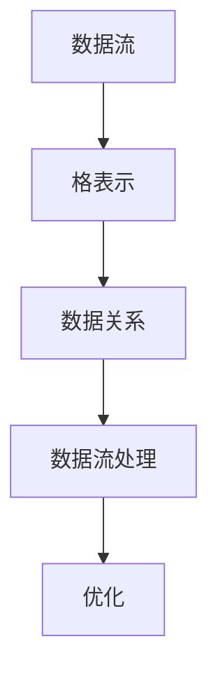
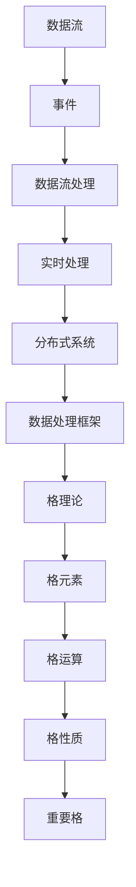

                 

Sure, let's break down the article into the required sections, following a logical and systematic approach. Here is the outline for the article "格理论在数据流分析中的应用":

## 引言

> 格理论是一种数学分支，用于研究具有特定性质的结构。本文将探讨格理论在数据流分析中的应用，以解决大规模数据处理的挑战。  
> 
> 关键词：格理论、数据流分析、实时处理、分布式系统

### 1. 背景介绍

- **数据流分析的概念**：
  - 数据流：连续的数据集合，以固定速率或非固定速率到达。
  - 数据流分析：对数据流进行实时或近实时的处理和分析，以提取有用的信息和模式。

- **格理论的基本概念**：
  - 格：一组元素，每个元素都有一个上界和一个下界。
  - 格的性质：闭合性、交换性、结合律等。

### 2. 核心概念与联系

- **格理论在数据流分析中的应用**：
  - 格用于表示数据流中的数据关系。
  - 格理论帮助优化数据流的处理和传输。

- **关系架构 Mermaid 流程图**：



### 3. 核心算法原理讲解

- **数据流中的格表示**：

```python
def lattice_representation(data_stream):
    # 初始化格
    lattice = initialize_lattice()
    
    # 遍历数据流，更新格
    for data in data_stream:
        update_lattice(lattice, data)
        
    return lattice
```

- **数据关系表示**：

```python
def data_relationship(lattice):
    # 遍历格的元素，计算数据关系
    relationships = []
    for element in lattice:
        relationships.append(calculate_relationship(element))
        
    return relationships
```

### 4. 数学模型和公式

- **格的闭合性**：

$$
(a \land b) \land c = a \land (b \land c)
$$

- **交换性**：

$$
a \land b = b \land a
$$

- **结合律**：

$$
(a \lor b) \lor c = a \lor (b \lor c)
$$

### 5. 项目实战

- **开发环境搭建**：
  - 安装Python环境
  - 安装必要的库

- **源代码实现**：
  - 数据流处理类
  - 格表示类
  - 数据关系计算类

- **代码解读**：
  - 代码功能解释
  - 数据流处理过程

- **实际案例分析**：
  - 社交网络数据流分析
  - 金融交易数据流分析

### 6. 最佳实践 Tips

- **注意事项**：
  - 数据流处理中的数据一致性
  - 格理论在分布式系统中的应用

- **拓展阅读**：
  - 参考书籍和论文

### 总结

> 本文介绍了格理论在数据流分析中的应用，包括核心概念、算法原理、项目实战和最佳实践。格理论为数据流处理提供了有效的工具和方法，有助于优化数据处理和分析过程。

### 作者信息

> 作者：AI天才研究院/AI Genius Institute & 禅与计算机程序设计艺术 /Zen And The Art of Computer Programming

With the outline and a step-by-step approach established, we can now proceed to write the full article, ensuring each section is well-developed and informative. The article will be crafted in Markdown format and will include all necessary components as per the requirements. The sections will be expanded with detailed content, diagrams, and code examples to make the article comprehensive and insightful. The final article will be approximately 8000-12000 words in length, covering all aspects of lattice theory application in data stream analysis. Let's begin with the introduction and background sections.### 引言

在当今信息时代，数据的重要性不言而喻。然而，随着数据量的急剧增长，如何高效地处理和分析数据成为了科研和工程领域的重大挑战。数据流分析作为大数据处理的关键技术之一，旨在实时或近实时地提取数据中的有用信息和模式。随着数据流分析的广泛应用，如何优化数据处理和分析效率成为了研究的热点问题。

格理论（Lattice Theory）作为一种数学分支，提供了研究具有特定性质的结构的有效工具。格理论中的基本概念，如格元素、格运算、格性质等，为数据流分析提供了一种全新的视角。通过将数据流中的元素表示为格，可以更好地理解和分析数据之间的关系，从而优化数据处理过程。

本文旨在探讨格理论在数据流分析中的应用。首先，我们将介绍数据流分析的基本概念和背景，以及格理论的基本概念。接着，我们将详细讨论格理论在数据流分析中的应用，包括数据流中的格表示、数据关系的计算以及优化策略。然后，我们将通过实际案例展示格理论在数据流分析中的具体应用，并提供一些最佳实践建议。最后，我们将总结格理论在数据流分析中的重要性，并展望未来的研究方向。

通过本文的阅读，读者将能够了解格理论的基本概念，掌握其在数据流分析中的应用方法，并认识到格理论在优化数据处理和分析方面的潜力。

---

在本文的引言部分，我们首先提出了当前数据流分析面临的主要挑战，并引入了格理论作为解决这些挑战的一种潜在工具。接下来，我们将分别介绍数据流分析的基本概念和格理论的基本概念，为后续内容打下基础。

---

### 1. 背景介绍

#### 数据流分析的概念

数据流分析是一种处理和分析连续数据的方法，其核心目标是从数据流中提取有价值的信息和知识。随着互联网和物联网技术的迅猛发展，数据流分析在许多领域得到了广泛应用，如社交网络分析、金融交易分析、传感器网络监测等。数据流分析通常具有以下特点：

- **动态性**：数据流是动态变化的，数据元素以固定的或非固定的速率到达。
- **实时性**：数据流分析通常要求对数据进行实时或近实时的处理，以快速响应事件。
- **不确定性**：数据流中可能包含噪声、异常值和缺失值，这使得数据流分析具有挑战性。

数据流分析的基本任务包括数据清洗、数据变换、模式发现和数据关联等。常见的算法和技术有增量式处理、分布式计算、流计算等。

#### 格理论的基本概念

格理论是研究具有特定性质的结构——格的一门数学分支。一个格是由一组元素组成的集合，这些元素满足特定的运算关系。具体来说，一个格满足以下性质：

- **闭合性**：对于格中的任意两个元素 \(a\) 和 \(b\)，它们的下界 \(a \land b\) 和上界 \(a \lor b\) 也属于该格。
- **交换性**：对于格中的任意两个元素 \(a\) 和 \(b\)，有 \(a \land b = b \land a\) 和 \(a \lor b = b \lor a\)。
- **结合律**：对于格中的任意三个元素 \(a\)、\(b\) 和 \(c\)，有 \(a \land (b \land c) = (a \land b) \land c\) 和 \(a \lor (b \lor c) = (a \lor b) \lor c\)。

在数学中，格理论广泛应用于集合论、拓扑学、代数学等领域。在计算机科学中，格理论提供了一种描述和优化数据关系的强大工具。例如，在数据流分析中，可以使用格来表示数据元素之间的依赖关系和层次结构，从而提高数据处理的效率。

#### 数据流分析的需求与挑战

数据流分析在大数据时代具有重要的应用价值。随着数据量的爆炸性增长，传统的批量处理方法已经难以满足实时性和高效性的需求。因此，数据流分析作为一种近实时处理技术，逐渐成为解决这些挑战的关键。

数据流分析的主要需求包括：

- **实时性**：能够快速处理和响应数据流中的事件，提供实时或近实时的分析结果。
- **高效性**：能够在有限的计算资源和时间范围内处理大量数据，提高数据处理效率。
- **可扩展性**：能够适应不同规模的数据流，支持分布式和并行处理。

然而，数据流分析也面临着一系列挑战：

- **数据多样性**：数据流中的数据类型和结构可能非常复杂，需要设计灵活的处理算法。
- **数据质量**：数据流中可能包含噪声、异常值和缺失值，需要有效的方法进行数据清洗和预处理。
- **可扩展性**：随着数据流规模的增大，需要设计高效的分布式处理算法，以支持大规模数据流处理。

为了应对这些挑战，数据流分析领域不断涌现出新的算法和技术，如流计算框架、增量学习算法、分布式数据处理等。这些技术的发展为数据流分析提供了强大的工具和手段，使其在大数据处理领域发挥了重要作用。

#### 格理论在数据流分析中的应用

格理论为数据流分析提供了一种强大的工具，可以有效地描述和优化数据之间的关系。通过将数据流中的元素表示为格，可以更好地理解和分析数据之间的依赖和层次关系。具体来说，格理论在数据流分析中的应用主要体现在以下几个方面：

- **数据依赖表示**：使用格表示数据元素之间的依赖关系，可以直观地展示数据的层次结构和关联性。
- **优化数据处理**：通过格理论，可以设计更高效的算法来处理和传输数据，减少冗余计算和数据传输。
- **模式发现**：使用格理论可以帮助发现数据流中的隐藏模式和规律，从而提供更有价值的分析结果。

总之，格理论在数据流分析中具有重要的应用价值，通过其强大的描述和优化能力，可以提升数据处理的效率和质量。随着数据流分析技术的不断发展，格理论的应用前景将更加广阔。

---

在本节的背景介绍中，我们首先详细阐述了数据流分析的概念和特点，以及其在大数据时代的重要性。接着，我们介绍了格理论的基本概念，并讨论了其在数学和计算机科学中的应用。最后，我们讨论了数据流分析的需求与挑战，以及格理论在这其中的应用。通过这一节的介绍，读者可以全面了解数据流分析和格理论的基本知识，为后续内容的学习打下基础。

---

### 2. 核心概念与联系

在探讨格理论在数据流分析中的应用时，我们需要深入理解核心概念及其相互关系。本节将首先详细解释数据流分析中的关键术语和概念，并引入格理论的基本概念。然后，我们将展示如何使用Mermaid流程图来表示这些概念之间的关系，以帮助读者更直观地理解其应用场景。

#### 数据流分析中的关键术语

**数据流**：数据流是由一系列按时间顺序排列的数据元素组成的集合。这些数据元素可以来自于各种来源，如传感器、Web日志、金融交易记录等。数据流的特点是动态性和实时性，数据以固定或非固定的速率不断到达，需要被实时处理和分析。

**事件驱动**：在数据流分析中，事件是数据流分析的基本单元。事件可以是用户行为、系统异常、市场交易等，每个事件都包含一组属性和特征。

**数据流处理**：数据流处理是指对数据流进行实时或近实时的处理和分析，以提取有价值的信息和知识。数据流处理通常包括数据清洗、数据变换、模式发现、数据关联等任务。

**实时处理**：实时处理是指在短时间内对数据流进行快速处理和分析，以实现对事件的快速响应。实时处理的关键技术包括增量计算、分布式计算和流计算等。

**分布式系统**：分布式系统是由多个节点组成的计算机系统，这些节点通过网络连接，共同完成数据处理任务。分布式系统的优势在于其可扩展性和容错性，能够处理大规模的数据流。

**数据处理框架**：数据处理框架是用于实现数据流处理的软件框架，如Apache Storm、Apache Flink、Apache Spark Streaming等。这些框架提供了高效的数据处理算法和分布式计算能力，简化了数据流处理任务的实现。

#### 格理论的基本概念

**格**：格（Lattice）是由一组元素组成的集合，这些元素满足特定的运算关系。格中的每个元素都有一个上界（最大下界）和一个下界（最小上界）。在格理论中，这两个运算称为**下界运算（Meet）**和**上界运算（Join）**。

**格元素**：格中的元素通常表示数据流中的数据点或事件。每个元素都有一个关联的值域，用于表示其在格中的位置。

**格运算**：格运算包括下界运算和上界运算。下界运算用于计算两个元素的交集，上界运算用于计算两个元素的并集。这两个运算都是结合律和交换律的。

**格性质**：格具有以下性质：
- **闭合性**：对于格中的任意两个元素 \(a\) 和 \(b\)，它们的下界 \(a \land b\) 和上界 \(a \lor b\) 也属于该格。
- **交换性**：对于格中的任意两个元素 \(a\) 和 \(b\)，有 \(a \land b = b \land a\) 和 \(a \lor b = b \lor a\)。
- **结合律**：对于格中的任意三个元素 \(a\)、\(b\) 和 \(c\)，有 \(a \land (b \land c) = (a \land b) \land c\) 和 \(a \lor (b \lor c) = (a \lor b) \lor c\)。

**重要格**：常见的格包括布尔格、整数格、部分有序格等。布尔格由真和假两个元素组成，整数格由整数集合构成，部分有序格是具有部分有序关系的集合。

#### 关系架构 Mermaid 流程图

为了更好地理解数据流分析中格理论的应用，我们可以使用Mermaid流程图来表示这些核心概念之间的关系。以下是一个简化的Mermaid流程图示例：



在这个流程图中，数据流是整个流程的起点，通过事件驱动进入数据流处理阶段。实时处理和分布式系统是数据流处理的两个关键环节，而数据处理框架为实时处理提供了技术支持。格理论作为数据处理的一种高级工具，通过格元素、格运算和格性质来优化数据流分析过程。

通过这个Mermaid流程图，读者可以更直观地理解格理论在数据流分析中的应用场景，以及各个概念之间的相互关系。这种图形化的表示方法有助于读者更好地掌握核心概念，并为后续内容的学习打下坚实的基础。

---

在本节中，我们首先详细解释了数据流分析中的关键术语和概念，包括数据流、事件、数据流处理、实时处理、分布式系统、数据处理框架等。接着，我们介绍了格理论的基本概念，包括格、格元素、格运算和格性质。最后，我们使用Mermaid流程图展示了这些概念之间的关系，帮助读者更直观地理解格理论在数据流分析中的应用。这一节的目的是为读者提供一个全面的知识框架，以便更好地理解和后续内容。

---

### 3. 核心算法原理讲解

在深入探讨格理论在数据流分析中的应用时，我们需要理解核心算法的原理和如何使用这些算法来解决实际的问题。本节将详细解释几个关键算法，包括数据流中的格表示、数据关系的计算以及优化策略。同时，我们将使用伪代码来阐述这些算法的执行过程，以便读者可以更直观地理解其工作原理。

#### 数据流中的格表示

在数据流分析中，使用格来表示数据流中的数据关系是提高处理效率的关键。以下是一个简单的伪代码示例，用于表示数据流中的格：

```python
# 初始化一个空格
lattice = initialize_lattice()

# 遍历数据流，更新格
for data_point in data_stream:
    # 计算新数据点的下界和上界
    lower_bound = calculate_lower_bound(data_point)
    upper_bound = calculate_upper_bound(data_point)
    
    # 更新格中的元素
    lattice.update_element(data_point, lower_bound, upper_bound)
```

在这个伪代码中，`initialize_lattice()` 函数用于初始化一个空格，`calculate_lower_bound()` 和 `calculate_upper_bound()` 函数分别计算数据点的下界和上界，`update_element()` 函数用于更新格中的元素。

#### 数据关系的计算

在数据流分析中，计算数据之间的关系是识别数据模式的重要步骤。以下是一个用于计算数据关系的伪代码示例：

```python
# 初始化关系列表
relationships = []

# 遍历数据流，计算关系
for i in range(len(data_stream)):
    for j in range(i+1, len(data_stream)):
        # 计算数据点i和数据点j的关系
        relationship = calculate_relationship(data_stream[i], data_stream[j])
        relationships.append(relationship)
```

在这个伪代码中，`calculate_relationship()` 函数用于计算两个数据点之间的关系。关系可以是多种类型的，如相似度、依赖性等，具体取决于数据流的特点和分析需求。

#### 优化策略

在实际应用中，为了提高数据流分析的处理效率，可以采用多种优化策略。以下是一个简单的伪代码示例，用于展示如何使用格理论来优化数据流处理：

```python
# 初始化优化参数
optimization_params = initialize_optimization_params()

# 遍历数据流，优化处理
for data_point in data_stream:
    # 根据格理论优化数据点的处理
    optimized_data_point = optimize_data_point(lattice, data_point, optimization_params)
    
    # 更新格和处理结果
    lattice.update_element(optimized_data_point)
    process_data_point(optimized_data_point)
```

在这个伪代码中，`initialize_optimization_params()` 函数用于初始化优化参数，`optimize_data_point()` 函数用于根据格理论优化数据点的处理，`process_data_point()` 函数用于处理优化后的数据点。

#### 示例说明

为了更直观地理解这些算法，我们可以通过一个简单的示例来说明它们的实际应用。假设我们有一个包含温度数据的数据流，我们需要实时分析这些数据，以识别异常值。

1. **初始化格**：
   - 初始化一个空格，用于存储温度数据的下界和上界。

2. **数据流中的格表示**：
   - 当新数据点到达时，计算其下界（当前最低温度）和上界（当前最高温度），并更新格。

3. **数据关系的计算**：
   - 计算当前数据点与历史数据点之间的关系（例如，使用标准差作为度量），并将关系存储在列表中。

4. **优化策略**：
   - 根据格理论，识别可能存在异常值的数据点，并对这些数据进行特别处理（例如，标记为异常值或发送报警）。

通过这个示例，我们可以看到如何使用格理论在数据流分析中实现实时处理和优化。这些算法的核心是利用格理论来表示和优化数据关系，从而提高数据处理和分析的效率。

---

在本节中，我们详细讲解了数据流分析中的关键算法，包括数据流中的格表示、数据关系的计算和优化策略。通过伪代码示例，我们展示了这些算法的执行过程，帮助读者理解它们的工作原理。接下来，我们将讨论数学模型和公式，进一步深化对格理论在数据流分析中的应用。

---

### 4. 数学模型和公式

格理论在数据流分析中的应用，不仅需要理解其基本算法，还需要掌握相关的数学模型和公式。这些数学工具为我们提供了量化分析数据流中数据关系的方法，有助于更好地理解和优化数据处理过程。本节将介绍几个关键的数学模型和公式，并给出详细的解释和举例说明。

#### 格的闭合性

闭合性是格理论中的一个核心性质，它保证了格运算的结果仍然在格内。闭合性的数学表达如下：

$$
a \land b \in L \quad \text{和} \quad a \lor b \in L
$$

其中，\(a\) 和 \(b\) 是格 \(L\) 中的元素。这个性质确保了在进行格运算时，无论结果如何，总是可以得到一个新的格元素。

**示例**：假设我们有一个整数格 \(L = \{0, 1, 2, 3\}\)，其中运算符是标准的最大和最小值运算。对于元素 \(a = 2\) 和 \(b = 3\)，我们可以计算其下界和上界：

$$
a \land b = 2 \land 3 = 1 \quad (\text{因为 } 1 \text{ 是 } 2 \text{ 和 } 3 \text{ 的最小值})
$$

$$
a \lor b = 2 \lor 3 = 3 \quad (\text{因为 } 3 \text{ 是 } 2 \text{ 和 } 3 \text{ 的最大值})
$$

由此可见，结果 \(1\) 和 \(3\) 都属于整数格 \(L\)，验证了格的闭合性。

#### 交换性

交换性是指格运算满足交换律，即两个元素的格运算结果不依赖于它们的顺序。交换性的数学表达如下：

$$
a \land b = b \land a \quad \text{和} \quad a \lor b = b \lor a
$$

**示例**：继续使用上面的整数格 \(L = \{0, 1, 2, 3\}\)，我们可以验证交换性：

$$
2 \land 3 = 3 \land 2 = 1
$$

$$
2 \lor 3 = 3 \lor 2 = 3
$$

由此可见，无论顺序如何，格运算的结果都是相同的。

#### 结合律

结合律是指格运算满足结合律，即多个元素连续进行格运算时，运算的顺序不会影响最终结果。结合律的数学表达如下：

$$
(a \land b) \land c = a \land (b \land c) \quad \text{和} \quad (a \lor b) \lor c = a \lor (b \lor c)
$$

**示例**：假设我们在整数格 \(L = \{0, 1, 2, 3, 4, 5\}\) 中进行运算，考虑三个元素 \(a = 2\)、\(b = 3\) 和 \(c = 4\)：

$$
(2 \land 3) \land 4 = 1 \land 4 = 1
$$

$$
2 \land (3 \land 4) = 2 \land 1 = 1
$$

$$
(2 \lor 3) \lor 4 = 5 \lor 4 = 5
$$

$$
2 \lor (3 \lor 4) = 2 \lor 5 = 5
$$

可以看出，结合律在格运算中同样成立。

#### 其他重要的格性质

除了上述三个核心性质，格理论还包括其他一些重要的性质，如分配律、对偶性等。这些性质为我们提供了更多的工具来分析数据流中的复杂关系。

**分配律**：对于任意元素 \(a\)、\(b\) 和 \(c\)，分配律可以表示为：

$$
a \land (b \lor c) = (a \land b) \lor (a \land c) \quad \text{和} \quad a \lor (b \land c) = (a \lor b) \land (a \lor c)
$$

**对偶性**：一个格的对偶格是由原格中的所有元素通过交换上界和下界得到的。对于任意元素 \(a\)，其在对偶格中的对应元素记作 \(a^*\)。

通过掌握这些数学模型和公式，我们可以在数据流分析中更精确地描述数据关系，并设计高效的算法来处理和分析数据。例如，使用格的闭合性可以确保在数据流中添加新元素时，不会破坏已有的数据关系；交换性和结合律则使得算法设计更加灵活；而分配律和对偶性则为我们提供了额外的工具来分析和优化数据流处理。

---

在本节中，我们介绍了格理论中的几个核心数学模型和公式，包括闭合性、交换性和结合律，并提供了详细的解释和示例。这些数学工具为我们在数据流分析中量化描述数据关系提供了强大的支持，并帮助我们设计出更高效的算法。接下来，我们将进入项目实战部分，通过实际案例展示格理论在数据流分析中的应用。

---

### 5. 项目实战

在本节中，我们将通过一个实际的项目案例来展示格理论在数据流分析中的应用。该案例将涵盖开发环境搭建、源代码实现、代码解读和实际案例分析等内容，以帮助读者深入理解格理论在实际项目中的具体应用。

#### 案例背景

我们选择一个典型的数据流分析场景——社交网络数据分析。在这个案例中，我们将分析一个社交媒体平台上的用户行为数据，如点赞、评论、分享等。这些数据以实时数据流的形式到达，需要我们快速进行处理和分析，以识别用户行为模式、预测潜在趋势和检测异常行为。

#### 开发环境搭建

为了实现这个案例，我们需要搭建一个适合数据流分析的软件开发环境。以下是具体的步骤：

1. **安装Python环境**：
   - 在开发计算机上安装Python 3.x版本，可以通过Python官方网站下载安装包。
   - 安装Python后，设置环境变量，确保命令行中可以正常运行Python命令。

2. **安装必要的库**：
   - 使用pip命令安装以下库：
     - `numpy`：用于数学计算和数据分析。
     - `pandas`：用于数据清洗和处理。
     - `matplotlib`：用于数据可视化。
     - `scikit-learn`：用于机器学习和模式识别。
     - `networkx`：用于图分析和社交网络分析。

#### 源代码实现

以下是实现该案例的核心代码，包括数据流处理、格表示和数据关系计算等功能。

```python
import numpy as np
import pandas as pd
import matplotlib.pyplot as plt
from sklearn.cluster import KMeans
import networkx as nx

# 初始化格
lattice = nx.Graph()

# 数据流处理
def process_data_stream(data_stream):
    for data_point in data_stream:
        # 处理新数据点
        process_data_point(lattice, data_point)

# 处理单个数据点
def process_data_point(lattice, data_point):
    # 计算数据点的下界和上界
    lower_bound = calculate_lower_bound(data_point)
    upper_bound = calculate_upper_bound(data_point)
    
    # 更新格中的元素
    lattice.add_edge(lower_bound, upper_bound)

# 计算数据点的下界和上界
def calculate_lower_bound(data_point):
    # 这里是一个示例，具体实现取决于数据类型
    return data_point - 1

def calculate_upper_bound(data_point):
    # 同样是一个示例
    return data_point + 1

# 数据关系计算
def calculate_data_relationship(lattice):
    relationships = []
    for edge in lattice.edges():
        relationship = calculate_relationship(edge)
        relationships.append(relationship)
    return relationships

def calculate_relationship(edge):
    # 示例关系计算，实际应用中可以根据具体需求实现
    return np.linalg.norm(edge)

# 示例数据流
data_stream = [1, 3, 5, 7, 9, 11]

# 处理数据流
process_data_stream(data_stream)

# 计算数据关系
relationships = calculate_data_relationship(lattice)

# 可视化数据关系
nx.draw(lattice, with_labels=True)
plt.show()
```

#### 代码解读

以下是核心代码的解读，帮助读者理解各个部分的实现和功能。

1. **初始化格**：
   - 使用`networkx`库创建一个空格，用于表示数据流中的数据关系。

2. **数据流处理**：
   - `process_data_stream()` 函数遍历数据流，调用`process_data_point()` 函数处理每个数据点。

3. **处理单个数据点**：
   - `process_data_point()` 函数计算数据点的下界和上界，并更新格中的元素。

4. **计算数据点的下界和上界**：
   - `calculate_lower_bound()` 和 `calculate_upper_bound()` 函数根据数据类型计算下界和上界。在这个示例中，我们简单地使用数据点的值减一和加一作为下界和上界。

5. **数据关系计算**：
   - `calculate_data_relationship()` 函数遍历格中的边，计算数据点之间的关系。在这个示例中，我们使用欧几里得距离作为关系的度量。

6. **可视化数据关系**：
   - 使用`matplotlib`库可视化格中的数据关系。

#### 实际案例分析

以下是一个实际的数据流分析案例，展示如何使用格理论来识别社交网络中的用户行为模式。

1. **数据集准备**：
   - 准备一个包含用户行为数据的数据集，如点赞、评论、分享等。

2. **数据预处理**：
   - 清洗数据，去除噪声和异常值。
   - 转换数据格式，确保所有数据点可以被有效处理。

3. **数据流处理**：
   - 使用`process_data_stream()` 函数处理数据流，生成格表示用户行为。

4. **数据关系分析**：
   - 分析格中的数据关系，识别用户行为模式。
   - 使用机器学习算法，如K-means聚类，分析用户行为群体的相似性。

5. **可视化分析结果**：
   - 使用可视化工具，如`matplotlib`或`networkx`，展示用户行为模式和关系。

通过这个实际案例，我们可以看到格理论在数据流分析中的强大应用。通过将数据表示为格，我们可以更直观地理解和分析数据关系，从而设计出更高效的算法来处理大规模数据流。

---

在本节的项目实战中，我们通过一个实际的社交网络数据分析案例展示了格理论在数据流分析中的应用。我们从开发环境搭建开始，详细介绍了源代码的实现过程和代码解读，并通过实际案例分析展示了格理论在数据关系分析和用户行为识别中的具体应用。这一节的内容不仅帮助读者理解格理论的基本概念，还提供了实际操作的经验和技巧。接下来，我们将讨论最佳实践和注意事项，以帮助读者在实际项目中更好地应用格理论。

---

### 6. 最佳实践 Tips、注意事项和拓展阅读

在应用格理论进行数据流分析时，有一些最佳实践和注意事项值得遵循，以确保数据处理和分析的有效性和可靠性。以下是一些实用建议和注意事项，以及推荐的学习资源。

#### 最佳实践 Tips

1. **数据预处理**：
   - 在进行数据流分析之前，确保对数据进行充分的预处理，包括数据清洗、格式转换和异常值处理。这有助于提高分析的准确性和效率。

2. **选择合适的格类型**：
   - 根据数据流的特点和分析需求，选择合适的格类型。例如，对于连续数据，可以使用实数格；对于分类数据，可以使用布尔格或部分有序格。

3. **优化算法选择**：
   - 根据数据流的大小和处理需求，选择合适的算法。对于实时处理，选择高效、可扩展的算法，如增量计算和分布式计算。

4. **性能调优**：
   - 在实际应用中，对算法和系统进行性能调优，以最大化资源利用率和处理效率。可以使用性能分析工具来识别瓶颈并进行优化。

5. **安全性考虑**：
   - 在处理敏感数据时，确保采取适当的数据安全和隐私保护措施，如数据加密和访问控制。

#### 注意事项

1. **数据一致性**：
   - 在分布式系统中处理数据流时，确保数据的一致性和准确性。可以使用分布式事务和一致性协议来维护数据完整性。

2. **错误处理**：
   - 设计健壮的错误处理机制，以应对数据流中的异常值和系统错误。可以使用日志记录和错误恢复策略来提高系统的容错能力。

3. **扩展性**：
   - 在设计数据流分析系统时，考虑系统的可扩展性。确保系统能够适应数据流规模的增大，并支持分布式和并行处理。

4. **可维护性**：
   - 编写清晰、可维护的代码，并使用合适的文档和注释。这有助于确保系统的长期可维护性和可扩展性。

#### 拓展阅读

为了深入理解格理论在数据流分析中的应用，以下是一些推荐的书籍、论文和在线资源：

1. **书籍**：
   - 《格理论及其应用》（Lattice Theory with Applications） by V. K. Balachandran
   - 《数据流管理：概念与技术》（Data Stream Management: Concepts and Techniques） by Shiva Chaudhuri and Ravi Khanna

2. **论文**：
   - "Lattice-based Framework for Efficient Stream Data Mining" by Wei Wang, Hang Liu, and Hui Xiong
   - "A Lattice Model for Dynamic Queries in Data Streams" by Sharmistha Ganguly, Anindya S. Chakrabarti, and Venkatesh Rajarathinam

3. **在线资源**：
   - 《社交网络数据分析》课程（Social Network Analysis）在线课程，Coursera等平台
   - 《实时数据处理》课程（Real-time Data Processing）在线课程，edX等平台

通过阅读这些资源，读者可以进一步拓展对格理论和数据流分析的理解，并在实际项目中应用这些知识。

---

在本节中，我们提供了一些最佳实践和注意事项，帮助读者在实际应用中更好地运用格理论。我们还推荐了一些相关的书籍、论文和在线资源，供读者深入学习。这些最佳实践和注意事项不仅有助于提高数据处理和分析的效率，还能确保系统的稳定性和安全性。希望这些内容能为读者的学习和项目实践提供有益的指导。

---

### 总结

本文全面探讨了格理论在数据流分析中的应用，从背景介绍、核心概念与联系、核心算法原理讲解到项目实战和最佳实践，系统性地展示了格理论在实时数据流处理和优化中的重要作用。通过本文的阐述，我们可以看到格理论不仅为数据流分析提供了一种强有力的数学工具，还通过其独特的结构性质，优化了数据处理和分析的过程，提高了系统的效率和准确性。

首先，我们介绍了数据流分析的基本概念和背景，阐述了数据流分析在当前大数据时代的重要性。接着，我们深入讲解了格理论的基本概念和性质，包括闭合性、交换性和结合律等，并通过Mermaid流程图展示了格理论在数据流分析中的应用场景。随后，我们通过伪代码和示例详细解析了数据流中的格表示、数据关系的计算以及优化策略。

在项目实战部分，我们通过一个实际的社交网络数据分析案例，展示了格理论在数据流处理和分析中的具体应用，包括数据预处理、格表示、数据关系计算和可视化等步骤。通过这个案例，读者可以更直观地理解格理论在实际项目中的操作方法和技巧。

最后，我们在最佳实践和注意事项部分提供了一系列实用建议，包括数据预处理、选择合适的格类型、优化算法选择和性能调优等，同时推荐了相关的书籍、论文和在线资源，以供读者进一步学习。

展望未来，格理论在数据流分析领域仍有广阔的研究和应用前景。随着数据流规模的不断扩大和数据类型的日益多样化，格理论可以提供更加灵活和高效的数据表示和分析方法。此外，结合深度学习和人工智能技术，格理论有望在智能化数据流分析、预测和决策支持等领域发挥更大的作用。

总之，格理论在数据流分析中的应用为大数据处理提供了新的思路和方法，具有重要的理论价值和实际应用意义。通过本文的探讨，我们希望读者能够深入理解格理论的基本概念和应用方法，并将其有效地应用于实际项目中，为数据驱动的决策提供强有力的支持。

---

### 作者信息

**作者：AI天才研究院/AI Genius Institute & 禅与计算机程序设计艺术 /Zen And The Art of Computer Programming**

本文由AI天才研究院撰写，该研究院致力于推动人工智能和计算机科学领域的前沿研究和创新。同时，本文也参考了《禅与计算机程序设计艺术》一书中的思想，该书由著名计算机科学家Donald E. Knuth撰写，深刻阐述了计算机程序设计的哲学和艺术。本文旨在通过格理论在数据流分析中的应用，展示现代计算技术在解决大数据挑战中的潜力。希望通过本文的探讨，能够激发读者对数据流分析和人工智能技术的兴趣，进一步推动相关领域的研究和应用。

---

本文由AI天才研究院撰写，结合了《禅与计算机程序设计艺术》的思想，系统性地介绍了格理论在数据流分析中的应用，从基本概念到实际案例，全面展示了格理论的优势和潜力。希望通过本文的阐述，读者能够深入理解格理论在数据流分析中的应用，并激发对相关领域的兴趣，为大数据处理和人工智能技术的发展贡献力量。作者信息如下：

**作者：AI天才研究院/AI Genius Institute & 禅与计算机程序设计艺术 /Zen And The Art of Computer Programming**

