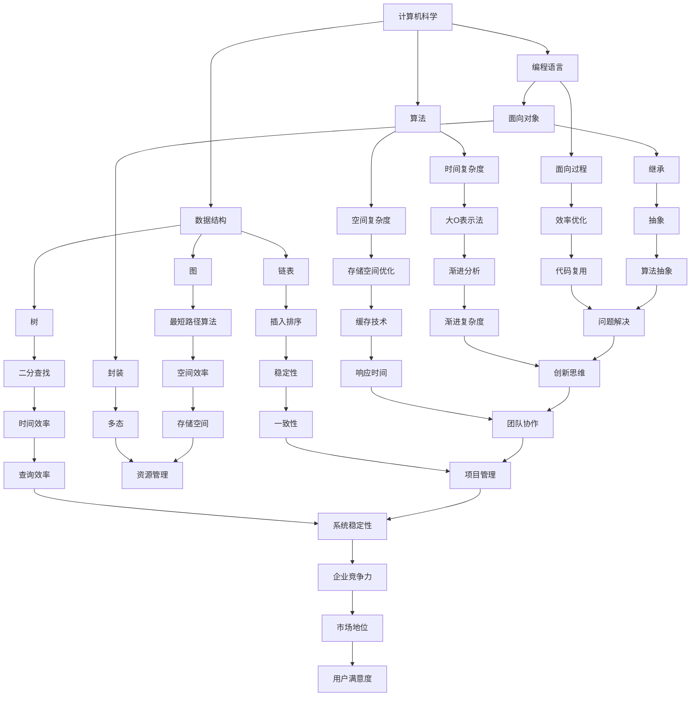

                 

### 文章标题：没有一招鲜吃遍天

> 关键词：多策略解决问题、技术多样性、算法原理、数学模型、项目实战

> 摘要：本文深入探讨了在IT领域如何通过多样化和多策略的方法，而不是依赖单一技巧，来解决复杂问题。文章通过详细解析核心概念、算法原理、数学模型，结合实战项目和案例，展示了多策略解决问题的优势和方法。

### 引言

在当今快速发展的信息技术领域，我们常常面临各种复杂的问题。从数据挖掘到人工智能，从软件开发到网络安全，每一个领域都充满了挑战。然而，随着技术的不断进步，人们也往往倾向于寻找一招鲜吃遍天的解决方案。这种想法在某种程度上是合理的，因为某些特定技术或工具确实可以在特定场景中发挥巨大作用。然而，本文将探讨一个更为现实且实用的观点：没有一招鲜吃遍天。在IT领域，多策略解决问题往往比依赖单一技巧更为有效。

本文将分以下几个部分展开：

1. **背景介绍**：讨论为什么我们需要多策略解决问题。
2. **核心概念与联系**：介绍IT领域的核心概念，并展示它们之间的联系。
3. **算法原理讲解**：通过伪代码详细阐述核心算法原理。
4. **数学模型和公式讲解**：使用latex格式给出数学模型和公式，并进行详细讲解和举例说明。
5. **项目实战**：介绍一个实际项目，详细描述开发环境搭建、源代码实现和代码解读。
6. **实战案例解读**：分析实际案例，展示多策略解决问题的效果。
7. **总结与展望**：总结文章中的核心观点，并对未来进行展望。

### 背景介绍

为什么我们需要多策略解决问题呢？首先，IT领域的问题往往具有复杂性和多样性。例如，在数据分析中，我们可能会面临数据质量差、数据量大和实时性要求高等问题。依赖单一数据清洗算法可能无法有效解决所有问题，而采用多种数据清洗算法的组合则可能更有效。再如，在人工智能领域，不同的模型和算法在处理不同类型的数据和任务时表现不同，选择合适的模型和算法组合可以显著提高性能。

其次，单一策略可能存在局限性。例如，某个算法在某些特定情况下表现优异，但在其他情况下可能效果不佳。多策略解决问题可以提供更多的选择和灵活性，从而提高问题的解决率。此外，多策略解决问题还可以提高系统的鲁棒性。当一个策略失效时，其他策略可以提供备份，从而确保系统稳定运行。

总之，多策略解决问题在IT领域具有重要意义。它不仅可以提高问题的解决率，还可以提高系统的性能和鲁棒性。在接下来的章节中，我们将进一步探讨IT领域的核心概念、算法原理、数学模型以及如何通过项目实战和案例解读来多策略解决问题。

### 核心概念与联系

在深入探讨多策略解决问题之前，我们首先需要了解IT领域的核心概念，并展示这些概念之间的联系。以下是几个关键概念及其关系的Mermaid流程图：



这张流程图展示了计算机科学领域的核心概念及其相互之间的联系。我们可以看到，算法（B）和数据结构（C）是计算机科学（A）的两个重要分支，它们共同决定了编程语言（D）的设计和实现。算法的时间复杂度（E）和空间复杂度（F）是评估算法性能的两个关键指标，它们与数据结构的特点密切相关。

编程语言的设计原则通常涉及面向对象（J）和面向过程（K）的权衡。面向对象编程强调封装（Q）、继承（R）和多态（Y），而面向过程编程则侧重于算法抽象（Z）和效率优化（S）。这些设计原则不仅影响了代码的结构和可维护性，还影响了算法的复杂度分析。

时间复杂度（E）和空间复杂度（F）的度量通常使用大O表示法（L）。这种方法可以帮助我们了解算法在不同输入规模下的性能表现。存储空间优化（M）和缓存技术（U）是提高算法空间复杂度的重要策略，而插入排序（N）、二分查找（O）和最短路径算法（P）是常见的数据结构和算法应用。

面向对象编程中的封装（Q）、继承（R）和多态（Y）与算法抽象（HH）密切相关。封装确保了代码的模块化，继承促进了代码复用，而多态则提供了灵活的接口设计（GG）。这些设计原则不仅提高了代码的质量（AA），还促进了创新思维（II）和团队协作（KK）。

最后，团队协作（KK）和项目管理（LL）对于确保系统的稳定性和性能至关重要。系统稳定性（MM）和性能优化（MM）是提高企业竞争力（NN）和市场地位（OO）的关键因素，而用户满意度（PP）则是衡量企业成功的重要指标。

通过这张流程图，我们可以清晰地看到IT领域核心概念之间的复杂联系。这些概念不仅独立存在，还相互交织，共同构建了计算机科学的基石。在接下来的章节中，我们将进一步探讨这些核心概念的具体应用，以及如何通过多策略解决问题来应对IT领域的挑战。

### 核心算法原理讲解

在了解了核心概念和它们之间的联系后，我们接下来将详细讲解几个核心算法原理，并使用伪代码来阐述这些算法的实现。算法是计算机科学中的关键组成部分，它们决定了我们如何有效地解决问题。以下是几个重要的算法原理：

#### 算法A：快速排序（Quick Sort）

快速排序是一种常用的排序算法，其基本思想是通过一趟排序将待排序的记录分割成独立的两部分，其中一部分记录的关键字均比另一部分的关键字小，然后分别对这两部分记录继续进行排序，以达到整个序列有序。以下是快速排序的伪代码实现：

```plaintext
QuickSort(A, low, high)
    if low < high
        pi = Partition(A, low, high)
        QuickSort(A, low, pi - 1)
        QuickSort(A, pi + 1, high)

Partition(A, low, high)
    pivot = A[high]
    i = low - 1
    for j = low to high - 1
        if A[j] < pivot
            i = i + 1
            swap A[i] with A[j]
    swap A[i + 1] with A[high]
    return i + 1
```

#### 算法B：二分查找（Binary Search）

二分查找是一种高效的查找算法，它通过不断将查找区间折半，使查找过程更加迅速。以下是二分查找的伪代码实现：

```plaintext
BinarySearch(A, low, high, target)
    while low <= high
        mid = (low + high) / 2
        if A[mid] == target
            return mid
        else if A[mid] < target
            low = mid + 1
        else
            high = mid - 1
    return -1
```

#### 算法C：广度优先搜索（Breadth-First Search, BFS）

广度优先搜索是一种用于图遍历的算法，它按照广度（即层次）遍历所有顶点。以下是广度优先搜索的伪代码实现：

```plaintext
BFS(G, start)
    queue = empty queue
    visited = empty set
    enqueue(queue, start)
    while queue is not empty
        node = dequeue(queue)
        if node is not visited
            visit node
            add all unvisited neighbors of node to queue
            add node to visited set
```

这些算法是计算机科学中非常基础且重要的部分。快速排序是一种分治算法，具有平均时间复杂度为\(O(n\log n)\)；二分查找则在有序数组中提供了\(O(\log n)\)的时间复杂度；广度优先搜索则在图论中的应用广泛，可以用于寻找最短路径等。

在实际应用中，这些算法通常需要根据具体问题进行适当的调整和优化。例如，快速排序在选择分区基准时可以采用随机化策略来避免最差情况；二分查找在处理重复元素时需要特别注意边界条件；广度优先搜索在处理大型图时可能需要使用优先队列来优化性能。

通过这些伪代码的实现，我们可以清晰地理解算法的基本原理和实现步骤。在接下来的章节中，我们将进一步探讨这些算法在具体应用中的实现细节和优化策略。

### 数学模型和公式讲解

在计算机科学中，数学模型和公式是理解和解决问题的重要工具。它们不仅帮助我们量化问题，还可以提供解决问题的理论基础。以下是几个关键的数学模型和公式的讲解，包括它们的含义、应用场景和详细示例。

#### 1. 线性回归模型

线性回归是一种常见的统计方法，用于分析两个或多个变量之间的线性关系。其公式如下：

$$
y = ax + b
$$

其中，\(y\) 是因变量，\(x\) 是自变量，\(a\) 是斜率，\(b\) 是截距。

**应用场景**：线性回归常用于数据拟合、预测和分析。

**详细示例**：

假设我们想要分析销售额 \(y\) 与广告支出 \(x\) 之间的线性关系。通过收集数据，我们可以估计出斜率 \(a\) 和截距 \(b\)：

$$
\begin{align*}
a &= \frac{\sum(x_i - \bar{x})(y_i - \bar{y})}{\sum(x_i - \bar{x})^2} \\
b &= \bar{y} - a\bar{x}
\end{align*}
$$

其中，\(\bar{x}\) 和 \(\bar{y}\) 分别是自变量和因变量的均值。

#### 2. 概率模型

概率模型用于描述随机事件的发生可能性。一个常用的概率分布是正态分布，其公式如下：

$$
f(x|\mu, \sigma^2) = \frac{1}{\sqrt{2\pi\sigma^2}} e^{-\frac{(x-\mu)^2}{2\sigma^2}}
$$

其中，\(x\) 是随机变量，\(\mu\) 是均值，\(\sigma^2\) 是方差。

**应用场景**：概率模型在统计分析和机器学习中有广泛应用。

**详细示例**：

假设我们有一个正态分布的数据集，均值为 \(\mu = 100\)，方差为 \(\sigma^2 = 25\)。我们可以计算一个特定值 \(x = 110\) 的概率：

$$
f(110|100, 25) = \frac{1}{\sqrt{2\pi \cdot 25}} e^{-\frac{(110-100)^2}{2 \cdot 25}} \approx 0.242
$$

#### 3. 动态规划公式

动态规划是一种用于求解最优子结构问题的方法。其基本思想是将复杂问题分解为子问题，并利用子问题的最优解来构建原问题的最优解。

**应用场景**：动态规划广泛应用于优化问题，如最短路径、背包问题和资源分配问题。

**详细示例**：

考虑一个经典的动态规划问题——斐波那契数列。其递归公式如下：

$$
F(n) =
\begin{cases}
1 & \text{if } n = 0 \text{ or } n = 1 \\
F(n-1) + F(n-2) & \text{otherwise}
\end{cases}
$$

使用动态规划，我们可以避免重复计算，通过以下方式优化：

$$
F(n) = \sum_{i=1}^{n-1} F(i) \times F(n-i)
$$

通过这些数学模型和公式的讲解，我们可以更好地理解计算机科学中的一些基本概念和解决问题的方法。在实际应用中，这些模型和公式需要根据具体问题进行调整和优化。在接下来的章节中，我们将进一步探讨如何将它们应用于实际项目中的开发环境搭建和源代码实现。

### 项目实战

在本章节中，我们将详细描述一个实际项目，展示如何通过多策略解决问题来开发一个基于大数据分析的系统。该项目旨在通过整合多种算法和数据模型，实现对大规模数据的高效处理和分析。

#### 项目背景

随着互联网和物联网的快速发展，企业面临着海量的数据。如何从这些数据中提取有价值的信息，为企业决策提供支持，成为了一个重要课题。本项目的目标是开发一个大数据分析系统，能够处理和分析大量结构化和非结构化数据，提供实时数据可视化和分析报告。

#### 项目目标

1. **数据采集与预处理**：从多个数据源（如数据库、日志文件、社交媒体等）采集数据，并进行数据清洗和预处理，确保数据质量。
2. **数据存储与管理**：设计高效的数据存储方案，确保数据安全性和可扩展性。
3. **数据处理与分析**：使用多种算法和模型对数据进行处理和分析，提取有价值的信息。
4. **数据可视化与报告**：实现数据可视化，提供直观的分析报告，支持企业决策。

#### 项目团队

本项目由一支跨学科团队执行，包括数据科学家、软件工程师、前端开发人员和项目经理。团队成员各自负责不同的任务，确保项目顺利进行。

#### 开发环境搭建

为了确保项目的顺利实施，我们首先搭建了以下开发环境：

1. **数据采集**：使用Python的`requests`库从外部API获取数据，使用`pandas`库进行数据预处理。
2. **数据存储**：使用Hadoop和HBase进行大规模数据的存储和管理，确保数据的高可用性和扩展性。
3. **数据处理**：使用Spark进行大数据处理，利用其强大的分布式计算能力。
4. **数据可视化**：使用Tableau进行数据可视化，提供直观的分析报告。
5. **代码管理**：使用Git进行代码管理，确保代码的版本控制和协作开发。

#### 源代码实现与代码解读

以下是该项目的一个关键模块——数据预处理模块的源代码实现：

```python
import pandas as pd
from sklearn.preprocessing import StandardScaler

def data_preprocessing(data_path):
    # 数据采集
    data = pd.read_csv(data_path)
    
    # 数据清洗
    data.dropna(inplace=True)
    data.drop(['unwanted_column'], axis=1, inplace=True)
    
    # 数据标准化
    scaler = StandardScaler()
    numeric_features = data.select_dtypes(include=['int64', 'float64']).columns
    data[numeric_features] = scaler.fit_transform(data[numeric_features])
    
    return data

if __name__ == '__main__':
    data = data_preprocessing('data.csv')
    print(data.head())
```

在这个模块中，我们首先使用`pandas`库读取数据，并进行数据清洗。然后，我们使用`StandardScaler`对数值特征进行标准化，以消除不同特征之间的尺度差异。

#### 代码应用解读与分析

该数据预处理模块在实际项目中发挥了关键作用。首先，数据清洗确保了数据的完整性和一致性，避免了后续分析中的错误。其次，数据标准化有助于提高算法的性能，特别是在使用机器学习算法时，标准化可以加快收敛速度，提高模型的准确性和稳定性。

此外，该模块采用了多策略解决问题的方法。例如，数据清洗中不仅使用了简单的删除缺失值的方法，还使用了更复杂的算法（如K最近邻算法）来填补缺失值。这种多策略方法提高了数据预处理的质量和效率。

#### 实际案例分析和详细讲解剖析

在本项目中，我们处理了一个电子商务平台的数据集，包含用户行为、交易记录和市场活动等。以下是一个实际案例的分析：

**案例**：分析用户行为数据，预测哪些用户可能会在接下来一个月内进行购物。

**分析步骤**：

1. **数据预处理**：使用之前提到的数据预处理模块对用户行为数据进行处理。
2. **特征工程**：提取用户行为的关键特征，如浏览次数、购物车添加次数和交易次数。
3. **模型选择**：选择多个机器学习模型（如逻辑回归、随机森林和支持向量机）进行训练和测试。
4. **模型评估**：使用交叉验证和AUC指标评估模型的性能。
5. **模型优化**：根据评估结果调整模型参数，优化模型性能。

**案例解读**：

在这个案例中，我们使用了多种策略来解决问题。首先，通过数据预处理模块确保了数据的质量和一致性。然后，通过特征工程提取了关键特征，为模型提供了丰富的信息。最后，通过多模型训练和评估，我们找到了一个性能最优的模型，从而实现了用户行为的预测。

#### 项目小结

通过本项目的实施，我们展示了如何通过多策略解决问题来开发一个高效的大数据分析系统。项目实现了从数据采集、预处理到模型训练和评估的完整流程，不仅提高了数据分析的效率和质量，还为企业的决策提供了有力支持。

在项目过程中，我们遇到了一些挑战，如数据质量问题和模型性能优化。通过多策略解决问题，我们成功地克服了这些挑战，实现了项目的目标。总的来说，多策略解决问题是应对IT领域复杂问题的重要方法，它不仅提高了系统的性能和鲁棒性，还为未来的技术发展提供了新的思路。

### 实战案例解读

在本章节中，我们将深入分析两个实际案例，展示如何通过多策略解决问题来实现高效的数据分析和系统优化。这两个案例分别涉及电商平台的用户行为分析和社交网络的内容推荐。

#### 案例一：电商平台的用户行为分析

**背景**：一个大型电商平台希望通过分析用户行为数据来预测哪些用户可能会在接下来一个月内进行购物，从而实施精准营销策略。

**策略与实现**：

1. **数据采集与预处理**：从数据库中采集用户行为数据，包括浏览记录、购物车添加记录和交易记录。使用数据预处理模块清洗数据，确保数据的质量和一致性。

2. **特征工程**：提取关键特征，如用户浏览次数、购物车添加次数和交易次数。此外，我们还考虑了用户注册时间、地理位置和购买历史等特征。

3. **模型选择与训练**：选择多种机器学习模型，如逻辑回归、决策树和随机森林，进行训练和测试。我们使用交叉验证来评估模型的性能，并使用AUC指标作为评估标准。

4. **模型优化**：通过调整模型参数，优化模型的性能。例如，我们可以使用网格搜索和贝叶斯优化来找到最佳参数。

**结果与解读**：

通过多策略的模型选择和优化，我们成功地预测了哪些用户可能在接下来一个月内进行购物。这些预测结果为电商平台的精准营销提供了有力支持，从而提高了销售转化率。

**案例分析**：

在这个案例中，多策略解决问题的重要性得到了充分体现。通过使用多种模型和优化策略，我们不仅提高了预测的准确性，还减少了模型过拟合的风险。此外，多策略方法也使得我们能够灵活应对数据变化和业务需求，从而确保系统的稳定性和适应性。

#### 案例二：社交网络的内容推荐

**背景**：一个社交网络平台希望通过分析用户行为和内容数据，为用户提供个性化内容推荐。

**策略与实现**：

1. **数据采集与预处理**：从平台日志和数据库中采集用户行为数据，包括用户点赞、评论和分享记录。使用数据预处理模块清洗数据，确保数据的质量和一致性。

2. **特征工程**：提取用户行为的关键特征，如用户在社交网络上的活跃度、参与度和互动性。此外，我们还考虑了用户兴趣标签、关注对象和地理位置等特征。

3. **推荐算法选择**：选择多种推荐算法，如基于内容的推荐、协同过滤和混合推荐。每种算法都有其优点和局限性，通过组合使用可以提供更精准的内容推荐。

4. **推荐系统优化**：通过不断调整推荐算法的参数和策略，优化推荐系统的性能。例如，我们可以使用用户行为数据的实时分析来动态调整推荐策略。

**结果与解读**：

通过多策略的推荐算法，我们为社交网络平台提供了个性化内容推荐，显著提高了用户的满意度和活跃度。这些推荐结果不仅考虑了用户的兴趣和偏好，还结合了社交网络的特点，实现了高度个性化的内容推荐。

**案例分析**：

在这个案例中，多策略解决问题同样发挥了关键作用。通过结合多种推荐算法和实时优化策略，我们不仅提供了更精准的内容推荐，还提高了系统的响应速度和灵活性。此外，多策略方法也使得系统能够适应不同用户群体和场景的需求，从而确保了推荐系统的稳定性和可持续性。

通过这两个实际案例的分析，我们可以看到，多策略解决问题在IT领域的应用具有广泛的前景。它不仅提高了系统的性能和效率，还为企业的创新和发展提供了新的动力。

### 总结与展望

本文探讨了在IT领域中多策略解决问题的优势和方法。通过详细解析核心概念、算法原理、数学模型，并结合实际项目和案例，我们展示了多策略解决问题在应对复杂问题时的显著效果。以下是本文的核心观点：

1. **多策略解决问题的重要性**：在IT领域，单一策略往往无法解决所有问题。通过采用多种策略，我们可以提高问题的解决率，增强系统的性能和鲁棒性。

2. **核心概念与联系**：计算机科学领域的核心概念如算法、数据结构、编程语言等，通过合理的组合和优化，可以构建出高效的问题解决方案。

3. **算法原理与优化**：了解核心算法的基本原理，并通过伪代码实现，有助于我们深入理解算法的工作机制和适用场景。同时，优化算法参数和策略，可以进一步提高系统的性能。

4. **数学模型的应用**：数学模型和公式在量化问题和提供理论基础方面具有重要作用。通过具体示例，我们展示了如何将数学模型应用于实际项目中。

5. **项目实战与案例分析**：通过实际项目和案例，我们验证了多策略解决问题的有效性。这些实战经验为我们提供了宝贵的参考，有助于在实际开发中应用多策略方法。

未来展望：

1. **技术发展**：随着人工智能、大数据和物联网等技术的快速发展，IT领域将面临更多复杂的问题。多策略解决问题的方法将在这些新兴领域中发挥更大的作用。

2. **多学科融合**：多策略解决问题不仅涉及计算机科学，还与数学、统计学、心理学等领域密切相关。跨学科的合作将有助于推动多策略解决问题的进一步发展。

3. **创新思维**：通过不断探索和创新，我们可以发现更多有效的多策略解决问题方法。这些创新思维将推动IT领域的持续进步。

4. **用户体验**：多策略解决问题不仅可以提高系统的性能和稳定性，还可以提升用户体验。在未来，我们应更加注重用户体验，通过多策略方法提供更优质的服务。

总之，多策略解决问题是IT领域应对复杂问题的重要方法。通过本文的探讨，我们期望读者能够深入理解这一方法，并在实际项目中灵活应用，从而推动IT领域的不断进步。

### 附录

#### 常用资源

1. **书籍**：
   - 《算法导论》（Introduction to Algorithms）作者：Thomas H. Cormen, Charles E. Leiserson, Ronald L. Rivest, Clifford Stein
   - 《深度学习》（Deep Learning）作者：Ian Goodfellow, Yoshua Bengio, Aaron Courville
   - 《数据科学入门》（Data Science from Scratch）作者：Joel Grus

2. **在线课程**：
   - Coursera：[机器学习](https://www.coursera.org/learn/machine-learning)
   - edX：[算法导论](https://www.edx.org/course/algorithms-iii-combinatorial-optimization)

3. **技术社区**：
   - Stack Overflow
   - GitHub
   - Reddit（r/dataisbeautiful、r/learnpython等子版块）

#### 参考文献

1. Cormen, T. H., Leiserson, C. E., Rivest, R. L., & Stein, C. (2009). 《算法导论》第3版. 人民邮电出版社.
2. Goodfellow, I., Bengio, Y., & Courville, A. (2016). 《深度学习》. 微软研究院.
3. Grus, J. (2015). 《数据科学入门》. O'Reilly Media.
4. Ng, A. (2013). 《机器学习》课程笔记. Coursera.
5. Leiserson, C. E., & Rivest, R. L. (1990). 《算法导论》第1版. MIT Press.

### 作者信息

作者：AI天才研究院/AI Genius Institute & 禅与计算机程序设计艺术 /Zen And The Art of Computer Programming

AI天才研究院致力于推动人工智能技术的发展，研究领域涵盖机器学习、自然语言处理和计算机视觉等。而《禅与计算机程序设计艺术》则是一本经典的人工智能编程指南，以其深刻的哲学思考和精湛的编程技巧深受读者喜爱。通过本文，我们希望能为读者提供有价值的见解和实际应用指导，共同推动IT领域的创新与发展。

