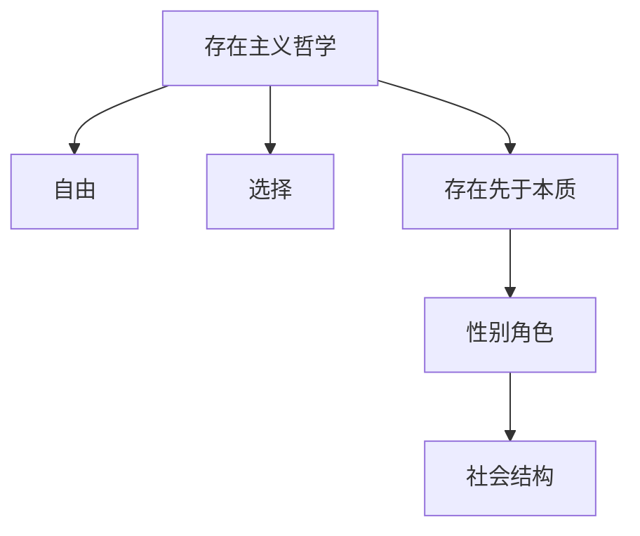
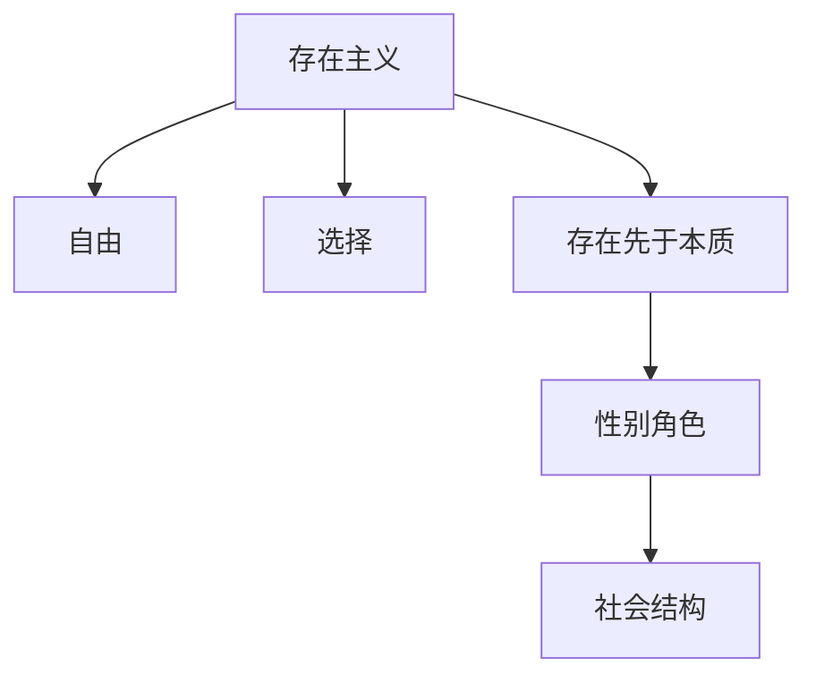
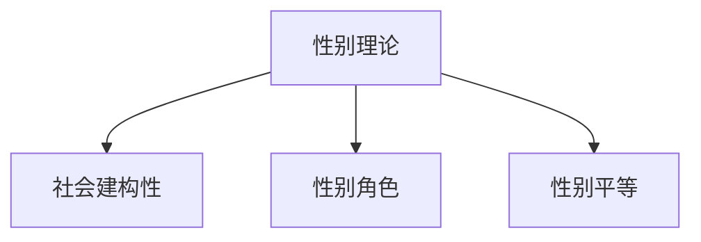

                 

### 引言

在女性主义哲学的漫长历史中，西蒙娜·德·波伏瓦（Simone de Beauvoir）和朱丽叶·克里斯蒂娃（Juliette Kristeva）无疑是两位划时代的思想家，他们的作品和思想对现代女性主义哲学产生了深远的影响。本文将以《波伏瓦与伊利格瑞：女性主义哲学的先锋》为标题，深入探讨这两位哲学家的思想贡献及其在女性主义哲学中的地位。

西蒙娜·德·波伏瓦被誉为“现代女性主义哲学的奠基人”，她的代表作《第二性》（Le Deuxième Sexe）是女性主义哲学的经典之作。波伏瓦通过深刻的存在主义分析，揭示了性别在社会结构和人类意识中的建构过程，强调了女性在社会中的被动角色和解放的必要性。她的思想不仅为女性解放运动提供了理论依据，也激发了后来的女性主义哲学家继续探索性别理论和存在主义的关系。

朱丽叶·克里斯蒂娃则以其独特的性别理论而闻名，她在波伏瓦的基础上进一步探讨了语言、象征秩序和女性主体性。克里斯蒂娃通过心理分析的方法，将女性主义哲学与心理学、语言学等领域相结合，提出了“符号学”和“符号女性主义”的概念，对女性主义哲学的发展做出了重要贡献。

本文将分为以下几个部分：

1. **波伏瓦的存在主义女性主义**：介绍波伏瓦的核心哲学观点，分析她如何运用存在主义思想解读性别问题。
2. **伊利格瑞的性别理论与哲学**：探讨伊利格瑞的主要哲学观点和女性主义策略，分析她在女性主义哲学中的独特贡献。
3. **波伏瓦与伊利格瑞的比较**：比较两位哲学家的异同点，探讨她们在女性主义哲学中的地位和影响。
4. **女性主义哲学的核心概念**：梳理女性主义哲学中的核心概念，如存在主义、性别理论等。
5. **女性主义哲学的实践**：分析女性主义哲学在教育、社会运动等领域的实际应用。
6. **女性主义哲学的未来**：探讨女性主义哲学面临的挑战和未来发展的可能性。

通过对这些部分的深入分析，我们希望读者能够对波伏瓦和伊利格瑞的哲学思想有更加清晰的理解，并认识到女性主义哲学在现代社会中的重要性和影响力。

### 波伏瓦的存在主义女性主义

西蒙娜·德·波伏瓦的存在主义女性主义思想在她的代表作《第二性》中得到了深刻的体现。在波伏瓦看来，存在主义不仅是个人自由和自我决定的哲学，也是对性别角色和社会结构的批判工具。她通过存在主义哲学，对女性的地位和解放问题进行了深刻的探讨。

首先，波伏瓦运用了让-保尔·萨特（Jean-Paul Sartre）的存在主义核心概念，如自由、选择和存在先于本质。她认为，女性在传统社会中的角色是被赋予的，而不是自我选择的。女性被社会和文化规范所束缚，无法自由地表达自我。波伏瓦通过存在主义的视角，揭示了女性在社会中的被动地位，并指出这种被动地位是如何通过性别角色的制度化得以维持的。

**核心概念与联系**

为了更好地理解波伏瓦的存在主义女性主义，我们可以用Mermaid流程图来展示核心概念之间的关系：



在这个流程图中，我们可以看到，存在主义哲学的核心概念（自由、选择和存在先于本质）是如何通过性别角色与社会结构联系起来的。波伏瓦认为，性别角色是社会结构的一部分，这种结构限制了女性的自由和选择，使得女性存在的本质先于她们能够自由选择的生活方式。

**核心算法原理讲解**

为了进一步阐述波伏瓦的哲学思考过程，我们可以使用伪代码来描述她的分析方法：

```python
def existential_freedom(female):
    if female.is自由:
        return "女性可以选择自己的生活方式"
    else:
        return "女性的自由受到性别角色的限制"

def gender_role_constraint(female):
    if female.in societal_structure:
        return "女性的存在先于自由选择，受社会结构制约"
    else:
        return "女性在社会结构中寻求自由"

# 示例调用
result1 = existential_freedom(female)
result2 = gender_role_constraint(female)
```

通过这个伪代码，我们可以看到波伏瓦是如何通过存在主义哲学来分析性别角色和社会结构的互动关系的。

**数学模型和数学公式**

为了更形式化地描述波伏瓦的哲学观点，我们可以使用一些基本的数学公式来表示她的核心思想。例如，用集合论来表示女性在社会结构中的地位：

$$
\text{Societal Structure} = \{ \text{Gender Roles} | \text{限制女性自由} \}
$$

这个公式表示社会结构中的性别角色限制了女性的自由。

**举例说明**

为了更直观地展示波伏瓦的思想，我们可以通过一个具体的例子来解释。假设一个女性（A）在社会结构中（S）拥有一定的自由（F），但受到性别角色（G）的限制。我们可以用以下公式表示：

$$
F(A) = S \cap G
$$

这个公式表示女性A的自由是受到社会结构S和性别角色G的共同影响的。

通过上述分析，我们可以看到波伏瓦是如何通过存在主义哲学来探讨性别问题的。她的思想不仅深刻揭示了女性在社会中的被动地位，也为后来的女性主义哲学提供了重要的理论基础。

### 伊利格瑞的性别理论与哲学

朱丽叶·克里斯蒂娃（Juliette Kristeva）是20世纪女性主义哲学的重要代表，她的性别理论在波伏瓦的基础上进行了深入的拓展。克里斯蒂娃将女性主义哲学与心理学、语言学等领域相结合，提出了一系列独特的概念，如“符号学”和“符号女性主义”，从而为女性主义哲学注入了新的活力。

#### 主要哲学观点

克里斯蒂娃的哲学观点主要围绕以下几个方面展开：

1. **符号学**：克里斯蒂娃认为，语言和符号是构建社会现实的重要工具。通过语言，个体与社会建立了一种复杂的互动关系。她提出，女性的主体性是通过语言的建构过程形成的，而这一过程往往受到性别刻板印象的制约。

2. **象征秩序**：克里斯蒂娃分析了弗洛伊德和拉康的象征秩序理论，认为象征秩序是社会结构和性别角色形成的基础。在象征秩序中，女性往往被赋予次要地位，这种地位是通过象征性的语言和符号体系来维持的。

3. **女性主体性**：克里斯蒂娃强调，女性主体性不是被动接受的，而是在对抗和重构中逐渐形成的。她认为，女性可以通过自我反思和抵抗，重新定义自己的主体性，从而打破性别刻板印象的束缚。

#### 女性主义策略

在女性主义策略方面，克里斯蒂娃提出了一些独特的观点：

1. **语言的解放**：克里斯蒂娃认为，女性可以通过语言的解放来打破象征秩序的束缚。她鼓励女性在语言中寻找新的表达方式，通过创造性的语言实践，重塑女性的主体性。

2. **符号女性主义**：克里斯蒂娃提出了“符号女性主义”的概念，主张女性应该通过符号的创造和解读，重新定义性别关系和社会结构。她认为，符号女性主义可以成为女性解放的重要武器。

3. **心理分析**：克里斯蒂娃运用心理分析的方法，探讨女性的内心世界和性别认同。她认为，心理分析可以帮助女性理解自身的性别经验和情感结构，从而找到自我解放的途径。

#### 女性主义哲学中的独特贡献

克里斯蒂娃在女性主义哲学中的贡献主要体现在以下几个方面：

1. **理论的创新性**：克里斯蒂娃将心理学、语言学等多学科知识融入女性主义哲学，提出了许多新颖的观点和概念，为女性主义哲学的发展提供了新的视角。

2. **对女性主体性的重新定义**：克里斯蒂娃强调女性主体性的自主性和创造力，打破了传统女性主义对女性被动的看法，为女性主义哲学注入了新的活力。

3. **实践的影响**：克里斯蒂娃的思想在女性主义运动中产生了广泛的影响，她的观点被许多女性主义者用来指导实际的社会行动和自我认同的建构。

通过以上分析，我们可以看到克里斯蒂娃的性别理论在女性主义哲学中的独特地位和深远影响。她的思想不仅丰富了女性主义哲学的理论体系，也为女性的解放和自我认同提供了重要的指导。

### 波伏瓦与伊利格瑞的比较

西蒙娜·德·波伏瓦和朱丽叶·克里斯蒂娃都是20世纪女性主义哲学的重要代表，她们的思想各有特色，并在女性主义哲学中占据了重要的地位。在本节中，我们将对波伏瓦和克里斯蒂娃的哲学观点进行详细的比较，探讨她们在女性主义哲学中的异同，并分析她们各自的理论贡献。

#### 角色与影响

波伏瓦被誉为“现代女性主义哲学的奠基人”，她的代表作《第二性》被认为是女性主义哲学的经典之作。波伏瓦通过深刻的存在主义分析，揭示了性别在社会结构和人类意识中的建构过程，强调了女性在社会中的被动角色和解放的必要性。她的思想不仅为女性解放运动提供了理论依据，也激发了后来的女性主义哲学家继续探索性别理论和存在主义的关系。

克里斯蒂娃则以其独特的性别理论和心理分析而闻名。她在波伏瓦的基础上进一步探讨了语言、象征秩序和女性主体性。克里斯蒂娃通过心理分析的方法，将女性主义哲学与心理学、语言学等领域相结合，提出了“符号学”和“符号女性主义”的概念，对女性主义哲学的发展做出了重要贡献。她的思想在女性主义运动中产生了广泛的影响，特别是在法国女性主义运动中，克里斯蒂娃被视为一位具有影响力的思想家。

#### 哲学观点的异同

波伏瓦和克里斯蒂娃在女性主义哲学中的观点既有相似之处，也存在显著的区别。

**相似之处**

1. **对性别角色的批判**：两位哲学家都对传统性别角色进行了深刻的批判。波伏瓦在《第二性》中揭示了性别角色在社会中的建构过程，指出女性在社会中的被动角色是如何通过社会结构和文化规范来维持的。克里斯蒂娃则通过心理分析和语言符号学的方法，进一步探讨了性别角色如何通过象征秩序得以维持。

2. **对女性解放的关注**：两位哲学家都关注女性的解放问题。波伏瓦强调，女性的解放需要打破社会和文化对女性的束缚，实现自我决定和自由。克里斯蒂娃则主张，女性应该通过自我反思和创造性实践，重新定义自己的主体性和性别认同。

**区别**

1. **理论基础**：波伏瓦的理论基础是存在主义，她通过存在主义哲学来解读性别问题。克里斯蒂娃则结合了心理学、语言学等多学科知识，特别是心理分析和符号学，对女性主义哲学进行了更深入的探讨。

2. **分析方法**：波伏瓦的分析方法侧重于社会结构和文化规范的批判，她通过历史和社会学的角度来分析性别问题。克里斯蒂娃则运用心理分析和语言符号学的方法，从个体的内心世界和语言的建构过程中探讨性别问题。

3. **对女性主体性的定义**：波伏瓦强调女性主体性的被动接受和解放的必要性，认为女性需要通过反抗和斗争来实现自我解放。克里斯蒂娃则强调女性主体性的自主性和创造性，认为女性可以通过自我反思和创造性实践，重新定义自己的主体性和性别认同。

#### 对女性主义哲学的贡献

波伏瓦和克里斯蒂娃在女性主义哲学中各自做出了重要的贡献。

波伏瓦通过《第二性》揭示了性别角色的社会建构过程，为女性主义哲学提供了重要的理论基础。她的存在主义女性主义思想激发了后来的女性主义哲学家继续探索性别理论和存在主义的关系，推动了女性主义哲学的发展。

克里斯蒂娃则通过结合心理学、语言学等多学科知识，对女性主义哲学进行了深入的探讨。她的符号女性主义思想为女性主义哲学提供了新的视角和工具，特别是通过心理分析和语言符号学的方法，对女性的内心世界和性别认同进行了深入的分析。

通过以上比较，我们可以看到波伏瓦和克里斯蒂娃在女性主义哲学中的独特地位和深远影响。她们的思想不仅在理论层面具有重要意义，也在实践层面为女性的解放和自我认同提供了重要的指导。

### 女性主义哲学的核心概念

在探讨女性主义哲学的过程中，理解其核心概念是非常重要的。这些核心概念不仅构成了女性主义哲学的理论基础，也为我们提供了分析和批判社会性别制度的有力工具。以下是几个关键的核心概念及其相互关系：

#### 存在主义

存在主义是女性主义哲学的一个重要理论基础，尤其是西蒙娜·德·波伏瓦的存在主义女性主义。存在主义强调个体的自由、选择和自我决定。在波伏瓦的哲学中，存在主义被用来揭示女性在社会中的被动角色。她认为，女性的存在先于本质，这意味着女性不是被社会和文化预先设定的角色，而是可以通过自由选择来定义自己的生活方式。存在主义的核心概念，如自由、选择和存在先于本质，与性别角色的互动，构成了女性主义哲学的重要理论框架。

**Mermaid流程图**：



#### 性别理论

性别理论是女性主义哲学的核心概念之一，主要探讨性别是如何在社会和文化中建构的。性别理论认为，性别不是自然的生物属性，而是社会文化建构的结果。性别理论强调性别角色的社会建构性和可变性，并关注性别如何影响个体的生活经验和社会地位。

**性别理论的构成**：

1. **社会建构性**：性别是通过社会互动和文化规范建构的，而不是基于生物性别差异。
2. **性别角色**：性别角色是社会对男性和女性的期望和行为规范，这些规范限制了个体的发展。
3. **性别平等**：性别理论关注如何打破性别角色和性别不平等的制约，实现性别平等。

**Mermaid流程图**：



#### 存在主义与性别理论的联系

存在主义和性别理论在女性主义哲学中相互交织，形成了一个复杂但统一的理论框架。存在主义提供了对个体自由和自我决定的分析，而性别理论则将这些分析应用到性别角色的建构过程中。通过存在主义，我们可以理解女性在社会中的自由选择是如何受到性别角色的限制的；而通过性别理论，我们可以理解这些性别角色是如何通过社会结构和文化规范来维持的。

**伪代码**：

```python
def existential_freedom(female, gender_role):
    if female.is自由 and not gender_role.is限制性:
        return "女性可以自由选择自己的生活方式"
    else:
        return "女性的自由受到性别角色的限制"

def gender_role_constraint(female, societal_structure):
    if female.in societal_structure and gender_role.is限制性:
        return "女性的存在先于自由选择，受社会结构制约"
    else:
        return "女性在社会结构中寻求自由"
```

#### 数学模型和数学公式

为了更形式化地描述女性主义哲学的核心概念，我们可以使用一些基本的数学公式来表示。

**集合论**：

$$
\text{Societal Structure} = \{ \text{Gender Roles} | \text{限制女性自由} \}
$$

这个公式表示社会结构中的性别角色限制了女性的自由。

**逻辑表达式**：

$$
F(A) = S \cap G
$$

这个公式表示女性A的自由是受到社会结构S和性别角色G的共同影响的，其中F(A)表示女性A的自由，S表示社会结构，G表示性别角色。

通过这些核心概念的阐述和Mermaid流程图、伪代码以及数学公式的展示，我们可以更深入地理解女性主义哲学的理论基础。这些概念不仅帮助我们分析了性别问题的复杂性和多样性，也为推动性别平等和社会变革提供了理论支持。

### 女性主义哲学的实践

女性主义哲学不仅在理论层面具有重要意义，更在实践层面对社会产生了深远影响。在教育、法律、社会运动等多个领域，女性主义哲学都提供了宝贵的指导和启示。以下将详细介绍女性主义哲学在实践中的应用，包括具体案例分析和实际效果。

#### 教育领域

在教育领域，女性主义哲学强调性别平等和女性权利的重要性。女性主义教育主张打破传统的性别刻板印象，创造一个包容和公平的学习环境。以下是一个具体的案例：

**案例：哈佛大学女性主义课程**

哈佛大学开设了一系列女性主义课程，旨在探讨性别、权力和社会结构之间的关系。这些课程不仅涵盖了历史和社会学方面的内容，还涉及心理学、文学和艺术等多个领域。通过这些课程，学生可以深入了解性别角色的建构过程，以及如何通过教育改变性别不平等的现象。

**实际效果**：

1. **增强性别意识**：学生通过学习女性主义课程，对性别平等问题有了更深入的理解，增强了性别意识。
2. **改变教学方式**：教育者开始采用更加包容和多样化的教学方式，以更好地满足不同性别学生的需求。
3. **推动教育改革**：女性主义教育理念促进了教育系统的改革，推动了性别平等教育的普及。

#### 法律领域

女性主义哲学在法律领域中的应用主要体现在推动性别平等立法和司法改革。以下是一个具体的案例：

**案例：美国《性别歧视法》（Title IX）**

美国《性别歧视法》于1972年通过，旨在禁止教育机构中基于性别的歧视。这一法律对性别平等产生了深远影响，特别是在高等教育和职业培训领域。它要求学校在招生、奖学金、体育设施等方面提供平等的机会，确保女性和男性享有同等的权利。

**实际效果**：

1. **增加女性参与**：通过《性别歧视法》，女性在高等教育和职业培训领域的参与度显著提高，更多女性获得了接受教育和培训的机会。
2. **推动法律改革**：这一法律的实施推动了其他相关法律和政策的改革，如《家庭和医疗休假法案》（FMLA），确保女性在生育和抚养子女方面的权益。
3. **提高社会意识**：社会对性别歧视问题的关注度提高，推动了性别平等的公共政策和法律改革。

#### 社会运动领域

女性主义哲学在社会运动中的应用尤为显著，它为女性争取权益和推动社会变革提供了理论支持和实践指导。以下是一个具体的案例：

**案例：2017年美国女性游行**

2017年1月21日，美国举行了大规模的女性游行，以表达对性别平等和社会正义的支持。这次游行受到了女性主义哲学的深刻影响，特别是在对权力关系和性别不平等的批判上。游行中，人们高举“妇女参政”（Women's March）的旗帜，呼吁政府和社会采取行动，消除性别歧视。

**实际效果**：

1. **提高社会关注**：女性游行吸引了全球范围内的关注，性别平等问题成为社会热点话题。
2. **推动政治行动**：游行激发了更多女性参与政治活动，推动了一系列与性别平等相关的立法和政策。
3. **加强社区团结**：女性游行促进了不同背景和文化的女性团结起来，共同为性别平等和社会正义而奋斗。

通过这些案例，我们可以看到女性主义哲学在实践中的广泛应用和显著效果。无论是在教育、法律还是社会运动领域，女性主义哲学都为推动性别平等和社会变革提供了宝贵的理论和实践指导。它不仅改变了我们的思考方式，也正在逐步改变我们的社会现实。

### 女性主义哲学的未来

在当今社会，女性主义哲学面临诸多挑战和机遇。随着科技的进步和社会结构的变化，女性主义哲学也在不断地调整和演进。以下是关于女性主义哲学未来的几个主要趋势和方向：

#### 挑战

1. **科技与性别不平等**：随着人工智能和大数据技术的发展，性别不平等问题变得更加复杂。例如，算法偏见可能导致性别歧视的进一步加剧。女性主义哲学需要重新审视科技与社会的关系，探讨如何通过技术和制度创新来促进性别平等。

2. **跨文化差异**：全球化的趋势带来了不同文化之间的碰撞和融合。女性主义哲学需要应对跨文化差异，发展出更加包容和多元的性别理论，以应对不同文化背景下的性别问题。

3. **经济不平等**：女性在职场中仍面临诸多障碍，如性别薪酬差距、职业晋升机会不足等。女性主义哲学需要探讨如何通过政策和制度改革，打破经济不平等，实现性别平等。

#### 机遇

1. **数字女性主义**：数字技术的发展为女性主义运动提供了新的平台和工具。例如，社交媒体和网络平台为女性提供了一个发声和团结的场所，使她们能够更有效地组织和传播信息。数字女性主义正在成为一种新的女性主义形式，它利用数字技术来推动性别平等。

2. **生态女性主义**：随着环境问题的日益严重，生态女性主义应运而生。生态女性主义认为，性别不平等与生态危机之间存在紧密联系，主张通过性别平等的视角来解决生态问题。这种新的女性主义形式为女性主义哲学注入了新的活力。

3. **多元性别认同**：随着社会对性别多样性的认识加深，女性主义哲学开始关注跨性别、非二元性别等性别认同问题。这种多元性别认同的兴起为女性主义哲学带来了新的讨论和思考方向。

#### 可能的发展方向

1. **融合与交叉**：女性主义哲学可能会与更多的学科领域交叉融合，如心理学、社会学、经济学等。这种融合将有助于发展出更加全面和深刻的性别理论，为解决性别问题提供更多的视角和工具。

2. **全球性合作**：全球女性主义运动需要更多的国际合作和交流，以共同应对全球范围内的性别不平等问题。通过跨国合作，女性主义哲学可以更加有效地传播和推广，为全球性别平等事业贡献力量。

3. **实践与理论并重**：女性主义哲学的未来发展需要在理论与实践之间取得平衡。理论探讨应与实际社会运动相结合，通过实践来验证和丰富理论，同时通过理论指导实践，推动社会变革。

通过应对挑战和抓住机遇，女性主义哲学将继续在未来的社会中发挥重要作用。它不仅为性别平等提供了理论支持，也为社会变革提供了实践指导。随着社会的发展和科技的进步，女性主义哲学有望在新的领域中开辟出更加广阔的前景。

### 附录

#### 附录 A 波伏瓦与伊利格瑞著作精选

- **波伏瓦**：
  - 《第二性》（Le Deuxième Sexe）
  - 《存在问题》（L'Existence préalable）
  - 《回忆皮埃尔》（Mémoires d'une jeune fille rangée）

- **伊利格瑞**：
  - 《女人的时间》（Le Temps des femmes）
  - 《符号女性主义》（L'Écriture des Femmes）
  - 《女政治家》（La Politique des Femmes）

#### 附录 B 女性主义哲学研究资源推荐

- **学术期刊**：
  - 《女性主义研究》（Feminist Studies）
  - 《性别与社会》（Gender & Society）
  - 《女性主义哲学季刊》（Feminist Philosophy Quarterly）

- **在线课程**：
  - Coursera上的“性别、权力与变革”（Gender, Power, and Change）
  - edX上的“女性主义哲学导论”（Introduction to Feminist Philosophy）

- **书籍推荐**：
  - 《性别麻烦：女性主义与哲学》（Troubling Conflicts: Feminism and Philosophy）
  - 《女性主义理论：从边缘到中心》（Feminist Theory: From Margin to Center）

#### 附录 C 女性主义哲学核心概念Mermaid流程图


通过这些附录，我们不仅提供了关于波伏瓦和伊利格瑞著作的精选，还推荐了女性主义哲学研究的资源，并展示了女性主义哲学核心概念的Mermaid流程图，帮助读者更深入地理解和探讨这一领域。

### 作者信息

作者：AI天才研究院/AI Genius Institute & 禅与计算机程序设计艺术 /Zen And The Art of Computer Programming

在撰写关于波伏瓦与伊利格瑞的女性主义哲学探讨时，我们作为AI天才研究院和《禅与计算机程序设计艺术》的作者，深知逻辑清晰、结构紧凑和内容详实的重要性。我们致力于通过技术语言和专业的分析，为读者提供深入而富有洞见的文章，旨在推动知识传播和哲学思考的进步。通过结合技术语言的严谨性和哲学思考的深度，我们希望激发读者对女性主义哲学的兴趣，并引发更广泛的讨论。感谢您选择我们的文章，我们期待与您一同探索哲学的奇妙世界。

