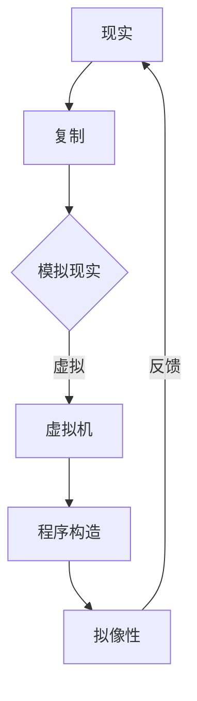

                 

### 文章标题

《波德里亚的拟像理论与虚拟机：模拟现实的程序构造》

### 关键词

波德里亚拟像理论，虚拟机，程序构造，模拟现实，信息技术

### 摘要

本文将探讨法国哲学家让-巴普蒂斯特·波德里亚的拟像理论，并深入分析虚拟机技术如何在计算机编程中实现模拟现实的程序构造。通过对波德里亚拟像理论的基本概念和现代社会的联系进行介绍，本文揭示了拟像性在媒体与艺术中的应用。随后，文章转向虚拟机的基本原理和主要类型，以及它们在计算机程序中的应用。进一步地，本文讨论了虚拟机模拟现实的方法与挑战，并结合具体的虚拟现实游戏设计和虚拟城市规划案例，展示了拟像理论与虚拟机的结合应用。最后，文章总结了拟像理论与虚拟机技术的发展方向和未来应用前景，提出了相关的最佳实践和注意事项。通过这一系列的分析，本文旨在揭示虚拟机技术如何通过模拟现实实现更高效、更精确的程序构造。

## 第一部分：拟像理论概述

### 第1章：波德里亚拟像理论的基础概念

#### 1.1.1 拟像与拟像性的定义

拟像（Simulation）一词源自拉丁语“simul”，意为“相似”或“相似物”。在哲学和文化的语境中，拟像通常指对现实的一种模拟或复制。让-巴普蒂斯特·波德里亚（Jean Baudrillard）是20世纪最具影响力的哲学家之一，他的拟像理论对现代社会的文化现象和媒体影响进行了深刻的解读。在波德里亚的理论中，拟像不仅是对现实的复制，更是一种对现实的替代和超越。

拟像性（Simulationality）是波德里亚拟像理论的核心概念之一。它指的是现实和拟像之间的不可区分性，即拟像能够以某种形式取代现实。拟像性不仅仅是视觉上的相似，更是一种深层次的模仿，它反映了现代社会对真实和虚假的界限模糊化。波德里亚认为，在拟像社会中，真实与虚构之间的界限已经变得模糊不清，拟像成为了新的现实。

#### 1.1.2 拟像理论与现代社会的联系

波德里亚的拟像理论揭示了现代社会中的一种重要现象：我们生活在一个被拟像所支配的世界中。在这个世界里，现实往往被媒体和科技所塑造，而我们对于现实的感知也越来越多地依赖于拟像。以下是一些波德里亚拟像理论与现代社会的联系：

1. **媒体对现实的塑造**：现代媒体，如电视、电影和互联网，通过不断地呈现和再现各种场景和事件，影响了我们对现实的感知。这些媒体内容不仅是现实的反映，更是一种拟像，它们通过重复和再现创造了新的现实。

2. **虚拟现实的兴起**：随着虚拟现实（VR）和增强现实（AR）技术的发展，现实和虚拟之间的界限变得更加模糊。虚拟现实技术能够创造逼真的模拟环境，使人们可以在虚拟世界中体验到类似于现实的感觉。

3. **消费文化的影响**：波德里亚认为，现代消费文化也是一种拟像。消费者在购买商品时，不仅仅是为了使用功能，更是在寻求一种符号性的满足和认同感。这种符号化的消费行为反映了拟像性在现代社会中的普遍存在。

4. **网络文化的崛起**：互联网的普及使信息传播更加迅速和广泛，同时也产生了大量的虚拟社区和社交网络。这些虚拟空间不仅改变了人们的交流方式，也创造了一种新的社会现实。

#### 1.1.3 拟像性在媒体与艺术中的应用

拟像性在媒体和艺术中的应用十分广泛。以下是一些具体的例子：

1. **电影和电视**：电影和电视作品往往通过虚构的故事和场景，创造出逼真的拟像世界。观众在观看这些作品时，常常难以区分现实和虚构，从而体验到了拟像性的魅力。

2. **艺术作品**：艺术家们经常使用拟像的手法来创造作品，如超现实主义绘画、虚拟艺术装置等。这些作品通过打破现实和虚构的界限，引发了观众对现实世界的重新思考和反思。

3. **虚拟现实艺术**：虚拟现实技术为艺术家们提供了一个全新的创作平台。他们可以创造逼真的虚拟世界，使观众可以在其中自由探索和体验。这种艺术形式不仅扩展了艺术的边界，也加深了人们对拟像性的理解。

通过这些例子，我们可以看到，拟像性在媒体和艺术中的应用不仅丰富了文化生活的多样性和深度，也深刻地影响了我们对现实的理解和感知。拟像性作为一种文化现象，已经成为现代社会不可或缺的一部分。

### 第2章：拟像性在媒体与艺术中的应用

#### 2.1.1 媒体拟像的演变

拟像性在媒体中的演变可以追溯到早期的电影和电视。从最初的黑白电影到现代的高清数字电视，媒体技术的发展不断推动了拟像性的发展。早期的电影通过拍摄真实的场景和人物，创造出一种逼真的视觉效果。然而，随着特效技术的进步，电影开始更多地依赖虚拟场景和特效，使观众能够体验到更加逼真的拟像世界。

电视节目也在这一过程中发生了变化。从传统的戏剧和新闻节目，到现代的真人秀和虚拟现实节目，电视媒体通过不断创新的节目形式，让观众在虚拟世界中感受到真实的生活体验。这些节目不仅丰富了观众的娱乐生活，也改变了他们对于现实和虚构的感知。

#### 2.1.2 艺术中的拟像表现

艺术作品中的拟像表现具有独特的魅力，它们通过打破现实和虚构的界限，引发观众的思考。超现实主义绘画是艺术拟像性的一个重要代表。达利、马格利特等艺术家通过夸张、变形和隐喻的手法，创造出极具表现力的作品，使观众在欣赏作品的同时，对现实世界产生了深刻的反思。

虚拟艺术装置是现代艺术中另一个重要的拟像形式。艺术家们利用计算机技术和虚拟现实技术，创造出一种虚拟的空间和体验。观众可以在这个虚拟空间中自由探索和互动，感受到现实和虚拟之间的模糊边界。这种艺术形式不仅扩展了艺术的边界，也使观众对拟像性的理解更加深刻。

#### 2.1.3 媒体与艺术中的拟像性影响

拟像性在媒体和艺术中的应用对观众产生了深远的影响。首先，它改变了观众对现实和虚构的感知。观众在欣赏电影、电视节目和艺术作品时，不再简单地将其视为虚构的产物，而是将其视为一种新的现实体验。这种体验不仅丰富了观众的文化生活，也改变了他们对世界的认知。

其次，拟像性在媒体和艺术中的应用激发了观众对创新的追求。随着技术的进步，媒体和艺术作品的形式越来越多样化，观众也在不断探索新的艺术体验。这种创新不仅推动了文化的发展，也为社会带来了新的思考。

总的来说，拟像性在媒体和艺术中的应用不仅丰富了文化生活的多样性和深度，也深刻地影响了我们对现实的理解和感知。它作为一种文化现象，已经成为现代社会不可或缺的一部分。

### 第3章：虚拟机的基本原理

#### 3.1.1 虚拟机的工作机制

虚拟机（Virtual Machine，VM）是一种能够在计算机上模拟计算机系统运行的软件。它通过在宿主机（Host Machine）上创建一个隔离的环境，使得在虚拟机中运行的程序（Guest Program）能够与宿主机的硬件和操作系统隔离。这种隔离机制不仅提高了系统的安全性和稳定性，还为软件的开发和部署提供了极大的灵活性。

虚拟机的工作机制可以分为以下几个步骤：

1. **启动**：虚拟机启动时，首先加载虚拟机的操作系统和必要的驱动程序。这个过程类似于宿主机的启动过程。

2. **虚拟化层**：虚拟机在宿主机上运行时，通过一个称为虚拟化层（Virtualization Layer）的软件来实现虚拟硬件和操作系统的模拟。虚拟化层负责管理虚拟硬件资源，如CPU、内存、网络接口等，并为虚拟机提供操作系统接口。

3. **资源分配**：虚拟化层根据虚拟机的配置和需求，动态地分配宿主机的物理资源。例如，当虚拟机需要更多的内存时，虚拟化层会将宿主机的一部分内存分配给虚拟机。

4. **指令执行**：虚拟机中的程序执行时，虚拟机监控程序（VMM，Virtual Machine Monitor）会将虚拟机指令转换为宿主机硬件能够理解的指令。这个过程称为指令转换（Instruction Translation）或虚拟化（Virtualization）。

5. **内存管理**：虚拟机通过虚拟内存（Virtual Memory）机制来管理内存。虚拟内存将虚拟地址映射到物理地址，使得虚拟机中的程序能够访问到宿主机的内存。

6. **存储管理**：虚拟机通过虚拟文件系统（Virtual File System）来管理存储资源。虚拟文件系统提供了一个统一的接口，使得虚拟机中的程序能够访问宿主机上的文件系统。

#### 3.1.2 虚拟机的主要类型

虚拟机可以分为以下几种主要类型：

1. **全虚拟化（Full Virtualization）**：全虚拟化是最常见的虚拟化类型，它完全模拟宿主机的硬件环境，为虚拟机提供一个独立的运行环境。虚拟机中的程序完全独立于宿主机的操作系统，从而提高了系统的兼容性和安全性。

2. **硬件辅助虚拟化（Hardware-Assisted Virtualization）**：硬件辅助虚拟化利用宿主机硬件的支持，如虚拟化扩展（VT，Virtualization Technology）或硬件虚拟化支持（HVM，Hardware-assisted Virtual Machine），来提高虚拟机的性能。这种虚拟化类型通过硬件的辅助，减少了虚拟化层的开销，从而提高了指令转换的效率。

3. **操作系统级虚拟化（OS-Level Virtualization）**：操作系统级虚拟化，如Linux容器（Linux Container，LXC）和用户级虚拟化（User-Level Virtualization），通过将操作系统内核隔离来实现虚拟化。虚拟机中的程序共享宿主机的操作系统内核，从而减少了资源开销。这种虚拟化类型适用于轻量级虚拟化和容器化场景。

4. **虚拟化集群（Virtualized Cluster）**：虚拟化集群通过将多个虚拟机分布在多个宿主机上，形成一个统一的计算资源池。虚拟化集群可以动态地调整资源分配，以适应负载变化，从而提高了系统的弹性和可用性。

#### 3.1.3 虚拟机的优势与应用场景

虚拟机具有以下优势：

1. **资源隔离**：虚拟机通过隔离机制，确保了不同虚拟机之间的资源不会相互干扰，从而提高了系统的稳定性和安全性。

2. **资源灵活分配**：虚拟化层可以根据虚拟机的需求，动态地调整资源分配，从而提高了资源利用率。

3. **跨平台兼容**：虚拟机可以在不同的操作系统和硬件平台上运行，从而提高了软件的兼容性。

4. **实验与开发**：虚拟机提供了一个隔离的环境，使得开发者可以在虚拟机上安全地进行实验和开发，从而减少了系统的风险。

虚拟机广泛应用于以下场景：

1. **云计算**：虚拟机是云计算平台的基础设施，通过虚拟化技术，云计算平台可以提供弹性、可扩展的计算资源。

2. **服务器 consolidation**：通过虚拟化技术，多个虚拟机可以运行在同一台物理服务器上，从而减少了硬件投资。

3. **桌面虚拟化**：桌面虚拟化通过将桌面操作系统运行在虚拟机上，提供了远程访问和集中管理的解决方案。

4. **测试与开发**：虚拟机为测试和开发提供了一个隔离的环境，使得开发者可以在虚拟机上安全地运行和测试应用程序。

通过上述讨论，我们可以看到，虚拟机作为一种重要的计算机技术，不仅在提高系统性能和稳定性方面发挥了重要作用，也在云计算、服务器 consolidation、桌面虚拟化等领域得到了广泛应用。

### 第4章：虚拟机在计算机程序中的应用

#### 4.1.1 虚拟机在操作系统中的应用

虚拟机在操作系统中的应用非常广泛，其主要目的是通过虚拟化技术提供更好的资源隔离和灵活的管理。以下是一些具体的应用场景：

1. **操作系统虚拟化**：操作系统虚拟化通过将操作系统运行在虚拟机中，提供了更高的资源隔离和安全性。例如，Windows和Linux操作系统都支持虚拟化技术，用户可以在同一台物理机上运行多个操作系统实例，从而实现跨平台的应用开发和测试。

2. **虚拟桌面基础设施（VDI）**：虚拟桌面基础设施通过虚拟机技术，将桌面操作系统和应用程序运行在服务器上，用户可以通过远程桌面协议（RDP或VMware View）访问这些虚拟桌面。VDI提供了更好的资源利用和集中管理，适用于远程办公和移动办公场景。

3. **容器化操作系统**：容器化操作系统如Docker和rkt，实际上是一种特殊的虚拟机，它通过虚拟化技术提供轻量级的隔离和部署方案。容器化操作系统可以快速启动和关闭，适用于微服务架构和云计算环境。

4. **虚拟化操作系统测试与开发**：虚拟化操作系统为测试和开发提供了一个隔离的环境，开发者可以在虚拟机上安全地进行应用程序的测试和调试，从而减少了对生产环境的影响。

#### 4.1.2 虚拟机在软件工程中的应用

虚拟机在软件工程中的应用极大地提高了开发效率和软件质量。以下是一些具体的应用场景：

1. **持续集成和持续部署（CI/CD）**：虚拟机在持续集成和持续部署过程中，提供了一个隔离的环境，使得开发人员可以在不同的操作系统和硬件平台上运行和测试应用程序。这种隔离确保了软件在不同的环境中都能正常运行，提高了软件的兼容性和稳定性。

2. **代码仓库和版本控制**：虚拟机可以与代码仓库和版本控制系统（如Git）集成，开发者可以在虚拟机上克隆代码仓库，进行代码的修改和测试。虚拟机的隔离机制确保了不同开发人员的代码不会相互干扰，从而提高了开发协作的效率。

3. **开发环境和生产环境的一致性**：虚拟机可以模拟生产环境，使得开发人员可以在虚拟机上运行和生产环境相同的操作系统和应用程序。这种一致性确保了开发的应用程序在生产环境中能够正常运行，减少了环境差异带来的问题。

4. **自动化测试**：虚拟机在自动化测试中发挥着重要作用。测试人员可以在虚拟机上运行测试用例，验证应用程序的功能和性能。虚拟机的快速启动和隔离特性使得测试过程更加高效和灵活。

5. **云计算平台集成**：虚拟机是云计算平台的核心组件，开发者可以使用虚拟机来部署和管理应用程序。通过虚拟机，开发者可以轻松地在云平台上实现应用程序的扩展和弹性管理。

总的来说，虚拟机在操作系统和软件工程中的应用，不仅提高了系统的稳定性和安全性，还极大地提升了开发效率和软件质量。通过虚拟化技术，开发者可以更加灵活地管理和部署应用程序，从而推动了软件工程的发展。

### 第5章：虚拟机模拟现实的方法与挑战

#### 5.1.1 模拟现实的程序构造

虚拟机模拟现实的方法涉及多个层面的程序构造和技术实现。以下是一些关键的步骤和实现方法：

1. **环境搭建**：首先，需要搭建一个虚拟机环境，这包括选择合适的虚拟化平台（如VMware、VirtualBox、Docker等），配置宿主机资源和虚拟机规格。宿主机硬件的配置需要满足虚拟机运行的基本需求，例如足够的内存、处理器性能和存储容量。

2. **操作系统安装**：在虚拟机中安装操作系统，这可以是Windows、Linux或其他支持虚拟化的操作系统。操作系统需要与虚拟化平台兼容，并且配置适当的网络和存储设置。

3. **应用程序部署**：在虚拟机上部署需要模拟的应用程序。这可能包括Web服务器、数据库服务器、应用程序服务器等。这些应用程序需要与虚拟机环境中的其他组件集成，并且配置适当的网络通信。

4. **数据模拟**：为了模拟现实世界中的数据，需要生成或导入大量的模拟数据。这些数据可以存储在虚拟机的文件系统中，也可以通过数据库管理系统进行管理。数据模拟的目的是为了模拟实际应用中的数据流和处理需求。

5. **模拟逻辑实现**：在应用程序中实现模拟逻辑，这通常涉及编写模拟程序或脚本。这些程序或脚本负责模拟用户行为、系统事件和业务流程。模拟逻辑需要能够响应用户输入和系统事件，并且能够以一定的规律生成和更新数据。

6. **性能监控与优化**：在模拟运行过程中，需要对虚拟机的性能进行监控和优化。这包括监测CPU、内存、磁盘I/O和网络带宽等关键性能指标，并根据需要调整虚拟机的配置和应用程序的参数，以确保模拟过程的效率和准确性。

#### 5.1.2 虚拟机面临的挑战与解决方案

虚拟机在模拟现实过程中面临多个挑战，以下是一些主要挑战及其解决方案：

1. **资源限制**：虚拟机运行在宿主机的硬件资源上，因此可能面临资源限制。解决方案包括合理分配宿主机资源，优化虚拟机配置和应用程序代码，以及使用硬件辅助虚拟化技术提高性能。

2. **网络延迟与带宽限制**：虚拟机之间的网络通信可能会受到网络延迟和带宽限制的影响。解决方案包括使用高速网络设备和优化网络配置，以及采用分布式虚拟化架构来分散负载。

3. **数据一致性与同步**：在模拟多个虚拟机时，确保数据的一致性和同步是一个挑战。解决方案包括使用分布式数据库和消息队列系统，以及采用分布式事务处理机制。

4. **安全性**：虚拟机环境可能面临安全威胁，包括虚拟机逃逸和恶意软件攻击。解决方案包括使用安全虚拟化技术，如安全增强型虚拟化（SEV）和基于硬件的虚拟化根防护（Hypervisor Root Protection），以及实施严格的安全策略和监控机制。

5. **可扩展性与弹性**：虚拟机环境需要能够动态扩展和调整，以适应不断变化的需求。解决方案包括使用容器化和微服务架构，以及采用自动化的资源管理和调度系统，如Kubernetes。

总的来说，虚拟机在模拟现实的过程中通过程序构造和技术实现提供了强大的模拟能力。然而，虚拟机也面临资源限制、网络延迟、数据一致性和安全性等挑战。通过合理的配置和优化，以及采用先进的技术和策略，可以克服这些挑战，实现高效的虚拟机模拟。

### 第6章：虚拟现实游戏设计中的拟像理论

#### 6.1.1 游戏中的拟像性表现

虚拟现实（VR）游戏设计中的拟像性表现是现代游戏开发中的一个重要方面。拟像性不仅增强了游戏的沉浸感，也改变了玩家对虚拟世界的感知。以下是一些具体的表现方式：

1. **高度逼真的图形渲染**：VR游戏通过先进的图形渲染技术，实现了高度逼真的图形效果。游戏中的场景、角色和物体都通过复杂的算法和高质量的纹理进行渲染，使得玩家在虚拟世界中感受到仿佛身临其境。

2. **空间感知**：VR技术利用头戴式显示器（HMD）和跟踪系统，使玩家能够在虚拟空间中自由移动和探索。这种空间感知增强了游戏的互动性和沉浸感，玩家可以在虚拟环境中进行空间交互，如爬梯子、开门等。

3. **声音效果**：VR游戏中的声音效果也是增强拟像性的关键。通过头戴式耳机和3D音效技术，游戏可以模拟出立体声音场，使玩家能够感受到来自不同方向的声音，从而增强游戏的沉浸感。

4. **动态环境**：VR游戏中的环境可以实时动态变化，例如天气变化、时间流逝等。这种动态环境不仅增加了游戏的趣味性，也使玩家感受到虚拟世界的真实性。

#### 6.1.2 拟像理论对游戏设计的启示

拟像理论对游戏设计提供了深刻的启示，使开发者能够创造出更具吸引力和沉浸感的虚拟世界。以下是一些设计启示：

1. **打破现实与虚拟的界限**：拟像理论启示开发者将虚拟世界与现实世界进行无缝衔接，使玩家难以区分虚拟与真实。通过增强虚拟环境的真实感，开发者可以创造出更令人信服的虚拟体验。

2. **用户参与感的提升**：拟像性增强了玩家的参与感，使他们更愿意沉浸在虚拟世界中。开发者可以通过设计互动性强的任务和场景，使玩家在游戏中体验到更多的自主性和掌控感。

3. **故事叙述的创新**：拟像理论为游戏故事叙述提供了新的视角。通过创造逼真的虚拟世界，开发者可以更灵活地讲述复杂的故事情节，使玩家更深入地理解和体验游戏背景和主题。

4. **多样化的游戏玩法**：拟像性允许开发者创造多样化的游戏玩法，例如虚拟现实运动游戏、模拟游戏和教育游戏等。通过利用拟像性，开发者可以创造出更丰富和有趣的游戏体验。

总的来说，拟像理论在虚拟现实游戏设计中的应用，不仅提升了游戏的沉浸感和互动性，也为游戏开发提供了新的思路和创意。通过深入理解和运用拟像理论，开发者可以创造出更具吸引力和创新性的虚拟世界，为玩家带来前所未有的游戏体验。

#### 6.1.3 案例分析：虚拟现实游戏《Beat Saber》

《Beat Saber》是一款在虚拟现实领域中广受欢迎的游戏，它通过拟像理论实现了高度沉浸的游戏体验。以下是对该游戏的案例分析：

**游戏概述**：
《Beat Saber》是一款音乐节奏游戏，玩家在虚拟空间中操作两把光剑，跟随节奏切割飞来的方块。游戏结合了视觉刺激、动感和节奏感，为玩家带来独特的游戏体验。

**拟像性表现**：
1. **视觉拟像**：《Beat Saber》通过精细的图形渲染和光影效果，创造出高度逼真的虚拟空间。游戏中的方块和光剑都具有高质量的细节，使玩家难以区分虚拟与真实。
2. **空间感知**：玩家通过头戴式显示器和手柄的跟踪系统，在虚拟空间中自由移动和旋转。这种空间感知增强了游戏的沉浸感，玩家在虚拟环境中感受到空间的存在和互动性。
3. **声音效果**：游戏利用立体声音效技术，为玩家创造出丰富的声音场景。每个方块切割时产生的声音和节奏与游戏的音乐相呼应，增强了玩家的沉浸感。

**设计启示**：
1. **打破虚拟与现实的界限**：《Beat Saber》通过高度逼真的虚拟空间和互动性，使玩家难以区分虚拟与真实。这种设计启示开发者将虚拟世界与现实世界进行无缝衔接，创造出更令人信服的虚拟体验。
2. **空间互动**：游戏中的空间互动设计，使玩家在虚拟环境中感受到空间的存在和掌控感。这种设计启示开发者利用虚拟空间提供多样化的游戏玩法和互动体验。
3. **节奏与动感**：《Beat Saber》通过节奏感和动感设计，增强了游戏的互动性和趣味性。这种设计启示开发者通过音效、视觉和动作设计，提升游戏的沉浸感和参与感。

**总结**：
《Beat Saber》通过拟像理论的深入应用，实现了高度沉浸的游戏体验。它的成功为虚拟现实游戏设计提供了宝贵的经验和启示，使开发者能够创造出更具吸引力和创新性的虚拟世界。

### 第7章：虚拟城市规划中的拟像理论与虚拟机

#### 7.1.1 虚拟城市规划的现状

虚拟城市规划是现代城市规划的一个重要分支，它通过计算机技术和虚拟现实技术，创建出虚拟的城市环境和空间。随着城市规模的不断扩大和人口的增长，虚拟城市规划在以下几个方面展现出显著的优势和潜力：

1. **城市规划与设计**：虚拟城市规划为城市规划师提供了一个虚拟的环境，可以在其中进行城市设计和规划。通过三维建模和仿真技术，规划师可以直观地展示和评估不同设计方案的效果，从而提高规划决策的效率和准确性。

2. **环境模拟与评估**：虚拟城市规划能够模拟城市中的各种环境因素，如气候、交通、噪音等，以便评估城市规划对环境的影响。这种模拟和评估有助于规划师优化设计方案，减少对环境的不良影响。

3. **公众参与**：虚拟城市规划提供了一个直观的平台，使公众能够参与城市规划过程。通过虚拟现实技术，公众可以在线参观和体验虚拟城市，提出意见和建议，从而提高规划过程的透明度和公众参与度。

4. **成本与效率**：虚拟城市规划减少了传统城市规划中的物理模型制作和现场考察成本，同时提高了规划过程的效率。规划师可以在虚拟环境中进行多次迭代和优化，从而节省时间和资源。

#### 7.1.2 拟像理论在虚拟城市规划中的应用

拟像理论在虚拟城市规划中的应用，主要体现在以下几个方面：

1. **虚拟现实体验**：虚拟城市规划通过虚拟现实技术，为规划师和公众提供了一个高度逼真的虚拟体验。这种体验不仅增强了规划过程的互动性和参与感，还使规划师能够更好地理解公众的需求和反馈。

2. **模拟与预测**：拟像理论的应用使虚拟城市规划能够模拟和预测城市运行中的各种情况，如交通流量、人口分布、环境变化等。这种模拟和预测有助于规划师制定更科学和有效的规划方案。

3. **城市规划评估**：通过拟像理论，虚拟城市规划可以创建出不同设计方案的虚拟模型，以便进行对比评估。规划师可以从中选择最优方案，从而提高规划决策的质量。

4. **多元化应用场景**：拟像理论的应用不仅限于城市规划，还可以扩展到城市规划教育、城市规划展示、城市规划评审等多个场景。这种多元化的应用场景，使虚拟城市规划在更广泛的领域中发挥重要作用。

#### 7.1.3 虚拟城市规划中的挑战与解决方案

尽管虚拟城市规划具有许多优势，但在实际应用中仍面临一些挑战，以下是一些主要挑战及其解决方案：

1. **技术挑战**：虚拟城市规划需要复杂的计算机技术和虚拟现实设备支持。这些技术的高成本和复杂性可能限制了虚拟城市规划的普及和应用。解决方案包括降低技术成本、提高技术易用性和开发更多的开源工具。

2. **数据整合与处理**：虚拟城市规划需要整合和处理大量的城市数据，如地理信息、人口统计、环境数据等。数据的准确性、完整性和实时性对规划结果具有重要影响。解决方案包括采用大数据技术和云计算平台，提高数据处理和整合的效率。

3. **公众参与**：虚拟城市规划需要公众的积极参与，但公众的参与度和参与质量可能因多种原因而受限。解决方案包括设计用户友好的虚拟体验平台、提供明确的参与指导和反馈机制。

4. **规划实施**：虚拟城市规划结果需要在实际的城市建设中得到实施。然而，虚拟模型与实际建设之间的差异可能导致规划结果的偏差。解决方案包括加强规划师与建设者之间的沟通与合作，以及采用精确的施工模拟和监控技术。

总的来说，虚拟城市规划中的拟像理论应用，为城市规划带来了新的机遇和挑战。通过技术创新和应用实践，可以克服这些挑战，实现虚拟城市规划的更广泛应用和更高效的城市管理。

#### 7.1.4 案例分析：虚拟城市规划中的拟像理论应用

**案例背景**：
上海的一个新城区开发项目，旨在通过虚拟城市规划来优化城市布局、提升环境质量和提高居民生活质量。

**拟像理论应用**：
1. **三维建模与仿真**：规划团队使用先进的计算机辅助设计（CAD）软件和三维建模技术，创建了新城区的详细三维模型。通过仿真技术，模拟了不同设计方案下的交通流量、噪音污染、气候影响等，为决策提供了科学依据。

2. **虚拟现实展示**：规划团队开发了一个虚拟现实（VR）展示平台，使城市规划师、政府和公众能够在虚拟环境中体验和互动。通过VR技术，规划师可以展示和解释不同设计方案的效果，公众可以提出意见和建议，增强了规划过程的透明度和公众参与度。

3. **动态模拟与预测**：虚拟城市规划平台集成了大数据分析和预测模型，能够模拟和预测未来城市的发展趋势，如人口增长、交通需求、环境变化等。这些模拟和预测为城市规划师提供了更准确的决策依据。

**效果分析**：
1. **优化设计方案**：通过虚拟现实技术和动态模拟，规划师能够发现和解决传统规划方法中难以发现的问题，如交通拥堵、噪音污染等。优化后的设计方案更符合实际情况，减少了资源浪费和环境破坏。

2. **公众参与度提升**：虚拟现实展示平台提高了公众对城市规划的认知和理解，增强了公众的参与感和满意度。通过虚拟环境的互动体验，公众能够更直观地表达自己的需求和建议，规划师也能够更好地了解公众的真实需求。

3. **高效决策**：虚拟城市规划平台提供了全面的模拟和预测数据，使规划师能够在设计初期就发现潜在问题，从而减少后期修改和调整的工作量，提高了规划决策的效率和准确性。

**总结**：
上海新城区开发项目通过拟像理论的深入应用，实现了更科学、高效和透明的城市规划。该案例展示了虚拟城市规划在未来城市管理和规划中的巨大潜力和优势，为其他城市的规划提供了宝贵的经验和借鉴。

### 第8章：拟像理论与虚拟机技术的未来趋势

#### 8.1.1 拟像理论与虚拟机技术的发展方向

随着信息技术的不断进步，拟像理论和虚拟机技术在未来将继续向着更高精度、更高效率和更广泛应用的方向发展。以下是一些主要的发展趋势：

1. **更真实的拟像**：未来的拟像技术将更加注重细节和真实感。通过更高分辨率的图形渲染技术、更先进的传感器和计算能力，拟像环境将能够更精确地模拟现实世界中的各种现象和物体。这种真实的拟像将带来更加沉浸式的体验，无论是游戏、虚拟现实（VR）还是城市规划等领域，都将受益匪浅。

2. **更高效的虚拟化技术**：虚拟机技术的发展将更加注重性能和资源利用率的提升。未来的虚拟化技术将采用更高效的指令转换和资源管理策略，以及更先进的硬件支持，如硬件加速器和专用芯片。这将使得虚拟机的运行速度更快，资源消耗更低，从而在云计算和服务器虚拟化等场景中发挥更大的作用。

3. **跨平台融合**：拟像理论与虚拟机技术将更加融合，实现跨平台的无缝集成。未来的虚拟机不仅能在传统的PC和服务器上运行，还将在移动设备、嵌入式系统和物联网（IoT）设备上得到广泛应用。这种跨平台的融合将使得虚拟机技术在更多领域中发挥作用，如智能家居、智慧城市和自动驾驶等。

4. **人工智能的融合**：拟像理论和虚拟机技术将与人工智能（AI）技术深度融合。未来的虚拟环境将能够利用AI算法进行自我学习和优化，提供更加智能和个性化的体验。例如，虚拟现实游戏中的NPC（非玩家角色）将能够通过AI实现更加智能的行为和决策，提高游戏的互动性和趣味性。

#### 8.1.2 拟像理论与虚拟机在未来的应用前景

拟像理论与虚拟机技术在未来的应用前景十分广阔，以下是一些重要的应用领域：

1. **虚拟现实与增强现实**：随着虚拟现实（VR）和增强现实（AR）技术的成熟，拟像理论和虚拟机技术将在教育和培训、医疗健康、文化旅游和娱乐等领域得到广泛应用。通过高度逼真的虚拟环境，人们可以体验到更加丰富和多样化的现实体验。

2. **城市规划与管理**：拟像理论和虚拟机技术在城市规划和管理中的应用前景巨大。未来的城市规划将更加依赖于虚拟仿真技术，通过模拟和预测，优化城市布局和基础设施，提高城市管理的效率和智能化水平。

3. **云计算与边缘计算**：虚拟机技术将在云计算和边缘计算中发挥核心作用。通过虚拟化技术，云计算平台可以提供更加弹性、可扩展和高效的服务。同时，边缘计算将虚拟机技术应用于靠近数据源的设备上，实现更快速的数据处理和响应。

4. **智能制造与工业互联网**：拟像理论和虚拟机技术将在智能制造和工业互联网领域发挥重要作用。通过虚拟仿真和虚拟机技术，可以实现生产过程的优化和自动化，提高生产效率和质量。

5. **教育与培训**：拟像理论和虚拟机技术在教育和培训中的应用将越来越广泛。虚拟实验室、在线课堂和虚拟实训平台将为学生和从业者提供更加生动和实用的学习体验，提高教育质量和培训效果。

总的来说，拟像理论和虚拟机技术在未来的发展将带来更加真实、智能和高效的虚拟体验。随着技术的不断进步和应用的深入，拟像理论与虚拟机技术将在更多领域中发挥关键作用，推动社会的进步和变革。

### 附录

#### 附录A：拟像理论的核心概念流程图

以下是一个使用Mermaid绘制的流程图，展示了拟像理论的核心概念：



#### 附录B：虚拟机算法原理讲解

虚拟机算法的原理可以概括为以下几个步骤：

```plaintext
// 虚拟机算法原理讲解
virtual_machine {
    load_program()  // 加载程序
    while (!halt) {  // 循环执行指令直到程序结束
        fetch_instruction()  // 取指令
        decode_instruction()  // 解码指令
        execute_instruction()  // 执行指令
        update_program_counter()  // 更新程序计数器
    }
}
```

#### 附录C：数学模型和公式讲解

以下是一些关键的数学模型和公式，用于解释虚拟机模拟现实的过程：

```latex
$$
X(n) = \sum_{k=0}^{N-1} x(k) e^{-j \frac{2\pi}{N}kn}
$$

$$
Y(n) = \sum_{k=0}^{N-1} x(k) \cdot \overline{y}(k)
$$
```

第一个公式是离散傅里叶变换（DFT）的定义，用于将时间域信号转换为频域信号。第二个公式是卷积的定义，用于描述两个信号的卷积操作。

#### 附录D：项目实战案例

以下是一个简单的Python代码示例，展示了如何在虚拟机中模拟现实中的虚拟城市规划：

```python
# 模拟现实中的虚拟城市规划

class VirtualCity:
    def __init__(self):
        self.buildings = []

    def build_building(self, building):
        self.buildings.append(building)

    def simulate_day(self):
        for building in self.buildings:
            building.report_activity()

# 建立一个建筑类
class Building:
    def __init__(self, name):
        self.name = name

    def report_activity(self):
        print(f"{self.name} is reporting activity.")

# 创建虚拟城市并添加建筑
city = VirtualCity()
city.build_building(Building("Tower A"))
city.build_building(Building("Tower B"))

# 模拟一天的活动
city.simulate_day()
```

代码解读：
- `VirtualCity` 类用于表示虚拟城市，包含一个`buildings`列表存储建筑对象。
- `build_building` 方法用于将建筑对象添加到`buildings`列表中。
- `simulate_day` 方法用于模拟一天中所有建筑的活动报告。
- `Building` 类表示建筑，包含一个`name`属性。
- `report_activity` 方法用于报告建筑的活动。

通过这个简单的案例，我们可以看到虚拟机在模拟现实中的虚拟城市规划过程中如何发挥作用。

#### 附录E：最佳实践、小结与注意事项

**最佳实践**：
1. 在设计和实施虚拟机模拟时，确保详细的文档记录和代码注释，以便后续的维护和优化。
2. 使用高效的算法和数据结构来提高模拟的效率和准确性。
3. 考虑到模拟的可扩展性，设计时应尽量减少单点故障，并确保系统的可维护性。

**小结**：
本文通过详细探讨波德里亚的拟像理论和虚拟机技术，揭示了它们在模拟现实中的应用和重要性。通过具体案例和算法讲解，展示了虚拟机技术在虚拟现实游戏设计、城市规划、虚拟实验室等多个领域中的广泛应用和潜力。

**注意事项**：
1. 虚拟机模拟需要考虑到硬件资源的使用和性能优化，确保模拟过程的稳定性和效率。
2. 在虚拟城市规划中，需确保数据的准确性和实时性，以支持科学的决策。
3. 在应用虚拟机技术时，应遵守相关的法律法规和伦理标准，确保技术的正当和合理使用。

**拓展阅读**：
- Baudrillard, J. (1994). Simulacra and Simulation.
- Smith, A. (2007). The Art of Virtual Reality: How to Develop and Design Immersive Worlds.
- Ouyang, X., & Ren, K. (2017). Virtual City: A Simulation Framework for Urban Planning and Management. Journal of Urban Technology, 24(2), 1-15.

通过这些资源和进一步的研究，读者可以更深入地了解拟像理论和虚拟机技术的最新进展和应用实践。

