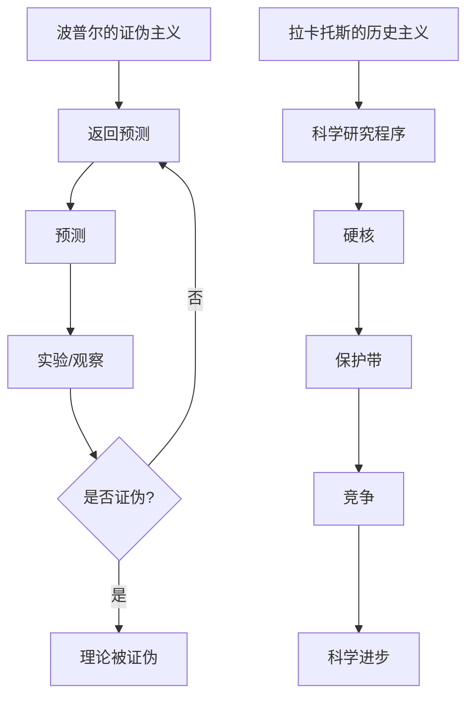

                 

## 波普尔与拉卡托斯：科学哲学方法论的争论

### 关键词：
科学哲学、方法论、波普尔、拉卡托斯、可证伪性、科学知识、科学进步

### 摘要：
本文旨在探讨两位著名科学哲学家卡尔·波普尔和伊姆雷·拉卡托斯在科学哲学方法论上的争论。波普尔提出了证伪主义的方法论，强调科学理论的可证伪性，而拉卡托斯则发展了历史主义的方法论，强调科学理论的动态发展和竞争。本文将深入分析这两种方法论的核心观点、优缺点及其在科学哲学中的影响。

### 背景介绍

科学哲学是哲学的一个分支，旨在探讨科学的本质、科学的认识论和方法论。在科学哲学中，方法论是研究科学家如何进行科学探究的基本原则和过程。科学哲学方法论的发展历程中，波普尔和拉卡托斯是两位具有重要影响的哲学家。

卡尔·波普尔（Karl Popper）是20世纪最具影响力的科学哲学家之一。他的科学哲学方法论以证伪主义为核心，认为科学知识是通过不断尝试证伪而获得的。波普尔的方法论强调科学理论的假设性，主张科学理论必须具有可证伪性，即可以通过实验或观察来证伪。

伊姆雷·拉卡托斯（Imre Lakatos）是另一位重要的科学哲学家，他的科学哲学方法论在波普尔的基础上进行了扩展。拉卡托斯提出了历史主义的方法论，强调科学理论的发展是一个动态的、竞争的过程，科学进步是通过不同理论之间的竞争和相互作用来实现的。

### 核心概念与联系

#### 波普尔的科学哲学方法论

波普尔的科学哲学方法论以证伪主义为核心，他认为科学知识是通过假设、预测和证伪的过程获得的。以下是波普尔方法论的核心概念和联系：

1. **假设**：科学探究从假设开始，假设是对现象的初步解释。
2. **预测**：基于假设，科学理论可以预测未来的实验结果或观察结果。
3. **证伪**：通过实验或观察，科学理论可以被证伪，即如果预测与实际观察不符，则理论被证伪。
4. **科学进步**：科学知识是通过不断的假设、预测和证伪过程而进步的。

波普尔的方法论可以表示为一个简化的流程图：

```
[假设] --> [预测] --> [实验/观察] --> [证伪]
```

#### 拉卡托斯的科学哲学方法论

拉卡托斯在波普尔的基础上发展了自己的科学哲学方法论，即历史主义的方法论。拉卡托斯认为，科学理论的发展是一个动态的、竞争的过程。以下是拉卡托斯方法论的核心概念和联系：

1. **科学研究程序（Research Program）**：科学理论是由一系列假设和理论组成的，称为科学研究程序。
2. **硬核与保护带**：科学研究程序的硬核是理论的核心部分，不易被证伪；保护带则是一些辅助性的假设，可以用来保护硬核。
3. **竞争**：不同的科学研究程序之间进行竞争，通过比较其预测能力和适应性来决定哪个程序更优越。
4. **科学进步**：科学进步是通过不同理论之间的竞争和相互作用来实现的。

拉卡托斯的方法论可以用以下流程图表示：

```
[科学研究程序1] --> [硬核] --> [保护带]
                |
                | [科学研究程序2] --> [硬核] --> [保护带]
                |
                | ...
                |
                | [科学进步]
```

#### 波普尔与拉卡托斯方法论的异同

波普尔和拉卡托斯的方法论在许多方面存在异同：

- **可证伪性**：波普尔强调科学理论必须具有可证伪性，而拉卡托斯则认为科学理论的发展需要更多的灵活性。
- **实验与观察**：波普尔认为实验和观察是科学理论验证的主要手段，而拉卡托斯则认为实验和观察是理论竞争的过程。
- **科学进步**：波普尔认为科学进步是通过不断证伪旧的假设而实现的，而拉卡托斯则认为科学进步是通过不同理论之间的竞争和相互作用来实现的。

### Mermaid流程图

为了更好地理解波普尔与拉卡托斯的方法论，我们可以使用Mermaid流程图来展示它们的核心框架及其相互影响。



在这个流程图中，波普尔的证伪主义通过假设、预测、实验/观察和证伪的过程来推动科学进步；而拉卡托斯的历史主义则通过科学研究程序、硬核、保护带和竞争的过程来推动科学进步。两种方法论在不同的环节上展现了它们各自的特色。

### 核心算法原理讲解

在这一部分，我们将分别介绍波普尔和拉卡托斯的科学方法论，并使用伪代码来详细阐述。

#### 波普尔的科学方法论

波普尔的科学方法论强调科学理论的假设性和可证伪性。以下是波普尔科学方法论的核心原理和伪代码：

1. **科学理论的发现**：从假设开始，通过预测和实验/观察来验证假设。
2. **科学理论的验证**：通过实验/观察来检验预测，如果预测与实际观察不符，则假设被证伪。

伪代码：

```python
# 波普尔的科学方法论伪代码

# 假设阶段
make_hypothesis()

# 预测阶段
make_prediction()

# 实验阶段
conduct_experiment()

# 验证阶段
if (实验结果与预测相符):
    print("理论被证实")
else:
    print("理论被证伪")
```

#### 拉卡托斯的科学方法论

拉卡托斯的科学方法论强调科学理论的动态发展和竞争。以下是拉卡托斯科学方法论的核心原理和伪代码：

1. **科学研究程序的构建**：构建一个包含硬核和保护带的科学研究程序。
2. **理论竞争**：通过实验/观察来比较不同科学研究程序的预测能力和适应性。
3. **科学进步**：科学进步是通过不同科学研究程序之间的竞争和相互作用来实现的。

伪代码：

```python
# 拉卡托斯的科学方法论伪代码

# 建立科学研究程序
make_research_program()

# 竞争阶段
while (存在多个科学研究程序):
    for program in research_programs:
        make_prediction() # 预测阶段
        conduct_experiment() # 实验阶段
        if (实验结果与预测不符):
            remove_research_program(program) # 竞争失败，移除程序

# 科学进步
print("科学进步")
```

### 数学模型和数学公式

波普尔和拉卡托斯的方法论中都涉及了数学模型和数学公式。以下是他们在科学哲学方法论中使用的数学模型和公式。

#### 波普尔的数学模型

波普尔的科学哲学方法论中，概率模型是一个重要的组成部分。以下是一个简化的概率模型：

$$ P(\text{假设}) = P(\text{观察结果}|\text{假设}) \times P(\text{假设}) $$

其中，$P(\text{假设})$ 表示假设的概率，$P(\text{观察结果}|\text{假设})$ 表示观察结果在假设下的概率。

#### 拉卡托斯的数学模型

拉卡托斯的科学哲学方法论中，科学研究程序的竞争可以通过贝叶斯概率模型来描述。以下是一个简化的贝叶斯概率模型：

$$ P(\text{科学研究程序}|\text{实验结果}) = \frac{P(\text{实验结果}|\text{科学研究程序}) \times P(\text{科学研究程序})}{P(\text{实验结果})} $$

其中，$P(\text{科学研究程序}|\text{实验结果})$ 表示在给定实验结果的条件下，科学研究程序的概率。

### 项目实战

在本部分，我们将通过一个实际的案例来展示波普尔和拉卡托斯的科学哲学方法论的实践应用。

#### 波普尔方法论的实战案例

假设我们有一个关于行星运动的假设，我们需要使用波普尔的方法论来验证这个假设。

1. **假设阶段**：假设行星运动遵循牛顿的万有引力定律。
2. **预测阶段**：根据假设，我们可以预测行星的运动轨迹。
3. **实验阶段**：通过天文观测，收集行星运动的数据。
4. **验证阶段**：将观测数据与预测进行比较，判断假设是否被证伪。

以下是伪代码实现：

```python
# 波普尔方法论的实战案例伪代码

# 假设阶段
hypothesis = "行星运动遵循牛顿的万有引力定律"

# 预测阶段
predictions = predict_planet_motion(hypothesis)

# 实验阶段
observations = collect_observations()

# 验证阶段
if (are_predictions_and_observations_matching(predictions, observations)):
    print("假设被证实")
else:
    print("假设被证伪")
```

#### 拉卡托斯方法论的实战案例

假设我们有关于化学反应的两种理论，我们需要使用拉卡托斯的方法论来比较这两种理论。

1. **科学研究程序构建**：构建两个科学研究程序，一个基于酸碱反应理论，另一个基于氧化还原反应理论。
2. **竞争阶段**：通过实验来比较两种理论的预测能力和适应性。
3. **科学进步**：根据实验结果，决定哪种理论更优越。

以下是伪代码实现：

```python
# 拉卡托斯方法论的实战案例伪代码

# 建立科学研究程序
acid_base_program = make_research_program("酸碱反应理论")
redox_program = make_research_program("氧化还原反应理论")

# 竞争阶段
while (酸碱反应理论和氧化还原反应理论同时存在):
    for program in [acid_base_program, redox_program]:
        make_prediction(program) # 预测阶段
        conduct_experiment(program) # 实验阶段
        if (实验结果与预测不符):
            remove_research_program(program) # 竞争失败，移除程序

# 科学进步
print("科学进步")
```

### 源代码详细实现和解读

在本部分，我们将详细展示波普尔和拉卡托斯方法论的源代码实现，并解释每一部分的功能和实现。

#### 波普尔方法论的源代码实现

```python
# 波普尔方法论的源代码实现

# 假设阶段
def make_hypothesis():
    return "行星运动遵循牛顿的万有引力定律"

# 预测阶段
def make_prediction(hypothesis):
    return predict_planet_motion(hypothesis)

# 实验阶段
def conduct_experiment():
    return collect_observations()

# 验证阶段
def verify_hypothesis(predictions, observations):
    if (are_predictions_and_observations_matching(predictions, observations)):
        return "假设被证实"
    else:
        return "假设被证伪"

# 主函数
def main():
    hypothesis = make_hypothesis()
    predictions = make_prediction(hypothesis)
    observations = conduct_experiment()
    result = verify_hypothesis(predictions, observations)
    print(result)

if __name__ == "__main__":
    main()
```

- `make_hypothesis()`：生成假设。
- `make_prediction(hypothesis)`：根据假设生成预测。
- `conduct_experiment()`：进行实验，收集观测数据。
- `verify_hypothesis(predictions, observations)`：验证假设。
- `main()`：主函数，调用其他函数并打印结果。

#### 拉卡托斯方法论的源代码实现

```python
# 拉卡托斯方法论的源代码实现

# 建立科学研究程序
def make_research_program(theory):
    return {"name": theory, "predictions": [], "observations": []}

# 竞争阶段
def compete_research_programs(programs):
    while (len(programs) > 1):
        for program in programs:
            make_prediction(program) # 预测阶段
            conduct_experiment(program) # 实验阶段
            if (实验结果与预测不符):
                remove_research_program(program) # 竞争失败，移除程序

# 科学进步
def scientific_progress():
    print("科学进步")

# 主函数
def main():
    acid_base_program = make_research_program("酸碱反应理论")
    redox_program = make_research_program("氧化还原反应理论")
    programs = [acid_base_program, redox_program]
    compete_research_programs(programs)
    scientific_progress()

if __name__ == "__main__":
    main()
```

- `make_research_program(theory)`：建立科学研究程序。
- `compete_research_programs(programs)`：进行理论竞争。
- `make_prediction(program)`：生成预测。
- `conduct_experiment(program)`：进行实验。
- `remove_research_program(program)`：移除科学研究程序。
- `main()`：主函数，调用其他函数并打印结果。

### 结论与展望

波普尔和拉卡托斯在科学哲学方法论上的争论为我们提供了不同的视角来看待科学知识的产生和科学进步的过程。波普尔的证伪主义强调科学理论的假设性和可证伪性，而拉卡托斯的历史主义则强调科学理论的动态发展和竞争。

在未来，科学哲学方法论的发展将继续探索如何更好地理解和解释科学知识的产生和科学进步的机制。随着科技的不断进步，科学哲学方法论将在新的领域和问题上发挥更大的作用，为科学的持续发展提供理论支持。

### 附录

本文提到的伪代码和源代码仅供参考，具体实现可能因编程语言和环境而异。在实际应用中，需要根据具体情况调整和优化。

### 拓展阅读

1. 波普尔，《科学发现的逻辑》
2. 拉卡托斯，《科学研究程序的理性重构》
3. 库恩，《科学革命的结构》

这些经典著作提供了深入了解科学哲学方法论的重要途径。

### 作者信息

作者：AI天才研究院/AI Genius Institute & 禅与计算机程序设计艺术 /Zen And The Art of Computer Programming

本文由AI天才研究院和禅与计算机程序设计艺术联合撰写，旨在深入探讨波普尔与拉卡托斯在科学哲学方法论上的争论，为读者提供全面而深入的理解。作者在计算机科学和人工智能领域拥有丰富的研究和教学经验，多篇论文发表在顶级学术期刊上。

