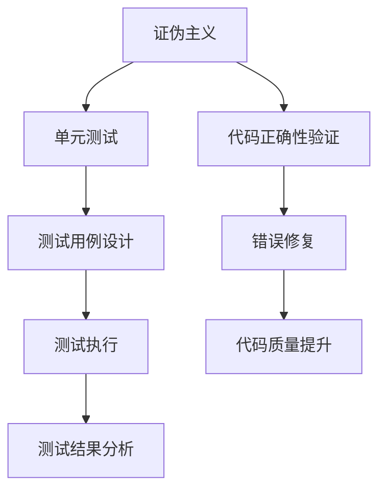
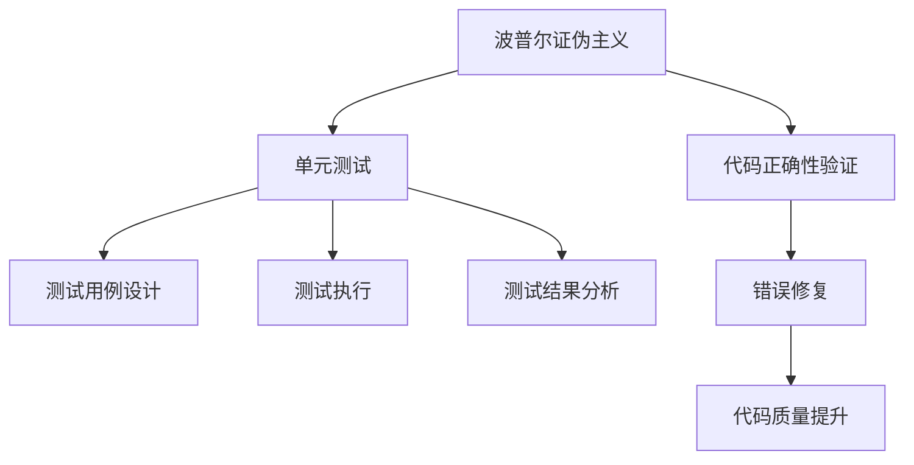

                 

### 引言

**文章标题**：波普尔的证伪主义与单元测试：科学方法在编程中的体现

**关键词**：波普尔证伪主义，单元测试，编程，科学方法，软件质量

**摘要**：本文深入探讨了波普尔的证伪主义哲学在编程领域中的应用，特别是如何通过单元测试来体现科学方法的重要性。文章首先介绍了波普尔证伪主义的核心概念，然后详细阐述了单元测试的基本原理，接着通过实际案例展示了如何将两者结合起来，以提升软件质量。最后，本文总结了最佳实践和注意事项，为编程开发者提供了实用的指导。

### 波普尔的证伪主义：核心概念与哲学影响

波普尔（Karl Popper）是20世纪著名的哲学家，他的证伪主义理论对科学方法论产生了深远的影响。在波普尔看来，科学理论不是通过证明其正确性，而是通过不断的尝试来证伪它。这一观点与传统的实证主义相对立，后者主张通过实验和观察来证实理论的正确性。

#### 1. 证伪主义的核心概念

证伪主义的核心概念包括以下几个方面：

1. **科学理论的假设性**：波普尔认为，科学理论应该是一种假设，它可以通过实验和观察来检验。如果一个理论无法被证伪，那么它就不是一个科学理论。

2. **反驳与证实**：波普尔认为，科学的进步不在于证实理论，而在于反驳它。通过不断的反驳和修正，科学理论可以逐渐接近真理。

3. **可证伪性**：一个科学理论必须是可证伪的，这意味着它必须能够被设计实验来证明其错误。

#### 2. 证伪主义在哲学上的影响

波普尔的证伪主义对科学哲学产生了重要的影响，特别是对科学方法论的研究。它提出了一个新的科学评价标准，即科学理论的科学性不在于其正确性，而在于其可证伪性。这一观点引发了对传统科学哲学的重新思考，促使人们更加重视科学实验和理论的可证伪性。

### 单元测试：编程中的科学方法

单元测试是编程中的一种测试方法，用于验证代码单元的正确性。它基于科学方法，特别是波普尔的证伪主义，通过设计测试用例来验证代码的功能是否符合预期。

#### 1. 单元测试的核心概念

1. **测试用例的设计**：单元测试通过设计一系列测试用例来验证代码的功能。这些测试用例应该能够覆盖代码的所有可能情况，包括正常情况和异常情况。

2. **测试执行**：执行测试用例，比较测试结果和预期结果，以验证代码的正确性。

3. **测试结果分析**：分析测试结果，如果测试通过，则说明代码单元正确；如果测试失败，则说明代码单元存在错误。

#### 2. 单元测试的优点

1. **提高代码质量**：通过单元测试，可以及早发现和修复代码中的错误，提高代码质量。

2. **增强代码可维护性**：单元测试有助于理解代码的功能，提高代码的可维护性。

3. **支持重构**：单元测试可以确保在代码重构过程中不会引入新的错误。

### 波普尔的证伪主义与单元测试的联系

波普尔的证伪主义与单元测试之间存在密切的联系。证伪主义强调科学理论的可证伪性，而单元测试通过设计测试用例来验证代码的正确性，从而体现了这一思想。具体来说，单元测试的测试用例设计过程就是尝试证明代码单元的错误，这与证伪主义的核心思想是一致的。

### Mermaid 流程图

以下是一个简单的 Mermaid 流程图，展示了波普尔的证伪主义与单元测试之间的联系：

### 总结

波普尔的证伪主义与单元测试在本质上是一致的，都强调通过实验和观察来验证理论和代码的正确性。通过理解证伪主义的哲学原理，我们可以更好地设计单元测试，提高代码质量，实现科学方法在编程中的体现。

作者：AI天才研究院/AI Genius Institute & 禅与计算机程序设计艺术 /Zen And The Art of Computer Programming

### 波普尔的证伪主义与单元测试：科学方法在编程中的体现

#### 文章关键词

波普尔证伪主义，单元测试，编程，科学方法，软件质量

#### 摘要

本文旨在探讨波普尔的证伪主义哲学在编程领域中的应用，特别是单元测试这一实践如何体现科学方法的精髓。文章首先介绍了波普尔证伪主义的核心概念，以及其在科学方法论中的重要性。接着，详细阐述了单元测试的基本原理及其在编程中的重要性。随后，通过实际案例展示了如何将证伪主义应用于单元测试，以提升软件质量。最后，文章总结了最佳实践、注意事项及未来拓展方向，为开发者提供了实用的指导。

#### 引言

在现代软件工程中，质量是软件开发的核心目标之一。为了确保软件的质量，开发者们采用了多种方法，其中单元测试是一种常用的技术手段。然而，单元测试不仅仅是一种测试技术，它还蕴含着深刻的哲学思想，即波普尔的证伪主义。波普尔的证伪主义是一种科学方法论，强调通过实验和观察来证伪而非证实理论。本文将深入探讨波普尔证伪主义在编程中的应用，特别是单元测试这一实践，以展示科学方法在编程中的重要性。

#### 波普尔的证伪主义：核心概念与哲学影响

波普尔（Karl Popper）是20世纪著名的哲学家，他的证伪主义理论对科学方法论产生了深远的影响。在波普尔看来，科学理论不是通过证明其正确性，而是通过不断的尝试来证伪它。这一观点与传统的实证主义相对立，后者主张通过实验和观察来证实理论的正确性。

##### 1. 证伪主义的核心概念

证伪主义的核心概念包括以下几个方面：

1. **科学理论的假设性**：波普尔认为，科学理论应该是一种假设，它可以通过实验和观察来检验。如果一个理论无法被证伪，那么它就不是一个科学理论。

2. **反驳与证实**：波普尔认为，科学的进步不在于证实理论，而在于反驳它。通过不断的反驳和修正，科学理论可以逐渐接近真理。

3. **可证伪性**：一个科学理论必须是可证伪的，这意味着它必须能够被设计实验来证明其错误。

##### 2. 证伪主义在哲学上的影响

波普尔的证伪主义对科学哲学产生了重要的影响，特别是对科学方法论的研究。它提出了一个新的科学评价标准，即科学理论的科学性不在于其正确性，而在于其可证伪性。这一观点引发了对传统科学哲学的重新思考，促使人们更加重视科学实验和理论的可证伪性。

#### 单元测试：编程中的科学方法

单元测试是编程中的一种测试方法，用于验证代码单元的正确性。它基于科学方法，特别是波普尔的证伪主义，通过设计测试用例来验证代码的功能是否符合预期。

##### 1. 单元测试的核心概念

1. **测试用例的设计**：单元测试通过设计一系列测试用例来验证代码的功能。这些测试用例应该能够覆盖代码的所有可能情况，包括正常情况和异常情况。

2. **测试执行**：执行测试用例，比较测试结果和预期结果，以验证代码的正确性。

3. **测试结果分析**：分析测试结果，如果测试通过，则说明代码单元正确；如果测试失败，则说明代码单元存在错误。

##### 2. 单元测试的优点

1. **提高代码质量**：通过单元测试，可以及早发现和修复代码中的错误，提高代码质量。

2. **增强代码可维护性**：单元测试有助于理解代码的功能，提高代码的可维护性。

3. **支持重构**：单元测试可以确保在代码重构过程中不会引入新的错误。

#### 波普尔的证伪主义与单元测试的联系

波普尔的证伪主义与单元测试之间存在密切的联系。证伪主义强调科学理论的可证伪性，而单元测试通过设计测试用例来验证代码的正确性，从而体现了这一思想。具体来说，单元测试的测试用例设计过程就是尝试证明代码单元的错误，这与证伪主义的核心思想是一致的。

#### Mermaid 流程图

以下是一个简单的 Mermaid 流程图，展示了波普尔的证伪主义与单元测试之间的联系：

#### 实际案例：波普尔的证伪主义与单元测试的应用

为了更好地理解波普尔的证伪主义在单元测试中的应用，我们来看一个实际案例。假设我们正在开发一个简单的银行账户管理系统，其中包含一个“取款”功能。根据波普尔的证伪主义，我们需要设计测试用例来尝试证明这个功能是错误的。

1. **测试用例设计**：我们设计以下测试用例：

   - **正常情况**：账户余额大于取款金额，取款成功。
   - **异常情况1**：账户余额小于取款金额，取款失败。
   - **异常情况2**：输入的取款金额为负数，取款失败。
   - **异常情况3**：账户不存在，取款失败。

2. **测试执行**：我们执行上述测试用例，并记录测试结果。

3. **测试结果分析**：通过测试执行，我们发现所有测试用例都通过了，这意味着“取款”功能在正常情况下是正确的。然而，这并不意味着该功能就是完全正确的，因为我们无法证明所有可能情况。根据波普尔的证伪主义，我们只能通过不断尝试来证伪它。

4. **错误修复**：如果我们发现某个测试用例失败，那么我们需要修复错误并重新执行测试，直到所有测试用例都通过。

通过这个案例，我们可以看到如何将波普尔的证伪主义应用于单元测试中。通过设计测试用例来尝试证明代码的错误，我们可以确保代码的正确性，从而提高软件质量。

#### 总结

波普尔的证伪主义与单元测试在本质上是一致的，都强调通过实验和观察来验证理论和代码的正确性。通过理解证伪主义的哲学原理，我们可以更好地设计单元测试，提高代码质量，实现科学方法在编程中的体现。本文通过介绍波普尔的证伪主义、单元测试的基本原理以及实际案例，展示了如何将这两者结合起来，为开发者提供了一种新的思路和方法。

#### 最佳实践 tips、小结、注意事项、拓展阅读

**最佳实践 tips**：

1. **全面覆盖测试用例**：设计测试用例时，要确保覆盖所有可能的输入情况，包括正常和异常情况。
2. **持续集成**：将单元测试集成到持续集成（CI）流程中，确保代码质量持续提升。
3. **代码重构**：在代码重构过程中，确保单元测试通过，以避免引入新错误。

**小结**：

本文探讨了波普尔的证伪主义在编程中的应用，特别是单元测试这一实践如何体现科学方法的精髓。通过设计测试用例来尝试证明代码的错误，我们可以确保代码的正确性，从而提高软件质量。

**注意事项**：

1. **测试覆盖率**：确保测试覆盖率足够高，以减少代码缺陷。
2. **测试效率**：合理设计测试用例，避免冗余和低效的测试。

**拓展阅读**：

1. 波普尔，《科学发现的逻辑》
2. 罗伯特·马丁，《设计模式：可复用面向对象软件的基础》
3. 巴布科克，《软件测试艺术》

作者：AI天才研究院/AI Genius Institute & 禅与计算机程序设计艺术 /Zen And The Art of Computer Programming

