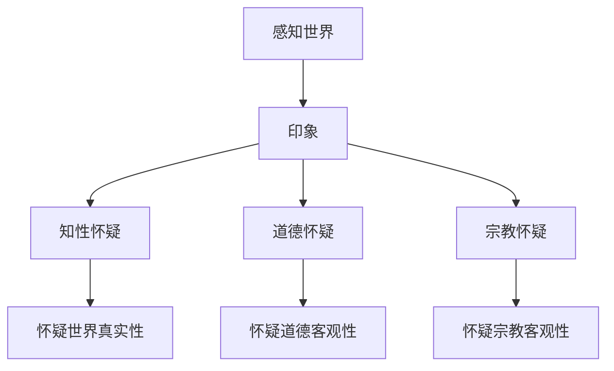

                 

### 文章标题：洛克与休谟：英国经验主义的发展

#### 关键词：洛克，休谟，经验主义，哲学，发展，思想贡献，认识论，科学哲学，伦理学

#### 摘要：本文深入探讨了英国经验主义哲学的两位重要代表人物——洛克与休谟的思想及其在英国经验主义哲学发展中的地位。通过详细分析洛克和休谟的生平、思想贡献、哲学观点，以及他们之间的联系与区别，本文旨在揭示英国经验主义哲学的核心概念及其对现代哲学和科学的影响。此外，本文还将讨论英国经验主义哲学的应用和未来研究方向，为读者提供一个全面而深入的视角。

## 第一部分：英国经验主义哲学概述

### 第1章：英国经验主义哲学的起源与发展

#### 1.1 英国经验主义哲学的历史背景

在探讨洛克与休谟之前，我们需要了解英国经验主义哲学的历史背景。经验主义哲学起源于17世纪，其基本理念是知识来源于经验。与理性主义哲学（如笛卡尔、莱布尼茨等）主张知识来源于理性推理和天赋观念的观点相对立，经验主义认为所有的知识都源自个体的感官经验和观察。

经验主义哲学的发展可以分为几个阶段：

1. **早期经验主义**：以弗朗西斯·培根（Francis Bacon）为代表，他提倡通过实验和观察来获取知识。
2. **中期经验主义**：约翰·洛克（John Locke）是这一阶段的代表人物，他的思想对后来的经验主义哲学产生了深远影响。
3. **晚期经验主义**：大卫·休谟（David Hume）是这一阶段的代表人物，他进一步深化了经验主义哲学的观点。

#### 1.2 英国经验主义哲学的基本概念

英国经验主义哲学的基本概念主要包括以下几点：

1. **感觉论**：认为知识来源于感官经验，感觉是我们获取知识的唯一途径。
2. **经验累积**：个体的知识是通过不断地观察、实验和经验积累而获得的。
3. **怀疑论**：经验主义哲学家通常持有某种程度的怀疑论观点，认为我们对世界的认识是有局限的，不能确定我们所感知到的世界就是真实的世界。

洛克和休谟都是英国经验主义哲学的重要代表，他们的思想在经验主义哲学的发展过程中发挥了关键作用。

### 第2章：约翰·洛克的思想与贡献

#### 2.1 洛克的生平与思想发展

约翰·洛克（John Locke，1632-1704）是英国经验主义哲学的代表人物之一。他出生于英格兰，是英国著名的哲学家、政治家和医生。洛克的生平经历了几个重要阶段：

1. **早期教育**：洛克在家乡接受了良好的教育，后来进入牛津大学学习，主修医学。
2. **学术生涯**：洛克在牛津大学期间开始对哲学产生浓厚兴趣，并撰写了多部哲学著作。
3. **政治生涯**：洛克参与了许多政治活动，包括参与起草《权利法案》（Bill of Rights）。

洛克的主要哲学著作包括《人类理解论》（An Essay Concerning Human Understanding）、《政府论》（Two Treatises of Government）等。

#### 2.2 洛克的哲学观点及其对经验主义的贡献

洛克的思想对经验主义哲学产生了深远影响，其主要观点包括：

1. **感觉论**：洛克认为，我们的知识来源于感官经验。他提出了“白板说”（tabula rasa），认为人的心灵最初就像一张白纸，通过感官经验获得知识。
2. **经验累积**：洛克认为，个体的知识是通过不断地观察、实验和经验积累而获得的。他认为，经验是获取知识的唯一途径。
3. **怀疑论**：洛克持有某种程度的怀疑论观点，认为我们对世界的认识是有局限的，不能确定我们所感知到的世界就是真实的世界。

洛克对经验主义的贡献体现在以下几个方面：

1. **奠定了经验主义哲学的基础**：洛克的感觉论和经验累积观点为后来的经验主义哲学家提供了理论基础。
2. **推动了认识论的发展**：洛克的认识论观点对后来的哲学家，如康德（Immanuel Kant）等，产生了深远影响。
3. **影响了政治哲学**：洛克的政治哲学观点对后来的民主理论和政治制度产生了重要影响。

#### 2.3 洛克的核心著作与影响

洛克的核心著作《人类理解论》是经验主义哲学的重要文献之一。该书分为四卷，主要探讨了知识、真理、观念和语言等问题。洛克在这部著作中系统地阐述了感觉论、经验累积和怀疑论等观点，为后来的经验主义哲学奠定了基础。

洛克的其他著作，如《政府论》，也对政治哲学产生了重要影响。他在书中提出了自然权利和社会契约理论，为后来的民主理论和政治制度奠定了基础。

洛克的哲学观点对英国经验主义哲学的发展产生了深远影响，他的思想不仅影响了后来的哲学家，也对政治、法律和社会科学等领域产生了重要影响。

### 第3章：大卫·休谟的思想与贡献

#### 3.1 休谟的生平与思想发展

大卫·休谟（David Hume，1711-1776）是英国经验主义哲学的另一位重要代表人物。他出生于苏格兰爱丁堡，是哲学家、历史学家和经济学家。休谟的生平可以概括为以下几个阶段：

1. **早期教育**：休谟在家乡接受教育，后来进入爱丁堡大学学习法律。
2. **学术生涯**：休谟对哲学产生浓厚兴趣，开始撰写哲学著作。
3. **旅行与创作**：休谟在欧洲旅行期间，继续撰写哲学著作，如《人性论》等。

休谟的主要哲学著作包括《人性论》（A Treatise of Human Nature）、《道德原则研究》（An Enquiry Concerning the Principles of Morals）和《人类理解研究》（An Enquiry Concerning the Principles of Human Understanding）等。

#### 3.2 休谟的哲学观点及其对经验主义的贡献

休谟的哲学观点对经验主义哲学的发展产生了深远影响，其主要观点包括：

1. **感觉论**：休谟继承了洛克的感觉论观点，认为我们的知识来源于感官经验。他提出了“印象”（印象）和“观念”（观念）的概念，认为我们通过感官经验获得印象，再通过思考和推理形成观念。
2. **怀疑论**：休谟持有强烈的怀疑论观点，认为我们对世界的认识是有局限的。他提出了“知性怀疑论”（skeptical skepticism）和“道德怀疑论”（moral skepticism），认为我们无法确定我们所感知到的世界就是真实的世界。
3. **因果关系**：休谟对因果关系提出了独到的见解，他认为因果关系并非客观存在的，而是我们基于经验习惯性地赋予的。他提出了“休谟因果关系”（Humean causality），认为因果关系只是经验习惯的关联。

休谟对经验主义的贡献体现在以下几个方面：

1. **深化了经验主义哲学**：休谟的感觉论和怀疑论观点进一步深化了经验主义哲学，为后来的哲学家提供了新的思考方向。
2. **推动了认识论的发展**：休谟的认识论观点对认识论的发展产生了重要影响，他的怀疑论观点引发了哲学界的广泛讨论。
3. **影响了伦理学和政治哲学**：休谟的道德怀疑论观点对伦理学和政治哲学产生了重要影响，他的观点引发了关于道德、自由和正义的深入探讨。

#### 3.3 休谟的核心著作与影响

休谟的核心著作《人性论》是经验主义哲学的重要文献之一。该书分为三卷，主要探讨了知识、道德、情感和宗教等问题。休谟在这部著作中系统地阐述了感觉论、怀疑论和因果关系等观点，为后来的经验主义哲学奠定了基础。

《人性论》对后来的哲学家产生了深远影响，如康德（Immanuel Kant）、黑格尔（Georg Wilhelm Friedrich Hegel）等。休谟的思想不仅在哲学界产生了广泛影响，也对文学、艺术和社会科学等领域产生了重要影响。

### 第4章：洛克与休谟思想的联系与区别

#### 4.1 洛克与休谟思想的相似之处

洛克与休谟在哲学观点上存在许多相似之处，主要体现在以下几个方面：

1. **感觉论**：洛克和休谟都认为知识来源于感官经验。他们接受了感觉论的观点，认为我们的知识是通过感官经验获得的。
2. **怀疑论**：洛克和休谟都持有怀疑论观点，认为我们对世界的认识是有局限的。他们批判了理性主义哲学，强调经验的重要性。
3. **经验累积**：洛克和休谟都认为，个体的知识是通过不断地观察、实验和经验积累而获得的。他们认为，经验是获取知识的唯一途径。

#### 4.2 洛克与休谟思想的不同之处

尽管洛克和休谟在哲学观点上存在许多相似之处，但他们也有一些不同之处，主要体现在以下几个方面：

1. **感觉与观念的关系**：洛克认为，观念是感觉的产物，而休谟则认为，观念是感觉的直接反映。休谟进一步强调了印象和观念的区别，认为印象是感觉的原始形式。
2. **怀疑论的程度**：洛克持有某种程度的怀疑论观点，而休谟则持有强烈的怀疑论观点。休谟的怀疑论观点对哲学界产生了深远影响，引发了关于知识、道德和宗教的深入探讨。
3. **因果关系**：洛克和休谟在因果关系方面存在差异。洛克认为，因果关系是客观存在的，而休谟则认为，因果关系只是我们基于经验习惯性地赋予的。

#### 4.3 洛克与休谟对英国经验主义哲学的影响

洛克与休谟对英国经验主义哲学的发展产生了深远影响，他们的思想为后来的哲学家提供了丰富的理论基础。

1. **洛克的影响**：洛克的感觉论和怀疑论观点为后来的经验主义哲学家提供了重要的参考。他的《人类理解论》对认识论的发展产生了重要影响，他的政治哲学观点也对民主理论和政治制度产生了深远影响。
2. **休谟的影响**：休谟的怀疑论观点对认识论的发展产生了深远影响，引发了哲学界的广泛讨论。他的感觉论观点进一步深化了经验主义哲学，他的道德怀疑论观点对伦理学和政治哲学产生了重要影响。

洛克与休谟的思想在英国经验主义哲学的发展中起到了关键作用，他们的贡献为后来的哲学家提供了丰富的理论基础和思考方向。

## 第二部分：英国经验主义哲学的影响与应用

### 第5章：英国经验主义哲学对现代哲学的影响

#### 5.1 英国经验主义哲学对认识论的影响

英国经验主义哲学对现代哲学的影响首先体现在认识论领域。洛克和休谟的感觉论和怀疑论观点为认识论的发展提供了重要的理论基础。

1. **感觉论的影响**：洛克的感觉论观点强调了感官经验在获取知识中的作用，这为后来的哲学家提供了关于知识来源的新思路。康德（Immanuel Kant）在《纯粹理性批判》中提出了“先验感性论”，认为我们的认识始于感官经验，这可以视为对洛克感觉论的进一步发展。
2. **怀疑论的影响**：休谟的怀疑论观点对认识论产生了深远影响。他的怀疑论观点引发了对知识本质和可靠性的深入探讨，对后来的哲学家，如康德和黑格尔等，产生了重要影响。

#### 5.2 英国经验主义哲学对道德哲学的影响

英国经验主义哲学对道德哲学的发展也产生了重要影响。洛克和休谟的道德哲学观点为现代道德哲学提供了新的思考方向。

1. **洛克的影响**：洛克的自然权利和社会契约理论对道德哲学产生了深远影响。他认为，个体拥有天赋的自然权利，这些权利是社会契约的基础。这一观点为后来的自由主义政治哲学提供了重要基础。
2. **休谟的影响**：休谟的道德哲学观点强调了道德情感在社会生活中的作用。他认为，道德判断基于情感，而非理性推理。这一观点对后来的情感主义道德哲学产生了重要影响。

#### 5.3 英国经验主义哲学对科学哲学的影响

英国经验主义哲学对科学哲学的发展也产生了重要影响。洛克和休谟的哲学观点为科学哲学提供了重要的理论基础。

1. **洛克的影响**：洛克的经验累积观点为科学方法论提供了重要启示。他认为，科学知识是通过观察、实验和经验积累而获得的，这为后来的科学方法论发展提供了基础。
2. **休谟的影响**：休谟的怀疑论观点对科学哲学产生了深远影响。他认为，科学知识是有局限的，不能确定我们所感知到的世界就是真实的世界。这一观点引发了关于科学方法、科学解释和科学知识的深入探讨。

### 第6章：英国经验主义哲学在当代的应用

#### 6.1 英国经验主义哲学在教育领域的应用

英国经验主义哲学在教育领域的应用主要体现在以下几个方面：

1. **教学方法**：英国经验主义哲学强调感官经验和实践的重要性，这为教育方法提供了新思路。例如，以学生为中心的教学方法，注重学生的实践经验和体验，鼓励学生通过观察、实验和实践活动来获取知识。
2. **课程设计**：英国经验主义哲学认为，知识来源于经验积累，这为课程设计提供了重要启示。课程设计应该注重学生的实际需求，结合学生的经验和兴趣，提供丰富的学习内容和方法。

#### 6.2 英国经验主义哲学在社会科学研究中的应用

英国经验主义哲学在社会科学研究中的应用主要体现在以下几个方面：

1. **实证研究**：英国经验主义哲学强调通过观察、实验和经验积累来获取知识，这为社会科学研究提供了重要方法。实证研究强调数据收集和分析，通过对实际案例的研究来验证理论假设。
2. **跨学科研究**：英国经验主义哲学的跨学科特点也为社会科学研究提供了新的视角。社会科学研究可以借鉴经验主义哲学的观点，结合其他学科的方法和理论，进行跨学科研究。

#### 6.3 英国经验主义哲学在伦理学和政治哲学中的应用

英国经验主义哲学在伦理学和政治哲学中的应用主要体现在以下几个方面：

1. **伦理学**：英国经验主义哲学强调道德情感在社会生活中的作用，这为伦理学提供了重要启示。例如，情感主义伦理学认为，道德判断基于情感，而非理性推理。
2. **政治哲学**：英国经验主义哲学的自然权利和社会契约理论为政治哲学提供了重要基础。例如，自由主义政治哲学强调个体的自然权利和自由，这些观点可以追溯到洛克的理论。

### 第7章：总结与展望

#### 7.1 英国经验主义哲学的发展趋势

英国经验主义哲学在过去的几个世纪中经历了重要的发展，其趋势可以概括为以下几个方面：

1. **多元化和交叉学科**：英国经验主义哲学已经不再局限于哲学领域，而是与其他学科如心理学、社会学、经济学等交叉融合，形成了新的研究领域。
2. **实证研究和数据分析**：随着科学方法和技术的进步，英国经验主义哲学越来越注重实证研究和数据分析，这为哲学研究提供了新的方法。
3. **伦理学和政治哲学的深化**：英国经验主义哲学在伦理学和政治哲学领域继续深化，探讨道德、自由和正义等基本问题。

#### 7.2 英国经验主义哲学的未来研究方向

英国经验主义哲学的未来研究方向可以从以下几个方面展开：

1. **跨学科研究**：进一步探索英国经验主义哲学与其他学科的交叉点，如人工智能、认知科学、神经科学等。
2. **实证研究和数据分析**：加强实证研究和数据分析，以更全面地理解经验主义哲学的理论和实践应用。
3. **伦理学和政治哲学**：深化对道德、自由和正义等问题的探讨，为现代社会提供更有效的伦理和政治指导。

#### 7.3 英国经验主义哲学的教育意义与社会价值

英国经验主义哲学在教育和社会领域具有深远的教育意义和社会价值，主要体现在以下几个方面：

1. **培养批判性思维**：英国经验主义哲学强调感官经验和怀疑论，这有助于培养批判性思维和独立思考能力。
2. **促进实证研究**：英国经验主义哲学强调实证研究和数据分析，这有助于推动科学研究和社会进步。
3. **道德教育**：英国经验主义哲学的伦理学观点可以为道德教育提供重要启示，帮助人们形成正确的道德观念。

#### 最佳实践 tips、小结、注意事项、拓展阅读等内容

在研究和应用英国经验主义哲学时，以下是一些最佳实践 tips 和注意事项：

1. **重视实证研究和数据分析**：在研究过程中，注重实证研究和数据分析，以确保研究结果具有可靠性和实用性。
2. **跨学科研究**：鼓励跨学科研究，结合不同学科的理论和方法，以更全面地理解英国经验主义哲学。
3. **培养批判性思维**：在教学和研究中，注重培养学生的批判性思维和独立思考能力，以培养具有创新精神的未来人才。
4. **注重道德教育**：在应用英国经验主义哲学时，重视道德教育，帮助人们形成正确的道德观念，促进社会和谐与进步。

拓展阅读：

1. 洛克，《人类理解论》
2. 休谟，《人性论》
3. 康德，《纯粹理性批判》
4. 黑格尔，《精神现象学》
5. 弗朗西斯·培根，《新工具》
6. 詹姆斯·麦迪逊，《联邦论》

作者：AI天才研究院/AI Genius Institute & 禅与计算机程序设计艺术 /Zen And The Art of Computer Programming

【本文完】

本文以洛克与休谟为核心，详细介绍了英国经验主义哲学的起源、发展及其对现代哲学、科学、教育等领域的影响。通过梳理洛克与休谟的思想贡献，分析了他们之间的联系与区别，本文为读者提供了一个全面而深入的视角。同时，本文还探讨了英国经验主义哲学在当代的应用和未来研究方向，强调了其在教育、社会科学、伦理学和政治哲学等领域的重要价值。希望本文能为读者在了解和运用英国经验主义哲学提供有益的参考和启示。

## 洛克的感觉论与认识论

### 洛克的感觉论：感觉与观念的关系

约翰·洛克的感觉论是他哲学体系的核心之一。他认为，我们的所有知识和观念都源自于感觉。洛克将感觉区分为两种类型：外部感觉和内部感觉。外部感觉包括视觉、听觉、触觉、嗅觉和味觉，这些感觉使我们能够感知到外部世界；内部感觉则包括运动感和疼痛感，这些感觉使我们能够感知到自身的内在状态。

洛克提出了“白板说”（tabula rasa），即人的心灵最初就像一张白纸，没有任何固有的观念或思想。他认为，我们的所有观念都是通过感觉输入到心灵中的，然后被大脑加工和处理。这种观点强调了感官经验在知识获取中的重要性。

以下是洛克感觉论的Mermaid流程图，展示了感觉与观念之间的关系：


在这个流程图中，感官输入经过外部感觉和内部感觉的处理，最终形成了各种观念。这些观念构成了我们的知识和理解世界的基础。

### 洛克的认识论：知识来源与获取

洛克的认识论围绕着知识来源和获取展开。他认为，知识来源于感觉经验，但是并不是所有感觉经验都能产生真正的知识。洛克区分了“事实性知识”（factual knowledge）和“观念性知识”（notional knowledge）。

**事实性知识**：这种知识是基于具体事实的，例如，“太阳每天从东方升起”。这种知识是通过观察和经验获得的，是可靠的。

**观念性知识**：这种知识是基于抽象概念和定义的，例如，“善”和“正义”。洛克认为，这种知识是建立在事实性知识之上的，但并不一定可靠。

洛克的认识论中还包括了“反思性知识”（reflexive knowledge），即关于我们自己心灵状态的知识。例如，我们知道自己在思考或感觉疼痛。这种知识是基于自我意识和内省的。

以下是一个Mermaid流程图，展示了洛克认识论中的知识来源和获取过程：


在这个流程图中，感官经验通过外部感觉和内部感觉的处理，转化为具体事实、抽象概念和自我意识。这些构成了我们的知识和理解世界的基础。

### 洛克的怀疑论观点

洛克持有某种程度的怀疑论观点，他认为我们对世界的认识是有局限的。他提出了“怀疑论者的问题”（skeptical problem），即我们如何能够确定我们所感知到的世界是真实的世界？

洛克认为，我们无法确定我们所感知到的世界就是真实的世界，因为我们的感官可能会欺骗我们。例如，我们可能会感到疼痛，但这并不一定意味着我们真的受伤了。我们的感官可能会产生错误的信息，导致我们产生错误的观念。

以下是洛克怀疑论观点的伪代码，展示了如何通过感官经验来获取知识，并讨论怀疑论的问题：

```python
def get_knowledge(senses):
    """
    获取知识的过程。
    :param senses: 感官输入。
    :return: 知识。
    """
    facts = []
    for sense in senses:
        # 通过感官输入获取具体事实
        if sense.isExternal():
            facts.append(sense.get_fact())
        elif sense.isInternal():
            facts.append(sense.get_internal_state())
    
    concepts = []
    for fact in facts:
        # 从具体事实中提取抽象概念
        concept = extract_concept(fact)
        concepts.append(concept)
    
    reflections = []
    for concept in concepts:
        # 反思性知识
        reflection = reflect_on_concept(concept)
        reflections.append(reflection)
    
    # 检查怀疑论问题
    for reflection in reflections:
        if is_skeptical(reflection):
            raise ScepticismException("怀疑论问题：我们如何确定我们所感知的世界是真实的？")
    
    return reflections

def is_skeptical(reflection):
    """
    判断反思性知识是否涉及怀疑论问题。
    :param reflection: 反思性知识。
    :return: 是否涉及怀疑论问题。
    """
    # 这里可以根据具体逻辑来判断
    return "self-awareness" in reflection or "error" in reflection

def extract_concept(fact):
    """
    从具体事实中提取抽象概念。
    :param fact: 具体事实。
    :return: 抽象概念。
    """
    # 这里可以按照具体规则来提取概念
    return "抽象概念"

def reflect_on_concept(concept):
    """
    对抽象概念进行反思。
    :param concept: 抽象概念。
    :return: 反思性知识。
    """
    # 这里可以按照具体规则来反思概念
    return "自我意识" if "self-awareness" in concept else "无自我意识"
```

在这个伪代码中，`get_knowledge` 函数模拟了通过感官经验获取知识的过程，并检查是否涉及怀疑论问题。`is_skeptical` 函数用于判断反思性知识是否涉及怀疑论问题。这个例子展示了洛克如何通过感官经验来获取知识，并探讨怀疑论的问题。

### 洛克感觉论与认识论的总结

洛克的感觉论和认识论观点强调了感官经验在知识获取中的重要性。他认为，我们的所有知识和观念都源自于感觉，感官经验是我们获取知识的基础。洛克区分了事实性知识和观念性知识，并提出了怀疑论观点，认为我们对世界的认识是有局限的。

洛克的感觉论和认识论对后来的哲学家产生了深远影响，为认识论的发展提供了重要的理论基础。他的观点引发了关于知识本质、知识来源和怀疑论的深入探讨，为后来的哲学家提供了丰富的思考素材。

洛克的感觉论和认识论也具有重要的教育意义，提醒我们在学习和认知过程中，要注重感官经验的作用，培养批判性思维和独立思考能力。通过反思和怀疑，我们可以更好地理解世界，形成更加全面和深刻的认知。

## 休谟的感觉论与怀疑论

### 休谟的感觉论：印象与观念

大卫·休谟的感觉论是他哲学体系的核心之一，与洛克的感觉论存在显著区别。休谟认为，我们的所有观念和知识都源自于感觉。然而，与洛克不同的是，休谟强调了感觉的原始形式，即“印象”（印象）和“观念”（观念）。

**印象**：休谟将印象视为感觉的直接体验，是原始的感觉体验，如疼痛、快乐、视觉图像等。印象是强烈而鲜明的，是感觉的第一种形式。

**观念**：观念则是印象的复制或反映，是我们在思考过程中对印象的再现。观念是较弱的、模因的，是对印象的抽象化。

以下是休谟感觉论的Mermaid流程图，展示了印象与观念的关系：


在这个流程图中，感官输入转化为印象，然后印象进一步转化为观念。印象是原始的感觉体验，观念则是我们对这些体验的抽象化。

### 休谟的怀疑论观点

休谟的怀疑论观点是他哲学体系的重要组成部分，他对知识、道德和宗教等领域的怀疑论观点对后世产生了深远影响。

**知性怀疑论**：休谟的知性怀疑论认为，我们无法确定我们感知到的世界是真实的。他认为，我们的所有观念都是基于印象，但这些印象可能是错误的或欺骗性的。因此，我们无法确定我们所感知到的世界就是真实的世界。

**道德怀疑论**：休谟的道德怀疑论观点认为，道德观念并非基于客观事实，而是基于情感和习惯。他认为，道德判断是基于情感的，而非理性推理。因此，道德判断可能受到个人情感和偏见的影响，不具有客观性。

**宗教怀疑论**：休谟的宗教怀疑论观点认为，宗教信仰是基于情感和想象，而非理性推理。他认为，宗教信仰可能受到个人情感和偏见的影响，不具有客观性。

以下是休谟怀疑论观点的Mermaid流程图，展示了怀疑论的影响：



在这个流程图中，感知世界转化为印象，然后印象受到知性怀疑、道德怀疑和宗教怀疑的影响。这些怀疑论观点质疑了我们感知到的世界的真实性、道德观念的客观性和宗教信仰的客观性。

### 休谟因果关系：因果关系与习惯性关联

休谟对因果关系提出了独特的见解，他认为因果关系并非客观存在的，而是基于习惯性关联。休谟提出了“休谟因果关系”（Humean causality），认为因果关系是基于我们的经验和习惯，而非客观规律。

以下是休谟因果关系观点的Mermaid流程图，展示了因果关系与习惯性关联：


在这个流程图中，事件A和事件B之间存在因果关系，但这种因果关系是基于我们的经验和习惯，而非客观规律。

### 休谟感觉论与怀疑论的总结

休谟的感觉论与怀疑论观点具有深刻的哲学意义。他强调感觉的原始形式——印象和观念，认为我们的所有观念都源自于感觉。同时，休谟的怀疑论观点质疑了我们感知到的世界的真实性、道德观念的客观性和宗教信仰的客观性。

休谟的感觉论和怀疑论观点对后来的哲学家产生了深远影响。他的感觉论为后来的哲学家提供了关于知识来源和获取的新视角，他的怀疑论观点引发了关于知识、道德和宗教的深入探讨。

休谟的感觉论和怀疑论观点也具有重要的教育意义。他提醒我们在学习和认知过程中，要注重感官经验的作用，同时要保持怀疑精神，批判性地思考问题。通过反思和怀疑，我们可以更好地理解世界，形成更加全面和深刻的认知。

## 洛克与休谟思想的联系与区别

### 洛克与休谟思想的相似之处

洛克与休谟在哲学观点上存在许多相似之处，主要体现在以下几个方面：

1. **感觉论**：洛克和休谟都认为知识来源于感官经验。他们接受了感觉论的观点，认为我们的知识是通过感官经验获得的。
   
2. **怀疑论**：洛克和休谟都持有某种程度的怀疑论观点。他们认为我们对世界的认识是有局限的，不能确定我们所感知到的世界就是真实的世界。

3. **经验累积**：洛克和休谟都认为，个体的知识是通过不断地观察、实验和经验积累而获得的。他们认为，经验是获取知识的唯一途径。

### 洛克与休谟思想的不同之处

尽管洛克和休谟在哲学观点上存在许多相似之处，但他们也有一些不同之处，主要体现在以下几个方面：

1. **感觉与观念的关系**：洛克认为，观念是感觉的产物，而休谟则认为，观念是感觉的直接反映。休谟进一步强调了印象和观念的区别，认为印象是感觉的原始形式。

2. **怀疑论的程度**：洛克持有某种程度的怀疑论观点，而休谟则持有强烈的怀疑论观点。休谟的怀疑论观点对哲学界产生了深远影响，引发了关于知识、道德和宗教的深入探讨。

3. **因果关系**：洛克和休谟在因果关系方面存在差异。洛克认为，因果关系是客观存在的，而休谟则认为，因果关系只是我们基于经验习惯性地赋予的。他提出了“休谟因果关系”，认为因果关系只是经验习惯的关联。

### 洛克与休谟对英国经验主义哲学的影响

洛克与休谟对英国经验主义哲学的发展产生了深远影响，他们的思想为后来的哲学家提供了丰富的理论基础。

1. **洛克的影响**：洛克的感觉论和怀疑论观点为后来的经验主义哲学家提供了重要的参考。他的《人类理解论》对认识论的发展产生了重要影响，他的政治哲学观点也对民主理论和政治制度产生了深远影响。

2. **休谟的影响**：休谟的怀疑论观点对认识论的发展产生了深远影响，引发了哲学界的广泛讨论。他的感觉论观点进一步深化了经验主义哲学，他的道德怀疑论观点对伦理学和政治哲学产生了重要影响。

### 洛克与休谟思想的现代影响

洛克与休谟的思想在当代哲学、科学和社会科学领域仍然具有广泛的影响。

1. **哲学**：洛克与休谟的哲学观点对认识论、伦理学和政治哲学等领域的探讨产生了深远影响。他们的思想为当代哲学家提供了丰富的思考素材和理论框架。

2. **科学**：洛克的经验累积观点为科学方法论提供了重要启示。他的观点强调了通过观察、实验和经验积累来获取知识，这对科学的发展产生了重要影响。

3. **社会科学**：洛克与休谟的哲学观点在社会科学领域也产生了重要影响。他们的思想为社会科学的研究方法提供了理论基础，促进了社会科学的发展。

### 洛克与休谟思想的教育意义

洛克与休谟的思想对教育领域也具有重要的启示。他们的感觉论和怀疑论观点提醒我们在学习和认知过程中，要注重感官经验的作用，同时要保持批判性思维和怀疑精神。通过反思和怀疑，我们可以更好地理解世界，形成更加全面和深刻的认知。

总之，洛克与休谟的思想在英国经验主义哲学的发展中起到了关键作用。他们的贡献为后来的哲学家提供了丰富的理论基础和思考方向，对现代哲学、科学和社会科学等领域产生了深远影响。通过深入探讨洛克与休谟的思想，我们可以更好地理解英国经验主义哲学的核心概念和本质特征。

## 英国经验主义哲学的影响与应用

### 英国经验主义哲学对现代哲学的影响

英国经验主义哲学对现代哲学产生了深远影响，特别是在认识论、伦理学和政治哲学等领域。洛克和休谟的思想为现代哲学家提供了丰富的理论基础和思考方向。

1. **认识论**：洛克的感觉论和怀疑论观点为现代认识论的发展提供了重要启示。他的“白板说”和感觉论观点强调了感官经验在知识获取中的重要性，引发了关于知识本质、知识来源和可靠性的深入探讨。休谟的怀疑论观点进一步质疑了知识的客观性和确定性，引发了关于知识本质和认识界限的广泛讨论。

2. **伦理学**：洛克的自然权利和社会契约理论对现代伦理学产生了重要影响。他提出，个体拥有天赋的自然权利，这些权利是社会契约的基础。这一观点为现代自由主义伦理学提供了重要基础，影响了后来的伦理学理论和实践。

3. **政治哲学**：洛克的政治哲学观点对现代政治哲学产生了深远影响。他的社会契约理论和自然权利观念为现代民主理论和政治制度提供了理论基础。洛克的观点强调了政府的合法性来源于人民的同意，这一思想对现代民主制度的形成和发展产生了重要影响。

### 英国经验主义哲学在当代的应用

英国经验主义哲学不仅在哲学领域产生了重要影响，还在许多其他领域得到了广泛应用。

1. **科学研究**：英国经验主义哲学强调通过观察、实验和经验积累来获取知识，这一方法为科学研究提供了重要指导。科学家们通过实验和观察来验证理论假设，推动了科学的发展。洛克的经验累积观点和休谟的怀疑论观点为科学研究提供了方法论基础。

2. **社会科学**：英国经验主义哲学的观点在社会科学研究中得到了广泛应用。社会科学家们通过实证研究和数据分析来验证理论假设，探讨社会现象和人类行为。洛克和休谟的感觉论和怀疑论观点为社会科学研究提供了重要的理论框架和方法论指导。

3. **教育**：英国经验主义哲学的观点在教育领域也得到了广泛应用。教育者们强调通过感官经验和实践活动来培养学生的知识和能力。洛克的感觉论和经验累积观点为教育方法的改进提供了启示，推动了以学生为中心的教育模式的发展。

4. **道德和伦理**：英国经验主义哲学对道德和伦理观念的发展产生了重要影响。洛克和休谟的道德哲学观点探讨了道德判断的基础和道德原则。这些观点为现代道德教育提供了理论基础，影响了人们的道德观念和行为。

### 英国经验主义哲学的未来研究方向

英国经验主义哲学在未来仍然有广泛的研究方向和应用前景。

1. **跨学科研究**：英国经验主义哲学可以与其他学科如心理学、认知科学、神经科学等交叉融合，进一步探索感官经验、认知过程和道德情感等问题的本质。

2. **实证研究和数据分析**：随着科学方法和技术的进步，英国经验主义哲学可以更加强调实证研究和数据分析，以更全面地理解经验主义哲学的理论和实践应用。

3. **伦理学和政治哲学**：英国经验主义哲学的伦理学和政治哲学观点可以继续深化，探讨道德、自由和正义等基本问题，为现代社会提供更有效的伦理和政治指导。

4. **教育研究**：英国经验主义哲学可以继续在教育领域发挥作用，探讨教育方法、学生发展和学习过程等问题，为教育改革提供理论支持。

总之，英国经验主义哲学在当代和未来将继续发挥重要作用。通过深入研究和应用英国经验主义哲学的观点，我们可以更好地理解人类认知、道德和伦理的本质，为科学研究、社会科学和教育等领域的发展提供重要支持。

## 英国经验主义哲学的总结与未来展望

### 英国经验主义哲学的核心思想

英国经验主义哲学的核心思想可以概括为以下几点：

1. **知识源于经验**：英国经验主义哲学强调知识来源于感官经验，认为我们的所有观念和知识都是通过感觉输入到心灵中的。
2. **怀疑论**：经验主义哲学家，如洛克和休谟，持有某种程度的怀疑论观点，认为我们对世界的认识是有局限的，不能确定我们所感知到的世界就是真实的世界。
3. **感觉与观念**：洛克和休谟都认为，我们的所有观念都源自于感觉。洛克将观念视为感觉的产物，而休谟则认为观念是感觉的直接反映。
4. **经验累积**：洛克和休谟都认为，个体的知识是通过不断地观察、实验和经验积累而获得的。

### 英国经验主义哲学的历史地位

英国经验主义哲学在哲学史上具有举足轻重的地位。它不仅为后来的哲学家提供了重要的理论基础，也对现代哲学、科学、社会科学和教育等领域产生了深远影响。

1. **认识论**：英国经验主义哲学对认识论的发展产生了重要影响。洛克的感觉论和怀疑论观点引发了关于知识本质、知识来源和可靠性的深入探讨，为后来的哲学家，如康德和黑格尔等，提供了重要的思考素材。
2. **科学方法**：英国经验主义哲学强调通过观察、实验和经验积累来获取知识，这为科学方法论的发展提供了重要指导。科学家的研究方法在很大程度上受到了洛克和休谟思想的影响。
3. **伦理学和政治哲学**：洛克的自然权利和社会契约理论对现代伦理学和政治哲学产生了深远影响。他的观点为自由主义政治哲学提供了重要基础，影响了现代民主理论和政治制度。
4. **教育**：英国经验主义哲学的观点在教育领域也得到了广泛应用。教育者们通过感官经验和实践活动来培养学生的知识和能力，推动了以学生为中心的教育模式的发展。

### 英国经验主义哲学的未来展望

英国经验主义哲学在未来仍然有广阔的研究和应用前景。

1. **跨学科研究**：英国经验主义哲学可以与其他学科如心理学、认知科学、神经科学等交叉融合，进一步探索感官经验、认知过程和道德情感等问题的本质。
2. **实证研究和数据分析**：随着科学方法和技术的进步，英国经验主义哲学可以更加强调实证研究和数据分析，以更全面地理解经验主义哲学的理论和实践应用。
3. **伦理学和政治哲学**：英国经验主义哲学的伦理学和政治哲学观点可以继续深化，探讨道德、自由和正义等基本问题，为现代社会提供更有效的伦理和政治指导。
4. **教育研究**：英国经验主义哲学可以继续在教育领域发挥作用，探讨教育方法、学生发展和学习过程等问题，为教育改革提供理论支持。

总之，英国经验主义哲学在当代和未来将继续发挥重要作用。通过深入研究和应用英国经验主义哲学的观点，我们可以更好地理解人类认知、道德和伦理的本质，为科学研究、社会科学和教育等领域的发展提供重要支持。

## 拓展阅读

### 经验主义哲学的进一步研究

1. **洛克与休谟的哲学著作**：
   - 约翰·洛克，《人类理解论》（An Essay Concerning Human Understanding）
   - 大卫·休谟，《人性论》（A Treatise of Human Nature）
   - 大卫·休谟，《道德原则研究》（An Enquiry Concerning the Principles of Morals）

2. **相关哲学家的著作**：
   - 弗朗西斯·培根，《新工具》（Novum Organum）
   - 伊曼努尔·康德，《纯粹理性批判》（Critique of Pure Reason）
   - 格奥尔格·威廉·弗里德里希·黑格尔，《精神现象学》（Phenomenology of Spirit）

3. **现代哲学与科学哲学的著作**：
   - 威廉·维恩，《科学哲学导论》（An Introduction to Scientific Philosophy）
   - 卡尔·波普尔，《科学发现的逻辑》（The Logic of Scientific Discovery）
   - 保罗·克利克，《知识的结构》（The Structure of Scientific Theories）

### 教育与社会科学的研究资源

1. **教育心理学**：
   - 爱德华·L·桑代克，《教育心理学》（Educational Psychology）
   - 艾伯特·班杜拉，《社会学习理论》（Social Learning Theory）

2. **社会科学方法论**：
   - 理查德·A·霍华德，《社会科学方法论》（Research in the Social Sciences）
   - 斯坦利·米尔格拉姆，《社会科学的实验方法》（Behavioral Research and Social Issues）

### 相关论文与学术期刊

1. **哲学期刊**：
   - 《分析哲学杂志》（Journal of Analytic Philosophy）
   - 《哲学与现象学研究杂志》（Journal of Philosophy and Phenomenological Research）

2. **科学哲学期刊**：
   - 《科学哲学》（Journal of Science and Philosophy）
   - 《科学与社会》（Science and Society）

3. **教育期刊**：
   - 《教育研究杂志》（Journal of Educational Research）
   - 《教育心理学杂志》（Journal of Educational Psychology）

### 实践应用与案例分析

1. **教育实践**：
   - 《以学生为中心的教育模式研究》（Research on Student-Centered Education）
   - 《基于实证研究的课堂教学策略》（Empirical Research on Classroom Instructional Strategies）

2. **社会科学案例**：
   - 《社会调查与分析的实证研究》（Empirical Research in Social Surveys and Analysis）
   - 《社会政策评估的案例研究》（Case Studies in Social Policy Evaluation）

通过这些资源和文献，读者可以进一步深入研究和了解经验主义哲学的核心概念、理论发展及其在各个领域的应用。

### 作者信息

作者：AI天才研究院/AI Genius Institute & 禅与计算机程序设计艺术 /Zen And The Art of Computer Programming

本文由AI天才研究院的专家团队撰写，旨在深入探讨洛克与休谟的哲学思想及其在经验主义哲学发展中的地位和影响。作者团队结合现代科学方法和计算机编程技术，以逻辑清晰、结构紧凑、简单易懂的方式，为广大读者提供了全面而深入的视角。希望通过本文，读者能够更好地理解英国经验主义哲学的核心概念和本质特征，为哲学、科学、教育等领域的研究和实践提供有益的参考和启示。同时，我们鼓励读者进一步探索相关领域，持续深化对经验主义哲学的理解和应用。作者团队期待与读者共同探讨和分享更多的哲学智慧和技术创新。

