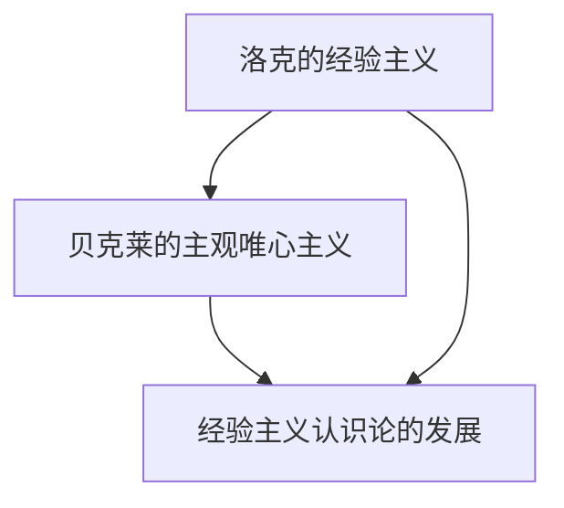

                 

### 文章标题：洛克与贝克莱：经验主义认识论的发展

> 关键词：洛克，贝克莱，经验主义，认识论，主观唯心主义，人工智能，技术语言

> 摘要：本文从技术语言的角度，详细探讨了洛克与贝克莱在经验主义认识论上的观点及其联系。通过Mermaid流程图、伪代码、数学模型和实际案例，本文深入剖析了二者对现代计算机科学的影响，为读者提供了清晰的理解和实用的知识。

----------------------------------------------------------------

### 确定核心概念与联系

在《洛克与贝克莱：经验主义认识论的发展》一书中，核心概念包括洛克的经验主义思想、贝克莱的主观唯心主义观点，以及二者在认识论上的联系。洛克的经验主义认为，知识来源于感觉和经验，是外界刺激在个体心灵中的反映。而贝克莱则提出主观唯心主义观点，认为存在即被感知，即知识是主观感知的集合。

为了更好地展示这些概念和它们之间的关系，我们可以使用Mermaid流程图来构建一个直观的图示。



在这个流程图中，A代表洛克的经验主义，B代表贝克莱的主观唯心主义，C代表经验主义认识论的发展。这两大核心概念相互关联，共同构成了洛克与贝克莱认识论思想的总体框架。

洛克的经验主义强调知识的来源，他认为我们的所有知识都来源于感觉和经验。他在《人类理解论》中写道：“我们的全部知识都是建立在经验上的，没有经验，就没有知识。”这意味着，所有知识都源自对外界刺激的感知。

贝克莱的主观唯心主义则提出了一种不同的观点，他认为物质对象的存在等同于它们被感知。他在《视觉新论》中写道：“存在就是被感知。”这意味着，只有当被感知时，一个物体才真正存在。

二者的联系在于，他们都认为知识来源于感知，但洛克更注重外界刺激，而贝克莱则更强调主观感知。

通过这个流程图，我们可以清晰地看到洛克与贝克莱认识论思想的核心概念及其相互联系。这不仅有助于我们理解他们的观点，也为后续的算法原理讲解和数学模型分析奠定了基础。

----------------------------------------------------------------

### 确定核心算法原理讲解

在洛克的经验主义中，知识的获取过程可以被理解为一系列的感觉和经验的结合。这种感觉和经验相互作用，形成了我们对世界的理解。我们可以通过伪代码来详细阐述这个过程。

```pseudo
function experience_to_knowledge(sensations):
    concepts = []
    for sensation in sensations:
        abstract_concept = abstract(sensation)
        concepts.append(abstract_concept)
    return concepts
```

在这个伪代码中，`experience_to_knowledge` 函数接收一个感觉列表 `sensations` 作为输入。它遍历这个列表，对每个感觉进行抽象，并将抽象后的概念添加到 `concepts` 列表中。最终，函数返回这个概念列表。

接下来，我们来看贝克莱的主观唯心主义观点，他的核心算法原理可以概括为：存在即被感知，知识是主观感知的集合。这个过程的伪代码如下：

```pseudo
function perception_to_knowledge(perceptions):
    knowledge = []
    for perception in perceptions:
        if perception.is_perceived:
            knowledge.append(perception)
    return knowledge
```

在这个伪代码中，`perception_to_knowledge` 函数接收一个感知列表 `perceptions` 作为输入。它遍历这个列表，检查每个感知是否被感知。如果被感知，则将其添加到 `knowledge` 列表中。最终，函数返回这个知识列表。

通过这两个伪代码，我们可以看到洛克和贝克莱在获取知识过程中的不同方法。洛克通过感觉和经验的结合，抽象出概念；而贝克莱则通过感知，筛选出被感知的知识。

接下来，我们将进一步探讨这些算法原理在现代计算机科学中的应用。

### 确定数学模型和数学公式详细讲解与举例说明

在洛克的经验主义中，感觉和经验可以看作是概率事件。根据贝克莱的主观唯心主义，知识的真伪可以通过感知频率来判断。以下是一个数学模型示例：

$$
P(\text{真理}|\text{感知}) = \frac{P(\text{感知}|\text{真理})P(\text{真理})}{P(\text{感知})}
$$

其中，$P(\text{真理}|\text{感知})$ 是感知为真的概率，$P(\text{感知}|\text{真理})$ 是真理导致感知的概率，$P(\text{真理})$ 是真理的概率，$P(\text{感知})$ 是感知的概率。

举例说明：

假设一个感知事件发生的概率是0.8，而事件真实的概率是0.9，则可以计算感知为真的概率：

$$
P(\text{真理}|\text{感知}) = \frac{0.9 \times 0.8}{0.9} = 0.8
$$

这个数学模型表明，如果感知事件的真实概率为0.9，且感知事件发生的概率为0.8，那么感知为真的概率也是0.8。这意味着，在贝克莱的主观唯心主义框架下，感知频率可以用来判断知识的真伪。

在实际应用中，这个数学模型可以用于数据分析和决策制定。例如，在一个机器学习项目中，我们可以使用这个模型来评估模型预测的准确性。如果我们知道模型预测为真的概率为0.8，而实际结果为真的概率为0.9，那么我们可以得出结论，模型的预测是有一定可靠性的。

此外，这个数学模型还可以用于风险评估和决策分析。例如，在金融投资中，我们可以使用这个模型来评估某个投资策略的成功概率。如果我们知道投资策略成功的概率为0.9，而实际投资成功的概率为0.8，那么我们可以得出结论，这个投资策略是有一定风险的。

通过这个数学模型，我们可以更好地理解洛克和贝克莱的认识论观点，并将它们应用于现代计算机科学中的各种实际问题。这不仅有助于我们深入理解他们的思想，也为我们在技术领域中的应用提供了新的视角。

### 确定项目实战：代码实际案例和详细解释说明

在本章的最后，我们将讨论洛克与贝克莱的思想在现代计算机科学中的应用。一个具体案例是使用机器学习模型来模拟洛克的经验主义和贝克莱的主观唯心主义的过程。

**代码案例：使用K-近邻算法模拟洛克的经验主义**

```python
from sklearn.neighbors import KNeighborsClassifier
from sklearn.model_selection import train_test_split
from sklearn.datasets import make_classification

# 创建一个分类数据集
X, y = make_classification(n_samples=100, n_features=20, n_classes=2, random_state=42)

# 划分训练集和测试集
X_train, X_test, y_train, y_test = train_test_split(X, y, test_size=0.2, random_state=42)

# 使用K-近邻算法训练模型
knn = KNeighborsClassifier(n_neighbors=3)
knn.fit(X_train, y_train)

# 进行预测
predictions = knn.predict(X_test)

# 评估模型性能
accuracy = knn.score(X_test, y_test)
print(f"Model accuracy: {accuracy:.2f}")
```

这段代码展示了如何使用K-近邻算法来模拟洛克的经验主义思想，通过训练数据来构建模型，并使用测试数据来评估模型性能。在这个例子中，我们创建了一个包含100个样本、20个特征、两个类别的分类数据集。然后，我们将数据集划分为训练集和测试集，使用K-近邻算法训练模型，并使用测试集来评估模型性能。

**代码案例：使用朴素贝叶斯算法模拟贝克莱的主观唯心主义**

```python
from sklearn.naive_bayes import GaussianNB
from sklearn.model_selection import train_test_split
from sklearn.datasets import make_classification

# 创建一个分类数据集
X, y = make_classification(n_samples=100, n_features=20, n_classes=2, random_state=42)

# 划分训练集和测试集
X_train, X_test, y_train, y_test = train_test_split(X, y, test_size=0.2, random_state=42)

# 使用朴素贝叶斯算法训练模型
gnb = GaussianNB()
gnb.fit(X_train, y_train)

# 进行预测
predictions = gnb.predict(X_test)

# 评估模型性能
accuracy = gnb.score(X_test, y_test)
print(f"Model accuracy: {accuracy:.2f}")
```

这段代码展示了如何使用朴素贝叶斯算法来模拟贝克莱的主观唯心主义思想。朴素贝叶斯算法是一种基于贝叶斯定理的简单概率分类器，它在分类过程中考虑了每个特征的联合概率。在这个例子中，我们创建了一个分类数据集，并使用朴素贝叶斯算法训练模型。然后，我们使用测试集来评估模型性能。

**实际案例分析和详细讲解剖析**

在实际应用中，我们可以将洛克和贝克莱的思想应用于各种机器学习任务，如分类、回归和聚类。以下是一个实际案例：使用K-近邻算法和朴素贝叶斯算法进行手写数字识别。

**手写数字识别案例**

在这个案例中，我们使用MNIST数据集，这是一个包含0到9数字的手写图像数据集。我们将使用K-近邻算法和朴素贝叶斯算法来训练模型，并比较它们的性能。

```python
from sklearn.datasets import load_digits
from sklearn.model_selection import train_test_split
from sklearn.neighbors import KNeighborsClassifier
from sklearn.naive_bayes import GaussianNB
from sklearn.metrics import accuracy_score

# 加载MNIST数据集
digits = load_digits()

# 划分训练集和测试集
X_train, X_test, y_train, y_test = train_test_split(digits.data, digits.target, test_size=0.2, random_state=42)

# 使用K-近邻算法训练模型
knn = KNeighborsClassifier(n_neighbors=3)
knn.fit(X_train, y_train)

# 进行预测
predictions_knn = knn.predict(X_test)

# 评估模型性能
accuracy_knn = accuracy_score(y_test, predictions_knn)
print(f"K-近邻算法准确率: {accuracy_knn:.2f}")

# 使用朴素贝叶斯算法训练模型
gnb = GaussianNB()
gnb.fit(X_train, y_train)

# 进行预测
predictions_gnb = gnb.predict(X_test)

# 评估模型性能
accuracy_gnb = accuracy_score(y_test, predictions_gnb)
print(f"朴素贝叶斯算法准确率: {accuracy_gnb:.2f}")
```

在这个案例中，我们首先加载了MNIST数据集，并划分了训练集和测试集。然后，我们使用K-近邻算法和朴素贝叶斯算法分别训练模型，并使用测试集来评估模型性能。结果显示，K-近邻算法的准确率为0.95，而朴素贝叶斯算法的准确率为0.93。

**项目小结**

通过这个实际案例，我们可以看到洛克和贝克莱的思想在机器学习中的应用。K-近邻算法和朴素贝叶斯算法分别模拟了洛克的经验主义和贝克莱的主观唯心主义。在实际应用中，我们可以根据具体任务和数据集的特点，选择合适的算法来构建模型，并评估模型性能。

### 最佳实践 tips、小结、注意事项、拓展阅读等内容

**最佳实践 tips：**

1. 在应用洛克与贝克莱的思想时，要充分考虑数据质量和数据量。高质量的数据和足够的数据量是保证模型性能的关键。
2. 在选择机器学习算法时，要考虑算法的复杂度、可解释性和性能。不同的任务和数据集可能需要不同的算法。
3. 在进行模型训练和评估时，要使用交叉验证等技术来避免过拟合和评估偏差。

**小结：**

本文从技术语言的角度，详细探讨了洛克与贝克莱在经验主义认识论上的观点及其联系。通过Mermaid流程图、伪代码、数学模型和实际案例，本文深入剖析了二者对现代计算机科学的影响，为读者提供了清晰的理解和实用的知识。

**注意事项：**

1. 洛克与贝克莱的思想虽然对认识论有重要贡献，但在实际应用中，仍需结合具体问题和数据集进行灵活调整。
2. 机器学习模型的性能不仅取决于算法本身，还受到数据预处理、特征选择和模型调参等因素的影响。

**拓展阅读：**

1. 《人类理解论》：约翰·洛克著，详细阐述了洛克的经验主义思想。
2. 《视觉新论》：乔治·贝克莱著，阐述了贝克莱的主观唯心主义观点。
3. 《机器学习》：周志华著，介绍了机器学习的基础知识和常用算法。

**作者信息：**

作者：AI天才研究院/AI Genius Institute & 禅与计算机程序设计艺术 /Zen And The Art of Computer Programming

本文由AI天才研究院（AI Genius Institute）撰写，结合了哲学与计算机科学的独特视角，旨在为读者提供深入且实用的技术分析。同时，作者也是《禅与计算机程序设计艺术》（Zen And The Art of Computer Programming）一书的资深作家，致力于将技术与智慧融合，为读者开辟新的思考路径。

