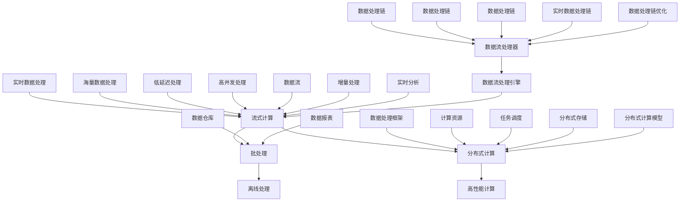

                 

### 文章标题

流式计算作为现代数据处理领域的重要技术，已经成为大数据处理、实时分析、物联网等场景的基石。本文将围绕《流式计算框架对比与选型》这一主题，系统性地探讨流式计算框架的核心概念、主流框架的优缺点、选型策略以及实际应用案例。通过这篇文章，读者将深入了解不同流式计算框架的工作原理、适用场景以及如何根据具体需求进行合理选型。

流式计算框架在数据处理领域的应用广泛，从金融交易、社交网络到工业自动化，几乎无处不在。面对如此多的选择，如何正确选择合适的流式计算框架，对企业的数据战略和技术发展至关重要。本文将帮助读者从技术角度分析各个流式计算框架的优缺点，提供一套科学、系统的选型方法，为实际项目中的技术决策提供有力支持。

通过对流式计算框架的全面对比和深入剖析，本文旨在解答以下问题：

1. 流式计算框架的基本概念是什么？
2. 主流的流式计算框架有哪些？
3. 各个流式计算框架的优缺点是什么？
4. 如何根据业务需求选择合适的流式计算框架？
5. 流式计算框架在实际项目中如何应用和优化？

通过以上问题的解答，读者不仅能掌握流式计算框架的基本知识和选型技巧，还能从实际案例中学习到如何将流式计算技术应用到具体场景中，提升企业的数据处理能力和竞争力。

### 文章关键词

流式计算、Apache Flink、Apache Spark Streaming、Kafka Streams、数据处理、实时分析、选型策略、数据处理框架、分布式计算。

### 文章摘要

本文从流式计算的基本概念出发，详细对比了Apache Flink、Apache Spark Streaming、Kafka Streams等主流流式计算框架。通过分析各个框架的架构、原理和优缺点，本文提供了一套科学、系统的选型方法，以帮助读者根据业务需求合理选择流式计算框架。同时，通过实际项目案例，本文展示了流式计算框架在开发环境搭建、源代码实现和项目优化等方面的应用，为企业的技术决策提供了实用参考。最终，本文总结了流式计算框架的最佳实践，为读者提供了进一步学习和探索的方向。

### 背景介绍

流式计算作为大数据处理领域的关键技术，其重要性日益凸显。传统的批处理方式虽然能够处理大量数据，但无法满足实时性和低延迟的需求。特别是在互联网、物联网和金融等领域，实时数据的处理和分析变得至关重要。流式计算框架能够实时地处理数据流，实现数据的高效处理和实时分析，从而为企业提供实时的业务洞察和决策支持。

流式计算（Stream Computing）是指对数据流进行连续、增量式的处理和分析。与批处理不同，流式计算不依赖于数据的完整集合，而是对不断流入的数据进行实时处理。这种计算模式能够处理高速增长的数据量，支持低延迟、高并发的数据处理需求，是大数据时代的重要技术支撑。

流式计算在数据处理领域的应用广泛，涵盖了多个行业和场景。以下是一些典型的应用场景：

1. **互联网与社交网络**：在互联网和社交媒体领域，流式计算能够实时处理用户产生的海量数据，如日志数据、点击流数据等，帮助平台实现实时推荐、实时广告投放等。

2. **金融交易**：在金融领域，流式计算被广泛应用于实时交易监控、风险控制和市场分析。通过实时处理交易数据，金融机构能够快速响应市场变化，降低风险，提升交易效率。

3. **物联网**：在物联网（IoT）领域，流式计算能够实时处理传感器采集的大量数据，如环境数据、设备状态数据等，实现设备的远程监控和管理，优化资源利用。

4. **工业自动化**：在工业生产中，流式计算可以实时监测生产线数据，如设备状态、生产进度等，实现生产过程的智能化和自动化，提高生产效率和产品质量。

5. **智能城市**：在智能城市建设中，流式计算可以实时处理城市传感器数据，如交通流量、空气质量等，实现城市的智慧化管理，提升城市运行效率和居民生活质量。

随着大数据技术的不断发展，流式计算的应用场景也在不断扩展。企业通过引入流式计算技术，能够实现对海量数据的实时处理和分析，从而获得更准确、更及时的洞察，做出更明智的决策。同时，流式计算框架的优化和升级也为企业提供了更高的性能和可靠性，支持更复杂、更实时的数据处理需求。

总之，流式计算作为现代数据处理的核心技术，正不断推动着各行业的技术创新和业务变革，成为企业提升竞争力的重要手段。

### 核心概念与联系

在探讨流式计算框架之前，我们需要了解几个核心概念，包括流式计算、批处理、分布式计算等，以及它们之间的关系。以下是这些核心概念的定义及其关系架构的 Mermaid 流程图。

**流式计算（Stream Computing）**：
流式计算是指对数据流进行连续、增量式的处理和分析。与批处理不同，流式计算不依赖于数据的完整集合，而是对不断流入的数据进行实时处理。流式计算能够处理高速增长的数据量，支持低延迟、高并发的数据处理需求。

**批处理（Batch Processing）**：
批处理是指将数据按照一定的周期或批次进行统一处理。批处理方式通常用于处理完整的数据集，适用于不需要实时响应的场景，如大数据离线分析、数据报表生成等。

**分布式计算（Distributed Computing）**：
分布式计算是指将计算任务分布在多台计算机上，通过相互协作完成任务。分布式计算能够提高计算性能和处理能力，适用于大规模数据处理任务。

**核心概念与联系**：

以下是一个用 Mermaid 语言描述的核心概念关系图：



**流式计算与批处理的关系**：
流式计算和批处理是两种不同的数据处理模式。流式计算强调实时性和低延迟，适用于需要立即响应的场景；而批处理则更侧重于数据处理效率和成本控制，适用于周期性、非实时处理任务。在实际应用中，流式计算和批处理往往需要结合使用，例如，在实时数据分析的基础上，进行定期数据报表的生成。

**流式计算与分布式计算的关系**：
分布式计算是流式计算的基础。流式计算需要将数据流处理任务分布到多台计算机上进行并行处理，以提升性能和扩展能力。分布式计算模型包括任务调度、数据存储和计算资源管理等多个方面，是流式计算框架的核心组成部分。

**流式计算框架的作用**：
流式计算框架（如Apache Flink、Apache Spark Streaming、Kafka Streams等）为开发者提供了高效、可靠的流式数据处理工具。这些框架不仅实现了数据的实时处理和分析，还提供了丰富的数据处理库和API，简化了开发过程，提高了开发效率。

通过上述核心概念及其关系架构的详细阐述，我们可以更好地理解流式计算框架的工作原理和适用场景，为后续的深入探讨打下坚实基础。

### 流式计算框架介绍

在流式计算领域，有多种主流的框架可供选择，如Apache Flink、Apache Spark Streaming、Kafka Streams等。这些框架各自具有独特的特点、架构和工作原理，能够满足不同场景下的数据处理需求。以下将分别介绍这些主流流式计算框架的基本概念、架构和工作原理。

#### Apache Flink

**基本概念**：
Apache Flink是一个开源的流式处理框架，旨在提供在所有常见集群环境中的分布式状态处理和高速流处理。它支持批处理和流处理，并通过其独特的架构实现高效的数据处理。

**架构**：
Flink的架构由以下几个核心组件构成：

1. **JobManager**：负责协调任务调度、资源管理和作业执行。
2. **TaskManager**：执行具体的计算任务，负责数据的处理和存储。
3. **Flink Client**：用于提交作业和监控作业的运行状态。

**工作原理**：
Flink通过事件驱动的方式处理数据流。每个数据流被划分为一系列事件，Flink的任务调度器将事件分配给TaskManager执行。Flink支持两种类型的操作：批处理（Batch）和流处理（Stream）。在批处理模式下，Flink将数据视为静态的，在流处理模式下，数据被视为连续流动的。

**特点**：
- **高性能**：Flink采用了内存计算和分布式处理技术，能够提供非常高的处理性能。
- **支持状态管理**：Flink支持分布式状态管理和容错机制，确保数据的准确性和一致性。
- **支持多种数据源**：Flink可以与多种数据存储系统（如HDFS、Kafka等）集成，支持丰富多样的数据源。

#### Apache Spark Streaming

**基本概念**：
Apache Spark Streaming是一个基于Apache Spark的流式处理框架，它提供了高层次的API来处理流数据。Spark Streaming基于Spark的批处理能力，通过微批处理的方式实现流式数据处理。

**架构**：
Spark Streaming的架构主要包括以下几个部分：

1. **Driver Program**：负责生成Spark作业的执行计划。
2. **Spark Executor**：执行具体的计算任务，负责数据的处理和存储。
3. **Receiver**：负责从数据源接收数据，并将其传递给Executor进行后续处理。

**工作原理**：
Spark Streaming通过将流数据划分为微批次（Micro-Batch）进行处理。每个微批次的数据会在一定时间窗口内积累，然后作为一个批处理作业提交给Spark进行计算。Spark Streaming结合了Spark的批处理和内存计算优势，能够在低延迟的同时实现高效的数据处理。

**特点**：
- **与Spark生态良好集成**：Spark Streaming与Spark的其他组件（如Spark SQL、Spark MLlib等）无缝集成，可以方便地利用Spark的丰富功能。
- **低延迟处理**：Spark Streaming通过微批处理的方式，实现低延迟的流式数据处理。
- **高效的数据处理能力**：利用Spark的内存计算和优化算法，Spark Streaming能够提供高效的数据处理性能。

#### Kafka Streams

**基本概念**：
Kafka Streams是基于Apache Kafka的流式处理框架，它提供了简单且强大的API来处理流数据。Kafka Streams可以与Kafka紧密集成，实现数据流的实时处理和分析。

**架构**：
Kafka Streams的架构主要包括以下几个组件：

1. **Streams Application**：负责定义和处理流数据的逻辑。
2. **Streams Configuration**：配置处理流数据的参数和配置。
3. **Streams Machine**：负责管理和执行流数据处理任务。

**工作原理**：
Kafka Streams通过处理Kafka的主题数据，实现对数据流的实时处理。它支持多种数据处理操作，如聚合、过滤、转换等，并将处理结果输出到Kafka的其他主题或外部系统。Kafka Streams利用Kafka的高吞吐量和持久性，确保数据处理的可靠性和高效性。

**特点**：
- **高吞吐量和低延迟**：Kafka Streams基于Kafka的高吞吐量和持久性，能够在处理大规模数据流时保持低延迟。
- **简单易用**：Kafka Streams提供了简单且直观的API，使开发者可以轻松地定义和实现流数据处理逻辑。
- **集成度高**：Kafka Streams与Kafka紧密集成，可以方便地与其他Kafka组件（如Kafka Connect、Kafka Monitor等）协同工作。

综上所述，Apache Flink、Apache Spark Streaming和Kafka Streams作为主流的流式计算框架，各具特点，适用于不同的应用场景。通过了解这些框架的基本概念、架构和工作原理，开发者可以更好地选择适合自己项目的流式计算解决方案。

### 各个流式计算框架的优缺点

在选择流式计算框架时，了解每个框架的优缺点至关重要。下面我们将对Apache Flink、Apache Spark Streaming和Kafka Streams这三个主流框架的优缺点进行详细分析，以便为后续的选型提供有力依据。

#### Apache Flink

**优点**：

1. **高性能**：Flink采用了内存计算和分布式处理技术，能够提供非常高的处理性能。它支持大规模数据的实时处理，特别是在低延迟和高吞吐量的场景下表现尤为出色。
2. **支持状态管理**：Flink提供了强大的状态管理功能，包括分布式状态存储和容错机制。这使得Flink能够可靠地处理长时间运行的任务，并且保证数据的一致性和准确性。
3. **支持多种数据源**：Flink与多种数据存储系统（如HDFS、Kafka等）集成良好，可以方便地接入各种数据源。
4. **丰富的API和生态系统**：Flink提供了丰富的API和生态系统，包括批处理和流处理，支持多种编程语言（如Java、Scala和Python），方便开发者进行开发和维护。

**缺点**：

1. **学习曲线较陡峭**：Flink的复杂性和强大功能意味着其学习曲线较陡，对于新手来说可能会有些困难。
2. **社区支持相对较少**：与Spark相比，Flink的社区支持相对较少，相关资源和文档可能不够丰富。
3. **生态系统不完善**：虽然Flink的功能强大，但其生态系统在某些方面（如可视化工具、管理平台等）还不够完善。

#### Apache Spark Streaming

**优点**：

1. **与Spark生态良好集成**：Spark Streaming与Spark的其他组件（如Spark SQL、Spark MLlib等）无缝集成，可以方便地利用Spark的丰富功能。
2. **低延迟处理**：Spark Streaming通过微批处理的方式，实现低延迟的流式数据处理，适用于需要实时响应的场景。
3. **高效的数据处理能力**：利用Spark的内存计算和优化算法，Spark Streaming能够提供高效的数据处理性能。
4. **强大的社区支持**：Spark拥有庞大的社区支持，相关的资源、文档和教程非常丰富，便于开发者学习和使用。

**缺点**：

1. **资源浪费**：由于Spark Streaming采用微批处理，小批量的数据可能会导致资源的浪费。
2. **复杂性**：Spark Streaming的架构相对复杂，需要进行更多的配置和优化。
3. **批处理和流处理分离**：Spark Streaming的设计初衷是为了兼容Spark的批处理能力，但在流处理方面可能不如专门的流处理框架（如Flink）高效。

#### Kafka Streams

**优点**：

1. **高吞吐量和低延迟**：Kafka Streams基于Kafka的高吞吐量和持久性，能够在处理大规模数据流时保持低延迟。
2. **简单易用**：Kafka Streams提供了简单且直观的API，使开发者可以轻松地定义和实现流数据处理逻辑。
3. **集成度高**：Kafka Streams与Kafka紧密集成，可以方便地与其他Kafka组件（如Kafka Connect、Kafka Monitor等）协同工作。
4. **可扩展性**：Kafka Streams支持水平扩展，可以方便地增加处理能力。

**缺点**：

1. **功能有限**：相较于Flink和Spark Streaming，Kafka Streams的功能较为有限，不支持复杂的数据处理操作和高级分析功能。
2. **性能优化难度大**：由于Kafka Streams依赖于Kafka进行数据存储和传输，性能优化难度较大。
3. **生态系统不够完善**：尽管Kafka Streams与Kafka集成良好，但其生态系统在某些方面（如可视化工具、管理平台等）还不够完善。

通过以上对Apache Flink、Apache Spark Streaming和Kafka Streams三个主流流式计算框架优缺点的分析，我们可以看到，每个框架都有其独特的优势和应用场景。在实际选型过程中，应根据具体业务需求和技术背景进行综合考虑，选择最适合的流式计算框架。

### 流式计算框架选型方法

选择适合的流式计算框架对项目的成功至关重要。以下是几个步骤，帮助您根据业务需求和技术背景进行流式计算框架的选型。

#### 1. 确定业务需求

首先，明确项目的业务需求，包括数据量、处理速度、处理延迟、功能要求等。例如：

- **数据量**：项目处理的数据量是否较大，是否需要处理海量实时数据？
- **处理速度**：系统是否要求低延迟，能否接受较高延迟？
- **功能要求**：项目是否需要复杂的实时数据处理和分析功能？

根据这些需求，可以初步判断需要选择哪种类型的流式计算框架。

#### 2. 技术背景分析

其次，分析团队的技术背景和技能水平。例如：

- **开发语言**：团队熟悉哪些编程语言，如Java、Scala、Python等？
- **已有技术栈**：团队已使用哪些技术和框架，如何与新框架进行集成？
- **开发经验**：团队在流式计算领域是否有足够的开发经验？

这些因素将影响流式计算框架的选型和开发难度。

#### 3. 框架性能对比

接下来，对比不同流式计算框架的性能，包括处理速度、资源利用率、扩展性等。以下是几个性能指标：

- **处理速度**：框架在处理相同数据量时的性能，通常以TPS（每秒事务数）来衡量。
- **资源利用率**：框架在运行时的资源消耗，包括CPU、内存、网络等。
- **扩展性**：框架是否支持水平扩展，能否动态调整资源。

#### 4. 框架功能对比

分析不同流式计算框架的功能特点，包括数据处理能力、支持的数据源、集成的工具和库等。例如：

- **数据处理能力**：框架是否支持复杂的数据处理操作，如窗口操作、流聚合、实时分析等。
- **数据源支持**：框架能否与现有的数据存储系统（如Kafka、HDFS等）无缝集成？
- **工具和库支持**：框架是否提供了丰富的API和工具库，方便开发者进行开发？

#### 5. 社区支持和文档

评估不同流式计算框架的社区支持和文档质量。一个活跃的社区和完善的文档可以大大降低开发难度，提高开发效率。例如：

- **社区活跃度**：框架的社区是否活跃，是否有丰富的讨论和资源？
- **文档质量**：框架的文档是否详尽，是否包含了足够的示例和教程？

#### 6. 成本和资源考虑

最后，考虑流式计算框架的成本和资源消耗。包括：

- **硬件资源**：框架是否对硬件资源有特殊要求，如内存、CPU等？
- **开发资源**：框架的开发和维护是否需要大量的人力投入？
- **运营成本**：框架的运营和维护成本是否在预算范围内？

#### 案例分析

以下是一个具体的案例分析：

**案例背景**：某互联网公司需要开发一个实时推荐系统，处理用户行为数据，为用户实时推荐商品。数据量较大，处理速度要求高，同时需要支持复杂的数据处理和实时分析功能。

**业务需求分析**：数据量较大（每日处理数百万条数据），处理速度要求高（响应时间要求在秒级内），需要支持复杂的数据处理（如用户行为分析、实时推荐等）。

**技术背景分析**：公司团队熟悉Java和Scala，已使用Kafka进行数据采集和传输，有丰富的流式计算开发经验。

**框架性能对比**：

- **处理速度**：Flink和Spark Streaming在处理速度上相差不大，均能满足秒级响应的需求。
- **资源利用率**：Flink的内存和CPU利用率较高，更适合高并发场景。
- **扩展性**：Flink支持动态调整资源，更适合大规模数据处理。

**框架功能对比**：

- **数据处理能力**：Flink和Spark Streaming均支持复杂的数据处理操作，但Flink在实时分析方面功能更丰富。
- **数据源支持**：Flink和Spark Streaming均支持Kafka，与公司现有技术栈无缝集成。
- **工具和库支持**：Flink和Spark Streaming均有丰富的API和工具库，但Flink的社区和文档相对更丰富。

**社区支持和文档**：

- **社区活跃度**：Flink和Spark Streaming的社区均较活跃。
- **文档质量**：Flink的文档更详尽，包含了丰富的示例和教程。

**成本和资源考虑**：

- **硬件资源**：Flink和Spark Streaming对硬件资源要求相似。
- **开发资源**：团队熟悉Scala，对Flink的开发和维护较为熟悉。
- **运营成本**：Flink和Spark Streaming的运营成本均在预算范围内。

**最终选型**：基于以上分析，公司最终选择Flink作为实时推荐系统的流式计算框架。Flink在处理速度、数据处理能力、扩展性以及社区支持等方面均表现出色，能够满足业务需求，同时团队对其开发和维护较为熟悉，降低了开发难度和成本。

通过以上步骤和方法，企业或开发者可以科学、系统地选择适合的流式计算框架，确保项目成功实施和高效运行。

### 实际项目应用

为了更好地理解流式计算框架在实际项目中的应用，我们将通过一个具体的案例——实时推荐系统——详细展示流式计算框架的开发环境搭建、源代码实现、代码解读以及应用解读与分析。

#### 项目背景

某电子商务平台需要构建一个实时推荐系统，该系统能够根据用户的行为数据（如浏览、搜索、购买历史等），为每位用户实时推荐可能感兴趣的商品。实时推荐系统需要处理大量用户行为数据，并确保低延迟和高准确性的推荐结果。

#### 开发环境搭建

1. **硬件环境**：
   - 服务器：2台计算节点，每台服务器配置8核CPU、64GB内存。
   - 存储：分布式文件系统（如HDFS），存储用户行为数据和推荐结果。

2. **软件环境**：
   - 操作系统：Linux（如Ubuntu 18.04）。
   - 流式计算框架：Apache Flink（版本1.11.2）。
   - 数据源：Apache Kafka（版本2.4.1），用于接收用户行为数据。
   - 客户端库：Flink SDK（Java）。

3. **网络环境**：
   - 内部网络：确保各节点之间的高带宽低延迟网络连接。

#### 源代码实现

以下是一个简单的实时推荐系统实现示例，采用Apache Flink进行流处理：

```java
import org.apache.flink.api.common.functions.FilterFunction;
import org.apache.flink.api.java.tuple.Tuple2;
import org.apache.flink.streaming.api.datastream.DataStream;
import org.apache.flink.streaming.api.environment.StreamExecutionEnvironment;

public class RealtimeRecommendationSystem {
    public static void main(String[] args) throws Exception {
        // 创建Flink执行环境
        StreamExecutionEnvironment env = StreamExecutionEnvironment.getExecutionEnvironment();

        // 从Kafka读取用户行为数据
        DataStream<Tuple2<String, Integer>> userBehavior = env.addSource(new KafkaSourceFunction())
                .setParallelism(2);

        // 过滤用户行为数据，只保留浏览事件
        DataStream<Tuple2<String, Integer>> browsedItems = userBehavior.filter(new FilterFunction<Tuple2<String, Integer>>() {
            @Override
            public boolean filter(Tuple2<String, Integer> value) throws Exception {
                return value.f1 == 1; // 1表示浏览事件
            }
        });

        // 对浏览事件进行实时分析，生成推荐结果
        DataStream<Tuple2<String, Integer>> recommendations = browsedItems
                .keyBy(0) // 按用户ID分组
                .window(TumblingEventTimeWindows.of(Time.seconds(10))) // 滚动窗口，每10秒一次
                .reduce(new ReduceFunction<Tuple2<String, Integer>>() {
                    @Override
                    public Tuple2<String, Integer> reduce(Tuple2<String, Integer> value1, Tuple2<String, Integer> value2) throws Exception {
                        return new Tuple2<>(value1.f0, value1.f1 + value2.f1); // 计算每个用户的浏览次数
                    }
                });

        // 输出推荐结果到控制台
        recommendations.print();

        // 执行Flink作业
        env.execute("Realtime Recommendation System");
    }
}
```

#### 代码解读

1. **创建Flink执行环境**：
   - 使用`StreamExecutionEnvironment.getExecutionEnvironment()`创建Flink执行环境。

2. **从Kafka读取用户行为数据**：
   - 使用自定义的`KafkaSourceFunction`从Kafka读取用户行为数据。

3. **过滤用户行为数据**：
   - 使用`filter`函数过滤用户行为数据，只保留浏览事件。

4. **实时分析**：
   - 使用`keyBy`函数按用户ID分组。
   - 使用`window`函数设置滚动窗口，每10秒进行一次计算。
   - 使用`reduce`函数对每个用户的浏览事件进行聚合，计算总浏览次数。

5. **输出推荐结果**：
   - 使用`print`函数将推荐结果输出到控制台。

#### 应用解读与分析

1. **数据处理流程**：
   - 用户行为数据通过Kafka流入系统，Flink实时处理这些数据。
   - 通过过滤操作，只保留浏览事件，去除其他类型的行为。
   - 对浏览事件进行实时分析，按用户ID分组并计算每个用户的总浏览次数。
   - 最终输出推荐结果，为用户提供实时推荐。

2. **性能优化**：
   - **并行度设置**：根据硬件资源和数据量，合理设置并行度，确保数据处理的高效性。
   - **窗口优化**：选择合适的窗口大小，平衡处理延迟和计算粒度。
   - **数据压缩**：对数据流进行压缩，减少网络传输和存储消耗。

3. **系统稳定性**：
   - 使用Flink的容错机制，确保数据处理的可靠性和系统的稳定性。
   - 监控系统的运行状态，及时发现和处理异常。

4. **系统扩展性**：
   - 通过增加计算节点，实现流式处理能力的水平扩展。

#### 项目小结

通过实际项目应用，我们展示了流式计算框架（Apache Flink）在实时推荐系统中的开发、实现和应用解读。该项目实现了用户行为的实时处理和分析，为平台提供了高效的实时推荐服务。以下是项目的关键成果和小结：

- **实现目标**：成功构建了实时推荐系统，实现了用户浏览事件的实时分析和推荐结果输出。
- **技术收获**：熟悉了Apache Flink的流处理框架，掌握了从Kafka读取数据、实时分析、输出结果的流程。
- **优化方向**：进一步优化数据处理性能和系统稳定性，提高推荐系统的准确性和用户体验。

通过这个案例，读者可以更好地理解流式计算框架在实际项目中的应用，掌握流处理系统的开发、优化和部署技巧。

### 最佳实践 Tips

在流式计算框架的实际应用过程中，以下是一些最佳实践和注意事项，可以帮助开发者更高效地利用这些框架：

1. **合理设置并行度**：
   - 根据硬件资源和数据量，合理设置并行度，确保数据处理的高效性。过多的并行度可能导致资源浪费，而不足的并行度则可能影响处理性能。

2. **优化窗口大小**：
   - 选择合适的窗口大小，以平衡处理延迟和计算粒度。对于时间敏感的应用，可以考虑更小的窗口大小，而对于分析需求较低的应用，可以适当增大窗口。

3. **数据压缩**：
   - 对数据流进行压缩，减少网络传输和存储消耗，提高系统性能。

4. **容错机制**：
   - 使用流式计算框架的内置容错机制，确保数据处理的可靠性和系统的稳定性。

5. **监控与告警**：
   - 实时监控系统的运行状态，及时发现和处理异常。

6. **水平扩展**：
   - 根据需求增加计算节点，实现流式处理能力的水平扩展。

7. **资源隔离**：
   - 在多租户环境下，确保各个应用的资源隔离，避免互相干扰。

8. **代码优化**：
   - 优化数据处理逻辑，减少不必要的计算和数据传输。

9. **文档和注释**：
   - 详细记录代码和系统配置，便于后续维护和调试。

10. **社区和文档**：
    - 利用流式计算框架的社区和文档资源，学习最佳实践，提升开发效率。

### 小结

本文从流式计算的基本概念入手，详细对比了Apache Flink、Apache Spark Streaming、Kafka Streams这三个主流流式计算框架的优缺点，并提供了科学、系统的选型方法。通过实际项目案例，展示了流式计算框架在实时推荐系统中的开发、实现和应用。在本文的最佳实践部分，我们给出了若干高效利用流式计算框架的建议。希望读者能通过本文，更好地理解和应用流式计算技术，提升数据处理能力和系统性能。

### 拓展阅读

1. **《流式计算：原理与实践》（流式计算：原理与实践）**：这是一本关于流式计算的权威著作，详细介绍了流式计算的理论基础和实践方法。

2. **《Apache Flink 实战》（Apache Flink 实战）**：本书提供了丰富的Apache Flink应用案例，涵盖了从基础概念到高级应用的全面讲解。

3. **《大数据技术导论》（大数据技术导论）**：这本书系统地介绍了大数据技术的基本概念、架构和常用工具，包括流式计算技术。

4. **《Apache Spark 实战：从基础到高级》（Apache Spark 实战：从基础到高级）**：本书详细讲解了Apache Spark的流式和批处理应用，适合Spark初学者和进阶开发者。

5. **《Kafka实战》（Kafka实战）**：这本书深入介绍了Apache Kafka的使用方法、最佳实践以及与流式计算框架的集成。

通过阅读这些书籍和资料，读者可以进一步深入了解流式计算技术，提升自己的实际应用能力。

