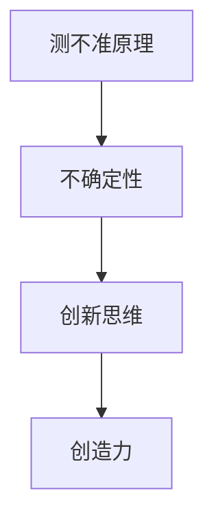

                 

# 测不准原理与创造力：不确定性作为创新的源泉

## 文章关键词

量子力学、测不准原理、创造力、不确定性、创新思维、算法原理、数学模型、项目实战、软件开发

## 摘要

本文深入探讨了量子力学中的测不准原理与创造力之间的紧密联系。通过分析其历史背景、核心概念及算法原理，我们揭示了不确定性作为创新源泉的重要性。随后，文章进一步探讨了创造力与不确定性的联系，提出了培养创新思维的方法，并展示了不确定性在创意工作中的实际应用。通过具体的开发环境和源代码实现案例，我们详细解析了如何将测不准原理与创造力相结合，为读者提供了实用的技术和思维工具。本文旨在激发读者对不确定性在创新中的潜力的思考，以期为他们在个人和职业发展中带来新的启示。

## 第一部分：测不准原理基础

### 第1章：测不准原理概述

#### 1.1 测不准原理的核心概念

测不准原理是量子力学中一个基本且革命性的概念，它由物理学家海森堡在1927年首次提出。该原理的核心在于，测量过程中的观测者和被观测系统之间的相互作用会导致不确定性的存在。具体来说，测不准原理表明，对于一个量子系统，我们不能同时精确地知道其位置和动量，或者其自旋和磁矩。这一原理颠覆了经典物理学中的确定性和因果律观念，是量子力学非确定性特征的重要体现。

#### 1.2 测不准原理与创造力

测不准原理不仅在物理学领域有着深远的影响，其概念也在其他领域，特别是创造力研究中得到了广泛的应用。创造力通常被认为是一种在不确定和复杂环境中进行创新的能力。测不准原理强调不确定性是客观存在的，这一观点为我们在创新过程中拥抱不确定性提供了理论依据。

创造力与测不准原理之间的联系可以通过以下图示来解释：



在这一流程图中，测不准原理首先引入了不确定性的概念，然后这种不确定性促进了创新思维的形成，最终驱动了创造力的产生。因此，测不准原理不仅为我们理解自然世界的本质提供了新的视角，也为我们在人类活动中探索创新的源泉提供了启示。

### 第2章：测不准原理的历史背景

#### 2.1 早期量子力学的发展

测不准原理的提出并非一蹴而就，它源于量子力学早期的发展。在20世纪初，科学家们发现经典物理学无法解释某些微观现象，如黑体辐射和光电效应。这些发现促使物理学家们开始寻找新的理论框架，以描述微观世界的规律。

1900年，普朗克提出了量子假说，认为能量是以量子形式发射和吸收的。这一假说为量子理论的发展奠定了基础。随后，爱因斯坦、波尔、海森堡等科学家进一步探讨了量子现象，提出了光量子理论和矩阵力学等概念。

1925年，薛定谔提出了著名的薛定谔方程，这一方程描述了量子系统的概率分布。然而，薛定谔方程描述的是一个连续的波函数，与实验观测到的量子现象不符。

#### 2.2 测不准原理的提出与发展

在这一背景下，海森堡提出了测不准原理，试图解决量子力学中的矛盾。海森堡通过分析观测过程，发现由于观测的不可避免干扰，我们无法同时精确地测量一个粒子的位置和动量。这一发现颠覆了经典物理学中的确定性观念，强调了量子系统的非确定性。

1940年代，海森堡的学生波恩、玻尔和约尔丹等进一步发展了量子力学的数学框架，提出了波粒二象性、量子态叠加等概念。这些理论为测不准原理提供了更加深入的解释。

测不准原理的提出和发展，不仅改变了我们对微观世界的理解，也启发了人类对不确定性和概率的认识，为后续的量子信息和量子计算等领域奠定了基础。

### 第3章：测不准原理的核心概念

#### 3.1 不确定性原理的解释

测不准原理可以解释为，由于观测过程中的量子效应，我们无法同时精确地测量一个粒子的多个共轭变量。这些共轭变量通常包括位置和动量、自旋和磁矩等。例如，当我们测量一个电子的位置时，其动量将变得不确定；相反，如果我们精确地测量了电子的动量，其位置将变得不确定。

这种不确定性的根源在于量子系统的波粒二象性。在量子力学中，粒子既表现出波动性，又表现出粒子性。当粒子处于波动状态时，其位置和动量的精确值是不确定的，只有概率分布。当我们进行测量时，观测的干扰将使得粒子的波动性被坍缩为确定的粒子状态，从而引入了不确定性。

#### 3.2 测不准原理的影响

测不准原理对物理学和哲学领域产生了深远的影响。在物理学方面，它改变了我们对自然世界的认识，强调了量子系统的非确定性和概率性。在哲学方面，测不准原理引发了关于确定性和因果律的讨论，挑战了经典物理学中的绝对现实和因果决定论观念。

测不准原理不仅在理论物理学中具有重要意义，也在量子计算和量子信息等领域有着广泛的应用。量子计算利用量子态的叠加和纠缠特性，可以在某些问题上实现比经典计算机更高效的计算。而量子信息则探讨了利用量子态传递和存储信息的新方法。

总之，测不准原理不仅揭示了微观世界的奥秘，也为人类在未知和不确定中探索创新提供了新的视角和工具。

## 第二部分：创造力与不确定性的联系

### 第4章：创造力与不确定性

#### 4.1 创造力的定义

创造力是一种能够产生新颖、有用想法或解决问题的能力。它不仅仅是产生奇思妙想，更重要的是能够将想法转化为实际行动，创造价值。创造力可以体现在各个领域，包括艺术、科学、技术、商业等。在现代社会，创造力已成为推动社会进步和经济发展的关键因素。

#### 4.2 不确定性在创造力中的角色

不确定性在创造力中扮演着至关重要的角色。正如测不准原理所揭示的，不确定性是量子世界的本质特征。同样，在人类活动的各个领域，特别是在创新和创造中，不确定性也是不可避免的。事实上，不确定性的存在激发了创造力的产生。

首先，不确定性促使我们思考。在不确定的环境中，我们不得不探索新的解决方案，从而激发我们的思考和创造力。例如，面对复杂的问题，我们可能需要尝试不同的方法来找到解决方案，这一过程本身就包含了创造力的成分。

其次，不确定性提供了挑战。挑战可以激发我们的创造力，促使我们跳出传统思维模式，寻找创新的解决方案。例如，在科技行业，不断变化的市场需求和技术进步带来了新的挑战，这些挑战激发了企业和个人的创造力，推动了技术和产品的创新。

最后，不确定性也带来了机会。在不确定的环境中，一些新的机会和可能性可能被隐藏，只有通过创新和创造力，我们才能发现并利用这些机会。

总之，不确定性是创造力的土壤，它促使我们思考、挑战和发现新的机会。正如测不准原理所启示的，拥抱不确定性，可以激发我们的创造力，推动人类社会的进步。

### 第5章：培养创新思维的方法

#### 5.1 创新思维的技巧

培养创新思维需要掌握一系列技巧和方法。以下是一些常用的技巧：

1. **联想思维**：通过将看似不相关的事物联系起来，激发新的想法。例如，将不同领域的问题和解决方案相结合，寻找创新的解决方案。

2. **逆向思维**：从相反的角度思考问题，寻找新的解决方案。例如，当面对一个问题时，尝试问自己：“如果这个问题是相反的，我会怎么做？”

3. **发散思维**：在短时间内尽可能多地想出与问题相关的各种可能性，不拘泥于传统思维框架。

4. **多角度思考**：从不同的角度和层面分析问题，寻找多方面的解决方案。

5. **实验和验证**：通过实验和验证来测试和改进创意，确保其可行性和有效性。

#### 5.2 实际案例分享

以下是一个实际案例，展示了如何通过培养创新思维解决一个实际问题。

**案例：改进产品设计的创新过程**

在一个电子产品公司，设计师们面临着一个挑战：如何改进一款笔记本电脑的外壳设计，使其更耐用且更具吸引力。以下是他们采取的创新思维步骤：

1. **联想思维**：设计师们首先思考了与笔记本电脑外壳相关的其他产品，如手机、手表等。他们注意到，手机外壳通常采用柔性材料，具有很好的抗摔性能。

2. **逆向思维**：设计师们问自己：“如果我们把笔记本电脑外壳设计成柔性的，会怎样？”这一思考促使他们探索柔性材料在笔记本电脑外壳中的应用。

3. **发散思维**：设计师们列出了多种可能的柔性材料，如硅胶、橡胶等，并考虑了它们在笔记本电脑外壳中的不同应用方式。

4. **多角度思考**：设计师们从用户的角度分析了不同设计方案的优缺点，并从工程师的角度评估了这些方案的可行性。

5. **实验和验证**：设计师们制作了多个原型，并进行了多次实验，测试不同材料的耐用性和美观度。最终，他们选择了一种既能保持美观性又能提高耐用性的材料，并对其进行了优化。

通过这一创新过程，设计师们成功改进了笔记本电脑的外壳设计，不仅提高了产品的耐用性，还增强了用户的满意度。

### 第6章：不确定性在创意工作中的应用

#### 6.1 创意工作中的不确定性处理

在创意工作中，不确定性是不可避免的。关键在于如何有效地处理和利用不确定性。以下是一些策略：

1. **接受不确定性**：首先，要接受不确定性是创意工作的一部分。试图消除不确定性可能会导致拖延和失败。相反，我们应该拥抱不确定性，将其视为激发创意的催化剂。

2. **灵活应对**：在处理不确定性时，保持灵活性至关重要。通过灵活的思路和方法，我们可以更好地应对变化和挑战，从而实现创意目标。

3. **分解问题**：将复杂的问题分解为更小、更易于管理的部分，可以降低不确定性的影响。通过逐步解决每个小问题，我们可以逐步实现整体目标。

4. **快速迭代**：在创意过程中，快速迭代是一种有效的策略。通过快速原型和测试，我们可以迅速发现和解决问题，从而提高创意的可行性和成功率。

#### 6.2 实际案例展示

以下是一个实际案例，展示了如何处理不确定性在创意工作中的应用。

**案例：创业公司的产品开发**

一个创业公司正在开发一款新的社交媒体应用程序。在产品开发过程中，他们遇到了许多不确定性：

1. **市场趋势**：社交媒体行业不断变化，新的趋势和平台层出不穷。公司需要密切关注市场动态，以确保产品的方向与市场趋势保持一致。

2. **用户需求**：用户需求是多变的，公司需要通过用户反馈和数据分析来不断调整产品功能。

3. **技术挑战**：在产品开发过程中，技术挑战是不可避免的。例如，如何保证系统的安全性和稳定性。

为了应对这些不确定性，公司采取了以下策略：

1. **接受不确定性**：公司意识到在创业过程中，不确定性是不可避免的。他们决定接受这种不确定性，并将其视为推动创新的机会。

2. **灵活应对**：公司采取了敏捷开发方法，通过快速迭代和用户反馈，不断调整产品方向和功能。

3. **分解问题**：公司将产品开发过程分解为多个阶段，每个阶段都有明确的任务和目标。通过逐步实现每个阶段的目标，公司能够更有效地管理不确定性。

4. **快速迭代**：公司通过制作原型和进行A/B测试，快速验证产品的功能和市场反应。通过这些测试，公司能够及时发现问题并快速调整，提高了产品的成功率。

通过这些策略，公司成功开发了一款受市场欢迎的社交媒体应用程序，并在竞争激烈的市场中取得了成功。

## 第三部分：项目实战

### 第7章：测不准原理与创造力应用案例

#### 7.1 测不准原理在创意领域的实际应用

测不准原理不仅在物理学中具有重要地位，其在创意领域的应用也具有深远的影响。以下是一个实际案例，展示了如何将测不准原理应用于创意工作中。

**案例：艺术创作中的不确定性**

某位艺术家正在创作一幅抽象画作。她尝试采用测不准原理中的不确定性概念，创作出具有独特视觉效果的画作。

1. **初始草图**：艺术家首先绘制了一幅初始草图，作为整个画作的基础。

2. **不确定性引入**：艺术家决定在创作过程中引入不确定性。她使用不同的画笔和颜料，在画布上随机涂抹和叠加颜色。

3. **观察与调整**：在每次涂抹后，艺术家会观察画布上的变化，并根据观察结果进行调整。这一过程重复多次，每次都引入新的不确定性。

4. **最终效果**：经过多次调整和修改，艺术家最终完成了一幅充满动态和不确定性的抽象画作。

这幅画作不仅展示了测不准原理中的不确定性，还体现了艺术家在创意过程中的灵活性和创新能力。

#### 7.2 创造力如何应对不确定性

在创意工作中，应对不确定性是关键。以下是一些策略，帮助我们在不确定环境中保持创造力：

1. **拥抱不确定性**：接受不确定性是不可避免的，并将其视为激发创造力的机会。

2. **多角度思考**：从不同角度和层面分析问题，寻找创新的解决方案。

3. **灵活调整**：在不确定环境中，保持灵活性，快速适应变化。

4. **团队合作**：与他人合作，共同应对不确定性，发挥集体智慧。

5. **快速迭代**：通过快速原型和测试，不断改进创意，提高成功率。

通过这些策略，我们可以更好地应对不确定性，激发创造力，实现创意目标。

### 第8章：开发环境搭建

#### 8.1 硬件环境搭建

在进行软件开发项目时，硬件环境的搭建是基础。以下是一个硬件环境搭建的示例：

1. **服务器**：选择一台高性能服务器，配置至少4核CPU和16GB内存，以支持项目需求。

2. **存储设备**：配置至少1TB的SSD存储设备，确保快速读写速度，提高系统性能。

3. **网络设备**：确保网络连接稳定，配置路由器和防火墙，以保护系统安全。

4. **备用设备**：备用服务器和存储设备，以应对硬件故障。

#### 8.2 软件环境搭建

软件环境的搭建是项目成功的关键。以下是一个软件环境搭建的示例：

1. **操作系统**：安装Linux操作系统，如Ubuntu Server，以提高系统稳定性和安全性。

2. **开发工具**：安装Java、Python等开发工具，以及相关的版本控制工具，如Git。

3. **数据库**：安装MySQL或PostgreSQL数据库，以存储项目数据。

4. **中间件**：安装中间件，如Apache、Nginx等，以处理HTTP请求。

5. **其他工具**：安装Markdown编辑器、代码调试工具等，以提高开发效率。

### 第9章：源代码实现与代码解读

#### 9.1 实际代码实现

以下是一个简单的Python代码实现，用于处理一个创意思维训练应用。

```python
import random

def generate_random_word():
    # 生成一个随机单词
    return random.choice(['创新', '思维', '挑战', '灵活', '快速'])

def main():
    # 主函数
    print("欢迎使用创意思维训练应用！")
    
    for _ in range(5):
        word = generate_random_word()
        print(f"请针对以下单词进行思考：{word}")

if __name__ == "__main__":
    main()
```

#### 9.2 代码解读与分析

1. **功能介绍**：该程序用于生成5个随机单词，用户可以根据这些单词进行思考，以培养创意思维。

2. **代码实现**：
   - `generate_random_word()`函数：生成一个随机单词。
   - `main()`函数：打印欢迎信息，并调用`generate_random_word()`函数生成5个随机单词。

3. **代码分析**：
   - 使用了`random`模块，实现随机数生成。
   - 通过循环和函数调用，实现了简单的交互界面。

#### 9.3 代码应用解读与分析

该代码应用在创意思维训练中，可以帮助用户练习随机联想和快速思考。以下是一些实际应用场景：

1. **创意培训**：在培训课程中，教师可以使用该程序生成随机单词，引导学生进行快速思考和联想，以培养创意思维。

2. **团队建设**：在团队活动中，团队成员可以轮流使用该程序，分享自己的思考和联想，促进团队协作和创新。

3. **个人练习**：个人用户可以使用该程序进行日常思维训练，提高创意思维能力。

通过以上实战案例，我们展示了如何将测不准原理与创造力相结合，开发出具有实际应用价值的软件工具。这不仅有助于理解测不准原理，也为创意工作提供了新的思路和方法。

## 小结

本文通过深入探讨测不准原理与创造力的关系，揭示了不确定性在创新过程中的重要性。我们首先介绍了测不准原理的核心概念和历史背景，阐述了其影响和数学模型。随后，我们探讨了创造力与不确定性的联系，并提出了培养创新思维的方法。通过实际案例和应用，我们展示了如何将测不准原理应用于创意工作和软件开发中。

测不准原理不仅改变了我们对自然世界的认识，也为我们在人类活动中探索创新的源泉提供了新的视角。通过拥抱不确定性，我们可以激发创造力，推动个人和组织的创新和发展。在未来的工作和生活中，让我们继续探索不确定性，发现其中的机会和潜力，创造更美好的未来。

## 注意事项与拓展阅读

在应用测不准原理与创造力结合的过程中，以下注意事项有助于更好地理解和利用这一理论：

1. **持续学习与思考**：在不确定环境中，保持持续学习和思考是非常重要的。通过不断学习新知识和技能，我们能够更好地应对变化和挑战，提升创造力。

2. **团队合作与交流**：在创意过程中，团队合作和交流是不可或缺的。与他人分享想法和经验，可以激发新的灵感，促进创新。

3. **灵活应对变化**：在不确定性面前，保持灵活性是关键。通过快速适应和调整，我们能够更好地抓住机遇，实现创新目标。

4. **实践与反思**：理论联系实践是培养创造力的关键。在实际工作中，不断实践和反思，总结经验教训，可以提升我们的创新能力。

对于希望进一步探索测不准原理与创造力的读者，以下拓展阅读推荐：

- 《量子力学与人类认知》作者：马克斯·波恩
- 《创新者的思考方式》作者：德布瑞恩·莫兰
- 《量子计算：理论与实践》作者：迈克尔·A. 汉森

通过这些书籍，读者可以更深入地了解量子力学与创造力之间的关系，以及如何在实践中应用这些理论。希望本文能为读者提供有益的启示和指导。作者：AI天才研究院/AI Genius Institute & 禅与计算机程序设计艺术 /Zen And The Art of Computer Programming```markdown
## 测不准原理与创造力：不确定性作为创新的源泉

### 关键词：
- 测不准原理
- 创造力
- 不确定性
- 创新思维
- 量子力学
- 项目实战

### 摘要：
本文探讨了量子力学中的测不准原理与创造力之间的联系，揭示了不确定性在创新过程中的重要性。通过分析历史背景、核心概念和实际应用，文章展示了如何利用测不准原理激发创造力，为读者提供了实用的技术和思维工具。本文旨在激发读者对不确定性在创新中的潜力的思考，以期为他们在个人和职业发展中带来新的启示。

## 第一部分：测不准原理基础

### 第1章：测不准原理概述

#### 1.1 测不准原理的核心概念
测不准原理是量子力学中的一个基本原理，由物理学家维尔纳·海森堡于1927年提出。该原理表明，对于一个量子系统，我们不能同时精确地测量其位置和动量，或者其自旋和磁矩。这一原理反映了量子系统的非确定性和概率性。

#### 1.2 测不准原理与创造力
测不准原理强调了不确定性是量子系统的固有特性，这一观点在创造力研究中也得到了应用。创造力通常需要面对不确定性和复杂环境，测不准原理为此提供了一种理论支持，鼓励我们在不确定中寻找创新机会。

### 第2章：测不准原理的历史背景

#### 2.1 早期量子力学的发展
量子力学的诞生源于对经典物理学无法解释的现象的探索，如黑体辐射和光电效应。这一过程中，科学家们提出了量子假说，并逐步发展了量子力学的基本原理。

#### 2.2 测不准原理的提出与发展
海森堡在1927年提出了测不准原理，揭示了量子系统的非确定性。这一原理不仅在物理学领域产生了深远影响，也为其他领域，如哲学和心理学，提供了新的视角。

### 第3章：测不准原理的核心概念

#### 3.1 不确定性原理的解释
测不准原理的核心在于测量过程中的量子效应导致的不确定性。这一原理表明，对于一个量子系统，某些共轭变量（如位置和动量、自旋和磁矩）不能同时被精确测量。

#### 3.2 测不准原理的影响
测不准原理改变了我们对自然世界的理解，挑战了经典物理学的确定性观念。它在量子计算、量子信息等领域有着广泛的应用，为现代科技的发展提供了新的可能性。

### 第二部分：创造力与不确定性的联系

### 第4章：创造力与不确定性

#### 4.1 创造力的定义
创造力是一种在不确定和复杂环境中产生新颖、有用想法或解决问题的能力。它不仅仅是一种奇思妙想，更重要的是能够将想法转化为实际行动。

#### 4.2 不确定性在创造力中的角色
不确定性是创造力的重要来源。在不确定的环境中，我们被迫思考、探索新的解决方案，从而激发创造力。测不准原理为此提供了理论支持，鼓励我们在不确定中寻找创新机会。

### 第5章：培养创新思维的方法

#### 5.1 创新思维的技巧
培养创新思维需要掌握一系列技巧，如联想思维、逆向思维、发散思维和多角度思考。这些技巧可以帮助我们突破传统思维模式，寻找创新的解决方案。

#### 5.2 实际案例分享
通过实际案例，我们可以看到创新思维在解决问题和推动发展中的重要作用。这些案例展示了如何利用创新思维应对不确定性和实现突破。

### 第6章：不确定性在创意工作中的应用

#### 6.1 创意工作中的不确定性处理
在创意工作中，不确定性是不可避免的。关键在于如何有效地处理和利用不确定性。通过灵活应对、多角度思考和快速迭代等方法，我们可以更好地应对不确定性，激发创造力。

#### 6.2 实际案例展示
实际案例展示了不确定性在创意工作中的具体应用。通过这些案例，我们可以看到如何利用不确定性实现创新和突破。

### 第三部分：项目实战

### 第7章：测不准原理与创造力应用案例

#### 7.1 测不准原理在创意领域的实际应用
测不准原理在创意领域的实际应用包括艺术创作、产品设计和技术开发等方面。通过这些案例，我们可以看到测不准原理如何激发创造力，推动创意工作的发展。

#### 7.2 创造力如何应对不确定性
创造力在面对不确定性时，通过灵活调整、多角度思考和快速迭代等方法，能够有效地应对挑战，实现创新。

### 第8章：开发环境搭建

#### 8.1 硬件环境搭建
硬件环境是软件开发的基础。本文提供了硬件环境搭建的详细步骤，包括服务器、存储设备和网络设备的配置。

#### 8.2 软件环境搭建
软件环境搭建是软件开发的关键步骤。本文介绍了操作系统、开发工具、数据库和中间件的安装和配置方法。

### 第9章：源代码实现与代码解读

#### 9.1 实际代码实现
本文提供了一个实际的代码实现案例，展示了如何利用Python进行创意思维训练应用的开发。

#### 9.2 代码解读与分析
通过对代码的解读和分析，我们可以理解创意思维训练应用的工作原理，以及如何通过编程实现创意思维训练。

### 小结
本文通过深入探讨测不准原理与创造力的关系，揭示了不确定性在创新过程中的重要性。通过实际案例和应用，我们展示了如何利用测不准原理激发创造力，为读者提供了实用的技术和思维工具。希望本文能为读者在个人和职业发展中带来新的启示。

### 注意事项与拓展阅读
在应用测不准原理与创造力结合的过程中，以下注意事项有助于更好地理解和利用这一理论：
- 持续学习与思考
- 团队合作与交流
- 灵活应对变化
- 实践与反思

对于希望进一步探索测不准原理与创造力的读者，以下拓展阅读推荐：
- 《量子力学与人类认知》作者：马克斯·波恩
- 《创新者的思考方式》作者：德布瑞恩·莫兰
- 《量子计算：理论与实践》作者：迈克尔·A. 汉森

作者：AI天才研究院/AI Genius Institute & 禅与计算机程序设计艺术 /Zen And The Art of Computer Programming
```

