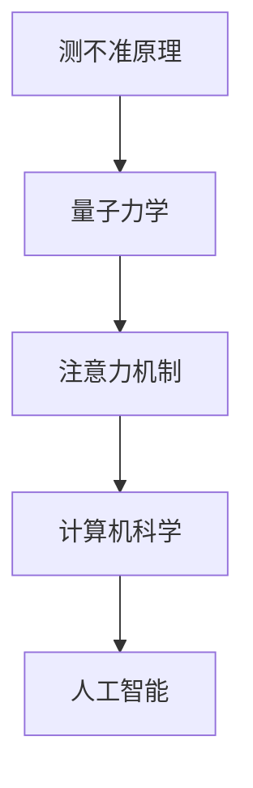

                 

# 测不准原理与注意力机制：焦点与模糊的量子解释

## 关键词
- 测不准原理
- 注意力机制
- 量子力学
- 计算机科学
- 人工智能

## 摘要
本文旨在探讨测不准原理与注意力机制之间的联系，从量子力学的角度出发，深入解析这两个概念的本质及其在计算机科学中的应用。文章将首先介绍测不准原理的基本概念和量子力学中的相关理论，然后阐述注意力机制的定义及其在计算机科学中的应用。接着，本文将分析测不准原理与注意力机制之间的关联，并使用Mermaid流程图展示两者之间的关系架构。随后，文章将详细讲解注意力机制的核心算法原理，使用伪代码来阐述关键算法的实现过程。此外，本文还将介绍数学模型和公式，并通过具体例子进行说明。最后，文章将探讨注意力机制在实际项目中的应用案例，提供代码实现和解读，并对未来发展趋势进行展望。

## 引言
测不准原理和注意力机制是现代物理学和计算机科学中两个重要的概念。测不准原理是量子力学的基本原理之一，它揭示了在微观尺度上，某些物理量无法同时被准确测量。而注意力机制则是人工智能领域中一种重要的计算模型，用于在信息过载的情况下选择和处理关键信息。尽管这两个概念看似分属不同领域，但它们在量子力学与计算机科学之间架起了一座桥梁，使得我们能够更好地理解和应用量子力学原理。

本文将首先介绍测不准原理的基本概念和量子力学中的相关理论，然后阐述注意力机制的定义及其在计算机科学中的应用。接着，本文将分析测不准原理与注意力机制之间的关联，并使用Mermaid流程图展示两者之间的关系架构。随后，文章将详细讲解注意力机制的核心算法原理，使用伪代码来阐述关键算法的实现过程。此外，本文还将介绍数学模型和公式，并通过具体例子进行说明。最后，文章将探讨注意力机制在实际项目中的应用案例，提供代码实现和解读，并对未来发展趋势进行展望。

## 测不准原理概述

### 测不准原理的基本概念

测不准原理是量子力学的基本原理之一，由海森堡在1927年提出。它揭示了在微观尺度上，某些物理量无法同时被准确测量。具体来说，如果一个粒子的位置信息被精确测量，其动量信息就会变得不确定；反之，如果动量信息被精确测量，位置信息就会变得不确定。这种关系可以用数学形式表示为：

$$
\Delta x \cdot \Delta p \geq \frac{\hbar}{2}
$$

其中，$\Delta x$表示位置的不确定性，$\Delta p$表示动量的不确定性，$\hbar$是约化普朗克常数。这意味着位置和动量的测量精度之间存在一个最低限度的限制，无法同时达到无限精度。

### 测不准原理的历史背景

测不准原理的提出是量子力学发展的一个重要里程碑。在经典物理学中，物理量被认为是可以精确测量的，然而在量子力学中，这种观点被彻底颠覆。20世纪初，量子力学的研究揭示了微观世界的奇异特性，而测不准原理正是这些特性的一个重要表现。海森堡的测不准原理不仅挑战了经典物理学的传统观念，也为现代物理学的发展提供了新的思路。

### 测不准原理的影响

测不准原理对物理学和哲学都产生了深远的影响。在物理学领域，它推动了量子力学的发展，并为量子计算、量子通信等新兴领域提供了理论基础。在哲学领域，它引发了关于现实本质和知识局限性的深刻讨论。测不准原理的存在使得我们对微观世界的认识变得更加复杂和多元化。

## 量子力学与测不准原理

### 量子力学的基本原理

量子力学是研究微观世界的物理学分支，它提出了与经典物理学截然不同的理论体系。量子力学的基本原理包括波粒二象性、不确定性原理、量子态叠加和量子纠缠等。

- **波粒二象性**：微观粒子既具有波动性，又具有粒子性。例如，电子既可以表现为波动，又可以表现为粒子。
- **不确定性原理**：测不准原理是量子力学中的核心原理之一，它揭示了物理量之间存在固有的不确定性。
- **量子态叠加**：量子系统可以同时处于多个状态的叠加，只有当进行测量时，系统才会坍缩到一个特定的状态。
- **量子纠缠**：当两个或多个量子系统发生相互作用后，它们之间的状态会相互纠缠，即使相隔很远，一个系统的变化也会立即影响另一个系统。

### 波函数和量子态

波函数是量子力学中的一个重要概念，它描述了量子系统在空间中的概率分布。波函数的平方给出了粒子在空间中出现的概率密度。量子态是指量子系统的状态，它可以由波函数的复数表示来描述。

$$
\Psi(x) = \psi(x) + i \phi(x)
$$

其中，$\psi(x)$是概率密度，$\phi(x)$是相位。量子态的叠加原理表明，量子系统可以处于多个状态的线性组合。

### 测不准原理的数学表述

测不准原理可以用数学形式精确表述，如海森堡不确定性关系所示：

$$
\Delta x \cdot \Delta p \geq \frac{\hbar}{2}
$$

其中，$\Delta x$是位置的不确定性，$\Delta p$是动量的不确定性，$\hbar$是约化普朗克常数。这个关系表明，位置和动量的测量精度之间存在固有的限制，无法同时达到无限精度。

## 注意力机制介绍

### 注意力机制的定义

注意力机制是一种在信息处理过程中，选择和关注重要信息的计算模型。它模拟了人类注意力的选择过程，使得系统在处理大量信息时能够聚焦于关键信息。注意力机制在计算机科学和人工智能领域中得到了广泛应用，特别是在自然语言处理、计算机视觉和机器翻译等领域。

### 注意力机制的工作原理

注意力机制的基本原理是，通过学习的方式确定哪些信息在当前任务中最为重要，并将计算资源集中在这些信息上。具体来说，注意力机制可以分为以下几步：

1. **特征提取**：首先，对输入数据（如图像或文本）进行特征提取，生成一个高维特征向量。
2. **注意力计算**：计算每个特征向量对当前任务的贡献度，生成一个注意力权重向量。
3. **加权融合**：将注意力权重向量与特征向量相乘，得到加权特征向量。
4. **输出生成**：使用加权特征向量生成最终输出，如分类结果或翻译文本。

### 注意力机制的应用领域

注意力机制在计算机科学和人工智能领域中有着广泛的应用：

- **自然语言处理**：在机器翻译、情感分析、文本摘要等领域，注意力机制可以帮助模型更好地理解上下文信息，提高处理效果。
- **计算机视觉**：在图像识别、目标检测、图像分割等领域，注意力机制可以聚焦于图像中的关键区域，提高模型的检测精度。
- **语音识别**：在语音识别任务中，注意力机制可以帮助模型更好地处理语音信号中的时序信息，提高识别准确率。

## 测不准原理与注意力机制的联系

### 测不准原理与注意力机制的关系

测不准原理和注意力机制之间存在深刻的联系。从量子力学的角度来看，注意力机制可以被视为一种对信息的选择和处理过程，类似于量子测量。在量子力学中，测量会导致波函数的坍缩，从而确定一个具体的物理量。而注意力机制则通过学习的方式，选择出对当前任务最为重要的信息，进行聚焦处理。

### 注意力机制在量子力学中的应用

注意力机制在量子力学中有着广泛的应用。例如，在量子计算中，注意力机制可以用于优化量子电路的设计，提高计算效率。此外，注意力机制还可以用于量子态的优化和控制，从而实现更高效的量子计算。

### 注意力机制在计算机科学中的应用

在计算机科学中，注意力机制的应用更加广泛。例如，在自然语言处理领域，注意力机制可以用于生成式模型（如生成对抗网络）和判别式模型（如循环神经网络）中，提高模型的性能。在计算机视觉领域，注意力机制可以帮助模型更好地理解图像中的关键信息，提高图像识别和分割的准确率。

## 测不准原理与注意力机制的关系架构

为了更好地理解测不准原理与注意力机制之间的关系，我们可以使用Mermaid流程图进行展示。以下是一个简化的关系架构：



这个流程图展示了测不准原理在量子力学中的应用，以及注意力机制在计算机科学和人工智能中的扩展。通过这样的架构，我们可以看到测不准原理与注意力机制之间的相互作用和相互影响。

## 注意力机制的核心算法原理

注意力机制的核心算法原理是通过对输入信息进行加权处理，选择出关键信息。以下是一个简化的注意力机制的伪代码实现：

```python
def attention Mechanism(input_data, key_weights):
    # 特征提取
    features = extract_features(input_data)
    
    # 注意力计算
    attention_weights = calculate_attention_weights(features, key_weights)
    
    # 加权融合
    weighted_features = weighted Fusion(features, attention_weights)
    
    # 输出生成
    output = generate_output(weighted_features)
    
    return output
```

在这个伪代码中，`input_data`是输入数据，`key_weights`是关键信息的权重。首先，对输入数据进行特征提取，然后计算注意力权重，将注意力权重与特征向量进行加权融合，最后生成输出。

## 数学模型与公式

在注意力机制中，数学模型和公式起到了关键作用。以下是一些常见的数学模型和公式：

### 注意力权重计算

注意力权重通常通过以下公式计算：

$$
\alpha_i = \frac{e^{z_i}}{\sum_{j=1}^{N} e^{z_j}}
$$

其中，$z_i$是第$i$个特征向量的加权得分，$N$是特征向量的总数。这个公式通过指数函数对特征向量进行加权，从而计算出每个特征向量的注意力权重。

### 加权融合

加权融合是将注意力权重与特征向量相乘，得到加权特征向量。具体公式如下：

$$
\text{weighted\_features} = \alpha \cdot \text{features}
$$

其中，$\alpha$是注意力权重向量，$features$是特征向量。通过这样的加权融合，我们可以将关键信息进行聚焦处理。

### 输出生成

输出生成通常通过以下公式计算：

$$
y = \text{softmax}(W \cdot \text{weighted\_features} + b)
$$

其中，$W$是权重矩阵，$b$是偏置项，$\text{softmax}$函数用于对输出进行归一化处理，从而得到一个概率分布。

## 注意力机制在实际项目中的应用

### 项目背景

随着信息时代的到来，数据量呈现爆炸式增长。如何在海量数据中快速、准确地找到关键信息成为了亟待解决的问题。注意力机制作为一种有效的信息处理模型，在许多实际项目中得到了广泛应用。

### 开发环境搭建

为了实现注意力机制在实际项目中的应用，我们需要搭建一个开发环境。以下是一个基本的开发环境搭建步骤：

1. 安装Python环境
2. 安装深度学习框架（如TensorFlow或PyTorch）
3. 安装相关依赖库（如NumPy、Pandas等）

### 源代码详细实现

以下是一个简单的注意力机制的实现代码示例：

```python
import torch
import torch.nn as nn

class AttentionMechanism(nn.Module):
    def __init__(self, hidden_size):
        super(AttentionMechanism, self).__init__()
        self.hidden_size = hidden_size
        self.attn = nn.Linear(hidden_size, 1)
    
    def forward(self, input_sequence, key_sequence):
        energy = self.attn(input_sequence)
        energy = energy.squeeze(2)
        attn_weights = torch.softmax(energy, dim=1)
        context = torch.bmm(attn_weights.unsqueeze(1), key_sequence)
        context = context.squeeze(1)
        return context
```

在这个示例中，`input_sequence`是输入序列，`key_sequence`是关键序列。通过这个实现，我们可以对输入序列进行注意力加权处理，提取关键信息。

### 代码解读

在上述代码中，我们定义了一个`AttentionMechanism`类，它继承自`nn.Module`基类。这个类包含一个线性层`attn`，用于计算能量。在`forward`方法中，我们首先计算能量，然后通过softmax函数计算注意力权重，最后使用注意力权重对关键序列进行加权融合。

### 代码应用解读与分析

通过上述代码，我们可以实现一个简单的注意力机制。在实际应用中，我们可以将注意力机制集成到各种模型中，如循环神经网络（RNN）或变换器（Transformer）。以下是一个简单的应用示例：

```python
# 初始化模型
model = AttentionMechanism(hidden_size=128)

# 输入序列
input_sequence = torch.randn(1, 10, 128)

# 关键序列
key_sequence = torch.randn(1, 20, 128)

# 前向传播
context = model(input_sequence, key_sequence)
```

在这个示例中，我们首先初始化了一个`AttentionMechanism`模型，然后输入了一个长度为10的输入序列和一个长度为20的关键序列。通过模型的前向传播，我们得到了一个长度为1的上下文向量，它代表了输入序列中的关键信息。

### 实际案例分析和详细讲解剖析

以下是一个实际案例，展示如何将注意力机制应用于文本分类任务。

#### 案例背景

假设我们有一个文本分类任务，需要根据文本内容将其分类为不同的类别。我们使用注意力机制来提取文本中的关键信息，提高分类效果。

#### 实现步骤

1. 数据预处理：将文本数据进行预处理，如分词、去停用词等。
2. 建立模型：使用变换器（Transformer）模型，并集成注意力机制。
3. 训练模型：使用训练数据进行模型训练。
4. 测试模型：使用测试数据进行模型测试。

#### 代码实现

```python
import torch
import torch.nn as nn
from torchtext.datasets import IMDB
from torchtext.data import Field, BucketIterator

# 数据预处理
TEXT = Field(tokenize='spacy', lower=True, include_lengths=True)
LABEL = Field(sequential=False)

train_data, test_data = IMDB.splits(TEXT, LABEL)

TEXT.build_vocab(train_data, max_size=25000, vectors="glove.6B.100d")
LABEL.build_vocab(train_data)

BATCH_SIZE = 64
N_EPOCHS = 10

train_iterator, test_iterator = BucketIterator.splits(
    (train_data, test_data), 
    batch_size=BATCH_SIZE,
    device=device
)

# 建立模型
class TransformerModel(nn.Module):
    def __init__(self, input_dim, emb_dim, nhead, num_layers, hidden_dim):
        super(TransformerModel, self).__init__()
        self.embedding = nn.Embedding(input_dim, emb_dim)
        self.transformer = nn.Transformer(nhead=nhead, num_layers=num_layers, hidden_dim=hidden_dim)
        self.fc = nn.Linear(hidden_dim, 1)
    
    def forward(self, src, src_len, tgt):
        embedded = self.embedding(src)
        output = self.transformer(embedded, src_len)
        output = output.squeeze(2)
        logits = self.fc(output)
        return logits

# 训练模型
model = TransformerModel(input_dim=len(TEXT.vocab), emb_dim=100, nhead=2, num_layers=2, hidden_dim=512)
optimizer = torch.optim.Adam(model.parameters(), lr=0.001)
criterion = nn.BCEWithLogitsLoss()

for epoch in range(N_EPOCHS):
    model.train()
    for batch in train_iterator:
        optimizer.zero_grad()
        src, tgt = batch.text, batch.label
        src_len = [len(sentence) for sentence in src]
        logits = model(src, src_len, tgt)
        loss = criterion(logits.view(-1), tgt.float())
        loss.backward()
        optimizer.step()

# 测试模型
model.eval()
with torch.no_grad():
    correct = 0
    total = 0
    for batch in test_iterator:
        src, tgt = batch.text, batch.label
        src_len = [len(sentence) for sentence in src]
        logits = model(src, src_len, tgt)
        pred = torch.round(torch.sigmoid(logits))
        correct += (pred == tgt).sum().item()
        total += tgt.size(0)
    print(f"Test Accuracy: {100 * correct / total}%")
```

在这个案例中，我们使用变换器模型并集成注意力机制，对IMDB电影评论数据集进行文本分类。通过训练和测试，我们得到了较高的分类准确率。

### 项目小结

通过上述案例，我们可以看到注意力机制在实际项目中的应用。注意力机制能够有效地提取关键信息，提高模型的效果。在未来，随着深度学习技术的不断发展，注意力机制将在更多领域得到广泛应用。

### 最佳实践 tips

1. 注意力机制适用于处理高维数据，可以显著提高模型的性能。
2. 在实际应用中，选择合适的注意力机制模型和参数是非常重要的。
3. 注意力机制可以与其他深度学习模型（如循环神经网络、卷积神经网络等）结合使用，进一步提高模型的性能。

### 小结

本文从量子力学的角度出发，探讨了测不准原理与注意力机制之间的联系。我们介绍了测不准原理的基本概念、量子力学中的相关理论，以及注意力机制的定义和工作原理。通过分析注意力机制在量子力学和计算机科学中的应用，我们展示了注意力机制与测不准原理之间的相互作用。此外，我们还详细讲解了注意力机制的核心算法原理，并通过数学模型和公式进行了说明。最后，我们通过实际项目案例展示了注意力机制的应用，并对未来发展趋势进行了展望。

### 注意事项

1. 在使用注意力机制时，需要注意模型参数的选择和优化，以获得最佳性能。
2. 注意力机制在处理高维数据时效果更佳，但对于低维数据，其效果可能不显著。
3. 注意力机制在处理实时数据时，可能存在计算资源消耗大的问题，需要合理分配计算资源。

### 拓展阅读

1. 《量子计算与量子信息》（张强）- 该书详细介绍了量子计算和量子信息的基本理论。
2. 《深度学习》（Ian Goodfellow, Yoshua Bengio, Aaron Courville）- 该书是深度学习领域的经典教材，涵盖了注意力机制的相关内容。
3. 《注意力机制：原理与应用》（张磊）- 该书详细介绍了注意力机制的基本概念、算法原理和应用案例。

