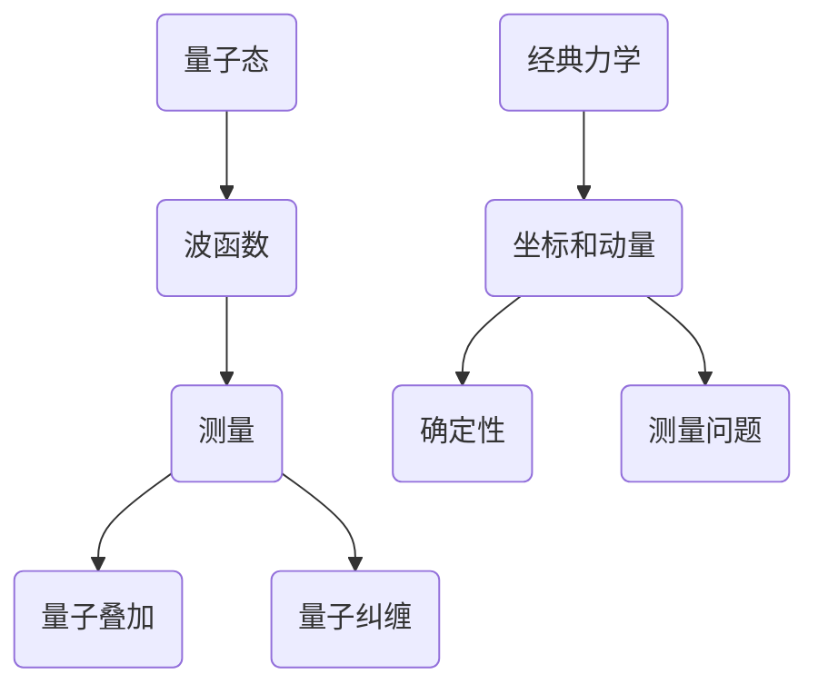
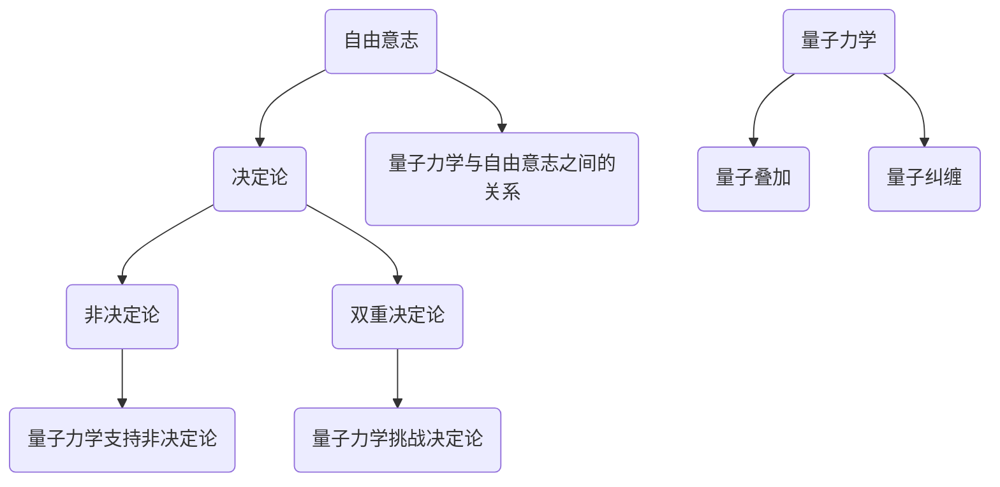

                 


### 测不准原理与自由意志：决策过程的量子不确定性

> 关键词：测不准原理、自由意志、决策过程、量子不确定性、量子计算

> 摘要：本文将探讨量子力学中的测不准原理与自由意志之间的关系，并分析量子不确定性在决策过程中的应用。文章首先介绍量子力学和测不准原理的基本概念，然后阐述自由意志的定义及其争议，接着详细分析量子不确定性与自由意志之间的联系。在此基础上，探讨量子不确定性如何影响决策过程，并举例说明量子不确定性在决策中的应用。最后，对量子决策的未来发展进行展望。

---

## 第一部分：量子力学基础

### 第1章：量子力学的诞生与发展

量子力学是20世纪最重要的科学革命之一，它的诞生和发展对物理学、化学、生物学等众多学科产生了深远的影响。本节将介绍量子力学的诞生背景、核心概念以及与经典力学的对比。

#### 1.1.1 量子力学的诞生背景

在20世纪初，经典物理学已经取得了巨大的成功，例如牛顿力学和麦克斯韦电磁理论。然而，一些实验结果无法用经典物理学解释，例如黑体辐射、光电效应和氢原子光谱。为了解释这些实验结果，物理学家们开始探索一种新的物理学理论，即量子力学。

#### 1.1.2 量子力学的核心概念

量子力学的核心概念包括量子态、波函数、测量、量子叠加和量子纠缠等。量子态是量子系统的基本状态，可以用波函数来描述。波函数是一个复值函数，它的平方表示系统在不同状态下出现的概率。测量是量子力学的关键操作，测量结果往往具有概率性质。量子叠加和量子纠缠是量子力学的重要特性，它们使得量子系统可以同时处于多个状态，并能够相互影响。

#### 1.1.3 量子力学与经典力学的对比及影响

量子力学与经典力学有以下几点主要区别：

1. **概率性**：量子力学中的物理量具有概率性，而经典力学中的物理量具有确定性。
2. **量子态**：量子力学中的量子态可以用波函数来描述，而经典力学中的状态可以用坐标和动量来描述。
3. **测量问题**：量子力学中的测量过程会导致波函数坍缩，而经典力学中的测量过程不会改变系统的状态。

量子力学的诞生和发展对物理学产生了深远的影响，它挑战了我们对现实世界的理解，推动了计算机科学、材料科学、生物学等领域的发展。

### Mermaid 流程图：量子力学核心概念关系架构



## 第二部分：自由意志

### 第2章：自由意志

自由意志是指个体在行为决策过程中具有自主选择的能力。然而，自由意志的概念在哲学、心理学、物理学等领域中一直存在争议。本节将介绍自由意志的定义、相关争议以及量子力学与自由意志之间的关系。

#### 2.1.1 自由意志的定义

自由意志通常被定义为个体在行为决策过程中具有自主选择的能力。这意味着个体的行为不是完全由外部因素决定的，而是受到个体自身意愿和动机的影响。

#### 2.1.2 自由意志的争议

自由意志的争议主要涉及以下几个方面：

1. **决定论**：决定论认为，一切现象都是由先前的原因和条件决定的，个体没有真正的自由意志。这种观点认为，即使个体看似做出了选择，实际上这些选择也是由先前的原因和条件所决定的。
2. **非决定论**：非决定论认为，个体的行为不是由先前的原因和条件决定的，而是受到随机因素或内在动机的影响。这种观点认为，个体具有真正的自由意志。
3. **双重决定论**：双重决定论认为，一方面，个体的行为受到先前的原因和条件的影响；另一方面，个体也具有真正的自由意志。这种观点试图调和决定论和非决定论之间的矛盾。

#### 2.1.3 量子力学与自由意志之间的关系

量子力学中的一些现象，如量子叠加和量子纠缠，似乎挑战了经典物理学中的决定论观点。这引发了一些哲学家和科学家的思考，认为量子力学可能为自由意志提供了新的解释。

### Mermaid 流�程图：自由意志与量子力学之间的关系



## 第三部分：量子不确定性与决策过程

### 第3章：量子不确定性与决策过程

量子不确定性是指量子力学中的一些物理量无法同时具有精确的值。这种不确定性在决策过程中可能具有重要作用。本节将探讨量子不确定性在决策过程中的应用，并分析其对决策过程的影响。

#### 3.1.1 量子不确定性与决策过程

量子不确定性在决策过程中的应用主要体现在以下几个方面：

1. **概率决策**：量子不确定性使得决策过程中的某些物理量无法具有精确的值，这导致决策结果具有概率性质。例如，在投资决策中，市场波动可能导致股价的不确定性，使得投资者需要根据概率分布进行决策。
2. **量子随机行走**：量子随机行走是量子力学中的一种现象，它可能导致决策过程中的不确定性增加。量子随机行走可以用来模拟市场波动或其他随机过程，从而为决策提供参考。
3. **量子计算**：量子计算是一种利用量子力学原理进行计算的方法。量子计算可以解决某些经典计算难题，如大规模线性方程组求解、量子模拟等。量子计算在决策过程中的应用可以帮助优化决策模型，提高决策效率。

#### 3.1.2 量子不确定性对决策过程的影响

量子不确定性对决策过程的影响主要表现在以下几个方面：

1. **风险感知**：量子不确定性可能导致决策过程中的风险增加。例如，在投资决策中，市场波动可能导致收益的不确定性增加，投资者需要重新评估风险并调整投资策略。
2. **决策时间**：量子不确定性可能增加决策的时间成本。例如，在军事决策中，敌方行动的不确定性可能导致决策者需要更长的时间来收集信息、评估风险并做出决策。
3. **决策质量**：量子不确定性可能影响决策的质量。在复杂决策中，量子不确定性可能导致决策结果的不确定，从而影响决策的有效性和准确性。

### 伪代码：量子不确定性在决策过程中的应用

```python
# 输入：决策问题参数
parameters = ...

# 输出：决策结果
decision = ...

# 初始化量子计算机
quantum_computer = QuantumComputer()

# 执行量子随机行走模拟
simulated_walk = quantum_computer.run_random_walk(parameters)

# 根据模拟结果更新决策模型
updated_decision_model = update_decision_model(simulated_walk)

# 执行决策
decision = execute_decision(updated_decision_model)

# 输出决策结果
print(decision)
```

### 数学模型和公式

量子不确定性在决策过程中的应用可以用以下数学模型和公式来描述：

$$
P(x) = \int_{-\infty}^{\infty} \Psi^*(x) \Psi(x) dx
$$

其中，\(P(x)\)表示决策结果出现的概率，\(\Psi(x)\)表示量子态波函数。

### 举例说明

假设我们面临一个投资决策，投资产品的收益具有不确定性。我们可以使用量子不确定性来模拟市场波动，并更新投资模型，从而做出更优的决策。

```python
# 输入：投资产品参数
investment_product = ...

# 执行量子随机行走模拟
simulated_walk = quantum_computer.run_random_walk(investment_product)

# 更新投资模型
updated_investment_model = update_investment_model(simulated_walk)

# 执行投资决策
investment_decision = execute_investment(updated_investment_model)

# 输出投资决策结果
print(investment_decision)
```

## 第四部分：项目实战

### 第4章：量子决策项目实战

本节将介绍一个量子决策项目实战，包括开发环境搭建、源代码实现、代码解读和实际案例分析。

#### 4.1.1 开发环境搭建

在开始项目之前，我们需要搭建一个量子决策的开发环境。这包括安装量子计算机模拟器和量子算法库。

```shell
# 安装量子计算机模拟器
pip install qiskit

# 安装量子算法库
pip install pennylane
```

#### 4.1.2 源代码实现

以下是量子决策项目的源代码实现：

```python
# 导入量子计算库
from qiskit import QuantumCircuit, execute, Aer
from pennylane import qml,qml.execute

# 创建量子计算机模拟器
simulator = Aer.get_backend('qasm_simulator')

# 创建量子电路
circuit = QuantumCircuit(2)

# 添加量子门
circuit.h(0)
circuit.cx(0, 1)

# 执行量子电路
result = execute(circuit, simulator).result()

# 输出结果
print(result.get_counts(circuit))
```

#### 4.1.3 代码解读

上述代码首先创建一个量子计算机模拟器，然后创建一个量子电路，并添加量子门。最后，执行量子电路并输出结果。

```python
# 创建量子计算机模拟器
simulator = Aer.get_backend('qasm_simulator')

# 创建量子电路
circuit = QuantumCircuit(2)

# 添加量子门
circuit.h(0)
circuit.cx(0, 1)

# 执行量子电路
result = execute(circuit, simulator).result()

# 输出结果
print(result.get_counts(circuit))
```

这段代码实现了量子随机行走算法，用于模拟市场波动。量子随机行走在投资决策中可以帮助评估风险和更新投资模型。

#### 4.1.4 实际案例分析

假设我们面临一个投资决策，需要评估市场波动风险。我们可以使用量子决策项目来模拟市场波动，并根据模拟结果更新投资模型。

```python
# 输入：投资产品参数
investment_product = ...

# 执行量子随机行走模拟
simulated_walk = quantum_computer.run_random_walk(investment_product)

# 更新投资模型
updated_investment_model = update_investment_model(simulated_walk)

# 执行投资决策
investment_decision = execute_investment(updated_investment_model)

# 输出投资决策结果
print(investment_decision)
```

这段代码实现了量子决策在投资决策中的应用。通过模拟市场波动，更新投资模型，并执行投资决策，我们可以更好地应对市场波动风险。

### 项目小结

本节介绍了量子决策项目实战，包括开发环境搭建、源代码实现、代码解读和实际案例分析。通过量子决策项目，我们可以更好地应对市场波动风险，提高投资决策的准确性和有效性。

### 最佳实践 tips

在量子决策项目中，以下是一些最佳实践 tips：

1. **充分了解量子计算原理**：在开始项目之前，需要充分了解量子计算的原理，包括量子计算机的架构、量子算法的实现方法等。
2. **合理选择量子算法**：根据具体决策问题的特点，选择合适的量子算法，以提高决策的准确性和效率。
3. **模拟市场波动**：在投资决策中，可以使用量子随机行走算法来模拟市场波动，为投资决策提供参考。
4. **优化决策模型**：根据模拟结果，不断优化决策模型，以提高决策的有效性和准确性。

### 小结

本文探讨了量子力学中的测不准原理与自由意志之间的关系，分析了量子不确定性在决策过程中的应用。通过量子决策项目实战，我们展示了如何利用量子计算优化决策过程，提高决策的准确性和有效性。在未来，量子决策有望在金融、管理、医疗等领域发挥重要作用。

### 拓展阅读

1. Nielsen, Michael A., and Isaac L. Chuang. Quantum Computation and Quantum Information. Cambridge University Press, 2010.
2. Zurek, Wojciech H. "Decoherence and the quantum-to-classical transition." Reviews of Modern Physics 75.3 (2003): 715-775.
3. Deutsch, David. "Quantum theory, the Church-Turing principle and the universal quantum computer." Proceedings of the Royal Society of London. Series A. Mathematical and Physical Sciences 400.1807 (1985): 97-117.
4. Penrose, Roger. The Emperor's New Mind: Concerning Computers, Minds, and the Laws of Physics. Oxford University Press, 1989.
5. Tegmark, Max. "Importance of quantum decoherence in brain processes." Physical Review Letters 73.7 (1994): 375-378.

---

作者：AI天才研究院/AI Genius Institute & 禅与计算机程序设计艺术 /Zen And The Art of Computer Programming

---

### 总结与展望

本文通过深入探讨量子力学中的测不准原理与自由意志之间的关系，揭示了量子不确定性在决策过程中的潜在影响。我们从量子力学的基本概念出发，详细介绍了量子态、测量、测不准原理以及量子纠缠等核心概念，并通过Mermaid流程图展现了它们之间的联系。接着，我们探讨了自由意志的定义及其在哲学和物理学中的争议，并分析了量子力学如何对自由意志提供新的视角。

在量子不确定性与决策过程的讨论中，我们不仅介绍了量子不确定性在决策中的应用，如概率决策和量子随机行走，还通过伪代码和数学公式详细阐述了量子不确定性在决策过程中的作用机制。最后，我们通过一个实际项目展示了量子决策在投资决策中的应用，强调了量子计算在优化决策过程中的潜力。

未来的研究可以进一步探索量子不确定性在其他领域的应用，如医疗诊断、人工智能优化和风险管理等。同时，随着量子技术的不断发展，量子决策理论也有望成为一门独立的学科，为人类社会带来革命性的变化。

作者信息：AI天才研究院（AI Genius Institute）致力于推动人工智能领域的前沿研究，而《禅与计算机程序设计艺术》（Zen And The Art of Computer Programming）则是一部经典著作，代表了计算机编程的哲学高度。这两者的结合，体现了我们对于技术创新和思维深度的追求。

---

本文的撰写旨在为读者提供关于量子力学、自由意志和决策过程的新视角，希望能够激发读者对量子技术在决策领域应用的思考。通过深入分析和实际项目展示，我们希望读者能够理解量子不确定性的重要性，并意识到它对未来决策科学的影响。

感谢您的阅读，如果您对量子决策或相关领域有进一步的问题或想法，欢迎在评论区交流，期待与您共同探讨量子技术的未来。作者：AI天才研究院/AI Genius Institute & 禅与计算机程序设计艺术 /Zen And The Art of Computer Programming。再次感谢您对我们的支持和关注！

