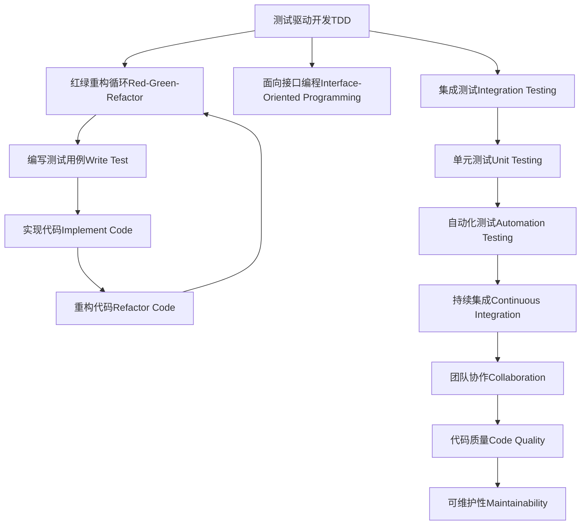

                 

### 文章标题

测试驱动开发（TDD）：提高代码质量与可维护性

### 关键词

测试驱动开发、代码质量、可维护性、红绿重构循环、单元测试、集成测试、自动化测试、持续集成

### 摘要

本文深入探讨了测试驱动开发（TDD）的核心概念和实践流程。通过阐述TDD的基本原则、实践流程以及编写高质量测试用例的技巧，我们揭示了TDD如何提高代码质量与可维护性。同时，本文还介绍了TDD所需的环境搭建、工具使用以及在实际项目中的应用，并通过具体案例分析，展示了TDD在实际开发中的价值。

## 第一部分：TDD基础与原则

### 第1章：测试驱动开发概述

#### 1.1 TDD的概念与背景

测试驱动开发（Test-Driven Development，简称TDD）是一种软件工程实践方法，它强调通过编写测试来驱动软件的开发过程。TDD的基本原则包括：编写测试、运行测试、编写代码和重构代码。TDD的出现是为了解决传统软件开发中的一些问题，如代码质量低、维护困难等。

#### 1.2 TDD的核心原则

1. **编写测试**：在编写功能代码之前，首先编写相应的测试用例，以确保代码能够满足预期功能。
2. **运行测试**：运行测试用例，确保所有测试都通过。
3. **编写代码**：在测试通过的基础上，编写实现功能的代码。
4. **重构代码**：在代码编写完成后，进行重构，以提高代码质量和可维护性。

#### 1.3 TDD与传统开发模式的比较

传统开发模式通常先编写代码，然后再进行测试。这种模式存在一些问题，如代码质量低、维护困难等。而TDD则通过先编写测试用例，再编写代码的方式，确保代码在开发过程中始终处于可控状态。

## 第二部分：TDD实践流程

### 第2章：TDD实践流程

#### 2.1 Red-Green-Refactor循环

红绿重构循环是TDD的核心实践流程。它包括以下三个步骤：

1. **红**：编写测试用例，并运行测试，确保测试失败（即显示“红色”）。
2. **绿**：编写代码，使测试通过（即显示“绿色”）。
3. **重构**：在测试通过后，重构代码，以提高代码质量和可维护性。

#### 2.2 集成测试与单元测试

1. **集成测试**：集成测试是将多个模块组合起来，对整个系统进行测试。其主要目的是确保模块之间的交互是正确的。
2. **单元测试**：单元测试是对单个模块或函数进行测试。其主要目的是确保模块或函数的功能是正确的。

#### 2.3 面向接口编程

面向接口编程是TDD中的重要实践。通过编写接口测试用例，我们可以确保模块或函数的实现是正确的，而无需关注具体的实现细节。

## 第三部分：编写高质量测试用例

### 第3章：编写高质量测试用例

#### 3.1 测试用例设计原则

1. **完整性原则**：确保所有功能点都被测试到。
2. **独立性原则**：每个测试用例应该独立，不依赖于其他测试用例的结果。
3. **可复现性原则**：测试用例应该能够在相同的条件下复现。
4. **可读性原则**：测试用例应该易于理解和维护。

#### 3.2 测试用例编写技巧

1. **边界值分析**：测试输入数据的边界情况。
2. **等价类划分**：将输入数据划分为多个等价类，针对每个等价类设计测试用例。
3. **异常情况测试**：测试程序在遇到异常情况时的表现。

## 第四部分：TDD工具与技术

### 第4章：TDD环境搭建

#### 4.1 开发工具的选择

选择合适的开发工具是进行TDD的前提。常见的开发工具有Eclipse、IntelliJ IDEA等。

#### 4.2 自动化测试框架

常见的自动化测试框架有JUnit、TestNG等。这些框架提供了丰富的测试功能，方便编写和运行测试用例。

#### 4.3 测试环境配置

测试环境配置包括数据库、服务器等。配置一个良好的测试环境，可以确保测试结果的准确性和可靠性。

## 第五部分：TDD工具与技术

### 第5章：TDD工具与技术

#### 5.1 JUnit与TestNG

JUnit和TestNG是常用的自动化测试框架。它们提供了丰富的测试功能和插件，方便编写和运行测试用例。

#### 5.2 Mock对象与测试双生子

Mock对象和测试双生子是TDD中的重要技术。通过使用Mock对象，我们可以模拟外部系统的交互，确保测试的独立性。

#### 5.3 Continuous Integration

持续集成是一种软件开发实践，它通过自动化构建和测试，确保代码的质量和可维护性。

## 第六部分：TDD在实际项目中的应用

### 第6章：TDD在大型项目中的应用

#### 6.1 项目架构设计

在大型项目中，TDD可以帮助我们更好地进行项目架构设计。通过编写接口测试用例，我们可以确保模块之间的交互是正确的。

#### 6.2 集团项目协作

在集团项目中，TDD可以帮助团队成员更好地协作。通过共享测试用例，团队成员可以更好地理解项目的需求。

#### 6.3 TDD在敏捷开发中的实践

在敏捷开发中，TDD可以帮助我们更快地响应变化。通过持续集成和自动化测试，我们可以确保代码的质量和可维护性。

## 第七部分：TDD案例分析

### 第7章：TDD案例分析

#### 7.1 案例一：电商平台重构

在本案例中，我们通过TDD的方法对电商平台进行了重构。通过编写测试用例，我们确保了代码的质量和可维护性。

#### 7.2 案例二：金融系统开发

在本案例中，我们使用TDD的方法开发了金融系统。通过自动化测试和持续集成，我们提高了代码的质量和可维护性。

#### 7.3 案例三：IoT设备管理平台

在本案例中，我们使用TDD的方法开发了IoT设备管理平台。通过面向接口编程和Mock对象，我们确保了系统的稳定性和可维护性。

## 附录：TDD资源与推荐

### 附录A：TDD相关书籍推荐

- 《测试驱动开发：敏捷开发实战》
- 《敏捷软件开发：原则、模式与实践》
- 《软件工程：实践者的研究方法》

### 附录B：TDD常用工具与资源链接

- JUnit官方网站：https://junit.org/junit5/
- TestNG官方网站：https://www.testng.org/
- 持续集成工具Jenkins：https://www.jenkins.io/
- Mock对象框架Mockito：https://site.mockito.org/

### 附录C：TDD实践指南

- 在开始TDD之前，确保了解项目的需求。
- 使用合适的开发工具和测试框架。
- 逐步实现功能，并确保每个功能都有对应的测试用例。
- 定期重构代码，提高代码质量和可维护性。

# TDD核心概念与联系流程图



# TDD核心算法原理

## 单元测试框架

```plaintext
// 单元测试框架伪代码
function assertEqual(actual, expected) {
  if (actual === expected) {
    console.log("测试通过");
  } else {
    console.error("测试失败，预期值：" + expected + "，实际值：" + actual);
  }
}

// 示例：测试一个简单的加法函数
function add(a, b) {
  return a + b;
}

function testAdd() {
  assertEqual(add(2, 3), 5); // 预期结果为5
  assertEqual(add(-1, 1), 0); // 预期结果为0
}
```

## 数学模型：测试覆盖率

$$
\text{测试覆盖率} = \frac{\text{已覆盖的代码行数}}{\text{总代码行数}} \times 100\%
$$

## 测试覆盖率评估示例

- 总代码行数：100行
- 已覆盖的代码行数：70行
- 测试覆盖率：$$ \frac{70}{100} \times 100\% = 70\% $$

## 测试用例设计原则

1. **完整性原则**：确保所有功能点都被测试到。
2. **独立性原则**：每个测试用例应该独立，不依赖于其他测试用例的结果。
3. **可复现性原则**：测试用例应该能够在相同的条件下复现。
4. **可读性原则**：测试用例应该易于理解和维护。

## 测试用例编写技巧

1. **边界值分析**：测试输入数据的边界情况。
2. **等价类划分**：将输入数据划分为多个等价类，针对每个等价类设计测试用例。
3. **异常情况测试**：测试程序在遇到异常情况时的表现。

---

## 作者

作者：AI天才研究院/AI Genius Institute & 禅与计算机程序设计艺术 /Zen And The Art of Computer Programming

