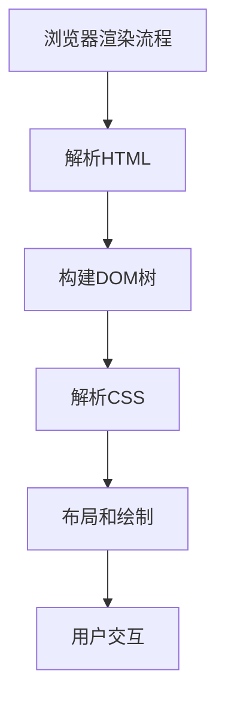

                 

# 《浏览器兼容性：跨浏览器开发策略》

## 关键词

- 浏览器兼容性
- 跨浏览器开发
- 浏览器内核
- CSS3
- JavaScript
- DOM 操作
- 响应式设计
- 自动化测试

## 摘要

本文深入探讨了浏览器兼容性在跨浏览器开发中的重要性。通过分析浏览器兼容性问题的来源、解决方案以及核心概念，本文提出了有效的跨浏览器开发策略。文章还详细讲解了CSS、JavaScript和DOM操作中的兼容性问题，并提供了一系列实用的开发技巧和优化策略。此外，本文通过实际案例展示了如何在实际项目中处理浏览器兼容性问题，并展望了未来浏览器兼容性的发展趋势。

## 第1章：浏览器兼容性问题概述

### 1.1 浏览器兼容性的意义

浏览器兼容性是保证Web应用在不同浏览器和设备上表现一致性的关键。随着Web技术的不断发展，浏览器间的差异和版本更新给开发者带来了诸多挑战。良好的浏览器兼容性不仅能提升用户体验，还能降低开发和维护成本。

### 1.2 浏览器兼容性问题的来源

1. **不同浏览器之间的差异**：不同浏览器（如Chrome、Firefox、Safari、Edge等）采用不同的渲染引擎，导致对Web标准的支持程度不同。
2. **不同版本浏览器之间的差异**：同一浏览器不同版本的更新，可能导致旧版本和新版本间的功能差异。
3. **移动设备与桌面设备的差异**：不同设备的屏幕尺寸、操作系统和硬件性能，导致对Web应用的渲染效果有所不同。

### 1.3 浏览器兼容性的解决方案

1. **自动化测试工具**：如Selenium、BrowserStack等，可以模拟不同浏览器和设备的运行环境，帮助开发者发现兼容性问题。
2. **Polyfills 和 Transpilers**：Polyfills用于填补浏览器中不支持的特性，而Transpilers则用于将现代JavaScript代码转换为旧版浏览器可识别的代码。
3. **响应式设计**：通过灵活的布局和适配策略，使Web应用能够适应不同设备和屏幕尺寸。

## 第2章：浏览器内核与技术发展

### 2.1 常见浏览器内核介绍

- **WebKit**：苹果公司开发的内核，广泛应用于Safari和Chrome等浏览器。
- **Blink**：由谷歌开发的内核，目前用于Chrome和Edge。
- **Trident**：微软开发的内核，用于Internet Explorer。
- **Gecko**：Mozilla公司开发的内核，用于Firefox。

### 2.2 浏览器技术发展趋势

- **HTML5、CSS3 和 JavaScript 的新特性**：如WebGL、WebAudio、Web Workers等。
- **渲染引擎优化**：通过硬件加速、图像处理优化等技术提升浏览器的性能。
- **移动端浏览器的发展**：针对移动设备的优化，如触控事件、Webview等。

## 第3章：核心概念与联系

### 3.1 核心概念原理和架构 Mermaid 流程图



### 3.2 跨浏览器开发的策略

1. **面向众生的开发理念**：关注用户的使用体验，而不是特定浏览器的性能。
2. **优先支持主流浏览器**：如Chrome、Firefox、Safari、Edge等。
3. **次要支持其他浏览器**：根据用户群体和使用频率进行选择。
4. **不支持老旧浏览器**：避免因老旧浏览器带来的兼容性问题，提高开发效率。

## 第4章：核心算法原理讲解

### 4.1 CSS 样式兼容性处理

```python
# 浮动与定位兼容性处理
if ('float' in style):
    if (style.float == 'left'):
        style.position = 'absolute'
    else:
        style.position = 'static'

# display 属性兼容性处理
if ('display' in style):
    if (style.display == 'flex'):
        style.display = 'block' if isOldBrowser else 'flex'
```

### 4.2 JavaScript 兼容性问题

```javascript
// 事件模型兼容性处理
var addEventListener = (element, type, listener) => {
    if (element.addEventListener) {
        element.addEventListener(type, listener);
    } else if (element.attachEvent) {
        element.attachEvent('on' + type, listener);
    }
};

// 客户端存储兼容性处理
var storage = {
    setItem: (key, value) => {
        if (window.localStorage) {
            window.localStorage.setItem(key, value);
        } else if (window.sessionStorage) {
            window.sessionStorage.setItem(key, value);
        }
    },
    getItem: (key) => {
        if (window.localStorage) {
            return window.localStorage.getItem(key);
        } else if (window.sessionStorage) {
            return window.sessionStorage.getItem(key);
        }
    }
};
```

### 4.3 DOM 操作兼容性

```javascript
// DOM 结构兼容性处理
function getElementsByTagName(tagName) {
    var elements = [];
    var allElements = document.getElementsByTagName('*');
    for (var i = 0; i < allElements.length; i++) {
        if (allElements[i].tagName.toLowerCase() == tagName.toLowerCase()) {
            elements.push(allElements[i]);
        }
    }
    return elements;
}

// DOM 属性和方法兼容性处理
var getElementsByClassName = (className) => {
    var elements = [];
    var allElements = document.getElementsByTagName('*');
    for (var i = 0; i < allElements.length; i++) {
        if (allElements[i].classList.contains(className)) {
            elements.push(allElements[i]);
        }
    }
    return elements;
};
```

## 第5章：数学模型和公式讲解

### 5.1 常用数学公式和公式讲解

```latex
$$
1+1=2
$$

$$
f(n) = n^2
$$
```

### 5.2 常用算法的数学模型

1. **贪心算法**：通过每次选择最优解，逐步逼近全局最优解。
2. **动态规划算法**：通过记录子问题的最优解，避免重复计算，提高算法效率。
3. **分治算法**：将问题划分为若干个子问题，分别求解，最后合并子问题的解。

## 第6章：项目实战

### 6.1 跨浏览器开发案例解析

**案例一：响应式网站开发**

**开发环境搭建：** 
- 使用Bootstrap框架进行响应式布局设计
- 配置自动化测试工具（如Selenium）进行跨浏览器测试

**源代码详细实现和代码解读：**

```html
<!DOCTYPE html>
<html>
<head>
    <title>响应式网站</title>
    <meta name="viewport" content="width=device-width, initial-scale=1">
    <link rel="stylesheet" href="https://maxcdn.bootstrapcdn.com/bootstrap/4.5.2/css/bootstrap.min.css">
    <script src="https://ajax.googleapis.com/ajax/libs/jquery/3.5.1/jquery.min.js"></script>
    <script src="https://cdnjs.cloudflare.com/ajax/libs/popper.js/1.16.0/umd/popper.min.js"></script>
    <script src="https://maxcdn.bootstrapcdn.com/bootstrap/4.5.2/js/bootstrap.min.js"></script>
</head>
<body>
    <div class="container">
        <h1 class="text-center">响应式网站</h1>
        <div class="row">
            <div class="col-12 col-sm-6 col-md-4">
                <div class="card">
                    <div class="card-body">
                        <h5 class="card-title">Card Title</h5>
                        <p class="card-text">Some quick example text to build on the card title and make up the bulk of the card's content.</p>
                    </div>
                </div>
            </div>
        </div>
    </div>
</body>
</html>
```

**代码应用解读与分析：** 
- 使用Bootstrap框架实现响应式布局，通过CSS3媒体查询实现不同屏幕尺寸的适配。
- 使用jQuery库简化DOM操作和事件处理。

**实际案例分析和详细讲解剖析：** 
- 分析不同浏览器和设备下的布局表现，发现并解决兼容性问题。

**项目小结：** 
- 通过响应式设计，实现了在不同浏览器和设备上的良好兼容性。
- 使用自动化测试工具确保代码在不同环境下的稳定性。

**最佳实践 tips、小结、注意事项、拓展阅读等内容：**
- 保持代码的简洁性和可读性。
- 定期更新浏览器兼容性测试策略。
- 学习并掌握常见的浏览器兼容性处理方法。

### 6.2 实战技巧与经验分享

1. **处理兼容性问题的最佳实践**：
   - 优先使用Web标准。
   - 使用Polyfills和Transpilers弥补浏览器不支持的特性。
   - 定期更新测试工具和浏览器版本。

2. **性能优化的策略**：
   - 使用缓存和懒加载技术。
   - 减少HTTP请求和文件大小。
   - 使用内容分发网络（CDN）。

## 第7章：浏览器兼容性测试与工具

### 7.1 自动化测试工具介绍

- **Selenium**：支持多种浏览器和操作系统，可实现跨浏览器测试。
- **BrowserStack**：提供云端测试环境，支持真实设备和模拟器。
- **CrossBrowserTesting**：提供丰富的浏览器和设备选择，支持实时测试。

### 7.2 Polyfills 和 Transpilers 的使用

- **Polyfills**：用于填充浏览器不支持的特性，如Promise、fetch等。
- **Transpilers**：如Babel，将现代JavaScript代码转换为旧版浏览器可识别的代码。

### 7.3 响应式设计的实践

- **响应式布局的实现**：使用CSS3媒体查询和Flexbox或Grid布局。
- **响应式图片和视频的处理**：使用HTML5的图片和视频标签，以及CSS的`background-size`和`background-position`属性。

## 第8章：未来趋势与展望

### 8.1 浏览器兼容性技术的发展

- **WebAssembly**：提供高性能的Web应用。
- **Service Workers**：实现离线缓存和推送通知。
- **Progressive Web Apps**：结合Web和原生应用的优势。

### 8.2 浏览器兼容性的未来挑战

- **移动端浏览器的碎片化**：需要更多针对移动端浏览器的兼容性测试。
- **边缘浏览器的兴起**：需要关注边缘计算环境下的兼容性问题。
- **Web标准的完善与更新**：需要持续学习和掌握新标准和特性。

## 作者

作者：AI天才研究院/AI Genius Institute & 禅与计算机程序设计艺术 /Zen And The Art of Computer Programming

### 结束语

本文旨在为开发者提供全面的浏览器兼容性解决方案，从理论基础到实战经验，帮助读者应对跨浏览器开发的挑战。随着Web技术的不断进步，浏览器兼容性问题将一直是开发中的重要议题。希望本文能为您在解决兼容性问题方面提供有益的启示。祝您在Web开发的道路上越走越远，不断提升技术水平！

