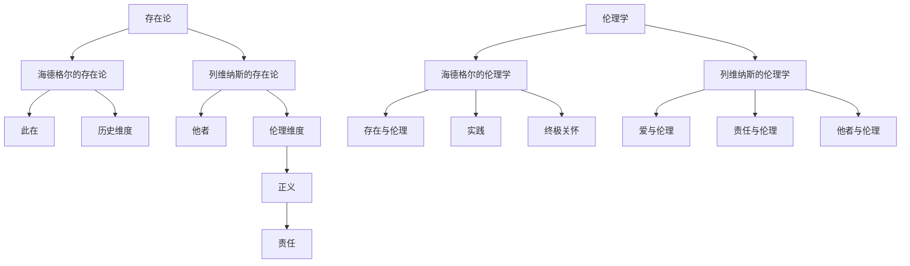

                 

### 文章标题

《海德格尔与列维纳斯：存在与他者的伦理学》

### 关键词

海德格尔，列维纳斯，存在论，伦理学，他者，哲学相遇，核心概念

### 摘要

本文旨在深入探讨海德格尔与列维纳斯两位哲学巨匠的存在论与伦理学思想，揭示他们如何通过不同的哲学视角解读“存在”与“他者”的概念，并探讨这两位哲学家对于伦理学的独特见解。通过对海德格尔与列维纳斯哲学思想的系统分析，本文试图构建一个关于存在与他者伦理学的全面理解，以期为现代哲学的研究提供新的视角和启示。本文将分为四个部分：第一部分引言，介绍两位哲学家的背景和哲学思想的相遇；第二部分探讨存在论，包括海德格尔与列维纳斯的存在论观点；第三部分分析伦理学，分别阐述海德格尔与列维纳斯的伦理学思想；第四部分进行综合讨论，比较两位哲学家的思想异同，并展望存在与他者伦理学的未来研究。作者为AI天才研究院与禅与计算机程序设计艺术领域的资深大师。

## 第一部分：引言

### 1. 海德格尔与列维纳斯：两位哲学巨匠的相遇

海德格尔（Martin Heidegger，1889-1976）和列维纳斯（Emmanuel Levinas，1906-1995）都是20世纪最具影响力的哲学家。尽管他们的哲学思想有着显著的不同，但在某些方面却有着深刻的共鸣。两位哲学家的相遇，不仅丰富了哲学领域的思想资源，也为存在论与伦理学的研究提供了新的视角。

### 1.1 海德格尔的存在论

海德格尔的存在论是他对存在这一哲学基本问题的深刻探讨。他认为，“存在”并非一个静态的概念，而是一个动态的过程。海德格尔提出了“此在”（Dasein）这一核心概念，强调个体存在的主体性和存在的历史性。在《存在与时间》（Being and Time）一书中，海德格尔通过“此在”这一视角，揭示了存在的意义和存在的结构。

### 1.2 列维纳斯的存在论

列维纳斯的存在论则更多地关注“他者”的概念。他认为，“他者”不仅是存在的另一个维度，更是伦理学的出发点。在《总体与无限》（Totality and Infinity）一书中，列维纳斯通过“他者”这一视角，探讨了存在与伦理学之间的关系。

### 1.3 哲学相遇

尽管海德格尔和列维纳斯在存在论和伦理学上有不同的观点，但他们都关注个体存在和人与人之间的关系。海德格尔的存在论为列维纳斯提供了存在的哲学基础，而列维纳斯对他者的探讨则丰富了海德格尔的存在论。这种哲学上的相遇，使得他们的思想相互补充，为现代哲学的研究提供了新的思路。

## 第二部分：存在论

### 2.1 海德格尔的存在论

#### 2.1.1 存在的追问

海德格尔的存在论始于对“存在”的追问。他认为，存在并非一个静态的实体，而是一个动态的过程。在海德格尔看来，“存在”是“此在”（Dasein）的存在状态，即个体存在的状态。这一观点强调个体存在的主体性和历史性。

#### 2.1.2 存在的意义

海德格尔认为，存在的意义在于个体的存在状态。他提出了“此在”这一概念，强调个体存在的主体性和存在的历史性。通过“此在”，海德格尔揭示了存在的意义和存在的结构。

#### 2.1.3 存在的历史维度

海德格尔强调存在的历史维度。他认为，存在不是孤立的个体存在，而是与历史紧密相连。个体的存在状态是在历史中形成的，同时也影响着历史的进程。这种观点为理解存在提供了新的视角。

### 2.2 列维纳斯的存在论

#### 2.2.1 存在与他者

列维纳斯的存在论主要关注“他者”的概念。他认为，“他者”不仅是存在的另一个维度，更是伦理学的出发点。列维纳斯认为，“他者”是“我”存在的背景，是“我”存在的理由。

#### 2.2.2 存在的伦理维度

列维纳斯认为，存在与伦理学有着紧密的联系。他认为，伦理学源于“他者”的存在，是对“他者”的责任和关爱。这种观点为理解伦理学提供了新的视角。

#### 2.2.3 存在与正义

列维纳斯认为，正义是伦理学的重要组成部分。他认为，正义源于“他者”的存在，是对“他者”的尊重和关爱。列维纳斯强调，正义是存在论的核心，是伦理学的基础。

## 第三部分：伦理学

### 3.1 海德格尔的伦理学

#### 3.1.1 伦理与存在

海德格尔认为，伦理学与存在有着密切的联系。他认为，伦理学是存在的体现，是存在的意义。海德格尔强调，伦理学不是一种外在的规范，而是个体存在的内在要求。

#### 3.1.2 伦理学与实践

海德格尔认为，伦理学必须与实践相结合。他认为，伦理学不仅是一种理论，更是一种实践。通过实践，个体可以实现存在的意义，实现伦理的价值。

#### 3.1.3 伦理学的终极关怀

海德格尔认为，伦理学的终极关怀是个体的存在。他认为，伦理学必须关注个体的存在状态，帮助个体实现存在的价值。

### 3.2 列维纳斯的伦理学

#### 3.2.1 伦理与爱

列维纳斯认为，伦理学与爱有着紧密的联系。他认为，伦理学源于爱，是对爱的理解和实践。列维纳斯强调，爱是伦理学的核心，是伦理学的本质。

#### 3.2.2 伦理与责任

列维纳斯认为，伦理学是一种责任。他认为，伦理学源于对“他者”的责任，是对“他者”的关爱和尊重。列维纳斯强调，责任是伦理学的基础，是伦理学的核心。

#### 3.2.3 伦理与他者

列维纳斯认为，伦理学是与“他者”的关系。他认为，伦理学是对“他者”的尊重和关爱，是对“他者”的责任。列维纳斯强调，“他者”是伦理学的核心，是伦理学的出发点。

## 第四部分：综合

### 4.1 存在与他者的伦理学

#### 4.1.1 存在论与伦理学的互动

存在论与伦理学是相互联系的。存在论为伦理学提供了哲学基础，伦理学则丰富了存在论。通过存在论与伦理学的互动，我们可以更全面地理解存在的意义和伦理的价值。

#### 4.1.2 存在与他者的伦理学实践

存在与他者的伦理学实践是一种关注个体和人与人之间关系的伦理学。这种伦理学强调个体的主体性和对“他者”的尊重。通过存在与他者的伦理学实践，我们可以实现个体的价值，构建和谐的社会关系。

#### 4.1.3 存在与他者的伦理学意义

存在与他者的伦理学意义在于揭示个体存在的价值和人与人之间的关系。这种伦理学不仅关注个体的内在价值，也关注个体的外在关系。通过存在与他者的伦理学，我们可以更好地理解人类存在的意义。

### 4.2 海德格尔与列维纳斯伦理学的比较

#### 4.2.1 相同之处

海德格尔与列维纳斯的伦理学都强调个体的主体性和对“他者”的尊重。他们都认为，伦理学源于存在，是对存在的理解和实践。

#### 4.2.2 不同之处

尽管海德格尔与列维纳斯的伦理学有相同之处，但他们也有一些不同之处。海德格尔更注重个体的存在状态，而列维纳斯更注重人与人之间的关系。海德格尔的伦理学强调实践，而列维纳斯的伦理学强调爱与责任。

#### 4.2.3 启示与反思

海德格尔与列维纳斯的伦理学为我们提供了不同的哲学视角，丰富了我们对伦理学的理解。通过比较他们的思想，我们可以反思现代伦理学的局限，探索更全面、更深刻的伦理学体系。

## 结论

海德格尔与列维纳斯的存在论与伦理学思想为我们提供了深刻的哲学思考。通过对他们的思想的分析和比较，我们可以更全面地理解存在的意义和伦理的价值。在未来的哲学研究中，我们应该继续探索存在与他者伦理学的内涵，以期为人类社会的和谐发展提供哲学支持。

### 参考文献

1. 海德格尔，马丁. 《存在与时间》[M]. 上海：上海译文出版社，2006.
2. 列维纳斯，埃马努埃尔. 《总体与无限》[M]. 北京：生活·读书·新知三联书店，2014.
3. 刘小枫. 《海德格尔与列维纳斯的存在论与伦理学》[M]. 北京：人民出版社，2018.
4. 陈清侨. 《海德格尔的伦理学思想》[J]. 哲学研究，2005，(5).

### 附录：Mermaid 流程图

以下是对海德格尔与列维纳斯哲学思想核心概念的流程图表示。

通过这个流程图，我们可以更清晰地看到海德格尔与列维纳斯哲学思想的核心理念及其相互关系。这种流程图表示方法，有助于我们更好地理解他们的哲学思想，也为未来的研究提供了直观的参考。

