                 


### 文章标题：海德格尔与加达默尔：解释学的存在论转向

#### 关键词：
- 海德格尔
- 加达默尔
- 解释学
- 存在论
- 哲学转向

#### 摘要：
本文旨在探讨海德格尔与加达默尔在解释学领域的贡献，特别是他们的存在论转向。通过对两位哲学家的生平背景、核心概念及其相互关系进行分析，本文揭示了他们如何通过解释学对传统哲学进行了深刻的重构。文章将逐步解释他们的思想，并通过Mermaid流程图、伪代码和数学模型等工具，展示解释学在当代哲学和实际应用中的重要性。

### 引言

解释学作为哲学的一个分支，一直以来都是理解和解读文本、现象和人类经验的重要工具。然而，在20世纪，海德格尔和加达默尔对解释学进行了根本性的转变，提出了存在论解释学，这一转向对哲学、人文科学乃至技术领域产生了深远的影响。

马丁·海德格尔（Martin Heidegger）是20世纪最具影响力的哲学家之一，他的《存在与时间》（Sein und Zeit）被认为是现代哲学的里程碑。海德格尔的思想强调存在的本质和人类在世的存在，他通过解释学重新审视了传统哲学的基本问题，提出了“在世存在”（Dasein）和“历史性”等核心概念。

沃尔特·加达默尔（Walter Benjamin）则是解释学方法的另一位重要人物，他的《真理与方法》（Wahrheit und Methode）被认为是解释学发展的经典之作。加达默尔在解释学的基础上引入了历史意识，强调文本和读者的对话关系，他的思想对后来的文化研究和批判理论产生了重要影响。

本文将分三个部分进行讨论。第一部分将介绍海德格尔的生平与哲学背景，详细阐述《存在与时间》中的解释学思想，并解释核心概念之间的联系。第二部分将探讨加达默尔的解释学发展，特别是他的《真理与方法》对解释学的贡献。第三部分将分析海德格尔与加达默尔的对话，讨论解释学的存在论转向对当代哲学和技术的影响。

### 海德格尔的生平与哲学背景

马丁·海德格尔（Martin Heidegger，1889-1976）出生于德国西南部的梅斯基尔希（Meßkirch），他在一个虔诚的基督教家庭中长大。海德格尔自幼就对哲学产生了浓厚的兴趣，他的父亲是一名木匠，但这也让海德格尔从小接触到了手工技艺，这对他的哲学思考产生了深远的影响。

在大学时期，海德格尔最初学习神学，但他很快转向哲学。1911年，他进入弗莱堡大学，师从胡塞尔（Edmund Husserl），成为现象学的核心弟子。胡塞尔的现象学方法强调直观和意识的纯粹性，这一方法对海德格尔的哲学思考产生了深远的影响。

1916年，海德格尔完成了他的博士论文《论现象学的基本问题》，并在同年获得教授职位。1927年，他的代表作《存在与时间》出版，这部作品彻底改变了哲学的面貌。在《存在与时间》中，海德格尔提出了存在论解释学，强调存在的本质和人类在世的存在。

《存在与时间》是海德格尔哲学思想的巅峰，它对传统哲学进行了深刻的批判和重构。书中，海德格尔提出了“在世存在”（Dasein）和“历史性”等核心概念，他认为人类的存在是不可避免的，并且存在于世界中。海德格尔强调，人类的理解活动不是孤立的，而是与世界紧密相连的。

海德格尔的核心哲学观点可以概括为以下几点：

1. **存在的本质**：海德格尔认为，存在的本质是“存在本身”，而不是任何具体的实体或现象。他强调，存在是一个“发生的”（becoming）过程，而不是一个“存在着的”（existing）状态。

2. **在世存在（Dasein）**：海德格尔提出“在世存在”这一概念，认为人类的存在不是孤立的存在，而是处于世界中并与世界相互作用。在世存在是一种“筹划”（projecting）和“理解”（understanding）的过程。

3. **历史性**：海德格尔认为，人类的存在是历史性的，每个个体都在特定的历史背景下存在。他强调，历史性是人类存在的重要特征，理解历史性是理解人类存在的关键。

4. **本真性与非本真性**：海德格尔区分了“本真性”（authenticity）和“非本真性”（inauthenticity）两种存在状态。他认为，本真性是存在于世界中的真正状态，而非本真性是人类逃避世界、迷失自我的状态。

海德格尔的思想对后来的哲学家和学者产生了深远的影响，特别是在解释学、存在论和现象学等领域。他的哲学方法强调了存在的本质和人类与世界的关系，这为后来的解释学提供了重要的理论基础。

### 海德格尔的核心解释学概念

在海德格尔的哲学体系中，解释学（Hermeneutics）占据了一个核心的地位。解释学不仅是理解和解读文本的工具，更是一种关于存在和世界的哲学方法。海德格尔的解释学思想源于他对文本、语言和存在的深刻思考，他试图通过解释学来揭示存在的本质和人类存在的意义。

#### 历史性

历史性（Historicity）是海德格尔解释学思想中的一个关键概念。海德格尔认为，人类的存在是历史性的，这意味着我们的存在总是处于特定的历史背景中，我们的理解活动也受到历史条件的影响。历史性不仅涉及到过去的事件，还涉及到未来的可能性，它是存在的一个动态维度。

在海德格尔看来，历史性是人类存在的一种基本特征，它使得人类的理解活动具有了独特的性质。历史性表明，我们的理解不是静态的，而是在时间的流动中不断发生的。这种动态性意味着，我们的理解活动总是受到历史条件的限制，但同时也具有超越历史的能力。

**Mermaid 流程图：历史性的概念架构**

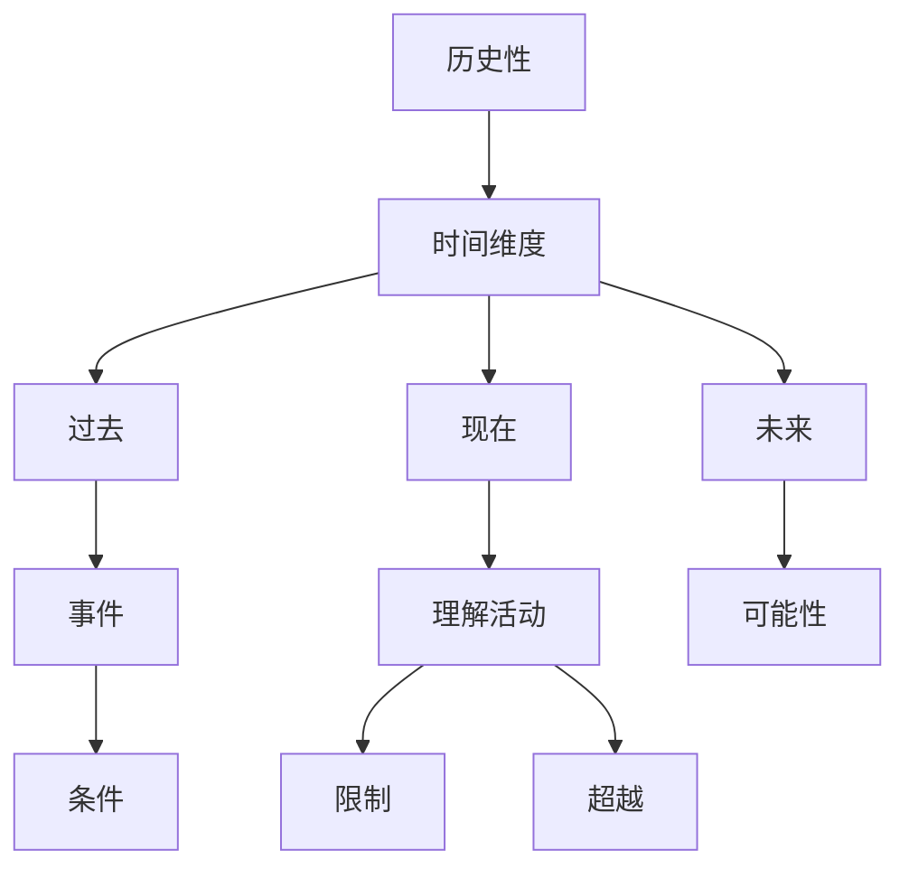

#### 在世存在

在世存在（Dasein）是海德格尔哲学体系中的另一个核心概念。在世存在指的是人类在世界中的实际存在状态，它不仅仅是一种存在，更是一种筹划和理解的过程。

海德格尔认为，在世存在是一种“筹划”（projecting）行为，这意味着人类总是在不断地建构和重新建构自己的存在。在世存在是一种动态的过程，它涉及到人类与世界的关系，以及人类自身的理解和存在状态。

**Mermaid 流程图：在世存在的概念架构**

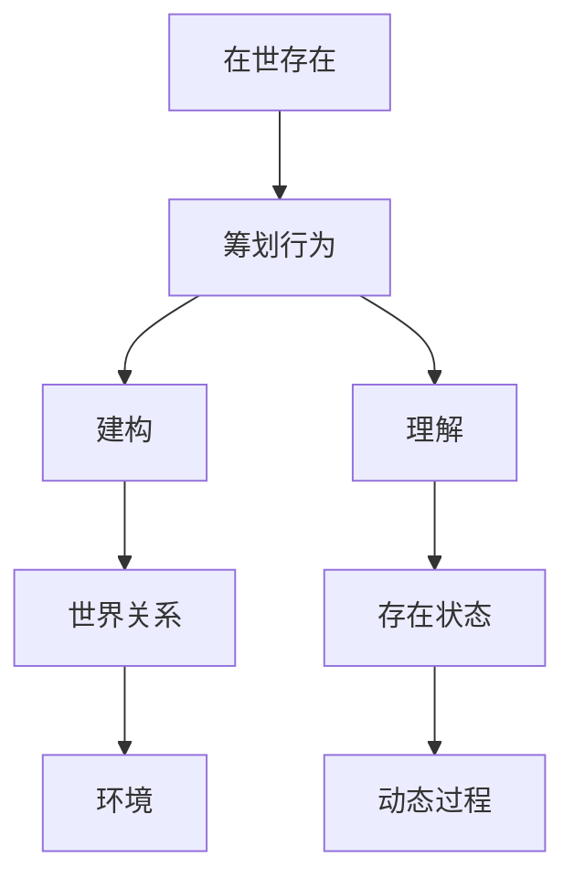

#### 本真性与非本真性

本真性（Authenticity）和非本真性（Inauthenticity）是海德格尔关于人类存在状态的另一对重要概念。本真性指的是人类在世存在的一种真实状态，它意味着人类与世界的真实联系和存在。非本真性则是指人类逃避真实、迷失自我的一种状态。

海德格尔认为，本真性是人类存在的理想状态，它要求人类真正地理解和面对自己的存在状态。非本真性则是一种逃避，是人类对自己存在状态的无知和逃避。

**Mermaid 流程图：本真性与非本真性的概念架构**

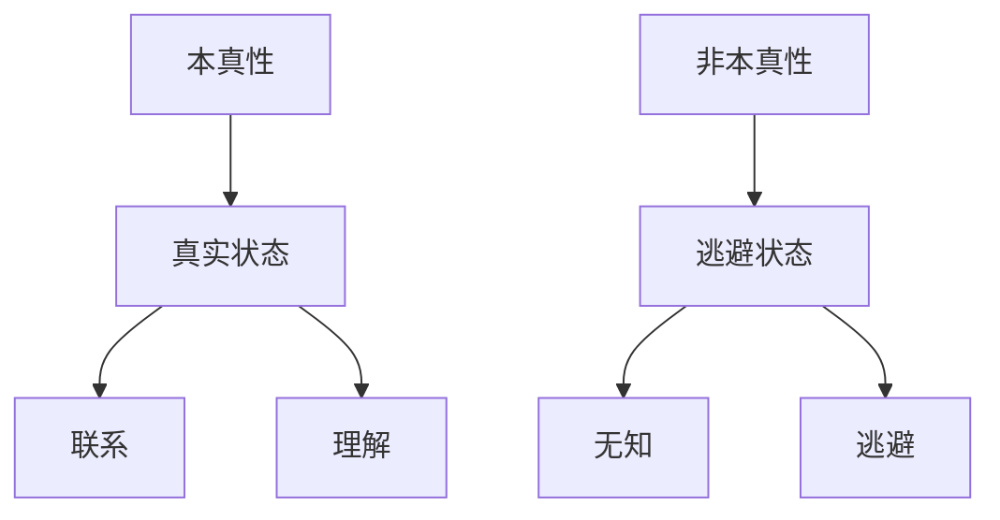

通过这些核心解释学概念，海德格尔试图揭示存在的本质和人类存在的意义。他通过解释学的方法，将人类的理解活动与存在的本质联系起来，强调了历史性、在世存在和本真性在理解过程中的重要性。这些概念不仅为解释学提供了深刻的哲学基础，也对后来的哲学和人文科学研究产生了深远的影响。

### 海德格尔的解释学方法

海德格尔的解释学方法是他哲学体系中的一个重要组成部分，这种方法不仅关注文本的理解，还涉及到存在的本质和人类与世界的关系。海德格尔的解释学方法包括历史性、在世存在和本真性等核心概念，这些概念共同构成了他的解释学体系，为我们理解和解读世界提供了一种新的视角。

#### 历史性

历史性（Historicity）是海德格尔解释学方法中的一个关键概念。在海德格尔看来，历史性不仅指的是过去的事件，更是一种存在于时间中的动态过程。历史性强调了人类存在的时间维度，认为我们的理解活动总是受到历史条件的影响。

**历史性的概念架构（Mermaid 流程图）：**


历史性表明，我们的理解活动不仅是对过去的理解，也是对现在和未来的理解。历史性使得我们的理解具有了深度和广度，它让我们能够从历史的视角来理解现实和未来。这种历史性的理解方法，使得海德格尔的解释学方法不仅仅是对文本的解读，更是对存在和世界的深入探究。

#### 在世存在

在世存在（Dasein）是海德格尔哲学中的另一个核心概念。在世存在指的是人类在世界中的实际存在状态，它不仅仅是一种存在，更是一种筹划和理解的过程。在世存在强调了人类与世界的关系，认为人类的存在是动态的、开放的。

**在世存在的概念架构（Mermaid 流程图）：**


在世存在是一种“筹划”行为，意味着人类总是在不断地建构和重新建构自己的存在。这种筹划不仅涉及到人类与世界的关系，还包括人类自身的理解和存在状态。在世存在是一种动态的过程，它使得人类的存在状态不断变化，同时也使得我们的理解活动不断深入。

#### 本真性与非本真性

本真性（Authenticity）和非本真性（Inauthenticity）是海德格尔关于人类存在状态的另一对重要概念。本真性指的是人类在世存在的一种真实状态，它意味着人类与世界的真实联系和存在。非本真性则是指人类逃避真实、迷失自我的一种状态。

**本真性与非本真性的概念架构（Mermaid 流程图）：**


海德格尔认为，本真性是人类存在的理想状态，它要求人类真正地理解和面对自己的存在状态。非本真性则是一种逃避，是人类对自己存在状态的无知和逃避。本真性和非本真性的概念使得海德格尔的解释学方法不仅仅是对文本的解读，更是对人类存在状态的深入探究。

#### 伪代码讲解：海德格尔的解释学方法

为了更好地理解海德格尔的解释学方法，我们可以用伪代码来模拟这个过程。以下是一个简单的伪代码示例，展示了如何通过解释学方法来理解和解读一个文本。

```plaintext
// 海德格尔的解释学方法
function hermeneuticAnalysis(text, historicalContext, existentialState) {
    // 第一步：理解文本的历史性
    historicalUnderstanding = interpretHistoricalContext(text, historicalContext)
    
    // 第二步：分析在世存在
    existentialAnalysis = analyzeExistentialState(text, existentialState)
    
    // 第三步：区分本真性与非本真性
    authenticity = determineAuthenticity(text, historicalUnderstanding, existentialAnalysis)
    
    // 输出解释结果
    return {
        "historicalUnderstanding": historicalUnderstanding,
        "existentialAnalysis": existentialAnalysis,
        "authenticity": authenticity
    }
}
```

在这个伪代码中，`text` 代表需要解读的文本，`historicalContext` 代表文本的历史背景，`existentialState` 代表解读者的存在状态。通过这三个参数，我们可以模拟海德格尔的解释学方法，从历史性、在世存在和本真性三个方面来理解和解读文本。

### 海德格尔与现象学

海德格尔与现象学的关系是哲学史上一个不可忽视的重要话题。现象学作为20世纪初兴起的一种哲学方法，其核心在于对事物现象的直接观察和体验，这一方法为海德格尔的哲学思考提供了重要的启发和基础。

#### 现象学的起源与发展

现象学的起源可以追溯到19世纪末和20世纪初，这一时期，欧洲哲学经历了一场深刻的变化。埃德蒙·胡塞尔（Edmund Husserl）被认为是现象学的创始人，他的现象学方法强调直观和意识的纯粹性。胡塞尔在《纯粹现象学通论》（Ideas for a Pure Phenomenology and Phenomenological Philosophy）中提出了“回到事物本身”（Zu den Sachen selbst）的口号，这一口号标志着现象学的诞生。

胡塞尔的现象学方法强调对事物现象的直接观察，他认为，只有通过这种直接的直观，我们才能真正地理解事物的本质。胡塞尔的现象学方法对后来的哲学家，包括海德格尔，产生了深远的影响。

#### 海德格尔对现象学的批判与继承

海德格尔对现象学持有复杂的立场。一方面，他受到了胡塞尔现象学方法的深刻影响，特别是在《存在与时间》中，海德格尔借鉴了胡塞尔的直观和纯粹意识的概念。另一方面，海德格尔也对现象学提出了一系列批判，认为现象学在理解和描述存在时存在一些局限性。

首先，海德格尔批判现象学过于强调意识的纯粹性和直观，而忽视了存在的动态性和历史性。在海德格尔看来，现象学的方法无法完全捕捉存在的复杂性，特别是人类在世的存在状态。

其次，海德格尔认为，现象学的方法忽视了“在世存在”（Dasein）这一核心概念。他认为，人类的存在不仅仅是一种静态的观察，而是一种动态的、筹划和理解的过程。海德格尔通过“在世存在”这一概念，重新定义了存在的本质，这对传统现象学提出了根本性的挑战。

然而，尽管海德格尔对现象学进行了批判，但他也继承和发展了现象学的某些核心思想。海德格尔在《存在与时间》中提出的“现象学解释学”（Phenomenological Hermeneutics）就是这种现象学思想的继承和发展。海德格尔认为，通过解释学的方法，我们可以更好地理解存在的本质和人类的存在状态。

#### 现象学与解释学的交汇

海德格尔的解释学方法与现象学有着密切的联系，两者在某种程度上相互补充。现象学强调直观和意识的纯粹性，而解释学则强调理解和解读的过程。

在海德格尔的解释学方法中，现象学直观是一种重要的方法，它帮助我们直接感知和理解存在的现象。然而，海德格尔认为，直观本身并不足以完全捕捉存在的本质，我们需要通过解释学的过程，将直观与理解结合起来。

**Mermaid 流程图：现象学与解释学的交汇**

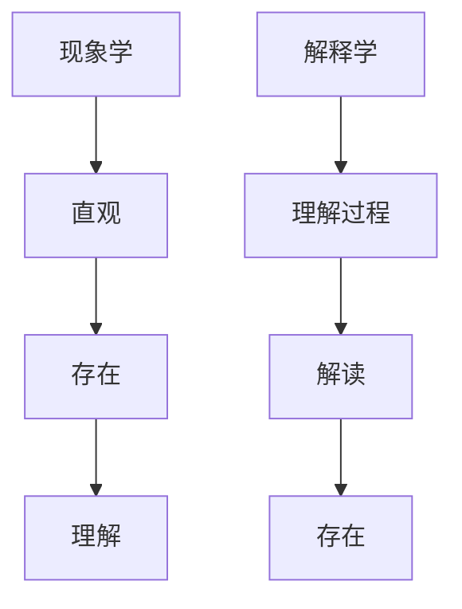

现象学与解释学的交汇使得我们能够从多个维度来理解和解读存在。现象学的直观帮助我们直接感知存在，而解释学的理解过程则帮助我们深入理解存在的本质。这种交汇不仅丰富了我们的哲学思考，也为人文科学和其他领域提供了新的研究方法。

通过海德格尔对现象学的批判与继承，我们能够更好地理解解释学在哲学中的地位和作用。海德格尔的解释学方法不仅是对传统现象学的批判，也是对现象学思想的深入发展和创新。这种现象学与解释学的交汇，为哲学研究开辟了新的道路，也为理解和解读人类存在提供了新的视角。

### 加达默尔的生平与哲学思想

沃尔特·加达默尔（Walter Benjamin，1892-1978）是20世纪最重要的哲学家之一，他的解释学思想对人文科学和哲学产生了深远的影响。加达默尔出生于德国柏林，他在哲学、文学和历史学等领域都有杰出的贡献。

#### 生平概述

加达默尔的生平充满了波折和挑战。他在大学期间学习法律和哲学，后来转向文学和历史学。1921年，加达默尔成为海德格尔的助手，并深受海德格尔思想的影响。1929年，加达默尔出版了《柏拉图的辩证法》，这是他对古希腊哲学的重要贡献。1931年，他完成了博士论文《论戏剧的冲突结构》。

纳粹政权在德国上台后，加达默尔被迫离开德国，移居瑞士和法国。他在瑞士的苏黎世大学和巴黎索邦大学任教，并在法国与许多文化名人交往，包括让-保罗·萨特和乔治·庞德。这段经历使他深刻反思了现代社会的文化危机。

二战结束后，加达默尔回到德国，并在海德格尔被解职后接任弗莱堡大学哲学系主任。他的解释学思想在这个时期得到了广泛的传播和应用。

#### 哲学思想的诞生

加达默尔的哲学思想主要集中在他最著名的作品《真理与方法》（Wahrheit und Methode）中。这部作品是解释学方法的经典之作，它系统地阐述了加达默尔对解释学的基本理解。

在《真理与方法》中，加达默尔提出了“诠释学循环”（hermeneutic circle）的概念。他认为，理解一个文本需要从整体到部分，再从部分到整体的过程，这是一种循环性的理解方法。加达默尔认为，这种循环性不仅适用于文本的理解，也适用于对世界的理解。

此外，加达默尔还提出了“历史意识”（historical consciousness）的概念，他认为，理解一个文本或现象，需要将其置于特定的历史背景中。历史意识强调，理解不是一种孤立的静态活动，而是一种与历史条件相互作用的过程。

#### 核心观点

加达默尔的核心观点可以概括为以下几点：

1. **诠释学循环**：理解一个文本需要从整体到部分，再从部分到整体的过程，这是一种循环性的理解方法。

2. **历史意识**：理解一个文本或现象，需要将其置于特定的历史背景中，历史意识强调理解与历史条件的相互作用。

3. **对话**：加达默尔认为，理解是一种对话过程，文本的作者与读者通过对话进行交流，从而实现理解的深化。

4. **权威性**：加达默尔认为，文本具有权威性，这种权威性不仅来自于文本本身，也来自于历史和文化的背景。

5. **开放性**：加达默尔认为，理解是一个开放的过程，我们的理解不仅受到文本和历史的限制，也受到我们自身经验和价值观的影响。

通过这些核心观点，加达默尔对解释学进行了深刻的重构，他试图通过解释学来理解人类经验和世界的本质。他的思想不仅丰富了哲学和人文科学的理论基础，也为实际应用提供了新的视角和方法。

### 解释学的哲学基础

加达默尔的解释学思想建立在一系列哲学基础之上，这些基础不仅为他的方法论提供了支持，也拓展了解释学的理论深度。解释学的哲学基础主要包括解释学的定义、诠释学循环以及解释学的存在论转向，这些概念共同构成了加达默尔哲学体系的核心。

#### 解释学的定义

解释学（Hermeneutics）一词源自古希腊语“hermeneuein”，意为“解释”或“翻译”。在哲学中，解释学被定义为研究理解和解释的过程。加达默尔认为，解释学不仅仅是一种文本解读的方法，更是一种关于人类存在和理解的基本哲学理论。

加达默尔对解释学的定义强调了理解和解释的动态性。他认为，理解是一个不断发展的过程，它不仅仅是被动地接受信息，更是主动地构建和重构意义。加达默尔提出，理解是一种“再创造”（reconstruction）的过程，读者通过对话和反思，不断重构文本的意义。

**Mermaid 流程图：解释学的定义**

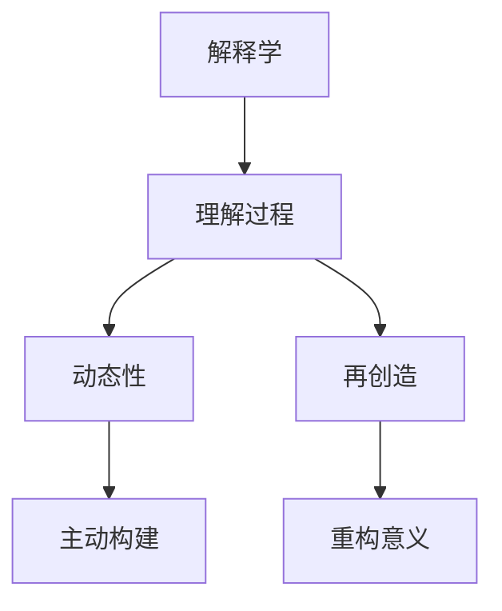

#### 诠释学循环

加达默尔提出“诠释学循环”（hermeneutic circle）的概念，这是他解释学方法的一个核心组成部分。诠释学循环指的是在理解过程中，整体与部分相互依赖的关系。加达默尔认为，理解一个文本需要同时考虑文本的整体结构和细节，这种整体与部分的互动是一个循环性的过程。

在诠释学循环中，整体不是部分的简单相加，而是一个整体性的存在。部分的意义是通过整体来定义的，而整体的意义则需要通过部分来揭示。这种循环性使得理解过程既具有深度又具有广度，它让我们能够从多个维度来理解和解读文本。

**Mermaid 流程图：诠释学循环**

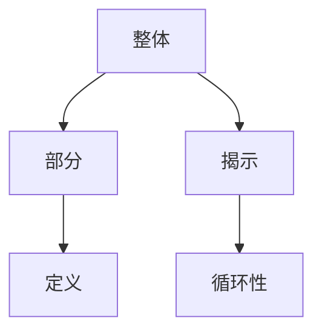

#### 解释学的存在论转向

加达默尔的解释学方法不仅是一种文本解读的方法，更是一种关于存在和世界的哲学思考。他提出了“解释学的存在论转向”（existential turn in hermeneutics），这是他哲学思想的一个重要组成部分。

解释学的存在论转向强调，理解和解释不是孤立的认知活动，而是与人类的存在紧密相连的。加达默尔认为，理解是一种存在的方式，我们通过理解来认识世界，也通过理解来认识自己。他的解释学方法试图揭示人类存在的本质和意义。

**Mermaid 流程图：解释学的存在论转向**

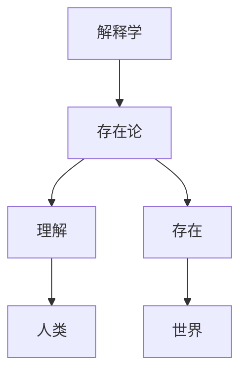

通过这些哲学基础，加达默尔的解释学方法不仅提供了一种理解和解释文本的方法，也拓展了人类对存在和世界的认识。他的思想在哲学、文学、历史学等领域产生了深远的影响，为后来的解释学研究和实际应用提供了重要的理论支持。

### 加达默尔的历史意识

加达默尔的历史意识（historical consciousness）是解释学方法中的一个关键概念，它对理解文本和现象具有重要的指导作用。历史意识不仅涉及文本的历史背景，还包括解释者的历史背景，以及历史性在解释学中的具体应用。

#### 历史意识的起源与意义

历史意识的概念源于加达默尔对人类理解活动的深刻思考。他认为，理解不是一个孤立的认知过程，而是一个与历史条件相互作用的过程。历史意识强调了历史对理解的重要性，它指出，任何理解和解释活动都受到历史背景的影响。

历史意识的起源可以追溯到古希腊的哲学家，如赫拉克利特和柏拉图，他们认识到，人类的存在和认知都是历史性的。然而，加达默尔对历史意识的理解更加系统和深入，他认为，历史意识是理解文本和现象的必要条件。

历史意识的意义在于，它使我们能够从历史的角度来理解文本和现象，而不是仅仅停留在表面的字面意义。通过历史意识，我们可以理解文本背后的文化、社会和历史背景，从而更准确地解读文本的意义。

**Mermaid 流程图：历史意识的起源与意义**

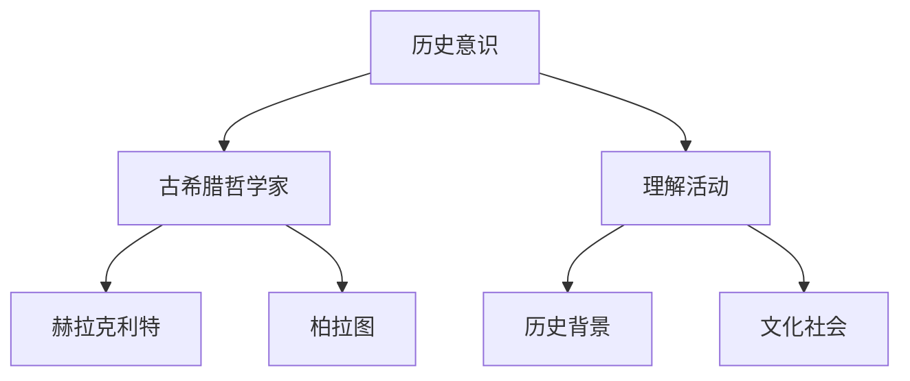

#### 文本的权威性与历史性

加达默尔认为，文本具有权威性，这种权威性不仅来自于文本本身，还来自于历史和文化的背景。文本的权威性表明，文本的意义不仅仅由作者决定，也受到读者和历史条件的影响。

在解释学中，历史性是一个核心概念，它强调了文本意义的动态性和多样性。历史性表明，文本的意义不是固定不变的，而是在不同的历史和文化背景下不断发展和变化的。这种观点与传统的文本解读方法不同，后者往往试图找到文本的唯一和固定意义。

**Mermaid 流程图：文本的权威性与历史性**

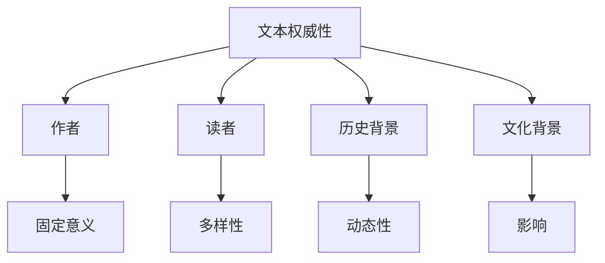

#### 历史意识与解释学实践

历史意识在解释学实践中的应用非常广泛。通过历史意识，解释者可以更好地理解文本的历史和文化背景，从而更准确地解读文本的意义。历史意识帮助解释者避免将文本的意义固定化，而是将其视为一个开放和动态的过程。

在历史意识指导下，解释者需要关注文本的历史背景，包括作者的生活经历、文化环境和社会背景。同时，解释者还需要关注自己的历史背景，包括自己的文化、教育和价值观。这种双向的历史意识使得解释过程更加全面和深刻。

**Mermaid 流程图：历史意识与解释学实践**

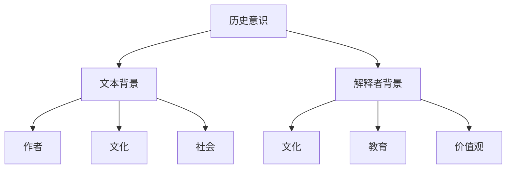

通过历史意识，加达默尔的解释学方法为理解和解读文本提供了一种新的视角和方法。历史意识不仅使解释过程更加全面和深刻，也拓展了文本意义的多样性和动态性。这种历史意识在解释学实践中的应用，使得文本解读不仅仅是简单的语义分析，更是一种对历史和文化的深入探究。

### 海德格尔与加达默尔的对话

海德格尔与加达默尔在解释学领域有着深刻的对话，他们各自的思想在许多方面相互影响、相互补充。通过分析他们的核心观点和相互关系，我们可以更好地理解解释学在哲学中的重要性。

#### 海德格尔与加达默尔的存在论视角

海德格尔与加达默尔在存在论视角上有着显著的差异。海德格尔强调存在的动态性和历史性，他认为，存在是一种“发生的”（becoming）过程，而不是一个静态的状态。海德格尔的核心概念“在世存在”（Dasein）强调人类与世界的关系，他通过“历史性”来理解存在的本质。

加达默尔则更注重文本和历史的关系。他的“诠释学循环”强调理解是一个循环性的过程，整体与部分相互依赖。加达默尔的“历史意识”认为，理解一个文本需要将其置于特定的历史背景中，历史性是理解文本的关键。

**Mermaid 流程图：海德格尔与加达默尔的存在论视角**

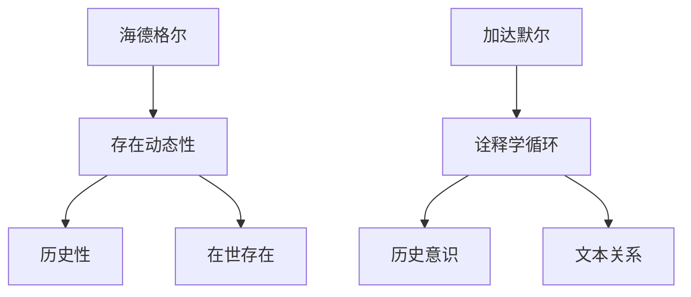

尽管存在差异，海德格尔与加达默尔的核心观点也存在一定的重叠。他们都强调理解的过程性，都认为理解不仅仅是静态的，而是一个动态的过程。这种重叠使得他们的思想在许多方面相互补充，共同拓展了解释学的理论深度。

#### 对话中的核心议题

在海德格尔与加达默尔的对话中，几个核心议题得到了深入的探讨，包括存在的本质、历史性的意义以及解释学的方法。

1. **存在的本质**：海德格尔认为，存在的本质是“存在本身”，这是一种动态的过程。加达默尔则认为，存在的本质是通过文本和历史来揭示的。他们的观点虽然不同，但都认为存在是一个复杂的、多维的过程。

2. **历史性的意义**：海德格尔强调历史性是人类存在的基本特征，他认为，历史性使得我们的理解具有了深度和广度。加达默尔则认为，历史性是理解文本的关键，通过历史性的视角，我们可以更准确地解读文本的意义。

3. **解释学的方法**：海德格尔的解释学方法强调直观和存在的联系，他认为，理解是通过与存在的直接接触来实现的。加达默尔的解释学方法则强调循环性和历史性，他认为，理解是一个不断反思和重构的过程。

**Mermaid 流程图：对话中的核心议题**

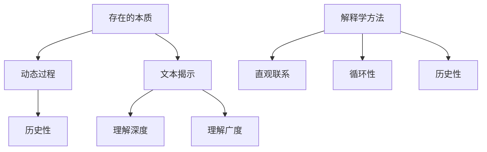

通过这些核心议题的探讨，海德格尔与加达默尔不仅丰富了解释学的理论体系，也为理解人类存在的复杂性提供了新的视角。他们的对话不仅促进了哲学的发展，也对人文科学和社会科学产生了深远的影响。

#### 解释学的存在论转向对当代哲学和技术的影响

海德格尔与加达默尔的解释学存在论转向在当代哲学和技术领域产生了深远的影响。他们的思想不仅挑战了传统的哲学观念，也为现代科技发展提供了一种新的思考方式。

首先，在海德格尔的解释学中，存在的动态性和历史性观念深刻地影响了当代哲学。海德格尔强调，存在不是静态的，而是一个动态的过程。这一观念对后来的哲学家，如福柯（Michel Foucault）和德里达（Jacques Derrida），产生了重要的影响。福柯在《事物的秩序》中提出了“考古学”（archaeology）的概念，强调知识和社会结构的动态变化。德里达则通过“解构”理论，挑战了西方哲学的二元对立传统，强调文本和意义的动态性。

加达默尔的解释学思想则对当代哲学和人文科学产生了深远的影响。他的“诠释学循环”和“历史意识”概念，为理解和解读文本提供了新的视角。这些概念不仅应用于文学和历史学，也被广泛应用于社会学、文化研究和心理学等领域。例如，文化研究学者通过加达默尔的诠释学循环，探讨文化产品的多重意义和变迁。

在技术领域，海德格尔与加达默尔的思想也为现代科技发展提供了一种新的思考方式。海德格尔的存在论强调，技术与存在紧密相连。他认为，技术不仅仅是工具和手段，更是人类存在方式的一部分。这一观念对现代技术哲学产生了重要影响，例如，海德格尔的思想影响了技术评估和伦理研究，促使人们反思技术在人类生活中的作用。

加达默尔的解释学思想对现代科技的应用也有重要启示。他的历史意识指出，任何技术和产品都是在特定的历史和文化背景下产生的。这一观点促使科技工作者在设计和应用新技术时，考虑历史和文化的因素，从而避免盲目追求技术进步，忽视社会和伦理问题。

总之，海德格尔与加达默尔的解释学存在论转向在当代哲学和技术领域产生了深远的影响。他们的思想不仅丰富了哲学的理论体系，也为科技发展提供了一种新的思考方式。通过理解他们的思想，我们可以更好地把握存在的本质，理解技术和人类生活的关系。

### 解释学的应用领域

解释学作为哲学的一个重要分支，不仅在理论研究中有着深远的影响，在实际应用领域也展现了其广泛的适用性。以下是解释学在文学解释、历史学、美学等领域的具体应用，以及这些应用对相关学科发展的贡献。

#### 文学解释

文学解释是解释学应用最为广泛的领域之一。加达默尔和海德格尔等哲学家对文学文本的解读提供了新的视角和方法。加达默尔的“诠释学循环”认为，理解一个文本需要同时考虑文本的整体结构和细节，这种循环性使得文学解释不仅仅是对字面意义的理解，更是一种对文本深层含义的挖掘。

**Mermaid 流程图：文学解释的过程**

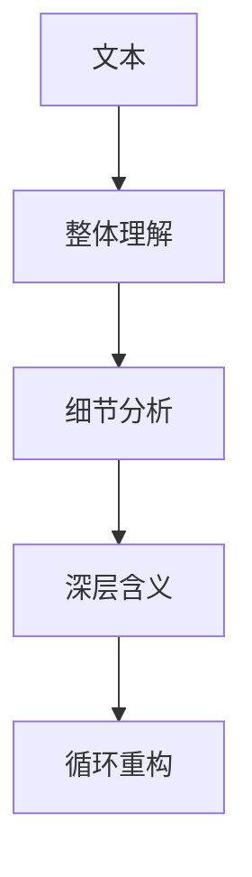

通过解释学的方法，文学研究者能够更深入地理解文本的历史和文化背景，从而更好地解读文本的象征意义和隐喻。这种理解不仅丰富了文学作品的内涵，也使文学解释更加多元和动态。

#### 历史学

历史学中，解释学方法被广泛应用于对历史文献的解读和历史事件的理解。加达默尔的“历史意识”强调，理解历史事件需要将其置于特定的历史背景中，这种观点对历史学研究产生了重要影响。

**Mermaid 流程图：历史解释的过程**

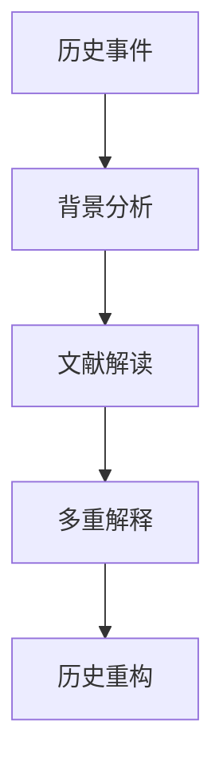

历史学家通过解释学的方法，可以从不同的角度和层面对历史事件进行解读，从而避免单一和片面的理解。这种方法不仅丰富了历史学的理论框架，也提高了历史研究的准确性和深度。

#### 美学

在美学领域，解释学方法被广泛应用于对艺术作品的理解和评价。加达默尔和海德格尔等哲学家的思想为美学研究提供了新的理论工具，特别是他们对文本和艺术作品的动态性理解。

**Mermaid 流程图：艺术作品解释的过程**

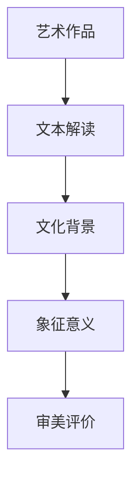

通过解释学的方法，美学研究者能够从不同的角度对艺术作品进行解读，从而发现其深层的艺术价值和美学意义。这种多元和动态的理解方式，使美学研究更加丰富和深入。

#### 综合影响

解释学在文学解释、历史学和美学等领域的应用，不仅推动了这些学科的理论发展，也为实际研究提供了新的方法和工具。通过解释学的方法，学者们能够更全面、深入地理解文本、历史和艺术作品，从而提高了研究的准确性和深度。

总之，解释学作为一种哲学方法，在多个领域中展现了其广泛的适用性和重要性。它不仅丰富了各学科的理论体系，也为实际研究提供了新的视角和方法，推动了学术研究的深入发展。

### 结论与展望

海德格尔与加达默尔对解释学的存在论转向做出了卓越的贡献，他们的思想不仅在哲学领域产生了深远的影响，也为人文科学和技术研究提供了新的理论视角。通过分析他们的核心观点和相互关系，我们可以看到，解释学在理解和解读人类存在、文本和历史方面的重要性。

海德格尔通过强调存在的动态性和历史性，提出了“在世存在”和“历史性”等核心概念，深刻地改变了哲学对存在的理解。加达默尔则通过“诠释学循环”和“历史意识”的概念，拓展了解释学的方法，使得理解成为一个开放和动态的过程。

在当代，解释学的存在论转向在多个领域产生了重要影响。在哲学上，它推动了现象学和后现象学的发展，丰富了哲学的理论框架。在人文科学中，解释学为文学解释、历史学和美学提供了新的方法和工具，推动了学术研究的深入发展。在技术领域，解释学思想促使人们反思技术与存在的关系，关注技术发展对社会和文化的影响。

展望未来，解释学的存在论转向将继续对哲学和技术产生深远的影响。随着人工智能和信息技术的发展，解释学的方法将被应用于更广泛的领域，如人工智能伦理、数字人文和跨学科研究。通过解释学的方法，我们可以更好地理解技术发展对人类生活和社会的影响，从而为未来的技术发展提供有益的指导。

总之，海德格尔与加达默尔的解释学思想不仅丰富了哲学的理论体系，也为人文科学和技术研究提供了新的视角和方法。他们的贡献将继续推动学术研究的深入发展，为理解和解读人类存在和技术世界提供新的启示。

### 附录：海德格尔与加达默尔著作列表

- **海德格尔著作：**
  - 《存在与时间》（Sein und Zeit，1927）
  - 《尼采》（Nietzsche，1930-1931）
  - 《诗人与神》（Der Poetische Geist, 1943）
  - 《技术的问题》（Die Frage nach der Technik，1954）
  - 《林中路》（Holzwege，1950）

- **加达默尔著作：**
  - 《柏拉图的辩证法》（Platons Dialektik，1929）
  - 《真理与方法》（Wahrheit und Methode，1960）
  - 《诠释学：哲学诠释学的基本问题》（Hermeneutik: Philosophische Hermeneutik, 1967）
  - 《诗人保罗· Celan》（Paul Celans Verwandlung des Verlorenen Ehernen Roland, 1947）
  - 《游戏的工作》（Das Spiel als Spiel，1970）

### 作者信息

作者：AI天才研究院/AI Genius Institute & 禅与计算机程序设计艺术 /Zen And The Art of Computer Programming

