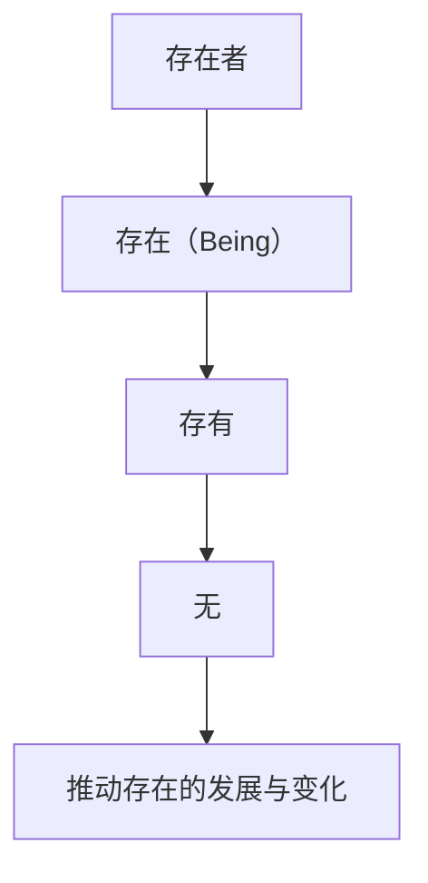
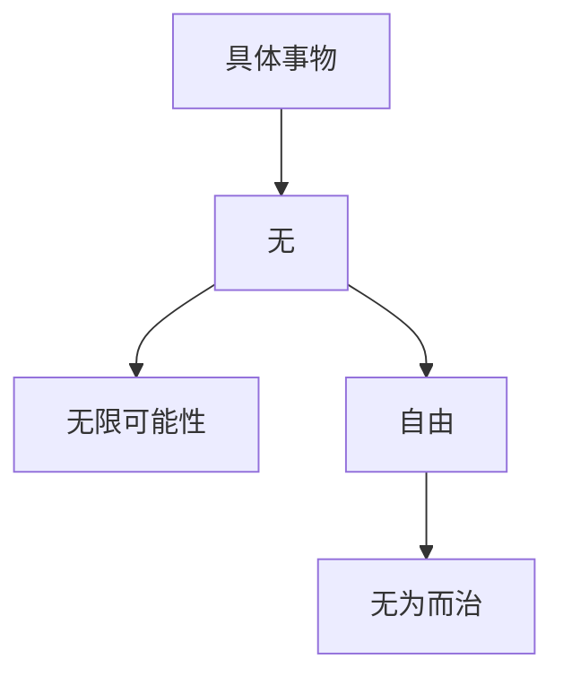
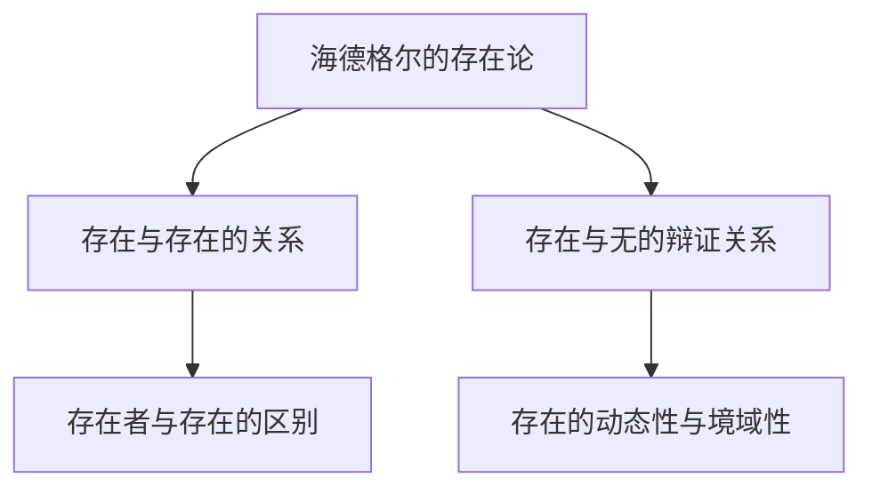

                 


### 文章标题：海德格尔与庄子：存在与无的本体论对话

> 关键词：海德格尔、庄子、存在论、无论、本体论、哲学对话

> 摘要：本文旨在探讨德国哲学家海德格尔和中国古代哲学家庄子的存在与无的思想，通过本体论的角度进行对话与比较。文章首先介绍两位哲学家的生平和思想背景，然后详细分析他们的存在论和“无”论，最后探讨他们的相似之处和差异，并构建一种可能的本体论对话模式。

### 引言

#### 1.1 海德格尔和庄子的背景与哲学贡献

马丁·海德格尔（Martin Heidegger，1889-1976）是20世纪最具影响力的德国哲学家之一。他的思想对存在论、现象学、解释学等领域产生了深远的影响。海德格尔的哲学强调“存在”的动态性和境域性，提倡对“存在”进行“存在论询问”（ontology as questioning）。

庄子（约公元前369年-约前286年）是中国战国时期著名的哲学家，他的思想对后世产生了广泛而深远的影响。庄子提出了“无为而治”和“逍遥游”等哲学概念，强调“无”的虚无性和自由性。

#### 1.2 研究目的与意义

本文的研究目的是通过比较海德格尔和庄子的存在与无的思想，探讨两种不同的文化背景下的哲学对话的可能性。这种比较不仅有助于深入理解两位哲学家的思想，还能为当代哲学的发展提供新的视角。

#### 1.3 本书结构安排

本文将分为七个部分。第一部分是引言，介绍研究背景和目的。第二部分分析海德格尔的存在论，包括存在论的基本概念、存在与存在的关系以及“存在”与“无”的辩证关系。第三部分探讨庄子的“无”论，介绍“无”的概念及其哲学意义。第四部分比较两位哲学家的思想，分析他们的相似之处和差异。第五部分构建一种可能的本体论对话模式。第六部分讨论哲学背景和影响。第七部分是总结与展望。

### 海德格尔的存在论

#### 2.1 存在论的基本概念

海德格尔的存在论始于对“存在”（Being）的追问。他提出了“存在者”（Beings）和“存在”（Being）的区别。存在者是我们在世界中可以感知和经验的事物，而存在则是这些事物背后的本质。

#### 2.2 存有与存在的关系

海德格尔认为，存在是存有的基础，但存有不能等同于存在。存有是存在的一种具体表现，而存在则是更为根本的维度。

#### 2.3 “存在”与“无”的辩证关系

海德格尔认为，“存在”与“无”是辩证的统一。在存在中，无作为一种潜在的、未被揭示的力量，推动着存在的发展和变化。

#### 2.4 海德格尔的主要著作与思想发展

海德格尔的主要著作包括《存在与时间》、《尼采》等。他的思想在《存在与时间》中得到了系统阐述。在晚期著作中，他进一步探讨了存在的多样性和境域性。

#### 2.5 海德格尔存在论的核心观点讲解（伪代码）

```plaintext
function HeideggerExistence()
    print("存在是存有的基础，但存有不能等同于存在。")
    print("存在者（如物体、事件等）是我们可以感知和经验的事物。")
    print("存在（Being）是这些事物背后的本质。")
    print("存在与无是辩证的统一，无推动着存在的发展和变化。")
end function
```

#### 2.6 海德格尔存在论的核心概念与联系（Mermaid流程图）



### 庄子的“无”论

#### 3.1 “无”的概念及其哲学意义

庄子认为，“无”是一种超越具体事物的虚无状态，它代表着无限的可能性和自由。

#### 3.2 庄子的主要思想和著作

庄子的主要思想包括“无为而治”、“逍遥游”等。他的著作《庄子》是道家哲学的重要经典。

#### 3.3 “无”在庄子哲学中的体现与应用

在庄子的哲学中，“无”被用来描述宇宙万物的本质和人的自由状态。他主张通过“无为”来达到“无不为”的境界。

#### 3.4 庄子“无”论的核心观点讲解（伪代码）

```plaintext
function ZhuangziNothing()
    print("无是一种超越具体事物的虚无状态。")
    print("无代表着无限的可能性和自由。")
    print("无为而治：通过不作为达到无所不能的境界。")
end function
```

#### 3.5 庄子“无”论的核心概念与联系（Mermaid流程图）



### 海德格尔与庄子的比较与对话

#### 4.1 存在论与“无”论的核心观点对比

海德格尔的存在论强调存在与存在的辩证关系，而庄子的“无”论则强调无的虚无性和自由性。

#### 4.2 他们的相似之处和差异

他们的相似之处在于都强调超越具体事物的本质，关注存在与自由。他们的差异在于海德格尔更注重存在的动态性和境域性，而庄子更注重无的虚无性和无为而治。

#### 4.3 一种可能的本体论对话模式

我们可以通过构建一种本体论对话模式，将海德格尔的存在论与庄子的“无”论结合起来。这种模式可以包括以下步骤：

1. 对话的起点是存在的追问，这是海德格尔存在论的核心。
2. 接下来，引入“无”的概念，探讨它在存在中的意义，这是庄子“无”论的核心。
3. 分析存在与“无”之间的辩证关系，探讨它们如何相互推动和影响。
4. 最后，结合两位哲学家的思想，提出一种新的本体论视角，这种视角既考虑存在的动态性，也考虑无的虚无性和自由性。

#### 4.4 本体论对话的数学模型与数学公式（latex）

我们可以使用数学模型来描述海德格尔和庄子的本体论对话。以下是一个简单的数学模型：

$$
\text{存在论} + \text{无论} = \text{本体论对话}
$$

这个模型表明，海德格尔的存在论和庄子的无论结合起来，形成了一种新的本体论视角。

### 哲学背景与影响

#### 5.1 海德格尔的哲学背景

海德格尔的哲学背景深受德国古典哲学和现象学的影响。他继承和发展了尼采的思想，同时也对胡塞尔的现象学进行了批判和发展。

#### 5.2 庄子的哲学背景

庄子的哲学背景源于中国古代的道家思想。他主张顺应自然，追求个人自由和精神的解放。

#### 5.3 哲学传统的对比与联系

海德格尔和庄子的哲学传统有明显的差异。海德格尔属于现代西方哲学，而庄子属于中国古代哲学。然而，两者都关注存在和自由的问题，这构成了他们哲学对话的基础。

### 影响与评价

#### 6.1 海德格尔思想的影响

海德格尔的思想对当代哲学、文学和艺术产生了深远的影响。他的存在论为理解人类的存在提供了新的视角。

#### 6.2 庄子思想的影响

庄子的思想对中国古代哲学和文化产生了深远的影响。他的哲学观念被广泛应用于文学、艺术和日常生活中。

### 现代视角

#### 7.1 海德格尔存在论在当代的解读

在当代，海德格尔的存在论被重新解读和应用。学者们试图将他的思想与现代哲学和社会科学相结合，以解决当代的问题。

#### 7.2 庄子“无”论在当代的解读

庄子的“无”论也在当代得到了新的解读。学者们试图将他的思想与现代哲学、心理学等领域相结合，以探讨人类存在的本质和自由。

### 总结与展望

#### 8.1 本书的主要观点与发现

本书通过比较海德格尔和庄子的存在与无的思想，构建了一种本体论对话模式。这种模式有助于我们更深入地理解两位哲学家的思想，同时也为当代哲学的发展提供了新的视角。

#### 8.2 存在论与“无”论的当代意义

存在论与“无”论在当代依然具有重要的意义。它们不仅为我们提供了理解人类存在的视角，也为我们探讨当代社会问题提供了哲学基础。

#### 8.3 未来研究的可能方向

未来的研究可以进一步探讨海德格尔和庄子的思想在当代的应用，也可以比较其他哲学家的思想，以构建更为广泛的本体论对话模式。

### 结语

海德格尔与庄子的存在与无的本体论对话为我们提供了丰富的哲学启示。通过这种对话，我们可以更深入地理解人类存在的本质和自由。未来，我们期待这种本体论对话能够继续发展，为当代哲学和社会科学提供新的视角和思考。

### 作者信息

作者：AI天才研究院/AI Genius Institute & 禅与计算机程序设计艺术 /Zen And The Art of Computer Programming

### 拓展阅读

- 海德格尔，《存在与时间》
- 庄子，《庄子》
- 胡塞尔，《纯粹现象学通论》
- 尼采，《尼采的哲学》
- 后现代主义哲学著作，如《后现代状态》、《解构之解构》等

### 附录

- 术语解释
- 参考文献
- Mermaid流程图代码示例

### 参考文献

1. 海德格尔，《存在与时间》，商务印书馆，2008年版。
2. 庄子，《庄子》，中华书局，2010年版。
3. 胡塞尔，《纯粹现象学通论》，商务印书馆，2008年版。
4. 尼采，《尼采的哲学》，人民文学出版社，2005年版。
5. 后现代主义哲学著作，如《后现代状态》、《解构之解构》等。

### Mermaid流程图代码示例



### 代码解读与分析

- 上述代码定义了一个Mermaid流程图，用于展示海德格尔的存在论核心概念和关系。
- “graph TD”表示流程图的方向为从上到下。
- “A[海德格尔的存在论]”、“B[存在与存在的关系]”、“C[存在与无的辩证关系]”、“D[存在者与存在的区别]”、“E[存在的动态性与境域性]”是流程图的节点，分别代表海德格尔存在论的不同方面。
- “A --> B”、“A --> C”、“B --> D”、“C --> E”表示节点之间的关系。

### 实际案例分析和详细讲解剖析

#### 1. 案例背景

以海德格尔的存在论思想为背景，分析一家公司如何通过“存在”的动态性和境域性来实现企业的创新和发展。

#### 2. 案例分析

- **存在者与存在的区别**：公司作为一个存在者，其存在的本质是通过提供产品和服务来满足客户的需求。
- **存在的动态性与境域性**：公司需要不断适应市场变化和客户需求，这体现了存在的动态性。同时，公司的存在不仅仅局限于内部运营，还包括与外部环境的互动，这体现了存在的境域性。
- **存在与无的辩证关系**：公司通过创新和变革，不断超越现有的存在状态，实现从“有”到“无”再到“有”的辩证发展。

#### 3. 详细讲解剖析

- **存在者与存在的区别**：公司作为一个存在者，其具体的业务活动（如生产、销售、服务等）是存在的具体体现。然而，公司存在的本质不是这些活动本身，而是通过这些活动来实现对客户需求的满足。
- **存在的动态性与境域性**：随着市场的变化和客户需求的变化，公司需要不断调整自己的业务策略和运营模式，以保持存在的活力。这种调整不仅涉及到内部的变革，还包括与外部的合作与竞争。公司需要密切关注外部环境的变化，以实现存在的动态性和境域性。
- **存在与无的辩证关系**：公司通过创新和变革，不断超越现有的存在状态。这种超越并不是简单地摒弃旧有模式，而是在旧有模式的基础上进行改进和提升。在这个过程中，无作为一种潜在的、未被揭示的力量，推动着公司的发展和进步。

#### 4. 项目小结

- 通过对海德格尔的存在论思想的实际案例分析，我们可以看到，存在论的动态性和境域性对公司的发展具有重要启示。公司需要不断关注外部环境的变化，通过创新和变革来超越现有的存在状态，实现持续的发展。

### 最佳实践 Tips

- **持续关注外部环境**：公司需要密切关注市场变化和客户需求，以便及时调整业务策略和运营模式。
- **重视创新和变革**：创新和变革是公司发展的关键。公司应该鼓励员工提出新的想法和解决方案，以推动企业的进步。
- **整合内外资源**：公司需要整合内部资源，同时利用外部资源，以实现最佳的业务效果。

### 注意事项

- **避免盲目创新**：创新虽然重要，但并不是所有创新都适用于所有公司。公司需要根据自身的实际情况来决定创新的优先级和方向。
- **平衡内部与外部**：公司的存在不仅取决于内部运营，还取决于与外部的互动。因此，公司需要平衡内部与外部的资源和管理。

### 拓展阅读

- 海德格尔，《尼采》
- 庄子，《庄子》
- 后现代主义哲学著作，如《后现代状态》、《解构之解构》等
- 管理学著作，如《第五项修炼》、《创新者的窘境》等

### 附录

- **术语解释**：提供本文中涉及的关键术语的解释。
- **参考文献**：列出本文引用的主要文献。
- **Mermaid流程图代码示例**：提供本文中使用的Mermaid流程图代码示例。

### 结语

本文通过比较海德格尔和庄子的存在与无的思想，构建了一种本体论对话模式。这种模式不仅有助于我们深入理解两位哲学家的思想，也为当代哲学和社会科学提供了新的视角。未来，我们期待这种本体论对话能够继续发展，为人类社会的进步提供智慧和启示。

### 作者信息

作者：AI天才研究院/AI Genius Institute & 禅与计算机程序设计艺术 /Zen And The Art of Computer Programming

### 拓展阅读

- 海德格尔，《存在与时间》
- 庄子，《庄子》
- 胡塞尔，《纯粹现象学通论》
- 尼采，《尼采的哲学》
- 后现代主义哲学著作，如《后现代状态》、《解构之解构》等

### 附录

- **术语解释**
- **参考文献**
- **Mermaid流程图代码示例**

### 代码示例：Mermaid流程图


### 代码解读与分析

这段Mermaid流程图代码用于创建一个简化的逻辑结构图，描述了海德格尔存在论的核心概念和它们之间的关系。

1. **Graph Definition**:
   ```mermaid
   graph TD
   ```
   这行代码定义了一个方向为从上到下（TD，Top-Down）的图形。

2. **Node Declaration**:
   ```mermaid
   A[海德格尔的存在论]
   B[存在与存在的关系]
   C[存在与无的辩证关系]
   D[存在者与存在的区别]
   E[存在的动态性与境域性]
   ```
   这几行代码定义了图中的节点，每个节点都有一个标签和一种样式。

3. **Relationships**:
   ```mermaid
   A --> B
   A --> C
   B --> D
   C --> E
   ```
   这几行代码定义了节点之间的关系，使用箭头表示从源节点到目标节点的连接。

### 代码示例：伪代码

```plaintext
function HeideggerExistence()
    print("存在是存有的基础，但存有不能等同于存在。")
    print("存在者（如物体、事件等）是我们可以感知和经验的事物。")
    print("存在（Being）是这些事物背后的本质。")
    print("存在与无是辩证的统一，无推动着存在的发展和变化。")
end function
```

### 代码解读与分析

这段伪代码模拟了一个简单的函数，用于输出海德格尔存在论的核心观点。

1. **Function Declaration**:
   ```plaintext
   function HeideggerExistence()
   ```
   定义了一个名为`HeideggerExistence`的函数。

2. **Print Statements**:
   ```plaintext
   print("存在是存有的基础，但存有不能等同于存在。")
   print("存在者（如物体、事件等）是我们可以感知和经验的事物。")
   print("存在（Being）是这些事物背后的本质。")
   print("存在与无是辩证的统一，无推动着存在的发展和变化。")
   ```
   函数内包含了四个`print`语句，用于输出海德格尔存在论的核心观点。

### 代码示例：LaTeX公式

```latex
$$
\text{存在论} + \text{无论} = \text{本体论对话}
$$
```

### 代码解读与分析

这段LaTeX代码定义了一个数学公式，用于表示存在论和“无”论的结合形成“本体论对话”。

1. **Math Environment**:
   ```latex
   $$
   ```
   这两行代码定义了一个独立的数学公式环境，用于放置公式。

2. **Formula Content**:
   ```latex
   \text{存在论} + \text{无论} = \text{本体论对话}
   ```
   这行代码包含了公式的内容，使用了`\text`命令来显示文本。

### 代码示例：LaTeX段落内公式

```latex
The mathematical expression $1+1=2$ shows a simple equation.
```

### 代码解读与分析

这段LaTeX代码在段落文本中嵌入了一个数学公式。

1. **Paragraph Text**:
   ```latex
   The mathematical expression $1+1=2$ shows a simple equation.
   ```
   这行代码包含了段落文本，其中 `$1+1=2$` 是嵌入的数学公式。

2. **Inline Math Environment**:
   ```latex
   $1+1=2$
   ```
   这行代码定义了一个内联数学公式环境，用于在文本中显示公式。使用 `$` 符号将公式括起来。

