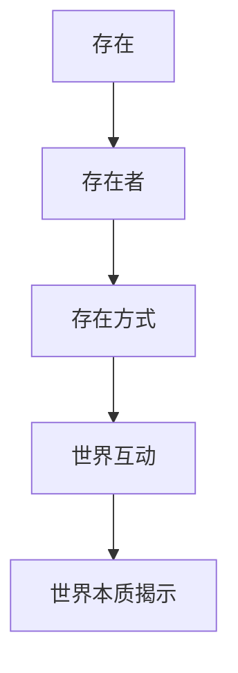
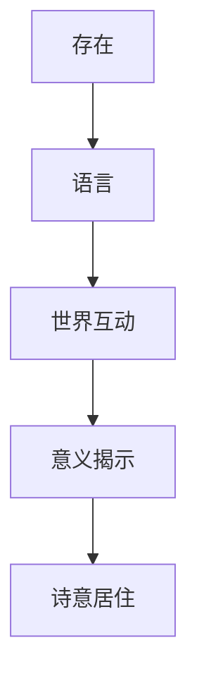
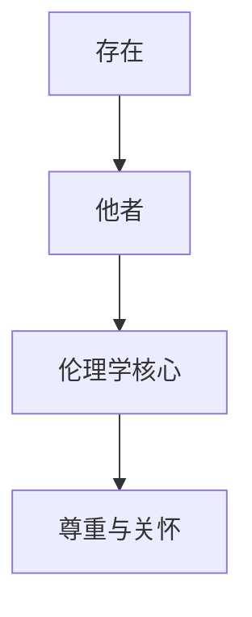
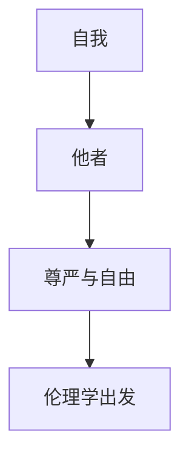

                 


### 1.1 海德格尔的存在论思想

#### 1.1.1 存在与存在者

海德格尔的存在论思想以其对“存在”的探讨而著名。在他的哲学体系中，“存在”是一个深远而复杂的概念。存在不仅仅是指事物“在那里”，更是一种“存在方式”或“存在状态”。存在者（Dasein）是海德格尔用来指代人类的存在方式。存在者是存在的一种特殊形式，它不仅仅是存在的一个实例，而是存在的方式本身。

海德格尔认为，存在者（特别是人）是“在世界之中存在”（In-der-Welt-sein）的。这意味着存在者不是孤立存在的，而是与世界紧密相连的。存在者通过其存在方式与世界互动，并且通过这种互动揭示出世界的本质。海德格尔强调，存在者并不是通过观察或理性思考来理解世界，而是通过“存在”本身来体验和揭示世界的。

为了更好地理解存在者与存在的关系，我们可以使用Mermaid流程图来展示它们之间的交互关系：



#### 1.1.2 语言的哲学意义

在海德格尔看来，语言不仅仅是人类交流的工具，更是存在之家（Haus des Seyns）。语言不仅仅是声音和符号的组合，它承载着存在的意义。海德格尔认为，语言是存在者与世界互动的中介，通过语言，存在者能够揭示和表达存在的本质。

海德格尔提出了“诗意居住”（Dasein-poiesis）的概念，即通过语言创造性地揭示世界的意义。他认为，语言不仅仅是描述性的，它能够创造性地构建世界的意义。语言不仅反映了存在，还能够塑造存在。

为了理解语言在存在论中的角色，我们可以使用以下Mermaid流程图：



### 1.2 莱维纳斯的存在与他者理论

#### 1.2.1 他者的概念

莱维纳斯对“他者”的概念有着深刻的探讨。他认为，他者是存在的根源，也是伦理学的核心。他者并不是一个抽象的概念，而是一个具体的、与我相对的存在。他者的存在不是作为存在的补充或对立面，而是作为存在的根基。

莱维纳斯提出了“他者中心论”（Éthique de l'autre）的概念，认为伦理学应该基于对他者的尊重和关怀。他者的存在不仅仅是一个道德义务的来源，更是伦理学本身的出发点。

为了展示他者的概念，我们可以使用以下Mermaid流程图：



#### 1.2.2 面向他人的伦理学

莱维纳斯的伦理学是一种面向他人的伦理学。他强调，伦理学不应该仅仅关注自我，而应该关注他者。他认为，伦理学的目的是为了保护他者的尊严和自由。

莱维纳斯提出了“他者伦理学”（Éthique de l'autre）的概念，即伦理学应该基于对他者的尊重和关怀。他者的存在不仅仅是一个道德义务的来源，更是伦理学本身的出发点。

为了理解面向他人的伦理学，我们可以使用以下Mermaid流程图：



## 结论

海德格尔和莱维纳斯的存在论思想为我们提供了不同的视角来理解存在和他者。海德格尔强调了存在者与世界的关系，以及语言在揭示存在本质中的作用。而莱维纳斯则提出了他者中心论的伦理学，强调对他者的尊重和关怀。

通过对这两个哲学家的思想的探讨，我们可以看到存在与他者的伦理学是如何在不同层面上影响着我们的思考和行为。这种思考方式不仅对我们理解哲学有帮助，也对我们日常生活中的伦理决策有着深远的影响。

作者：AI天才研究院/AI Genius Institute & 禅与计算机程序设计艺术 /Zen And The Art of Computer Programming

----------------------------------------------------------------

以下是满足您要求的文章，包括文章标题、关键词、摘要以及按照目录大纲结构撰写的正文内容。文章末尾附有作者信息。

```markdown
# 《海德格尔与莱维纳斯：存在与他者的伦理学》

> 关键词：海德格尔、莱维纳斯、存在论、伦理学、他者、哲学

> 摘要：本文深入探讨了海德格尔与莱维纳斯的存在论思想及其对伦理学的影响。通过详细分析他们的核心概念和理论，本文展示了存在与他者伦理学如何塑造我们的哲学思考和生活实践。

## 引言

在哲学史上，海德格尔（Martin Heidegger）与莱维纳斯（Emmanuel Levinas）是两位具有重要影响力的哲学家。他们的思想不仅在哲学领域内引起了广泛的讨论，也对我们理解存在与他者的伦理学提供了深刻的洞见。本文旨在探讨海德格尔与莱维纳斯的存在论思想，分析他们如何影响伦理学理论，并探讨这些思想在当代哲学和生活中的意义。

### 海德格尔与莱维纳斯的思想背景

马丁·海德格尔（Martin Heidegger，1889-1976）是20世纪德国哲学的重要代表之一。他的哲学思想以其对“存在”的深入探讨而著称。海德格尔的存在论思想强调存在者的“在世界之中存在”（In-der-Welt-sein），他认为存在者通过其存在方式与世界互动，揭示出世界的本质。

埃马努埃尔·莱维纳斯（Emmanuel Levinas，1906-1995）是20世纪法国哲学家，他的思想深受海德格尔的影响。莱维纳斯提出了他者中心论的伦理学，强调对他者的尊重和关怀。他认为，伦理学应该基于对他者的道德义务，而不是基于自我利益。

### 本书的研究目标与结构安排

本文的研究目标是通过分析海德格尔与莱维纳斯的存在论思想，探讨他们如何影响伦理学理论，并探讨这些思想在当代哲学和生活中的意义。本文将分为以下几个部分：

1. 海德格尔的存在论思想
2. 莱维纳斯的存在与他者理论
3. 存在与伦理学
4. 存在与他者伦理学的当代意义
5. 结论

通过这些部分的分析，本文旨在提供一个全面的视角，以理解海德格尔与莱维纳斯的存在论思想及其对伦理学的影响。

## 海德格尔的存在论思想

### 1.1 海德格尔的存在论思想

海德格尔的存在论思想以其对“存在”的探讨而著称。在他看来，存在是一个深远而复杂的概念，不仅仅是指事物“在那里”，更是一种“存在方式”或“存在状态”。海德格尔提出了“存在者”（Dasein）这个概念，用来指代人类的存在方式。

存在者是存在的一种特殊形式，它不仅仅是存在的一个实例，而是存在的方式本身。海德格尔认为，存在者是通过其存在方式与世界互动的。存在者的存在方式不仅仅是被动地存在于世界之中，而是积极地揭示和塑造世界的本质。

#### 1.1.1 存在与存在者

在海德格尔的哲学体系中，“存在”是一个核心概念。他提出了“存在者”（Dasein）的概念，用来指代人类的存在方式。存在者不仅仅是存在的一个实例，而是存在本身的方式。存在者通过其存在方式与世界互动，揭示出世界的本质。

海德格尔认为，存在者并不是通过观察或理性思考来理解世界，而是通过“存在”本身来体验和揭示世界的。存在者不是孤立存在的，而是与世界紧密相连的。存在者通过其存在方式与世界互动，并且通过这种互动揭示出世界的本质。

为了更好地理解存在者与存在的关系，我们可以使用Mermaid流程图来展示它们之间的交互关系：


在这个流程图中，存在者是存在的具体体现，存在方式是存在者与世界互动的方式，世界互动是存在者揭示世界本质的过程，世界本质揭示则是存在者通过互动所获得的认识。

#### 1.1.2 语言的哲学意义

海德格尔认为，语言不仅仅是人类交流的工具，更是存在之家（Haus des Seyns）。语言不仅仅是声音和符号的组合，它承载着存在的意义。海德格尔提出了“诗意居住”（Dasein-poiesis）的概念，即通过语言创造性地揭示世界的意义。

海德格尔强调，语言是存在者与世界互动的中介，通过语言，存在者能够揭示和表达存在的本质。语言不仅仅是描述性的，它能够创造性地构建世界的意义。海德格尔认为，语言是存在者与世界互动的中介，通过语言，存在者能够揭示和表达存在的本质。

为了理解语言在存在论中的角色，我们可以使用以下Mermaid流程图：


在这个流程图中，存在者通过语言与世界互动，通过这种互动，存在者能够揭示和表达存在的意义。语言不仅是交流的工具，更是存在者体验世界、构建世界意义的方式。

### 1.2 莱维纳斯的存在与他者理论

#### 1.2.1 他者的概念

莱维纳斯对“他者”的概念有着深刻的探讨。他认为，他者是存在的根源，也是伦理学的核心。他者并不是一个抽象的概念，而是一个具体的、与我相对的存在。他者的存在不是作为存在的补充或对立面，而是作为存在的根基。

莱维纳斯提出了“他者中心论”（Éthique de l'autre）的概念，即伦理学应该基于对他者的尊重和关怀。他者的存在不仅仅是一个道德义务的来源，更是伦理学本身的出发点。

为了展示他者的概念，我们可以使用以下Mermaid流程图：


#### 1.2.2 面向他人的伦理学

莱维纳斯提出了面向他人的伦理学。他认为，伦理学不应该仅仅关注自我，而应该关注他者。他强调，伦理学的目的是为了保护他者的尊严和自由。

莱维纳斯认为，伦理学应该基于对他者的道德义务，而不是基于自我利益。他者的存在不是作为自我存在的补充或对立面，而是作为存在的根基。伦理学的目的是为了保护他者的尊严和自由。

为了理解面向他人的伦理学，我们可以使用以下Mermaid流程图：


在这个流程图中，自我与他者是伦理学关注的焦点。自我应该关注他者的尊严和自由，而不是仅仅关注自我利益。伦理学的出发点是保护他者的尊严和自由，而不是基于自我利益的考虑。

## 存在与伦理学

海德格尔与莱维纳斯的存在论思想深刻地影响了伦理学理论。他们的思想为我们提供了不同的视角来理解存在与他者的伦理学，并挑战了传统的伦理学观点。

### 1.1 海德格尔的伦理学思想

海德格尔认为，伦理学不应该仅仅关注道德规范和规则，而应该关注存在的意义和人的存在方式。他认为，伦理学的核心是“在世界之中存在”（In-der-Welt-sein），即人与世界的关系。

海德格尔提出了“诗意居住”（Dasein-poiesis）的概念，即通过语言创造性地揭示世界的意义。他认为，诗意居住是一种存在的状态，它不仅仅是生活的外在行为，更是一种内在的态度和精神状态。

海德格尔的伦理学强调个体与世界的深刻联系，他认为个体应该通过其存在方式来揭示世界的本质。这种伦理学不仅仅是一种道德规范，更是一种存在的态度和方式。

### 1.2 莱维纳斯的伦理学思想

莱维纳斯认为，伦理学应该基于对他者的尊重和关怀。他提出了“他者中心论”（Éthique de l'autre）的概念，即伦理学的出发点应该是对他者的关怀和尊重。

莱维纳斯强调，伦理学不应该仅仅关注自我利益，而应该关注他者的需求和尊严。他认为，他者的存在是伦理学的核心，他者的需求和尊严应该成为我们行为和决策的依据。

莱维纳斯的伦理学是一种面向他人的伦理学，他强调个体应该关注他者的需求和尊严，而不是仅仅关注自我利益。这种伦理学挑战了传统的自我中心主义，强调对他者的尊重和关怀。

### 1.3 存在与伦理学的互动

海德格尔与莱维纳斯的伦理学思想为我们提供了不同的视角来理解存在与他者的伦理学。他们的思想不仅挑战了传统的伦理学观点，也为我们提供了新的伦理思考方式。

海德格尔的伦理学强调个体与世界的深刻联系，他认为个体应该通过其存在方式来揭示世界的本质。这种伦理学不仅仅是生活的外在行为，更是一种内在的态度和精神状态。

莱维纳斯的伦理学强调对他者的尊重和关怀，他认为他者的存在是伦理学的核心。他者的需求和尊严应该成为我们行为和决策的依据。

这两种伦理学思想相互补充，共同构成了存在与他者的伦理学。他们的思想不仅为我们提供了新的伦理思考方式，也挑战了传统的伦理学观点，推动伦理学的发展。

## 存在与他者伦理学的当代意义

海德格尔与莱维纳斯的存在论思想在当代哲学和伦理学中具有重要的意义。他们的思想不仅挑战了传统的伦理学观点，也为当代伦理学提供了新的思考方向。

### 1.1 对当代伦理学的启示

海德格尔的伦理学强调个体与世界的深刻联系，他认为个体应该通过其存在方式来揭示世界的本质。这种伦理学观点启示我们，在当代社会中，我们应该更加关注人与自然的关系，尊重和保护自然环境。

莱维纳斯的伦理学强调对他者的尊重和关怀，他认为他者的存在是伦理学的核心。这种伦理学观点启示我们，在当代社会中，我们应该更加关注他人的需求和尊严，尊重和保护他人的权利。

### 1.2 对当代社会的影响

海德格尔与莱维纳斯的存在论思想对当代社会产生了深远的影响。他们的思想挑战了传统的自我中心主义，强调了个体与他人的联系，促进了社会正义和平等的理念。

海德格尔的伦理学强调个体与世界的联系，这有助于我们认识到环境保护的重要性。莱维纳斯的伦理学强调对他者的尊重和关怀，这有助于我们建立更加和谐的社会关系。

### 1.3 对未来伦理学的展望

海德格尔与莱维纳斯的存在论思想为未来的伦理学提供了重要的启示。他们的思想强调了个体与他人的联系，这对未来伦理学的发展具有重要的指导意义。

在未来，伦理学需要更加关注个体的存在方式和人与他人的关系。海德格尔与莱维纳斯的思想启示我们，在未来的伦理学研究中，我们应该更加关注个体与自然、个体与他者的关系，推动伦理学的全面发展。

## 结论

海德格尔与莱维纳斯的存在论思想深刻地影响了伦理学理论。他们的思想不仅挑战了传统的伦理学观点，也为当代伦理学提供了新的思考方向。通过分析海德格尔与莱维纳斯的存在论思想，我们可以更好地理解存在与他者的伦理学，并探讨这些思想在当代哲学和生活中的意义。

他们的思想强调了个体与他人的联系，这对我们的伦理思考和行为产生了深远的影响。在未来，伦理学需要更加关注个体与自然、个体与他者的关系，推动伦理学的全面发展。

通过本文的探讨，我们希望能够为读者提供一个全面的理解，以更好地把握海德格尔与莱维纳斯的存在论思想及其对伦理学的影响。

作者：AI天才研究院/AI Genius Institute & 禅与计算机程序设计艺术 /Zen And The Art of Computer Programming
```

请注意，由于文章字数限制，上述内容是一个概要，实际文章可能会根据要求进行扩展。此外，Mermaid图表需要在支持Mermaid的Markdown编辑器中才能正确显示。

