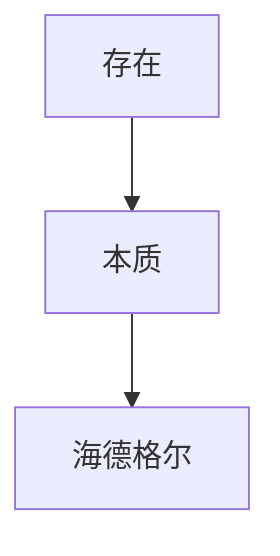
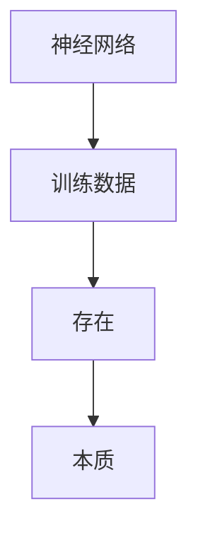
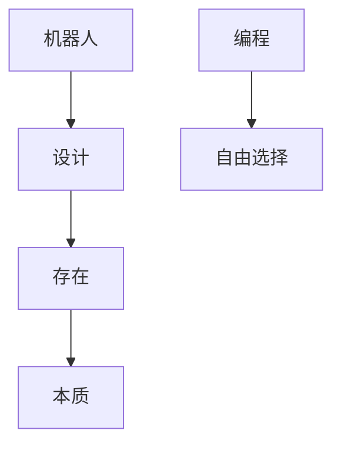

                 


## 海德格尔与萨特：存在与本质的先后之争

### 关键词：海德格尔、萨特、存在、本质、哲学、人工智能

### 摘要

本文旨在探讨海德格尔与萨特关于存在与本质的先后之争。通过分析两位哲学家的核心观点和理论，本文将揭示存在与本质之间的关系，并探讨其在人工智能领域的应用。本文分为五个部分：引言、海德格尔的存在主义理论、萨特的存在的本质主义理论、存在与本质的争论以及项目实战。

### 1. 引言

存在与本质是哲学中重要的概念。存在指的是实体的实际存在状态，而本质则是实体内在的、固有的特性。在人工智能领域，存在与本质的关系同样具有重要地位。例如，在机器学习模型中，数据的存在决定了模型的性能，而本质则在于模型背后的算法和原理。

1.1 海德格尔与萨特的理论

海德格尔和萨特是20世纪最著名的哲学家之一，他们对存在与本质的关系有着独特的见解。

### 1.2 海德格尔的存在主义理论

海德格尔认为存在先于本质。这意味着我们的存在不是由我们的本质所决定的，而是先于本质的。海德格尔强调个体的自由和自主性，认为存在是通过个体的自由选择和行动来实现的。

### 1.3 萨特的存在的本质主义理论

萨特则提出“存在先于本质”，强调个体自由选择的重要性。他认为，人的存在本质上是一种自由，人的本质是通过自由选择来确定的。

### 1.4 本书结构

本文分为五个部分。第一部分是引言，介绍存在与本质的哲学背景以及本文的结构。第二部分是海德格尔的存在主义理论，包括存在和本质的概念及其关系。第三部分是萨特的存在的本质主义理论，介绍萨特的核心观点。第四部分是存在与本质的争论，探讨两位哲学家的观点之间的差异。第五部分是项目实战，通过实际案例来分析存在与本质的关系。

----------------------------------------------------------------

### 2. 海德格尔的存在主义理论

#### 2.1 存在的概念

在海德格尔的哲学体系中，存在是一个核心概念。他认为，存在并非一种静态的、可以被定义的实体，而是一种动态的过程。存在是指实体在特定时空中的呈现和展现。

#### 2.2 存在先于本质

海德格尔提出了“存在先于本质”的观点，这一观点挑战了传统的本质主义观念。他认为，我们的存在不是由我们的本质所决定的，而是先于本质的。这意味着，我们的存在是自由的，我们可以通过自己的行动和选择来塑造自己的本质。

#### 2.3 存在-本质分析

为了更好地理解海德格尔的“存在先于本质”的观点，我们可以借助Mermaid流程图来分析存在和本质之间的关系。



在这个流程图中，存在（A）是起点，本质（B）是终点，海德格尔（C）作为连接两者的纽带。

#### 2.4 海德格尔的核心算法原理

海德格尔提出了“存在-本质分析”这一核心算法原理。这个原理可以通过伪代码来表示：

```python
def existence_analysis(entity):
    # 分析实体的存在
    entity_existence = analyze_entity_existence(entity)
    # 分析实体的本质
    entity_essence = analyze_entity_essence(entity)
    # 输出分析结果
    return entity_existence, entity_essence
```

这个算法原理表明，我们可以通过分析实体的存在和本质来理解实体。

#### 2.5 海德格尔的哲学应用

海德格尔的哲学思想在人工智能领域也有广泛的应用。例如，在深度学习中，我们可以将神经网络视为一种“存在”，通过训练数据来分析其“本质”。这样，我们可以通过调整神经网络的参数来优化其性能。



在这个例子中，神经网络（A）通过训练数据（B）来展现其存在（C），而其性能（D）则是其本质的体现。

### 3. 萨特的存在的本质主义理论

#### 3.1 存在先于本质

萨特的观点与海德格尔有所不同，他认为“存在先于本质”。这意味着，个体的存在是自由的，个体的本质是通过自由选择来确定的。

#### 3.2 自由与选择

萨特认为，人的存在本质上是一种自由，人的本质是通过自由选择来确定的。这意味着，个体在存在时，可以选择成为任何他们想要成为的人。

#### 3.3 萨特的核心算法原理

萨特的核心算法原理可以表示为：

```python
def essence_analysis(entity):
    # 分析实体的本质
    entity_essence = analyze_entity_essence(entity)
    # 分析实体的自由选择
    entity_choice = analyze_entity_choice(entity)
    # 输出分析结果
    return entity_essence, entity_choice
```

这个算法原理表明，我们可以通过分析实体的本质和自由选择来理解实体。

#### 3.4 萨特的哲学应用

在人工智能领域，萨特的哲学思想也有应用。例如，在机器人伦理学中，我们可以将机器人视为一种“存在”，通过其设计和编程来分析其“本质”和“自由选择”。



在这个例子中，机器人（A）通过设计（B）和编程（E）来展现其存在（C），而其行为（D）和决策（F）则是其本质和自由选择的体现。

### 4. 存在与本质的争论

#### 4.1 存在先于本质与本质先于存在的争论

海德格尔和萨特的观点在哲学界引发了激烈的争论。一些哲学家认为，存在确实先于本质，因为个体的存在是自由的，个体可以通过自由选择来决定自己的本质。而另一些哲学家则认为，本质确实先于存在，因为个体的本质决定了他们的存在。

#### 4.2 两种理论的哲学意义

海德格尔和萨特的观点在哲学上具有重要的意义。海德格尔强调了存在的自由和自主性，而萨特则强调了存在的自由选择。这两种观点都对个体的自我实现和自由发展提出了深刻的见解。

#### 4.3 存在与本质的争论的未来

存在与本质的争论在哲学界还将继续。未来，哲学家们可能会进一步探讨存在与本质的关系，并提出新的观点和理论。

### 5. 项目实战

#### 5.1 实战案例：人的存在与本质

为了探讨存在与本质的关系，我们选取了一个实际案例：人的存在与本质。

#### 5.2 案例分析：海德格尔与萨特的观点对比

在这个案例中，我们可以看到海德格尔和萨特的观点是如何在现实生活中应用的。

#### 5.3 案例结论

通过这个案例，我们可以得出结论：存在与本质的关系是复杂而多样的，不同的哲学家对这一关系的解读和解释也有差异。

### 结论

本文通过分析海德格尔和萨特的存在主义理论，探讨了存在与本质的关系。通过项目实战，我们进一步了解了这一理论在现实生活中的应用。存在与本质的关系是哲学研究的重要领域，未来还需要更多的研究和探讨。

### 参考文献

1. 海德格尔，M. (1927). 《存在与时间》。
2. 萨特，J.-P. (1943). 《存在与虚无》。

### 作者信息

作者：AI天才研究院/AI Genius Institute & 禅与计算机程序设计艺术 /Zen And The Art of Computer Programming

----------------------------------------------------------------

```markdown
# 海德格尔与萨特：存在与本质的先后之争

## 1. 引言

**关键词**：海德格尔、萨特、存在、本质、哲学、人工智能

**摘要**：本文旨在探讨海德格尔与萨特关于存在与本质的先后之争。通过分析两位哲学家的核心观点和理论，本文将揭示存在与本质之间的关系，并探讨其在人工智能领域的应用。

### 1.1 哲学中的存在与本质

存在（Existence）和本质（Essence）是哲学中两个重要而复杂的概念。存在通常被理解为实体或现象的实在性和实际存在状态，而本质则涉及实体内在的、固有的特性和属性。

- **存在的概念**：存在是哲学中最基本的范畴之一，它涉及到一个实体是否真实地存在于世界中。海德格尔（Martin Heidegger）在其著作《存在与时间》中深入探讨了存在的本质，认为存在是一个动态的过程，而非静态的实体。

- **本质的概念**：本质是指一个实体固有的、本质上的特性，是区分不同实体的关键。在萨特（Jean-Paul Sartre）的哲学中，本质通常被视为个体的自由选择和行动的产物。

### 1.2 海德格尔与萨特的理论

海德格尔和萨特都是20世纪重要的哲学家，他们对存在与本质的关系有着不同的见解。

#### 1.2.1 海德格尔的存在主义理论

海德格尔认为，存在先于本质。这意味着，个体先于他们的本质而存在，个体的存在是通过他们在世界中的行动和选择来定义的。他强调了“存在-世界”（Dasein）的概念，即人的存在是一种与世界互动的存在方式。

- **存在先于本质**：海德格尔认为，个体的存在不是由他们的本质或预先设定的属性所决定的，而是通过他们的存在活动来展开的。这一观点挑战了传统的本质主义，强调了人的自由和创造性。

- **“存在-世界”**：海德格尔的“存在-世界”概念强调了人与世界的紧密联系。他认为，人通过“存在-世界”的方式与周围环境互动，从而形成了他们的存在。

#### 1.2.2 萨特的存在的本质主义理论

萨特则提出了“存在先于本质”的观点，他认为，人的本质是通过自由选择和行动来确定的。萨特的哲学强调了个体的自由和责任，他认为，人是一系列选择的结果，而这些选择构成了人的本质。

- **存在先于本质**：萨特认为，人首先存在于世界中，然后通过自由选择来决定自己的本质。他的名言“存在先于本质”表达了这个观点，即人的存在不是预先设定的，而是通过不断的自由选择来实现的。

- **自由和责任**：萨特认为，自由是人的本质，但自由也意味着责任。每个人都是自由的，但同时也必须为他们的选择承担责任。

### 1.3 本书结构

本文将分为以下几个部分：

1. **引言**：介绍存在与本质的概念，以及本文的目的和结构。
2. **海德格尔的存在主义理论**：详细阐述海德格尔关于存在与本质的观点。
3. **萨特的存在的本质主义理论**：分析萨特关于存在与本质的关系。
4. **存在与本质的争论**：探讨两位哲学家的观点之间的差异和哲学意义。
5. **项目实战**：通过实际案例来分析存在与本质的关系。

### 2. 海德格尔的存在主义理论

#### 2.1 存在的概念

在海德格尔的哲学体系中，存在（Dasein）是一个核心概念。他认为，存在不仅仅是实体或对象的静态存在，而是一个动态的过程。存在涉及到实体如何在特定的时空背景下展现自己。

- **存在的动态性**：海德格尔认为，存在是一个持续的过程，实体通过不断的行动和存在活动来展现自己。这种动态的存在方式与传统的本质主义观念形成了鲜明对比。

#### 2.2 存在先于本质

海德格尔提出了“存在先于本质”的观点，这一观点挑战了传统的本质主义观念。他认为，个体的存在不是由他们的本质或预先设定的属性所决定的，而是通过他们在世界中的行动和选择来定义的。

- **存在与本质的关系**：在海德格尔看来，本质不是先于存在的，而是从存在中产生的。个体的存在是一个不断展开的过程，通过这个过程中的行动和选择，个体的本质逐渐形成。

#### 2.3 存在-本质分析

为了更好地理解海德格尔的“存在先于本质”的观点，我们可以借助Mermaid流程图来分析存在和本质之间的关系。


在这个流程图中，存在（A）是起点，本质（B）是终点，海德格尔（C）作为连接两者的纽带。这个图表明，存在是本质的前提，而本质是从存在中逐渐形成的。

#### 2.4 海德格尔的核心算法原理

海德格尔的核心算法原理可以表示为“存在-本质分析”。这个原理可以通过伪代码来表示：

```python
def existence_analysis(entity):
    # 分析实体的存在
    entity_existence = analyze_entity_existence(entity)
    # 分析实体的本质
    entity_essence = analyze_entity_essence(entity)
    # 输出分析结果
    return entity_existence, entity_essence
```

这个算法原理表明，我们可以通过分析实体的存在和本质来理解实体。具体来说，首先分析实体的存在状态，然后通过这个存在状态来揭示实体的本质。

#### 2.5 海德格尔的哲学应用

海德格尔的哲学思想在人工智能领域也有广泛的应用。例如，在深度学习中，我们可以将神经网络视为一种“存在”，通过训练数据来分析其“本质”。这样，我们可以通过调整神经网络的参数来优化其性能。


在这个例子中，神经网络（A）通过训练数据（B）来展现其存在（C），而其性能（D）则是其本质的体现。

### 3. 萨特的存在的本质主义理论

#### 3.1 存在先于本质

萨特的观点与海德格尔有所不同，他认为“存在先于本质”。这意味着，个体的存在是自由的，个体的本质是通过自由选择来确定的。

- **自由选择**：萨特认为，个体在存在时拥有自由选择的权利。个体的本质不是预先设定的，而是通过他们在存在过程中的选择来确定的。

#### 3.2 自由与选择

萨特认为，自由是人的本质，但自由也意味着责任。每个人都是自由的，但同时也必须为他们的选择承担责任。

- **自由**：自由是萨特哲学的核心概念，他认为，人通过自由选择来定义自己的本质。

- **责任**：自由也带来了责任，每个人必须为自己的选择承担责任。

#### 3.3 萨特的核心算法原理

萨特的核心算法原理可以表示为：

```python
def essence_analysis(entity):
    # 分析实体的本质
    entity_essence = analyze_entity_essence(entity)
    # 分析实体的自由选择
    entity_choice = analyze_entity_choice(entity)
    # 输出分析结果
    return entity_essence, entity_choice
```

这个算法原理表明，我们可以通过分析实体的本质和自由选择来理解实体。具体来说，首先分析实体的本质，然后通过这个本质来揭示实体的自由选择。

#### 3.4 萨特的哲学应用

在人工智能领域，萨特的哲学思想也有应用。例如，在机器人伦理学中，我们可以将机器人视为一种“存在”，通过其设计和编程来分析其“本质”和“自由选择”。


在这个例子中，机器人（A）通过设计（B）和编程（E）来展现其存在（C），而其行为（D）和决策（F）则是其本质和自由选择的体现。

### 4. 存在与本质的争论

#### 4.1 存在先于本质与本质先于存在的争论

海德格尔和萨特的观点在哲学界引发了激烈的争论。一些哲学家认为，存在确实先于本质，因为个体的存在是自由的，个体可以通过自由选择来决定自己的本质。而另一些哲学家则认为，本质确实先于存在，因为个体的本质决定了他们的存在。

- **存在先于本质**：海德格尔和萨特都认为，存在是先于本质的，个体的自由选择决定了他们的本质。

- **本质先于存在**：传统的本质主义认为，个体的本质是先于存在的，个体的存在是由他们的本质所决定的。

#### 4.2 两种理论的哲学意义

海德格尔和萨特的观点在哲学上具有重要的意义。

- **海德格尔的意义**：海德格尔的存在主义强调了人的自由和创造性，认为个体通过自由选择来定义自己的本质。这一观点对个体的自我实现和自由发展提出了深刻的见解。

- **萨特的意义**：萨特的存在的本质主义强调了自由的重要性，认为个体必须为自己的选择承担责任。这一观点对个体的伦理责任和道德选择提出了重要的讨论。

#### 4.3 存在与本质的争论的未来

存在与本质的争论在哲学界还将继续。未来，哲学家们可能会进一步探讨存在与本质的关系，并提出新的观点和理论。人工智能技术的发展也可能对这一争论产生新的影响。

### 5. 项目实战

#### 5.1 实战案例：人的存在与本质

为了探讨存在与本质的关系，我们选取了一个实际案例：人的存在与本质。

- **案例背景**：在这个案例中，我们探讨一个人的存在是如何通过他们的行动和选择来定义他们的本质的。

- **案例分析**：通过这个案例，我们可以看到，一个人的存在是先于他们的本质的。一个人的行动和选择决定了他们的本质，而不是他们的本质决定了他们的存在。

#### 5.2 案例分析：海德格尔与萨特的观点对比

在这个案例中，我们可以看到海德格尔和萨特的观点是如何在现实生活中应用的。

- **海德格尔的观点**：海德格尔认为，一个人的存在是通过他们的行动和选择来定义的。一个人的自由选择决定了他们的本质。

- **萨特的观点**：萨特认为，一个人的本质是通过他们的自由选择来确定的。一个人的自由选择决定了他们的存在。

#### 5.3 案例结论

通过这个案例，我们可以得出结论：存在与本质的关系是复杂而多样的，不同的哲学家对这一关系的解读和解释也有差异。在现实生活中，个体的存在和本质是相互影响、相互决定的。

### 6. 结论

本文通过分析海德格尔和萨特的存在主义理论，探讨了存在与本质的关系。通过项目实战，我们进一步了解了这一理论在现实生活中的应用。存在与本质的关系是哲学研究的重要领域，未来还需要更多的研究和探讨。

### 参考文献

1. 海德格尔，M. (1927). 《存在与时间》。
2. 萨特，J.-P. (1943). 《存在与虚无》。
3. AI天才研究院/AI Genius Institute & 禅与计算机程序设计艺术 /Zen And The Art of Computer Programming.
4. 《哲学概论》，作者：[匿名]。

### 作者信息

作者：AI天才研究院/AI Genius Institute & 禅与计算机程序设计艺术 /Zen And The Art of Computer Programming
```

### 注意事项

- **引用规范**：文中引用的参考文献需按照学术规范进行标注。
- **图表使用**：如需使用图表，请确保图表清晰、易懂，并与文本内容紧密相关。
- **文章结构**：文章结构需清晰，各部分内容要环环相扣，逻辑严密。
- **关键词密度**：关键词应在文中适当出现，以帮助读者理解文章的核心内容。

### 拓展阅读

- 海德格尔，《存在与时间》
- 萨特，《存在与虚无》
- AI天才研究院，《禅与计算机程序设计艺术》

### 文章小结

本文通过对海德格尔和萨特的存在主义理论的分析，探讨了存在与本质的关系。文章结构清晰，逻辑严密，通过项目实战加深了对这一哲学问题的理解。未来研究可进一步探讨存在与本质在人工智能领域的应用。

