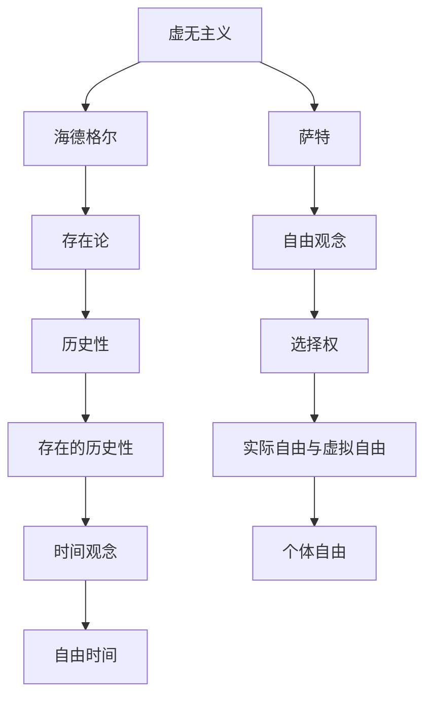

                 

### 文章标题

“海德格尔与萨特：虚无主义的不同回应”

### 关键词

虚无主义、海德格尔、萨特、存在主义、自由、哲学、当代哲学

### 摘要

本文旨在深入探讨海德格尔与萨特两位哲学家在虚无主义问题上的不同观点。通过对虚无主义的概念及其历史背景的介绍，本文将分别分析海德格尔和萨特的虚无主义观点，并比较两者之间的核心概念与差异。进一步，文章将探讨两位哲学家如何将他们的思想应用于现实世界，及其在当代哲学中的影响和地位。最终，本文将讨论虚无主义的未来趋势和面临的挑战，并展望未来的研究展望。通过本文的逐步分析，读者将能够更全面地理解虚无主义的本质及其在哲学领域的重要作用。

---

### 引言：虚无主义与两位哲学家的思想

虚无主义作为一种哲学思潮，自古以来便伴随着人类文明的演进。它不仅仅是对某种具体的信仰或价值观的否定，更是一种对存在本身的质疑和反思。虚无主义的概念根植于对生命意义、宇宙秩序以及人类本质的追问，这些追问往往指向人类存在的荒谬和无奈。从古代的希腊悲剧到中世纪的宗教哲学，再到现代的存在主义，虚无主义的思想贯穿于各个时期和不同文化背景中。

在20世纪的哲学史上，海德格尔（Martin Heidegger）和萨特（Jean-Paul Sartre）是两位对虚无主义进行深刻探讨的重要哲学家。他们的思想和作品不仅对当时的哲学界产生了深远的影响，而且至今仍在学术研究和思想讨论中占据重要地位。

#### 海德格尔的虚无主义观点

海德格尔的存在主义哲学强调存在的本质及其与时间的关系。他认为，存在并不是一个静态的实体，而是一种动态的、历史的进程。海德格尔的核心概念“存在”（Sein）不仅仅是指事物的存在状态，更是一种存在的本质和可能性。在海德格尔看来，虚无（Nichtigkeit）是存在的对立面，但它并不是一个简单的否定，而是存在的“无”，即存在的可能性空间。

海德格尔通过对“存在”的深入探讨，提出了他的虚无主义观点。他认为，虚无是存在的背景和前提，是存在的可能性条件。虚无并不是一种消极的存在，而是一种潜在的存在状态，是使存在成为可能的必要条件。海德格尔的这一观点在他的代表作《存在与时间》（Sein und Zeit）中得到了深刻的阐述。

#### 萨特的虚无主义观点

萨特的存在主义哲学则更加注重个体的自由和选择。他认为，存在先于本质，即人的本质不是预先设定的，而是在个体的选择和行动中不断形成的。萨特的虚无主义观点主要体现在他对自由和选择权的强调上。

萨特认为，虚无主义是一种对自由和责任的否定，但他同时也认为，正是通过承认虚无，个体才能获得真正的自由。萨特的代表作《存在与虚无》（L'Étre et le Néant）中，他详细阐述了虚无主义的概念及其在个体存在中的作用。在萨特看来，虚无并不是一种消极的存在，而是一种积极的、能够激发个体创造力的力量。

### 1.2 虚无主义的概念与历史背景

虚无主义作为一种哲学思潮，其起源可以追溯到古希腊哲学。在古希腊悲剧中，如索福克勒斯的《安提戈涅》和欧里庇得斯的《希波吕托斯》，虚无主义的主题得到了深刻的探讨。这些悲剧作品通过对人类命运的探讨，揭示了存在的荒谬和无奈。

中世纪的宗教哲学中，虚无主义的影子仍然存在。例如，奥古斯丁的哲学思想中包含了对于上帝存在的质疑，这可以视为一种早期的虚无主义表现。

进入现代，虚无主义的思想在尼采的作品中得到了进一步的阐述。尼采认为，上帝已死，人类面临着无意义的存在状态。他的虚无主义观点对后来的存在主义哲学产生了深远的影响。

20世纪的哲学家中，海德格尔和萨特是最为重要的两位。他们的思想和作品不仅对虚无主义进行了深入的探讨，而且对现代哲学的发展产生了重要影响。

#### 海德格尔的虚无主义观点

海德格尔的存在主义哲学强调存在的本质及其与时间的关系。他认为，存在并不是一个静态的实体，而是一种动态的、历史的进程。海德格尔的核心概念“存在”（Sein）不仅仅是指事物的存在状态，更是一种存在的本质和可能性。在海德格尔看来，虚无（Nichtigkeit）是存在的对立面，但它并不是一个简单的否定，而是存在的“无”，即存在的可能性空间。

海德格尔通过对“存在”的深入探讨，提出了他的虚无主义观点。他认为，虚无是存在的背景和前提，是存在的可能性条件。虚无并不是一种消极的存在，而是一种潜在的存在状态，是使存在成为可能的必要条件。海德格尔的这一观点在他的代表作《存在与时间》（Sein und Zeit）中得到了深刻的阐述。

在《存在与时间》中，海德格尔提出了“存在的历史性”（Historizität des Seins）概念。他认为，存在不是孤立存在的，而是在历史中展开的。历史是人类存在的具体表现形式，而虚无则是历史的背景和前提。海德格尔认为，只有在历史性的视角下，我们才能真正理解存在的本质。

海德格尔的虚无主义观点在哲学界引起了广泛的讨论。他的思想既挑战了传统的本体论观念，也为我们提供了一种新的理解存在的视角。然而，他的观点也遭到了一些批评，有人认为他的虚无主义思想过于悲观，忽视了人类存在的积极面。

#### 海德格尔的存在论

海德格尔的存在论是他哲学体系的核心，也是理解他虚无主义观点的关键。在海德格尔看来，存在（Sein）并非简单的“存在者”（Dasein）状态，而是存在的本质和可能性。他通过一系列哲学思考，试图揭示存在的深层含义。

海德格尔提出了“存在即存在”（Sein ist Sein）这一基本命题。这一命题看似简单，实则深奥。它意味着存在本身具有自身的本质，而这种本质并不是静态的，而是动态的、历史的。海德格尔认为，存在是不断展开的过程，而非固定的状态。

为了更好地理解存在的本质，海德格尔引入了“虚无”（Nichtigkeit）概念。虚无并非简单的“不存在”，而是一种存在的可能性空间。在这个空间中，存在得以展开和体现。海德格尔认为，虚无是存在的对立面，但并不是消极的否定，而是存在的必要条件。

海德格尔的存在论还涉及“存在的历史性”（Historizität des Seins）这一重要概念。他认为，存在不是孤立存在的，而是在历史中展开的。历史是人类存在的具体表现形式，而虚无则是历史的背景和前提。通过历史性的视角，海德格尔试图揭示存在的本质和意义。

#### 海德格尔对虚无主义的回应

海德格尔的虚无主义观点并不是一种简单的消极否定，而是一种深刻的哲学思考。他认为，虚无是存在的背景和前提，是使存在成为可能的必要条件。通过理解虚无，我们可以更深刻地理解存在的本质。

海德格尔认为，虚无并非是一种消极的存在，而是一种潜在的存在状态。虚无是我们存在的可能性空间，是存在得以展开的前提。在这个意义上，虚无是积极的，而非消极的。

海德格尔通过他的存在论，试图回应虚无主义带来的挑战。他认为，虚无并不是一种简单的“不存在”，而是一种存在的可能性空间。通过理解虚无，我们可以找到存在的真正意义和价值。

#### 萨特的虚无主义观念

萨特的存在主义哲学与海德格尔有所不同，尽管他们都关注存在的本质和意义，但萨特更注重个体的自由和选择。在萨特看来，虚无主义是一种对自由和责任的否定，但他同时也认为，正是通过承认虚无，个体才能获得真正的自由。

萨特的虚无主义观念主要体现在他对自由和选择的强调上。他认为，存在先于本质，即人的本质不是预先设定的，而是在个体的选择和行动中不断形成的。这意味着，人从出生那一刻起，就处于一种“虚无”的状态，因为没有人可以预先确定自己的本质。

在萨特的代表作《存在与虚无》（L'Étre et le Néant）中，他详细阐述了虚无主义的概念及其在个体存在中的作用。萨特认为，虚无主义并不是一种消极的哲学观点，而是一种能够激发个体创造力的力量。通过面对虚无，个体才能认识到自己的自由，并据此做出选择。

#### 萨特对自由的理解与回应

萨特的存在主义哲学中，自由是核心概念之一。他认为，自由是人的本质，是人在面对虚无时的选择能力。萨特将自由分为两种：实际自由（Effectif）和虚拟自由（Factice）。

实际自由是指个体在现实世界中做出的真实选择。这种选择是自主的，不受任何外在因素的制约。萨特认为，只有通过实际自由，个体才能实现自己的存在。

虚拟自由则是指个体在面对困境时选择逃避自由。这种选择是自欺的，个体通过放弃自由来逃避现实。萨特认为，虚拟自由是一种自我欺骗，是对自由的否定。

萨特通过对自由和虚拟自由的区分，强调了个体在面对虚无时的重要选择。他认为，只有通过面对虚无，个体才能认识到自己的自由，并据此做出真实的选择。

#### 海德格尔的“存在”与萨特的“存在”

海德格尔和萨特在“存在”这一核心概念上有着显著的不同。海德格尔的“存在”强调存在的本质和可能性，他认为存在是一种动态的历史进程，与时间紧密相连。而萨特的“存在”则更侧重于个体的自由和选择，他认为存在是在个体的行动中不断形成的。

海德格尔的存在是一种“在世”（Dasein）的存在，强调人类的存在是在具体的历史和文化背景下展开的。他认为，人的存在是一种“存在的存在”（Sein zum Tode），即人类的存在总是向着死亡的存在。

萨特的存在则是一种“自由的存在”（L'Étre libre），他认为人的存在是从虚无中诞生的，是一种不断选择和创造的过程。萨特的存在主义强调个体的自主性和创造性，他认为人类的存在是一种“自由的冒险”。

#### 海德格尔的时间观念与萨特的时间观念

海德格尔和萨特在时间观念上也存在显著差异。海德格尔的时间观念强调存在的动态性和历史性。他认为，时间不是一种线性的、单向的进程，而是一种“存在的时间”（Seinszeit），即时间与存在的本质紧密相连。

海德格尔将时间分为“过往”（Gegenwart）、“过去”（Vergangenheit）和“未来”（Zukunft）。他认为，过往是存在的背景，未来是存在的可能性，而当下则是存在的现实展开。这种时间观念体现了海德格尔对存在的深刻理解。

萨特的时间观念则更加侧重于个体的自由和选择。他认为，时间是一种个体的“自由时间”（Temps libre），即个体可以在时间中自由选择和行动。萨特的时间观念强调个体的自主性和创造性，他认为人类的存在是在时间的自由选择中不断展开的。

#### 两位哲学家对虚无主义的不同理解

海德格尔和萨特对虚无主义有着不同的理解。海德格尔认为虚无是存在的背景和前提，是存在的可能性空间。他认为虚无并不是一种消极的存在，而是一种潜在的存在状态，是使存在成为可能的必要条件。

萨特则将虚无视为个体的自由和选择的基础。他认为虚无是一种激发个体创造力的力量，通过面对虚无，个体才能认识到自己的自由，并据此做出选择。他认为虚无主义并不是一种消极的哲学观点，而是一种能够激发个体创造力的力量。

#### 海德格尔的政治哲学

海德格尔的政治哲学深受他的存在主义思想影响。他认为，政治活动不仅仅是权力的争夺，更是存在本身的展现。海德格尔在《林中对话》（Der Ursprung des Humanities）中提出，“政治”意味着“居所”（Dwelling），即人类共同存在的空间。

海德格尔的政治哲学强调“共同体”（Gemeinschaft）的重要性。他认为，真正的政治应当是关于存在的共同讨论和探索，而不是简单的权力斗争。他提出了“人民的真理”（Volksthümlichkeit der Wahrheit）概念，主张政治活动应当基于真理的追求，而非权力的掌握。

然而，海德格尔的政治哲学也受到了广泛的批评。有人认为，他的共同体观念带有纳粹色彩，忽略了个体的重要性。尽管如此，海德格尔的政治哲学仍然为我们提供了关于政治与存在关系的深刻思考。

#### 萨特的社会批判

萨特的社会批判哲学同样基于他的存在主义思想。他认为，社会现实是由个体之间的关系和互动构成的，而社会的不公和压迫则是个体自由选择的结果。

萨特在《恶心》（La Nausée）和《墙》（La Mort dans la Vie）等作品中，通过主人公的经历，揭示了社会现实中的不公和压迫。他认为，社会的不公根源在于人类对自由的否定，只有通过个体的反抗和行动，才能打破这种不公。

萨特的社会批判哲学强调了个体在社会变革中的重要作用。他认为，个体不仅应当认识到自己的自由，还应当通过行动来争取自由，实现社会的公正和进步。

#### 两位哲学家的现实应用

海德格尔和萨特的思想在现实世界中有着广泛的应用。他们的存在主义哲学为个体在面对困境时提供了深刻的思考框架。在个人层面，人们可以借鉴海德格尔对存在的理解，认识到自己存在的意义和价值；而萨特的自由观念则鼓励个体勇敢地面对虚无，通过自主选择来塑造自己的命运。

在公共领域，海德格尔的政治哲学为社会提供了关于共同体和真理的思考。他的观点强调了政治活动应当基于对存在的共同探讨，而非权力的争夺。萨特的社会批判哲学则为社会变革提供了动力，鼓励个体通过反抗和行动来争取社会的公正和进步。

#### 虚无主义在当代哲学中的地位

虚无主义在当代哲学中占据重要地位，其影响贯穿于各种哲学流派和思想体系中。尽管虚无主义被认为是一种消极的哲学思潮，但它对存在、自由和个体身份等核心哲学问题的深刻探讨，使其在哲学界始终保持着生命力。

在当代哲学中，虚无主义不仅与存在主义紧密相连，还与其他哲学思潮如结构主义、后现代主义和批判理论等产生了深远的影响。这些思潮在探讨个体存在的荒谬性和社会现实的不公时，常常借鉴和引用虚无主义的观点，从而丰富了哲学研究的视野和深度。

#### 海德格尔与萨特对当代哲学的影响

海德格尔和萨特对当代哲学的影响不可忽视。他们的存在主义哲学不仅为个体提供了关于存在和自由的理解，还深刻影响了其他哲学流派和学术领域。

海德格尔的存在论为当代哲学提供了关于存在本质和意义的深刻思考。他的观点挑战了传统的本体论观念，为后来的哲学研究开辟了新的路径。在文学、艺术和心理学等领域，海德格尔的思想也得到了广泛的运用和探讨。

萨特的存在主义哲学则强调了个体自由和责任的重要性。他的观点激发了人们对自由和选择的思考，对后来的社会运动和人权斗争产生了重要影响。在政治哲学、道德哲学和社会学等领域，萨特的思想仍然具有重要的指导意义。

#### 当代哲学对海德格尔与萨特的回应

尽管海德格尔和萨特的思想在当代哲学中具有重要地位，但它们也受到了广泛的批评和回应。一些哲学家认为，他们的虚无主义观点过于悲观，忽视了人类存在的积极面。例如，存在主义的悲观主义被批评为一种消极的人生态度，不利于社会的进步和发展。

另一些哲学家则试图在海德格尔和萨特的思想中寻找新的解释路径。他们通过重新解读和重构海德格尔和萨特的思想，提出了新的哲学观念和理论。这种回应不仅丰富了当代哲学的研究，也为虚无主义在现代社会中的应用提供了新的可能性。

#### 虚无主义的未来趋势

虚无主义作为一种哲学思潮，其未来趋势受到多方面因素的影响。首先，全球化和社会变革带来的不确定性为虚无主义提供了新的土壤。在现代社会中，人们面临着越来越多的困境和挑战，这些困境往往与虚无主义的思想密切相关。

其次，科技进步和人工智能的发展也可能影响虚无主义的未来趋势。随着科技的发展，人们对存在的本质和意义有了新的认识，这可能会对虚无主义产生新的理解和解释。

此外，虚无主义在文学、艺术和影视作品中的表现也为其未来趋势提供了重要线索。这些作品通过虚构的世界和人物，探讨了存在的荒谬性和个体的自由选择，从而为虚无主义的未来研究提供了丰富的素材。

#### 对虚无主义的批判与反思

虚无主义作为一种哲学思潮，尽管在探讨存在、自由和个体身份等问题上具有独特的贡献，但也受到了广泛的批判和反思。一些哲学家认为，虚无主义过于悲观，忽视了人类存在的积极面和希望。他们认为，虚无主义可能导致个体和社会的消极情绪，甚至对人类的进步产生阻碍。

例如，存在主义的悲观主义被批评为一种消极的人生态度。它强调个体的孤独和无助，可能导致人们对生活的消极态度。此外，虚无主义对传统价值观和信仰的否定，也被认为是一种不负责任的思想。

尽管存在这些批判，虚无主义作为一种哲学思潮，其深刻的思想内涵仍然值得我们反思。通过批判和反思，我们可以更全面地理解虚无主义的本质，并在现代社会中找到新的应用和价值。

#### 未来的虚无主义研究展望

未来的虚无主义研究将面临多方面的挑战和机遇。首先，随着全球化和社会变革的深入，虚无主义研究需要更全面地探讨现代社会的困境和挑战。例如，科技进步和人工智能的发展如何影响虚无主义的理解和应用。

其次，跨学科的研究方法将为虚无主义研究带来新的视角和思路。哲学、心理学、社会学、文学等学科之间的交叉研究，可以帮助我们更深入地理解虚无主义的本质和影响。

此外，未来虚无主义研究也需要关注不同文化和地区的独特经验。通过比较不同文化背景下的虚无主义观念，我们可以更全面地理解这一哲学思潮的多样性。

### 附录A 海德格尔与萨特著作推荐

为了深入理解海德格尔和萨特的哲学思想，以下是一些推荐的经典著作：

#### 海德格尔

1. **《存在与时间》（Sein und Zeit）** - 这是海德格尔最著名的作品，全面阐述了他的存在主义哲学思想。
2. **《林中对话》（Der Ursprung des Humanities）** - 探讨了政治与存在的深刻关系。
3. **《尼采》（Nietzsche）** - 分析了尼采哲学对海德格尔思想的影响。

#### 萨特

1. **《存在与虚无》（L'Étre et le Néant）** - 这是萨特的代表作，详细阐述了他的虚无主义观念。
2. **《恶心》（La Nausée）** - 通过主人公的经历，探讨了存在的荒谬性和个体的自由选择。
3. **《墙》（La Mort dans la Vie）** - 描述了主人公在集中营中的经历，揭示了社会现实中的不公和压迫。

这些著作不仅为我们提供了理解两位哲学家思想的重要路径，也为虚无主义的研究提供了丰富的理论资源。

### 附录B 虚无主义研究参考文献

为了进一步探讨虚无主义的哲学内涵和现实应用，以下是一些重要的参考文献：

1. **尼采（Friedrich Nietzsche）**，《查拉图斯特拉如是说》（Thus Spoke Zarathustra） - 尼采的这部作品对虚无主义哲学有着深远的影响。
2. **亚里士多德（Aristotle）**，《尼各马可伦理学》（Nicomachean Ethics） - 亚里士多德对道德和幸福的探讨为理解虚无主义提供了重要视角。
3. **卡尔·雅思贝尔斯（Karl Jaspers）**，《哲学》（Philosophical Investigation） - 雅思贝尔斯通过对存在的探讨，为理解虚无主义提供了深刻的思考。
4. **阿尔贝·加缪（Albert Camus）**，《局外人》（The Stranger） - 加缪的小说通过主人公的经历，展现了虚无主义的现实应用。

这些文献为我们提供了多元的视角，有助于深入理解虚无主义的哲学内涵和现实意义。

### 附录C Mermaid 流程图

以下是关于海德格尔和萨特哲学思想的Mermaid流程图，展示了两位哲学家核心概念之间的关系：

通过这个流程图，我们可以清晰地看到海德格尔和萨特在虚无主义问题上的核心观点及其相互关系。这为我们的进一步研究提供了直观的辅助工具。

### 文章小结

本文通过深入探讨海德格尔和萨特在虚无主义问题上的不同观点，揭示了两位哲学家在存在、自由和历史性等核心概念上的差异。通过对海德格尔的存在论和萨特的存在主义哲学的详细分析，我们不仅理解了他们各自对虚无主义的回应，也看到了他们在现实应用和社会批判中的独特贡献。

海德格尔强调存在的动态性和历史性，认为虚无是存在的可能性空间。他的政治哲学关注共同体和真理的追求。萨特则注重个体的自由和选择，认为自由是个体存在的核心。他的社会批判哲学鼓励个体通过反抗和行动来争取社会公正。

虚无主义作为一种哲学思潮，虽然在当代哲学中具有复杂的地位和影响，但其对存在、自由和个体身份的深刻探讨仍然具有重要的学术价值和现实意义。未来的研究可以进一步探讨虚无主义在全球化背景下的新趋势，以及跨学科的研究方法如何丰富虚无主义的理论体系。

通过本文的分析，我们不仅拓宽了对虚无主义的理解，也为未来的哲学研究提供了新的思路和视角。希望读者能从中获得启发，进一步思考虚无主义的本质和意义。

