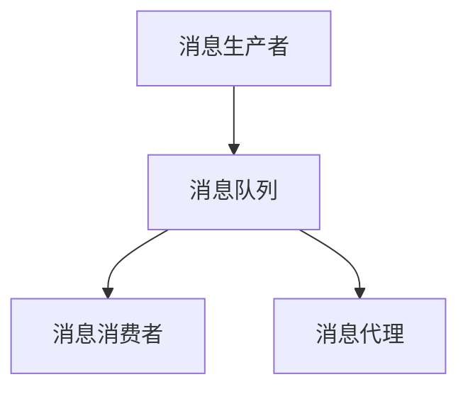

                 

### 消息队列：解耦系统组件的有效手段

#### 关键词：消息队列，解耦，系统组件，异步处理，分布式系统，性能优化，安全性

#### 摘要：

在现代软件开发中，随着系统的复杂性不断增加，各个系统组件之间的依赖关系也变得愈发复杂。如何有效地解耦系统组件，提高系统的可维护性和扩展性成为了一个重要课题。消息队列作为一种常用的解耦手段，能够有效地解决分布式系统中组件间的通信问题，提升系统的性能和可靠性。本文将深入探讨消息队列的基本概念、工作原理、应用场景以及性能优化和安全性设计，并结合实际案例进行分析，为开发者提供一套全面的指南。

---

## 引言

随着互联网和云计算技术的快速发展，软件系统越来越复杂，系统之间的交互需求也日益增长。在分布式系统中，各个组件需要协同工作，但同时也存在着高度的依赖关系，这种依赖关系在一定程度上限制了系统的可维护性和扩展性。如何降低系统组件之间的耦合度，提高系统的灵活性和可扩展性成为软件开发中的一个重要挑战。

消息队列正是为了解决这一问题而出现的。消息队列（Message Queue）是一种用于在分布式系统中传递消息的中间件技术，它充当着系统组件之间的通信桥梁，使得组件之间的依赖关系得到有效解耦。通过消息队列，系统组件可以独立开发、独立部署和独立运行，从而提高了系统的可维护性和可扩展性。

本文将围绕消息队列的核心概念、工作原理、应用场景、性能优化和安全性设计等方面进行深入探讨，帮助读者全面了解消息队列的技术原理和应用方法。

---

## 消息队列基本概念

### 定义

消息队列是一种用于在分布式系统中传递消息的中间件技术。它允许系统组件通过发送和接收消息来实现通信，而无需直接建立网络连接或共享数据存储。消息队列通常由一个或多个消息代理（Message Broker）和多个消息生产者（Producer）和消息消费者（Consumer）组成。

### 主要用途

消息队列的主要用途包括：

1. **异步处理**：消息队列可以用于实现异步处理，将耗时的任务从主线程中分离出来，从而提高系统的响应速度和吞吐量。
2. **分布式系统协调**：消息队列可以用于分布式系统中的任务协调和状态同步，确保系统组件之间的协作和一致性。
3. **负载均衡**：消息队列可以用于实现负载均衡，将任务分配到不同的处理节点上，从而提高系统的性能和可靠性。
4. **数据流处理**：消息队列可以用于实现实时数据流处理，将大量数据传输到处理节点，进行实时分析和处理。

### 架构

消息队列的基本架构通常包括以下几个部分：

1. **消息代理**：消息代理负责维护消息队列的状态，管理消息的发送和接收。它是消息队列的核心组件，通常实现为一个高性能的服务器。
2. **消息生产者**：消息生产者是系统中的消息发送方，它负责将消息发送到消息队列中。
3. **消息消费者**：消息消费者是系统中的消息接收方，它从消息队列中接收消息并处理。
4. **消息队列**：消息队列是存储消息的数据结构，它通常实现为一个持久化存储，以确保消息的可靠传输和持久化。

### Mermaid流程图

为了更直观地展示消息队列的架构，我们可以使用Mermaid绘制一个简化的流程图：



在这个流程图中，消息生产者发送消息到消息队列，消息代理负责维护消息队列的状态，并将消息转发给消息消费者进行处理。

---

## 消息队列的工作原理

### 消息传递机制

消息队列的核心功能是消息传递，它通过消息生产者、消息队列和消息消费者之间的交互来实现。以下是一个简化的伪代码示例，用于阐述消息队列的基本消息传递机制：

```pseudo
// 消息生产者
function produceMessage(queue, message) {
    queue.enqueue(message);
    print("Message produced: " + message);
}

// 消息消费者
function consumeMessage(queue) {
    message = queue.dequeue();
    print("Message consumed: " + message);
    processMessage(message);
}

// 消息处理
function processMessage(message) {
    // 实现消息处理逻辑
    print("Processing message: " + message);
}
```

在这个伪代码中，`produceMessage`函数用于将消息发送到消息队列，`consumeMessage`函数用于从消息队列中取出消息并处理，而`processMessage`函数则负责具体的消息处理逻辑。

### 消息持久化

消息队列的一个关键特性是其持久化能力，即消息队列能够将消息持久化存储到磁盘上，以确保消息不会在系统故障或重启时丢失。消息持久化主要有以下两种方式：

1. **文件存储**：将消息持久化存储到文件系统中，这种方式简单易实现，但性能较低。
2. **数据库存储**：将消息持久化存储到数据库中，这种方式提供了更高的性能和可靠性，但实现较为复杂。

消息持久化的重要性在于，它保证了消息队列的可靠性和持久性。即使在系统发生故障的情况下，消息队列也能确保消息的完整性和一致性。

### 消息持久化方案

消息持久化的具体方案取决于系统的需求和场景。以下是一个简单的消息持久化方案示例：

```pseudo
// 消息持久化
function persistMessage(message) {
    // 将消息存储到文件系统中
    fileSystem.write(message);
}

// 消息恢复
function recoverMessage() {
    // 从文件系统中读取消息
    message = fileSystem.read();
    return message;
}
```

在这个方案中，`persistMessage`函数用于将消息存储到文件系统中，而`recoverMessage`函数用于从文件系统中读取消息。

### 消息持久化的重要性

消息持久化的重要性主要体现在以下几个方面：

1. **确保消息可靠性**：通过将消息持久化存储，可以确保消息不会在系统故障或重启时丢失，从而提高了系统的可靠性和稳定性。
2. **支持回滚操作**：在分布式系统中，可能会发生消息处理失败的情况。通过消息持久化，可以实现消息的回滚操作，确保系统的数据一致性。
3. **支持消息查询**：通过消息持久化，可以实现对消息的查询和检索，方便系统进行故障排查和性能优化。

---

## 主流消息队列技术

在消息队列领域，有几种主流的技术，每种技术都有其独特的特点和应用场景。以下是对ActiveMQ、RabbitMQ和Kafka这三种主流消息队列技术的介绍。

### ActiveMQ

#### 特点

ActiveMQ是一个开源的消息中间件，基于JMS（Java Message Service）规范实现。它具有以下特点：

1. **跨语言支持**：ActiveMQ支持多种编程语言，包括Java、C++、Python等。
2. **高性能**：ActiveMQ具有高性能的消息传递能力，支持高并发和大规模分布式系统。
3. **可靠传输**：ActiveMQ提供了多种消息传输保证，包括At-least-Once、Exactly-Once和Idempotent等。

#### 安装与配置

安装ActiveMQ通常可以通过以下步骤：

1. 下载ActiveMQ的安装包。
2. 解压安装包并启动ActiveMQ服务。
3. 使用Web界面进行配置和管理。

以下是一个简单的配置示例：

```bash
# 启动ActiveMQ
activemq start

# 访问ActiveMQ管理界面
http://localhost:8161/admin
```

### RabbitMQ

#### 特点

RabbitMQ是一个开源的的消息中间件，基于AMQP（Advanced Message Queuing Protocol）规范实现。它具有以下特点：

1. **高可靠性**：RabbitMQ提供了多种可靠性保证，包括持久化、事务和确认机制。
2. **灵活的路由**：RabbitMQ支持复杂的消息路由和消息过滤，可以通过交换器和路由键实现精确的消息分发。
3. **分布式集群**：RabbitMQ支持分布式集群，可以通过多节点实现高可用性和负载均衡。

#### 安装与配置

安装RabbitMQ通常可以通过以下步骤：

1. 下载RabbitMQ的安装包。
2. 解压安装包并启动RabbitMQ服务。
3. 使用命令行工具进行配置和管理。

以下是一个简单的配置示例：

```bash
# 安装Erlang
sudo apt-get install erlang

# 安装RabbitMQ
sudo apt-get install rabbitmq-server

# 启动RabbitMQ
sudo rabbitmq-server start

# 访问RabbitMQ管理界面
http://localhost:15672/
```

### Kafka

#### 特点

Kafka是一个分布式消息系统，由LinkedIn开发并捐赠给Apache基金会。它具有以下特点：

1. **高吞吐量**：Kafka设计用于处理大规模数据流，具有极高的消息吞吐量。
2. **持久化存储**：Kafka使用磁盘存储消息，支持持久化存储，确保消息不会丢失。
3. **高可用性**：Kafka支持分布式集群和副本机制，确保系统的高可用性和容错能力。

#### 安装与配置

安装Kafka通常可以通过以下步骤：

1. 下载Kafka的安装包。
2. 解压安装包并启动Kafka服务。
3. 配置Kafka的集群和主题。

以下是一个简单的配置示例：

```bash
# 安装Zookeeper
sudo apt-get install zookeeper

# 安装Kafka
sudo apt-get install kafka

# 启动Kafka
sudo kafka-server-start.sh /path/to/kafka/config/server.properties

# 访问Kafka管理界面
http://localhost:9092/
```

---

## 消息队列应用场景

### 异步处理

异步处理是消息队列的一个重要应用场景。在分布式系统中，某些任务可能需要较长时间才能完成，如果直接在主线程中执行这些任务，会导致系统响应缓慢。通过消息队列，可以将这些耗时任务异步处理，从而提高系统的性能和响应速度。

以下是一个简单的伪代码示例，用于实现异步处理：

```pseudo
// 消息生产者
function produceMessage(queue, message) {
    queue.enqueue(message);
    print("Message produced: " + message);
}

// 消息消费者
function consumeMessage(queue) {
    message = queue.dequeue();
    print("Message consumed: " + message);
    processMessage(message);
}

// 消息处理
function processMessage(message) {
    // 模拟耗时任务
    sleep(5);
    print("Processing message: " + message);
}
```

在这个示例中，`processMessage`函数模拟了一个耗时任务，通过将任务异步处理，可以显著提高系统的响应速度。

### 分布式系统协调

分布式系统中的任务协调和状态同步是另一个常见的应用场景。通过消息队列，可以实现对分布式系统中各个节点的任务协调和状态同步，确保系统的一致性和可靠性。

以下是一个简单的伪代码示例，用于实现分布式系统协调：

```pseudo
// 消息生产者
function produceMessage(queue, message) {
    queue.enqueue(message);
    print("Message produced: " + message);
}

// 消息消费者
function consumeMessage(queue) {
    message = queue.dequeue();
    print("Message consumed: " + message);
    processMessage(message);
}

// 消息处理
function processMessage(message) {
    // 模拟分布式任务处理
    print("Processing distributed task: " + message);
    // 更新系统状态
    updateSystemState(message);
}

// 系统状态更新
function updateSystemState(message) {
    // 更新系统状态逻辑
    print("System state updated: " + message);
}
```

在这个示例中，通过消息队列，可以实现对分布式系统中各个节点的任务协调和状态同步，确保系统的一致性和可靠性。

---

## 消息队列性能优化

### 消息队列性能指标

消息队列的性能优化是一个重要但复杂的话题。为了有效地进行性能优化，我们首先需要了解一些关键的性能指标：

1. **吞吐量（Throughput）**：吞吐量是指单位时间内系统能够处理的消息数量，通常以每秒消息数（Messages per second, MPS）来衡量。
2. **延迟（Latency）**：延迟是指消息从生产者发送到消费者所需的时间，通常以毫秒（ms）来衡量。
3. **并发度（Concurrency）**：并发度是指系统同时处理的消息数量，通常与系统资源（如CPU、内存）相关。
4. **可靠性（Reliability）**：可靠性是指系统能够在特定时间内正确处理消息的能力，通常通过消息丢失率来衡量。

### 负载均衡

负载均衡是消息队列性能优化的一项关键技术。通过负载均衡，可以将消息均匀分配到多个处理节点上，从而提高系统的吞吐量和响应速度。

以下是一个简单的负载均衡算法示例：

```pseudo
// 负载均衡算法
function loadBalance(queues) {
    totalMessages = 0;
    for (queue in queues) {
        totalMessages += queue.size();
    }

    messagePerQueue = totalMessages / queues.length;
    for (queue in queues) {
        while (queue.size() > messagePerQueue) {
            message = queue.dequeue();
            nextQueue = getNextQueue(queues);
            queue.enqueue(message);
        }
    }
}

// 获取下一个处理队列
function getNextQueue(queues) {
    // 实现逻辑，根据当前队列的负载情况选择下一个队列
}
```

在这个示例中，`loadBalance`函数用于将消息均匀分配到多个处理队列上，从而实现负载均衡。

### 消息持久化速度

消息持久化速度是影响消息队列性能的重要因素。通过优化消息持久化策略，可以提高消息队列的处理速度。

以下是一个简单的消息持久化优化策略示例：

```pseudo
// 消息持久化优化
function optimizePersistence(queue) {
    // 检查磁盘空间
    if (diskSpaceIsLow()) {
        // 禁用持久化
        queue.enablePersistence(false);
    } else {
        // 启用持久化
        queue.enablePersistence(true);
    }
}

// 检查磁盘空间
function diskSpaceIsLow() {
    // 实现逻辑，检查磁盘空间是否不足
}
```

在这个示例中，`optimizePersistence`函数用于根据磁盘空间情况动态调整消息持久化策略，从而提高消息队列的处理速度。

---

## 消息队列安全性与可靠性

### 消息队列安全机制

消息队列的安全性和可靠性对于确保系统稳定运行至关重要。以下是一些常用的安全机制：

1. **认证与授权**：消息队列通常支持用户认证和授权机制，确保只有经过授权的用户和应用程序才能访问消息队列。
2. **传输加密**：通过SSL/TLS等加密协议，可以确保消息在传输过程中的安全性。
3. **消息签名与验证**：对消息进行签名和验证，可以确保消息的完整性和真实性。
4. **防火墙与网络隔离**：通过防火墙和网络隔离，可以限制消息队列的访问范围，防止未经授权的访问。

### 消息队列可靠性设计

消息队列的可靠性设计主要包括以下几个方面：

1. **消息确认机制**：通过消息确认机制，确保消息被正确处理。消息确认机制通常包括发送确认（Acknowledgment）和消费者确认（Consumer Acknowledgment）。
2. **数据备份与恢复**：通过数据备份和恢复策略，确保在系统故障或灾难情况下能够迅速恢复消息队列的服务。
3. **分布式集群**：通过分布式集群和副本机制，提高消息队列的可靠性和容错能力。

以下是一个简单的消息确认机制示例：

```pseudo
// 消息生产者
function produceMessage(queue, message) {
    queue.enqueue(message);
    print("Message produced: " + message);
}

// 消息消费者
function consumeMessage(queue) {
    message = queue.dequeue();
    print("Message consumed: " + message);
    processMessage(message);
    queue.acknowledge(message);
}

// 消息处理
function processMessage(message) {
    // 实现消息处理逻辑
    print("Processing message: " + message);
    // 发送确认
    sendAcknowledgment(message);
}

// 发送确认
function sendAcknowledgment(message) {
    // 实现逻辑，发送消息确认
}
```

在这个示例中，`consumeMessage`函数在处理消息后调用`acknowledge`函数发送确认，确保消息被正确处理。

### 数据备份与恢复

数据备份与恢复策略是确保消息队列可靠性的重要手段。以下是一个简单的数据备份与恢复策略示例：

```pseudo
// 数据备份
function backupMessages() {
    // 实现逻辑，将消息队列中的消息备份到外部存储
}

// 数据恢复
function recoverMessages() {
    // 实现逻辑，从外部存储中恢复消息队列中的消息
}
```

在这个示例中，`backupMessages`函数用于将消息队列中的消息备份到外部存储，而`recoverMessages`函数用于从外部存储中恢复消息队列中的消息。

---

## 消息队列项目实战

### 实战一：异步消息处理

在本实战中，我们将使用RabbitMQ实现一个简单的异步消息处理系统。该系统将接收来自Web应用程序的用户请求，并将这些请求异步处理，从而提高系统的响应速度和吞吐量。

#### 开发环境搭建

1. 安装Erlang和RabbitMQ：

```bash
sudo apt-get install erlang
sudo apt-get install rabbitmq-server
```

2. 启动RabbitMQ服务：

```bash
sudo rabbitmq-server start
```

3. 访问RabbitMQ管理界面：

```bash
http://localhost:15672/
```

#### 源代码实现

以下是RabbitMQ的Python客户端Pika的简单使用示例，用于实现消息生产者和消费者：

```python
# 生产者
import pika

connection = pika.BlockingConnection(pika.ConnectionParameters('localhost'))
channel = connection.channel()

channel.queue_declare(queue='task_queue', durable=True)

messages = ['Hello World!', 'Hello World!', 'Hello World!']

for message in messages:
    channel.basic_publish(
        exchange='',
        routing_key='task_queue',
        body=message,
        properties=pika.BasicProperties(delivery_mode=2)  # 使消息持久化
    )
    print(f" [x] Sent {message}")

connection.close()

# 消费者
import pika

def callback(ch, method, properties, body):
    print(f" [x] Received {body}")
    # 模拟消息处理耗时
    time.sleep(1)
    print(f" [x] Done processing {body}")

connection = pika.BlockingConnection(pika.ConnectionParameters('localhost'))
channel = connection.channel()

channel.queue_declare(queue='task_queue', durable=True)

channel.basic_consume(
    queue='task_queue',
    on_message_callback=callback,
    auto_ack=True
)

print(' [*] Waiting for messages. To exit press CTRL+C')
channel.start_consuming()
```

在这个示例中，我们首先定义了一个消息生产者，用于向`task_queue`队列发送消息。消息生产者使用`durable=True`参数确保消息持久化，以便在系统重启时不会丢失。

然后，我们定义了一个消息消费者，用于从`task_queue`队列接收消息并处理。消息消费者使用`auto_ack=True`参数自动确认消息已被处理。

#### 代码解读与分析

在这个示例中，我们使用了Pika库来操作RabbitMQ。Pika是一个开源的Python RabbitMQ客户端，它提供了对RabbitMQ的简单、直接的API调用。

- `connection = pika.BlockingConnection(pika.ConnectionParameters('localhost'))`：创建一个到本地RabbitMQ服务器的阻塞式连接。
- `channel = connection.channel()`：创建一个通道，用于与RabbitMQ进行通信。
- `channel.queue_declare(queue='task_queue', durable=True)`：声明一个名为`task_queue`的持久化队列。
- `channel.basic_publish(...)`：用于发送消息。`delivery_mode=2`参数确保消息持久化。
- `channel.basic_consume(...)`：用于接收消息。`auto_ack=True`参数自动确认消息已被处理。
- `callback(ch, method, properties, body)`：消息处理回调函数，用于处理接收到的消息。

通过这个示例，我们可以看到如何使用消息队列实现异步处理。消息生产者将消息发送到消息队列，消息消费者从消息队列中取出消息进行处理，从而实现任务的异步处理，提高系统的响应速度和吞吐量。

### 实战二：分布式系统协调

在本实战中，我们将使用RabbitMQ实现一个简单的分布式系统协调系统。该系统将处理分布式系统中的任务分配和状态同步，确保各个节点之间的协调和一致性。

#### 开发环境搭建

1. 安装Erlang和RabbitMQ（如上所述）。

2. 启动RabbitMQ服务：

```bash
sudo rabbitmq-server start
```

3. 访问RabbitMQ管理界面：

```bash
http://localhost:15672/
```

#### 源代码实现

以下是RabbitMQ的Python客户端Pika的简单使用示例，用于实现消息生产者和消费者：

```python
# 任务分配者
import pika

connection = pika.BlockingConnection(pika.ConnectionParameters('localhost'))
channel = connection.channel()

channel.queue_declare(queue='task_queue', durable=True)

tasks = ['Task 1', 'Task 2', 'Task 3']

for task in tasks:
    channel.basic_publish(
        exchange='',
        routing_key='task_queue',
        body=task,
        properties=pika.BasicProperties(delivery_mode=2)  # 使消息持久化
    )
    print(f" [x] Sent {task}")

connection.close()

# 任务执行者
import pika

def callback(ch, method, properties, body):
    print(f" [x] Received {body}")
    # 模拟任务处理耗时
    time.sleep(1)
    print(f" [x] Done processing {body}")
    # 更新任务状态
    updateTaskStatus(method.routing_key, 'Completed')

connection = pika.BlockingConnection(pika.ConnectionParameters('localhost'))
channel = connection.channel()

channel.queue_declare(queue='task_queue', durable=True)

channel.basic_consume(
    queue='task_queue',
    on_message_callback=callback,
    auto_ack=True
)

print(' [*] Waiting for messages. To exit press CTRL+C')
channel.start_consuming()

# 状态更新
import requests

def updateTaskStatus(routing_key, status):
    task_id = routing_key.split('.')[1]
    url = f'http://localhost:8080/tasks/{task_id}/status'
    headers = {'Content-Type': 'application/json'}
    data = {'status': status}
    response = requests.put(url, headers=headers, json=data)
    print(f" [x] Updated task status: {response.text}")
```

在这个示例中，我们定义了一个任务分配者，用于向`task_queue`队列发送任务。任务分配者使用`durable=True`参数确保消息持久化，以便在系统重启时不会丢失。

然后，我们定义了一个任务执行者，用于从`task_queue`队列接收任务并处理。任务执行者使用`auto_ack=True`参数自动确认任务已被处理，并在处理完成后更新任务状态。

#### 代码解读与分析

在这个示例中，我们同样使用了Pika库来操作RabbitMQ。以下是关键代码的解读：

- `channel.queue_declare(queue='task_queue', durable=True)`：声明一个名为`task_queue`的持久化队列。
- `channel.basic_publish(...)`：用于发送任务。`delivery_mode=2`参数确保任务持久化。
- `channel.basic_consume(...)`：用于接收任务。`auto_ack=True`参数自动确认任务已被处理。
- `callback(ch, method, properties, body)`：任务处理回调函数，用于处理接收到的任务。
- `updateTaskStatus(routing_key, status)`：用于更新任务状态，通过HTTP请求将状态更新发送到任务管理服务器。

通过这个示例，我们可以看到如何使用消息队列实现分布式系统协调。任务分配者将任务发送到消息队列，任务执行者从消息队列中取出任务进行处理，并在处理完成后更新任务状态，从而实现分布式系统中的任务协调和状态同步。

---

## 最佳实践与总结

### 最佳实践

1. **选择合适的消息队列技术**：根据系统的需求和场景选择合适的消息队列技术，如ActiveMQ、RabbitMQ或Kafka。
2. **合理设计消息格式**：设计简洁、可扩展的消息格式，确保消息能够被正确解析和处理。
3. **优化消息持久化策略**：根据系统的需求和资源情况，选择合适的消息持久化策略，如文件存储或数据库存储。
4. **监控与报警**：对消息队列进行实时监控和报警，及时发现和处理性能问题和故障。
5. **安全性设计**：确保消息队列的安全性，包括认证与授权、传输加密和消息签名与验证。

### 小结

消息队列是一种重要的分布式系统技术，能够有效地解耦系统组件，提高系统的可维护性和扩展性。通过本文的介绍，我们了解了消息队列的基本概念、工作原理、应用场景、性能优化和安全性设计。在实际项目中，开发者应根据具体需求和场景选择合适的消息队列技术，并遵循最佳实践，确保消息队列系统的稳定、可靠和高效运行。

### 注意事项

1. **消息顺序保证**：在处理消息时，应确保消息的顺序，避免因顺序错误导致的数据不一致。
2. **消息批量处理**：在处理大量消息时，可以考虑批量处理以提高效率。
3. **消息路由策略**：合理设计消息路由策略，确保消息能够被正确分发和处理。

### 拓展阅读

1. 《RabbitMQ实战》
2. 《消息队列实战》
3. 《分布式系统设计》

---

### 作者信息

作者：AI天才研究院/AI Genius Institute & 禅与计算机程序设计艺术 /Zen And The Art of Computer Programming

本文由AI天才研究院和《禅与计算机程序设计艺术》作者联合撰写，旨在为开发者提供关于消息队列的全面指南。如有疑问或建议，欢迎联系我们。

